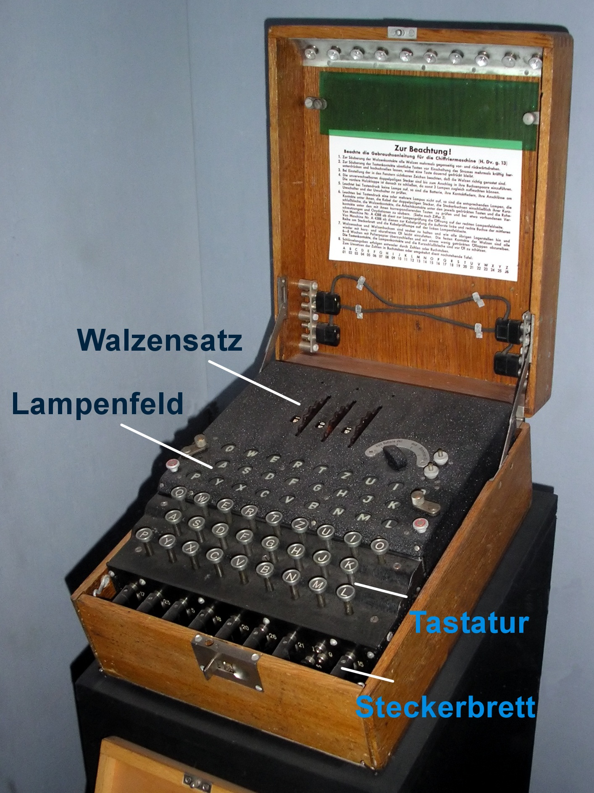

Stały adres serii wpisów o Enigmie - [/blog/enigma](/blog/enigma)

### Wstęp

Tematem niniejszego wpisu jest techniczny opis mechaniki Enigmy, sposobu działania.

Dla jasności: opis dotyczy pierwszej wojskowej wersji - Enigmy I (rzymska jedynka, a nie litera I) wdrożonej w łączności Reichswehry w latach 1930-32 i używanej bez większych zmian w armii niemieckiej w wojskach lądowych i lotnictwie do 1945. To z nią zmagał się zespół Biura Szyfrów. Późniejsze zmiany opisane są w osobnym rozdziale. Żadna z tych modyfikacji nie zmienia mechanizmu działania Enigmy.

### Reichswehra / Wehrmacht

Armia niemiecka bardzo szybko zainteresowała się Enigmą, marynarka wojenna w 1925, a wojska lądowe w 1928. Przez dwadzieścia lat istnienia "wojskowej Enigmy" w armii niemieckiej zaszły poważne zmiany, które dla jasności terminologii warto wyjaśnić. Otóż po przegranej wojnie z wojska pozostałego po pokonanym Cesarstwie Niemieckim, nowe państwo niemieckie - Republika Niemiecka na mocy traktatu wersalskiego 28 czerwca 1919 powołała w 1921 nowe siły zbrojne: Reichswehrę podlegającą cywilnemu Reichsministerium.

Reichswehra składała się z:

- Reichsheer - wojska lądowe
- Reichsmarine - marynarka wojenna

Lotnictwo wojskowe i czołgi były zakazane traktatem.

Ograniczenia traktatowe były regularnie łamane już od połowy lat dwudziestych. Ale wszystko odbywało się w tajemnicy lub nieoficjalnie. Do czasów hitlerowskich. 16 marca 1935 został powołany Wehrmacht składający się z:

- Heer - wojska lądowe
- Kriegsmarine - marynarka wojenna
- Luftwaffe - lotnictwo wojskowe

### Enigma wojskowa

Tak więc pierwszym wojskowym użytkownikiem maszyn Enigma jest Reichsmarine, która zaczyna prace nad własnym kryptosystemem w 1925 i wprowadza go do użytku w 1926. Od 1928 maszyn Enigma używa Reichsheer.

W 1927 zaczyna się opracowywanie podstawowego modelu wojskowej Enigmy znanej później jako Enigma I, nazywanej wówczas Glühlampenmaschine. Jednocześnie armia wdraża do użytku Enigmę G i od 15 lipca 1928 zaczyna jej używanie.

W czerwcu 1930 na wyposażenie armii wchodzi podstawowy model - opisana tutaj Enigma I i do 1932 następuje jej całkowite wdrożenie, W tym samym roku armia całkowicie przejmuje biznes i Enigma zostaje wycofana z oferty cywilnej. Od tej pory Enigma jest tajemnicą wojskową.

W 1934 w ramach procesu standaryzacji marynarka wojenna zastępuje dotychczas używane maszyny nowym modelem całkowicie kompatybilnym z Enigmą I - jest to seria M, wszystkie nosiły fabryczne oznaczenie Ch. 11g i niewiele się między sobą różniły.

- M1 611 sztuk
- M2 1938 890 sztuk
- M3 1940 ok. 800 sztuk

W 1935 powstaje Wehrmacht i Luftwaffe przejmuje kryptosystem od wojsk lądowych.

W grudniu 1938 armia dodała dwa kolejne typy rotorów i od teraz było ich w sumie pięć.

Marynarka w 1938 dwa i w 1939 jeden w sumie osiem.

Podsumowując - od 1930 do 1945 standardem wojskowej Enigmy jest Enigma I używana w wojskach lądowych i lotnictwie. Enigma marynarki wojennej, czyli seria od M1 d M3 konstrukcyjnie niczym się nie różni, używała trzech znaków więcej i miała inne typy walców. Przez te piętnaście lat w samej maszynie nie zaszły żadne istotne zmiany konstrukcyjne, największą zmianą było dodanie nowych typów walców.

Wyjątkiem jest wprowadzona w lutym 1942 Enigma M4, która zostanie opisana w osobnym rozdziale.

### Terminologia

Używam tu pojęć za Bruce Schneider "Kryptografia dla praktyków".

- **maszyna rotorowa** (ang. rotor machine; niem. die Rotor-Chiffriermaschine, die Rotor-Maschine)
- **rotor** (walec, bębenek, wirnik; ang. rotor; niem. die Walze, der Rotor)
- **rotor odbijający** (walec odwracający, bębenek odwracający; ang. reflector; niem. die Umkehrwalze)
- **tablica przełączająca** (łącznica kablowa; ang. plugboard, niem. das Steckerbrett)
- **klawiatura** (ang. keyboard, niem. die Tastatur)
- ustawienie wirnika (niem. Ringstellung)
- zespół walców (niem. Walzensatz)
- panel z lampkami (niem. Lampenfeld)
- podwójny krok (ang. double step; niem. Doppelschritt)

### Opis

Interfejs użytkownika Enigmy składał się z czterech elementów:

- tablica przełączająca: na frontowej ściance, służyła do wprowadzenia ustawień, po umieszczeniu wtyków była zasłonięta zamykaną ścianką drewnianej obudowy.
- klawiatura: u góry z przodu - 26 znaków, które w 10 przypadkach były oznaczone również cyframi
- panel z lampkami: u góry pośrodku, odczyt szyfrogramu
- karbowane pierścienie rotorów: u góry z tyłu, służyły do wprowadzenia ustawień, obok nich włącznik urządzenia

Cała maszyna była zamknięta w drewnianej obudowie. Na wnętrzu pokrywy znajdowały się od góry: zapasowe lampki, osłona przeciwodblaskowa na panel z lampkami, instrukcja obsługi i zapasowe łącza do łącznicy kablowej.

<BoxBlogImageWrapper>


Enigma I wystawiona w Imperial War Museum w Londynie<br />
Opisane są główne elementy interfejsu: zespół walców (niem. Walzensatz), panel z lampkami (niem. Lampenfeld), klawiatura (niem. Tastatur), łącznica kablowa (niem. Steckerbrett).<br />
Źródło: Wikipedia (By Karsten Sperling, faxel - http://de.wikipedia.org/wiki/Datei:EnigmaMachineLabeled.jpg, Copyrighted free use, https://commons.wikimedia.org/w/index.php?curid=9834824 )
</BoxBlogImageWrapper>

Tekst wprowadzano klawiaturą. Każde naciśnięcie jednego z 26 klawiszy uruchamiało szyfrowanie pojedynczego znaku. Rezultat pojawiał się na panelu z lampkami - podświetlony znak był rezultatem procesu szyfrowania. Zatem każdy znak był szyfrowany osobno i rezultat zapisywano znak po znaku.

Szyfrowanie było odwracalne, przy tych samych ustawieniach maszyny szyfrogram zaszyfrowany powtórnie dawał tekst jawny.

Działanie maszyny było deterministyczne, ta sama litera, w tych samych ustawieniach, na tej samej pozycji dawała ten sam rezultat.

Naciśnięcie klawisza powodowało po kolei:
- puszczenie sygnału elektrycznego przez łącznicę kablową, która podstawiała część liter
- zespół walców wykonywał ruch zestawiając kolejny unikalny wzór połączeń
- sygnał wchodził od walca wprowadzającego, przez walce szyfrujące do walca odbijającego i od niego wracał do walca wprowadzającego
- jeszcze raz przechodził przez łącznicę kablową
- rezultat szedł na panel z lampkami

<BoxBlogImageWrapper>
_-_Museo_scienza_e_tecnologia_Milano.jpg)

Enigma I z Museo Nazionale della Scienza e della Tecnologia (Mediolan). Maszyna wyjęta z pudełka i z otwartą obudową, widać łącznicę kablową i mechanizm zespołu walców.<br />
Źródło: Wikipedia (By Alessandro Nassiri - Museo della Scienza e della Tecnologia &quot;Leonardo da Vinci&quot;, CC BY-SA 4.0, https://commons.wikimedia.org/w/index.php?curid=47910919 )
</BoxBlogImageWrapper>

#### Klawiatura

Układ klawiatury:

```
Q   W   E   R   T   Z   U   I   O
   A   S   D   F   G   H   J   K
P   Y   X   C   V   B   N   M   L
```

Klawiatura składała się z 26 znaków zgodnych ze standard ASCII, cyfry oddawano następującymi literami:

| 0 | 2 | 3 | 4 | 5 | 6 | 7 | 8 | 9 | 1 |
|:-:|:-:|:-:|:-:|:-:|:-:|:-:|:-:|:-:|:-:|
| Q | W | E | R | T | Z | U | I | O | P |

Mechanizm szyfrujący Enigmy składa się z dwóch elementów: tablicy przełączającej i zespołu rotorów.

#### Tablica przełączająca

Enigma I była opracowywana od 1927 z myślą o potrzebach wojska, które ze względu na wagę i potencjalną liczbę wiadomości (o wiele większa niż w dyplomacji) potrzebowało najwyższego możliwego bezpieczeństwa kryptologicznego. To dlatego wprowadzono łącznicę kablową.

Były to jednakowe gniazda elektryczne oznaczone literami z zakresu klawiatury. Do tego dochodził zestaw trzynastu kabli z wtyczkami po obu stronach. Działanie łącznicy było bardzo proste:

- jeżeli gniazdo elektryczne było wolne, nie zachodziło żadne podstawienie: A nadal było A, B było B itd.
- jeżeli w gnieździe była wtyczka zachodziło obustronne podstawienie: jeżeli połączono A z B, to każde A stawało się B i na odwrót.

Jak z tego wynika, każda litera mogła być użyta tylko raz, wg dowolnego wzorca i przy 26-literowym alfabecie możliwych było do 13 podstawień.

Ten niepozorny mechanizm był tajna bronią wojskowej Enigmy. Dodawał on bowiem największą przeszkodę na drodze do zrozumienia mechanizmu działania i ustawień rotorów. Przy użyciu 10 połączeń dawała 150 bilionów możliwości.

#### Zespół rotorów

Po kolei, od góry:

- pozycja numeryczna
- klawiatura (niem. Tastatur)
- walec wprowadzający, w układzie alfabetycznym (niem. Eintrittswalze)
- walce szyfrujące od I do V
- walce odwracające (niem. Umkehrwalze) od A do C

||01|02|03|04|05|06|07|08|09|10|11|12|13|14|15|16|17|18|19|20|21|22|23|24|25|26|
|:-:|:-:|:-:|:-:|:-:|:-:|:-:|:-:|:-:|:-:|:-:|:-:|:-:|:-:|:-:|:-:|:-:|:-:|:-:|:-:|:-:|:-:|:-:|:-:|:-:|:-:|:-:|
| Tastatur | Q | W | E | R | T | Z | U | I | O | A | S | D | F | G | H | J | K | P | Y | X | C | V | B | N | M | L |
| ETW | A | B | C | D | E | F | G | H | I | J | K | L | M | N | O | P | Q | R | S | T | U | V | W | X | Y | Z |
| I | E | K | M | F | L | G | D | Q | V | Z | N | T | O | W | Y | H | X | U | S | P | A | I | B | R | C | J |
| II | A | J | D | K | S | I | R | U | X | B | L | H | W | T | M | C | Q | G | Z | N | P | Y | F | V | O | E |
| III | B | D | F | H | J | L | C | P | R | T | X | V | Z | N | Y | E | I | W | G | A | K | M | U | S | Q | O |
| IV | E | S | O | V | P | Z | J | A | Y | Q | U | I | R | H | X | L | N | F | T | G | K | D | C | M | W | B |
| V | V | Z | B | R | G | I | T | Y | U | P | S | D | N | H | L | X | A | W | M | J | Q | O | F | E | C | K |
| UKW A | E | J | M | Z | A | L | Y | X | V | B | W | F | C | R | Q | U | O | N | T | S | P | I | K | H | G | D |
| UKW B | Y | R | U | H | Q | S | L | D | P | X | N | G | O | K | M | I | E | B | F | Z | C | W | V | J | A | T |
| UKW C | F | V | P | J | I | A | O | Y | E | D | R | Z | X | W | G | C | T | K | U | Q | S | B | N | M | H | L |

Słowa walec, rotor, wirnik, bębenek oznaczają to samo.

Mechanizm szyfrujący Enigmy składał się z trzech rotorów ruchomych. Ruchome rotory znajdowały się pomiędzy dwoma nieruchomymi: rotorem wprowadzającym i odbijającym. Rotor odbijający kierował sygnał z powrotem.

Każdy walec szyfrujący ma po obu stronach miał styki elektryczne połączone wewnętrznym okablowaniem. Po lewej stronie był pierścień alfabetyczny (litery w porządku alfabetycznym). Dla oddania porządku uzwojenia wymienia się ich odpowiedniki po prawej stronie. Typy rotorów były oznaczone cyframi rzymskimi. Proces szyfrowania dla ustawienia [I, II, III] wyglądał więc następująco: I, II, III, odbijający, III, II, I.

Rotor wprowadzający miał zwykłą kolejność alfabetyczną znaków. Okablowanie zamieniało znaki wg sprzętowo wprowadzonego wzorca podstawieniowego. Każdy z trzech rotorów był okablowany inaczej, były więc ich trzy rodzaje (od 1938 pięć).

Tak jak widać na powyższej liście w pierwotnym ustawieniu rotor I zamieniał słowo ABBA na EKKE, jego litery E i K wchodziły na pozycje liter odpowiednio S i L na rotorze drugim II więc tam wychodziło to SLLS, a III GVVG.

Trzeba też wziąć pod uwagę, że ruch rotorów dokonywał się przed puszczeniem sygnału, więc w rzeczywistości dla pierwszej litery szyfru byłoby to KMMK - BHHB - DPPH.

Rotory ustawiano tak samo u nadawcy i odbiorcy wg umówionego wzorca zgodnie z regulaminowym harmonogramem. Po przesunięciu o dwie pozycje rotor I zamieniał ABBA na MFFM itd.

Rotory obracały się automatycznie podczas szyfrowania. Po zaszyfrowaniu każdego znaku pierwszy rotor przesuwał się o jedną pozycję. Pełny obrót pierwszego rotora powodował obrót drugiego o jedną pozycję, pełny obrót drugiego rotora powodował obrót trzeciego rotora o jedną pozycję.

Mechanizm ten komplikowały zapadki, tzw. podwójny krok. Każdy rotor miał z jednej strony wcięcie, a z drugiej karb. Dla danego typu walca karb znajdował się przy innej, określonej literze. Kiedy nachodził na wcięcie w sąsiednim walcu, oba wykonywały jednoczesny obrót.

- I - Q
- II - E
- III - V
- IV - J
- V - Z

Ruchem walców kierowały następujące zasady:

- ruch walców, czyli zestawienie nowego połączenia następowało przed puszczeniem sygnału elektrycznego
- dla danego ustawienia, każde kolejne połączenie było deterministyczne, tzn. dla każdej pozycji litery 
- żaden z walców nie wykonywał nigdy ruchu o więcej niż jedną pozycję
- walce poruszały się w kierunku od operatora
- pierwszy walec (tzw. szybki) poruszał się o jedną pozycję z każdym znakiem
- drugi walec wykonywał ruch o jedną pozycję z każdym pełnym obrotem pierwszego walca
- trzeci walec (tzw. wolny) wykonywał ruch o jedną pozycję z każdym pełnym obrotem środkowego walca
- kiedy karb umieszczony dla każdego typu walca przy określonej literze nachodził na wcięcie oba walce wykonywały dodatkowy ruch

### Opis kryptologiczny

Enigma jest poprawnie nazywana elektromechaniczną, rotorową maszyną szyfrującą. Wynik szyfrowania był określany przez bieg sygnału elektrycznego, ale o tym biegu decydowało ułożenie elementów mechanicznych. Mechanika była napędzana silnikiem elektrycznym.

Szyfr Enigmy to symetryczny, dwuetapowy szyfr podstawieniowy, na pierwszym etapie (łącznica kablowa) monoalfabetyczny, na drugim (zespół rotorów) polialfabetyczny.

Symetryczny - szyfrowanie było odwracalne, ponownie zaszyfrowany tym samym kluczem (ustawieniami) szyfrogram dawał tekst jawny.

Dwuetapowy, podstawieniowy - szyfrowanie dzieliło się na dwa niezależne od siebie procesy podstawienia znaków wg wzorca wynikającego z klucza (ustawień). Wzorzec podstawienia w łącznicy kablowej był taki sam dla całej wiadomości, a w zespole rotorów, zmieniał się ze znaku na znak w sposób deterministyczny, zależny od pozycji znaku w wiadomości (polialfabetyczny).

### Opis matematyczny

Z matematycznego punktu widzenia proces jednoznacznego (deterministycznego jeden w jeden) podstawienia jednego znaku na inny w skończonym zbiorze to permutacja.

OK, a konkretnie jaka była skala matematycznej trudności maszyny?

- Łącznica kablowa przy 10 połączeniach (standard od 1939) dawała 150_738_274_937_250 (151 bilionów) możliwości.
- Początkowy zestaw trzech typów walców na trzech dostępnych slotach dawał sześć możliwości (3x2x1). Po wprowadzeniu dodatkowych dwóch typów walców szyfrujących w grudniu 1938 liczba kombinacji wzrosła do 60 (5x4x3).
- Dla konkretnego zestawu i kolejności walców obroty dawały okres kryptograficzny 16_900 (26x25x26, środkowe 25 wynika z podwójnego kroku), wartość ta była niezależna od ilości typów walców.
- Trzy możliwe walce odwracające - w połączeniu z okresem kryptograficznym zespołu walców i liczbą możliwych ustawień walców dawało to 9_666_000 możliwości.

150_738_274_937_250 x 16_900 x 60 = 152_848_610_000_000_000_000 = 1.5284861 × 10**20 = 1.5284861e20

STO PIĘĆDZIESIĄT DWA TRYLIONY MOŻLIWOŚCI!

Kompletne wyliczenie: [Part 4: Decoding the Ciphertext](https://mathbehindtheimitationgame.wordpress.com/2015/03/11/part-4-decoding-the-ciphertext-machine/)

### Enigma M4

Marynarka wojenna od samego początku używała innej Enigmy niż wojska lądowe.

W ramach unifikacji w 1934 wprowadzono Enigmę M1 sprzętowo zgodną z Enigmą I wojsk lądowych. Tak jak Enigma I miała łącznicę kablową. Tak jak poprzednia używana przez nich Enigma miała klawiaturę 29 znakową. Dodatkowe trzy znaki to Ä, Ö i Ü.

Używali innych typów walców i zawsze było ich więcej do dyspozycji.

W lutym 1942 wprowadzono Enigmę M4, która miała czwarty walec szyfrujący. Rozmiary maszyny się nie zmieniły, Zmieniono konstrukcję walca odbijającego, który teraz był o połowę węższy. Również o połowę węższy był czwarty walec szyfrujący, który był nieruchomy, można go było ręcznie ustawić na jednej z 26 pozycji.

Tak więc ostatnia wersja Enigmy Kriegsmarine miała:

- osiem typów ruchomych walców szyfrujących (od I do VIII), które można było umieścić na trzech pierwszych pozycjach
- dwa typy nieruchomych walców szyfrujących na czwartej pozycji: Beta i Gamma
- dwa typy węższych walców odbijających: Bruno i Caesar

Można je było łączyć w dowolne konfiguracje.

Brytyjczycy szyfr nazwali SHARK, poprzednie Enigmy Kriegsmarine od M1 do M3 DOLPHIN.

Dwukrotnie materiały Enigmy Kriegsmarine wpadły w ręce Brytyjczyków:

- U-110 (Typ IX B) 9 maja 1941: kompletna Enigma M3 z książkami szyfrowymi i szyfrem ręcznym
- U-559 (Typ VII C) 30 października 1942: książki szyfrowe M4

### Odnośniki

- Crypto Museum [Enigma Cipher Machines](https://www.cryptomuseum.com/crypto/enigma/)
- cs.cornell.edu [# A1: Enigma](https://www.cs.cornell.edu/courses/cs3110/2015fa/a1/a1.html)
- Brilliant [Karleigh Moore, Ethan W, Ejun Dean "Enigma Machine"](https://brilliant.org/wiki/enigma-machine/)
- plus.maths.org [Claire Ellis "Exploring the Enigma"](https://plus.maths.org/content/exploring-enigma)
- [ENIGMA](https://www.codeproject.com/Articles/831015/ENIGMA)
- Guardian ["How did the Enigma machine work?"](https://www.theguardian.com/technology/2014/nov/14/how-did-enigma-machine-work-imitation-game)
- eecs.berkeley.edu [Project 1 | CS 61B Fall 2018](https://inst.eecs.berkeley.edu/~cs61b/fa18/materials/proj/proj1/index.html) | [Project #0: A Simple Enigma](https://inst.eecs.berkeley.edu/~cs61b/fa12/labs/proj0.pdf)
- [Technical Details of the Enigma Machine](http://users.telenet.be/d.rijmenants/en/enigmatech.htm#rotorencryption)
- [Lynda Tang, Nayoung Lee, Sophie Russo "Breaking Enigma" https://courses.csail.mit.edu/6.857/2018/project/lyndat-nayoung-ssrusso-Enigma.pdf](https://courses.csail.mit.edu/6.857/2018/project/lyndat-nayoung-ssrusso-Enigma.pdf)
- [Kris Gaj, Arkadiusz Orłowski "Facts and Myths of Enigma: Breaking Stereotypes"](https://link.springer.com/content/pdf/10.1007%2F3-540-39200-9_7.pdf)
- [Åvald Åslaugson Sommervoll, Leif Nilsen "Genetic algorithm attack on Enigma’s plugboard"](https://www.tandfonline.com/doi/full/10.1080/01611194.2020.1721617)
- Practical Cryptography ["Enigma Cipher"](http://practicalcryptography.com/ciphers/enigma-cipher/)
- [Anna Borowska, Elzbieta Rzeszutko "The Cryptanalysis Of The Enigma Cipher. The Plugboard And The Cryptologic Bomb."](https://www.researchgate.net/publication/307666750_The_Cryptanalysis_Of_The_Enigma_Cipher_The_Plugboard_And_The_Cryptologic_Bomb)
- The Guardian ["How did the Enigma machine work?"](https://www.theguardian.com/technology/2014/nov/14/how-did-enigma-machine-work-imitation-game)
- Engineering and Technology History Wiki (ETHW) [The encryption war of WWII: the Enigma encryption machine](https://ethw.org/The_encryption_war_of_WWII:_the_Enigma_encryption_machine)
- Linkedin [Lukasz Kuncewicz "How we cracked the Enigma code using Artificial Intelligence"](https://www.linkedin.com/pulse/how-we-cracked-enigma-code-using-artificial-lukasz-kuncewicz)

#### YT

- World Science Festival ["The Enigma Machine Explained" [YT 7:58]](https://www.youtube.com/watch?v=ASfAPOiq_eQ)
- Talks at Google ["Enigma Cipher Machine History | Ralph Simpson | Talks at Google" [YT 1:16:06]](https://www.youtube.com/watch?v=lsv_Li2FXzw)
- Joshua Zeitsoff ["CS61B Project 1: Enigma" [YT playlist 6 filmów]](https://www.youtube.com/playlist?list=PLe6eaTVou9VQoL5vGFJCH3r6bJbh04hao)
- Numberphile ["158,962,555,217,826,360,000 (Enigma Machine) - Numberphile" [YT 11:51]](https://www.youtube.com/watch?v=G2_Q9FoD-oQ) | ["Flaw in the Enigma Code - Numberphile" [YT 10:58]](https://www.youtube.com/watch?v=V4V2bpZlqx8) | ["Enigma Extra Footage - Numberphile" [YT 8:23]](https://www.youtube.com/watch?v=BdrrJ7qd4HA)
- Perimeter Institute for Theoretical Physics ["The Inner Workings of an Enigma Machine" [YT 14:03]](https://www.youtube.com/watch?v=mcX7iO_XCFA)
- Corvus ["How the Enigma machine works | Animation" [YT 5:53]](https://www.youtube.com/watch?v=QwQVMqfoB2E)
- UC Davis ["The Enigma Code" [YT 1:05:15]](https://www.youtube.com/watch?v=ncL2Fl6prH8)
- Corvus ["How the Enigma machine works | Animation" [YT 5:31]](https://www.youtube.com/watch?v=QwQVMqfoB2E)
- Doyle New York ["Enigma Machine Demonstration" [YT 3:03]](https://www.youtube.com/watch?v=-mdSvGUd0_c)
- ajpitv ["Jak działa Enigma?" [YT 6:26]](https://www.youtube.com/watch?v=hMBXHSEi9b8)
- [TechLving "How does the ENIGMA MACHINE work in the IMITATION GAME | MOVIE TECH" [YT 13:00]](https://www.youtube.com/watch?v=GcI-YlFSGYo)
- PolisMultimedia ["IGF 2011: Jak łamie się szyfry - omówienie na przykładzie maszyny rotorowej Enigma" [YT 2:22]](https://www.youtube.com/watch?v=YU6GXeXji1c)
- Code Bullet ["Building an Enigma Machine" [YT 12:07]](https://www.youtube.com/watch?v=2D2bJWHvqJo)
- Dave Janelle ["Enigma II Encryption Machine & Puzzle - encode & decode cipher" [YT 9:22]](https://www.youtube.com/watch?v=hiOjqskDlS0) | ["Enigma Slide Rule Iinear Cipher Encryption machine" [YT 9:18]](https://www.youtube.com/watch?v=NbF_l7gss_A) | ["Enigma V Encryption machine with $150 solution challenge" [YT 6:17]](https://www.youtube.com/watch?v=E016UyT-eUU)
- VilleKoo Virtanen ["How Enigma Works" [YT 0:20]](https://www.youtube.com/watch?v=uMPw0ObNJbQ)
- Gazeta Olsztyńska ["Oryginalna maszyna szyfrująca Enigma w Olsztynie." [YT 4:42]](https://www.youtube.com/watch?v=T6nGGQXmOEs)
- Wirtualna Polska ["Sekrety maszyn szyfrujących [Enigma]" [YT 16:50]](https://www.youtube.com/watch?v=N9sLPtJDcbY)
- ledermueller ["Enigma Machine Mechanism (feat. a 'Double Step')" [YT 0:39]](https://www.youtube.com/watch?v=hcVhQeZ5gI4)
- Gideon Samid ["The ENIGMA of Modern Cryptography" [YT 8:05]](https://www.youtube.com/watch?v=ShOnhOGRXHk)
- Megaprojects ["The Enigma Machine: The Totally, Definitely, Absolutely Unbreakable Sequence of German War Codes" [YT 18:03]](https://www.youtube.com/watch?v=mHy6sdHHtDI)

#### YT Bletchley Park i Alan Turing

- The Centre for Computing History ["Colossus - The Greatest Secret in the History of Computing" [YT 1:00:26]](https://www.youtube.com/watch?v=g2tMcMQqSbA)
- Stanford ["Turing: Pioneer of the Information Age" [YT 1:36:38]](https://www.youtube.com/watch?v=p7Lv9GxigYU)
- Computerphile ["Turing's Enigma Problem (Part 1) - Computerphile" [YT 18:59]](https://www.youtube.com/watch?v=d2NWPG2gB_A) | ["Tackling Enigma (Turing's Enigma Problem Part 2) - Computerphile" [YT 22:48]](https://www.youtube.com/watch?v=kj_7Jc1mS9k) | ["Cracking Enigma in 2021 - Computerphile" [YT 21:19]](https://www.youtube.com/watch?v=RzWB5jL5RX0)
- [CBS Sunday Morning "The enigma of WWII codebreaker Alan Turing" [YT 7:30]](https://www.youtube.com/watch?v=nEomYB94TTI)
- World War Two ["The Battle to Crack Enigma - The real story of 'The Imitation Game' - WW2 Special" [YT 9:40]](https://www.youtube.com/watch?v=zALecS762ME)
- Skeptic ["Dr. Andrew Hodges — Alan Turing: The Enigma" [YT 1:39:22]](https://www.youtube.com/watch?v=3NODW5sok5U)
- tnmoc ["The real story of how Enigma was broken - Sir Dermot Turing" [YT 1:07:49]](https://www.youtube.com/watch?v=qn_BBQEjCxI)
- Bletchley Park ["The Enigma Machine - Bletchley Park takes a closer look at how it works" [YT 17:29]](https://www.youtube.com/watch?v=3Ux03qPgYVY)
- G B ["How Alan Turing Cracked the Enigma Code Using Statistics" [YT 6:56]](https://www.youtube.com/watch?v=QIrC-8T_hqk)
- PA3DMI ["Bletchley Park Tour [docu in full]" [YT 1:13:51]](https://www.youtube.com/watch?v=OuEHcJ7CCzg)
- Living History ["Bletchley Park: Decoding Enigma" [YT 25:32]](https://www.youtube.com/watch?v=JDlda6K_XmI)
- The People Profiles ["Alan Turing - The Enigma Machine & Imitation Game Documentary" [YT 46:00]](https://www.youtube.com/watch?v=XQMXOCTG2Gw)

#### Symulatory i rekonstrukcje

- [The Enigma machine: Encrypt and decrypt online — Cryptii](https://cryptii.com/pipes/enigma-machine)
- [Enigma machine emulator](http://enigma.louisedade.co.uk)
- [benelsen / enigma (Mechanical) implementation of an enigma machine](https://github.com/benelsen/enigma)
- [miandoli/enigma-simulator](https://github.com/miandoli/enigma-simulator)
- Henry Hollingworth [Enigma machine videos [YT playlist 3 filmy]](https://www.youtube.com/playlist?list=PLBHQNO2azpeLzJUI4K_t8ynGfHIpXkwtF)
- Shaun Durrani ["Paper Enigma Machine - CS430" [YT 14:59]](https://www.youtube.com/watch?v=cVdjxMjSQNo)
- I Attenborough ["Building Enigma Machine using pringles tube" [YT 4:07]](https://www.youtube.com/watch?v=z1ehM1pHrIU)
- asciimation ["3D printed Enigma rotors." [YT 17:53]](https://www.youtube.com/watch?v=ncVOl6DNg88)
- Sergio Morales ["Arduino 3D printed Enigma Machine" [YT 4:59]](https://www.youtube.com/watch?v=k2SRl5kKgS8)
- Videos By Kevin ["Pringles Can Enigma Machine" [8:38]](https://www.youtube.com/watch?v=pZsuxZXN33g)
- Videos By Kevin ["Paper Enigma Machine" [YT 17:08]](https://www.youtube.com/watch?v=UKbP3Rjxhy0)
- opensources [Building an Enigma emulator and a Bombe](https://opensourc.es/blog/enigma-and-bombe/) | ["Enigma: Endless possibilities is not enough" [YT 9:09]](https://www.youtube.com/watch?v=4cf7dc_8u44) | ["How to crack the Enigma cipher?" [YT 11:22]](https://www.youtube.com/watch?v=bRT5YKez8m4)
- Harald Schmidl [On Enigma and a Method for its Decryption](https://www.cs.miami.edu/home/harald/enigma/index.html)

#### Inne

- The Front ["Why the Toughest Code to Break in WW2 WASN'T Enigma - The Story of the Lorenz Cipher" [YT 10:57]](https://www.youtube.com/watch?v=RCWgOaDOzpY)
- tnmoc ["Lorenz, Colossus and the Dream of a Universal Machine for Cryptanalysis" [YT 36:40]](https://www.youtube.com/watch?v=VnzjPmNDom4)
- Computerphile ["Turing, Tutte & Tunny - Computerphile" [YT 37:33]](https://www.youtube.com/watch?v=pCAKq0JCcdI)
- The Centre for Computing History ["Colossus - The Greatest Secret in the History of Computing" [YT 1:00:26]](https://www.youtube.com/watch?v=g2tMcMQqSbA)
- [Autoencoder](https://www.npmjs.com/package/@softnami/autoencoder)
- [alichtman / deadbolt - file encryption tool](https://github.com/alichtman/deadbolt)
- ["Enigma 2000: An Authenticated Encryption Algorithm For Human-to-Human Communication" https://eprint.iacr.org/2019/488.pdf](https://eprint.iacr.org/2019/488.pdf)
- University of Louisville [Max Samuel Stoler "Re-engineering the Enigma cipher."](https://ir.library.louisville.edu/cgi/viewcontent.cgi?article=2388&context=etd)