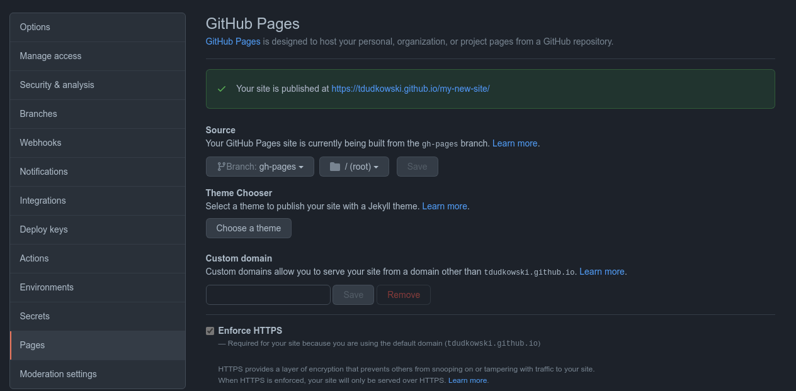
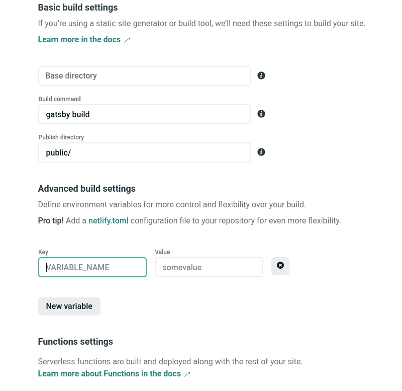
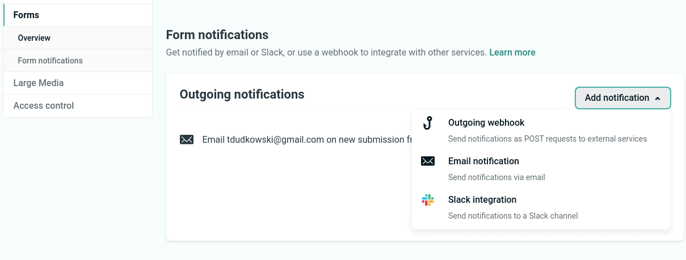
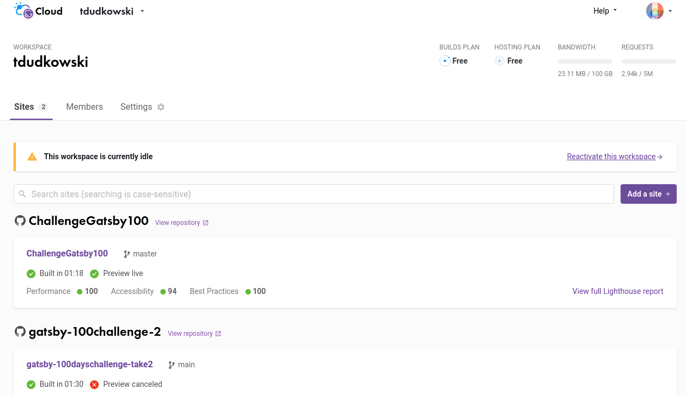
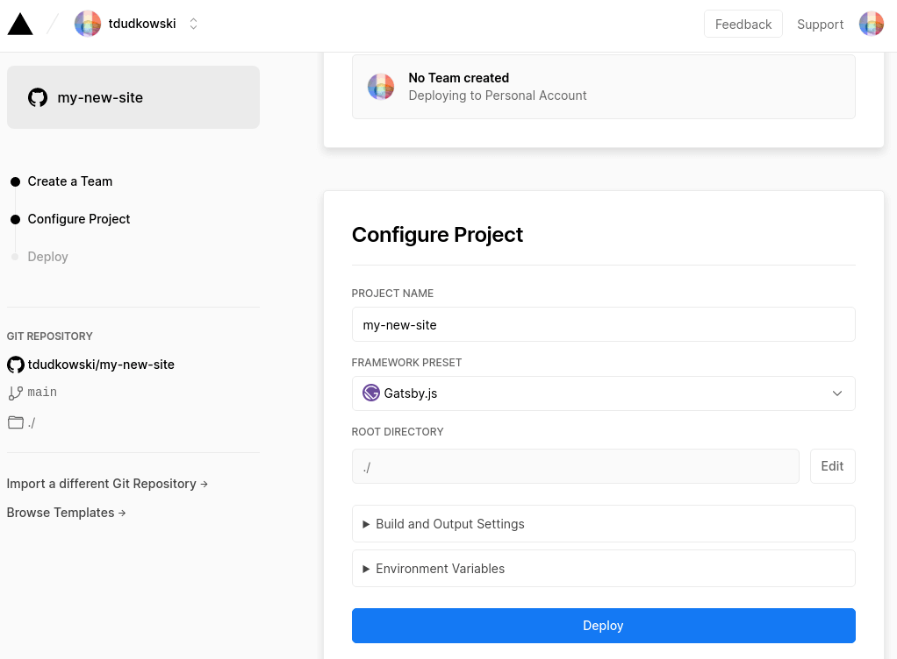

Stały adres serii wpisów o Gatsbym - [/blog/gatsby](/blog/gatsby)

### Nadejszła wiekopomna chwila...

Wiemy już, co to jest Gatsby, mamy zainstalowane środowisko deweloperskie i zbudowaną stronę. Jest utworzona struktura strony z działającą kontekstowo nawigacją. Układ i wygląd zapewnia CSS, są ilustracje, SEO, cała konfiguracja.

Cały czas jednak to wszystko jest tylko i wyłącznie na naszym komputerze. Pora to pokazać światu!

Dzisiaj wrzucamy stronę na serwer. Co tam serwer... od razu na pięć serwerów.

### Deploy?

W dawnych czasach kiedy tworzeniem stron WWW zajmowali się webmasterzy, a nie frontendowcy wrzucenie strony na serwer (zwykle przy użyciu starożytnego protokołu FTP) określano jako upload. Technologie się zmieniły i teraz granica pomiędzy aplikacją a stroną WWW uległa zatarciu. Dlatego w obu przypadkach używa się słowa deploy, które w IT tłumaczone jest na polski jako wdrożenie. Ponieważ sformułowanie "wdrożenie strony WWW" brzmi nieco dziwnie, często używa się tego słowa w oryginale.

Jaka jest różnica pomiędzy upload a deploy?

Po pierwsze używa się tu innych technologii (część opisana jest poniżej), po drugie deploy jest procesem.

### W tym odcinku...

- dowiemy się co to jest CI/CD
- wrzucimy repozytorium gita na GitHuba
- potem użyjemy:
  - GitHub Pages
  - Netlify
  - Gatsby Cloud
  - Vercel
  - zwykłego hostingu

Dużo działania, ale zacznijmy od teorii.

### CI/CD

Jest to zarówno metodyka tworzenia aplikacji, jak i usługa.

- CI (Continuous Integration)
- CD (Continuous Delivery albo Continuous Deployment, to są dwa różne pojęcia)

Całość czasem jest nazywana Continuous Development, co na pewno nie upraszcza użycia skrótów. Ale nie jest to tak skomplikowane.

Continuous Integration oznacza zintegrowanie testowania w proces produkcji i dzięki temu regularne, częste wprowadzanie zmian w repozytorium systemu kontroli wersji. Umożliwia to szybki rozwój aplikacji oparty o standardy. W skrócie: regularne testy, stosowanie się do norm i częsty upload do archiwum.

Continuous Delivery to dalszy ciąg tego procesu przebiegający już na serwerze deweloperskim, jest to ciągła praca nad aplikacją już w jej środowisku sieciowym. W pełni zautomatyzowana aż do ostatniego momentu, czyli wypchnięcia nowego kodu na serwer produkcyjny. To nie jest automatyczne, wymaga działania osoby nadzorującej proces.

Continuous Deployment oznacza to samo co Continuous Delivery, z tym że dostarczenie na produkcję nie wymaga ludzkiej interwencji. Proces jest w pełni zautomatyzowany od początku do końca.

No dobrze, ale co to ma wspólnego z naszą stroną w Gastbym? Otóż tego typu usługi właśnie potrzebujemy. Normą jest to, że cały proces tworzenia strony, krok po kroku zapisujemy w systemie kontroli wersji, czyli w gicie. Używamy przy tym archiwum online, czyli zdalnej kopii repozytorium na GitHubie. Tym razem to nie FTP jak z dawnych lat jest naszym narzędziem publikacji, ale git. Usługi hostingowe, których potrzebujemy dla publikacji stron w Gatsbym, dostają kod z GitHuba, kompilują go w środowisku, którego konfigurację dostały w tym kodzie i wystawiają wersję produkcyjną online.

Owszem zwykły, statyczny hosting typu magazyn danych w niektórych sytuacjach wystarczy, ale po pierwsze strona w Gatsbym jest aplikacją, może zawierać zmienne środowiskowe, rozmaite integracje i wejścia danych. Po drugie usługi takie jak Netlify czy Gatsby Cloud oferuje wiele dodatkowych możliwości - Netlify np. daje darmowy i bardzo dobry formularz kontaktowy.

Ostatecznie zwycięża wygoda, bo kiedy połączymy lokalne repo ze zdalną kopią na GitHubie i tę zdalną kopię z usługą typu CD, to wystarczy kliknięcie w IDE, żeby wysłać lokalne zmiany na GitHuba. Te zmiany uruchomią połączenie z usługą hostingową, która pobierze kod, skompiluje go i nową wersję wystawi online. Całą tę zmianę robi się jednym kliknięciem w edytorze kodu, który i tak masz otwarty.

Więcej w poniższych odnośnikach:

- Cezary Irzykowski ["Narzędzia i rozwiązania Continuous Development"](https://bulldogjob.pl/articles/1078-narzedzia-i-rozwiazania-continuous-development)
- FullStackAdmin ["Wyjaśniamy co to jest CI/CD?"](https://fullstackadmin.pl/wyjasniamy-co-to-jest-ci-cd)
- Maciej Aniserowicz ["Trzy kroki do pełnej automatyzacji – jak poprawnie wdrożyć CI/CD, żeby szybciej dostarczać lepszy software"](https://devstyle.pl/2019/03/28/continuous-integration-delivery-deployment-buddy/)
- Radoslaw Kosiec ["Korzyści biznesowe z CI/CD w GitLab"](https://blog.deviniti.com/pl/gitlab-pl/korzysci-biznesowe-z-ci-cd-w-gitlab/)

### Git

Przyznaję, do tej pory nie pisałem o gicie w procesie tworzenia kodu. Było to spowodowane tym, że nie opisywałem w ogóle tego, jak się w Gatsbym tworzy stronę, poszczególne wpisy były poświęcone oddzielnym zagadnieniom i nie było narracji "teraz zrobimy to, a potem to, ale pamięta o tamtym".

Trzeba mieć cały czas świadomość, że system kontroli wersji jest integralną i niezbędną częścią środowiska deweloperskiego. Jeszcze w 2021 opowiada się nasycone grozą (groteską?) historie o firmach nieużywających systemu kontroli wersji albo (to wersja light horroru przeznaczona dla kierowców i kobiet w ciąży) używających innego systemu niż git.

To nie jest przypadek, że od utworzenia repozytorium gita zaczyna się tworzenie strony. Każdy etap to powinien być przynajmniej jeden i to dobrze opisany commit. To tworzy nam historię działań i jest bezpiecznym backupem. OK, w miarę bezpiecznym. Dla zapewnienia bezpieczeństwa niezbędne jest repozytorium online i tu najbardziej popularnym rozwiązaniem jest GitHub; tym bardziej, że w darmowej opcji możemy mieć repozytorium prywatne, tzn. ukryte przed innymi.

### GitHub

Nie ma żadnego powodu, żeby z takiej usługi nie skorzystać. To jest standard de facto. Jeśli komuś się nie podoba GitHub, są inne rozwiązania tego typu. Dwa najpopularniejsze to GitLab i Bitbucket.

W naszym lokalnym repozytorium powinien być przynajmniej jeden commit.

1) Utworzenie nowego repozytorium. Może być prywatne. Nie zaznaczamy żadnych opcji, nie ma gitignora, licencji, po prostu puste repo.

2) Zaraz po utworzeniu repozytorium na GitHubie, na jego stronie mamy podpowiedź (domyślnie adres jest z HTTPS, ale można się też przełączyć na SSH):

```
git remote add origin https://github.com/tdudkowski/my-new-site.git
git branch -M main
git push -u origin main
```
3) Wykonujemy powyższe polecenia:

- Pierwsze polecenie zapisuje w konfiguracji lokalnego repo adres jego zdalnej kopii.
- Drugie przełącza nas na gałąź główną (w starszej wersji był to master, obecnie używa się nazwy main)
- Trzecie wypycha kod z lokalnego repozytorium na zdalne.

Przykładowy efekt (zakładając, że nazwa repo na GitHubie to my-new-site):

```
$ git push -u origin main
Wymienianie obiektów: 35, gotowe.
Zliczanie obiektów: 100% (35/35), gotowe.
Kompresja delt z użyciem do 8 wątków
Kompresowanie obiektów: 100% (33/33), gotowe.
Zapisywanie obiektów: 100% (35/35), 545.90 KiB | 2.66 MiB/s, gotowe.
Razem 35 (delty 3), użyte ponownie 0 (delty 0), paczki użyte ponownie 0
remote: Resolving deltas: 100% (3/3), done.
To https://github.com/tdudkowski/my-new-site.git
 * [new branch]      main -> main
Gałąź „main” ustawiona na śledzenie zdalnej gałęzi „main” z „origin”.
```

I to wszystko. Teraz wystarczy regularnie pushować commity na zdalne repo, że tak się wyrażę ;-)

W każdym dobrym IDE (takim jak VSC czy WebStorm) są zintegrowane narzędzia do obsługi gita i zdalnych repozytoriów.

We wszystkich poniższych przykładach (poza GitHub Pages) repozytorium może pozostać prywatne i we wszystkich (poza Gatsby Cloud) każde wypchnięcie kodu na GitHuba powoduje automatyczne przebudowanie strony i publikację nowej wersji.

### GitHub Pages

W darmowej wersji repozytorium musi być publiczne, żeby można było opublikować stronę. Zmieniamy to na dole działu Settings w specjalnie zaznaczonej Danger Zone. Zmiana jest dość uciążliwa, bo najpierw trzeba wpisać (copy paste nie działa) nazwę repo, a potem jeszcze raz podać hasło. Więc jeżeli planujemy publikować stronę na GitHub Pages to najlepiej zacząć od publicznego repo.

Ustawienia dla GitHub Pages są na Settings / Pages.

W Gatsbym możemy użyć zautomatyzowanego narzędzia do publikowania stron na GitHub Pages, jest to pakiet npm o nazwie gh-pages.

Instalacja:

```
$ npm i gh-pages
```

**/gastby-config.js**

```js
module.exports = {
  pathPrefix: "/reponame",
  plugins: [
      //
  ],
}
```

Dodajemy samą nazwę repozytorium, bez nazwy użytkownika. Używając przykładu naszego repo, będzie to `pathPrefix: "/my-new-site"`.

Do działu skryptów w package.json dodajemy "deploy":

**/package.json**

```js
  "scripts": {
    "test": "echo \"Error: no test specified\" && exit 1",
    "deploy": "gatsby build --prefix-paths && gh-pages -d public"
  },
```

Potem wystarczy polecenie:

```
$ npm run deploy
```

I ostatnie co jest do zrobienia to przejście do ustawień GitHub Pages naszego repo. Wybieramy gałąź "gh-pages" i katalog "root". Przycisk [Save] i po chwili strona jest online.

Istnieje możliwość przypisania własnej domeny.


*GitHub Pages: strona ustawień*

Dla programisty i dewelopera konto na GitHubie jest swoistym must-have, nie tylko dlatego, że potrzebne jest repozytorium kodu. Jedną z wielu oferowanych przez GitHub usług jest autoryzacja na innych serwisach. W żadnej z niżej wymienionych tu usług nie musiałem zakładać konta przez podanie nazwy użytkownika, maila, wymyślenie hasła itd. Wszędzie można tworzyć konto i logować się używając autoryzacji GitHuba. GitLab, Bitbucket i Google również to umożliwiają.

- [tschaub / gh-pages](https://github.com/tschaub/gh-pages) General purpose task for publishing files to a gh-pages branch on GitHub
- [How Gatsby Works with GitHub Pages](https://www.gatsbyjs.com/docs/how-to/previews-deploys-hosting/how-gatsby-works-with-github-pages/)
- Shaumik Daityari ["Deploy a Gatsby Site on GitHub Pages for Free"](https://blog.bitsrc.io/deploy-a-gatsby-site-on-github-pages-for-free-f18853c1b7a9)

### Netlify

Najpopularniejszą usługą hostingową typu CD jest Netlify. Oferuje on bardzo bogaty pakiet usług w darmowej wersji: 300 minut buildu i tak jak już wspomniałem formularz z dobrze działającym filtrem antyspamowym.

Mam kilka stron na Netlify. Przez parę miesięcy codziennie robiłem aktualizacje i nigdy nie udało mi się tych 300 minut przekroczyć. Ale jeśli się to zrobi Netlify automatycznie przydziela kolejnych 500 minut buildu za... siedem dolarów.

Zaczynamy od GitHuba.

Najpierw trzeba autoryzować Netlify na naszym koncie GitHub: Pod adresem [https://github.com/settings/installations](https://github.com/settings/installations) mamy uprawnione aplikacje.

Po autoryzacji powinniśmy na tej liście zobaczyć Netlify, wtedy wchodzimy w ustawienia [Configure]. Załaduje się strona ustawień i na dole mamy dział Repository access, z dwóch opcji mamy zaznaczone oczywiście "Only select repositories"  i z przycisku [Select repositories] wybieramy repozytoria, do których Netlify ma mieć dostęp. I oczywiście zielony przycisk [Save]

Przechodzimy do Netlify.

Pod adresem `https://app.netlify.com/teams/nazwa_usera/overview` (lądujemy tam domyślnie po zalogowaniu, to jest dashboard tej aplikacji) mamy duży zielony przycisk [New site from Git]

Publikacja nowej strony podzielona jest na trzy etapy:

- Connect to Git provider
- Pick a repository
- Site settings, and deploy!

W pierwszym wybieramy jedno z trzech źródeł: GitHub, Gitlab lub Bitbucket

Po kliknięciu w wybrane Netlify sprawdza autoryzację i w drugim etapie mamy wybór repozytorium.

Trzeci etap: konfiguracja.


*Netlify: konfiguracja*

- Base directory: puste
- Build command: `gatsby build`
- Publish directory: `public/`

Jeżeli mamy jakieś zmienne środowiskowe (plik env) klikamy w wyszarzony [Show advanced] i pokaże się możliwość ich wpisania jeszcze przed buildem.

Klikamy [Deploy site]

Netlify dokonuje pierwszego builda. Widzimy na stronie pod losowo wybraną nazwą strony (później można ją zmienić):

>musing-hamilton-dc5bbb<br />
>Site deploy in progress

W zasadzie, jeżeli lokalny build się powiedzie, to tak samo powinno być z buildem na Netlify. Ale jeżeli dostajemy komunikat Failed to klikamy w tę informację i czytamy komunikaty błędów.

Jeżeli błąd jest po stronie lokalnego środowiska na naszym komputerze, np. brakujący pakiet, albo błędny kod to po naprawieniu tego błędu robimy git push i po chwili Netlify sam powinien uruchomić kolejnego builda.

Jeżeli natomiast błąd jest po stronie Netlify, np. źle wpisana zmienna środowiskowa, lub błędnie dobrane parametry środowiska, to po ich naprawieniu musimy sami włączyć kolejny build najlepiej z wyczyszczeniem bufora.

W menu głównym mamy Deploys, które pokazuje listę buildów i ich status.

Po udanym buildzie mamy komunikat:

>Deploys for musing-hamilton-dc5bbb<br />
>[adres strony]
>
>[adres repozytorium], published main@7fb6fe6.
>
>Auto publishing is on. Deploys from main are published automatically."

Ustawienia strony są w Site overview i są tam dwa przyciski

- Site settings
- Domain settings

W tym pierwszym możemy np. zmienić nazwę strony - jeżeli jest wolna. 

Jeśli mamy na stronie formularz to po instalacji możemy ustawić akcje formularza. W ustawieniach wybieramy dział Form. Klikamy na przycisk [Add notification] i rozwija się menu opcji, jedną z nich jest Email notification.


*Netlify: akcje formularza*

W Domain settings możemy przypisać domenę, kiedy zostanie zaakceptowana automatycznie włączy się możliwość włączenia SSL z Let's Encrypt.

I to wszystko. Zawsze, kiedy wypchniemy commit na GitHuba, automatycznie włączy się build na Netlify. Zmiany pokażą się zależnie od tego, jak duża jest strona: po kilku lub kilkunastu minutach.

- Gatsby [Deploying to Netlify](https://www.gatsbyjs.com/docs/how-to/previews-deploys-hosting/deploying-to-netlify/)
- [Netlify](https://www.netlify.com) ([Community](https://community.netlify.com), [Docs](https://docs.netlify.com)) - [Netlify CMS](https://www.netlifycms.org)
- Netlify: ["A Step-by-Step Guide: Gatsby on Netlify"](https://www.netlify.com/blog/2016/02/24/a-step-by-step-guide-gatsby-on-netlify/)
- [Start a Blog in 2019 with Gatsby.js and Netlify](https://daveceddia.com/start-blog-gatsby-netlify/)
- ["Gatsby & Netlify CMS: a perfect pairing"](https://blog.logrocket.com/gatsby-netlify-cms-a-perfect-pairing-d50d59d16f67)
- Ravgeet Dhillon ["Deploy a website on Netlify through Github Actions"](https://www.ravsam.in/blog/deploy-a-website-on-netlify-through-github-actions/)
- Traversy Media ["Netlify Dev Crash Course | Easy Dev & Deploy" [YT 23:10]](https://www.youtube.com/watch?v=FMhVXOA54x8)
- Przeprogramowani ["Strona internetowa w 15 min z Gatsby.js i Netlify | Przeprogramowani ft. code v0.0.2" [YT 15:41]](https://www.youtube.com/watch?v=e43gqXxwACU)
- rk development ["Deploy a Gatsby JS Site & Netlify CMS in just 45 mins! (2019 - Full Walkthrough)" [YT 48:55]](https://www.youtube.com/watch?v=rjszBC8luHE)
- Web Dev Profesh ["Gatsby With NetlifyCMS Tutorial" [YT 22:24]](https://www.youtube.com/watch?v=IWmVSm2KevY)

### Gatsby Cloud

W 2019 Gatsby uruchomił usługę hostingu CD o nazwie Gastby Cloud. Jest silnie nastawiona na integracje z zewnętrznymi usługami. Porównując z Netlify: nie ma limitu czasu buildu, niestety nie oferuje formularza.


*Gatsby Cloud: dashboard*

Podobnie jak w przypadku Netlify trzeba autoryzować Gastby Cloud na GitHubie, żeby mieć dostęp do repozytoriów.

Najpierw wybieramy źródło danych, może to być własne repozytorium gita. Drugą możliwością jest użycie, któregoś z oferowanych przez Gatsby'ego szablonów stron, tutaj repozytorium może być tylko GitHub. Taki szablon umożliwia błyskawiczne postawienie strony na podstawie przygotowanego wzorca. Wystarczy wymienić grafiki, wypełnić własną treścią i skonfigurować.

My wybieramy tradycyjną drogę, przecież mamy własną stronę na lokalnym środowisku deweloperskim.

Publikacja strony na Gatsby Cloud przebiega w czterech krokach:

- Git provider
- Repository
- Integrations
- Setup

W pierwszym kroku wybieramy źródło danych dla Gatsby Cloud: GitHub, GitLab lub Bitbucket.

W drugim wskazujemy konkretne repozytorium, gałąź i nazwę strony.

W trzecim wybieramy i konfigurujemy integracje, tu jest szeroki wybór: Contentful, Cosmic JS, DatoCMS, Sanity, SHOPIFY, Agility CMS, Contentstack, Drupal, Flotiq, Graph CMS, Kontent, Strapi, WordPress, ButterCMS. Jeśli żadnej nie potrzebujemy, dajemy [Skip].

Ostatni, czwarty krok to konfiguracja, czyli w tym przypadku dodanie zmiennych środowiskowych.

Przycisk [Create site].

Po utworzeniu strony, możemy przejść na dedykowaną jej podstronę gdzie widzimy listę buildów oraz Site Settings gdzie mamy:

- General
- Builds
- Preview
- Hosting - ustawienia domenowe oraz Hosting integrations, gdzie możemy dodać usługę CDN: Netlify, Fastly, Firebase, AWS S3, Google Storage, Vercel, Microsoft Azure
- Reports
- Data Sources - Data Source Integrations, tutaj można dodać i skonfigurować integracje dla już istniejących stron
- Danger Zone

Żeby po wypchnięciu nowej wersji strony na GitHuba pokazała się jej nowa wersja, trzeba się zalogować i na tej podstronie kliknąć [Trigger build]

- [Deploying to Gatsby Cloud](https://www.gatsbyjs.com/docs/how-to/previews-deploys-hosting/deploying-to-gatsby-cloud/)

### Vercel

Podobnie jak w przypadku Netlify i Gatsby Cloud musimy autoryzować Vercela na GitHubie.

Tutaj proces publikacji jest najprostszy i wykonuje się go w dwóch etapach.

Po zalogowaniu się przechodzimy do Dashboardu: [https://vercel.com/dashboard](https://vercel.com/dashboard) i klikamy czarny przycisk [New Project]

1) Załaduje się strona, na której możemy wybrać repozytorium (Import Git Repository) albo szablon na stronę.

2) Po wybraniu repozytorium mamy ekran konfiguracji, tutaj Vercel proponuje nam wybrać Team, jeżeli nie mamy takiej potrzeby dajemy [Skip] i przechodzimy do konfiguracji. W domyślnej wersji wybieramy nazwę projektu, framework (oczywiście Gatsby) i katalog bazowy. Można też rozwinąć opcje na dole i wybrać inne polecenie kompilatora (build command) i inny niż domyślny katalog strony. Możemy też wpisać zmienne środowiskowe.


*Vercel: cała konfiguracja na jednej stronie*

Niebieski przycisk [Deploy] i po chwili mamy stronę online.

Bogate możliwości konfiguracji, po wejściu na ustawienia projektu mamy menu:

- General
- Domains
- Integrations
- Git
- Serverless Functions
- Environment Variables
- Security
- Advanced

### Zwykły hosting

Trochę jak "zwykły proszek". Też w sumie działa. 

1) Ustawiamy nazwę docelowego katalogu:

**/gastby-config.js**

```js
module.exports = {
  pathPrefix: "/upload_directory_name"
  plugins: [
      //
  ],
}
```

2) Tworzymy builda z tą ścieżką w konfiguracji:

```
$ gatsby build --prefix-paths
```

3) Całą zawartość katalogu /public wysyłamy na serwer przy użyciu FTP.

Strona 404 działa, ale nie są na nią przekierowywane błędne zapytania. Można to rozwiązać plikiem .htaccess. 

### Odnośniki

- Gatsby [Deploying and Hosting](https://www.gatsbyjs.com/docs/deploying-and-hosting/)
- Frontstack.pl ["Hosting stron i aplikacji webowych"](https://frontstack.pl/hosting-stron-i-aplikacji-webowych/)
