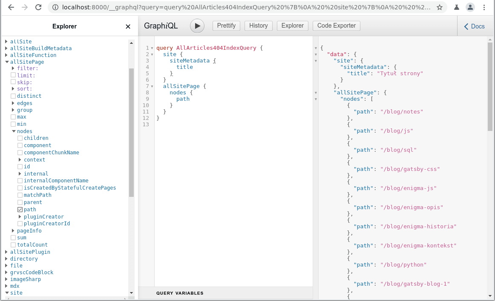

Stały adres serii wpisów o Gatsbym - [/blog/gatsby](/blog/gatsby)

### Wstęp

Ten wpis jest o tyle nietypowy, że łączy dwa tematy. Wynika to z tego, że są one ze sobą ściśle powiązane.

Co jednak nie oznacza, że GraphQL ma zastosowanie tylko do wyświetlania obrazków, ma wiele innych równie ważnych funkcji.

I w drugą stronę tak samo, jak zobaczymy, obrazki można wyświetlać bez użycia GraphQL. Ale po pierwsze obrazki świetnie się nadają do wyjaśnienia jak GraphQL działa, a po drugie dopiero z GraphQL Gatsby pokazuje pełnię możliwości w wyświetlaniu obrazków.

### Tak więc...

W tym wpisie:

- wyjaśnienie czym jest GraphQL i jak działa
- wszystkie możliwości wyświetlania obrazków i wyjaśnienie, dlaczego GraphQL jest świetnym narzędziem
- StaticQuery i hook useStaticQuery
- strona 404 z automatycznym listingiem stron

Do dzieła!

### GraphQL

Jedną z najbardziej obleganych stron jest największe forum dyskusyjne i ogólnoświatowe targowisko próżności - Facebook. Problem, przed którym stanęli inżynierowie Facebooka, polegał na niespotykanym do tej pory natężeniu ruchu i potrzebach, które nie dały się zasypać pieniędzmi, a dotychczasowe rozwiązania były niewystarczające.

Do tej pory używali PHP, który był standardem backendu w aplikacjach webowych. Ale PHP nie wyrabiał. Zaczęli więc używać własnych, firmowych narzędzi testując nowe możliwości. Tak powstał dialekt PHP o nazwie Hack, a potem w 2010 XHP, który łączył PHP i Hacka i pozwalał na szybkie przetwarzanie danych XML na reużywalne komponenty aplikacji.

XHP był dość długo testowany, ale ostatecznie zastąpiło go lepsze narzędzie, którego powstanie zainspirował. To był właśnie React używany wewnętrznie od 2011 jeszcze jako FaxJS, a potem pod obecną nazwą. To była przełomowa zmiana, która oznaczała przejście z PHP na JavaScript. Rok później, w 2012 React został opublikowany jako dojrzały produkt.

Równocześnie zaczęto prace nad zupełnie nowym API, które podobnie jak React zmniejszy ilość danych przekazywanych pomiędzy backendem a frontendem. Do tej pory używany REST API przerzucał nadmiarowe ilości danych tam i z powrotem w licznych kaskadach zapytań.

Tak powstał GraphQL. Po wewnętrznych testach został opublikowany w 2015, a w 2018 uznany za stabilny. Wtedy prawa przeniesiono na rzecz GraphQL Foundation, wspieraną przez Linux Foundation. Czyli otwarty standard nówka sztuka, ale porządnie śmigana i wygrzana.

Jest to język zapytań i przetwarzania danych dla interfejsu API dużo bardziej ekonomiczny niż REST API. Osiąga to dzięki precyzji, pobierane są tylko te dane, które są potrzebne. Przede wszystkim wszystko idzie w jednym zapytaniu z jednego endpointu. Zapytanie zawiera w sobie strukturę danych i tak uporządkowane dane przychodzą w odpowiedzi. Czyli w odpowiedzi dostajemy dokładnie to, o co się zapytaliśmy, znamy dokładnie formę odpowiedzi i typy otrzymanych danych. Używanym tutaj formatem jest JSON.

Dla zainteresowanych polecam przede wszystkim darmowy kurs autorstwa Artura Chmaro ["Podstawy GraphQL" [YT playlista 18 filmów]](https://www.youtube.com/playlist?list=PLOzzvlJKwOdVKI4hbPNG9dveAH6Njwhcc)

Oraz poniższe artykuły:

- Laurin Quast ["Handling GraphQL errors like a champ with unions and interfaces"](https://blog.logrocket.com/handling-graphql-errors-like-a-champ-with-unions-and-interfaces/)
- Cezary Sanecki ["Czy GraphQL może stać się godnym następcą REST?"](https://devcezz.pl/2021/01/23/czy-graphql-moze-stac-sie-godnym-nastepca-rest/)
- Mateusz Książek [Wstęp do GraphQL](https://devenv.pl/graphql-podstawy/) | ["GraphQL – definicja schematu"](https://devenv.pl/graphql-definicja-schematu/) | ["GraphQL – Wprowadzenie"](https://devenv.pl/graphql-wprowadzenie/)
- FSGeek ["Czym jest GraphQL?"](https://fsgeek.pl/post/czym-jest-graphql/)
- Przemysław Bykowski ["Nowy następca REST? Poznaj GraphQL!"](https://bykowski.pl/nowy-nastepca-rest-poznaj-graphql/)
- Bartek Cis ["Tworzę endpoint GraphQL w NodeJS i podpinam pod to React’a"](https://bedekodzic.pl/graphql-react/) | ["React Apollo i GraphQL Hooks czyli różne podejścia do GraphQL"](https://bedekodzic.pl/graphql-hooks/)
- Bennett Garner["Jak zacząć z GraphQL"](https://bulldogjob.pl/news/645-jak-zaczac-z-graphql)
- Robert Podwika ["Witaj GraphQL, żegnaj REST API czyli o pisaniu nowoczesnego API"](http://blog.rpodwika.pl/witaj-graphql-zegnaj-rest-api-pisanie-nowoczesnego-api/)
- [graphql / graphql-playground](https://github.com/graphql/graphql-playground) GraphQL IDE for better development workflows (GraphQL Subscriptions, interactive docs & collaboration)

### Gatsby - komponent graphql

Gatsby jest silnie zintegrowany z GraphQL. Od podstaw jest pomyślany tak, żeby pobierać dane z GraphQL.

Co wcale nie oznacza, że nie można napisać całkiem poważnych stron bez GraphQL. Po prostu jest to opcja domyślna.

Wciąż trzeba zadeklarować wbudowany komponent graphql, tak samo jak jest to w przypadku komponentu Link.

```js
//
import { graphql } from "gatsby"
//
```

### Gatsby - GraphiQL

Do analizy struktur danych zapewnianych przez GraphQL Gatsby używa IDE o nazwie GraphiQL. Jest dostępne w trybie deweloperskim pod adresem: `http://localhost:8000/___graphql` (trzy podkreślenia). Jest to interaktywna przeglądarka danych, w której można budować własne zapytania, przeglądać dane, sprawdzać poprawność danych.

Używanie GraphiQL można przećwiczyć na tej stronie - [GraphiQL Online](https://lucasconstantino.github.io/graphiql-online/)

Po lewej przeglądarka (Explorer), pośrodku zapytanie, po prawej wynik. W Explorerze możemy przejrzeć dane. Kiedy je wybieramy zaznaczając checkboxy, automatycznie generuje się zapytanie. Kliknięcie w przycisk ze strzałką u góry uruchamia zapytanie i rezultaty widzimy po prawej stronie.


*GraphiQL na http://localhost:8000/___graphql*

W przypadku danych strony: poszczególne strony są w allSite i dalej nodes lub edges/nodes, pliki w allFiles, metadane w site/siteMetadata.

Format zapytania jest w podanych poniżej przykładach. W skrócie: jest to eksport zmiennej query dokonywany na końcu pliku. Nazwa zapytania musi być unikalna, więc jeżeli kopiujemy strony, to trzeba te nazwy zmieniać.

```js
export const query = graphql`
query NazwaZapytania {
// tutaj treść zapytania
  }
`;
```

Polecam dwa filmy wyjaśniające działanie GraphiQL w Gatsbym - Zac Gordon ["GraphQL for Gatsby JS [1/2] - How Gatsby Uses GraphQL" [YT 9:57]](https://www.youtube.com/watch?v=ZNFY8auhtcI) | ["GraphQL for Gatsby JS [2/2] - Examples of GraphQL in Gatsby Starters" [YT 15:19]](https://www.youtube.com/watch?v=Rkyzum7WsLQ)

- [graphql / graphiql](https://github.com/graphql/graphiql) | [npm: graphiql](https://www.npmjs.com/package/graphiql)
- [Introducing GraphiQL](https://www.gatsbyjs.com/docs/how-to/querying-data/running-queries-with-graphiql/)

### Obrazki

Wyjaśniwszy czym jest i jak działa GraphQL, niespodziewanie przejdźmy do tematu drugiego. Zostanie omówiony w jednym rozdziale i na przykładzie jednego, ale za to długiego listingu.

Podobnie jak w przypadku CSS, Gatsby daje wiele możliwości wyświetlania obrazków. Tutaj opiszę osiem, tzn. wszystkie jakie znam:

Numery linii kodu podane są w nawiasach.

#### Zwykły element HTML

Można tak, choć jak za chwilę zobaczymy, nie bardzo ma sens, albo uściślając może i ma sens, ale w nietypowych sytuacjach. Ma tę zaletę, że nie wymaga żadnych pluginów ani konfiguracji.

- Można zaimportować, podając względną ścieżkę dostępu (linia 6) i zaimportowany umieścić jako parametr src (linia 26)
- Static Folder: trzeba utworzyć katalog /static (nazwa i lokalizacja obligatoryjna) i umieścić tam plik. Podobnie jak w poprzednim przypadku wystarczy podać względną ścieżkę dostępu w parametrze src (linia 29).
- Jako background w CSS

We wszystkich następnych przykładach trzeba zainstalować plugin gatsby-plugin-image. Jest to następca pluginu gatsby-image, który wciąż jest dwa razy popularniejszy od gatsby-plugin-image.

Nie jest to jakieś szczególne wymaganie, bo ciężko sobie wyobrazić stronę bez ilustracji, a ten plugin jest naprawdę interesujący.

#### Static Image

Jest to odpowiednik normalnego taga HTML img.

Importujemy komponent StaticImage (linia 5) i możemy go używać, mając dostęp do wszystkich metod. Potrzebna jest względna ścieżka dostępu do fizycznej lokalizacji pliku (cały komponent to linie 33-39).

#### Gatsby Image (z GraphQL)

Jest to odpowiednik dawnego komponentu Img (znanego z gatsby-image).

Dopiero tutaj Gatsby pokazuje pełnię możliwości. Potrzebny jest GraphQL i import komponentu GatsbyImage oraz - jeżeli tego używamy - metody getImage.

Najpierw definiując nazwę (w tym wypadku myImage) GraphQL-em, pobieramy obrazek (linie 65-73). Wystarczy podać nazwę, ponieważ GraphQL domyślnie szuka ich w katalogu obrazków zdefiniowanym przez gatsby-source-filesystem w gatsby-config.js, więc wystarczy podać nazwę.

Każdy obrazek pobieramy osobno, pisząc kolejne zapytania w GraphQL (tak jak widać na końcu pliku).

I teraz po kolei:

- używając metody getImage, poza renderem przypisujemy go do zmiennej (linia 16), którą potem można użyć w komponencie (linia 44)
- metody getImage można użyć wewnątrz komponentu GatsbyImage (linia 47), co jest szczególnie przydatne, jeśli pobieramy obrazki dynamicznie
- zamiast getImage można odwołać się bezpośrednio do gatsbyImageData (linia 50), efekt jest AFAIK ten sam
- można też wydobyć ścieżkę dostępu do pliku ostatniego wyboru (linia 53; w srcSet jest cały zestaw) i użyć jej jako propsa dla background-image w komponencie styled-components (linia 11)
- ostatecznie, choć można zapytać po co, można tej ścieżki użyć jako parametru w zwykłym elemencie HTML (linia 56)

**/src/pages/any-page-with-images.js**

```js {numberLines: true}
import * as React from 'react'
import { graphql } from "gatsby";
import styled from "styled-components"
import Layout from "../components/layout"
import { StaticImage, GatsbyImage, getImage } from "gatsby-plugin-image"
import img from "../blogimages/gatsby.jpg"

const StyledDiv = styled.div`
width: 200px;
height: 100px;
background: url(${props => props.background}) no-repeat top center;
`;

const ImagesPage = ({ data }) => {
    
    const image = getImage(data.myImage)

    return (
        <Layout>
            <article>
                <h2>Images</h2>

                <h3>HTML element</h3>

                <p>Imported</p>
                

                <p>Static folder: /static/img/gatsby.jpg</p>
                

                <h3>Static Image</h3>

                <StaticImage
                    src="../blogimages/gatsby.jpg" alt="Gatsby result"
                    placeholder="blurred"
                    layout="fixed"
                    width={200}
                    height={100}
                />

                <h3>Gatsby image (GraphQL)</h3>

                <p>Defined with getImage:</p>
                <GatsbyImage image={image} alt="obrazek" />

                <p>getImage used inside element:</p>
                <GatsbyImage image={getImage(data.myImage)} alt="obrazek" />

                <p>Raw data from GraphQL:</p>
                <GatsbyImage image={data.myImage.childImageSharp.gatsbyImageData} alt="obrazek" />

                <p>Background prop:</p>
                <StyledDiv background={data.myImage.childImageSharp.gatsbyImageData.images.fallback.src} ></StyledDiv>

                <p>Standard HTML element using GraphQL data:</p>
                

            </article >
        </Layout >
    )
}

export default ImagesPage

export const query = graphql`
query Image {
    myImage: file(relativePath: {eq: "gatsby.jpg"}) {
      childImageSharp {
        gatsbyImageData(width: 200, placeholder: BLURRED, formats: [AUTO, WEBP])
      }
    }
    secondImage: file(relativePath: {eq: "justForExample.jpg"}) {
      childImageSharp {
        gatsbyImageData(width: 200, placeholder: BLURRED, formats: [AUTO, WEBP])
      }
    }
  }
`;
```

- [gatsby-plugin-image](https://www.gatsbyjs.com/plugins/gatsby-plugin-image/) | [Gatsby Image API](https://www.gatsbyjs.com/docs/reference/built-in-components/gatsby-image/) | [Importing Assets Directly into Files](https://www.gatsbyjs.com/docs/how-to/images-and-media/importing-assets-into-files/) | [Using the Static Folder](https://www.gatsbyjs.com/docs/how-to/images-and-media/static-folder/)

I na tym kończymy temat obrazków. Wracamy do GraphQL.

### StaticQuery

Normalne zapytanie GraphQL można wykonać tylko w plikach stron.

StaticQuery:

- stosowane w komponentach, także w komponentach stron
- nie zawierają zmiennych, dlatego, że mogą się pojawić w dowolnym miejscu w drzewie komponentów i dane tam są, no właśnie, statyczne

Komponent zwracający obrazek przy użyciu StaticQuery:

**/components/staticquery-image-component.js**

```js
import * as React from "react"
import { StaticQuery, graphql } from "gatsby"
import { GatsbyImage, getImage } from "gatsby-plugin-image"
const StaticInner = () => {

    return (
        <StaticQuery
            query={graphql`{
                myImage:  file(relativePath: {eq: "gatsby.jpg"}) {
                  childImageSharp {
                    gatsbyImageData(width: 200, placeholder: BLURRED, formats: [AUTO, WEBP])
                  }
                }
              }
           `}
            render={data => (
                <section>
                    <GatsbyImage image={getImage(data.myImage)} alt="obrazek" />
                </section>
            )}
        />
    )
}

export default StaticInner
```

Czyli jak widać, StaticQuery jest wbudowanym komponentem z parametrem query, w którym jako zwykły kod JS w nawiasach klamrowych przekazane jest zapytanie GraphQL. Podobnie zbudowany jest render.

- [Querying Data in Components using StaticQuery](https://www.gatsbyjs.com/docs/how-to/querying-data/static-query/)

### Hook useStaticQuery

Zaletą jest prostota, jest to zwykłe zapytanie przed renderem (returnem) przypisane do zmiennej, która potem jest używana tak samo, jak zmienna pobierana w argumencie funkcji. Wystarczy zaimportować wbudowany komponent useStaticQuery.

**/components/usestaticquery-image-component.js**

```js
import * as React from "react"
import { useStaticQuery, graphql } from "gatsby"
import { GatsbyImage, getImage } from "gatsby-plugin-image"

const HookStatic = () => {

    const data = useStaticQuery(graphql`
    query ImageQuery {
              myImage:  file(relativePath: {eq: "gatsby.jpg"}) {
              childImageSharp {
                gatsbyImageData(width: 200, placeholder: BLURRED, formats: [AUTO, WEBP])
              }
            }
          }
      `)

    return (
        <section>
            <GatsbyImage image={getImage(data.myImage)} alt="obrazek" />
        </section>
    )
}

export default HookStatic
```

- [Introducing useStaticQuery](https://www.gatsbyjs.com/blog/2019-02-20-introducing-use-static-query/) | [Querying Data in Components with the useStaticQuery Hook](https://www.gatsbyjs.com/docs/how-to/querying-data/use-static-query/)

### 404

Przykładowy plik 404.

- Najpierw mamy import dwóch wbudowanych komponentów Gatsby'ego: graphql i Link (linia 2)
- Na końcu przy pomocy requestu graphql pobieramy potrzebne dane (linie 21-39)
- Jako props w postaci obiektu data przekazujemy go do komponentu strony (linia 4)
- Otrzymane dane są mapowane na listę (linie 8-14) tutj proszę zwrócić uwagę, że w nazwie odnośnika usunięty jest pierwszy i ostatni znak, pierwszy jest ukośnikiem więc zawsze można go usunąć, natomist ostatni tylko wtedy kiedy tak się kończy ścieżka adresowa

**/src/pages/404.js**

```js {numberLines: true}
//
import { graphql, Link } from "gatsby";

const NotFoundPage = ({ data }) => {
//

                <ul>
                    {data.allSitePage.nodes.map(({ path }) => (
                        <li key={path}>
                            <Link to={`/${path}`}>
                                {path.slice(1, -1)}
                            </Link>
                        </li>
                    ))}
                </ul>

//

export default NotFoundPage

export const query = graphql`
query PageNotFound {
  allSitePage {
    nodes {
      path
    }
  }
}
`;
```

### 404 MDX

O wiele większe możliwości w tym zakresie daje użycie MDX. Wprawdzie MDX zostanie omówione dopiero w siódmym wpisie w serii, ale na ten moment gwoli zachęty do zgłębienia tematu:

```js
import * as React from "react"
import Layout from "../components/layout"
import { graphql, Link } from "gatsby";

const NotFoundPage = ({ data }) => {
    return (
        <Layout>
            <section className="section-meta">
                <h2>404</h2>

                <p>Strona nie została znaleziona, sprawdź proszę czy w poniższych linkach jest to czego szukasz..</p>
                <ul>
                    {data.allMdx.nodes.map(({ id, frontmatter, slug }) => (
                        <li key={id}>
                            <Link to={`/${frontmatter.section}/${frontmatter.subsection && frontmatter.subsection + "/"}${slug}`}>{frontmatter.title}</Link>
                            <span>{frontmatter.description}</span>
                        </li>
                    ))}
                </ul>
            </section>
        </Layout>
    )
}

export default NotFoundPage

export const query = graphql`
query AllArticles404IndexQuery {
    allMdx(filter: {fileAbsolutePath: {glob: "**/src/content/pagearticles/*.mdx"}}) {
      nodes {
        id
        frontmatter {
          date
          title
          section
          subsection
          description
        }
        slug
      }
    }
  }`
```

Tutaj mamy przede wszystkim dostępne dane z tzw. frontmattera, czyli nagłówka pliku MDX, są to metadane używane do programistycznego generowania stron, więcej o tym będzie we wpisie o blogu, ale już tu widać, że mamy i tytuł i datę publikacji i sekcję i opis, można też dodać autora, obrazek, tagi - w zasadzie cokolwiek, bo to jakie dane umieścimy we frontmatterze, zależy tylko od nas.