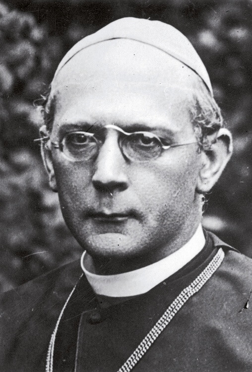

<DolnySlask />

### 21 stycznia 1945 Wrocław - Javornik

W swoim pamiętniku we wpisie datowanym na 14 marca Paul Peikert jak na księdza katolickiego przystało zwraca uwagę na urodziny swojego pryncypała, ważnej postaci w historii niemieckiego kościoła katolickiego - arcybiskupa Adolfa Bertrama:
>Dziś, w dniu 14 marca 1945 r., nasz najprzewielebniejszy arcybiskup Adolf Bertram kończy 86 rok życia. Skoro więc w ubiegłą niedzielę rezydencja arcybiskupa została już po raz drugi ciężko trafiona bombami, dobrze się stało, że za radą swego lekarza na czas zdążył wyjechać do swej drugiej rezydencji, do zamku Janowa Góra pod Jawornicą. W sędziwym wieku nie wytrzymałby długo ciężkich przeżyć psychicznych wywołanych oblężeniem. Ale nie powinien był odjeżdżać tak jakby przypadkowo. Jak mówią, nawet wikariusz generalny nie byłby się dowiedział o jego odjeździe, gdyby nie spotkał się z nim przypadkiem. W ten sposób przekazał mu ostatnie niezbędne pełnomocnictwa

Bertram opuścił Wrocław 21 stycznia, tego fatalnego dnia, który zyskał sobie nazwę "czarna niedziela" kiedy to większość wrocławian, głównie kobiety, dzieci i ludzie starzy zostali wygnani na kilkunastostopniowy mróz bez żadnych środków transportu. Bez wątpienia wyjechał w eleganckiej limuzynie i dość długo w tym samym kierunku co uciekinierzy, na południe, więc widział ich tragedię, nie mogąc im w żaden sposób pomóc. Sam wówczas miał - jak pisze Peikert - 86 lat i był u kresu życia, z czego niewątpliwie zdawał sobie sprawę. Czy zdawał sobie sprawę z tego, że patrzy również na kres arcybiskupstwa wrocławskiego (w ówczesnej postaci) i kres niemieckiego Śląska i Wrocławia?

*Adolf Bertram 
Źródło: NAC Gość.pl ["Wspólnota w burzliwych czasach"](https://www.gosc.pl/doc/5777679.Wspolnota-w-burzliwych-czasach)*

### 1972 Wrocław

Adolf Bertram jest we Wrocławiu trochę zapomnianą postacią, raczej sprowadzony do pozostawionego za sobą purpurowego biretu, bo jak przypomina Norman Davies:
>W czerwcu 1972 roku bulla papieska Episcoporum Poloniae coetus formalnie ustaliła rangę i obszar m. in. archidiecezji wrocławskiej. W 1973 roku papież Paweł VI powołał arcybiskupa Kominka do kolegium kardynalskiego. Wrocławianie usłyszeli tę radosną wieść z Radia Wolna Europa, podobnie jak pracownicy kurii, którzy podjęli desperackie poszukiwania purpurowego biretu świętej pamięci kardynała Bertrama. Dopiero po przywdzianiu odpowiedniego stroju Jego Eminencja mógł się pojawić publicznie by przyjmować gratulacje

Wiemy o nim, ale ile?

### 1859 Hildesheim

Przypomnienie i jego samego i czasów jego panowania w diecezji a później archidiecezji wrocławskiej jest konieczne. Urodził się w Hildesheim 14 marca 1859, więc miał już 12 lat w przełomowym roku 1871 kiedy nastąpiło zjednoczenie Niemiec i powstało Cesarstwo (którego - tak na marginesie - 60% ludności i terytorium stanowiło Królestwo Prus). Już kilka lat przed powstaniem Cesarstwa, bo 1866 Królestwo Hanoweru, do którego należało Hildesheim, zostało włączone w skład Królestwa Prus. Był to początek drogi do zjednoczenia Niemiec, obranej przez realnego władcę Prus, Żelaznego Kanclerza, Ottona von Bismarcka.

Notabene z Hildesheim pochodził również starszy o 13 lat Joseph Ebers architekt diecezjalny krótko współpracujący z Bertramem; krótko, bo umarł w 1923. Samo Hildesheim jest odległe zaledwie o 50 km od jednej z najsłynniejszych miejscowości w Niemczech: położonym również w Dolnej Saksonii mieście Hameln.

Bertram nie jest obieżyświatem. Z Hildesheim był związany prawie nieprzerwanie przez 55 lat od urodzenia, aż po wyjazd do Wrocławia. W Hildesheim kończy seminarium i 31 lipca 1881 przyjmuje święcenia kapłańskie. Jakiś czas studiuje w Würzburgu (ponieważ w epoce Kulturkampfu seminarium zostaje rozwiązane), Monachium i Rzymie, ale w 1884 wraca do rodzinnego miasta. Z powodu wady wymowy zajmuje się raczej pracą w diecezji niż duszpasterstwem. Później zostaje wikariuszem kapitulnym.

### 1906 biskup Hildesheim

Wreszcie w wyniku decyzji kapituły diecezjalnej 24 kwietnia 1906 zostaje biskupem Hildesheim. Sakrę biskupią przyjmuje od biskupa Georga Koppa we Wrocławiu.

Przebieg jego kariery znamionuje człowiek systematycznego, rzetelnego. Ciężko pracuje, żeby się pozbyć wady wymowy i szybko dzięki wytrwałej pracy i swoim wystąpieniom zyskuje sobie miano biskupa ludowego (niem. Volksbischof).

Warto nadmienić, iż jego poprzednik Georg Kopp również pochodził z Dolnej Saksonii, nawet chodził do tego samego seminarium w Hildesheim i pracował tam w wikariacie generalnym, chociaż później biskupem był w Fuldzie. Był więc pomiędzy Koppem i Bertramem pewien związek. Kto wie, może mawiano w okresie międzywojennym o stronnictwie dolnosaksońskim we wrocławskiej diecezji, tak jak niegdyś mawiano o stronnictwie szwabskim?

### 1914 biskup wrocławski

Po śmierci Koppa 4 marca 1914 to Bertram stał się jednym z dwóch kandydatów kapituły na biskupa wrocławskiego, a potem jedynym nieskreślonym przez rząd pruski. Wywołało to protesty podczas wyborów, jeden w kanoników napisał *non eligom quia non est electio* (łac. nie wybieram, gdyż to nie jest prawdziwy wybór). Sam Bertram też nie był z tego powodu szczęśliwy, wolał pozostać w dobrze sobie znanym dużo mniejszym (obecnie zaledwie 100 tys. mieszkańców) Hildesheim, ale przyszłość pokazała, że ani dla Wrocławia, ani dla Bertrama nie był to zły wybór. Jeszcze w tym samym roku 28 października odbył się jego uroczysty ingres do katedry wrocławskiej.

W tzw. międzyczasie 28 czerwca 1914 Gavrilo Princip zabija arcyksięcia Franciszka Ferdinanda, następcę tronu austriackiego. W rezultacie politycznego zamieszania, które po tym nastąpiło, dokładnie miesiąc później 28 lipca Austro-Węgry wypowiedziały wojnę Serbii, co było formalnym początkiem Wielkiej Wojny. Był więc Bertram dla Wrocławia biskupem obu wojen światowych i okresu pomiędzy nimi.

Wspomniany już Joseph Ebers w czasie rządów Adolfa Bertrama stawia we Wrocławiu tylko jeden kościół: pw. Matki Boskiej Pocieszenia we Wrocławiu przy ul. Wittiga w 1919. Umiera we Wrocławiu w 1924.

Wielka Wojna szczęśliwie - przede wszystkim dzięki działaniom żołnierzy wrocławianina z Pilczyc - generała Remusa von Woyrsch - ominęła Wrocław. Podobno raz tylko nadleciał rosyjski samolot i zrzucił bombę, a może bomby, wiemy o tym z artykułu w prasie brytyjskiej. Ale skutki wojny Wrocławia nie ominęły, przede wszystkim nędza i zubożenie mieszkańców, śmierć żołnierzy pochodzących z Wrocławia, a już po jej zakończeniu skutki chaosu powojennego, upadek monarchii - jedynej dotychczas siły, z którą biskupstwo negocjowało.

Już przedtem reprezentujące wschód Niemiec miasto, po Wielkiej Wojnie nagle stało się miastem kresowym. Granica Polski była tuż za leżącym zaledwie w odległości 50 km Sycowem (niem. Groß Wartenberg). Wprawdzie tak samo, jak w pozostałych niemieckich miastach pucz Kappa-Lüttwitza został zbojkotowany, ale Wrocław stał się w okresie międzywojennym mocno antypolski i antysemicki.

### 1916 kardynał

Już w 1916 papież Benedykt XV mianował go kardynałem in petto (tzn. bez oficjalnie ogłoszonej nominacji), oficjalnie ogłoszono to 15 grudnia 1919.

11 listopada 1919 umarł arcybiskup Kolonii Felix von Hartmann i Bertram jako najstarszy biskup został przewodniczącym niemieckiej konferencji biskupów z siedzibą w Fuldzie, funkcję tę sprawował do śmierci.

### Po Wielkiej Wojnie

W czasie plebiscytu na Śląsku Bertram był widziany przez polskie duchowieństwo jako daleki od neutralności rzecznik interesów niemieckich, bo udział duchowieństwa w akcji wyborczej uzależnił od zgody proboszcza (rozporządzenie z 21 XI 1920), a zdecydowana ich większość była Niemcami lub popierała Niemcy. Odpowiedzią była zdecydowana reakcja polskiego episkopatu, w wyniku której władze plebiscytowe w ogóle zabroniły duchownym działalności politycznej (dekret 21 XII 1920), co zneutralizowało potencjalne skutki rozporządzenia Bertrama.

W 1922 diecezja traci tereny na rzecz Czechosłowacji, a trzy lata później na rzecz nowej diecezji polskiej w Katowicach.

### 1929 konkordat pruski

Koniec Wielkiej Wojny zmienił wszystko w Europie, przestało istnieć Cesarstwo Niemieckie i dynastia Hohenzollernów. Powstaje Republika i Wolne Państwo Prusy (niem. Freistaat Preußen). Po śmierci arcybiskupa Kolonii Felixa von Hartmanna w listopadzie 1919 relacje Stolicy Apostolskiej i państw niemieckich znalazły się w pustce prawnej, nie było żadnych stosownych regulacji. Od 1917 nuncjuszem apostolskim w katolickiej Bawarii był prawnik Roty rzymskiej, późniejszy papież a wówczas tytularny arcybiskup Francesco Pacelli. Żeby ułatwić proces negocjacji, Pacelli w 1920 przeniósł się z Monachium do Berlina.

Wkrótce potem zmienia się sytuacja również w Italii, po tzw. Marszu na Rzym Mussolinii przejmuje realną władzę, choć nadal Włochy oficjalnie są monarchią. Powstaje rząd faszystowski.

Z powodu powstania Polski i zmian granic, zmieniły się również granice diecezji i powstały nowe. Unormowanie tej sytuacji było niezmiernie trudne. Równolegle trwające negocjacje konkordatowe z Polską zakończone zostały w 1925, powstaje wtedy m.in. diecezja katowicka przejmująca część terenów od diecezji wrocławskiej.

Wreszcie po trwających kilka lat negocjacjach 24 lutego 1929 rząd faszystowski podpisuje traktaty laterańskie, na mocy których powstaje Watykan jako bardzo niewielkie, ale politycznie niezależne państwo. I już 14 lipca tego samego roku podpisany zostaje konkordat z Prusami. Postanowienia konkordatu wprowadziła w życie 13 sierpnia 1930 bulla papieska "Pastoralis officii nostri".

Dowodem uznania zasług Pacellego było wezwanie go do Rzymu w 1930 i wyznaczenie na Sekretarza stanu Stolicy Apostolskiej. W latach 1939-58 zasiada na tronie papieskim jako Pius XII.

### 1930 arcybiskup

Najważniejszym skutkiem konkordatu pruskiego dla Wrocławia było wyniesienie do rangi archidiecezji. Tym samym Adolf Bertram został pierwszym arcybiskupem metropolitą wrocławskim. W skład archidiecezji weszły diecezja warmińska, berlińska i utworzona w 1923 apostolska prałatura w Pile (niem. Schneidemühl). W Berlinie Polakom ze swojej diecezji przypomniał stanowczo "*Proszę nie zapominać, że jestem biskupem niemieckim*".

Dbał, by w jego diecezji księża - tam gdzie było to potrzebne - znali język polski, ale wynikało to z chęci zapobieżenia działaniom Związku Polaków w Niemczech, który planował utworzenie osobnego, polskiego biskupstwa w Opolu. Nie chciał też zrazić do katolicyzmu Polaków, którzy mieli przecież wszędzie alternatywę na luterańskim w większości Śląsku.

### 1933 III Rzesza

W styczniu 1933 Adolf Hitler zostaje Kanclerzem Rzeszy. Na drodze do pełni władzy stoi już tylko Reichstag.

Narzędziem do wprowadzenia władzy dyktatorskiej ma zostać tzw. ustawa o usunięciu zagrożenia narodu i państwa zwana w skrócie ustawą o pełnomocnictwach (niem. Ermächtigungsgesetz). SPD zdecydowane głosować przeciwko jest za słabe, by obronić demokrację. Jedyną licząca się ewentualna opozycją mogła być tylko katolicka Partia Centrum. Rozpoczynają się pospieszne negocjacje Watykanu z hitlerowcami i 22 marca Partia Centrum głosuje za ustawą o pełnomocnictwach. Dzięki temu przechodzi większością głosów 441 przeciw 94 głosom socjaldemokracji. Od tego dnia Reichstag przestaje być potrzebny, ponieważ już pierwszy artykuł ustawy mówił, że rząd może wprowadzić dowolne prawa, nawet jeśli są sprzeczne z konstytucją, jedynym ograniczeniem był okres ważności ustawy - 4 lata.

Ze strony Watykanu negocjacje prowadził kardynał Pacelli. Kończą się one 20 lipca 1933 podpisaniem konkordatu (niem. Reichskonkordat), który wykazuje wiele podobieństw podpisanymi 4 lata wcześniej, 11 lutego 1929 umowami laterańskimi z Mussolinim.

Watykan i episkopat niemiecki dla otrzymania pewnych gwarancji od narodowych socjalistów zgodziły się poświęcić Partię Centrum, która rozwiązuje się 5 lipca 1933. Konkordat wprowadził zakaz działalności politycznej dla księży, więc istnienie jakichkolwiek katolickich organizacji politycznych było już niemożliwe, w zamian naziści zagwarantowali dalsze istnienie katolickiego szkolnictwa i organizacji społecznych. Konkordat jest pierwszą umową międzynarodową podpisaną przez rząd Adolfa Hitlera i dzięki likwidacji Partii Centrum istotną częścią Ujednolicenia (niem. Gleichschaltung), czyli podporządkowania wszystkich istniejących organizacji ideologii państwowa narodowo socjalistycznego.

Jeszcze przed podpisaniem konkordatu weszły w życie przepisy antyżydowskie, ale kardynał Michael von Faulhaber napisał do Pacellego, że ingerowanie w te sprawy byłoby niewłaściwe "*gdyż przekształciłoby to ataki na Żydów w ataki na Kościół; a także, ponieważ Żydzi są w stanie sami o siebie zadbać*", w kazaniu wygłoszonym w Monachium w 1937 przypomniał, że:
>W czasie, gdy przywódcy największych krajów świata odnosili się wobec nowych Niemiec z rezerwą i dużą podejrzliwością, Kościół katolicki, największa moralna siła na ziemi, za pośrednictwem konkordatu wyraził swoją wiarę w nowy niemiecki rząd. Był to czyn o niezmiernym znaczeniu dla reputacji nowego rządu za granicą.

Kardynał Adolf Bertram z racji pełnionej funkcji przewodniczącego episkopatu nie dysponował taką swobodą polityczną jak inni hierarchowie, był też z tego powodu zobowiązany do składania życzeń urodzinowych Hitlerowi, niektóre z nich wywołały poważne kontrowersje, szczególnie te z 1938 po zajęciu przez III Rzeszę tzw. Sudetenlandu:
>Wielkie dzieło strzeżenia pokoju między narodami skłania niemiecki episkopat, występujący w imieniu katolików i wszystkich niemieckich diecezji, do wyrażenia z całym szacunkiem gratulacji i podziękowań i zarządzenia w niedzielę uroczystego bicia w dzwony.

Rok później, czyli już po zajęciu Polski, wysłał te życzenia w imieniu wszystkich biskupów, pisząc o "*niezrównanych sukcesach ostatnich lat*" co wywołało gniew biskupa Konrada von Preysinga. Od tej pory życzenia wysyłał tylko w swoim własnym imieniu. Preysing od 1935 był biskupem Berlina, więc do pewnego stopnia podlegał Bertramowi, był znanym i aktywnym przeciwnikiem narodowego socjalizmu, dojście do władzy NSDAP skomentował "*jesteśmy we władzy przestępców i głupców*". Preysing i Bertram byli współautorami tekstu encykliki Piusa XI "Mit brennender Sorge" (pl. Z palącą troską), jej głównym autorem był arcybiskup Monachium Michael von Faulhaber. Odczytana została w niemieckich kościołach w Niedzielę Palmową 21 marca 1937 i jest uważana za najdalej idącą krytykę dyktatury hitlerowskiej, na jaką w owych czasach zdobył się Watykan.

Działania zarówno Stolicy Apostolskiej, jak i episkopatu niemieckiego w czasach hitlerowskich są przedmiotem wielu sprzecznych ocen. Tym, co je łączy to stwierdzenie naiwności w oczekiwaniu, że zawarte umowy będą dotrzymywane i oraz podstawowy błąd w ograniczaniu oddolnej działalności na rzecz umów gabinetowych i dyplomacji zakulisowej. Ta postawa charakteryzowała arcybiskupa Bertrama, który chciał wyrazić głosy protestu biskupów niemieckich, ale w taki sposób, by nie wejść w drogę władzom hitlerowskim. Ta wiara w układanie się z władzą miała swoje korzenie w zupełnie innych warunkach Kulturkampfu bismarckowskiego. Hitler jednak w niczym nie przypominał Bismarcka i stworzył dyktaturę kompletną, która nie musiała iść na żadne ustępstwa. Tzw. polityka podań (niem. Eingabenpolitik) czyli prowadzenia konsekwentnej i upartej korespondencji i upominania się o swoje prawa licznymi petycjami była całkowicie nieskuteczna.

Można też zauważyć na przykładzie ograniczenia się do własnych interesów, pewnego rodzaju klanowość społeczeństwa niemieckiego, które podzielone wówczas było na wiele niemających ze sobą kontaktu grup zawodowych, klasowych, religijnych. Doskonale wyrażały ta klanowość słynne słowa pastora Martina Niemöllera:
>Kiedy naziści przyszli po komunistów, milczałem, nie byłem komunistą. 
>Kiedy zamknęli socjaldemokratów, milczałem, nie byłem socjaldemokratą. 
>Kiedy przyszli po związkowców, nie protestowałem, nie byłem związkowcem. 
>Kiedy przyszli po Żydów, milczałem, nie byłem Żydem. 
>Kiedy przyszli po mnie, nie było już nikogo, kto mógłby zaprotestować.

Jedynym działaniem Bertrama wykraczającym poza bezpośrednie zainteresowania kościoła katolickiego był protest 11 sierpnia 1940 przeciwko przeprowadzanej wówczas eutanazji osób niepełnosprawnych (Aktion T4, słynne wystąpienia biskupa von Galena przypadają na lipiec - sierpień 1941). Kiedy rozpoczęły się deportacje Żydów, Faulhaber nalegał na Bertrama na przynajmniej wystosowanie ostrego protestu, ten jednak odparł, że nie przyniesie to niczego dobrego.

Od 1943 w episkopacie zdecydowanie zwyciężyła doktryna "najpierw ojczyzna", którą wyraził w sierpniu 1943 na spotkaniu biskupów w Fuldzie biskup Conrad Gröber, mówiąc w kazaniu do zgromadzonych tłumów, iż pomimo licznych przypadków łamania konkordatu żaden niemiecki biskup nie złamie lojalności wobec ojczyzny, nie będzie nawet miał żadnej myśli, która mogłaby zranić "ukochany lud i ojczyznę", a katolicy pozostaną lojalni do ostatniej kropli krwi. W wyniku starań Preysinga w tym samym roku episkopat nalegał, by "inne rasy" były traktowane w humanitarny sposób, biskupi napomnieli w liście pasterskim, aby katolicy nie naruszali prawa do życia, jak to wymienili: zakładników, jeńców oraz przedstawicieli innych ras i narodów.

W ogólnej ocenie Adolfa Bertrama należy pamiętać, iż kiedy jego niesławny imiennik doszedł do władzy, arcybiskup miał już 74 lata i nigdy w przeciągu tak długiego życia nie znalazł się w sytuacji, która wymagała wykazania się odwagą osobistą. Pamiętajmy również, że w ogóle w tradycji niemieckiej tamtych czasów sprzeciw wobec władzy był czymś nienaturalnym, obcym. Więcej o tym napiszę w artykule o Sophie Scholl.

### Diecezja

Adolf Bertram wspierał działalność takich organizacji jak Akcja Katolicka (niem. die Katholische Aktion) i Caritas (niem. der Deutsche Caritasverband), nie jest natomiast znany z działalności budowlanej z bardzo prostego powodu. Wielką aktywność w tym zakresie wykazywał jego poprzednik biskup Georg Kopp, za którego rządów w diecezji powstało ponad 600 kościołów, kaplic i klasztorów.

Jedyną dużą inwestycją we Wrocławiu było seminarium duchowne archidiecezji na Karłowicach zbudowane w latach 1933-35 (Erzbischöflisches Priesterseminar Albertinum; obecnie własność Uniwersytetu).

Odróżniała go też osobista skromność, np. do Katedry chodził pieszo, podczas kiedy biskup Georg Kopp jeździł karocą zaprzęgniętą w szóstkę koni (z Pałacu Biskupiego jest to odległość około 100 metrów). Sam był abstynentem i popierał abstynencję, ale nikomu jej nawet pośrednio nie narzucał.

Zwołał dwa synody diecezjalne w 1925 i 1935 (po 272 latach przerwy). Wspomagał księży uwięzionych w KL Dachau. Wbrew zakazom przyjmował Polaków do seminariów duchownych, w Widnawie i we Wrocławiu.

Jest też autorem licznych prac naukowych, w tym 3-tomowej historii diecezji Hildesheim.

### 6 lipca 1945 Javornik

Umarł wkrótce po wyjeździe z Wrocławia, 6 lipca 1946, dokładnie dwa miesiące po kapitulacji twierdzy Wrocław i miesiąc przed zrzuceniem na Hiroszimę bomby atomowej, która złamała wolę wojny japońskiej generalicji.

Chociaż opuścił Wrocław na polecenie osobistego lekarza, bardzo szybko ten wyjazd stał się czymś w rodzaju wygnania, nawet gdyby odzyskał pełnię zdrowia, nie mógł wrócić do Wrocławia najpierw dlatego, że władze wojskowe i partyjne zakazywały powrotów, później podczas oblężenia było to niemożliwe, a po kapitulacji, kiedy los miasta został przesądzony, bezcelowe. Archidiecezja organizowała się na nowo.

Bertram pozostał do końca w renesansowym pałacu biskupim na Janowej Górze w Javorniku i wojna dotarła do niego 8 maja, kiedy sowieci wkroczyli do miasta. Czechosłowackie władze, które właśnie zaczęły gorliwie pozbywać się Niemców ze swojego terytorium, zażądały, by opuścił rezydencję, ale interwencja sekretarza ks. dra Waltera Müncha zapewniła mu spokojny pobyt do ostatnich dni.

Był więc na swego rodzaju wygnaniu i w ten sposób dołączył do dwóch innych biskupów wrocławskich, którzy wygnani z Prus musieli się udać na emigrację do włości biskupich na austriackim Śląsku i wciąż formalnie pozostając biskupami wrocławskimi, diecezją musieli zarządzać przez emisariuszy i administratorów:

- Flip Gotard Schaffgotsch (na wygnaniu 1766-95)
- Henryk Förster (na wygnaniu 1875-81)

Pochowany został na cmentarzu w Javorniku. 8 XI 1991 jego szczątki zostały przewiezione do Wrocławia i następnego dnia po uroczystym nabożeństwie żałobnym spoczęły w podziemiach Archikatedry.

Na zakończenie warto przypomnieć, że 11 miesięcy po jego śmierci umiera Gerhart Hauptmann, który podobnie jak Bertram ostatnie dni spędza w swojej rezydencji, ale już nie na swoim Śląsku. O tym, jak to się stało, że ziemie biskupów wrocławskich leżą w Czechach, dlaczego Ziemia Kłodzka to nie Śląsk, a okolice Javornika już tak i o trwających aż do lat 70. problemach z wytyczeniem granic archidiecezji wrocławskiej - o tym z oczywistych powodów kiedy indziej.

### Pius XII

Tak na marginesie warto również napisać kilka słów o wielkim rzeczniku interesów niemieckich Eugenio Pacellim.

- święcenia kapłańskie 1899, potem pnie się na szczeblach kariery prawnika, urzędnika i dyplomaty Stolicy Apostolskiej, w 1914 jest już sekretarzem Kongregacji ds. Kościoła
- od 1917 nuncjusz w Monachium w Bawarii
- 1920 nominacja na nuncjusza w Berlinie
- 1929 Traktaty Laterańskie - powstaje Watykan
- 1929 kardynał
- 1930 watykański sekretarz stanu (odpowiednik MSZ)
- 1933 Reichskonkordat negocjowany z Adolfem Hitlerem
- 1937 encyklika "Mit brennender Sorge" Piusa XI
- 1939-58 pontyfikat jako Pius XII

List z okazji rozpoczęcia pontyfikatu (2 marca 1939):
>Do Szanownego Pana Adolfa Hitlera, Führera i Kanclerza Rzeszy Niemieckiej! Rozpoczynając nasz pontyfikat, pragniemy zapewnić Pana, iż nadal z oddaniem będziemy służyć duchowemu dobru narodu niemieckiego, którego przywództwo Panu powierzono (…) W ciągu naszego długoletniego pobytu w Niemczech staraliśmy się z całych sił ustanowić harmonijne stosunki pomiędzy Kościołem a państwem. Teraz gdy nasze duszpasterskie obowiązki zwiększyły nasze możliwości, o ileż żarliwiej modlić się będziemy w tej intencji. Niechaj pomyślność narodu niemieckiego i jego postęp we wszystkich dziedzinach ziści się z Bożą pomocą!

List do biskupów niemieckich (1 marca 1948)
>Na szczególne uwzględnienie będą zawsze zasługiwali uchodźcy ze wschodu, którzy przymusowo i bez odszkodowania wysiedleni zostali ze swojej ojczyzny na wschodzie i przesiedleni na niemieckie obszary strefowe. 
>Gdy mówimy o nich, to interesuje nas przede wszystkim nie tyle prawna, gospodarcza i polityczna strona tego bezprzykładnego w historii Europy postępowania. Tę stronę osądzi historia. Oczywiście obawiamy się, że wyrok jej będzie surowy. Wiemy oczywiście, co wydarzyło się w czasie lat wojny na rozległych obszarach od Wisły do Wołgi. Czy było jednak rzeczą dozwoloną wypędzić w ramach odwetu i domu i ojczyzny 12 milionów ludzi i skazać ich na nędzę? Czyż ofiary tego odwetu nie są w przytłaczającej większości ludźmi, którzy nie brali udziału w wyżej wspomnianych wydarzeniach i przestępstwach, którzy nie mieli na nie wpływu? I czy postępowanie to było politycznie i gospodarczo uzasadnione, jeśli pomyśli się o koniecznościach życiowych ludu niemieckiego, a szerzej ponadto o zapewnieniu dobrobytu całej Europie? Czyż jest to może nierealne, jeżeli My życzymy sobie i wyrażamy nadzieję, że zainteresowani mogliby spokojnie rozpatrzeć to, co zostało dokonane i cofnąć w tej mierze, w jakiej da się to jeszcze cofnąć?
