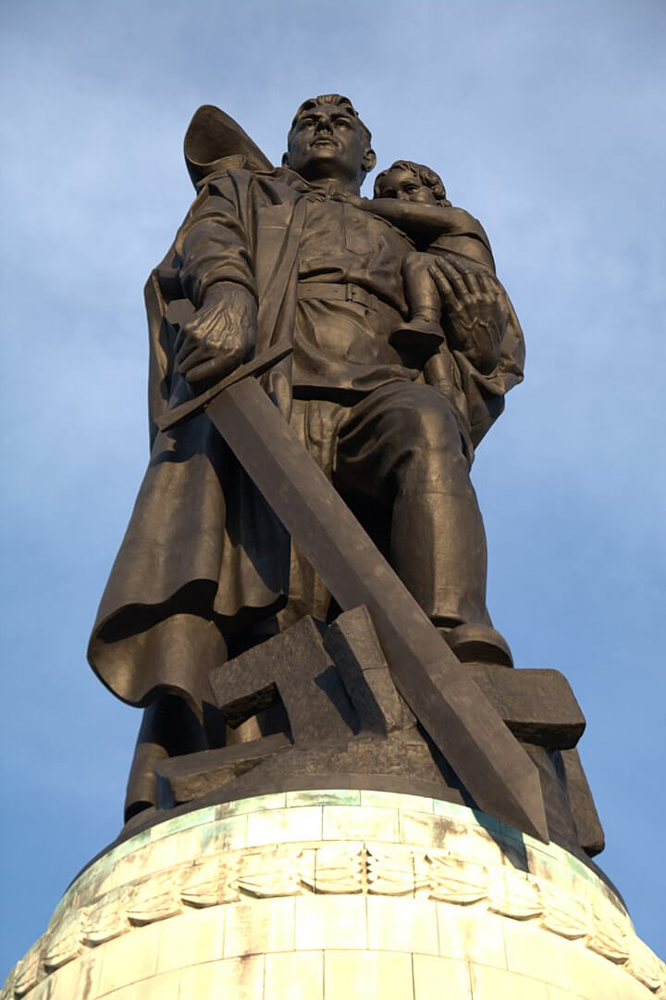

### Operacja berlińska

Wiadomość o rozpoczętej ofensywie i sukcesach Armii Czerwonej wywołała zrozumiałą panikę. Komunikacja nie działała, więc ulice zaczęły się zapełniać uciekinierami, którzy już wkrótce utworzyli prawdziwe kolumny blokując i tak utrudniony ruch wojska. Podobnie jak we Wrocławiu nie wszyscy uciekali. Nie było już dokąd uciekać. Istniała grupa ludzi, która nie mogła opuścić miasta bez pozwolenia, elita urzędników i funkcjonariuszy partyjnych, państwowych, miejskich. Urząd komendanta zaczęły zasypywać prośby o takie pozwolenie uzasadniane często w sposób, który budził sarkastyczny śmiech. Szef sztabu komendanta wydawał je od ręki:
>Było coś niemal komicznego, jeśli chodzi o powody, jakimi funkcjonariusze partyjni i państwowi uzasadniali swe prośby o opuszczenie miasta. I chociaż Goebbels zarządził, że "żaden mężczyzna zdolny do noszenia broni nie może opuścić Berlina" nie robiliśmy trudności [...] Większość ludności pozostała. Nie mieli takich możliwości, a w każdym razie i tak nie było czym uciekać, brakowało środków transportu.

Korzystając z uprzywilejowanej pozycji i niedostępnych innym zasobów elity finansowe i polityczne, w tym wielu zagorzałych nazistów, uciekały jak tylko mogły daleko na zachód. Uciekali ludzie bogaci i wpływowi. Berlińczycy ironicznie nazwali to "ucieczką złotych bażantów".

22 kwietnia z samego rana przez Łabę w okolicach Magdeburga przeprawiło się trzech żołnierzy Wehrmachtu w celu poddania się do niewoli. Był to rejon zatrzymanej na Łabie amerykańskiej 9 Armii.

Kiedy zaczęto ich przesłuchiwać okazało się, że jednym z nich jest generał porucznik Kurt Dittmar - oficer, który każdego dnia przez radio nadawał komunikaty z frontu i znany był jako "głos niemieckiego Wehrmachtu". Był cennym źródłem i chętnie mówił. Z miejsca zaczęto go pytać o rzeczy najważniejsze: co wie o Twierdzy Narodowej, jakie są tam siły, jak wygląda przygotowanie do obrony i czy jest tam Hitler.

Był bardzo zaskoczony tymi pytaniami. Jaka Twierdza Narodowa? Pytający byli uparci i nie od razu zaakceptowali wyjaśnienie Dittmara, że ta tak zwana Twierdza Narodowa jest mrzonką, nie istnieje, samo pojęcie zna, ale tylko raz o tym przeczytał w jakiejś szwajcarskiej gazecie.

Hitler natomiast - wyjaśniał Dittmar - jest w Berlinie, cały czas tam był i jest zdecydowany pozostać, zginie lub popełni samobójstwo, ale nigdzie nie zamierza uciekać. Obie te wiadomości były dla aliantów kompletnym zaskoczeniem, trudno powiedzieć która większym.

Z pewnością wiadomość, że w Berlinie jest Hitler była zaskoczeniem niezwykle gorzkim. Właśnie wjechały tam sowieckie czołgi.

### Atak

Pół miliona żołnierzy, 11 tys. dział i moździerzy, 2 tys. wyrzutni artyleryjskich i półtora tysiąca czołgów i dział samobieżnych.

- ze składu Frontu Białoruskiego walczyły 1 i 2 Gwardyjska Armia Pancerna, 3 i 5 Armia Uderzeniowa i 47 Armia
- natomiast ze składu 1 Frontu Ukraińskiego 2 i 4 Gwardyjska Armia Pancerna i część 28 Armii.

Tym razem sowieci przeszacowali siły obrońców - uznali że Berlina broni 300 tys. żołnierzy, 3 tys. dział i moździerzy i ćwierć tysiąca czołgów i dział szturmowych.

Główny marszałek lotnictwa Aleksandr Aleksandrowicz Nowikow na 25 i 26 kwietnia wyznaczył operację specjalną "Salut" - intensywne bombardowanie miasta. Pierwszy cios zadało 100 bombowców 18 Armii lotniczej, a potem dołączyła 16 Armia Lotnicza. ogółem w operacji wzięło udział 1368 samolotów, w tym 569 bombowców nurkujących Pe-2.

### Bitwa

20 kwietnia zamknięto dopływ wody do berlińskiego ZOO.

Radio jeszcze działało, ale 22 kwietnia przestał działać funkcjonujący nieprzerwanie od ponad stu lat telegraf, ostatnia depesza pochodziła z Tokio i brzmiała "*życzymy wam wszystkim szczęścia*". W ostatniej chwili z lotniska Tempelhof odleciał ostatni samolot z 9 pasażerami kierując się do Sztokholmu.

Goebbels wysłał straż pożarną na zachód, bo nie chciał by wozy wpadły w ręce sowietów. Kilka dni później komendant straży generał Walter Golbach, nie wiedząc kto wydał ten rozkaz, odwołał go i część wozów wróciła do Berlina. Kiedy się dowiedział przerażony świadomością, że odwołał rozkaz Goebbelsa usiłował popełnić samobójstwo. Jednak SS zdążyło go dopaść i dokonać przepisowej egzekucji.

Policja już dawno w całości była zmilitaryzowana i przestała pełnić funkcje porządkowe. W mieście zapanował chaos. Przerażeni perspektywą oblężenia i śmierci głodowej ludzie zaczęli w biały dzień rabować składy kolejowe i sklepy. Pracy natomiast nie przerwała stacja meteorologiczna w Poczdamie i 11 z siedemnastu browarów.

Berlińczycy przeklinali bombardujące ich samoloty, ale ich nienawiść była skierowana na bezosobową maszynę wojny, w gruncie rzeczy od początku sowieckiej ofensywy w styczniu 1945 mieli nadzieję, na to że Armia Czerwona zostanie zatrzymana, że utknie, a nagle znad Renu ruszą alianci i że nic ich na tej drodze nie zatrzyma. Wojna była przegrana, to wiedział każdy cywil, nie trzeba było być strategiem, żeby to dostrzec.

Ale była ogromna różnica między przegraną wobec aliantów zachodnich a koszmarem nadciągającym ze wschodu. Kiedy na początku kwietnia Amerykanie przełamali front i ruszyli na wschód robiąc kilkadziesiąt kilometrów dziennie, na krótko wydawało się to być w zasięgu ręki. Wszyscy słuchali niemieckich komunikatów radia BBC i śledzili posuwanie się jednostek US Army, niemalże jak wyzwolicieli. Bo w wizji berlińczyków tylko Amerykanie mogli ich wyzwolić, ale nie od reżimu Hitlera, nie od wojny, mieli ich uratować przed Armią Czerwoną, przed bestiami z goebbelsowskiej propagandy która z Nemmersdorf zrobiła symbol żywy w wyobraźni każdego Niemca. I nagle, z zupełnie niezrozumiałych przyczyn Amerykanie stanęli, zatrzymali się na Łabie.

Chwilę później ruszyła bolszewicka nawała i wszystkie nadzieje umarły. Amerykanie nie nadeszli i nie było ani jak ani dokąd uciekać. Znany nam z przemówienia we Wrocławiu doktor Werner Naumann przyznał:
>nasza propaganda na temat jacy są Rosjanie, czego ludność Berlina może się po nich spodziewać, była tak skuteczna, że wprawiliśmy berlińczyków w przerażenie. [...] posunęliśmy się za daleko, nasza propaganda rykoszetem trafiła w nas.

Jednym z sukcesów tej propagandy stała się popularność rozmów i rozmyślań na temat samobójstwa. Funkcjonariusze partyjni, urzędnicy szczebla ministerialnego, oficerowie z łatwością mogli się zaopatrzyć w truciznę, najbardziej popularną tej wiosny był cyjanek w kapsułkach znany jako KCB. Produkowano go masowo i już wkrótce wystarczyło pójść do lekarza pod byle pozorem i zapytać się o jakiś środek ostateczny. Ci którzy nie mieli dostępu do cyjanku gromadzili barbiturany, trutkę na szczury, albo lekarstwa, które łatwo było przedawkować. Popularne, szczególnie wśród kobiet stały się żyletki ukrywane dyskretnie w przyborach toaletowych. Rozmowy na temat samobójstw stały się powszechną rzeczą, chociaż oczywiście starano się nie mówić o tym przy dzieciach.

Metro było zapchane ludźmi, którzy się dusili i umierali. Umarłych nie można było przenieść przez tłum. Toalety zostały natychmiast zatkane. Miejsca znajdujące się bliżej powierzchni były zagrożone na zniszczenie rakietami, opowiadano sobie, że sowieci wszędzie gdzie wchodzą najpierw strzelają miotaczem ognia.

Tysiące cywilów koczowały w wieżach przeciwlotniczych wielkich żelbetowych monstrach rozstawionych wokół centrum miasta, które były najeżone bronią przeciwlotniczą. Teraz schowano w nich także najcenniejsze zbiory berlińskich muzeów.

Berlin nie zasłużył sobie na ten los, pomimo umizgów Hitlera i specjalnych starań NSDAP osiągało tu za czasów demokracji najgorsze wyniki. Na większe uroczystości partyjne trzeba było przywozić działaczy z Monachium. Poza tym teraz społeczeństwo Berlina to były prawie same kobiety. W 1939 miasto miało zrównoważoną charakterystykę demograficzną i około 4,3 mln mieszkańców, zapłaciło okrutną cenę za wojnę rozpętaną przez Partię. Z powodu strat w ludziach, poboru coraz większej liczby mężczyzn, a w końcu ucieczki tysięcy ludzi zawczasu przewidujących jaki los czeka stolicę III Rzeszy w styczniu 1945 pozostało w niej 2,9 mln ludzi, przy czym mężczyzn w wieku 18-30 lat było tylko 100 tys. Cornelius Ryan szacuje, że w wyniku strat wojennych pierwszych dni ataku wśród żywych wciąż pozostawało w obrębie miasta 2,7 mln ludzi z czego około 2 miliony to były kobiety. I co zadziwiające, nie wiadomo jak i po co, płacąc za to okrutną cenę Berlin wciąż się bronił. Front od strony północnej stanął w miejscu. Znaczący postęp udało się sowietom uzyskać od południa i południowego wschodu.

### Walka

24 kwietnia dowódca 5 Armii Uderzeniowej generał Nikołaj Erastowicz Bierzarin został wyznaczony na komendanta Berlina i dowódcę garnizonu berlińskiego. W Hermsdorf ustanowił pierwszą cywilną administrację z niemieckim burmistrzem.

Armia Czerwona od 23 kwietnia już na szerokim froncie walcząca w Berlinie znalazła się z nowej sytuacji. Walczyli w śmiertelnie niebezpiecznym otoczeniu gęstej zabudowy, artyleria nie miała dość miejsca by rozstawić działa, obserwatorzy artyleryjscy a często i sami artylerzyści znajdowali się bezpośrednio pod ogniem nieprzyjaciela. Często operowali ogniem na wprost, celując przez lufę, bywało że armaty wnoszono na piętra i strzelano z klatki schodowej, a wymontowane wyrzutnie katiusz umieszczano na dachach. 

Wróg był wszędzie naokoło, a bez ściśle wyznaczonych obszarów działań łatwo było o wejście w obszar własnego ognia sąsiedzkiej jednostki. Czerwonoarmiści szybko uczyli się znaczenia dobrej łączności między jednostkami. Działali bez wyznaczonego planu, orientując się mapą i kompasem na punkt centralny ich ostatniej bitwy - Reichstag. Tempo natarcia uległo znacznemu spowolnieniu, straty rosły. Czołgi nie mogły nacierać bez wsparcia piechoty, ta zaś nie mogła pozostawić za sobą nieprzeszukanych piwnic i budynków. To dawało przeciwnikowi czas na otrząśnięcie się z szoku i przygotowanie obrony.

W wielu miejscach pomiędzy atakującymi jednostkami znajdowały się spore odstępy, czasem spowodowane chaotyczną topografią Berlina i ogromną liczbą cieków wodnych, a czasem zmienną dynamiką natarcia. Nie istniała jakaś określona linia frontu, spora część Berlina to była ziemia niczyja.

Mapa: [Die Schlacht um Berlin, 26. April bis 2. Mai 1945](https://www.bundeswehr.de/de/organisation/weitere-bmvg-dienststellen/zentrum-militaergeschichte-sozialwissenschaften/podcasts-und-karten/zmsbw-aktuelle-karte-schlacht-um-berlin-1945-2963814)

Poruszanie się w zniszczonym mieście było utrudnione, z powodu dużych ilości metalu kompasy nie działały sprawnie, ulice były zablokowane, niebo zasnute dymem, mapy jeśli były, to były trudne w odczytaniu. Radio nie działało. 100 m czasem robiono w 2 godziny.

Zasadniczo ulicę zdobywano całym pułkiem, po jednym batalionie na stronę, trzeci w odwodzie. Pas natarcia pułku było to ok. 200 m. Zwykle piechota nie posuwała się ulicą, ale zdobywała budynek pietro po piętrze, często ciągnąc ze sobą lekką artylerię. W przypadku napotkania mocno bronionego budynku atakujący dzielili się na dwie części, jedna brała piwnice, gdzie zwykle obrońcy chronili się przed bombardowaniem, a druga wyższe piętra.

### Skutki

Berlin był zrujnowany przez kilkaset nalotów dokonywanych przez Amerykanów, Brytyjczyków od sierpnia 1940, a intensywnie w ramach operacji "Battle of Berlin" (analogicznie do Bitwy o Anglię) od 1943. Od sierpnia 1941 bombardowali go sowieci z terenów obecnej Estonii, ale potem z powodu utraty terytoriów utracili taką możliwość, powtórnie zaczęli go bombardować dopiero od 28 marca 1945.

Z powodu chaosu jakim był koniec wojny nie da się wiarygodnie oszacować strat żadnej ze stron. Zginęło ponad 20 tysięcy żołnierzy niemieckich. 70 tysięcy żołnierzy dostało się do niewoli. W ogóle podczas operacji berlińskiej do niewoli dostało się prawie pół miliona żołnierzy. Sowieci stracili 100 tysięcy zabitych i ponad 200 tysięcy rannych, przerażająca proporcja zabitych do rannych świadczy o zaciekłości walk. Zwykle jest to 1 do 5.

Zginęło ponad 120 tys. cywilnych mieszkańców Berlina, w kilka dni tyle co we Wrocławiu przez trzy miesiące. Ponad 20 tysięcy umarło ze stresu na atak serca, ponad 6 tysięcy popełniło samobójstwo, w ogóle samobójstwo stało się nie tylko w Berlinie normalnie dyskutowaną opcją, Partia dystrybuowała cyjanek w nieoficjalny, ale otwarty sposób. Nie trzeba było uzasadniać potrzeby posiadania śmiertelnej trucizny.

Pozbawieni wpływów i kontaktów cywile, najczęściej bez dostępu do broni mieli do dyspozycji arszenik, przedawkowanie środków nasennych, wisielczą pętlę, albo utopienie się w najbliższym zbiorniku wodnym. Nie tylko berlińczycy zabijali się na wszystkie możliwe sposoby. Zabijali się ze strachu przed sowietami, zabijali się też po tym co im sowieci zrobili.

Berlin został wydany władzy żołnierskiej czerni. Jak już pisałem w tym czasie z niewiele ponad dwóch i pół miliona ludności cywilnej w Berlinie, było dwa miliony kobiet. Gwałty za linią frontu są codziennością każdej wojny, dramatem pomijanym w opisie wydarzeń wojennych, nieobecnym w filmach i podręcznikach historii. Gunter Grass zapytany dlaczego opisuje okrucieństwa jakich dopuszczała się Armia Czerwona w zdobytym Gdańsku odparł: "*bo miały miejsce*".

### Gwałty

Kobiety wiedziały co je czeka. Ukrywały się, brudziły twarz, maskowały urodę. Relacje są bardzo do siebie podobne. Oddziały frontowe zachowywały się wobec ludności cywilnej bez zarzutu. Czasem dochodziło do rabunków, brutalnych przeszukań i sytuacja była niebezpieczna jeśli znaleźli broń lub porzucone mundury. Ale była to strefa wojny.

Najgorsze przychodziło kiedy linia frontu posuwała się o kolejne kilometry a za nią nadchodziła druga linia. Żołnierze nierzadko pozbawieni dowództwa, niejednolicie umundurowani i uzbrojeni, z nie wiadomo jakich jednostek, dziesiątki tysięcy sałdatów, nad którymi nie mogła zapanować żandarmeria szli masą i zaprowadzali swój porządek. Nocą nikt ich nie kontrolował. Najczęściej pijani, szukali zegarków, kosztowności i kobiet. Niewiele można było przed nimi ukryć.

W Treptower Park w czwartą rocznicę zakończenia wojny odsłonięto Pomnik Żołnierzy Radzieckich, dwunastometrowy monument przedstawia żołnierza Armii Czerwonej trzymającego dziewczynkę i depczącego swastykę. Nazywany bywa Pomnikiem Nieznanego Gwałciciela, jak oceniają historycy zwycięzcy żołnierze Stalina zgwałcili około 2 milionów kobiet w całych Niemczech z tego ponad sto tysięcy w samym Berlinie. Niektóre kobiety gwałcone były kilkadziesiąt razy, około ćwierć miliona zmarło w wyniku obrażeń, z tego w samym Berlinie 10 tysięcy.

Żołnierze Armii Czerwonej mieli na to przyzwolenie ze strony swoich władz. Skarżącemu się na okrucieństwa w Jugosławii Miłowanowi Dzilasowi, który był wówczas szefem misji wojskowej w Moskwie Stalin odrzekł:
>czy nie rozumiecie tego, że żołnierz, który przeszedł tysiące kilometrów przez krew i ogień, chce się trochę zabawić z kobietami i pobaraszkować z nimi?

Wyjątkowo brutalnie były traktowane kobiety w mundurach, praktycznie nie miały szans dostać się do niewoli. Na Niemcy spadł ogień okrucieństwa i zemsta za wszystko to czego dokonał Wehrmacht w licznych rozpętanych przez Hitlera wojnach, wszystko to czego dokonał żołnierz niemiecki, szczególnie na froncie wschodnim, a o czym nie chcieli wiedzieć dobrzy Niemcy znoszący cierpliwie ciężar wojny. Teraz tylko cierpliwość im pozostała, bo na to co ich spotkało nie mogli się nikomu skarżyć. Zbrodniarze w mundurach Armii Czerwonej byli anonimowi i nieuchwytni.

<BoxImageWrapper>

Statua Żołnierza Wyzwoliciela odsłonięta 8 maja 1946, dłuta Jakowa Biełopolskiego. Treptower Park, Berlin. 
By [Sly07192909](https://commons.wikimedia.org/w/index.php?title=User:Sly07192909&amp;action=edit&amp;redlink=1) - Praca własna, [CC BY-SA 3.0](https://creativecommons.org/licenses/by-sa/3.0), [Link](https://commons.wikimedia.org/w/index.php?curid=20630560)
</BoxImageWrapper>

Częściowo za okrucieństwa odpowiedzialna była propaganda, której zadaniem było zmotywowanie żołnierza do walki - znaczący udział miał tu Ilia Erenburg, którego wściekłe filipiki prasa publikowała na pierwszych stronach - charakterystyczny jest przykład z krytycznego momentu wojny, z lipca 1942:
>Nie liczcie dni, nie liczcie kilometrów. Liczcie tylko Niemców, których zabiliście. Zabij Niemca - to twojej matki modlitwa. Zabij Niemca - to wezwanie rosyjskiej ziemi. Nie wahaj się. Nie poddawaj. Zabij.

Już w kwietniu 1945 Erenburg popadł w niełaskę i zaczęto publikować artykuły, przekonujące, że to nie Niemcy są wrogiem a hitleryzm.

- War Archives ["Hitler's Bunker Revealed by the British (1945) | War Archives" [YT 4:30]](https://www.youtube.com/watch?v=C0hq8xBPrZA)