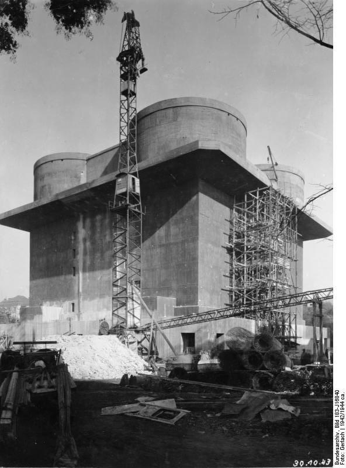

### Stolica Brandenburgii / Prus

<SeeAlso comment="Dokładniej o historii Berlina napisałem w artykule, w dziale 'Turystyka':" txt="Historia Berlina" url="/turystyka/brandenburgia/historia-berlina" />

Tutaj kilka najważniejszych faktów:

Berlin od średniowiecza był stolicą Brandenburgii, jednego z biedniejszych i mniej znaczących krajów niemieckich. Od początków XV wieku Brandenburgią włada dynastia Hohenzollernów. W XVI wieku jak większość dynastii północnych Niemiec przechodzą na ewangelicyzm. W 1 połowie XVII wieku większość krajów niemieckich pogrąża się w wyniszczającej wojnie trzydziestoletniej - Brandenburgią rządzi Wielki Elektor, od którego zaczyna się systematyczne i typowe dla Brandenburgii przyjmowanie wzorów z innych krajów, importowanie ludności i przyjmowanie dysydentów religijnych. Bardzo szybko Hohenzollernowie zaczynają budować silną armię zawodową należącą do państwa. W ten sposób następuje wzrost znaczenia Brandenburgii, napływowa ludność zapewnia nowoczesne rozwiązania, kontakty na całym świecie, a z armią zaczynają się liczyć obce dwory.

Główna gałąź Hohenzollernów władająca Brandenburgią, przejmuje opiekę nad chorym następcą tronu zlaicyzowanego księstwa pruskiego, potem przez małżeństwo na drodze uni personalnej i przy polskiej zgodzie przejmują władzę nad Prusami. Żeby móc korzystać z niedostępnego na terenie Rzeszy Niemieckiej przywileju posiadania korony królewskiej - koronują się w Królewcu stolicy Prus, które do Rzeszy nie należały. Żeby ta korona królewska należała do całej ich dziedziny dokonują zmiany nazwy kraju: z Brandenburgii na Prusy. Powstaje silne, sprawnie zarządzane i szanowane w całej Europie państwo: jedni boją się ich potężnej i karnej armii, inni chwalą jako oświecone państwo prawa i tolerancji religijnej; jedno i drugie jest prawdą.

### Stolica Rzeszy

W ciągu niewiele ponad stu lat od wojny trzydziestoletniej do panowania Fryderyka II Wielkiego Brandenburgia / Prusy z pariasa świata niemieckiego awansowała do pierwszorzędnego zawodnika w wyścigu o dominację nad tym światem. Wkrótce po śmierci Fryderyka przemarsz potężnej armii Napoleona rozbija dotychczasowy porządek Rzeszy rządzonej przez Habsburgów z Wiednia.

W XIX wieku już po epoce napoleońskiej kiedy pojawia się kwestia zjednoczenia krajów niemieckich jest tylko dwóch kandydatów do tej roli: dotychczasowe centrum czyli Austria Habsburgów i Prusy Hohenzollernów, a ściśle rzecz biorąc ówczesnego kanclerza (premiera) Ottona von Bismarcka. To właśnie Bismarck w serii trzech wojen doprowadził w 1871 do pruskiego zjednoczenia Niemiec w postaci II Rzeszy: 60% terytorium i ludności tego państwa stanowiły Prusy, a jego stolica znajdowała się w Berlinie. Austria została wykluczona i od tej pory stanowiła oddzielne państwo.

Tak Berlin z trzeciorzędnego miasta o regionalnym znaczeniu stał się stolicą Niemiec. W 2 połowie XIX gwałtownie rozwijał się przemysł w aglomeracji berlińskiej, samo miasto bardzo długo było niewielkie. Dopiero po Wielkiej Wojnie zaszła gwałtowna zmiana - w 1920 ustawa o Wielkim Berlinie powiększyła to miasto ponad 10 razy, z 80 km2 do prawie 900 km2. W obrębie Berlina znalazło się kilka miast, nieraz od niego starszych i kilkadziesiąt wsi. W okresie międzywojennym cały ten teren uległ poważnej unifikacji, ale do dziś Berlin jest ogromnym obszarem zróżnicowanej zabudowy, są tam dzielnice typowo miejskie, wiele całkowicie mieszczańskich dziewiętnastowiecznych obszarów z własnymi ratuszami i terenami przemysłowymi oraz dzielnice willowe wciąż zachowujące wiejski charakter, pałace z parkami, jeziora i rozległe na wpół dzikie lasy.

Stolica Niemiec z relatywnie niewielkiego miasta pośrodku miejsko-wiejskiej aglomeracji administracyjnie urosła do molocha trzykrotnie większego od obecnego Wrocławia i prawie dwukrotnie większego od takich stolic jak obecne Warszawa czy Praga. Berlin  otacza Berliner Ring, zewnętrzna obwodnica autostradowa, częściowo zbudowana w 1936 w ramach RAB (niem. Reichsautobahn) Fritza Todta, nosiła wtedy oznaczenie RAB 7. W latach 70 NRD dokończył tę inwestycję od zachodu i północy, obecnie jest to BAB 10.

Wewnątrz jest ogromny obszar o bardzo zróżnicowanej historii i charakterystyce, z dużą ilością lasów, labiryntem cieków wodnych i całkowicie płaski. Zabudowa co do zasady jest niewysoka. Najwyższą wówczas budowlą była wieża radiowa Funkturm o wysokości 147 m na terenach wystawowych (1926). Najwyższym budynkiem Katedra (1905), której kopuła wznosiła się wówczas na wysokość 116 m. Ale tam gdzie są kamienice są one wysokie. Tak więc nie ma żadnych wyraźnych punktów orientacyjnych, żadnych geograficznych wyróżników dla poszczególnych części Berlina. Dla obcej armii Berlin jest płaskim molochem pełnym pułapek i przeszkód.

### Berlin lat 30.

Berlin i Hamburg to "czerwone" miasta Niemiec. Hitler miał osobistą awersję do Berlina jeszcze z czasów Wielkiej Wojny, to właśnie tam podczas urlopu z wojska zetknął się po raz pierwszy z jawną niechęcią do wojny. Gdyby nie stołeczna rola Berlina nigdy więcej by się tam nie pojawił. Uznał, że jest to centrum dekadencji i defetyzmu. Silny ośrodek komunistyczny. Wszak to w Berlinie proklamowano Republikę, a potem wybuchło powstanie Spartakusa.

Znaczenie stolicy podkreślał wybór gauleitera Berlina, którym od samego początku do samego końca czyli w latach 1928-45 był nie kto inny a sam Joseph Goebbels. Pomimo umizgów Hitlera i specjalnych starań NSDAP osiągało tu za czasów demokracji najgorsze wyniki. Na większe uroczystości partyjne trzeba było przywozić działaczy z Brandenburgii a czasem i Monachium.

Już za czasów hitlerowskich cały aparat partyjno-państwowy przywieziono w teczkach. Bezpośrednio przy dworze Hitlera robiło się najlepsze kariery. W latach 1934-38 powstaje ogromny gmach Banku Rzeszy, 1935-36 Reichsluftfahrtministerium, 1938-39 Nowa Kancelaria Rzeszy. Do 1938 powstaje główna część obwodnicy autostradowej. Duże znaczenie dla miasta miała Olimpiada 1936, to wtedy powstało lotnisko Tempelhof w obecnym kształcie i Stadion Olimpijski.

Pomimo dokonanych zmian, poważnej przebudowy i upartyjnienia miasta Berlin wciąż budził awersję Hitlera, który wolał Monachium i górską siedzibę w Berchtesgaden. Nienawidził Czerwonego Ratusza a Shell-Haus i cały modernizm uznał za "zbrodnię". Planował totalną przebudowę stolicy Rzeszy w pompatycznym, monumentalnym stylu i nawet zmianę nazwy na Germania.

### Wojna

W 1939 miasto miało zrównoważoną charakterystykę demograficzną i około 4,3 mln mieszkańców. Zapłaciło okrutną cenę za wojnę rozpętaną przez Partię. Od 1943 zaczęto ewakuację zbędnej z punktu widzenia wojny ludności. Do 1944 wywieziono 1,2 mln ludzi, z tego 800 tys. to kobiety i dzieci. Ewakuację wstrzymano kiedy okazało się, że brakuje ludzi do pracy. Jesienią 1944 nastąpił napływ uciekinierów ze wschodu, ale pozwalano im zatrzymać się w Berlinie tylko dwa dni.

Z powodu strat w ludziach, poboru coraz większej liczby mężczyzn, a w końcu ewakuację i ucieczkę tysięcy ludzi zawczasu przewidujących jaki los czeka stolicę w końcu wojny - w styczniu 1945 pozostało w niej 2,9 mln ludzi. Ze względu na potrzeby frontu tylko 100 tys. z nich to byli mężczyźni w wieku od 18 do 30 lat. 100 tys. robotników przymusowych gł. Francuzi i Rosjanie.

Cornelius Ryan szacuje, że w wyniku strat wojennych pierwszych dni ataku wśród żywych wciąż pozostawało w obrębie miasta 2,7 mln ludzi z czego około 2 miliony to były kobiety.

### Bombardowania

W często przytaczanym powiedzeniu (na które jednak brak jednoznacznego źródła) Hermann Göring miał powiedzieć, że jeśli choć jeden bombowiec dotrze nad Niemcy / Zagłębie Ruhry / Berlin (zależnie od wersji) to on "będzie się nazywać Meier". Powiedzenie to krążyło w różnych wersjach jeszcze podczas wojny i dlatego syreny przeciwlotnicze nazywano Meiers Waldhorn (rogi myśliwskie Meiera, co stanowiło dodatkową aluzję do upodobania Göringa do polowań).

W rzeczywistości pierwsze bombowce alianckie nadleciały nad Niemcy zaraz po ataku na Francję w nocy z 10 na 11 maja 1940 bombardując Dortmund.

W nocy 7 czerwca 1940 Farman F.220 francuskiej marynarki zrzucił 250 kg bomb na Berlin. Tak zaczęło się pięć lat bombardowania Berlina.

Po zwycięstwie nad Francją od baz lotniczych w Anglii do Berlina było prawie 1000 km, co sprawiało, że bombardowanie było nie tylko ryzykowne, ale w ogóle możliwe tylko latem kiedy noce były krótsze i tylko przy niezachmurzonym niebie.

25 sierpnia 1940 pierwsze bombardowanie RAF zostało skierowane na lotnisko Tempelhof i Siemensstadt. W ciągu kolejnych 2 tygodni nastąpiło 5 takich ataków. Pomimo poważnych strat i niewielkich skutków takich bombardowań kontynuowano je w ciągu 1940 i 1941 bo jak to ujął szef sztabu RAF sir Charles Portal "warto obudzić cztery miliony ludzi i zapędzić ich do schronów". 

8 sierpnia 1941 zaczęły się sowieckie bombardowania Berlina z bazy Saaremaa w Estonii, a potem z Leningradu. Przy poważnych stratach (17 samolotów i 70 lotników) udało im się zrzucić na Berlin 36 ton bomb.

7 listopada 1941 Peirse wysłał rekordową liczbę 160 bombowców na Berlin, 21 z nich zostało zestrzelonych co spowodowało zwolnienie go ze stanowiska. Jego funkcję w lutym 1942 przejął sir Arthur Travers "Bomber" Harris zawzięty entuzjasta bombardowań dywanowych:
>Hitlerowcy przystąpili do wojny z naiwnym oczekiwaniem, że będą bombardować wszystkich naokoło, a nikt nie będzie bombardować ich. W Rotterdamie, Londynie, Warszawie i setkach innych miejsc wcielili w życie swoje głupie teorie. Zasiali wiatr, a teraz zbiorą burzę.

Harris musiał poczekać, choć w 1942 RAF odebrał nowe bombowce Avro Lancaster, które zupełnie zmieniały jego możliwości był to czas bitwy o Atlantyk. Ten rok Berlin przespał spokojnie, RAF dokonał tylko 9 bombardowań miasta, a front wschodni był za daleko jak na możliwości sowieckiego lotnictwa.

Przełom nastąpił w 1943: RAF w tym czasie dysponowała flotą 800 bombowców strategicznych Avro Lancaster i zupełnie nowym wyposażeniem: radarami H2S, które mogły być umieszczone na wiodących bombardowanie samolotach i dzięki temu umożliwiały celne bombardowanie niezależnie od warunków pogodowych.

Już 30 stycznia w rocznicę świętowanego przez nazistów Machtergreifung dokładnie w godzinach planowanych przemówień Göringa i Goebbelsa nastąpiły dwa bombardowania dokonane przez brytyjskie de Havilland Mosquito. Kolejne takie bombardowanie nastapiło w urodziny Hitlera 20 kwietnia.

Zasadnicza ofensywa bombowa nastąpiła dopiero jesienią - od listopada 1943 do marca 1943.

W nocy z 18 na 19 listopada 440 ciężkich bombowców Avro Lancaster zaatakowało miasto, ale chmury i deszczowa pogoda zminimalizowały skutki bombardowania.

Kolejny nalot odbył się w nocy z 22 na 23 listopada. Z powodu niskiej wilgotności powietrza zniszczenia były poważne, rozpętało się wiele pożarów. Zbombardowano obszar na zachód od centrum miasta aż po Spandau. To wtedy uległ zniszczeniu Kaiser-Wilhelm-Gedächtniskirche. Zginęło 2 tys. ludzi.

17 grudnia zaatakowano węzeł kolejowy, w nocy z 15 na 16 stycznia tereny przemysłowe, głównie Siemensstadt. Ogółem w wyniku 16 bombardowań zabito ok 4 tys. ludzi, rannych było 10 tys., a prawie pół miliona straciło dom. Utracono przy tym ponad 500 bombowców z załogami, które zginęły lub dostały się do niewoli. Stanowiło to 5,8% wszystkich wysłanych samolotów (5% to była dopuszczalna norma dla RAF).

Big Week aka Operation Argument to seria intensywnych bombardowań przeprowadzonych wspólnie przez RAF i amerykańskie USAAF w dniach 20-25 lutego 1943. Celem ataku było zaplecze produkcyjne i materiałowe Luftwaffe, ale operacja miała przede wszystkim doprowadzić do zgrania jednostek brytyjskich i amerykańskich i wymiany doświadczeń. Amerykanie zbudowali na poligonie Niemiecką Wioskę i opracowali metodykę niszczenia niemieckiej architektury. Ponadto zapewnili Brytyjczykom osłonę w postaci myśliwca dalekosiężnego P-51 Mustang.

4 marca 1944 Amerykanie po raz pierwszy zaatakowali Berlin. 730 bombowców w osłonie 800 myśliwców. Stracili 69 B-17, ale strącono 160 niemieckich samolotów. Straty niemieckie były już nie do zastąpienia.

Ostatnie duże bombardowanie tego roku nastąpiło w nocy z 24 na 25 marca 1944. Straty alianckie osiągnęły rekordowy poziom 8,9%. Od czerwca 1944 priorytetem alianckiego lotnictwa było wsparcie wojny we Francji.

Berlin ponownie stał się celem bombardowań po starcie operacji wiślańsko-odrzańskiej. Przy poparciu Eisenhowera 1,5 tys. amerykańskich bombowców z osłoną tysiąca myśliwców zaatakowało Berlin 3 lutego, ponieważ Amerykanie byli przekonani, że 6 Armia Pancerna niemiecka kieruje się przez Berlin na front wschodni. Celem była infrastruktura kolejowa dlatego użyto głównie bomb burzących, ale intensywność ataku była tak duża, że rozpętały się burze ogniowe i pożary trwające kolejne cztery dni. Obrona plot była już wyczerpana, miasto było bezbronne, Amerykanie utracili tylko 36 samolotów. Zginęło prawie 3 tys. ludzi.

Kolejne duże bombardowanie odbyło sie 26 lutego 1945.

Od lutego 1945 bombardowania przeprowadzane były według precyzyjnego schematu: Anglicy bombardowali miasto w nocy, Amerykanie pojawiali się punktualnie po godz. 0900. Dlatego berlińczycy tak się spieszyli z porannymi zakupami i w drodze do pracy. Nikt o tej porze, niezależnie od utrudnień komunikacyjnych, nie chciał znaleźć się na ulicy. Pomimo ogromu zniszczeń jakoś dawało się z tym żyć, można było przewidzieć porę, a czasem nawet obszar który zostanie zbombardowany.

28 marca nastąpił niespodziewany, pierwszy atak lotnictwa sowieckiego na Berlin. Inny niż dotychczasowe, nagły i wywołujący panikę. Myśliwce i samoloty szturmowe Ił-2 ostrzeliwały miasto z broni pokładowej. Od tej pory atakowali go regularnie.

W nocy z 20 na 21 kwietnia ostatni nalot RAF - 78 bombowców Mosquito.

21 kwietnia rozpoczęty zgodnie z harmonogramem o godzinie 0925 amerykański nalot. Był to ostatni z 363 alianckich nalotów. Od tego dnia Berlin jest w wyłącznym, sowieckim władaniu.

Dwie godziny później ok godz. 1130 berlińczycy po raz pierwszy usłyszeli ten charakterystyczny, świdrujący, pochodzący jakby z innego świata dźwięk. Gwałtownie zmieniał wysokość, zamienił się w gwizd i wtedy eksplozja rozerwała się na ulicy pełnej ludzi czekających w kolejce. Strzępy ciał, bryzgająca krew, nieludzkie wrzaski umierających i przerażonych ludzi. Po chwili to samo, znów ten dziwny dźwięk i znów eksplozja. To Armia Czerwona dostarczyła spóźniony prezent na urodziny Hitlera - Berlin znalazł się w zasięgu sowieckiej artylerii.

Ostrzał artyleryjski to było coś zupełnie nowego. Nieprzewidywalny, morderczy, nieprzerwany. Dokładnie tak samo jak we Wrocławiu od tej pory w Berlinie ludzie zamieszkali na stałe w piwnicach. Tłumy zaczęły gromadzić się w metrze. Według niektórych źródeł już 20 kwietnia sowieci ostrzeliwali centrum Berlina artylerią, ale wieczorem 20 kwietnia dotarli do Atlandsberg - 20 km od Mitte. Natomiast 21 kwietnia mogli rozładować artylerię w Marzahn - dzielnicy Berlina słynącej z blokowiska, nazistów i chuliganów, wtedy natomiast to były berlińskie dzikie pola, a do Mitte było 10 km.

- [Bombing of Berlin in World War II](https://en.wikipedia.org/wiki/Bombing_of_Berlin_in_World_War_II) | [H2S (radar)](https://en.wikipedia.org/wiki/H2S_(radar)) | [Oboe (navigation)](https://en.wikipedia.org/wiki/Oboe_(navigation))

### Obrona przeciwlotnicza

Schrony berlińskie były planowane jeszcze przed wojną, ale ponieważ nie miały wysokiego priorytetu realizacja tych planów była bardzo opóźniona. Udało się zbudować pięć większych schronień w stacjach metra (Zoo, Anhalt Station, Humboldthain, Friedrichshain i Kleistpark) dla 65 tys. ludzi.

W 1944 ochrona przeciwlotnicza zapewniana przez luftwaffe była coraz słabsza, główny wysiłek przejęły wieże przeciwlotnicze obsadzone przez Hitlerjugend i BMD.

### Flakturm

Jedynymi silnymi punktami obrony były Wieże Przeciwlotnicze (niem. Flakturm, l mn Flaktürme), ukończone w latach 1941-42 kiedy Berlin stał się celem bombardowań dywanowych. Były to ogromne jak średniowieczne zamczyska, żelbetowe wieże wysokie od 40 do 55 m, ze ścianami grubości 3,5 m.

Budowane były zawsze parami:

- **L-Turm** (Leitturm) wieża naprowadzająca na której znajdował się radar ([Würzburg-Riese](https://de.wikipedia.org/wiki/W%C3%BCrzburg-Riese)); podczas ataku urządzenia radarowe były chowane do wnętrza i ta wieża nie brała udziału w walce,
- **G-Turm** Gefechtsturm wieża bojowa z artylerią przeciwlotniczą, była już przygotowana do obrony. Jej przestronne wnętrza były załadowane amunicją, która jechała ku górze windami. Maksymalna szybkostrzelność wieży to 8 tys. pocisków na minutę (230 na sekundę!) z wszystkich armat. Były tam i działa o kalibrze 2 cm, słynne 88, ale najgroźniejsze dla bombowców były armaty 12.8 cm FlaK 40 o zasięgu 15 km i szybkostrzelności 12 strzałów na minutę. Było to najgroźniejsze działo przeciwlotnicze tej wojny.

Niemcy zbudowali osiem takich par wież, dwie były w Hamburgu, trzy w Wiedniu. Te wiedeńskie zachowały się ze zwykłego zaniechania w najlepszym stanie.

W Berlinie były trzy:

- **Tiergarten** na terenie Zoo "Gustav" ukończona w kwietniu 1941, sztab 1. Flakdivision; nic z niej nie ocalało
- **Friedrichshain** ukończona w październiku 1941, przechowywano tam berlińskie dzieła sztuki, wiele z nich zostało zniszczonych lub skradzionych przez RKKA, poważnie zniszczona, resztki są przykryte ziemią i stanowią pagórki
- **Humboldthain** oddana w kwietniu 1942, zachowana najlepiej, jedną z nich można zwiedzać.

Czwartą planowano w parku Hasenheide w pobliżu lotniska Tempelhof.

Podczas bitwy doskonale się sprawdziły, stanowiły schronienie dla ludności cywilnej, podobno mogło się tam zmieścić 30 tys. ludzi i byli rzeczywiście dobrze chronieni. Sowieci nie mieli czym ich zniszczyć, nie mieli jeszcze rakiet na samolotach, nie dawały im rady nawet największe jakie tam posiadali moździerze 203 mm. Na szczęście dla atakujących były tylko trzy i dało się je ominąć.

<BoxImageWrapper>

Wieża Przeciwlotnicza podczas budowy, 1942 
By Bundesarchiv, Bild 183-J16840 / CC-BY-SA 3.0, [CC BY-SA 3.0 de](https://creativecommons.org/licenses/by-sa/3.0/de/deed.en), [Link](https://commons.wikimedia.org/w/index.php?curid=5364773)
</BoxImageWrapper>

### Zagra-lin

Zamachy w 1943:

- 13 lutego
- 24 lutego na stacji kolejki podziemnej S-Bahnhof Friedrichstrasse, eksplozja zabiła 36 osób, 78 odniosło rany
- 10 kwietnia Dworzec Główny (? nie było takiego) 14 ofiar

### Festung Berlin

Berlin jest niejednorodny w nieprzewidywalny sposób, wynika to z tego, że ustawa o Wielkim Berlinie połączyła kilkadziesiąt wsi i 8 miast, niektóre z nich (np. Köpenick) były starsze od Berlina, wszystkie miały własną strukturę urbanistyczną, rynki i ratusze. Otoczenie miasta natomiast to niewielkie miejscowości i wszędzie pełno lasów i przeszkód wodnych. Jest to idealna okolica dla zablokowania wojsk pancernych. Taki był pierwotny plan - wykorzystując znajomość terenu w rozproszony sposób blokować natarcie wszędzie gdzie się da. Hitler jednak, ten nieoceniony geniusz strategii, zadecydował inaczej. Berlin będzie cytadelą o jednolitej, potężnej linii obrony.

Berlin, już poważnie zniszczony licznymi bombardowaniami czekał los Wrocławia, miasta bronionego za wszelką cenę. Pierwszym komendantem miasta od 6 marca do 19 kwietnia był generał Reymann, który miał, wzorem Wrocławia i Królewca, zbudować lotnisko w centrum miasta - pomiędzy Bramą Brandenburską a Kolumną Zwycięstwa. Garnizon Twierdzy Berlin był przypadkową zbieraniną ludzi i sprzętu.

Reymann wielokrotnie domagał się przedstawienia planu ewakuacji ludności cywilnej i nieustannie otrzymywał zapewnienia, że takowy istnieje i zostanie wprowadzony w życie na rozkaz Goebbelsa. W końcu dotarł do tego planu, była to mapa w skali 1:300 000 z wyrysowanymi drogami ewakuacji, mieszkańcy Berlina mieli pieszo przebyć 20 do 30 km do najbliższych podmiejskich stacji kolejowych, gdzie miały na nich oczekiwać składy kolejowe. Nie przewidziano żadnych służb które miałyby tę ewakuację zorganizować, żadnych punktów sanitarnych, transportu dla chorych i słabych, nie przewidziano przede wszystkim skąd weźmie się te pociągi. Miała powtórzyć się sytuacja z Wrocławia. Podobnie jak Wrocław Berlin otoczony był przez trzy źle poprowadzone, istniejące fragmentarycznie i nieobsadzone linie obronne. Ale była jedna istotna różnica, o Wrocław walczyła trzeciorzędna, słaba 6 Armia, a na Berlin nacierała siła dwóch Frontów, całe wojsko jakie mógł rzucić do walki Stalin.

Podobnie jak Wrocław miasto oficjalnie zostało ogłoszone twierdzą, choć w rzeczywistości nie posiadało własnego garnizonu. Dotychczasowy przebieg wojny pozbawił społeczeństwo niemieckie rezerw mobilizacyjnych. Według ocen generała Reymanna do obrony Berlina potrzebny była załoga około 200 tysięcy przygotowanych do walki i dobrze uzbrojonych żołnierzy.

Tymczasem dysponował pewną trudną do ustalenia liczbą jednostek jeśli nie dobrze wyposażonych to przynajmniej zmotywowanych do walki, jak np. SS, ale większość załogi to było około 60 tysięcy pospiesznie zmobilizowanych i niewyszkolonych żołnierzy Volkssturmu.

Formacja ta w ogóle nie podlegała dowództwu wojskowemu, była do dyspozycji Gauleitera i wojsko mogło im wydawać rozkazy dopiero w bezpośredniej strefie walki. Gauleiterem Berlina od początku aż do końca istnienia gau był zaś Joseph Goebbels, który nie miał czasu na takie drobnostki. Nie mieli mundurów, kuchni polowych, pojazdów ani własnej łączności. Niewiele ponad połowa w ogóle posiadała jakąś broń, a nawet ci którzy byli uzbrojeni nie zawsze wiedzieli jak się tą bronią posługiwać. Ich uzbrojenie było mieszaniną tego co się udało zebrać w magazynach i pochodziło z całej Europy. Jak to podliczył komendant posiadali co najmniej 15 typów karabinów i 10 typów karabinów maszynowych. Znalezienie do nich amunicji było koszmarnie trudnym zadaniem. W najlepszej sytuacji były bataliony wyposażone we włoskie karabiny - dysponowali 20 nabojami na żołnierza. W pierwszym dniu natarcia statystyczny Volkssturmista posiadał około 5 naboi. Później sytuacja się pogarszała.

Miasto opasane było kilkoma liniami umocnień:

- Pierwszy, najbardziej rozległy, istniał tylko częściowo, tam gdzie był pod bezpośrednim nadzorem armii. Nawet gdyby był ukończony nie miał szans odegrać żadnej roli - do obrony takiego obszaru Niemcy nie mieli już sił. Zgodnie z najlepszą tradycją propagandy sukcesu wystarczyło przygotować teren do umieszczenia stanowisk CKM, żeby zaznaczyć na mapie "silny punkt oporu".
- Trzy związane z miastem:
  - Zewnętrzny był prowizoryczną linią składającą się z przeszkód naturalnych, i w pośpiechu montowanych barykad, zapór, punktów ogniowych. Wszystko to konstruowano i montowano ręcznie, paliwo bowiem było zarezerwowane dla wojsk pancernych, zresztą maszyn już prawie nie było. Brakowało ludzi do budowy fortyfikacji, z planowanych 100 tysięcy udało się wysłać do pracy tylko 30 tysięcy. Nawet dla tej liczby brakowało łopat i prostych narzędzi. Prasa apelowała o kilofy i łopaty, ale jak to powiedział jeden z dowódców: "*berlińscy ogrodnicy najwyraźniej doszli do wniosku, że kopanie ich działek kartofli jest ważniejsze niż kopanie pułapek czołgowych*"
  - Środkowy - najlepszy z nich - zbudowany na bazie systemu kolejowego był prawdziwą przeszkodą, wymagał tylko obsadzenia załogą, wyposażenia w działa przeciwpancerne i zaminowania. Ale kto miał to zrobić skoro rozkazy wychodzące z bunkra Hitlera do jednostek polowych były jednoznaczne: pozostać na pozycjach, ani kroku w tył. Również dowódca Grupy Armii Wisła, generał Gotthard Heinrici, za wszelką cenę chciał uniknąć wprowadzenia swoich wojsk do miasta, a innych nie było.
  - Wewnętrzyny rejon umocnień, tzw Cytadela wytyczał kanał Landwehry i Szprewa, była to dzielnica rządowa.
  
Z różnych przyczyn żadna z tych linii umocnień nie odegrała żadnej roli w obronie Berlina, dwie zewnętrzne praktycznie nie istniały, środkowa nie została obsadzona, obrona wewnętrznej nie miała żadnego sensu, kiedy sowieci tam dotarli dowództwo już nie istniało.

Od 23 kwietnia aż do samego końca walk dowódcą obrony jest generał Weidling.

Jego własny LVI Korpus Pancerny jest tak naprawdę jedyną ważną jednostką biorąca udział w walkach o miasto. Ale z pięciu dywizji wchodzących w jego skład tylko dwie stanowiły rzeczywistą siłę bojową: 11 Dywizja Grenadierów Pancernych SS Nordland i 18 Dywizja Grenadierów Pancernych. Do tego dochodziły elementy LSAAH i kilkuset francuskich esesmanów z 33 Dywizji Grenadierów Pancernych SS Charlemange. Reszta to była zbieranina gorsza od wrocławskiej. Bronić mieli miasta kilkukrotnie większego, a nieprzyjaciel był po pierwsze przynajmniej dziesięciokrotnie silniejszy a po drugie zdeterminowany. Wszyscy czerwonoarmiści wiedzieli i czuli to każdym wystrzałem, że jest to już ostatnia bitwa i koniec tej strasznej wojny.