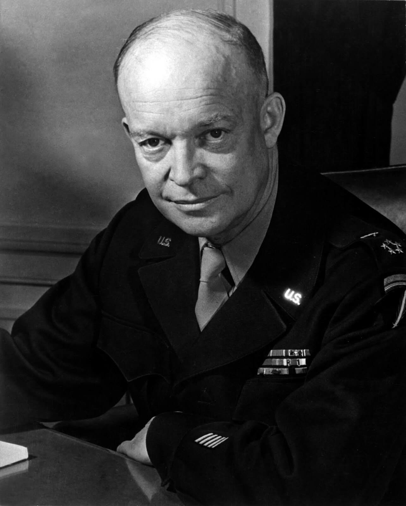

<DolnySlask />

### Eisenhower a sprawa śląska

Pierwotnym i cały czas najważniejszym tematem tego bloga jest wojna na Śląsku i bitwa o Wrocław. Jakie znaczenie może mieć depesza głównodowodzącego aliantów zachodnich do Stalina dla sytuacji na kluczowym odcinku frontu wschodniego i w rezultacie dla Wrocławia i Śląska?

Żeby to zobaczyć musimy odwrócić wzrok wpatrzony w zgliszcza i tych biednych ludzi, którzy chcą tam przeżyć. Popatrzmy na bitwę z szerszej perspektywy, z takiej, w której nie ma ona żadnego znaczenia. Był to bowiem w tej wojnie epizod, tragiczny i dla ludzi, którzy go doświadczyli i dla miejsca, które zostało zniszczone, ale - jeśli chcemy ocenić jego rolę - całkowicie bez znaczenia dla przebiegu wojny. To tylko przydaje mu tragizmu.

### Sytuacja na froncie polskim

Jeżeli popatrzmy na skalę sowieckiego uderzenia w operacji wiślańsko-odrzańskiej, możemy zobaczyć, że oblężenie Wrocławia było nieuniknione. Niemcy nie mieli żadnej możliwości, by zablokować przedarcie się Armii Czerwonej, w którymś ze słabiej bronionych nadodrzańskich miast Dolnego Śląska. Wobec braku możliwości ofensywnych, wrocławskiego garnizonu, to że Wrocławia nie zdobyli, miało dla lokalnego teatru wojny tylko dwa skutki: ciągle istniał punkt oporu, do którego mogły odwołać się siły Schõrnera i który wiązał 6 Armię, oraz drugi: nie mogli użyć wrocławskich mostów na Odrze. Żaden z nich nie był poważną przeszkodą dla przebiegu operacji dolnośląskiej. Miała ona inne, niezależne od Wrocławia i ważniejsze przeszkody. Bardziej liczyło się w kalkulacjach sztabowych to, że Wrocław wciąż był nieujarzmionym elementem kalkulacji mgły wojny. Sam fakt, że Wrocław oblegała tylko 6 Armia - słaba i pod względem dowodzenia i kadry i wyposażenia - świadczy wystarczająco, o tym, że 1 Front Ukraiński marszałka Koniewa miał ważniejsze, bieżące cele operacyjne. Dowodem słabości Iwana na tym odcinku było to, że nawet nie podjął próby zdobycia Sobótki, małego miasteczka leżącego 30 km na południe od Wrocławia. Były tam równie słabe oddziały osłonowe Schörnera. Obaj wyczerpani wojną przeciwnicy byli niezdolni do walki ofensywnej i trzymali się na bezpieczny dystans.

Czasem powtarza się pytanie lub tezę, dlaczego Koniew nie zostawił po prostu sił blokujących i nie poszedł dalej. Nie mógł tego zrobić z co najmniej trzech powodów:

- pierwszym był brak takiej tradycji w Armii Czerwonej, która nie ma przykładu takiego działania na całej ścieżce bojowej. Każda armia, każde wojsko ma jakieś rutyny, czasem nieformalne, a Armia Czerwona, jak to z dumą mówią jej dowódcy: "najbardziej atakująca ze wszystkich armii świata", choć może czasem słaba w obronie, nigdy za linią frontu nie pozostawiła nieatakowanego obiektu na dłużej, niż to było potrzebne do przygotowania ataku. Tak było z Poznaniem początkowo pozostawionym w oblężeniu, ale kiedy tylko możliwości elity frontu wyczerpały się po dotarciu do Odry, jak tylko było to możliwe, przystąpiono do ataku i nie przerwano go aż Poznań padł.
- Drugim powodem była oczywista ambicja marszałka Koniewa, który wiedział, że z okazji zdobycia Wrocławia armaty w Moskwie wystrzelą serię salw. Chciał mieć to trofeum, chciał mieć te salwy, chciał, żeby chociaż raz mieszkańcy Moskwy przeczytali jego nazwisko na równi z Żukowem. W swoich pisanych wiele lat po wojnie co prawda bagatelizował chęć zdobycia Wrocławia, ale możemy się domyślać, że gdyby generał Głuzdowski osiągnął sukces, ocena tej pozycji byłaby zupełnie inna.
- Trzeci powód był jedynym z tej trójce, który miał jakiś wojskowy sens. To, że Wrocław nie miał większego znaczenia, wiemy dzisiaj, znając dokładnie siłę niemieckich wojsk i przebieg wojny.

Stawka - Naczelne Dowództwo Armii Czerwonej - nie chciała powtórzenia bitwy o Ardeny na froncie wschodnim, dlatego właśnie 19 marca zadecydowała o przejściu 90 tysięcy żołnierzy 2 Armii LWP w skład 1 Frontu Ukraińskiego. Oddanie tych nieostrzelanych co prawda, ale gotowych do walki ludzi pod dowództwo Koniewowi nie wynikało z kaprysu, ale z zimnej kalkulacji wojennej. O ile bowiem front zachodni był oparty o Ren, przekroczył Ren i miał za sobą przygotowywaną przez miesiące logistykę, przyjazny kraj oraz ogromny potencjał transportu lotniczego, to sowieckie uderzenie było jak wymierzony w Berlin klin o słabych, zagrożonych flankach, słabej logistyce, nieposiadający ani sojuszników ani przyjaciół. O tym, jak źle ten klin wyglądał świadczą następujące fakty: sowieci dotarli do Odry na wysokości Kostrzyna 31 stycznia, w pierwszych dniach lutego przełamany został Wał Pomorski, a z obu przyczółków na Odrze wyszły uderzenia, które w połowie tego miesiąca zamknęły Wrocław w oblężeniu; znajdujący się na głównym kierunku natarcia Poznań zdobyty został 23 lutego i na tym zakończył się sowiecki blitzkrieg.

Jeszcze w połowie marca zaczęła się i do tego czasu zakończyła się operacja opolska, która odcięła niemieckie pozycje na wschód od Nysy. Na Pomorzu zaś Armia Czerwona zdobyła Kołobrzeg dopiero 18 marca, i to całkowicie go przy tym niszcząc. Wciąż toczyły się walki w Trójmieście. Linia frontu wschodniego nie była oparta ani o przeszkody geograficzne, ani o silną armię. Sowieci wprawdzie mieli zdecydowaną przewagę, ale wynikała ona głównie ze słabości Wehrmachtu. W tym sensie padli ofiarą sukcesu, ogromnego, ale bardzo kosztownego. Przykładem niech będzie sama 6 Armia, której pododdziały spadły w liczebności poniżej 30% składu etatowego. Wrocław był więc dlatego ważny dla sowietów, bo ważny był dla Niemców, którzy jeśli by go utracili, nie mieli żadnych możliwości, by go odbić. Ewentualne zdobycie Wrocławia stabilizowałoby front na tym odcinku i właśnie dlatego ściągnięto w rejon Trzebnicy 2 Armię LWP.

Od połowy lutego aż do końca marca wszystkie operacje Armii Czerwonej cechowała logika wytrwałego wyrywania kolejnych kilometrów kwadratowych Śląska i Pomorza, systematycznego umacniania wszystkich trzech Frontów operujących na terenie Polski, wyrażająca wyraźny plan, najpierw osiągnięcia na całej długości linii Odry i Nysy Łużyckiej i dopiero z tej stabilnej pozycji wyprowadzenie decydującego uderzenia na Berlin. Tak było do 1 kwietnia, dziś to wszystko uległo zmianie. Oto jak do tego doszło.

### SHAEF

Przedstawiłem już już Stawkę (czyli sowieckie Naczelne Dowództwo), odpowiednikiem niemieckim jest OKH (Oberkommando des Heeres; Naczelne Dowództwo Wojsk Lądowych).

Natomiast całością działań aliantów zachodnich dowodzi SHAEF (Supreme Headquarters Allied Expeditionary Force; Naczelne Dowództwo Alianckich Sił Ekspedycyjnych). Od lutego do kwietnia 1945 siedzibę ma w Reims.

Jego dowódcą od początku istnienia aż do zwycięstwa jest Dwight David Eisenhower, znany również pod pseudonimem Ike, od 20 grudnia 1944 pięciogwiazdkowy generał. Do czasów II Wojny Światowej najwyższym możliwym stopniem w US Army był generał czterogwiazdkowy. Wprawdzie dwóch dowódców miało tytuł generała armii (co jest odpowiednikiem późniejszych pięciu gwiazdek): George Washington i John J. Pershing, ale dopiero po lądowaniu w Normandii, 14 grudnia 1944 Kongres ustanowił ten tytuł jako kolejny stopień generalski, potrzebny z powodu nowej skali rozmachu operacji wojskowych.

Dotychczas do pięciu gwiazdek nominowano zaledwie dziewięciu generałów, w tym czterech admirałów. Siedem z tych nominacji przypadało na jeden zaledwie tydzień: 15 do 21 grudnia 1944. Dwie następne przypadały na lata 1945-50. 11 grudnia 1945 pięć gwiazdek otrzymał admirał William F. Halsey, natomiast w 1950 generał Omar N. Bradley, i to raczej dlatego, żeby jego podwładny Douglas MacArthur nie przewyższał go rangą. Ostatnio padały głosy, by pięć gwiazdek przyznać dowódcom operacji w Iraku i Afganistanie, wymieniano tu przede wszystkim Colina Powella i Davida Howella Petraeusa, ale jak dotąd od 1950 żaden z dowódców amerykańskich nie został awansowany do tego stopnia.

Z pozostałych sześciu generałów pięciogwiazdkowych z grudnia 1944 żaden nie był ani jego przełożonym ani podwładnym.

- Chester W. Nimitz był admirałem na Pacyfiku
- Douglas MacArthur dowódcą sił inwazyjnych na Pacyfiku
- admirał Ernest King był już w praktycznie na emeryturze - miał 66 lat
- George Catlett Marshall do samego końca wojny pełnił funkcję dowódcy Połączonych Szefów Sztabów (Combined Chiefs of Staff; zalążek późniejszego NATO) było to ciało raczej polityczne niż wojskowe, później była autorem i realizatorem, no właśnie... planu Marshalla
- admirał William D. Leahy podobnie jak King pełnił funkcję raczej symboliczną - miał już 69 lat
- Henry H. Arnold był naczelnym dowódcą amerykańskich sił lotniczych
- podwładny Eisenhowera, generał Omar Bradley, dowódca 1 a potem 12 Grupy Armii amerykańskiej generałem pięciogwiazdkowym został w 1950.

28 marca siły alianckie mają już stabilne przyczółki na wschód od Renu i dwoma uderzeniami zaczynają okrążać Zagłębie Ruhry bronione Grupę Armii "B", którą dowodził feldmarszałek Otto Moritz Walter Model, składała się na nią 15 Armia i 5 Armia Pancerna.

### Front zachodni

Dowódcą naczelnym alianckiego zachodniego frontu od jego powstania aż do zwycięstwa był Dwight David "Ike" Eisenhower, wówczas pięciogwiazdkowy generał, później przez dwie kadencje w latach 1953-61 prezydent USA.

Siedziba sztabu frontu czyli Naczelnego Dowództwa Sojuszniczych Sił Ekspedycyjnych (SHAEFF) była ulokowana w Reims, w College  Moderne et Technique, szkole z internatem przeznaczonej dla 1500 uczniów, ponieważ cała załoga SHAEFF liczyła 1200 oficerów i 4 tys podoficerów w tym budynku mieściła się tylko kwatera dowódcy i najważniejsza część sztabu, reszta była rozlokowana w mieście. Budynek szkoły po wojnie stał się muzeum - Musée de la Reddition. Reims to miasto niebywale ważne dla francuskiej historii - odbywały się tam wszystkie koronacje francuskich królów od Chlodwiga w 496 do Ludwika XVI w 1774.

W marcu 1945 Eisenhower dowodził siłą 90 dywizji i ponad 4 milionów żołnierzy, były to głównie oddziały amerykańskie i brytyjskie.

- Brytyjską częścią frontu dowodził marszałek polny (od sierpnia 1944) **Bernard Law "Monty" Montgomery**, zwycięzca Rommla w Afryce. Nie miał u Amerykanów najlepszej opinii. Eisenhowerowi cały czas przeszkadzała jego samodzielność, która mogła przerodzić się w niesubordynację. Najbardziej jaskrawym przykładem działania, które mogło zakłócić współpracę anglo-amerykańską było zorganizowana przez niego konferencja prasowa, na której zaprezentował się niemalże jako jedyny zwycięzca bitwy w Ardenach, jak tu ujął Eisenhower "*niefortunnie stworzył wrażenie że wkroczył jako zbawca Amerykanów*" Zostało to zręcznie wykorzystane przez propagandę niemiecką, zapobiegł temu Churchill, przypominając że "*prawie cały ciężar walk spadł na wojska Stanów Zjednoczonych*".
- Amerykanami dowodził trzygwiazdkowy generał (od marca 1943) **Omar Nelson "Brad" Bradley**, który miał Montgomery'ego za powolnego dowódcę i trzeba przyznać, że była to opinia u Amerykanów powszechna, Patton powiedział wprost "*Monty to stara pierdoła. Wojna wymaga podejmowania ryzyka, a on nigdy go nie podejmie*" ("Monty is a tired little fart. War requires the taking of risks and he won’t take them"). Uważał, że zbyt boi się porażki by zwyciężać dostatecznie szybko.

### Plany aliantów zachodnich

W końcu marca 1945 sytuacja aliantów zachodnich przedstawiała się znakomicie, bez wątpienia byli w przededniu wielkiego zwycięstwa. Ich armie pokonały największą przeszkodę, zarówno Linię Zygfryda (niem. Westwall) jak i Ren i wdarły się na teren wroga, który już nie miał sił ich odeprzeć. Mógł tylko stawiać opór. Najważniejszym ośrodkiem oporu było Zagłębie Ruhry (niem. Ruhrgebiet) bronione przez Grupę Armii B generała Modela. Likwidacja tego zgrupowania była ostatnim zadaniem do wykonania przed przypuszczeniem ostatniego, generalnego ataku w głąb III Rzeszy.

Brytyjczycy forsowali koncepcję ataku północną drogą z wysokości Zagłębia Ruhry prosto na Berlin, był to odcinek Montgomery'ego. 21 Grupa Armii Montgomery'ego miała uderzyć przez Dolny Ren i na północ od Zagłębia Ruhry, jak to określił Churchill, była to "*najkrótsza droga do Berlina*", natarcie amerykańskie na południu na wysokości Frankfurtu miałoby charakter osłonowy Z punktu widzenia Churchilla Berlin prezentem dla Monty'ego, pod jego komendą było prawie milion żołnierzy, 35 dywizji i dodatkowo elitarna 9 Armia amerykańska. W ocenie Churchilla to Berlin był najważniejszym celem tej wojny, niezależenie do tego, czy znajduje się tam Hitler i OKH, czy też nie.

Podobnie sens uderzenia na Niemcy widział Roosevelt: "*definitywnie będzie to wyścig o Berlin*". Eisenhower był natomiast zwolennikiem szerokiego uderzenia i stopniowego likwidowania sił nieprzyjaciela, koncepcja Montgomery'ego miała dla niego dwie słabe strony, pierwszą było ryzyko zawarte w koncentracji sił i gwałtownym postępie natarcia; można było w ten sposób wygrać wojnę w kilka tygodni, ale równie dobrze można było utracić w ogóle szansę na zwycięstwo. Drugim problemem był sam Monty, który był ostatnim człowiekiem zdolnym do poprowadzenia takiej ofensywy. Przygotowanie jej trwałoby miesiące i mógł ją zatrzymać z błahego powodu.

*Generał Dwight D. Eisenhower 
By T4c. Messerlin. (Army) - [http://www.dodmedia.osd.mil/Assets/1999/DoD/HD-SN-99-02404.JPEG](http://www.dodmedia.osd.mil/Assets/1999/DoD/HD-SN-99-02404.JPEG), Domena publiczna, [Link](https://commons.wikimedia.org/w/index.php?curid=52903)*

### Eisenhower

W tym momencie trzeba przypomnieć kim właściwie był Eisenhower, Cornelius Ryan pisał o nim:
>Dzięki swej osobowości, zdolnościom organizacyjnym i taktowi zespolił wojska ponad dwunastu państw w najbardziej imponującą i straszliwą siłę w historii. Niewielu ludzi potrafiłoby tego dokonać, sprowadzając zarazem wzajemne animozje do ta minimalnych rozmiarów. Niemniej 55-letni Eisenhower nie odpowiadał tradycyjnym europejskim pojęciom o przywódcy wojskowym. W przeciwieństwie do brytyjskich generałów nie uczono go traktować celów politycznych za część strategii militarnej. Eisenhower, chociaż wielki dyplomata w polityce kompromisu i łagodzenia sporów, w pojęciach międzynarodowych był politycznie "zielony" - i szczycił się tym. Wychowany był w amerykańskiej tradycji militarnej i nigdy nie uczono go uzurpowania sobie najwyższej władzy cywilnej. Krótko mówiąc, poprzestawał na walczeniu i zwyciężaniu, pozostawiając politykę mężom stanu. Nawet teraz w przełomowym momencie wojny, cele Eisenhowera, były jak zawsze wojskowe.

Wynika z tego, że Berlin był dla niego po prostu dużym miastem, mającym zapewne jakieś znaczenie symboliczne i dla narodu niemieckiego i dla Wehrmachtu, ale najważniejsze było samo zwycięstwo, liczyła się tylko pewność i szybkość na drodze do niego. Znaczenie Berlina pozostało znacznie umniejszone w wyniku zwycięstw sowieckich. Ike nie wiedział, że siły Armii Czerwonej są wyczerpane i niezdolne do podjęcia ofensywy. Nie znał też ich fatalnego położenia taktycznego. Nie było bieżącej koordynacji działań na obu frontach. Jedynym źródłem wiedzy aliantów zachodnich był zawodny wywiad i sowiecki komunikat wojskowy BBC. Jak bardzo potrafili się mylić, świadczyło przekonanie, że sowieci już 11 marca znajdowali się 50 km od Berlina w Seelow, w rzeczywistości dotarli tam ponad miesiąc później, dopiero 17 kwietnia. Według Eisenhowera wyścig do Berlina był prawdopodobnie przegrany, ryzyko zatem było zbyt wielkie a nagroda niepewna.

Co więcej do końca marca nastąpiły dwie ważne rzeczy, które zmieniły obraz wojny.

Pierwszą były ogromne postępy Amerykanów na odcinku południowym. Najpierw zdumiewający sukces w Remagen, gdzie niemalże cudem udało się zdobyć zniszczony tylko w niewielkim stopniu most kolejowy na Renie i przeprawić kilka dywizji, zanim Niemcy w końcu po dwóch tygodniach go zniszczyli.

<SeeAlso txt="7 marca, środa. 'w ustępie na parterze można się nacieszyć wiosną'" url="/festung-breslau/blog/03-07" />

Potem nastąpił sukces przełamania linii Renu na południu przez główne siły amerykańskie, do 29 marca Amerykanie dotarli do Lauterbach 70 km na północny zachód od Frankfurtu nad Menem, było to w prostej linii 200 km od Lipska. Niektóre oddziały na tym odcinku poruszały się z prędkością 50 km dziennie. Wydawało się, że Amerykanie trafili na wymarzoną autostradę do serca Niemiec. Tymczasem Montgomery miał ciągle przed sobą przeszkodę w postaci Zagłębia Ruhry.

Drugim była całkowicie dziś zapomniana koncepcja Twierdzy Alpejskiej (niem. Alpenfestung), która zupełnie niespodziewania zaczęła się wyłaniać z raportów wywiadu. Wywiad aliancki na tym etapie wojny patrząc na wschód, w wielu kwestiach mylił się dość często. Dziś o tym wiemy, ale wtedy była to najlepsza wiedza, jaką alianci posiadali. "Meldowana Twierdza Narodowa" to obszar na południe od Monachium, alpejskie obszary Bawarii, zachodniej Austrii i północnych Włoch. 50 tys. km2, czyli dwa i pół raza większy niż obszar obecnego województwa dolnośląskiego, z Berchtesgaden w centrum. Wywiad z Berlina donosił:
>Naziści bez wątpienia przygotowują się do prowadzenia walki z górskiej reduty... Punkty oporu połączone są podziemnymi liniami kolejowymi.. Zgromadzono kilkumiesięczną produkcję najlepszych materiałów wojennych oraz niemal wszystkie zasoby gazów trujących. Wszyscy którzy budowali tajne urządzenia mają zostać zabici - łącznie z cywilami, którym by się zdarzyło pozostać w obrębie reduty... kiedy rozpocznie się prawdziwa walka

Podobne meldunki składał wywiad 7 Armii generała Patcha, twierdził, że istnieje możliwość utworzenia w tej twierdzy "*głównie z SS i oddziałów górskich elitarnej siły, liczącej 200 000 do 300 000 żołnierzy*", raporty stwierdzały, że od początku lutego nieprzerwanie dochodzi tam zaopatrzenie z częstotliwością "*3 do 5 długich pociągów tygodniowo*", meldowano o nowym typie dział na platformach kolejowych, o podziemnej fabryce Messerschmittów. Wywożona jest dokumentacja, ludzie, materiały wojenne. Istotnie, ewakuowano ministerstwa i zasoby Rzeszy, najczęściej właśnie na południe. Ale Adolf Hitler, dokładnie tak samo jak Stalin był zdecydowany pozostać w stolicy do końca.

Wobec tej wizji Twierdzy Alpejskiej - która bardzo pasowała do nazistowskiej propagandy i mitologii - oraz możliwości, które ukazały się na odcinku amerykańskim, pojawiła się nowa koncepcja jednego potężnego uderzenia, dwukrotnie krótszego niż odległość między Montgomery'm a Berlinem, która wynosiła 400 km, skierowanego prosto na Lipsk, do którego czołówka amerykańska miała zaledwie 200 km i dokonanego wspólnie z symetrycznym uderzeniem sowieckim. Do jego przeprowadzenia wystarczały siły amerykańskie, nie było więc tak ryzykowne. Jednocześnie wykorzystałoby sposobność otwierającą się na odcinku południowym i zapobiegło powstaniu Twierdzy Alpejskiej. Dla pozbawionego zmysłu politycznego Eisenhowera Berlin nie miał znaczenia. 27 marca Eisenhower był w Paryżu na konferencji prasowej, gdzie oczywiście padło pytanie o Berlin i czy sowieci będą tam pierwsi odrzekł iż "*już sama odległość powinna im na to pozwolić*" ale on "*nie będzie bawić się w proroctwa*".

### Depesza

Tak to widział 28 marca, kiedy wrócił z konferencji prasowej do kwatery głównej w Reims, gdzie czekały na niego dwie depesze wysłane poprzedniego dnia. W pierwszej z nich Montgomery przedstawiał plan swojej drogi do Berlina. Druga - znacznie ważniejsza - pochodziła od jego przełożonego, również pięciogwiazdkowego generała, Georga Catletta Marshalla, Jr.:
>Z raportu o bieżących operacjach wydaje się wynikać, że niemiecki system obrony na zachodzie może się załamać. Pozwoliłoby to panu szybko skierować znaczną liczbę dywizji szerokim frontem na wschód. Co pan sądzi o... rzuceniu sił amerykańskich szybko do przodu, powiedzmy po osi Norymberga-Linz lub Karlsruhe-Monachium. Kryje się za tym myśl, że... szybka akcja mogłaby nie dopuścić do utworzenia jakichkolwiek rejonów zorganizowanego oporu. Uważa się, że ten górzysty teren na południu daje możliwość utworzenia jednego z nich. Jednym z problemów, jakie wynikają z kruszenia niemieckiego oporu, jest problem spotkania z Rosjanami. Co pan myśli o kontroli i koordynacji, aby zapobiec niepomyślnym wypadkom...? Jedną z możliwości jest uzgodniona linia demarkacyjna. Rozwiązania, jakie obecnie mamy, wydają się niedostateczne... bezzwłocznie należy podjąć kroki w celu nawiązania kontaktu i zabezpieczenie łączności.

Takie były właśnie przyczyny stojąca za bezprecedensową depeszą Dwighta Eisenhowera do Stalina. Naczelny dowódca wojskowy jednej strony sojuszu, samodzielnie bez porozumienia z czynnikami politycznymi ani nawet z własnym sztabem wysłał wiadomość do głównego dowódcy politycznego drugiej strony sojuszu w celu zorganizowania koordynacji działań. Oczywiście nie miał bezpośredniej łączności ze Stalinem. Ale w Moskwie istniała Aliancka Misja Wojskowa, i to do niej w środę 28 marca napisał następującą wiadomość skierowaną do Stalina (depesza SCAF 252):
>Moje najbliższe operacje zmierzają do okrążenia i zniszczenia nieprzyjaciela broniącego Zagłębia Ruhry... Oceniam że ta faza zakończy się w kwietniu lub nawet wcześniej i moim zdaniem trzeba będzie rozdzielić pozostałe siły nieprzyjacielskie przez połączenie się z Pana wojskami... Najlepszą osią, na której mogłoby dojść do tego połączenia, byłaby oś Erfurt Lipsk Drezno, Sądzę, że jest to rejon, do którego są przenoszone niemieckie instytucje rządowe. Właśnie na tej osi zamierzam skoncentrować swój główny wysiłek. Ponadto tak szybko, jak tylko będzie można przeprowadzone zostanie pomocnicze natarcie, celem połączenia się z Pana wojskami w rejonie Regensburg-Linz, co tym samym uniemożliwi skonsolidowanie niemieckiego oporu w twierdzy w południowych Niemczech. Zanim ostatecznie ustalę swoje plany, jest bardzo ważne by zostały one skoordynowane... z Pańskimi, zarówno pod względem kierunku, jak i czasu. Czy mógłby Pan... zorientować mnie w swoich zamierzeniach i ... jak dalece są one zaawansowane,,, aby dostosować się do Pańskich przypuszczalnych działań. Jeżeli mamy bez zwłoki zniszczyć niemieckie armie, uważam za niezbędne skoordynowanie naszych działań i ... udoskonalenie łączności między naszymi czołowymi oddziałami...

Zaraz po niej wysłał następne depesze do Montgomery'ego, do Marshalla i do Churchilla, przedstawiał w nich zarys swoich planów, informował o depeszy do Stalina, w żadnej z nich nie było ani słowa o Berlinie.

Zarówno nawiązanie łączności ze Stalinem bez porozumienia się z Brytyjczykami, jak i pominięcie Berlina wywołało zrozumiałą burzę. Ale żeby nie wydłużać nadmiernie opowieści, skoncentrujmy się na głównym wątku i przejdźmy do Moskwy. Aliancka Misja Wojskowa w Moskwie a konkretnie jej szef generał Dean poprosił:
>o jakieś dodatkowe dane, na wypadek, gdyby [Stalin] chciał przedyskutować Pańskie plany bardziej szczegółowo.

o dodatkowe szczegóły dotyczące siły i rozmieszczenia oddziałów alianckich, projektowanych manewrów i oceny sił nieprzyjaciela i natychmiast je otrzymała. Brytyjczycy, kiedy tylko się o tym dowiedzieli, nalegali by tych dodatkowych informacji pod żadnym pozorem nie ujawniać.

Następnego dnia Churchill połączył się telefonicznie z Eisenhowerem i dyplomatycznie nie wspominając nic o depeszy do Stalina, nalegał na ofensywę Montgomery'ego i atak na Berlin. Ike odrzekł zdecydowanie:
>Berlin nie jest już głównym celem wojskowym.

### Stalin

Zostawmy Reims i awanturę, którą wywołała depesza Eisenhowera i przenieśmy się do Moskwy. Wieczorem generał Dean wraz z ambasadorami angielskim i amerykańskim spotkali się ze Stalinem, jak wynika z relacji Deana, spotkanie było krótkie i rzeczowe, Stalin przyjął depeszę do wiadomości i "*był pod wrażeniem kierunku ataku w środkowych Niemczech*" i uważał, że "*główny wysiłek Eisenhowera został dobrze pomyślany, ponieważ osiągnął najważniejszy cel - podzielenie Niemiec na pół*", był też zdania, że ostatni punkt oporu będzie się przypuszczalnie znajdował w zachodniej Czechosłowacji i Bawarii".

Chwilę po tej rozmowie wezwał w trybie natychmiastowym dwóch swoich najważniejszych marszałków Żukowa i Koniewa. Obaj musieli odbyć podróż lotniczą bezpośrednio ze swoich sztabów Frontów do Moskwy i dopiero tam się spotkali. Nie byli przyjaciółmi, rywalizowali bowiem o najważniejszą nagrodę tej wojny: triumf zdobywcy Berlina, Koniew zazdrościł Żukowowi sławy i lepszej pozycji wyjściowej do ataku na Berlin, Żukow miał Koniewa za politruka, taki bowiem był początek kariery wojskowej Koniewa. Obaj byli bezwzględni i słynęli z okrucieństwa. Z oczywistych powodów nie wiedzieli, dlaczego zostali wezwani przez Stalina. Nic wprawdzie nie zapowiadało postawienia ich w akt oskarżenia i egzekucji, ale znali warunki sowieckie na tyle dobrze, że wiedzieli, iż takie spotkanie może oznaczać równie dobrze pluton egzekucyjny, jak i deszcz zaszczytów. Tym razem nie było to ani jedno, ani drugie. To, co ich czekało to proste pytanie, którego się nie spodziewali.

Kiedy weszli do sali konferencyjnej, przywitało ich siedmiu członków Państwowego Komitetu Obrony: Mołotow, Beria, Malenkow, Mikojan, Bułganin, Kaganowicz i Wozniesienski. Na końcu wszedł Stalin.

Za Majewskim:
>Pisze marszałek Koniew: [...] Ledwo zdążyliśmy się przywitać, Stalin zapytał: 
> \- Czy wiecie jak przedstawia się sytuacja? 
>Odpowiedzieliśmy zgodnie z Żukowem, że znamy ją z danych, jakimi dysponujemy u siebie na frontach. 
> \- Przeczytajcie im depeszę - zwrócił się Stalin do Sztemienki. Sztemienko przeczytał depeszę na głos. Oto jej treść: dowództwo anglo-amerykańskie przygotowuje operację mająca na celu zdobycie Berlina, stawiając swoim wojskom zadanie zdobycia go przed Armią Radziecką. Na czele głównego zgrupowania uderzeniowego stoi marszałek polny Montgomery. Kierunek głównego uderzenia planuje się na północ od Zagłębia Ruhry, najkrótszą droga do Berlina. Depesza wyliczała szereg wstępnych kroków podjętych przez dowództwo alianckie: utworzenie zgrupowania, ściąganie wojsk. Kończyłą się tym, że według wszelkich danych plan zdobycia Berlina przed Armią Czerwoną rozpatrywany jest przez sojuszników jako całkowicie realny i przygotowania idą całą parą. 
>Kiedy Szermienko przeczytał depeszę do końca, Stalin zwrócił się do Żukowa i do mnie: 
> \- No, i kto to będzie zdobywał Berlin, my czy sojusznicy? 
>Tak się złożyło, że pierwszy odpowiedziałem: 
> \- Berlin my będziemy zdobywali i zdobędziemy przed sojusznikami. 
>[...] jako ostateczny termin, uzgodniony przez dowódców i zatwierdzony przez Kwaterę Główną, przyjęto dzień 16 kwietnia...

W relacji Ryana Stalin posadził ich przed sobą i po kilku ogólnych pytaniach o sytuację na froncie przeszedł do sedna: "*Nasi zawistni sojusznicy zamierzają dotrzeć do Berlina przed Armią Czerwoną*" po czym przedstawił im raport, który częściowo był oparty na depeszy Eisenhowera, którą jak widać Stalin zrozumiał w typowy dla siebie sposób - jako wybieg i mydlenie oczu. Później zapytał marszałków wprost: "*No i kto zdobędzie Berlin? My czy sojusznicy?*". Momentalnie obaj marszałkowie zaczęli rywalizować o to który Front lepiej się nadaje do przeprowadzenia operacji berlińskiej. Stalin szybko przerwał tą dyskusję dając im 48 godzin na opracowanie dokładnych planów ofensywy. Rozpoczął się wyścig do Berlina.

Wojska Koniewa były rozproszone po całym Dolnym Śląsku, część z nich dopiero co zakończyła operację opolską w rejonie Raciborza.

Żukow co prawda miał wojsko wysunięte na pozycji odrzańskiej, ale wiele oddziałów było zdziesiątkowanych. Składy niektórych dywizji spadły do 30%.

Oba Fronty wymagały całych tygodni wzmacniania i odpoczynku. Do tej pory sądzili, że operacja berlińska nie rozpocznie się przed początkiem maja. Na zakończenie konferencji Stalin powiedział "*Muszę wam powiedzieć, że szczególnie będą nas interesować daty rozpoczęcia waszych operacji*".

Po konferencji z marszałkami Stalin napisał odpowiedź do Eisenhowera:
>Otrzymałem Pańską depeszę z 28 marca [...] Pański plan rozcięcia sił niemieckich przez połączenie się.. [z] wojskami sowieckimi całkowicie pokrywa się z planem Naczelnego Dowództwa.

zgodził się, że połączenie powinno nastąpić na obszarze Lipsk-Drezno ponieważ w tym kierunku nastąpi uderzenie Armii Czerwonej, termin rozpoczęcia tej operacji określił na połowę maja. Dodał też, ze
>Berlin stracił swe dawne znaczenie strategiczne [...] sowieckie Naczelne Dowództwo zamierza posłać na kierunek berliński siły drugorzędne.

### Ofensywa berlińska

We wtorek 3 kwietnia ich plany były gotowe. Ponownie spotkali się ze Stalinem i przedstawili plany operacji. Koniew wprawdzie nie podjął się zorganizowania ataku na Berlin, ale uwadze Stalina i Żukowa nie mogło ujść, iż swoje oddziały pancerne umieścił na prawym skrzydle, tak żeby jeśli tylko zaistnieje taka możliwość wyprowadzić atak z Saksonii na północ, prosto na Berlin. Stalin był zadowolony i zaakceptował oba plany. Pochylił się nad mapą i narysował ołówkiem rozgraniczenie pomiędzy Frontami. Biegło ono od linii zetknięcia się Frontów prosto do Lübben, małego miasteczka około 70 km na południowy wschód od Berlina (Lübben leży dokładnie 50 km na zachód od Gubina) i tam kreska się kończyła. Było to oczywiste dla obu marszałków wezwanie do rywalizacji.

Otrzymali oprócz ściśle tajnych rozkazów, polecenie tak poufne, że nie zostało zapisane na żadnym papierze, Stalin osobistym rozkazem ustnym nakazał rozpoczęcie operacji berlińskiej w poniedziałek 16 kwietnia.

### Skutki

W powyższym artykule przedstawiłem pokrótce sytuację na froncie zachodnim i trochę dokładniej przyczyny i kontekst kontrowersyjnej depeszy Eisenhowera. Dla zwięzłości i trzymania się tematu pominąłem szczegóły awantury, który wywołała w alianckim dowództwie. Pominąłem również przedstawienie, choćby ogólne planów obu marszałków, na to będzie czas później. Jak widać, Stalin opacznie zrozumiał szczerą w intencjach i naiwną w formie informację Eisenhowera, który skoncentrowany na sprawach wojskowych nie rozumiał znaczenia politycznego ani kontaktowania się ze Stalinem, ani tego, że na tym etapie nie walczy już o jak najszybsze zakończenie wojny, ale o najlepszą pozycję aliantów zachodnich po wojnie.

Było to oczywiste dla Churchilla i próbował w tej sprawie znaleźć porozumienie z Rooseveltem, jednak pozostał osamotniony w swoich wysiłkach, szybko zrozumiał, że z prezydentem USA dzieje się coś niedobrego, że nie ma żadnej pewności czy jego depesze do niego w ogóle docierają, bo w jego imieniu odpowiadają mu ludzie z otoczenia prezydenta i z tych odpowiedzi nic nie wynika. I rzeczywiście Roosevelt w tym czasie już umierał. Umarł 12 kwietnia 1945.

Jakie było znaczenie depeszy Eisenhowera dla przebiegu wojny? Ogromne. Można przypuścić, że i tak Stalin był zdecydowany ruszyć, jak najszybciej na Berlin, ale to Eisenhower sprowokował go do tak szybkiego działania, które w locie zmieniło obraz wojny na wschodzie. Możliwe, że to, co zrobiły oba sowieckie Fronty, było najszybszą zmianą strategii tak dużej formacji podczas całej II Wojny Światowej. Było to wydarzenie bez precedensu, Żukow i Koniew pozostawili odsłonięte flanki i przypuścili ryzykowny, słabo przygotowany szturm na Berlin, który powiódł się dokładnie z tej samej przyczyny, która spowodowała pat na Dolnym Śląsku. Berlin nie miał wystarczających sił do obrony i nie był do obrony przygotowany.

Bezpośrednim najważniejszym skutkiem przyspieszenia operacji berlińskiej było znaczne skrócenie wojny i samodzielne zdobycie Berlina przez Armię Czerwoną. O tym, dlaczego Amerykanie mając otwartą drogę i mniej niż 100 km do Berlina zrezygnowali - 15 kwietnia. Alianci zachodni przybyli do Berlina jako goście. Dla Dolnego Śląska spowodowało to

- z jednej strony - z przyczyny, o której jeszcze przyjdzie napisać - znaczne wydłużenie walk o Wrocław, przynajmniej o dodatkowe trzy tygodnie bezsensownej masakry i destrukcji.
- Z drugiej strony pozostawiony bez walki i zdobyty bez zniszczeń wojennych cały obszar na południe od autostrady A4 (RAB 9) i wschód od Sobotki. Marszałek Koniew musiał to pozostawić, kiedy na rozkaz Stalina rzucił cały Front do walki o Berlin. To dlatego wojna ominęła Sudety.

Taki właśnie był - przyznajmy, zaskakujący i niebagatelny - wpływ generała Eisenhowera na dzieje Wrocławia, Dolnego Śląska i Sudetów.

### Źródła

Opracowane na podstawie:

- Ryan Cornelius: "Ostatnia bitwa", Czytelnik 1992, s. 488, ISBN 83-07-02287-8
- Ryszard Majewski "Wrocław - godzina zero", Krajowa Agencja Wydawnicza 1985, s. 272, ISBN 83-03-00945-5
- History Extra BBC History Magazine ["1945: The race for Berlin"](https://www.historyextra.com/period/second-world-war/1945-the-race-for-berlin/)
