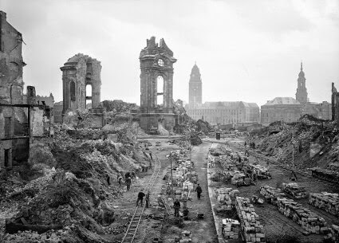

### Rzeźnia nr 5

Najlepiej zachowana z wojennych zniszczeń i zarazem najbardziej reprezentacyjna stroną wrocławskiego Rynku jest jego zachodnia pierzeja. Cały rząd barokowych kamienic mających jeszcze średniowieczne, gotyckie piwnice w niektórych przypadkach sięgające jeszcze czasów fundacji miasta w XIII wieku (ze względu na rosnący, aż do czasu położenia bruków, poziom gruntu część z nich to po prostu dawny parter). W jednej z takich piwnic - w Dworze Polskim, Rynek 5 - mieści się pub "Kocia Kołyska". Wszyscy znamy tę nazwę, bo jest to tytuł jednej z powieści Kurta Vonneguta. Jego najbardziej znaną książką, od której tytułu nikt jeszcze chyba nie nazwał przybytku Bachusa, jest "Rzeźnia nr 5" (ang. Slaughterhouse-Five). To z tej książki większość ludzi dowiaduje się jednym z najbardziej tragicznych wydarzeń II Wojny Światowej - bombardowaniu Drezna.

W tym przypadku trzeba uczynić dwa wstępy. Pierwszy dotyczy samego miasta, drugi przyczyn bombardowania.

### Drezno

Drezno jest w wielu kwestiach miastem bardzo podobnym do Wrocławia. Jest to około półmilionowa stolica regionu, mająca tysiąc lat historii i siedzibę diecezji w pobliżu (Wrocław miał ją po drugiej stronie rzeki, Drezno aż do XVI w. w odległej o 30 km Miśni, potem diecezja przestała istnieć - wszak Saksonia to ewangelicki kraj, potem centrum katolicyzmu było w Budziszynie).

Podobnie jak Wrocław ma związek z Polską, tyle że Wrocław był we wczesnym średniowieczu miastem polskim a później we władzy lokalnej linii polskiej dynastii, natomiast Drezno od tysiąca lat było własnością a od XV w. siedzibą domu Wettinów. Z tej dynastii dwóch kolejnych władców o imieniu August było w latach 1697-1763, czyli przez 66 lat, królami Polski. W drodze z Saksonii do Polski czasem przejeżdżają przez Wrocław.

Oba miasta od XVI wieku są luterańskie (Wrocław od 1525, Saksonia od 1539).

Do 1816 zachodnia granica Śląska przebiega na Kwisie, ale Saksonia została ukarana za popieranie Napoleona i w wyniku postanowień Kongresu Wiedeńskiego granica zostaje przeniesiona na Nysę Łużycką - drobny ten fakt z wewnętrznej historii państw niemieckich nabierze nieoczekiwanie znaczenia dla - wówczas nieistniejącej - Polski sto trzydzieści lat później. W latach po zjednoczeniu Niemiec Wrocław dynamicznie się rozwija, awansuje, a w każdym razie planuje awansować do roli centrum przemysłowego południowo-wschodnich Niemiec. W tej konkurencji wygrywa drugie miasto Saksonii: Lipsk, posiadający długą tradycję targów, które w 1895 po raz pierwszy organizuje Targi Wzorcowe (Mustermesse). Paradoksem historii jest to, że pragnący ożywić instytucję targów wrocławskich, nadburmistrz Wrocławia od końca Wielkiej Wojny aż do czasów hitlerowskich, Otto Wagner uczył się tego od Polaków z Poznania.

Wszyscy znamy jeszcze jeden pomnik rywalizacji Wrocławia z Lipskiem, bo w stulecie Bitwy Narodów (Völkerschlacht bei Leipzig) to właśnie Lipsk wygrał fetowanie zwycięstwa nad Napoleonem i wzniósł z tej okazji monumentalny pomnik, będący centralnym miejscem ogólnonarodowych obchodów. W tym samym czasie Wrocław świętował coś całkiem innego: odezwę "Am Mein Volk" (Do ludu mego) wydaną w tym samym roku w Pałacu Królewskim we Wrocławiu (obecnie Muzeum Miejskie) przez króla Prus Fryderyka Wilhelma III, w której wzywa poddanych do walki z okupantem, wzywa, ich wyliczając poszczególne narodowości niemieckie. Uważa się, że w tej odezwie pierwszy raz w niemieckiej tradycji politycznej pojawia się naród jako podmiot polityczny. Odezwa ta z 17 marca 1813 została opublikowana w Schlesische Zeitung 20 marca, a sto lat później wrocławianie świętują jej ogłoszenie, budując rewolucyjną architektonicznie "Świątynię Demokracji" czyli Halę Stulecia (niem. Jahrhunderthalle). Dwór cesarski przyjmuje to z chłodem i choć cesarz był trzy lata wcześniej na otwarciu Politechniki (niem. Technische Hochschule Breslau), przejeżdżając przez dedykowany mu Most Cesarski (niem. Kaiserbrücke, obecnie Most Grunwaldzki), tym razem się nie pojawił.

W 1918, kiedy upada Cesarstwo Niemieckie (niem. Deutsches Kaiserreich), abdykuje również ostatni król Saksonii - panujący od 1904 i sprawujący tylko władzę symboliczną - Fryderyk August III Saski. Po abdykacji osiada na stałe w swoim pałacu w Sibyllenort. Tak, to Szczodre leżące kilka kilometrów na północny wschód od Wrocławia. Pałac wciąż istnieje, choć jest w opłakanym stanie. Umiera w nim w 1932, w wieku 67 lat.

To właśnie do Drezna zostaje ewakuowany 22 stycznia 1945 wrocławski Uniwersytet i Politechnika. Również do Drezna kieruje się część uciekinierów z Wrocławia wygnanych przez Gauleitung. Kiedy Wrocław jest zagrożony, to miasto wydaje się bezpieczne. W Dreźnie formowana jest 609 Dywizja do Zadań Specjalnych, która jest trzonem garnizonu wrocławskiego.

<SeeAlso txt="Historia Drezna" url="/turystyka/saksonia/historia-drezna" />

### Operacja Thunderclap

W dniach 7-11 lutego 1945 ma miejsce Konferencja Jałtańska, druga z trzech konferencji Wielkiej Trójki. Oprócz dzielenia łupów omawiane są bieżące sprawy wojny: w ocenie brytyjskiej ofensywa sowiecka jest zagrożona przez siły niemieckie na Śląsku, które w każdej chwili mogą zostać wzmocnione - było to podejrzenie uzasadnione, bo właśnie 18 stycznia zapadła decyzja o rzuceniu do walki ostatnich rezerw, czyli Armii Zapasowej. W tym wypadku, jak obawiali się Brytyjczycy, wojna będzie się jeszcze ciągnęła miesiącami, może nawet potrwać do jesieni.

Sowieci znajdowali się już po zachodniej stronie Odry, 70 km od Berlina, ale nie mogli rozpocząć decydującej operacji, mając od północy Wał Pomorski a od południa Grupę Armii Środek za rubieżą odrzańską. Proponowanym rozwiązaniem było w tej sytuacji dywanowe bombardowanie kilku dużych miast niemieckich, które miały kluczowe znaczenie w zaopatrywaniu Śląska, z tych które były w zasięgu floty alianckich bombowców: wymieniano Berlin, oraz trzy miasta w Saksonii: Chemnitz, Lipsk i właśnie Drezno.

Zdjęto z półki zarzucony plan operacji Thunderclap (Grzmot) zmasakrowania obrońców Berlina (ewentualne straty oceniano na 100 tysięcy ludzi) i zmodyfikowano go, zmniejszając skalę ataku i dodając nowe cele. Uderzenie na te miejsca miało osiągnąć dwa cele: wprowadzenie jeszcze większego chaosu w ewakuację ludności ze wschodniej części Niemiec oraz uniemożliwienie transportu wojsk na Śląsk z głębi Rzeszy. Dowództwo brytyjskie zadecydowało, że przedmiotem bombardowania będzie przede wszystkim centrum miasta, gdzie znajdują się węzły kolejowe, centrale telefoniczne, elektrownie i administracja. Bombardowanie Coventry nauczyło ich, że powoduje to zniszczenia trudniejsze do usunięcia niż samo bombardowanie fabryk i drugorzędnych węzłów komunikacyjnych.

### Drezno na celowniku

Drezno było wówczas siódmym co do wielkości miastem Niemiec i największym, z tych które dotychczas nie były bombardowane, miało również podstawowe znaczenie w komunikacji z Czechami i Śląskiem. Były tam zlokalizowane fabryki gazów bojowych, części samolotowych, artylerii polowej i przeciwlotniczej, sprzętu optycznego, oraz wiele fabryk sprzętu mechanicznego i elektrycznego. Trudno oszacować liczbę żołnierzy przebywających wówczas w mieście, ale świadkowie mówią, że było pełne wojska.

Drezno jest czasem przedstawiane jako całkowicie cywilny cel, a jego bombardowanie jako tylko i wyłącznie zemstę Brytyjczyków za wcześniejsze bombardowania miast angielskich. Na tym etapie wojny żadne duże miasto niemieckie nie było celem wyłącznie cywilnym, co zaś do zemsty - ten czynnik w ocenie historyków odgrywał pewną rolę, ale nie to lecz lokalizacja zadecydowała o wyborze celu. Ponadto jak to ujęło memo RAF-u: trzeba było pokazać Rosjanom, kiedy już przybędą do Drezna, co potrafi zrobić lotnictwo brytyjskie. Nie tylko Niemcy byli celem tego bombardowania.

### Bombardowanie

13 lutego pierwsza około piątej po południu, zaraz po herbatce, wyruszyła brytyjska eskadra (83. RAF) bombowców Avro Lancaster, a po nich samoloty de Havilland Mosquito (przypominające trochę Pe-2, na których latał generał Iwan Połbin).

- Pierwsza grupa miała zrzucić nad celem zawieszone na spadochronach flary oświetlające z magnezem, nazywane przez Niemców "choinkami" (znane też z Wrocławia).
- Druga ważące ponad tonę Wskaźniki Celu (Target Indicators) żarzące się przez wiele godzin upiorną czerwienią.

Zadaniem obu tych grup Tropicieli (Pathfinders) było odnalezienie celu, zlokalizowanie i wskazanie głównych obszarów bombardowań.

Zaraz po tych dwóch grupach samolotów wyruszyła do ataku główna siła uderzeniowa: ćwierć tysiąca Lancasterów niosących pół tysiąca ton bomb burzących i ponad 350 tysięcy ton bomb zapalających.

W tym czasie Drezno świętowało Ostatki, a potem zaczęło szykować się do snu. Startujące z Anglii samoloty miały ponad tysiąc kilometrów do celu. Syreny w Dreźnie zawyły już po dziewiątej wieczór.

Do tej pory miały miejsce dwa niewielkie bombardowania i prawdopodobnie wszyscy mieli nadzieję, że kolejne będzie podobne. Ale rozpętało się piekło i jeszcze tej nocy pożar miasta było widać z odległości 100 km. A był to tylko pierwszy dzień ataku, dwa następne były znacznie poważniejsze. Przewodnik Baedekera "Dresden" z 2013 w artykule "Der Untergang Dresdens" podaje następujące dane (Lancastery to RAF, B-17 to USAF):

- 13 lutego (wtorek):
  - alarm 21.39, bombardowanie 22.13-22.28 (15 minut), 244 Lancasterów zrzuciło 900 ton bomb.
- 14 lutego (środa):
  - pierwsze 1.23-1.54 (31 minut), 528 Lancasterów zrzuciło 1500 ton bomb;
  - drugie alarm 12.00, bombardowanie 12.17-12.31 (14 minut), od 311 do 316 B-17 zrzuciło 711 ton bomb.
- 15 lutego (czwartek):
  - 11.51-12.01 (10 minut) 210 B-17 zrzuciło 460 ton bomb.

W ciągu niespełna 40 godzin na stolicę Saksonii spadło ponad 3600 ton bomb, cztery bombardowania trwały w sumie 70 minut - daje to prawie tonę bomb na sekundę.

Szacunki liczby zabitych różniły się znacznie, sięgały od 20 tysięcy do nawet pół miliona. Szokujący efekt bombardowania Drezna został wykorzystany przez propagandę goebbelsowską, i to tam pojawia się powtarzana tak często liczba ponad stu tysięcy ofiar. Ale raport drezdeńskiej komisji historyków z 2010 określa ją na 25 tysięcy. Dokładnego szacunku nigdy nie będziemy mieli, ponieważ ciała zabitych zebrano na stosach w głównych placach miasta i spalono. Piękne, tętniące życiem, historyczne miasto pełne zabytków, perłę dynastii Wettinów, miejsce narodzin europejskiej porcelany, z operą Wagnera i Straussa, alianckie bombowce zamieniły w morze ruin i trupów. Jeszcze miesiąc wcześniej mówiono o Dreźnie i Wrocławiu jako o bezpiecznych schronach Rzeszy; miastach, których bomby nie sięgną. Niszczenie Wrocławia dopiero się zaczęło.

Jedną z tysięcy ofiar bombardowania był znany niemiecki chirurg Georg Kelling, miał wówczas 78 lat. W 1901 przeprowadził pierwszy na świecie zabieg laparoskopowy. Na psie. Zabieg nazwał celioskopią (niem. Coelioskopie).

Kurt Vonnegut, jeniec ze 106 DP pojmany w Ardenach był przetrzymywany w Rzeźni Nr 5 (stąd tytuł jego powieści), są to obecnie tereny wystawowe na Ostragehege - Messering 6. Część budynków wciąż istnieje.

Paul Johnson opisuje bombardowanie następująco:
>Atak wykonano w dwóch rzutach (trzeci nalot miało przeprowadzić lotnictwo amerykańskie), zgodnie z taktyką "podwójnego uderzenia", stosowaną przez dowództwo bombowców: drugi nalot następował wtedy, gdy w mieście zebrały się oddziały ratunkowe. Zrzucono ponad 650 tys. bomb zapalających, burza ogniowa objęła 20 km2, zniszczono kompletnie 17 km2 i zabito 135 tys. mężczyzn kobiet i dzieci. Ponieważ był to tłusty wtorek, wiele dzieci nosiło jeszcze kostiumy karnawałowe. Po raz pierwszy w tej wojnie uderzono tak silnie, że nie było dość ludzi, zdolnych do noszenia ciał, by pogrzebać zmarłych. Oddziały wojskowe zbierały ciała w wielkie stosy. Zagrodzono wejścia na Stary Rynek, ustawiono stalowe ruszty o średnicy 2,5 m, na każdym ułożono po 500 ciał, podłożono drewno i słomę, i spalono. Stosy pogrzebowe tliły się jeszcze przez dwa tygodnie po nalocie. Goebbels orzekł "To jest dzieło szaleńców". Jak stwierdził Speer, atak ten spowodował falę przerażenia w całym kraju. Ale był to już okres, gdy opinia publiczna nie miała żadnego sposobu, by wywrzeć presję na niedostępnego, odizolowanego i ulegającego paranoi Hitlera, i skłonić go do rozpoczęcia negocjacji w sprawie poddania się. Nie było też środków ani woli powtórzenia nalotu, który przeraził samych lotników. Jeden z nich powiedział potem "Po raz pierwszy po wielu nalotach żal mi było tych ludzi na dole". A inny: "Ten jeden raz żałowałem Niemców".

Wobec bombowców miasto było całkowicie bezbronne, 84 ciężkie działa przeciwlotnicze zostały na miesiąc przed bombardowaniem wywiezione na wschód do walki z lotnictwem sowieckim, niemieckie myśliwce były uziemione z powodu pogody.

### Historia lotnictwa bombowego

We wpisie biograficznym poświęconym generałowi Iwanowi Połbinowi opisałem początki wojny powietrznej, pierwszy skuteczny atak samolotu na samolot, czyli staranowanie samolotu wroga przez rosyjskiego sztabskapitana Piotra Niestierowa w 1914.

<SeeAlso txt="Generał Iwan Siemionowicz Połbin (1905-1945)" url="/festung-breslau/article/iwan-polbin" />

Powietrzna wojna bombowa zaczęła się dużo wcześniej.

Jeszcze w połowie XIX Austriacy zrzucali na Wenecję bomby z balonów.

Pierwsze bombardowanie z samolotu przeprowadził w listopadzie 1911 włoski porucznik Giulio Gavotti, zrzucając w wysokości 180 metrów cztery granaty na pozycje tureckie w Libii. Nikt wówczas nie zginął, ale Turcja wystosowała protest, ponieważ zrzucanie bomb z balonów zostało zakazane Konwencją Haską z 1899. Włosi odparli, że przecież ten zakaz nie dotyczy samolotów. Gavotti latał wówczas na wczesnym modelu jednopłata Etrich Taube, konstrukcji Igo Etricha, który podwozie skopiował z samolotu braci Bleriot, a skrzydło na kształcie nasiona pewnego gatunku dyniowatych (łac. Zanonia macrocarpa). Większości przypominało jednak skrzydła gołębia, dlatego samolot określany był takim mianem. Był to pierwszy samolot używany przez armię niemiecką.

Taktykę bombardowania i konstrukcję pierwszych bomb lotniczych opracowało bułgarskie lotnictwo podczas I Wojny Bałkańskiej z Turcją. Cóż, wygląda na to, że Turcja (wówczas jeszcze Imperium Otomańskie) pierwsza opracowało technikę bycia celem bombardowania.

Jeszcze przed wybuchem Wielkiej Wojny Bułgarzy sprzedali plany bomby Niemcom - ważyła 6 kilo i była zrzucana ręcznie, pilot musiał ją odbezpieczyć tuż przed zrzuceniem. Taki był początek lotnictwa bombowego. Do lutego 1945 przebyło długą drogę.

W 1941 na polu walki pojawiają się dwie wyrzutnie rakiet opracowane pod koniec lat 30.

- niemiecki Nebelwerfer
- sowiecka samobieżna wyrzutnia rakietowa BM (ros. Боевая Машина), zwana przez Niemców Organami Stalina, nam znana jako "katiusze"

Już wkrótce rakiety i pociski napędzane silnikami odrzutowymi stają się istotnym elementem pola walki.

W lipcu 1943 alianci bombardują Hamburg (Operacja Gomora), jest to pierwszego tak duże bombardowanie dywanowe miasta niemieckiego, nad ruinami nieoczekiwanie wznosi się kula ogniowa o temperaturze 1000 stopni i huragan uniemożliwia dalsze działania lotnictwa. Pierwszy raz do naprowadzania bombowców użyto radaru. Niemcy z przerażeniem patrzą na miasta bombardowane przez chmury i w nocy.

Od sierpnia 1944 do marca 1945 Niemcy wystrzelili na Anglię 10 tysięcy pocisków V-1.

Potem pojawiają się rakiety balistyczne V-2 (5 tys. od września 1944 do marca 1945).

Kulminacją tej historii są w 1945 dwa bombardowania miast japońskich 6 sierpnia Hiroszimy i 9 sierpnia Nagasaki, na które zrzucono bomby atomowe.

Bombardowanie Drezna jest tylko rozdziałem w tej historii. Dla II Wojny Światowej zaczyna się ona już 1 września w Wieluniu, mieście zbombardowanym przez Ju 87 Stuka, co do szczegółów nic tu nie jest pewne, ani liczba ofiar, ani nawet godzina bombardowania. 12 września celem ćwiczebnego bombardowania Luftwaffe staje się Frampol, miasto potraktowane jak tarcza strzelnicza. Potem Warszawa. Następnym celem niemieckich bombowców są miasta brytyjskie. Przeczesujące niebo szperacze i wycie syren jest jednym z najbardziej przerażających obrazów wojny.

### Frauenkirche

Jest jeszcze jeden obraz, który trzeba tu przypomnieć. Obowiązkowym punktem zwiedzania współczesnego Drezna jest główny kościół drezdeńskich mieszczan, pierwotnie był to kościół maryjny i dlatego nazywany jest Kościołem Marii Panny (Frauenkirche).

Zwieńczony jest zdumiewająco śmiałą kopułą konstrukcji Georga Bähra. Kopułą pierwotnie miała być drewniana i kryta miedzią, w 1729 architekt już w trakcie budowy ujawnił, że przygotował odpowiednie fundamenty i ma plany budowy największej kamiennej kopuły na północ od Alp. Wywołało to ogromne kontrowersje, a nawet skandal, architekt musiał obiecać, że osobiście poprowadzi budowę. Chociaż była to świątynia luterańska, pomysł poparł Elektor Saksonii August Mocny (w Polsce znany jako August II Mocny). Chciał mieć taki obiekt w swoim mieście. Jednak ani on, ani projektant nie dożyli zwieńczenia kopuły w 1743. Kopuła zbudowana na krawędzi wytrzymałości technicznej zdała jednak próbę czasu podczas pruskiego bombardowania w 1760. Szybko staje się symbolem miasta. Późniejszy brak remontów i właściwego nadzoru budowlanego doprowadził do tego, że zaczęła ulegać degradacji i zagrażać użytkownikom. Jeszcze przed wybuchem wojny kościół został zamknięty przez policję budowlaną. O dziwo, choć wypalony pożarem i dymiący to jednak przetrwał trzy pierwsze fale bombardowań, wbrew wszystkiemu kopuła wciąż stała pomimo dwóch dni niszczenia miasta.

<BoxImageWrapper>

Ruiny Kościoła Marii Panny (Frauenkirche) 1952
</BoxImageWrapper>

Dopiero rankiem 15 lutego ważąca 12 tysięcy ton kopuła z nadłabskiego piaskowca runęła z hukiem, pozostawiając relikty potężnych ścian wystające z ziemi jak palce zagrzebanej dłoni ogromnego potwora. Po wojnie Drezno staje się jednym z ważniejszych miast DDR, a w państwie komunistycznym kościół jest skazany na drugorzędną rolę.

Ruiny zabezpieczono i góra kamieni z monumentalnymi reliktami ścian na początku lat 60. staje się oficjalnie pomnikiem wojny.

Ale już 20 lat później zostaje innego rodzaju pomnikiem, 13 lutego 1982 w czasie kiedy wszyscy byli pewni, że system komunistyczny będzie trwał jeszcze dziesiątki lat, w ruinach zbierają się młodzi ludzie i zapalają świeczki, upamiętniając ofiary. Zawiązuje się całkowicie oddolny i nieformalny ruch związany z projektem odbudowy świątyni, który jest jedną z nielicznych oaz wolności w totalitarnym społeczeństwie. W listopadzie 1989 w zupełnie innej rzeczywistości politycznej powstaje inicjatywa obywatelska na rzecz odbudowy świątyni i 13 II 1990 wystosowują "Ruf aus Dresden" apel o zbiórkę pieniędzy na ten cel. Już wkrótce dokonana olbrzymim wysiłkiem i na najwyższym poziomie konserwatorskim odbudowa symbolu Drezna ukończona całkiem niedawno, bo w 2005 staje się sposobem odzyskania zakazanej przez komunizm przeszłości i tożsamości Saksonii.

Dwóch ludzi, którzy przeżyli bombardowanie, warto wspomnieć:

- Z około pięciu tysięcy żydowskich mieszkańców Drezna do końca wojny ocalało 41. Jednym z nich był **Victor Klemperer** filolog pochodzenia żydowskiego, z wyboru ewangelik. Wojnę przeżył tylko dlatego, że jego "aryjska" żona odmówiła rozwodu. W 1947 wydał "LTI - notatnik filologa" istotną analizę propagandowego języka Trzeciej Rzeszy (LTI to skrót od Lingua Tertii Imperii) oraz obyczajowości państwa totalitarnego. Klemperer jest jednym z niewielu ludzi, którym bombardowanie Drezna uratowało życie. Następnego dnia bowiem miał zostać wywieziony do Auschwitz. Dzięki bombardowaniu udało mu się ukryć w pogrążonym w chaosie mieście i doczekać końca wojny. 
- **Kurt Vonnegut**. Bombardowanie Drezna było ważnym tematem w sztuce. Wśród książek, które je opisują najbardziej znana to "Rzeźnia numer pięć" Kurta Vonneguta, jedna z najsłynniejszych książek wojennych (ang. "Slaughterhouse-Five, or The Children's Crusade: A Duty-Dance with Death", niem. "Schlachthof 5 oder Der Kinderkreuzzug"). Podczas wojny, w 1943 Vonnegut wstąpił na ochotnika do wojska i służył w 106. dywizji piechoty. Został wzięty do niewoli podczas ofensywy w Ardenach i jako jeniec wojenny przeżył bombardowanie Drezna. Książkę wydaną w USA w 1969, na niemiecki przetłumaczono już w 1970, pierwsze wydanie w NRD to 1976.

### Odnośniki

- Więcej o samym bombardowaniu i jego zasadności można przeczytać w artykule [Mit i zakłamanie Drezna nocy przedwalentynkowej 1945 r.](http://www.nowastrategia.org.pl/mit-zaklamanie-drezna-nocy-przedwalentynkowej-ow-1945/)
- O samym Dreźnie polecam [Historia Drezna](/turystyka/saksonia/historia-drezna)
- Podcast Wojenne Historie ["Jak naloty strategiczne na Trzecią Rzeszę zrewolucjonizowały sposób prowadzenia wojny" [YT 27:38]](https://www.youtube.com/watch?v=AHPZ0NQrYgY)
- [TIK "Discussing the Strategic Bombing Campaign WW2, Order 270 and more... Patreon Q&A 7" [YT 47:18]](https://www.youtube.com/watch?v=4SMS8b4qkWM)
- Rare Historical Photos ["Rebuilding Dresden after the horrific firebombing at the end of World War Two, 1945-1970"](https://rarehistoricalphotos.com/rebuilding-dresden-after-the-horrific-firebombing-at-the-end-of-world-war-two-1945-1970/)