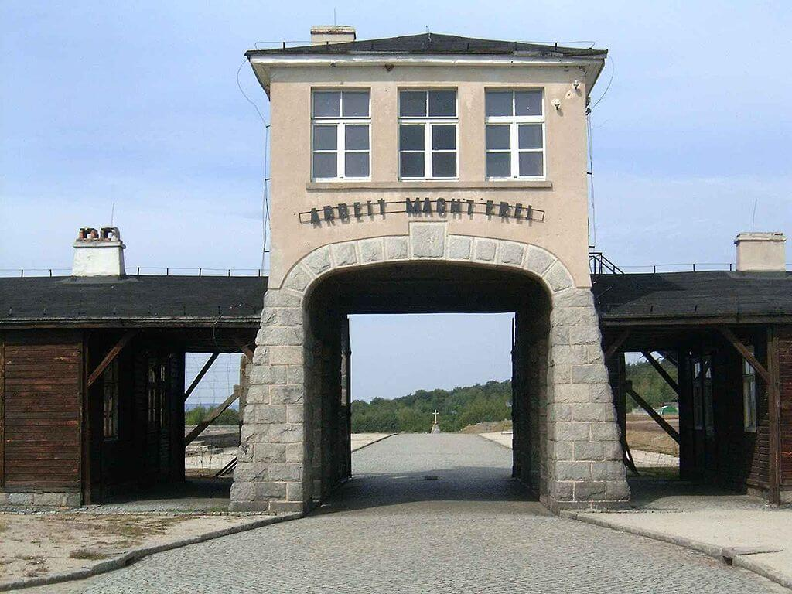

<DolnySlask />

Najpierw wyjaśnienie, bo w kwestii obozów koncentracyjnych i obozów zagłady jak mi się zdaje, panuje pewne pomieszanie.

### Obozy koncentracyjne przedhitlerowskie

Po pierwsze sama koncepcja, istnienie i pojęcie obozów koncentracyjnych poprzedza dyktaturę hitlerowską. Naziści użyli rozwiązania już wielokrotnie przetestowanego i pojęcia, które były powszechnie znane. Zapowiedzieli ich powstanie po przejęciu władzy i nikomu nie musieli wyjaśniać, co to jest obóz koncentracyjny.

Najbardziej znanym przykładem przedhitlerowskich obozów koncentracyjnych były obozy dla Burów stworzone przez Anglików podczas wojen burskich. Ale nie są to wcale pierwsze obozy koncentracyjne w ogóle. Ba! także Niemcy jeszcze przed Wielką Wojną za panowania cesarza Wilhelma II urządzali obozy koncentracyjne: w Niemieckiej Afryce Południowo-Zachodniej podczas powstania Herero w 1905, z 80 tys. uwięzionych po trzech latach żyło tylko 15 tys.; ONZ uznał to za pierwsze ludobójstwo XX wieku [Niemiecka eugenika](https://github.com/tdudkowski/t4/blob/master/eugenika-de.md).

### Hitlerowskie obozy koncentracyjne

Hitlerowcy wcale się nie kryli z tym, że po przejęciu władzy stworzą obozy koncentracyjne dla swoich przeciwników. I rzeczywiście: Hitler został kanclerzem 30 stycznia 1933, i już w marcu powstają pierwsze obozy. Najsłynniejszym i najważniejszym w początkowym okresie jest KL Dachau założony przez SS 20 marca 1933. Obozy te w początkowym okresie powstają spontanicznie, są zakładane przez:

- SS: KL Dachau założony rozkazem Himmlera 20 marca 1933; ich modelowy obóz, miejsce, gdzie Theodor Eicke opracował hitlerowski system obozowy
- SA: pierwszy obóz w Oranienburgu
- władze partyjne NSDAP: najlepszym przykładem jest obóz koncentracyjny we Wrocławiu na Tarnogaju

Są publicznym narzędziem terroru, mówią o nich artykuły w prasie, kronika filmowa. Więźniów przedstawia się w prześmiewczy sposób. Zdarzają się przypadki zgonów, także w wyniku śmiertelnych pobić, ale bardzo długo jest to rzadkość. Nie chodzi o eliminację, ani nawet eksploatację, ale terror.

Podczas Nocy Długich Noży SS rozprawia się z SA i przejmuje ich obozy koncentracyjne, likwiduje tysiące małych i transportuje więźniów do kilku dużych, zarządzanych według rygorystycznych norm obozów, z których nadal najważniejszym i wzorcowym jest KL Dachau. Najpóźniej od 1935 wszystkie obozy koncentracyjne w III Rzeszy są w wyłącznej dyspozycji SS. Twórcą i szefem tego systemu jest Theodor Eicke, szef KL Dachau. Tych kilka obozów to:

- Dachau
- Sachsenhausen
- Buchenwald
- Ravensbrück
- Mauthausen, po anschlussie Austrii

Wkrótce najważniejszym obozem staje się Sachsenhausen, tam znajduje się centralny zarząd systemu obozów koncentracyjnych - IKL (niem. Inspektion der Konzentrationslager). SS bardzo szybko odkrywa, że z pracy więźniów można ciągnąć zyski, nie są to wielkie pieniądze, bo SS to nie są biznesmeni, ale pozwalają na utrzymanie całego systemu. W czasie wojny praca niewolnicza odegra decydującą rolę w gospodarce III Rzeszy.

SS od czasu dojścia Hitlera do władzy i powstania LSSAH była podzielona na dwa piony: cywilny (Allgemeine SS) i wojskowy (późniejsze Waffen SS). Wojskowe SS formalnie nie zajmowało się obozami koncentracyjnymi. W administracji obozowej byli cywilni funkcjonariusze SS, a jak największą część pracy powierzano więźniom funkcyjnym, nawet zarządzanie barakami powierzano kapo. Służbę strażniczą pełniło SS-Totenkopfverbände (SS-TV) czyli trupie czaszki, formacja w zasadzie nienależąca ani do pionu cywilnego, ani wojskowego. Nie tworzono oddziałów powyżej batalionu, zwykle przypadał jeden batalion na jeden obóz, w wyjątkowych przypadkach dwa. Podlegali bezpośrednio komendanturze obozu.

Stała fluktuacja kadr z pionu cywilnego do wojskowego, również z SS-TV do Waffen SS, oraz fakt, że żołnierze SS podczas rehabilitacji pełnili służbę w SS-TV sprawiał, że nie było SS-mana, który mógłby nie wiedzieć, co się dzieje w obozach koncentracyjnych i zagłady. System był szczelny tzn. wszystko, co się działo w obozach, było w gestii SS. Obozami zarządzał IKL, kadrami RSHA. Ludzi do obozów kierowało Gestapo, które w zasadzie nie było częścią SS, ale zupełnie mu podlegało (było w strukturach RSHA), ponadto Gestapo nie miało dostępu do obozu. Nie tylko tam nie wchodzili, nawet nie wiedzieli, w którym obozie dany więzień się znajduje. Warto jeszcze dodać, że do SS mogli należeć tylko mężczyźni, etniczni Niemcy. Tak więc zarówno kobiety strażniczki, jak i żołnierze cudzoziemscy służyli w SS, ale do niego nie należeli.

Więcej o SS w artykule na tym blogu: [SS](/festung-breslau/article/ss)

### Rola obozów koncentracyjnych

Dwa czynniki zmieniły zupełnie rolę obozów koncentracyjnych i warunki w nich panujące:

- prześladowanie Żydów
- potrzeba niewolniczej siły roboczej podczas wojny

W pierwszym okresie większość osadzonych to byli przeciwnicy polityczni, aktywiści KPD, SPD, działacze związkowi, działacze mniejszości narodowych, od 1935, kiedy to wprowadzono pobór powszechny także świadkowie Jehowy, którzy odmawiali służby wojskowej. Warunki były ciężkie, ale zabójstwa i przypadki zgonów były rzadkością.

Wszystko zmieniło się po pogromie Nocy Kryształowej, kiedy pierwszą i najgorzej traktowaną grupą w obozach koncentracyjnych stali się Żydzi. Przedtem byli prześladowani na wiele sposobów, ale dopiero od listopada 1938 zaczęto ich kierować do obozów koncentracyjnych. To była pierwsza rzecz, która spowodowała brutalizację w obozach koncentracyjnych. Dla SS przeciwnicy polityczni byli do zastraszenia, Żydzi do eliminacji.

Wpływ wojny wyraźnie dzieli się na dwa etapy. Pierwszy zaczyna się od wojny z Polską i wtedy normą stają się masowe egzekucje przeprowadzane przez Einsatzgruppen dowodzone przez SS. Hitleryzm wyraźnie przekracza psychiczną barierę zbrodni. Morduje się niejednokrotnie na raz tysiące ludzi.

Dziesiątki tysięcy zamykanych jest w więzieniach. Są przepełnione i stają się trudne w zarządzaniu. Dlatego jesienią 1939 powstaje KL Auschwitz. Jego pierwotnym zadaniem jest przejęcie więźniów z więzień górnośląskich (powstańcy śląscy, funkcjonariusze państwowi, działacze narodowościowi) i skierowanie ich do kolejnych obozów koncentracyjnych w Rzeszy (KL Auschwitz zresztą znajduje się na terenach wcielonych do Rzeszy). KL Auschwitz na tym etapie jest zwykłym obozem koncentracyjnym.

Drugi etap wojny to wojna z sowietami. Tu Einsatzgruppen działają w oderwaniu od Grup Armii i poza wszelką kontrolą. Liczba mordowanych rośnie wielokrotnie. Rosną również straty Wehrmachtu. Najważniejszym faktem dotyczącym WWII jest to, że 80% strat niemieckich podczas wojny to front wschodni. Wehrmacht jakiś czas to wytrzymuje, ale ciężar już wkrótce przenosi się na społeczeństwo. Znaczny odpływ rąk do pracy musi być czymś korygowany, inaczej gospodarka upadnie. Systemowi pracy niewolniczej stworzonej przez hitlerowców podlega w sumie ponad 6 mln ludzi. Jest to największa korporacja niewolnicza świata, a decydująca rolę w dyspozycji tej darmowej siły roboczej odgrywają właśnie obozy koncentracyjne zarządzane przez SS. Rolnictwo (tzw. praca u bauera) i cały przemysł, szczególnie duże fabryki masowo zatrudniały niewolników (niem. Zwangsarbeiter - robotnik przymusowy, oficjalnie określany jako Fremdarbeiter robotnik cudzoziemski). Tu trzeba zaznaczyć, że warunki pracy i życia bardzo się różniły.

Na froncie wschodnim oprócz ogromnych strat własnych Wehrmachtu dochodzi do kolejnego zjawiska, które czyni ten system jeszcze bardziej brutalnym. Do niewoli trafiają setki tysięcy jeńców wojennych. Nie można ich uwolnić, nie ma jak ich wyżywić, a armia nie chce ich zabić. Często więc umierają z głodu za drutami. To właśnie sowieccy jeńcy wojenni są pierwszymi metodycznie mordowanymi więźniami obozów koncentracyjnych. Na nich przeprowadza się eksperymenty z gazowaniem ludzi. Powstaje KL Auschwitz II Birkenau, odrębny obóz o zupełnie innym charakterze. Wielokrotnie większy obóz w Brzezince. Pierwotnie miał to być obóz dla jeńców wojennych, zresztą oficjalnie aż do 1944 nosi taką nazwę. Ale szybko stał się obozem zagłady.

### Obozy zagłady

No właśnie - obozy koncentracyjne, a obozy zagłady. Obozy koncentracyjne okresu wojny są makabrycznymi miejscami eksploatacji i wyniszczania ludzi. Śmiertelność była różna, wahała się od 20 do 50%. Wielu ludzi przetrwało całe lata w obozach, większość dożyła wyzwolenia.

Natomiast obozów zagłady było tylko kilka, wszystkie służyły wymordowaniu Żydów i były to wyłącznie miejsca egzekucji. Poza Sonderkommando nie trzymano w nich więźniów. Śmiertelność z definicji wynosiła 100%, i to natychmiast. Na tym właśnie polega zasadnicza różnica. Do obozów zagłady zalicza się również lubelski Majdanek, który był również obozem koncentracyjnym, oraz chorwacki Jasenowac, którego zasadniczym zadaniem, ale nie wyłącznym, było wymordowanie Serbów.

Obozy zagłady to:

- Chełmno nad Nerem (niem. SS-Sonderkommando Kulmhof) jesień 1941 - 17 stycznia 1945; gł Kraj Warty; 180 tys ofiar; jak widać zaczyna działanie jeszcze przed konferencją w Wannsee
- Bełżec (niem.  SS-Sonderkommando Belzec aka Dienststelle Belzec der Waffen SS); 17 marca 1942 - czerwiec 1943; gł Generalne Gubernatorstwo; 450 tys ofiar
- Sobibór (niem. SS-Sonderkommando Sobibor) maj 1942 - październik 1943; Generalne Gubernatorstwo; 180 tys. ofiar
- Treblinka (niem. SS-Sonderkommando Treblinka); 23 lipca 1942 - 17 listopada 1943; gł Generalne Gubernatorstwo; 800 tys ofiar
- KL Auschwitz II Birkenau (niem. KL Birkenau (Auschwitz II)); październik 1941 - styczeń 1945; gł. Zachodnia i Południowa Europa; ponad milion ofiar; jest to jedna z trzech części systemu obozowego w kolanie rzeki Soły KL Auschwitz, budowany początkowo jako wielki obóz jeniecki, jako obóz zagłady zaczyna działanie w maju 1942
- Majdanek (niem. KL Majdanek); działanie komór gazowych październik 1942 - wrzesień 1943, ogólna liczba ofiar 80 tys
- Mały Trościeniec na Białorusi; lipiec 1942 - czerwiec 1944, egzekucji dokonywano przez rozstrzeliwanie, trudno oszacować liczbę ofiar, jest to przynajmniej 60 tys, głównie białoruscy Żydzi
- Jasenovac, założony przez chorwackich ustaszów w sierpniu 1941 obóz zagłady Serbów, działał do 21 kwietnia 1945, liczba ofiar trudna do ustalenia, ale może nawet 100 tys. - chociaż nie jest stricte hitlerowski i nie służył do zabijania Żydów, zaliczany jest do obozów zagłady, bo jego przeznaczeniem było wymordowanie Serbów

Co wyróżnia obóz zagłady to urządzenia lub organizacja masowego mordu: komora gazowa z pobliskim krematorium. W KL Auschwitz II Birkenau machina zagłady była w stanie zabić, przeszukać bagaż i ubrania i całkowicie spopielić ciała 5 tys. ludzi dziennie. Świadectwo więźniów z Sonderkommando wskazuje, że w praktyce liczba ta była większa.

Tutaj trzeba dwie rzeczy wyjaśnić - Holokaust to nie tylko obozy zagłady i nie został przesądzony na konferencji w Wannsee 20 stycznia 1942, Holokaust trwał od września 1939. Generalnie dzieli się go na trzy fazy:

- rozproszony: przeprowadzany na tyłach frontu przez Einsatzgruppen, albo ludność miejscową z inicjatywy lub pod kontrolą niemiecką; wiele tysięcy egzekucji i masowych grobów
- gettoizacja: ci, którzy przetrwali nakazami administracyjnymi są przesiedlani do niewielkiej liczby scentralizowanych gett zarządzanych przez Judenraty
- wywózki do obozów zagłady: powstanie i realizacja tego systemu była tematem konferencji w Wannsee

### KL Auschwitz

Ważną sprawą wymagającą wyjaśnienia - i uwaga, nie jest to proste - jest charakter obozu Auschwitz. To są tak naprawdę trzy obozy, każdy ma inną historię i charakterystykę:

- KL Auschwitz I albo inaczej stammlager, czyli obóz macierzysty, jest to zwykły obóz koncentracyjny, początkowo jego zadaniem jest izolacja i dalszy transport do innych obozów koncentracyjnych Polaków, których władze hitlerowskie uznają za niepożądanych.
- KL Auschwitz II Birkenau, jest to obóz zagłady, przeznaczony głównie do wymordowania Żydów z Europy Zachodniej i Południowej, ale jest to też jedyny obóz zagłady, w którym ze względu na brak rąk do pracy wprowadzono selekcję na rampie; około 20% ludzi z każdego transportu dostawało szansę na trochę dłuższe życie, reszta głównie ludzie starsi, kobiety i dzieci od razy szli go gazu; w innych obozach zagłady nie było selekcji; to właśnie tych więźniów z rampy Birkenau dostawał KL Groß-Rosen.
- KL Auschwitz III Monowitz ogromny obóz pracy, fabryka sztucznej benzyny należąca do IG Farben, warunki były mordercze.
- ponadto na całym tzw. Interessengebiet, czyli rozszerzonym terenie podlegającym Komendanturze obozowej i SS było kilkadziesiąt różnego rodzaju obozów pracy, były to bezpośrednie filie obozu macierzystego; taką filią był początkowo Monowitz, ale wyodrębniono ten obóz, żeby nie tracić czasu na dojście do pracy.

### KL Groß-Rosen

*Brama obozu koncentracyjnego Groß-Rosen 
Źródło: Wikipedia By Autor nie został podany w rozpoznawalny automatycznie sposób. Założono, że to [Lzur](https://commons.wikimedia.org/wiki/User:Lzur) (w oparciu o szablon praw autorskich). - Źródło nie zostało podane w rozpoznawalny automatycznie sposób. Założono, że to praca własna (w oparciu o szablon praw autorskich)., [CC BY-SA 3.0](http://creativecommons.org/licenses/by-sa/3.0/), [Link](https://commons.wikimedia.org/w/index.php?curid=309316)*

Stammlager, czyli obóz macierzysty (niem. Stamm to m in pień, rdzeń) powstał w pobliżu wsi Rogoźnica latem 1940, jako filia KL Sachsenhausen.

2 sierpnia 1940 dotarł pierwszy transport więźniów. Był to niewielki obóz pracy, w którym więźniowie pracowali w pobliskim kamieniołomie granitu należącym do Deutsche Erd- und Steinwerke GmbH (DEST), jest to jedno z wielu przedsiębiorstw SS.

Warunki w obozie macierzystym były przerażające. Wyniszczająca praca i głodowe wyżywienie (800 kalorii) powodowały, że nowo przybyły więzień w ciągu miesiąca tracił na wadze 20 kg. Przeciętny czas życia człowieka pracującego w najcięższych komandach wynosił 5 tygodni. Wielu więźniów popełniało samobójstwo. Ciała ofiar obozu palono w krematorium, a popiół sprzedawano okolicznym rolnikom jako nawóz.

Więźniów zatrudniało wiele firm np. Siemens & Halske (od 1966 znany jako siemens AG) oraz Blaupunkt.

W marcu 1941 rozpoczęto budowę małego obozu z czterema blokami.

1 maja 1941 został przekształcony w samodzielny obóz koncentracyjny.

Od października 1941 Komendantura była podzielona na wydziały:

- Kommandantur-Stab: SS-Oberscharführer Eugen Illig
- Politische Abteilung (Departament Polityczny - Gestapo): Kriminalsekretär Richard Treske
- Schutzhaftlagerleitung: SS-Untersturmführer Anton Thumann i SS-Obersturmführer Walter Ernstberger
- Standortverwaltung: SS-Oberscharführer Willi Blume
- Abteilung V (Sanitätswesen): SS-Untersturmführer Friedrich Entress, SS-Hauptscharführer Karl Babor, SS-Hauptsturmführer Wilhelm Jobst, SS-Obersturmführer Heinrich Rindfleisch, SS-Hauptsturmführer Dehnel, SS-Hauptsturmführer Heinz Thilo i Josef Mengele

Na początku 1942 zaczyna się operacja Noc i mgła (niem. Nacht uund Nebel) deportowania i likwidacji członków ruchu oporu w państwach Europy Zachodniej, trwa do konca wojny. Część z nich trafia do Groß-Rosen.

Od 1942 powstają podobozy, m in w Leśnicy we Wrocławiu.

Jesienią 1943 powstaje Arbeitserziehungslager tzw. wychowawczy obóz pracy, placówka wrocławskiego Gestapo. Reedukacja przez pracę młodych ludzi uwięzionych za przewinienia. Obóz funkcjonował do końca, liczbę osób, która przeszła szacuje się na ponad 4 tys.

Na początku 1944 ukończono budowę dużego obozu, obliczonego na 7 tys. więźniów, potem to zwiększono do 20 tys.

W 1944 KL Groß-Rosen zostaje centralą ogromnej sieci obozów pracy na Dolnym Śląsku, a także w Czechach i Saksonii. Było to ponad 100 filii. Większość więźniów przywożono z obozu zagłady Auschwitz II Birkenau. Był to jedyny obóz zagłady, w którym ze względu na potrzebę rak do pracy wprowadzono selekcję na rampie. Dlatego duża liczba podobozów Groß-Rosen byłą przeznaczona dla więźniów żydowskich, którzy podczas lub po wykonaniu pracy mieli zostać zgładzeni.

Tak było np. w AL Riese, sieci obozów pracy przy FHQ Riese w Górach Sowich. 4 duże i 12 mniejszych obozów w zarządzie Organizacji Todt. Skierowano tam 12 tys. więźniów, ponieważ był to tajny obiekt, wszyscy musieli być przeznaczenie na śmierć, dlatego byli to więźniowie żydowscy. W sumie zginęło 5 tys. z nich.

Filia w Brzegu Dolnym produkowała gazy bojowe Tabun i Sarin.

W 1944 Krupp przeniósł produkcję zapalników z Essen do Głuszycy.

W 1945 jest miejscem przerzutu dziesiątek tysięcy więźniów z obozów ewakuowanych na wschodzie w tzw. marszach śmierci.

Komendanci obozu:

- Arthur Rödl (1940–1942)
- Wilhelm Gideon (1942–1943)
- Johannes Hassebroek (1943–1945)

Ogrodzone części:

- obóz kobiecy
- Arbeitserziehungslager
- obóz jeńców sowieckich; większość mordowano po przywiezieniu, ok. 2500 zabitych na przełomie 1941/42.

Wyzwolenie 14 lutego 1945, ogółem przez obóz przewinęło się 120 tys. ludzi.

### Osądzenie

Obóz koncentracyjny Groß-Rosen nigdy nie doczekał się osobnego procesu. Tak jak w przypadku KL Auschwitz większość zbrodniarzy uniknęła procesu. Wszyscy skazani osądzeni zostali indywidualnie albo za zbrodnie dokonane gdzie indziej.

- Arthur Rödl, pierwszy komendant, popełnił samobójstwo w 1945.
- Wilhelm Gideon, drugi komendant, skazany za zbrodnie wojenne na 10 lat więzienia.
- Johannes Hassebroek, trzeci i ostatni komendant; w 1948 skazany przez brytyjski Trybunał Wojskowy na karę śmierci za zbrodnie popełnione w obozach koncentracyjnych; w styczniu 1950 karę zamieniono na 15 lat więzienia i we wrześniu 1954 wypuszczono go na wolność; zmarł w 1977 w Westerstede.
- Friedrich Entress, naczelny lekarz SS w obozie; wykonywał zastrzyki z fenolu; sądzony za zbrodnie w Mauthausen skazany na karę śmierci i stracony.
- Willibald Jobst, lekarz SS; skazany na karę śmierci w pierwszym procesie załogi Mauthausen przed amerykańskim Trybunałem Wojskowym; wyrok wykonano przez powieszenie w więzieniu Landsberg.
- Heinz Thilo, lekarz SS; popełnił samobójstwo w Berlinie w 1947.
- Anton Thumann, jeden z największych sadystów w obozach; odpowiadał jedynie za zbrodnie popełnione w Neuengamme; Trybunał wydał wyrok śmierci, wykonany przez powieszenie w październiku 1946 w więzieniu Hameln.
- Karl Gallasch, najokrutniejszy z esesmanów obozowych, każdego dnia zabijał ok. 5 osób; skazany na karę śmierci powiesił się 19 maja 1947 w więziennej celi we Wrocławiu.
- Albert Lütkemeyer, osądzony przez brytyjski Trybunał Wojskowy w Hamburgu za zbrodnie w Neuengamme; skazany na śmierć przez powieszenie. Wyrok wykonano w więzieniu Hameln w czerwcu 1947.

### Po wojnie

Przez około dwa lata po wojnie na terenie obozu funkcjonował obóz koncentracyjny NKWD. Prawie nic nie wiadomo o tym okresie. NKWD zniszczyło wiele śladów po hitlerowskim obozie koncentracyjnym.

W 1947 oddali obóz władzom lokalnym, które starały się zabezpieczyć obiekt. Ale bardzo długo mimo starań byłych więźniów nie udawało się utworzyć muzeum obozowego, obiekty obozowe padały ofiara wandalizmu i kradzieży.

11 września 1947 powstaje Komitet Ochrony Groß-Rosen. W 1963 obiekt zostaje wpisany do Krajowego Rejestru Zabytków i dopiero wtedy objęty ochroną konserwatorską. Od początku lat 70. opiekę merytoryczną zapewnia wrocławskie Muzeum Historyczne. Zaczyna się profesjonalne gromadzenie dokumentacji i zbiorów.

Dopiero 21 kwietnia 1983 powstaje Państwowe Muzeum Groß-Rosen. Zaczyna się systematyczne badanie całego kompleksu obozów. W 2005 kamieniołom - miejsce śmierci tysięcy więźniów - staje się częścią Muzeum.

### Odnośniki

- [Radio Wrocław "Dolnośląskie Tajemnice #37 Mengele w Gross-Rosen. Opowiada Joanna #Lamparska" [13:08]](https://www.youtube.com/watch?v=2aYca_cvKGE)
