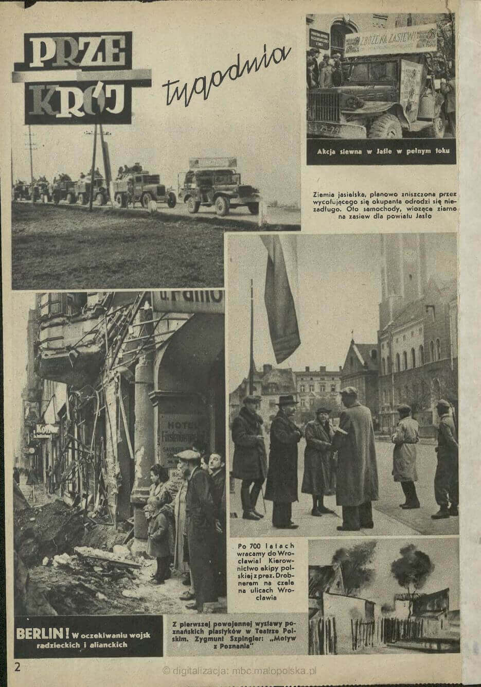
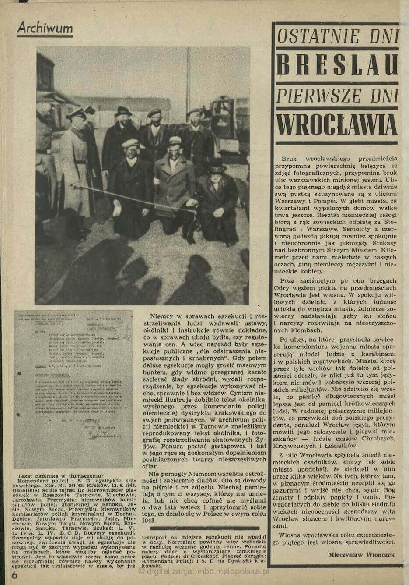
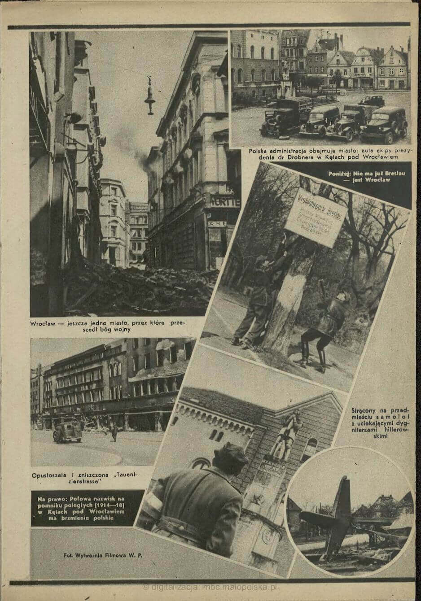

<DolnySlask />

### Wstęp

Cała ta historia, i to z wieloma interesującymi aspektami zaczyna się dużo wcześniej. Ostatnim i najpóźniejszym momentem, w którym wartoby ja zacząć jest początek Operacji Barbarossa, czyli napaść hitlerowskich Niemiec na sowiety - 22 czerwca 1941. Te dwa totalitarne imperia i dotychczas rzetelni sojusznicy w jednej chwili stały się dla siebie śmiertelnymi wrogami. Dla obu, zarówno napastnika, jak i napadniętego była to wojna o życie.

W tej jednej chwili odwróciły się sojusze i sytuacja Polski diametralnie się zmieniła. Do tej pory, przy zgodzie obu okupantów i izolacji Anglii wszystkie tereny okupowane przez nazistów i komunistów były w bezterminowej sytuacji bez wyjścia. Ale po 22 czerwca 1941 Stalin gwałtownie potrzebował pomocy, Churchill wykrwawienia Wehrmachtu na froncie wschodnim a Roosevelt jakiejkolwiek realnej perspektywy na zmianę sytuacji w Europie. Nagle wszystko to stało się możliwe.

### Operacja Barbarossa i armia Andersa

Już miesiąc później, bo 30 lipca 1941 zawarto układ Sikorski-Majski zakładający powstanie polskiej armii na wschodzie. W sierpniu dowództwo powierzono generałowi Władysławowi Andersowi, który do tej pory był przetrzymywany w więzieniu NKWD na Łubiance. Udało się sformować sześć dywizji piechoty, w sumie ponad 60 tys. żołnierzy (stan na grudzień 1942), którzy w gorącym okresie bitwy stalingradzkiej zostali ewakuowani do Iranu.

Oczywiste rozbieżności polityczne stawały się coraz większym problemem i doprowadziły do wyprowadzenia armii Andersa na zachód.

### 1943-44

2 lutego 1943 kapituluje 6 Armia niemiecka okrążona w Stalingradzie. To moment przełomowy całej wojny.

W marcu 1943 pod dyktando Kremla zostaje powołany Związek Patriotów Polskich, zalążek przyszłych komunistycznych władz polskich.

W kwietniu 1943 po ujawnieniu przez Niemców zbrodni katyńskiej wybuchł międzynarodowy skandal, który wszystkie zainteresowane strony (oprócz polskiej) starannie przemilczały. Stosunki dyplomatyczne między rządem polskim na emigracji a ZSRR zostały zerwane.

Joseph Goebbels 14 kwietnia 1943:
>Odnalezienie 12 000 polskich oficerów zamordowanych przez GPU zostaje też w możliwie najlepszym stylu włączone do antybolszewickiej propagandy. Spowodowaliśmy wysłanie na miejsce znaleziska neutralnych dziennikarzy i polskich intelektualistów. Raporty, które nadchodzą na ten temat z zagranicy, przyjmują zgrozą. Teraz również Führer wyraził zgodę, abyśmy i my opublikowali dramatyczny meldunek w prasie niemieckiej. Daję wskazówkę, aby ten materiał propagandowy wykorzystać w jak najszerszym zakresie. Będziemy z tego mogli żyć parę tygodni. W każdym razie pojawiła się bardzo dobra okazja, aby w drastyczny sposób przeciwdziałać próbom wybielania bolszewizmu, jakie podejmuje się w Anglii i USA.

Już pod nowym sterowanym z Kremla przywództwem politycznym w maju 1943, w Sielcach nad Oką formuje się 1 Polska Dywizja Piechoty im. Tadeusza Kościuszki,

W ten sposób w 1943 powstaje sytuacja, która na wiele lat stworzy kontekst polskiej polityki: słabnący i skazany na zamilczenie zbrodni katyńskiej, wciąż legalny i uznawany rząd na emigracji w Londynie oraz marionetkowe powołane na potrzeby Moskwy nowe władze, których pozycja jest uzależniona od sytuacji na froncie wschodnim. Od 1943 jest ona i dla Moskwy i dla ZPP coraz lepsza.

W sierpniu 1943 dywizja została rozwinięta w korpus. W październiku 1943 wykrwawiła się pod Lenino.

28 listopada - 1 grudnia 1943 pierwsze spotkanie Wielkiej Trójki - konferencja w Teheranie.

W sylwestrową noc 1943/44 PPR powołał Krajową Radę Narodową - szkieletowy parlament:
>Faktyczna reprezentacja polityczna narodu polskiego, upoważniona do występowania w imieniu narodu i kierowania jego losami do czasu wyzwolenia Polski spod okupacji

16 marca 1944 zostaje powołana 1 Armia Polska w ZSRR. Na jej szlaku bojowym znajdą się: Warszawa, Wał Pomorski, Kołobrzeg i Berlin.

6 czerwca 1944 alianci lądują w Normandii. Otwiera się drugi front.

18 lipca 1944 Związek Patriotów Polskich przekazał swoje kompetencje Krajowej Radzie Narodowej.

21 lipca podczas operacji brzesko-lubelskiej 1 Front Białoruski zdobył Chełm, który na kilka dni staje się nieformalną i główną siedzibą komunistycznych władz polskich. Tego samego dnia zostaje powołany Polski Komitet Wyzwolenia Narodowego. Dzień później 22 lipca (tę datę pamiętają wszyscy żyjący w czasach PRL) oficjalnie ogłoszono Manifest PKWN.

Od 1 sierpnia 1944 siedzibą PKWN był Lublin i zaczyna się okres tzw. Rzeczpospolitej Lubelskiej, jednocześnie wybucha Powstanie Warszawskie.

Armia Czerwona staje na linii Wisły.

### 1945

PKWN istnieje od 21 lipca do 31 grudnia 1944. Nowy Rok nowe władze postanowiły rozpocząć poważną zmianą nazw. Powstaje Rząd Tymczasowy RP (jeszcze nie Ludowej).

Co to wszystko oznacza dla Wrocławia? Jak wynika ze wspomnień, część Niemców była już świadoma tego, że stracą Wrocław. Nie byli pewni czy na rzecz Polski, czy Czech, ale zaczynali to rozumieć. Z drugiej strony Polacy również byli w tej sprawie podzieleni. Wiadomo było, że Polskę czekają ogromne straty terytorialne na wschodzie i tu najczęściej wyznacznikiem dyskusji była Linia Curzona. Ludzie sprzyjający nowej, ludowej władzy nową Polskę widzieli jak najbardziej na zachód i tu zarówno Wrocław, jak i Gdańsk były takim must-have. Inaczej to widzieli zwolennicy dotychczasowego rządu na emigracji. Najczęściej byli zdania, że akceptacja nabytków na zachodzie oznacza również akceptację strat na wschodzie, a na to nie byli gotowi.

Ale to karabiny rysują granice, a tymi dysponował Stalin. To on narysował granice powojennej Polski, nie tylko wbrew Niemcom i sympatykom polskiego o rządu w Londynie, ale również wbrew Rooseveltowi a przede wszystkim Churchillowi.

W dniach 4 do 11 lutego 1945 miało miejsce drugie z trzech spotkań Wielkiej Trójki - Konferencja Jałtańska. W dużej części rozstrzygała sprawy polskie, ale polityczne, a nie granice. Tej kwestii poświęcone było trzecie spotkanie Wielkiej Trójki w Poczdamie w dniach od 17 lipca do 2 sierpnia 1945.

Dotychczasowa zgoda dotycząca zachodniej granicy polskiej mówi o granicy na Odrze i Nysie. No dobrze, ale której Nysie, przecież na Dolnym Śląsku mamy ich trzy. Ok, Nysa Szalona odpada. Ale jak popatrzymy na mapę: różnica terytorialna pomiędzy opcjami Nysy Kłodzkiej i Nysy Łużyckiej jest ogromna. To połowa Dolnego Śląska. To Stalin przeforsował granicę na Nysie Łużyckiej. Było to możliwe, bo najpierw 12 kwietnia umarł Roosevelt i w Poczdamie zastąpił go Truman, człowiek dość świeży w europejskich sprawach i zajęty już porządkiem powojennym, a ostatnia przeszkoda na drodze do polskiego Dolnego Śląska Churchill, który nie zamierzał w tej sprawie odpuścić, w trakcie Konferencji Poczdamskiej przegrał wybory i został zastąpiony przez nowego premiera Weilkiej Brytanii - Clementa Attleego, który tak samo był tym zainteresowany, jak Truman.

Ostatecznie więc dopiero Konferencja Poczdamska zalegalizowała polski Dolny Śląsk i do lipca 1945 wszystko, co Polacy na Dolnym Śląsku robili, wydarzało się w pustce prawnej metodą faktów dokonanych.

### 25 stycznia 1945 Trzebnica

25 stycznia 1 Front Ukraiński zdobywa niezniszczoną Trzebnicę.

To ważne miasto dla przyszłości Polski na Dolnym Śląsku. Długo tu będzie kończyła się kolej, dalej w kierunku Wrocławia z braku samochodów trzeba będzie iść pieszo. Będzie to również koniec linii telefonicznej i siedziba władz województwa. Krótko na przełomie marca i kwietnia również sztab 2 Armii WP w czasie kiedy otrzyma zadanie zdobycia Wrocławia.

<SeeAlso txt="2 Armia WP" url="/festung-breslau/article/2awp" />

### 5 lutego 1945 Uniwersytet Wrocławski

Od 1944 Wydziałem Szkół Wyższych w PKWN kierował prof. Henryk Raabe, dziś wysłał list do ministra oświaty, w którym proponuje założenie we Wrocławiu uniwersytetu i politechniki przez połączenie dorobku materialnego uczelni niemieckich i wysłaniu do Wrocławia polskich uczonych z innych ośrodków. Uniwersytet Wrocławski zaczyna powstawać po raz trzeci.

Co też warto zauważyć, jest to pierwsza oficjalna wzmianka wskazująca, że rząd warszawski jako oczywistość traktuje Wrocław w granicach przyszłej Polski. To już jest przesądzone. Taka jest decyzja Stalina, rzeczywistość w Polsce dyktują nie międzynarodowe konferencje, ale Fronty marszałków Koniewa i Żukowa, a oni zrobią to, co im Stalin każe. Polska ma być po Odrę i Nysę (Łużycką) i będzie. Tak samo, jak terytorialne zyski, tak samo będą dyktowane straty Polski. Zresztą o tych stratach również Raabe pisze wprost, proponując wysłanie uczonych z innych ośrodków. Polska kadra uniwersytecka poniosła takie straty, że da się to zrealizować tylko przy założeniu likwidacji ośrodków w Wilnie i Lwowie.

We Wrocławiu wciąż się zastanawiają czy dojdzie do oblężenia, w Warszawie już mają plany co zrobić z "dorobkiem materialnym uczelni niemieckich".

Henryk Raabe to z urodzenia warszawiak, z zawodu zoolog po UJ i pracownik uniwersytetu. Od 1902 (pierwszy rok studiów) w SDKPiL, od 1926 w PPS, i przez całe lata 30, z wyjątkiem 1937, radny Warszawy z ramienia PPS. W latach 1939-41 w warunkach okupacji sowieckiej profesor zoologii uniwersytetu lwowskiego.

Już w de facto powojennej sytuacji organizował i od 24 października 1944 do 1 września 1948 był pierwszym rektorem Uniwersytetu Marii Curie-Skłodowskiej w Lublinie. Został usunięty za upieranie się przy autonomii szkolnictwa wyższego. W latach 1945-46 ambasador Polski w CCCP. Działacz PPS, potem PZPR i przez kilka lat poseł. Zmarł w 1951.

Co interesujące był działaczem Komitetu Słowiańskiego w Polsce. Ta mało znana obecnie organizacja była po prostu polskim oddziałem Komitetu Wszechsłowiańskiego (pierwotna nazwa Wszechsłowiański Komitet Antyfaszystowski) powstałego - znacząca data! - w sierpniu 1941, czyli natychmiast po inwazji hitlerowskiej na sowiety. We władzach byli Aleksiej Tołstoj, Dmitrij Szostakowicz i Wanda Wasilewska. Organizacja ta miała być ideologicznym narzędziem jednoczenia wszystkich narodów słowiańskich początkowo do walki z hitlerowskimi Niemcami, potem po prostu kolejnym wcieleniem panslawizmu przekutym na potrzeby Kremla. W Polsce centrum tego ruchu był Kraków. W Polsce zakończył działalność w sierpniu 1953. Za naszą wschodnią granicą działa cały czas. Działaczem kolejnej mutacji tego ruchu był np. niejaki Tejkowski.

We wrześniu 1947 w Szklarskiej Porębie miało miejsce spotkanie przywódców 9 partii komunistycznych, na którym omawiano m.in. działalność tej organizacji. Władysław Gomułka mówił tam, że podstawą polskiej polityki jest sojusz z CCCP, a na drugim miejscu solidarność słowiańska.

### GKO 20 lutego 1945

Państwowy Komitet Obrony (ros. Государственный Комитет Обороны CCCP - ГКО CCCP) był utworzonym zaraz po napaści Niemiec hitlerowskich na sowiety narzędziem centralizacji i usprawnienia władzy państwowej na potrzeby wojny.

20 lutego 1945 GKO wydało uchwałę wzywającą komendantów wojskowych do jak najszybszego przekazania administracji na okupowanych terenach polskich (lub mających być Polsce przekazanych) w ręce polskich urzędów. Uchwała była jednakże tylko poleceniem, bez uściślenia ani terminu, ani nawet kryteriów czy procedury.

Wyłącznie od komendantów wojskowych zależało, kiedy i w jakim zakresie przekażą Polakom władzę i jakiego udzielą im wsparcia.

### 14 marca 1945 Ziemie Odzyskane

Rząd Tymczasowy RP (jeszcze nie Ludowej) 14 marca ustanawia nowy porządek na nowych terytoriach:

- Wydaje uchwałę o zarządzie tzw. Ziem Odzyskanych, dzieląc je na 4 okręgi, w których władzę mają sprawować specjalni pełnomocnicy, mający szerokie kompetencje (i zastępcę z Ministerstwa Bezpieczeństwa Publicznego).
- Pełnomocnikiem na Dolny Śląsk dotychczasowy wojewoda kielecki Stanisław Piaskowski z PPS.
- Prezydentem Wrocławia Bolesław Drobner, działacz PPS i jednego z współtwórców PKWN, który wtedy przebywał w rodzinnym Krakowie.

Drobner natychmiast rozpoczyna organizowanie grupy pionierskiej, która ma od podstaw uruchomić życie polskiego Wrocławia. Zaczyna się polski okres historii Wrocławia. W tym czasie Niemcy bronią się w okolicach dzisiejszego Sky Tower.

### Bolesław Drobner

Urodzony w Krakowie 62-letni doktor chemii i działacz PPS. W PKWN pełnił funkcję szefa Resortu Pracy, Opieki Społecznej i Zdrowia. Krakowianin nie tylko z urodzenia. Spędził tam większość życia i był związany z Piwnicą Pod Baranami. Zmarł w Krakowie w 1968.

Pochodził z rodziny o tradycjach powstańczych, studiował na wielu uczelniach wyższych, doktorat uzyskał we Fryburgu w 1906. Bardzo wcześnie zaangażował się w politykę. W 1915 wstąpił do Legionów Polskich, ale potem przeszedł do armii austriackiej. W okresie II RP działacz PPS. Wyrzucony z PPS za nieuzgodniony z partią wyjazd do ZSRR, a po powrocie z tego powodu sądzony za działalność komunistyczną.

Pierwszym polskim prezydentem Wrocławia był bardzo krótko. Mianowanie do tej funkcji nastąpiło 13 marca, miesiąc później z grupą inicjatywną po raz pierwszy był we Wrocławiu, ale trwało to kilka godzin. Przyjazd tej grupy już na stałe nastąpił dopiero 9 maja. Na początku czerwca poszedł do komendanta zaprotestować przeciwko traktowaniu przyjeżdżających Polaków i został przez niego pobity. Kiedy poinformował o tym Bieruta, ten kazał mu natychmiast wyjechać.

Miesiąc. O "republice drobnerowskiej" wypadałoby napisać więcej, ale może przy innej okazji. Działał w czasie kiedy nie było jeszcze międzynarodowej, oficjalnej zgody na polski Wrocław, sytuacja była płynna i głównym zadaniem nowych polskich władz było zorganizowanie własnej egzystencji i podstawowych warunków dla polskich robotników przymusowych, których koniec wojny zastał we Wrocławiu. Trzeba było ich namówić do pozostania w ruinach.

Po powrocie do Krakowa nadal był działaczem PPS. W 1948 był przeciwko zjednoczeniu obu partii. To sprawiło, że po raz kolejny znalazł się poza głównym nurtem polityki. Pozwolono mu wstąpić do nowopowstałej PZPR. Był posłem, nie był w żaden sposób prześladowany, ale przez resztę życia pozostał na marginesie życia politycznego. Jak widać, nie pasował do żadnego systemu.

### 19 marca 1945

Majewski:
>W drugiej połowie marca pod rozkazy generała Głuzdowskiego skierowano pozostającą w odwodzie Frontu 112 Dywizję Piechoty. Nie wystarczało to jednak do wykonania przez 6 Armię postawionych przed nią zadań. Realną natomiast szansę na zdecydowaną zmianę wzajemnego stosunku sił obu stron walczących, a dzięki temu szybkie rozprawienie się z "Festung Breslau", stwarzało podporządkowanie marszałkowi Koniewowi ześrodkowanej dotąd na Pomorzu Zachodnim i w północnej części Ziemi Lubuskiej 2 Armii Wojska Polskiego. Nastąpiło to 19 marca. 
>2 Armia Wojska Polskiego, dowodzona przez generała dywizji Karola Świerczewskiego, po włączeniu w jej skład 1 Korpusu Pancernego i 2 Dywizji Artylerii, liczyła łącznie 90 700 żołnierzy i uzbrojona była m.in. w 431 czołgów i dział pancernych, 84 samochody i transportery opancerzone oraz około 1500 dział (wszystkich typów łącznie z przeciwlotniczymi) i moździerzy. Stanowiło to znaczną siłę, której użycie miałoby decydujący wpływ na przebieg walk o Wrocław.

Rozkaz Sztabu Naczelnego Dowództwa Czerwonej Armii nr 112001 z 19 marca 1945 brzmi:

>Druga Armia Wojska Polskiego w składzie 5, 7, 8, 9, 10 dywizji piechoty, 1 korpusu czołgów, 3 dywizji przeciwlotniczej, 8 i 9 brygady przeciwpancernej, 16 brygady czołgów, 5 pułku czołgów ciężkich, 28 pułku saperów, 3 pułku moździerzy, 4 brygady inżynieryjno-saperskiej, tyłów artyleryjskich ze wszystkimi posiadanymi zapasami - przechodzi ze składu wojsk 1 Białoruskiego Frontu w skład wojsk 1 Ukraińskiego Frontu.

Jutro ruszają. Marsz na pozycje wyjściowe do ataku zajmie im 10 dni. Zgodnie z rozkazem marsz zaczynali w godzinach wieczornych i kontynuowali w nocy. Na linii Leszno - Krotoszyn 2 Armia WP weszła w rejon operacji 1 Frontu Ukraińskiego.

### 27 marca 1945

Od 27 marca w Trzebnicy stacjonuje sztab 2 Armii LWP. Ulokował się w budynku przy obecnej ulicy Wincentego Witosa 14, na którym umieszczono tablicę z napisem:
>29 III 1945 5 IV 1945 / W tym budynku mieścił się sztab dowódcy 2 Armii W.P. gen Karola Świerczewskiego Waltera / W XX rocznicę wyzwolenia miasta społeczeństwo Trzebnicy / 9 V 1965

To historyczna chwila. Wprawdzie obie istniejące polskie Armie podlegały Stawce (kwaterze Najwyższego Naczelnego Dowództwa; ros. Ставка Верховного Главнокомандования) razem ze wszystkimi sowieckimi frontami, ale w zamyśle były zalążkiem przyszłych sił zbrojnych państwa polskiego i w sensie moralnym także tytułem do posiadania przez to państwo ziem, na których te siły zbrojne walczyły. Praktycznie była to część Armii Czerwonej, ale ideologicznie wojsko polskie.

Wyznaczenie rejonu koncentracji w Trzebnicy było wprawdzie dyktowane wyłącznie bieżącymi potrzebami Frontu, ale miało ogromną wymowę symboliczną, bo jak wkrótce zobaczymy to właśnie Trzebnica (z tych samych praktycznych względów) stanie się miejscem, od którego zaczyna się istnienie polskiej administracji na Dolnym Śląsku.

To właśnie Trzebnica będzie pierwszą siedzibą władz województwa, ale w czasie kiedy dowództwo 2 Armii Wojska Polskiego (której połowa oficerów nie mówiła po polsku) kwateruje się tam, grupa pionierska Drobnera jest dopiero we wczesnej fazie formowania. Nikomu tak naprawdę nie spieszy się do obcego miasta właśnie zamienianego w ruiny, którego przyszła przynależność do Polski jest ciągle dyskusyjna. Możemy więc widzieć sztab 2 Armii jako forpocztę polskości na Dolnym Śląsku.

### 4 kwietnia 1945

4 kwietnia odbyło się w spotkanie w siedzibie Polskiego Związku Zachodniego w Krakowie dotyczące przejęcia zakładów naukowych i gospodarczych we Wrocławiu i wyznaczeniu ostatecznego składu grupy pionierskiej dra Drobnera. Zespół Drobnera współpracuje z przedstawicielami 1 Frontu Ukraińskiego.

Również dziś 2 Armia LWP szykująca się do szturmu Wrocławia otrzymała ze sztabu Frontu rozkaz zluzowania 13. Armii na odcinku Zgorzelec - Żagań. Jeszcze tego dnia ostatnie oddziały Armii przybywały na dopiero co wyznaczony rejon zgrupowania w Trzebnicy. Teraz cała Armia wykonała zwrot i ruszyła w kierunku zachodnim. Jutro po całonocnym marszu o 6.30 rozlokują się w rejonie Wińsko - Środa Śląska - Brzeg Dolny.

### 13 kwietnia 1945

Do Wrocławia dociera dziś grupa rekonesansowa dr Drobnera.

Wyjechali z Krakowa i przez Katowice i Opole dojechali do przedmieść Wrocławia. Po przedstawieniu dokumentów zostali wpuszczeni do miasta, tam odbyli rozmowę z pułkownikiem Liapunowem wyznaczonym przez generała Głuzdowskiego na komendanta wojskowego miasta. Pułkownik ten wiele razy pojawia się w opowieściach już o powojennym Wrocławiu. Ustalono, że obecna sytuacja jest beznadziejna, dotarli do pl. Powstańców Śląskich i po ujrzeniu ogromu zniszczeń odjechali z powrotem do Krakowa.

Dopiero wtedy zaczęła się właściwa praca nad zorganizowaniem wrocławskiej grupy inicjatywnej.

Stanisława Marciniak, robotnica przymusowa z Zawiercia zanotowała tego dnia w pamiętniku, iż słyszała "*mowę Rosjan przez megafon*", ale z powodu odległości nic nie zrozumiała, i dalej: "*wszyscy przepowiadali koniec wojny w ten piątek, a walka trwa nadal*".

### 15 kwietnia 1945

W Krakowie ukazało się pierwsze wydanie tygodnika "Przekrój".

Również w Krakowie grupa dra Bolesława Drobnera, mianowanego prezydenta Wrocławia, który dopiero co, dwa dni temu zobaczył to dymiące morze ruin, pracuje nad zebraniem przyszłych władz miasta. To, co zobaczyli, nie zachęcało do zbierania pionierów, tym bardziej w niezniszczonym wojną mieście.

### 20 kwietnia 1945

Nikt we Wrocławiu nie wie, że w okolicy są już nowi gospodarze Dolnego Śląska.

20 kwietnia 400 pierwszych urzędników przyszłego województwa dolnośląskiego z Piaskowskim na czele wyruszyło z Kielc. Koleją dotarli do Oleśnicy, tam kończył się bieg kolei (właśnie w Oleśnicy i Namysłowie kończyły się kolejowe linie zaopatrzeniowe Armii Czerwonej, dalej transport jechał ciężarówkami). Z braku samochodów ostatnie 30 km przebyli na piechotę.

21 kwietnia jest pierwszym dniem zagospodarowywania przez polską administrację Trzebnicy jako siedziby władz województwa. 9 kwietnia miasto opuścił sztab generała Świerczewskiego. Czyli Polacy wracają do Trzebnicy po niecałych dwóch tygodniach.

### 29 kwietnia 1945 Przekrój nr 3

Trzeci już numer "Przekroju" datowany na 29 kwietnia 1945, dostępny pod tym adresem [Przekrój. 1945, nr 3 (29 IV)](http://mbc.malopolska.pl/dlibra/doccontent?id=58538).

Znajduje się tam fotoreportaż z przynajmniej dwoma zdjęciami z Wrocławia, jest to relacja z przybycia ekipy dra Bolesława Drobnera do Wrocławia, czasem w podpisie pojawia się nazwa miejscowości: Kęty (Kanthen, przetłumaczone na podobieństwo miejscowości podkrakowskiej, obecnie Kąty Wrocławskie miasto odległe o ok. 15 km od granic Wrocławia).

*Przekrój nr 3/1945 strona 2 
Źródło - [Przekrój. 1945, nr 3 (29 IV)](http://mbc.malopolska.pl/dlibra/doccontent?id=58538)*

*Przekrój nr 3/1945 strona 6 
Źródło - [Przekrój. 1945, nr 3 (29 IV)](http://mbc.malopolska.pl/dlibra/doccontent?id=58538)*

*Przekrój nr 3/1945 strona 7 
Źródło - [Przekrój. 1945, nr 3 (29 IV)](http://mbc.malopolska.pl/dlibra/doccontent?id=58538)*

W rzeczywistości wszystkie zdjęcia, na których są Polacy, wykonane są w Kątach Wrocławskich. Możliwe, że Drobner do Wrocławia w ogóle tego dnia nie dojechał. Jako ciekawostkę można zobaczyć zdjęcie z rynku w Kątach Wrocławskich gdzie najbardziej po prawej stoi człowiek w mundurze Wehrmachtu. Otóż bardzo długo, chyba jeszcze do 1946 zarówno milicjanci, jak i urzędnicy miejscy używali niemieckich mundurów z założonymi biało-czerwonymi opaskami na ramieniu. Ze wspomnień wynika, że przybyli do Wrocławia dopiero po kapitulacji. Zawartość tego numeru Przekroju jest tematem na osobny artykuł. Na razie tak to zostawię tak.

Z relacji wynika, że dojechali tylko do pl. Powstańców Śląskich i jest niemożliwe, żeby wykonali zdjęcia na Tauenzienstraße (może opisana tak ulica jest w Kątach Wrocławskich, przecież do czasu kapitulacji ta ulica we Wrocławiu była w rękach niemieckich, ulica prawdopodobnie jest źle opisana). Mógł to być kolejny nieudany rekonesans, ale dziwne by było, żeby nikt o tym nie wspomniał, skoro pojechali sporą gromadą.

Jak widać, Drobner posiadał przynajmniej 5 samochodów. Piaskowski bardzo długo nie miał żadnego. Z całą pewnością długo nie nawiązali żadnej łączności.

### Mieczysław Wionczek "Ostatnie dni Breslau, pierwsze dni Wrocławia" - Przekrój nr 3, 1945-04-29

>Bruk wrocławskiego przedmieścia przypomina powierzchnię księżyca ze zdjęć fotograficznych, przypomina bruk ulic warszawskich minionej jesieni. Ulice tego pięknego niegdyś miasta dziwnie swą pustką skuzynowane są z ulicami Warszawy i Pompei. W głębi miasta, za kwartałami wypalonych domów walka trwa jeszcze. Resztki niemieckiej załogi biorą z rąk sowieckich odpłatę za Stalingrad i Warszawę. Samoloty z czerwoną gwiazdą pikują również spokojnie i nieuchronnie jak pikowały Stukasy nad bezbronnym Starym Miastem. Kilometr przed nami, nieledwie w naszych oczach giną niemieccy mężczyźni i niemieckie kobiety. 
>Poza zaciśniętym po obu brzegach Odry węzłem piekła na przedmieściach Wrocławia jest wiosna. W spokoju willowych dzielnic, z których ludność uciekła do wnętrza miasta, żołnierze sowieccy nadstawiają gęby ku słońcu i narcyzy rozkwitają na nieoczyszczonych klombach. 
>Po ulicy, na której przysiadła sowiecka komendantura wojenna miasta spacerują młodzi ludzie z karabinami i w polskich rogatywkach. Miasto, które przez tyle wieków tak daleko od polskości odeszło, że nikt już tym językiem nie mówił, zobaczyło wczoraj polskich milicjantów. Nie zdziwiło się wcale, bo pamięć długowiecznych miast lepsza jest od krótkotrwałej pamięci krótkowiecznych ludzi. W radosnej polszczyźnie milicjantów, co przywieźli doń polskiego prezydenta, odnalazł Wrocław język, którym mówili jego założyciele i pierwsi mieszkańcy - ludzie czasów Chrobrych, Krzywoustych i Łokietków. 
>Z ulic Wrocławia spłynęła śniedź niemieckich osadników, którzy tak sobie miasto upodobali, że siedzieli w nim kilka wieków. Na tych, którzy tam, w płonącym śródmieściu uczepili się go pazurami i wyjść nie chcą, sypie Bóg zemsty i odpłaty popioły i ognie. Powracających do siebie po blisko siedmiu wiekach nieobecności gospodarzy wita Wrocław słońcem i kwitnącymi narcyzami. 
>Wiosna wrocławska roku czterdziestego piątego jest wiosną sprawiedliwości. 
>  
> Mieczysław Wionczek

Owi polscy milicjanci w rogatywkach chodzący po wrocławskich ulicach są wytworem życzliwej wyobraźni autora. Jedyny umundurowany człowiek na zdjęciach w Przekroju ma na głowie Feldmütze M43 i w ogóle mundur Wehrmachtu (polskich nie było), a grupa Drobnera przyjechała tylko na kilka godzin i tego samego dnia pojechali z powrotem do Krakowa.

Do Wrocławia powrócili dopiero 9 maja, trzy dni po kapitulacji.

- [Przekrój Archiwum - Mieczysław Wionczek](https://przekroj.pl/archiwum/autorzy/mieczyslaw-wionczek)
- Poslcy Sprawiedliwi [Historia pomocy - Wionczek Mieczysław](https://sprawiedliwi.org.pl/pl/historie-pomocy/historia-pomocy-wionczek-mieczyslaw)

### 9 maja 1945

Drobner miał poważny problem w skompletowaniu ekipy pionierskiej, której zadaniem było tworzenie polskiego miasta od podstaw. Podstawowa trudność polegała na znalezieniu w praktycznie niezniszczonym wojną Krakowie chętnych do przeprowadzki w ruiny niemieckiego jeszcze miasta, a nowa władza wcale, jak się okaże i co od początku nie było tajemnicą, nie miała wiele do zaoferowania. To nie były lukratywne kontrakty, ale poważne i czasem niebezpieczne wyzwanie wymagające ogromnego poświęcenia i oferujące niepewną przyszłość. Po raz pierwszy do Wrocławia przyjechał na rekonesans jeszcze w trakcie trwania walki, 13 kwietnia.

Walki we Wrocławiu zakończyły się 6 maja. Minęły dwa dni, zanim udało się zorganizować pierwszą powojenną wyprawę polską do Wrocławia. 9 maja, rano z Krakowa wyjechała jedna ciężarówka załadowana prowiantem na kilka pierwszych dni z polską flagą oraz skromną ekipą pod dowództwem Kazimierza Kuligowskiego.

Obóz pracy Breslau Burgweide, na rogu Sołtysowickiej i Poprzecznej, było tam zależnie od okresu od 4 do 10 tys. ludzi. Przewożono wszystkich robotników przymusowych z dziesiątek likwidowanych obozów pracy na terenie całego Wrocławia. Obóz został wyzwolony już po kapitulacji Wrocławia, a kilka dni później odwiedził go Stanisław Drobner, apelując do polskich więźniów o pozostanie we Wrocławiu.