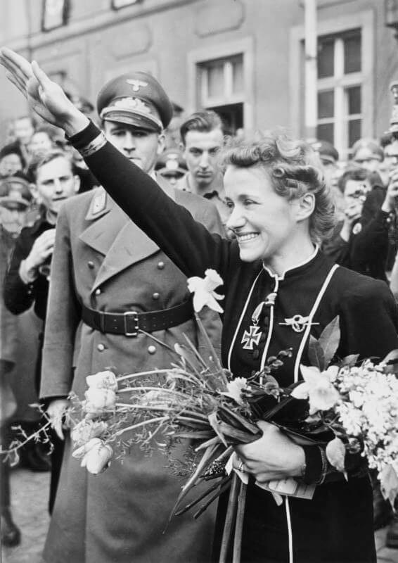

<DolnySlask />
<ArmiaNiemiecka />

### Hitlerowska celebrytka

W swoim pamiętniku 8 lutego Hugo Hartung nie pisze, kim była Hanna Reitsch. Dlaczego miałby to robić? Dla każdego Niemca było to wówczas oczywiste. Dziś jest to już zapomniana postać, a jest warta przypomnienia.

### Jelenia Góra

Hanna Reitsch pochodziła ze Śląska, urodziła się w Jeleniej Górze. Jej mama była gorliwą katoliczką, ale Hanna podobnie jak jej rodzeństwo, została wychowana w wierze ojca, luteranina, który był oftalmologiem i pragnął by również w dziedzinie zawodowej poszła w jego ślady i została lekarzem.

### Szybowce

Zafascynowana lotnictwem przez jakiś czas chciała połączyć marzenia swoje i ojca i planowała zostać latającym doktorem w misjach afrykańskich. Nawet jakiś czas studiowała medycynę. Ale później poświęciła się w całości karierze lotniczej.

Latania szybowcami uczyła się w szkole szybowcowej w Jeżowie Sudeckim (niem. Grunau), położonym zaledwie 4 km od jej rodzinnego miasta. Jeżów słynie jako jedno z miejsc narodzin szybownictwa - w Polsce mniej znana jest miejscowość bardziej miejsce lotniska, czyli Góra Szybowcowa.

Pierwszy szybowiec Hanny nieprzypadkowo nosi nazwę Schneider Grunau 9. Powstało tam wiele konstrukcji lotniczych, przede wszystkim jeden z najbardziej popularnych szybowców świata Schneider Grunau Baby wyprodukowany w liczbie ponad 4 tysięcy sztuk.

### Samoloty

W 1933 na zaproszenie Wolfa Hirtha, wówczas głównego instruktora szkoły, została zawodowym pilotem. Ostatecznie porzuciła marzenia o medycynie.

Przez kilka lat zajmowała się całkowicie niezaangażowanym politycznie sportem szybowcowym, osiągając rezultaty, które plasowały ją w światowej czołówce. Była pilotem-kaskaderem w filmach UFA. Badała możliwości uprawiania sportu szybowcowego w Ameryce Południowej. W 1934 zostaje członkiem Deutsche Forschungsanstalt für Segelflug (pl. Niemiecki Instytut Badawczy Szybownictwa) powstałego w wyniku nacjonalizacji Rhön-Rossitten Gesellschaft, pierwszego na świecie stowarzyszenia szybowcowego.

Stowarzyszenie to powstało właśnie m in w wyniku demilitaryzacji lotnictwa niemieckiego zarządzonej przez Traktat Wersalski. Ale historia z niektórych traktatów stroi sobie żarty i kiedy władzę przejęli naziści, stowarzyszenie dostało się pod ich kontrolę i zaczęło służyć celom wojskowym, takim jak szkolenie Hitlerjugend i projektowanie szybowców dla Wehrmachtu.

### Nazizm

Wobec tego zetknięcie z nazizmem było nieuchronne i choć Hanna nigdy nie należała do NSDAP, szybko stała się zafascynowaną Hitlerem gorliwą nazistką. Już od 1937 służyła jako pilot oblatywacz w Luftwaffe, testując wiele nowych konstrukcji, m in:

- szybowiec DFS 230, użyty przez niemieckich spadochroniarzy podczas ataku na Fort Eben-Emael
- słynny bombowiec nurkujący Junkers Ju 87 Stuka
- bombowiec Dornier Do 17, za co otrzymała Żelazny Krzyż II klasy

Była też pierwszą kobietą w historii, która usiadła za sterami helikoptera, była to pierwsza w pełni sterowna maszyna tego typu - Focke-Wulf Fw 61 (jego rozwojowa wersja Focke-Achgelis Fa 223 jest opisana na tym blogu)

<BoxImageWrapper>

Hanna Reitsch (1912-79), w tle Karl Hanke 
Źródło: Wikipedia Von Bundesarchiv, Bild 183-B02092 / Schwahn / CC-BY-SA 3.0, [CC BY-SA 3.0 de](https://creativecommons.org/licenses/by-sa/3.0/de/deed.en" title="Creative Commons Attribution-Share Alike 3.0 de), [Link](https://commons.wikimedia.org/w/index.php?curid=5432223)
</BoxImageWrapper>

Była drobnej budowy (miała 154 cm wzrostu i ważyła 45 kg), miała niebieskie oczy, blond włosy i fotogeniczną twarz z naturalnym uśmiechem. Stała się ikoną propagandy. Niewysoka i szczupła, więc wyglądała dobrze na zdjęciach z Hitlerem. Aryjski wzorzec i ideał dla kobiet III Rzeszy. A także świetna, nielękająca się wyzwań i zaangażowana ideologicznie pilotka.

Testuje wunderwaffe: w 1942 jest pilotem rakietoplanu Messerschmitt Me 163 Komet, podczas piątego lotu nie odczepił się wózek z kołami i wylądowała kapotując. Jeszcze zanim utraciła przytomność, zdołała zdać relację z wypadku. Pięć miesięcy spędziła w szpitalu, dochodząc do siebie.

Poważna katastrofa nie odstręcza jej ani od polityki, ani od latania. Po klęsce pod Stalingradem przez 3 tygodnie w lutym 1943 wizytuje front wschodni, latając samolotem obserwacyjnym Fieseler Fi 156 Storch (nieprzypadkowo przypomina polski samolot PZL-104 Wilga, który właśnie na nim jest wzorowany).

### V-1

Bierze udział w opracowaniu pilotowanej wersji pocisku rakietowego V-1, ważnej dla rozwoju konstrukcji; sam pocisk miał być bezzałogowy, ale do określenia właściwości aerodynamicznych potrzebne były loty załogowe. Jak pisze we wspomnieniach - latać tym pociskiem mógł każdy, ale miał tak dużą prędkość lądowania, że bezpieczne lądowanie było niemożliwe. Hanna rozwiązała ten problem, opracowując technikę lądowania przy użyciu pozbawionego napędu modelu rakiety.

Być może loty w szybowcowej wersji V-1 są natchnieniem dla jej następnej idei - kolejnej wunderwaffe - którą mają być samobójcze ataki pilotów-kamikaze. Przedstawiła ją Hitlerowi 28 lutego 1944. Choć sama idea nie znajduje uznania Hitlera, Hanna otrzymuje za to Krzyż Żelazny I stopnia.

Choć sam pomysł niemieckiego kamikaze został przez Hitlera odrzucony, był na różne sposoby rozwijany:

<SeeAlso txt="Wunderwaffe" url="/festung-breslau/article/wunderwaffe" />

### Lot do Berlina

Jeszcze przed końcem wojny odbywa jeden z najważniejszych lotów w swoim życiu: w miłosnej desperacji 26 kwietnia 1945 samolotem Storch odbywa niemal samobójczy lot, na minimalnym pułapie, do oblężonego Berlina. Chce namówić Hitlera do ucieczki. Nie udaje się jej to i dwa dni później na jego osobisty rozkaz ucieka samolotem z Berlina, również wymykając się z ostrzału niemal cudem, żeby oddać się do niewoli amerykańskiej.

Pod koniec kwietnia Tempelhof był już zajęty przez Armię Czerwoną. Hannna wylądowała i startowała z ulicy 17 czerwca (niem. Straße des 17. Juni; wówczas: Charlottenburger Chaussee) - czyli dalszego ciągu Unter den Linden od Bramy Brandenburskiej na zachód.

### Po wojnie

Przesłuchującym ją oficerom amerykańskim mówi, że kiedy była w bunkrze Hitler dał jej kapsułkę z cyjankiem i była gotowa umrzeć u jego boku, a 28 kwietnia kiedy rozkazał jej opuścić Berlin, był to najczarniejszy dzień w jej życiu, bo nie mogła umrzeć razem z nim; powiedziała: "*wszyscy powinniśmy uklęknąć z czcią i pomodlić się przed ołtarzem ojczyzny*" zapytana co ma na myśli, mówiąc o tym ołtarzu, odpowiedziała "*co za pytanie, bunkier Hitlera w Berlinie*".

W niewoli przebywała 15 miesięcy, Przez kilka lat po wojnie obywateli niemieckich dotyczył zakaz pilotowania, więc dopiero w 1952 wraca do zawodu.

Najciekawszym epizodem jej powojennej działalności jest utworzenie i praca w szkole szybowcowej w Afienya w Ghanie, do której przybyła w 1962 na osobiste zaproszenie Kwame Nkrumaha, dyktatora i zwolennika ruchu panafrykańskiego. Ghanę opuszcza w 1966 po zamachu stanu, podczas którego Nkrumah traci władzę. Z listów wyłania się obraz zażyłej przyjaźni z dyktatorem.

Wkrótce przed śmiercią wyznaje:
>I co my teraz mamy w Niemczech? Kraj bankierów i producentów samochodów. Nawet nasza armia jest miękka, żołnierze noszą brody i kwestionują rozkazy. Nie wstydzę się mówić, że wierzyłam w narodowy socjalizm, wciąż noszę Krzyż Żelazny z diamentami, który dał mi Hitler. W dzisiejszych Niemczech nie można znaleźć nikogo kto głosował na Adolfa Hitlera... Wielu Niemców czuje się winnych wojny, ale w tajemnicy trzymają to, czego naprawdę jesteśmy winni - że przegraliśmy.

Na blogu pojawia się z okazji jej przylotu do Wrocławia 8 lutego 1945, prawdopodobnie związanego z ewakuacją jej rodziny ze Śląska do zamku Leopoldskron w Salzburgu. Kiedy do zamku dotarły wieści, że uciekinierzy mają być przekazani władzom sowieckim, ojciec Hanny w nocy 3 maja zastrzelił żonę, później córkę i trójkę jej dzieci a na końcu siebie. Hanna zaś, choć miała 33 lata, kiedy zakończyła się wojna, nigdy nie wyszła za mąż i umarła bezdzietnie.

Do swoich ostatnich lat prowadziła aktywne życie i latała. Była nie tylko uzdolnionym pilotem-oblatywaczem i jedną z "kobiet Hitlera", była również wybitnym sportowcem, ustanowiła ponad 40 rekordów lotniczych, niektóre z nich wciąż są ważne. Oraz jak widać do końca życia zażartą hitlerówą.

### Odnośniki

- [Podróżnik w czasie "Hanna Reitsch – Pilot doświadczalny III Rzeszy z Jeleniej Góry" [YT 1:04:20]](https://www.youtube.com/watch?v=d69Z6KtBx_k)
- Chuck Owl ["Video from the Past [08] - Hanna Reitsch Interview (1976)" [YT 20:19]](https://www.youtube.com/watch?v=23Gw6TyzMBo)
- [DeltaVeeMedia "Hanna Reitsch: Aviation Pioneer/NAZI Icon" [YT 23:05]](https://www.youtube.com/watch?v=3It04_TIMtc)
- The People Profiles ["Leni Riefenstahl - Director of Triumph of the Will Documentary" [YT 50:21]](https://www.youtube.com/watch?v=adyrmo4dh0g)
