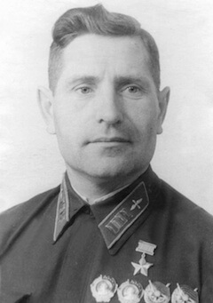

### 11 lutego 1945

Iwan Siemienowicz Połbin zginął 11 lutego 1945 w akcji nad Oporowem (niem. Opperau, od 1951 część Wrocławia). Warto napisać o nim więcej, bo jest zbyt ważny w opowieści o Twierdzy, a jego życie świetnie pokazuje epokę.

### Pochodzenie

Życie Iwana Połbina, i to od samego początku jest wzorcową ilustracją gieroja leninizmu. Pochodził z chłopskiej rodziny ze wsi Riszczewo-Kamienka (obecnie oczywiście Połbino, od 1965). Jego ojca ciężka praca parobka okaleczyła i zabiła, kiedy Iwan się urodził Siemien leżał przykuty do łóżka po tym, jak się przesilił w pracy, a umarł 7 lat później. Jego matka, Ksenia Alieksiejewna Połbina, która w tej sytuacji musiała utrzymywać całą rodzinę, została aresztowana z powodu tego, co powiedziała na wiejskim zebraniu o masakrze w Sankt-Petersburgu. Bowiem kiedy się Iwan Połbin urodził był to gorący w całym Imperium rok rewolucji 1905.

22 stycznia 1905 znany jest jako "krwawa niedziela". Tego dnia ok. 200 tysięcy ludzi wyszło na ulice stolicy Imperium Rosyjskiego (wówczas Sankt-Petersburg), by domagać się poprawy sytuacji robotników.

Prowadził ich duchowny prawosławny zainspirowany tołstoizmem, Gieorgij Gapon, kapelan więzienia etapowego w Petersburgu. Był osobą znaną i popularną, także na salonach petersburskich, i już wówczas był także współpracownikiem Ochrany. Pokojowa demonstracja mająca również charakter religijny (niesiono carskie portrety, ikony, śpiewano pieśni religijne) i o której władze były uprzedzone, została ku ogromnemu zaskoczeniu mieszkańców Petersburga, brutalnie stłumiona. Wojsko strzelało w tłum. Gapon wyszedł bez szwanku, ale było wielu zabitych. Liczbę ofiar śmiertelnych różnie się ocenia od 100 nawet do 1000. Zginął m.in. idący tuż obok Gapona, drugi sygnatariusz petycji, robotnik Iwan Wasiljew. Widząc to, przyjaciele wyciągnęli Gapona z tłumu i zaprowadzili do mieszkania Maksyma Gorkiego. Zszokowany Gapon zdziera z siebie duchowne szaty i wykrzykuje "*Nie ma już Boga, nie ma już cara!*" (Gapon jest zdumiewającą postacią, którą niestety trzeba w tym miejscu porzucić, ale polecam do zapoznania: nałogowy konfident oraz żarliwy idealista zarazem).

Nie wiadomo co takiego o tych wydarzeniach powiedziała Ksenia, ale najwidoczniej wystarczyło by osadzić ją w więzieniu w Uljanowsku (wówczas Symbirsk) - tam właśnie urodził się Iwan. Uljanowsk to obecnie 600 tys. miasto leżące nad szeroko w tym miejscu rozlaną Wołgą około 900 km na wschód od Moskwy, gdzieś pomiędzy Kazaniem a Samarą, więc bliżej Uralu niż Moskwy.

Rodzina Połbinów liczyła sześć osób, ale tylko matka zarabiała; ojciec umarł, kiedy Iwan miał 7 lat i wtedy syn musiał pójść w ślady ojca, zostając parobkiem i pastuchem. W wieku 12 lat jest już na własnym utrzymaniu. Ale jest to rok 1917, wybucha rewolucja, najpierw lutowa, później październikowa.

Rok później Iwan rozpoczyna pracę na dworcu w Wyrach, w brygadzie remontowej i tam w gazecie pierwszy raz w życiu widzi samolot. Ma 13 lat. Później w rodzinnej wsi nauczyciel opowiada mu o pilocie Piotrze Nikołajewiczu Niestierowie, który zasłynął staranowaniem samolotu wroga.

### Niestierow

Niestierow był, podobnie jak Iwan, entuzjastą lotnictwa od chwili kiedy tylko dowiedział się o jego istnieniu. Już w 1908 służy w wojskach balonowych. W 1912 kończy kurs pilotażu (m.in. w Warszawie) i wkrótce zostaje znanym w Rosji pilotem-akrobatą. 9 września 1913 pierwszy na świecie wykonuje pętlę. Kiedy wybucha Wielka Wojna, w stopniu sztabskapitana dowodzi 11 Oddziałem Lotniczym w ramach Frontu Południowo Zachodniego, który walczy w okolicy Lwowa. Po zajęciu Lwowa przez wojska carskie, jego oddział przebazowano do pobliskiej Żółkwi, gdzie stacjonował też sztab armii.

We wrześniu 1914 nad sztabem zaczął się systematycznie pojawiać austriacki samolot obserwacyjny, dwuosobowy dwupłatowiec Albatros B.II produkcji berlińskiej Albatros Werke AG.

Była to jedna z pierwszych konstrukcji Ernsta Heinkla, tak tego samego Heinkla od samolotów Heinkel Flugzeugwerke, późniejszego nazisty i współtwórcy potęgi Luftwaffe. Samolot powstał w 1914 jako udoskonalona wersja B. I jeszcze tego samego roku pobił rekord wysokości, osiągając pułap 4500 m. Mógł osiągnąć prędkość maksymalną 120 km/h. Popularny podczas Wielkiej Wojny, był używany przez wojsko polskie w wojnie z bolszewikami 1920.

Dla Niestierowa wówczas uznanego pilota, który miał wkład w opracowanie taktyki bombardowania i opracowywania konstrukcji lotniczych, ten samolot wroga nad własnym sztabem i lotniskiem był niczym codziennie wymierzany policzek. 8 września widząc go po raz kolejny, startuje swoim Morane-Saulnier G

Jest to francuski jednoosobowy jednopłatowiec, zaprojektowany w 1912 samolot sportowy, który szybko zyskał renomę, zdobywając 2. miejsce na zawodach Roland Garros. Po wybuchu wojny Rosjanie kupili projekt, i już w 1914 zaczęli produkcję w fabryce Dux w Moskwie (znanej później, oczywiście pod zmienioną nazwą, jako miejsce produkcji wielu typów samolotów opracowanych w biurach Suchoja i Mikojana). Tutaj, tak na marginesie: w okresie od rewolucji 1905 do Wielkiej Wojny Rosja bardzo dynamicznie rozbudowała swój przemysł i kolej, głównie w oparciu o kapitał i know-how francuski.

Oba samoloty są w większości drewniane, mają stałe podwozie i tę samą prędkość maksymalną. Są pokryte płótnem i nieuzbrojone. Nie istniało wówczas coś takiego jak uzbrojenie pokładowe, choć pilot lub obserwator mógł trzymać w kabinie bomby, lub broń ręczną. I właśnie pistoletem Piotr usiłuje strącić samolot wroga, ale wkrótce uznaje, że jest to niemożliwe i decyduje się użyć własnego samolotu jako broni. Nie jest dziś jasne, co dokładnie zamierzał, niektórzy uważają, iż chciał kołami złamać górny płat, wszak jest akrobatą, a nie samobójcą. Jednak uderzył śmigłem w ogon przeciwnika, tak że oba samoloty zwarły się w śmiertelnej kolizji i runęły na ziemię. Wszyscy zginęli na miejscu: Piotr Niestierow oraz obaj lotnicy austriaccy: obserwator baron porucznik Friedrich von Rosenthal i pilot kapral Franz Malina (Polak?). Było to nie tylko pierwsze staranowanie samolotu, ale w ogóle pierwsza walka powietrzna na świecie.

### Kariera lotnika

Dla Iwana pilot Piotr Niestierow staje się życiowym wzorem, od tej pory wszystko co robi, jest krokiem na drodze pilota. Idzie do szkoły, najpierw zawodowej w Skugajejewsku, później w 1922 drugiego stopnia w Karlinie gdzie wstępuje do Komsomołu, redaguje gazetę ścienną Gołos (pl. Głos) i uczy czytania i pisania wieśniaków z okolicy. Po ukończeniu szkoły zostaje kierownikiem czytelni we wsi Majna, wieczorami czyta zebranym ludziom i wyjaśnia to, czego mogli nie zrozumieć.

Iwan jest wyróżniającym się członkiem oddziału paramilitarnego, zorganizowanego przez miejscowy Komsomoł i szkolonego przez zdemobilizowanych czerwonoarmistów.

Pracuje w stowarzyszeniu przyjaciół floty powietrznej, zbiera pieniądze na budowę eskadry samolotów "Nasza odpowiedź Chamberlainowi".

Powołany do wojska zgłasza chęć wstąpienia do lotnictwa, ale lekarz mówi, że jest to niemożliwe - jego mały palec nie zgina się do końca. Służbę wojskową odbywa więc w ukraińskim pułku im Bohuna, tam w 1927 wstąpił do partii komunistycznej.

Po zakończeniu służby wojskowej starał się o odkomenderowanie do szkoły lotniczej, ale zamiast tego skierowano go do walki ideologicznej na wsi. Władze sowieckie tworzyły kołchozy, chłopi stawiali opór, (czasy Wielkiego Głodu to dopiero lata 1932-33). Służy Partii, ale z marzenia nie rezygnuje.

### Pilot

W 1929 został przyjęty do Wolskiej Połączonej Szkoły Lotników i Techników Lotniczych w obwodzie saratowskim, a po jej ukończeniu do Trzeciej Wojskowej Szkoły Lotników i Nawigatorów Lotniczych im K. E. Woroszyłowa w Orenburgu.

Jego pierwszym samolotem jest przestarzały U-1, sowiecka kopia wersji K popularnego podczas Wielkiej Wojny brytyjskiego dwupłata Avro 504, którego produkcję właśnie zakończono, ogółem od 1913 wyprodukowano ponad 10 tys. tych samolotów, z czego 700 to U-1 (ros. Аврушка, oficjalnie учебный, первый, czyli szkolny, pierwszy).

Później przesiada się na samolot bojowy: Polikarpow R-1 wówczas podstawowy samolot rozpoznania i lekki bombowiec. Oba są głównie drewnianymi dwupłatowcami o sztywnym podwodziu i płóciennym pokryciu. Mógłby na nich latać Niestierow. Szkołę kończy w 1931 i pozostaje w niej jako instruktor, co ma duże znaczenie dla jego przyszłości.

### Bombowce

Wkrótce zostaje skierowany do Charkowa, gdzie zapoznaje się ze skonstruowanym w biurze Tupolewa ciężkim bombowcem TB-3 (TB oznacza Тяжёлый Бомбардировщик, czyli ciężki bombowiec, cywilna wersja nosiła oznaczenie ANT-6), jest to konstrukcja całkowicie nowa i nowatorska, oblatany w grudniu 1930 pierwszy na świecie czterosilnikowy bombowiec jednopłatowy o całkowicie metalowej konstrukcji, ma 4 lub 5-osobową załogę, zasięg ponad 3 tys. kilometrów, i pułap prawie 4 km, udźwig 5800 kg bomb. Samolot był w służbie do 1945, chociaż oficjalnie wycofano go już w 1939, wyprodukowano ich ok. 800 sztuk. W porównaniu z R-1 jest gigantyczny, ma skrzydła o rozpiętości 40 metrów. Jego wadą jest powolność, osiąga zaledwie 212 km/h. W latach 1933-36 Połbin jest dowódcą samolotu, a następne dwa lata eskadry. Ominęła go Wielka Czystka lat 1936-39.

- Rex's Hangar ["The Soviet Bomber That Was Utterly Bonkers | Tupolev TB-3" [YT 25:04]](https://www.youtube.com/watch?v=b0g8HiAbNAE)

### Dowódca

W 1939 jako kapitan eskadry walczy z Japończykami nad Chałchin-Goł, gdzie wyróżnia się jako dowódca i szkoleniowiec. Jego eskadra wykonuje 19 lotów bojowych bez strat własnych. Czy poznał wtedy Żukowa? Tam po raz pierwszy dokonuje bombardowań z nurkowania, które staną się jego specjalnością i największym osiągnięciem. Po powrocie z wojny, w listopadzie 1939 zostaje dowódcą 150. pułku bombowców szybkich i wkrótce awansuje na majora.

Swoją eskadrę szkoli już na trzyosobowych samolotach SB-2, również z biura Tupolewa. Jest to samolot aerodynamiczny, ponad dwukrotnie lżejszy, o dwukrotnie mniejszej rozpiętości skrzydeł, udźwig bomb o wiele mniejszy: 600kg, ale za to jest o wiele szybszy - osiąga prędkość 450 km/h (i stąd nazwa: cкоростной бомбардировщик, czyli szybki bombowiec). Doskonale to odpowiada oczekiwaniom Iwana.

Dlaczego w 1939 na Dalekim Wschodzie nikomu nieznany lotnik angażuje się z takim zapałem w nowatorską technikę bombardowania wcześniej w sowieckim lotnictwie właściwie nieznaną? Odpowiedzią może być wojna domowa w Hiszpanii i hitlerowski Legion Condor. O Luftwaffe i niemieckiej technice lotniczej zaczęto mówić na całym świecie. W Hiszpanii Niemcy wypróbowali swój nowy bombowiec, Junkers Ju 87 Stuka, specjalnie dostosowany do bombardowań z lotu nurkowego. Była ich niewielka liczba i samo ich użycie miało charakter eksperymentalny, ale odznaczyły się w walce i o tym być może Iwan Połbin się dowiedział.

*Iwan Połbin (1905-45) 
Źródło: Wikipedia By Source ([WP:NFCC#4](https://en.wikipedia.org/wiki/Wikipedia:Non-free_content_criteria#4)), [Fair use](https://en.wikipedia.org/wiki/File:Ivan_Semyonovich_Polbin.jpg), [Link](https://en.wikipedia.org/w/index.php?curid=60542926)*

### Wojna

16 czerwca 1941 do jednostki dociera rozkaz mobilizacji, 22 czerwca po południu dowiadują się, że wybuchła wojna. W połowie lipca pułk osiąga gotowość bojową. Iwan Połbin i jego załogi idą na wojnę. Po siedmiu miesiącach walk w styczniu 1942 zostają wycofani z pierwszej linii, z całego pułku zostają tylko 4 samoloty. Ale ich osiągnięcia bojowe przechodzą do legendy.

Do września 1941 Połbin wykonuje 70 lotów bojowych i staje się sławny, piszą o nim w gazetach. Jego pułk walczył od Smoleńska do Moskwy. Do końca roku niszczą 160 czołgów, 370 innych pojazdów, 18 samolotów (w tym 12 w powietrzu), zabijają ok. 3500 żołnierzy, od bezpośredniego trafienia w samochód ginie niemiecki generał. Połbin na czele pułku wykonuje tylko najtrudniejsze zadania, jego specjalnością stają się nocne loty. Podczas jednego z takich lotów na terenie wroga gasną mu oba silniki i wraca lotem ślizgowym. Pułk się szybko odbudowuje, ale musi oddać wysłużone maszyny i dostaje nowe - Pe-2.

SB-2 był wciąż udoskonalaną konstrukcją, ale jego osiągi nie były już wystarczające w spotkaniu z nowoczesnymi myśliwcami wroga, szczególnie Me Bf-109. Największą jego wadą było słabe uzbrojenie obronne, czyli mało efektywne stanowiska strzeleckie, ostatnie wersje były już konstruowane jako bombowiec nurkujący i wyposażone w sferyczną wieżyczkę pozwalającą prowadzić ogień we wszystkich kierunkach. Jednak w 1940 zaprzestano modernizacji tego samolotu, ponieważ jego rolę zaczął pełnić zupełnie nowy i lepszy - właśnie Pe-2 popularnie zwany "peszką" (Пешка - pionek), wprowadzony do służby w 1941.

### Pe-2

Pe-2 służył całą wojnę, stając się jednym z bardziej rozpoznawalnych samolotów sowieckich czasów wojny. Dwusilnikowy dolnopłat, trzymiejscowy, prędkość maksymalna 580 km/h. Ze względu na osiągi i rozmiary pomiędzy typowym bombowcem a myśliwcem był samolotem wielozadaniowym: dalekiego rozpoznania, nocny myśliwiec, lekki bombowiec, a przede wszystkim bombowiec nurkujący - z taką myślą właśnie został zaprojektowany (ściśle rzecz biorąc przeprojektowany, bo pierwotnie miał to być myśliwiec eskorty wysokiego pułapu, z turbiną i hermetyczną kabiną znany jako VI-100, ale z tego bardzo zaawansowanego technicznie projektu zrezygnowano ze względu na nowe potrzeby). W wielu wersjach wyprodukowano ich ponad 11 tysięcy. Najbardziej oryginalną z nich zapewne była wersja Pe-2K RD-1, ze wbudowanym w ogon silnikiem rakietowym Głuszko RD-1, ale rakieta Głuszki przyspieszyła samolot jedynie o 90 km/h. Pe-2 szybko udowodnił swoją przydatność w boju, bo z łatwością przenikał przez strefę rozpoznania (cały czas trzeba pamiętać, że radary na froncie wschodnim nie odegrały istotnej roli) i dokonywał precyzyjnych bombardowań na zapleczu. Właśnie takie rajdy w dzień i w nocy były specjalnością tej maszyny.

A co oznacza to "Pe"? Oczywiście, co jest typowe dla konstrukcji zarówno niemieckich, jak i rosyjskich, pochodzi od nazwiska głównego konstruktora (szefa biura), w tym wypadku był to Władimir Michajłowicz Pietlakow. 12 stycznia 1942, a więc zanim Połbin dostaje nowe samoloty, Pietlakow zostaje wezwany do Moskwy na posiedzenie w sprawie produkcji Pe-2, chce zaprotestować przeciwko zabieraniu przez wojsko na front tak dużej liczbie pracowników jego biura, że zagraża to jakości jego samolotów. Na lotnisku jedynym dostępnym samolotem jest właśnie Pe-2, który, i tak miał lecieć do Moskwy. W trakcie lotu wybucha pożar, samolot się rozbija, wszyscy giną. Jest to więc konstruktor, którego zabił własny samolot, i to w trakcie lotu związanego z jego bezpieczeństwem. Ironia.

### Szaraga

Biuro Pietlakowa nosiło oficjalną nazwę Centralne Biuro Konstrukcyjne 29, miało też nazwę nieoficjalną - tupolewska szaraga. Słowo "szaraga" jest poza kręgiem czytelników Sołżenicyna raczej nieznane, co oznacza? Otóż w slangu dosłownie oznacza bandę łotrów, również byle jak zorganizowaną grupę, natomiast w warunkach sowieckich odnosiło się do tzw. OKB (ОКБ: Опытное конструкторское бюро - eksperymentalne biuro konstrukcyjne), czyli do tajnych ośrodków badawczych należących NKWD, ludzie w nich pracujący byli więźniami NKWD. Inaczej i w skrócie mówiąc, były to po prostu gułagi dla naukowców. Miały one ogromny dorobek naukowy i techniczny, w całości opublikowany anonimowo lub przypisany komu innemu, często tajny. Większość szarag została rozwiązana z końcem wojny, a ich pracownicy odzyskali wszystkie prawa. W takich szaragach byli uwięzieni m in Sołżenicyn, Polikarpow i Głuszko (konstruktor rakiet). W szaraszcze tupolewskiej, oprócz oczywiście Tupolewa i Pietlakowa było przynajmniej dwóch geniuszy o których trzeba wspomnieć, byli to:

- Siergiej Pawłowicz Korolow, twórca sowieckiego programu rakietowego, "rosyjski von Braun", to on wysłał pierwszego człowieka w kosmos.
- mniej znany, ale bardziej wszechstronny Lew Siergiejewicz Termen, który wynalazł m.in. telewizor o ekranie 150x150cm (w 1927! Niemcy dumni byli wówczas z telewizora z ekranem 8x10 cm), wysokościomierz magnetyczny pozwalający na lądowanie we mgle, ale najbardziej znany jest jego instrument elektryczny: theremin. Wiele lat był w USA jako rezydent wywiadu, później został odwołany do kraju i uwięziony. dla wywiadu sowieckiego zbudował m in pasywne urządzenie podsłuchowe umieszczone w wizerunku Wielkiej Pieczęci Stanów Zjednoczonych, który sowieccy pionierzy podarowali prezydentowi USA i rzeczywiście przez 7 lat znajdowało się w gabinecie ambasadora USA w Moskwie, zanim zupełnie przez przypadek odkryto jego właściwości - prawdziwa pieczęć trojańska można by rzec. Obecnie jest to jeden z ciekawszych eksponatów muzeum NSA.

### Bombardowanie z lotu nurkowego

Pe-2 był dla Połbina samolotem wymarzonym, samolotem życia i śmierci, przez następne trzy lata służby poznawał jego możliwości i przy jego pomocy doskonalił najważniejszą technikę lotu, z którą był związany - bombardowanie z lotu nurkowego.

Dotychczas stosowane bombardowanie z lotu poziomego było rzeczą relatywnie prostą i bezpieczną, ale - jak pisał Połbin w wielu artykułach - w warunkach nowoczesnej wojny coraz bardziej zawodną i nieefektywną. Wróg bowiem już nie umieszcza swoich wojsk w wielkiej koncentracji, zamiast tego rozprasza je na wielkiej powierzchni, nawet czołgi na pozycjach wyjściowych nie są łatwym celem, a normą stało się ustawianie stanowisk artyleryjskich w szachownicę.

To, co ma zostać zniszczone to nie obszar, ale punktowe cele: poszczególne czołgi, gniazda karabinów maszynowych, bunkry, stanowiska artyleryjskie, barykady; wszystko to nieprzyjaciel (prawdę mówiąc wszystkie strony konfliktu) nauczył się rozmieszczać tak, że dotychczas stosowane bombardowanie z lotu poziomego (dywanowe) jest albo nieefektywne, albo wymaga przemielenia masą bomb ziemi metr po metrze.

W przeciwieństwie do tego, bombardowanie nurkowe (ros. пикирование, niem. der Sturzflug) jest skuteczne, precyzyjne i szybkie, jest również - jeśli przeliczyć zaangażowane zasoby na skuteczność - bezpieczniejsze. Wymaga tylko dwóch rzeczy: odpowiedniego samolotu (zdolność do lotu nurkowego, hamulce aerodynamiczne i odpowiednie przyrządy celownicze) oraz wyszkolonych załóg. Jest oczywiście trudniejsze, a podczas ataku samolot nie tylko znajduje się w strefie rażenia artylerii przeciwlotniczej, ale jest doskonale widoczny. Jednak z powodu prędkości jest trudnym celem, a ponadto pilot doskonale widzi cel i jego maszyna naciera razem z bombą, którą w ten sposób naprowadza, więc przy odpowiednim wyszkoleniu załóg bombowce nurkujące są bronią śmiertelnie niebezpieczną dla wroga i niebywale skuteczną.

Dochodzi do tego efekt psychologiczny, i to po obu stronach frontu. Jak pisze Połbin
>118 razy bombardowałem skraj obrony przeciwnika! 118 wylotów to - 118 huraganów w serce! 118 wulkanów nienawiści! 118 wylotów pod ogniem wroga! 118 razy spotykaliśmy się ze śmiercią, ale silniejsza od śmierci nasz miłość do Ojczyzny!

Pierwszy raz zastosował tę technikę w 1939 podczas wojny z Japonią, jeszcze na wówczas przestarzałych TB-3, które nie nadawały się do lotu nurkowego (prędkość maksymalna 212 km/h!) i w tymże 1939 przynajmniej oficjalnie zostały wycofane ze służby, teraz dysponuje nowoczesnym bombowcem nurkującym, szybkim i precyzyjnym.

Ma również wielki autorytet, w 1942 jest już legendą, idolem Wojny Ojczyźnianej, jego głos liczy się w sztabie. Jest nie tylko zwolennikiem, propagatorem i szkoleniowcem bombardowania nurkowego, publikuje wiele artykułów z praktycznymi radami dla lotników; jest teoretykiem, który w praktyce udoskonala taktykę tego rodzaju ataku, formułuje jej założenia i wymagania.

### Wiertuszka

Życiowym osiągnięciem Połbina jest tzw. wiertuszka, czyli skomplikowany i udoskonalany przez lata praktyki atak pojedynczych samolotów lub ich grup wyprowadzony z zamkniętego kręgu utworzonego przez całą atakującą formację. Ponieważ samoloty dokonują bombardowania nurkowego z różnych kierunków, nieprzyjaciel narażony jest na długą serię ataków bombowych z nieprzewidywalnych dla niego pozycji. Taktyka ta powstała niemal przypadkiem podczas ataku na most kolejowy, który udało się zniszczyć dopiero w ten sposób po trzech dniach ataków.

### Na froncie

Połbin awansuje na pułkownika, po chwili odpoczynku i intensywnym, ale krótkim szkoleniu (cztery miesiące) jego pułk w maju 1942 wraca na front. Od lipca 1941 do sierpnia 1942, czyli podczas pierwszego roku wojny pułk wykonał ok 3000 tysiące lotów bojowych, w tym ponad 800 nocnych, bombardowanie z lotu nurkowego stanowiło 68% ataków. Od czerwca 1942 walczy w bitwie stalingradzkiej, 15 lipca dokonuje słynnego rajdu razem z drugim Pe-2 późniejszego generała Żołudiewa w pełnym świetle dnia nadlatując od słońca, atakują zamaskowany skład paliwowy. Eksplodują setki ton paliwa.

We wrześniu 1942 zostaje wezwany do Moskwy, przez trzy i pół miesiąca pełnił funkcję inspektora przy sztabie Sił Wojenno-Powietrznych Armii Czerwonej, jego pułk przemianowano na 35. pułk lotnictwa bombowego gwardii. "*Oderwać mnie od samolotu - to niepojęta rzecz!*" - pisze do żony.

W grudniu dzięki poparciu Wasilija Stalina wraca na front, zostaje dowódcą 301. Dywizji Lotnictwa Bombowego, a od kwietnia 1. Korpusu Lotnictwa Bombowego na Froncie Woroneskim. Podczas bitwy na Łuku Kurskim jego lotnicy osiągają spektakularny sukces, 7 lipca 1943 w ciągu 20 minut Pe-2 i Ił-2 z 2. i 17. AL niszczą 70 czołgów 7. i 9. Dywizji Pancernej, z 300 czołgów 3. i 17. Dywizji Pancernej pozostało 60.

### Generał

Od października 1943 korpus Połbina walczy w składzie 2. Frontu Ukraińskiego, w ciągu miesiąca niszczy 26 czołgów, 214 samochodów, 5 parowozów, 25 składów paliwa i amunicji, w 27 walkach powietrznych strącili 12 samolotów. Walka myśliwska staje się dodatkową specjalnością lotników Połbina, dochodzi do niej w październiku 1943, kiedy zespół 17 bombowców wraz z eskortą myśliwców wracając z ataku na transporty na stacjach Aleksandrija i Protopopowka natknął się na niemieckie Ju-87, strącono 13 maszyn przy stracie 3 własnych. Dostaje za to awans na generała-majora.

Od lipca 1944 bierze udział w operacji lwowsko-sandomierskiej. Koło Złoczowa niszczą 100 czołgów dywizji pancernej idącej na front. Straty niemieckie są olbrzymie, jak zeznaje wzięty do niewoli oficer Wehrmachtu:
>15 lipca pomiędzy godziną 14 a 15 po drugim zmasowanym ataku bombowców 1. Dywizja Pancerna straciła około 70% sprzętu. W lesie spłonęło do 60 czołgów, które od chwili kiedy opuściły fabrykę - nie oddały jeszcze ani jednego strzału. Przydzielony dywizji 113. Pułk Zmotoryzowany został rozbity. Pozostało z niego 60 ludzi, z których sformowano kompanię.

Latem 1944 generał Iwan Połbin jest już tak cenny dla dowództwa, że każdy jego lot bojowy wymaga zgody dowódcy 8. Armii Lotniczej, A G Samochina. Złoczów jest odległy 80 km od Żółkwi, czy Połbin leci zobaczyć miejsce, gdzie 30 lat wcześniej zginął jego idol, Piotr Niesierow?

### Operacja wiślansko-odrzańska

W przededniu operacji wiślańsko-odrzańskiej powstaje pytanie - jakiej techniki powinny użyć sowieckie samoloty? Generałowie Połbin i Riazanow byli zwolennikami ataku nurkowego, pozostali generałowie woleli skoncentrowany atak dywanowy z lotu poziomego. Żeby to rozstrzygnąć, przeprowadzono eksperyment: koło Jeżowa zbudowano imitację umocnień niemieckich obsadzoną zdobycznym sprzętem. Pikirowszcziki Połbina zaprezentowali skuteczność wiertuszki, ale Koniew zadecydował się na zmasowane bombardowanie. Pogoda jednak wymusiła zastosowanie techniki nurkowej podczas całej operacji. Poprawiła się tak późno, że bombardowania z lotu poziomego zastosowano dopiero przy przełamywaniu linii Nysy.

9 lutego 1945 generał Połbin niespodziewanie przylatuje na lotnisko w zdobytym dwa dni temu Brzegu, przyjął życzenia urodzinowe i polecił zebrać dowódców celem postawienia zadań bojowych.

Marszałek Koniew znał Połbina i jego skłonność do ryzyka oraz upodobanie do niebezpiecznych i trudnych technicznie misji. Rozkazał, by bez pozwolenia dowódcy 2. Armii Lotniczej nie odbywał lotów bojowych. A jeśli jest to konieczne miały mu towarzyszyć dwie grupy bojowe: 3 pary myśliwców, dwie 300-400 m nad bombowcami i trzecia 500 m wyżej.

### Ostatnie zadanie

Tego dnia jednak na osobistą prośbę dowódcy 6. Armii generała Głuzdowskiego - miernego dowódcy, który usiłował zapanować nad sytuacją - udał się jedynie w składzie eskadry, bez pozwolenia dowódcy Armii i bez eskorty. Grupę uderzeniową miało stanowić dziewięć samolotów, ostatecznie wyleciało osiem. Ich zadaniem było zablokowanie możliwości ucieczki z Wrocławia pozostałym tam wojskom niemieckim, mieli zaatakować cele na Oporowie. W szpicy leciał generał Połbin. Nad celem atakowali z wysokości 1500 metrów pod kątem 60 stopni, tworząc koło wiertuszki. Podczas czwartego nalotu samolot Połbina został trafiony, zaczął się palić i rozbił się we wschodniej części Wrocławia. W ostatniej chwili wyskoczył na spadochronie i uratował się strzelec-telegrafista (szturman) Władimir Aleksandrowicz Orłow.

Reszta załóg formacji nie wiedziała nic o tym, co się stało, wykonywali kolejne rutynowe naloty i po ósmym, kiedy już się skończyły bomby, oczekiwali na rozkaz powrotu. Usłyszeli komendę "Kończcie robotę!" jak się potem okazało, nie wiadomo przez kogo wydaną i wrócili na lotnisko.

Na lotnisku dowiedzieli się o losie dowódcy, którego ostatnie chwile obserwował P. I. Czernysz, dowódca samolotu na prawym skrzydle generała. Natychmiast po zestrzeleniu powrócił na lotnisko zameldować o tym, co się stało. Wygląda na to, że ostatni lot generała to była decyzja spontaniczna, podjęta w ogniu walki, atak odbył się bez przygotowania, określony był tylko rejon bombardowania, a jego śmierć była zupełnie przypadkowa. Kierunek, w którym się udał po trafieniu, sugeruje, że być może chciał dolecieć za linię frontu, jednak rozbił się jeszcze we Wrocławiu.

O tym, że się rozbił jeszcze we wschodnim Wrocławiu, wiemy z relacji Czernysza. Były również inne relacje i odmienne wersje końca generała, który oficjalnie przez jakiś czas był uważany za zaginionego. Jednak przytaczanie tych kontrowersji w ramach niniejszego artykułu jest bezcelowe, zainteresowanych odsyłam do artykułu profesora Żerelika, który również uważa je za bezpodstawne. W największym skrócie: miał przeżyć i dostać się do niewoli w mundurze prostego lotnika, tam został zdradzony i zabity. Wydaje się to jednak niemożliwe, raz z tego powodu, że trudno przypuścić by doświadczony lotnik Czernysz popełnił taki błąd, a po drugie Połbin latał w mundurze generalskim ze złotą gwiazdą na piersi, a na burcie samolotu miał lwa. To, że nie znamy żadnej relacji niemieckiej potwierdzającej zestrzelenie samolotu generała i rozbicie go jeszcze w obrębie Twierdzy wynikać może z tego, że został zestrzelony podczas czwartego nalotu, a więc w połowie ataku, mając jeszcze dostateczny zapas bomb i amunicji, by po uderzeniu w ziemię nie pozostawić żadnych śladów rangi pilota. Dla Niemców w chaosie wojny był to po prostu kolejny zestrzelony samolot.

Odpowiadając na oczywiste w tym miejscu pytanie - nie, nadal nie wiadomo gdzie dokładnie się rozbił samolot Połbina, już wtedy były we Wrocławiu spore obszary gdzie już nie było mieszkańców, a jeszcze ich nie obsadziło wojsko. Jeden rozbity samolot wobec ogromu późniejszych zniszczeń jest łatwy do pominięcia lub przeoczenia. Jeśli ktoś z czytelników wie cokolwiek na ten temat, proszę o informacje.

### Upamiętnienie

Kiedy zginął miał 40 lat. Jego syn został lotnikiem, a córka inżynierem lotnictwa. Generał Iwan Połbin jest jedynym, podczas 2 wojny światowej, generałem lotnictwa, który zginął w walce lotniczej. Kryterium rankingu podziękowań Stalina plasuje go na 16. miejscu wśród 29 wybitnych dowódców frontowych, w tym 12 lotników. Jest jednym z zaledwie 115 oficerów Armii Czerwonej, którzy dwukrotnie zostali odznaczeni tytułem Bohatera Związku Radzieckiego. Jest wspomniany w prawie każdej książce poświęconej lotnictwu sowieckiemu podczas 2 wojny światowej. Ma pomniki w Uljanowsku, Orenburgu i Moskwie, ulice w Moskwie, Uljanowsku, Doniecku i Wrocławiu (poprzednio Koselerweg, być może lokalizacja wynika z tego, że jest to ulica przy dawnym garnizonie sowieckim), muzeum w Uljanowsku.

Był wybitnym teoretykiem lotnictwa bombowego i taktyki lotu nurkowego, znakomitym szkoleniowcem i cenionym dowódcą. Znany ze skłonności do podejmowania ryzyka i trudnych misji, ale nigdy nie narażał swoich ludzi bardziej niż siebie, a najtrudniejsze misje wykonywał osobiście lub je prowadził.

W 2007 wrocławskie środowiska PiS podjęły próbę zmiany nazw kilku ulic, m.in. ulicy Połbina we Wrocławiu. Odbyła się dyskusja, która jednak nie spowodowała, że dowiedzieliśmy się o generale czegoś więcej. Dopiero artykuł profesora Rościsława Żerelika (podany poniżej) w opublikowanej w 2013 książce "Festung Breslau 1945 - nieznany obraz" przybliżył nam jego postać.

### Źródła

Opracowane na podstawie:

- Rościsław Żerelik "Generał-major gwardii Iwan Siemionowicz Połbin - jedyny generał lotnictwa, który zginął w boju w czasie II wojny światowej" [w:] Tomasz Głowiński (red.) "Festung Breslau 1945 - nieznany obraz", Gajt 2013, s. 105-124
