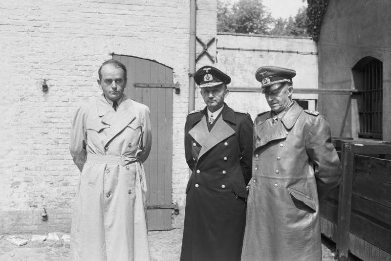

Wszyscy wiemy, że wojna w Europie zakończyła się bezwarunkową kapitulacją hitlerowskich Niemiec i poddaniem się do niewoli wszystkich wojsk niemieckich. Ale jak to dokładnie wyglądało?

### Rola Hitlera

Historycy są zgodni co do tego, że system wzajemnych aliansów i organizacja Ligii Narodów, która miała stać na straży porządku wersalskiego, już w połowie lat 30 był martwy. Niemcy zaś były skazane na reakcyjną dyktaturę, a wojna porównywalna z Wielką Wojną była nieuchronna.

Ale tempo, w jakim do tej wojny doszło i jej skala, okrucieństwo i niewyobrażalne dotąd zbrodnie są już osobistym dziełem Hitlera. Bez Hitlera wojna by wybuchła kilka lat później i nie byłoby ludobójstwa, obozów koncentracyjnych i zagłady, Holokaustu. Bez Hitlera Niemcy nie poszłyby na wojnę ze wszystkimi, i to wbrew wszelkim niesprzyjającym okolicznościom.

### Wehrmacht

Głównym narzędziem wojen Hitlera był Wehrmacht, nowa niemiecka armia poborowa. Jej powołanie 16 marca 1935 dekretem mobilizacyjnym było jawnym i oficjalnym zerwaniem z ograniczeniami narzuconymi Niemcom przez kończący Wielką Wojnę traktat wersalski, który ograniczał armię niemiecką do 100 tys. zawodowej Reichswehry. Dekret mobilizacyjny powoływał armię poborową, bez żadnych ograniczeń w zakresie liczebności czy broni. Porządek wersalski raz na zawsze przestał istnieć.

Ale jeszcze przed powołaniem Wehrmachtu, bo od 2 sierpnia 1934 żołnierze niemieccy byli związani przysięgą wierności osobiście wobec Hitlera personalnie, nie tylko jako formalnego głównodowodzącego. Nie zostało to Reichswehrze narzucone przez hitlerowców, była to inicjatywa sztabu, który w ten sposób chciał związać Hitlera z armią.

Skutek był jednak taki, że armia z konieczności stała się bezwolnym narzędziem w rękach dyktatora, który rzucał ją na kolejne wojny, za każdym razem z intuicją hazardzisty podbijając stawkę. W końcu rzucił ją do walki z sowietami, licząc na to, że Armia Czerwona osłabiona stalinowskimi czystkami i komunistyczna gospodarka nie wytrzymają uderzenia Wehrmachtu. Do jesieni 1941 sowieci mieli utracić wszelką możliwość kontrataku i odtworzenia armii. Nie utracili. Natomiast Wehrmacht zaczął ponosić gigantyczne straty. W 1941 było to 160 tys. zabitych. Od tego czasu 80% zaangażowania i strat niemieckich to front wschodni.

<SeeAlso txt="Armia niemiecka 1918-45" url="/festung-breslau/article/armia-niemiecka" />

### Koalicja antyhitlerowska, Wielka Trójka

Atak na sowiety miał jeszcze jeden niebagatelny skutek. Do tej pory Stalin był wiernym sojusznikiem Hitlera. Od sierpnia 1939 do czerwca 1941. Teraz Wielka Brytania, jedyna europejska potęga walcząca z hitlerowskimi Niemcami stała się naturalnym sojusznikiem. Co więcej, 7 grudnia 1941 Japonia zaatakowała amerykańską bazę marynarki wojennej w Pearl Harbor, a Hitler jeszcze raz podbił stawkę, wypowiadając wojnę USA 11 grudnia. Był pewien, że zanim Amerykanie otrząsną się ze strat ponoszonych na Pacyfiku, zanim zdążą wesprzeć Wielką Brytanię i przygotują inwazję na kontynent, Armia Czerwona zostanie pokonana i stanie się przeszłością. Ale kolejny rok wojny nie przyniósł przełomu. Wehrmacht nacierał, dotarł do Stalingradu i Kaukazu. Ale opór sowiecki nie został pokonany.

W 1943 w dniach 28 listopada - 1 grudnia w Teheranie, miało miejsce pierwsze spotkanie Wielkiej Trójki. Podstawowym warunkiem ustalonym wtedy było ostateczne pokonanie Niemiec i zmuszenie ich do bezwarunkowej kapitulacji, w tym samym momencie wobec wszystkich walczących stron: czyli Niemcy nie mogą stawiać żadnych warunków i nie ma mowy o żadnym separatystycznym pokoju. Wszyscy walczą do ostatecznego zwycięstwa. O dziwo pomimo rozbieżności, a nawet wrogości pomiędzy tymi z musu sojusznikami umowa ta została dotrzymana.

### Upadek

1944 był już cały rokiem cofania się wojsk niemieckich. Na wschodzie zostali zepchnięci do linii Wisły, na zachodzie aliantom udało się stworzyć drugi front i dotarli do Renu. W obliczu klęski 20 lipca dochodzi do prawie udanego zamachu na Hitlera dokonanego przez oficerów niemieckich.

W takim właśnie momencie 12 stycznia 1945 zaczyna się ta kronika wojenna. Operacja wiślańsko-odrzańska, a potem berlińska niszczą opór niemiecki i kończą wojnę.

29 kwietnia Hitler, chwilę po ślubie z Evą Braun spisał testament, osobisty i polityczny, w tym drugim na swoich następców wyznaczył w sprawach wojskowych admirała Dönitza, w politycznych Goebbelsa.

30 kwietnia ok godz. 16 Adolf i Eva Hitler zabijają się w bunkrze na tyłach Nowej Kancelarii Rzeszy. Od 10 dni trwała bitwa w samym Berlinie, 30 kwietnia czerwonoarmiści byli na pl. Poczdamskim od południa, a od północy przeszli Most Moltkego i widzieli Reichstag.

Miejsce, gdzie wciąż są zawalone pozostałości bunkra, upamiętnia tylko tablica na parkingu, jakieś 100 m na południe od Pomnika Holokaustu. Z budynku Nowej Kancelarii Rzeszy nic nie pozostało. Po wojnie to była wschodnia część Berlina i enerdowcy urządzili Hitlerowi damnatio memoriae, likwidując wszystko, zresztą w 1961 powstał tuż obok Mur Berliński.

30 kwietnia kilka godzin po samobójstwie Hitlera, generał Krebs oznajmia generałowi Czujkowowi, że Fuhrer nie żyje i wobec gotowi są poddać garnizon Berlina. Czujkow - zwycięzca ze Stalingradu - zgodnie z ustaleniami sojuszniczymi wymaga kapitulacji bezwarunkowej.

Wtedy pierwszego maja na wieść o warunkach sowieckich Goebbelsowie się zabijają. Magda Goebbels zabija sześcioro swoich dzieci, a potem z Josefem popełniają samobójstwo. To pozostawia admirała Dönitza w roli jedynego legalnego następcy Hitlera.

Kapitulacja Berlina została uzgodniona po północy z 1 na 2 maja i weszła w życie o godz. 1300 2 maja.

### Flensburg

2 maja marszałek Dönitz formuje we Flensburgu (południowy Szlezwig) rząd pohitlerowski, w którym Dönitz był jednocześnie naczelnym wodzem i głową państwa. Było tam nawet 12 ministerstw obsadzonych przez 9 oficjeli. Z najwyższej rangi dowódców wojskowych pozostali tylko generałowie Jodl, Keitel (z powodu swojej służalczości wobec Hitlera przezywany w sztabie Lokeitel) i Erich von Manstein, choć chwilowo nieosiągalny.

W ciągu kilku następnych dni kapitulują wojska niemieckie we Włoszech, w płn-zach Niemczech, w Bawarii, Holandii, a przez Łabę ucieka do Amerykanów 12 Armia Wencka. Poza Czechami i paroma izolowanymi miejscami nie ma już oporu, ale formalnie Niemcy są w stanie wojny. Wciąż. Aż do 7 maja 1945.

Ten osobliwy twór istniał do 23 maja, czyli w sumie trzy tygodnie.

- Dark Docs ["Germany's Fake Last Fuhrer" [YT 11:54]](https://www.youtube.com/watch?v=FtxAX4XTe4E)

*Speer, Dönitz i Jodl po aresztowaniu we Flensburgu, 23 maja rząd Dönitza przestał istnieć. 
By Malindine E G (Capt), No 5 Army Film &amp; Photographic Unit - [http://media.iwm.org.uk/iwm/mediaLib//37/media-37799/large.jpg](http://media.iwm.org.uk/iwm/mediaLib//37/media-37799/large.jpg)(https://commons.wikimedia.org/wiki/File:IWMLondonThumbnail.jpg)This is photograph [BU 6713](https://www.iwm.org.uk/collections/item/object/205194788) from the collections of the [Imperial War Museums](https://www.iwm.org.uk/).(https://commons.wikimedia.org/wiki/File:Flag_of_the_United_Kingdom.svg), Domena publiczna, [Link](https://commons.wikimedia.org/w/index.php?curid=24494241)*

### VE-Day (Victory Europe Day)

5 maja na polecenie Dönitza do kwatery głównej aliantów zachodnich w Reims (tak, tym słynnym mieście koronacyjnym królów francuskich) przybywa von Friedeburg. Jego zadaniem jest wynegocjowanie poddania się wojsk niemieckich tylko na froncie zachodnim. Ale głównodowodzący SHAEF generał Eisenhower domaga się bezwarunkowej kapitulacji wobec wszystkich walczących ze stron. Następnego dnia przybywa Jodl. Negocjacje przeciągają się, alianci zgodnie z ustaleniami sojuszniczymi, tak samo, jak wcześniej Czujkow, wymagają bezwarunkowej kapitulacji. Dönitz nie chce się zgodzić, a Jodl nie ma kompetencji do samodzielnej decyzji. Jest już sporo po północy, kiedy przychodzi depesza od Dönitza ze zgodą na warunki aliantów.

Jodl podpisuje kapitulację Wehrmachtu i wszystkich podległych sił. Jest 7 maja 1945, godzina 0241. I to jest VE-Day (Victory Europe). Dzień zwycięstwa świętowany w całym zachodnim świecie.

Pod aktem kapitulacji podpisy złożyli:

- Przedstawiciele Niemiec (z upoważnienia Naczelnego Dowódcy Wehrmachtu wielkiego admirała Karla Dönitza):
  - generał Alfred Jodl, Szef Sztabu Dowodzenia Wehrmachtu w Naczelnym Dowództwie Wehrmachtu, reprezentujący wojska lądowe oraz całość sił zbrojnych
  - admirał Hans-Georg von Friedeburg, Naczelny Dowódca Kriegsmarine
  - generał Wilhelm Oxenius, przedstawiciel Naczelnego Dowódcy Luftwaffe
- Przedstawiciele aliantów:
  - generał Walter Bedell Smith jako przedstawiciel Naczelnego Dowódcy Wojsk Ekspedycyjnych generała Eisenhowera
  - generał Iwan Susłoparow reprezentujący najwyższe dowództwo radzieckie

Akt kapitulacji mówił o zaprzestaniu działań zbrojnych przez wszystkie siły lądowe, morskie i powietrzne będące pod dowództwem niemieckim w dniu 8 maja o godzinie 23.01 czasu środkowoeuropejskiego. Zaproszony w ostatniej chwili francuski generał François Sevez przedstawiciel Francji był podczas kapitulacji świadkiem.

Do Nowego Jorku jest sześć godzin różnicy, ale ówczesne media tak szybko nie działają, jak współcześnie. Amerykanie o kapitulacji Niemiec dowiadują się 7 maja z samego rana.

### Die Stunde Null

Tekst kapitulacji zawiera kluczowe zdanie:
>All forces under German control to cease active operations at 2301 hours Central European Time on May 8, 1945

Oznacza to, że podpisana rano, przed świtem 7 maja kapitulacja wchodzi w życie dnia następnego, przed północą. I to jest właśnie niemiecka "Godzina Zero". My w Polsce możemy to kojarzyć z "grubą kreską" premiera Tadeusza Mazowieckiego. Odcinamy złą przeszłość i budujemy państwo na nowo. Godzina Zero to fundamentalny konstrukt ideologii politycznej powojennych Niemiec, to właśnie dzisiaj wszystkie media niemieckie mówią o końcu wojny i "wyzwoleniu Niemiec z nazizmu" co jest przyznaniem, że sami nie byli w stanie tego zrobić.

Do tego określenia nawiązuje tytuł doskonałego neorealistycznego filmu Rosseliniego "Germania anno zero" z 1948.

### День Победы / Dzień Zwycięstwa

Stalin jest oburzony. Kapitulację podpisano w SHAEF w Reims w kwaterze Eisenhowera. Nie było tam przedstawicieli Armii Czerwonej poza jednym nikomu nieznanym generałem. Krzyczy:
>A kto jest ten dzielny generał Susłoparow, który przyjął kapitulację III Rzeszy?

A to przecież Armia Czerwona pokonała Hitlera. I to ona zdobyła Berlin. Poprzednią umowę nazwano "wstępnym protokołem kapitulacji". Trzeba wszystko zorganizować na nowo. W Berlinie. Zanim to się udało, był już 8 maja wieczór.

Odbyło się to w szkole saperskiej w Berlin-Karlshorst (niem. Pionierschule I der Wehrmacht), wówczas kwaterze Żukowa. Obecnie jest tam Muzeum Niemiecko Rosyjskie (niem. Deutsch-Russisches Museum). Protokół uzupełniono informacją, że kapitulujące wojska zdają broń miejscowym dowódcom koalicji.

- Alianci:
  - Ze strony sowieckiej był marszałek Żukow - dowódca 1 Frontu Białoruskiego i zdobywca Berlina.
  - Aliantów zachodnich reprezentował marszałek RAF A.W. Tedder
- Przedstawiciele Niemiec (z upoważnienia Naczelnego Dowódcy Wehrmachtu wielkiego admirała Karla Dönitza):
  - feldmarszałek Wilhelm Keitel, Szef Naczelnego Dowództwa Wehrmachtu i Naczelny Dowódca Wojsk Lądowych
  - admirał Hans-Georg von Friedeburg, Naczelny Dowódca Kriegsmarine
  - generał Hans-Jürgen Stumpff, jako reprezentant Naczelnego Dowódcy Luftwaffe, generała feldmarszałka von Greima
- Dodatkowo jako świadkowie kapitulacji podpisali się:
  - generał Carl Spaatz (USA)
  - generał Jean de Lattre de Tassigny (Francja)

Była 23.01 8 maja 1945. W Moskwie mającej dwie godziny różnicy do Berlina był już 9 maja godzina 01.01.

### Podsumowanie

Stąd ta rozbieżność w datach:

- Kraje zachodnie w tym głównie USA koniec wojny w Europie świętują 7 maja.
- RFN 8 maja.
- Sowiety, a potem Rosja 9 maja.
- Kraje tzw. demokracji ludowej (w tym Polska), a to zależy, które i kiedy, czasem 9, a czasem 8 maja.
- Jesienią 1949 powstaje NRD. Dzień Wyzwolenia w Izbie Ludowej został uchwalony już w 1950 jako *Tag der Befreiung des deutschen Volkes vom Hitlerfaschismus*; do 1985 9 maja, potem 8. W latach 1950-67 (wtedy wprowadzono 5-dniowy tydzień pracy) i potem od 1975 był to dzień wolny od pracy.

### Odnośniki

- [Museum of the Surrender Reims](https://musees-reims.fr/reims-museums/)
- [Deutsch-Russisches Museum Berlin-Karlshorst](https://www.museum-karlshorst.de)
- [Zeitgeist "Die Stunde Null - Europa nach dem Krieg (1)" [YT 44:50]](https://www.youtube.com/watch?v=xKjJX21n1WI)
- ["Why did the Japanese treatment of POWs change so dramatically between the Russo-Japanese War and the Second World War?"](https://www.reddit.com/r/AskHistorians/comments/eg5shj/why_did_the_japanese_treatment_of_pows_change_so/)
- Mark Felton Productions ["Hitler's Army in Allied Service 1945-46" [YT 8"06]](https://www.youtube.com/watch?v=p8RJpJdFjIw) | ["Rump Reich - The Nazi Government in Power After VE-Day 1945" [YT 9:09]](https://www.youtube.com/watch?v=y99DxDKhOPw)
- War Stories with Mark Felton ["Rat Lines - The Hunt for Nazi War Criminals (Episode 1)" [YT 26:33]](https://www.youtube.com/watch?v=Lo3vzQ9NGL0) | ["Rat Lines - The Hunt for Nazi War Criminals (Episode 2)" [YT 38:33]](https://www.youtube.com/watch?v=7kIXTyUTq9o) | ["Rat Lines - The Hunt for Nazi War Criminals (Episode 3)" [YT 30:20]](https://www.youtube.com/watch?v=2IY_Fg4OsL0) | ["Rat Lines - The Hunt For Nazi War Criminals Episode 4" [YT 24:06]](https://www.youtube.com/watch?v=cCiCfdVnI4w) | ["Rat Lines -The Hunt for Nazi War Criminals (Episode 5)" [YT 39:00]](https://www.youtube.com/watch?v=65FbH5w-uHA)
- [Operation Unthinkable](https://en.wikipedia.org/wiki/Operation_Unthinkable)
- [ALFASHIRT "Die letzten Bilder der Wehrmacht in Farbe ( Mai 1945 )" [YT 6:53]](https://www.youtube.com/watch?v=NgOgBaj7UEY)