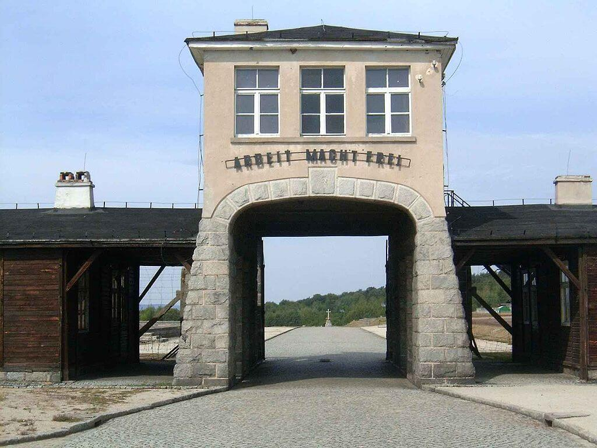

<DolnySlask />

### Wstęp

Artykuł ten pierwotnie był dużo obszerniejszy, ale część ogólnie dotycząca obozów koncentracyjnych umieściłem w osobnym artykule:

<SeeAlso txt="Obozy koncentracyjne" url="/festung-breslau/article/obozy-koncentracyjne" />

### KL Groß-Rosen

Stammlager, czyli obóz macierzysty (niem. Stamm to m.in. pień, rdzeń) powstał w pobliżu wsi Rogoźnica latem 1940, jako filia KL Sachsenhausen.

2 sierpnia 1940 dotarł pierwszy transport więźniów. Był to niewielki obóz pracy, w którym więźniowie pracowali w pobliskim kamieniołomie granitu należącym do Deutsche Erd- und Steinwerke GmbH (DEST), jest to jedno z wielu przedsiębiorstw SS.

Warunki w obozie macierzystym były przerażające. Wyniszczająca praca i głodowe wyżywienie (800 kalorii) powodowały, że nowo przybyły więzień w ciągu miesiąca tracił na wadze 20 kg. Przeciętny czas życia człowieka pracującego w najcięższych komandach wynosił 5 tygodni. Wielu więźniów popełniało samobójstwo. Ciała ofiar obozu palono w krematorium, a popiół sprzedawano okolicznym rolnikom jako nawóz.

Więźniów zatrudniało wiele firm np. Siemens & Halske (od 1966 znany jako siemens AG) oraz Blaupunkt.

W marcu 1941 rozpoczęto budowę małego obozu z czterema blokami.

1 maja 1941 został przekształcony w samodzielny obóz koncentracyjny.

Od października 1941 Komendantura była podzielona na wydziały:

- Kommandantur-Stab: SS-Oberscharführer Eugen Illig
- Politische Abteilung (Departament Polityczny - Gestapo): Kriminalsekretär Richard Treske
- Schutzhaftlagerleitung: SS-Untersturmführer Anton Thumann i SS-Obersturmführer Walter Ernstberger
- Standortverwaltung: SS-Oberscharführer Willi Blume
- Abteilung V (Sanitätswesen): SS-Untersturmführer Friedrich Entress, SS-Hauptscharführer Karl Babor, SS-Hauptsturmführer Wilhelm Jobst, SS-Obersturmführer Heinrich Rindfleisch, SS-Hauptsturmführer Dehnel, SS-Hauptsturmführer Heinz Thilo i Josef Mengele

Na początku 1942 zaczyna się operacja Noc i mgła (niem. Nacht und Nebel) deportowania i likwidacji członków ruchu oporu w państwach Europy Zachodniej, trwa do konca wojny. Część z nich trafia do Groß-Rosen.

Od 1942 powstają podobozy, m in w Leśnicy we Wrocławiu.

Jesienią 1943 powstaje Arbeitserziehungslager tzw. wychowawczy obóz pracy, placówka wrocławskiego Gestapo. Reedukacja przez pracę młodych ludzi uwięzionych za przewinienia. Obóz funkcjonował do końca, liczbę osób, która przeszła szacuje się na ponad 4 tys.

Na początku 1944 ukończono budowę dużego obozu, obliczonego na 7 tys. więźniów, potem to zwiększono do 20 tys.

W 1944 KL Groß-Rosen zostaje centralą ogromnej sieci obozów pracy na Dolnym Śląsku, a także w Czechach i Saksonii. Było to ponad 100 filii. Większość więźniów przywożono z obozu zagłady Auschwitz II Birkenau. Był to jedyny obóz zagłady, w którym ze względu na potrzebę rak do pracy wprowadzono selekcję na rampie. Dlatego duża liczba podobozów Groß-Rosen była przeznaczona dla więźniów żydowskich, którzy podczas lub po wykonaniu pracy mieli zostać zgładzeni.

Tak było np. w AL Riese, sieci obozów pracy przy FHQ Riese w Górach Sowich. 4 duże i 12 mniejszych obozów w zarządzie Organizacji Todt. Skierowano tam 12 tys. więźniów, ponieważ był to tajny obiekt, wszyscy musieli być przeznaczenie na śmierć, dlatego byli to więźniowie żydowscy. W sumie zginęło 5 tys. z nich.

Filia w Brzegu Dolnym produkowała gazy bojowe Tabun i Sarin.

W 1944 Krupp przeniósł produkcję zapalników z Essen do Głuszycy.

W 1945 jest miejscem przerzutu dziesiątek tysięcy więźniów z obozów ewakuowanych na wschodzie w tzw. marszach śmierci.

Komendanci obozu:

- Arthur Rödl (1940–1942)
- Wilhelm Gideon (1942–1943)
- Johannes Hassebroek (1943–1945)

Ogrodzone części:

- obóz kobiecy
- Arbeitserziehungslager
- obóz jeńców sowieckich; większość mordowano po przywiezieniu, ok. 2500 zabitych na przełomie 1941/42.

Wyzwolenie 14 lutego 1945, ogółem przez obóz przewinęło się 120 tys. ludzi.

*Brama obozu koncentracyjnego Groß-Rosen 
Źródło: Wikipedia By Autor nie został podany w rozpoznawalny automatycznie sposób. Założono, że to [Lzur](https://commons.wikimedia.org/wiki/User:Lzur) (w oparciu o szablon praw autorskich). - Źródło nie zostało podane w rozpoznawalny automatycznie sposób. Założono, że to praca własna (w oparciu o szablon praw autorskich)., [CC BY-SA 3.0](http://creativecommons.org/licenses/by-sa/3.0/), [Link](https://commons.wikimedia.org/w/index.php?curid=309316)*

### Osądzenie

Obóz koncentracyjny Groß-Rosen nigdy nie doczekał się osobnego procesu. Tak jak w przypadku KL Auschwitz większość zbrodniarzy uniknęła procesu. Wszyscy skazani osądzeni zostali indywidualnie albo za zbrodnie dokonane gdzie indziej.

- Arthur Rödl, pierwszy komendant, popełnił samobójstwo w 1945.
- Wilhelm Gideon, drugi komendant, skazany za zbrodnie wojenne na 10 lat więzienia.
- Johannes Hassebroek, trzeci i ostatni komendant; w 1948 skazany przez brytyjski Trybunał Wojskowy na karę śmierci za zbrodnie popełnione w obozach koncentracyjnych; w styczniu 1950 karę zamieniono na 15 lat więzienia i we wrześniu 1954 wypuszczono go na wolność; zmarł w 1977 w Westerstede.
- Friedrich Entress, naczelny lekarz SS w obozie; wykonywał zastrzyki z fenolu; sądzony za zbrodnie w Mauthausen skazany na karę śmierci i stracony.
- Willibald Jobst, lekarz SS; skazany na karę śmierci w pierwszym procesie załogi Mauthausen przed amerykańskim Trybunałem Wojskowym; wyrok wykonano przez powieszenie w więzieniu Landsberg.
- Heinz Thilo, lekarz SS; popełnił samobójstwo w Berlinie w 1947.
- Anton Thumann, jeden z największych sadystów w obozach; odpowiadał jedynie za zbrodnie popełnione w Neuengamme; Trybunał wydał wyrok śmierci, wykonany przez powieszenie w październiku 1946 w więzieniu Hameln.
- Karl Gallasch, najokrutniejszy z esesmanów obozowych, każdego dnia zabijał ok. 5 osób; skazany na karę śmierci powiesił się 19 maja 1947 w więziennej celi we Wrocławiu.
- Albert Lütkemeyer, osądzony przez brytyjski Trybunał Wojskowy w Hamburgu za zbrodnie w Neuengamme; skazany na śmierć przez powieszenie. Wyrok wykonano w więzieniu Hameln w czerwcu 1947.

### Po wojnie

Przez około dwa lata po wojnie na terenie obozu funkcjonował obóz koncentracyjny NKWD. Prawie nic nie wiadomo o tym okresie. NKWD zniszczyło wiele śladów po hitlerowskim obozie koncentracyjnym.

W 1947 oddali obóz władzom lokalnym, które starały się zabezpieczyć obiekt. Ale bardzo długo mimo starań byłych więźniów nie udawało się utworzyć muzeum obozowego, obiekty obozowe padały ofiara wandalizmu i kradzieży.

11 września 1947 powstaje Komitet Ochrony Groß-Rosen. W 1963 obiekt zostaje wpisany do Krajowego Rejestru Zabytków i dopiero wtedy objęty ochroną konserwatorską. Od początku lat 70. opiekę merytoryczną zapewnia wrocławskie Muzeum Historyczne. Zaczyna się profesjonalne gromadzenie dokumentacji i zbiorów.

Dopiero 21 kwietnia 1983 powstaje Państwowe Muzeum Groß-Rosen. Zaczyna się systematyczne badanie całego kompleksu obozów. W 2005 kamieniołom - miejsce śmierci tysięcy więźniów - staje się częścią Muzeum.

### Odnośniki

- [Radio Wrocław "Dolnośląskie Tajemnice #37 Mengele w Gross-Rosen. Opowiada Joanna #Lamparska" [13:08]](https://www.youtube.com/watch?v=2aYca_cvKGE)
