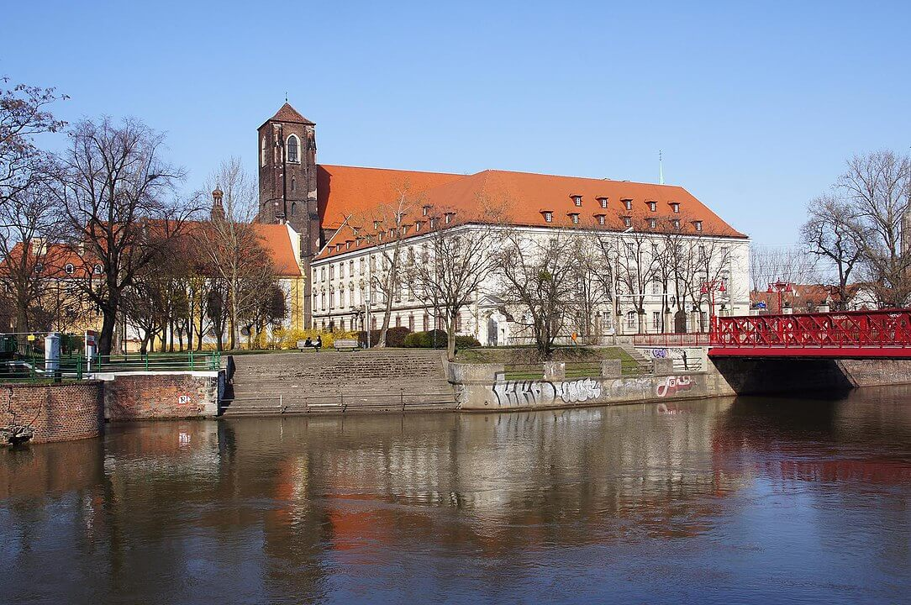

<DolnySlask />

### Piotr Włost

Zacznijmy od początku, w tym wypadku wypada on na XII wiek.

Po upadku rodu Awdańców w otoczeniu Bolesława Krzywoustego, w 1117 jego palatynem zostaje wrocławski wielmoża Piotr Włostowic. Posiada on Ślężę, Ołbin, wyspę Piasek oraz inne ziemie, a jego najbliżsi krewni mają dość ziemi, stanowisk i wpływów, by powiedzieć, że razem z rodziną praktycznie rzecz biorąc, jest właścicielem Wrocławia i okolic. Palatyn jest to najważniejsza funkcja w państwie tej epoki, był to jednocześnie minister skarbu i wojny, a jeśli trzeba to i regent / interrex.

Najważniejszym aktem prawnym tej epoki był tzw Testament Bolesława Krzywoustego, który z pewnością istniał w formie pisemnej, która niestety nie zachowała się (wiadomo, że dokument ten przyjęto w Rzymie). Możemy się jednak domyślać, że jego naczelną ideą było zachowanie jednocześnie pokoju pomiędzy synami zmarłego monarchy, jak i jedności terytorialnej państwa. Bolesław stworzył system, który mógłby działać, gdyby wszyscy jego spadkobiercy tego pragnęli.

Niestety już pierwszy senior chciał, by tron krakowski przypadł jego synowi, a nie młodszym braciom. Dlatego szybko znalazł się z nimi w konflikcie. Wybuchła tzw. wojna z juniorami, niespodziewanie rozstrzygnięta podczas bitwy o Poznań na niekorzyść owego seniora, czyli Władysława Wygnańca (po bitwie musiał uciekać do cesarza - stąd przydomek). Władysław odziedziczył palatyna po ojcu, a Piotr raczej skłaniał raczej się ku realizacji postanowień Testamentu, natomiast niespecjalnie się przykładał do wojny pomiędzy Władysławem a juniorami. Takie zapewne było tło konfliktu pomiędzy nimi, zakończonego oskarżeniem o zdradę, pozbawieniem stanowiska i oślepieniem, w wyniku którego Piotr wkrótce umarł.

### Augustianie

Taki był smutny koniec najpotężniejszego człowieka na Śląsku. Ale póki żył to zrobił wiele rzeczy, których materialne pozostałości widzimy dziś. Jedną z najważniejszych z nich jest osadzenie augustianów na wyspie Piasek. Byli tam od 1148 aż do sekularyzacji w 1810. Co oznacza, że była to najdłużej istniejąca w jednym miejscu wrocławska siedziba klasztorna.

Mając Piasek, augustianie posiadali przywilej ściągania myta z przeprawy przez wyspę, dzięki czemu mamy potwierdzenie istnienia stałego mostu - chodzi o Most Piaskowy - już w 1148 co jest rekordem Polski, jeśli chodzi o most miejski. Piasek znajduje się dokładnie pomiędzy Ostrowem Tumskim a lewobrzeżnym miastem, więc augustianie żyli przez te wieki trochę pomiędzy Ostrowem Tumskim, gdzie mieściła się siedziba biskupa a lewobrzeżnym miastem, raczej na marginesie historii Wrocławia.

Wyjątkiem były czasy słynnego opata Jana III z Pragi, który był tak dumny, że kazał sobie wybudować osobny kościół grobowy. Zasłynęli też sporem o korzystanie z przywileju pierwszeństwa w procesji Bożego Ciała - pierwszeństwa oczywiście po biskupie, chodziło o to, który opat ma iść zaraz za biskupem. Była to poważna wojna z norbertanami, głównie polegająca na niezwykle kosztownym procesowaniu się, ale przynajmniej raz doprowadziła do szamotaniny podczas procesji, biskup się przewrócił, ale monstrancję udało się uratować. Żarty na ten temat krążyły po całej Europie.

Ale przejdźmy do samego klasztoru. Otóż w epoce biskupa Franza Neuburga - ze względu na znaczenie i czas trwania słowo epoka jest jak najbardziej na miejscu, panowanie Neuburga odmieniło diecezję. Nastąpiła przebudowa ciasnych gotyckich zabudowań klasztornych na budynek, który istnieje dziś, zbudowany w latach 1709-15 wg projektu architekta Johanna Georga Kalckbrennera. Dlaczego właściwie opaci ówcześni budowali sobie tak wielkie wystawne gmaszyska - z tego czasu przecież pochodzą również pobliskie klasztory norbertanów (Filologia UWr) i krzyżowców z czerwoną gwiazdą (Ossolineum) - jest to temat na osobne rozważania.

*Barokowy klasztor augustianów we Wrocławiu (gmach po prawej) 
By [Barbara Maliszewska](https://commons.wikimedia.org/w/index.php?title=User:Barbara_Maliszewska&amp;action=edit&amp;redlink=1) - Praca własna, [CC BY-SA 3.0 pl](https://creativecommons.org/licenses/by-sa/3.0/pl/deed.en), [Link](https://commons.wikimedia.org/w/index.php?curid=28018808)*

### Sekularyzacja

Augustianie nowym budynkiem klasztoru cieszyli się niecałe sto lat, bo już w 1810 Królestwo Pruskie potrzebując pieniędzy na wypłacenie odszkodowań na rzecz Francji, idzie w ślady Francji i Austrii i dokonuje tzw. sekularyzacji, czyli zajęcia majątku (także ruchomego) wszystkich zgromadzeń klasztornych. Wyjątkiem są te, które zajmują się opieką nad chorymi, dziećmi lub edukacją. We Wrocławiu w wyniku sekularyzacji ocalały tylko trzy zgromadzenia: elżbietanek, urszulanek i bonifratrów.

Klasztor augustianów stał się własnością państwa i szybko okazało się, że tak naprawdę nie ma zbyt wielu chętnych na tak dobrą, ale i kosztowną lokalizację, więc stał się miejscem gromadzenia dokumentów i zawartości bibliotek ze wszystkich likwidowanych na Śląsku klasztorów. Akcji tej nie przeprowadzano zbyt systematycznie. Liczba ocalałych dokumentów zależała od tego ile wozów dostarczyły lokalne władze, dlatego stan zachowania księgozbiorów jest bardzo zróżnicowany.

Jest to dla historyków przekleństwo, bo niezwykle dla nich cenne informacje zawarte były na niezbyt wówczas istotnych dokumentach, czyli rachunkach, z których można by się dowiedzieć jacy artyści wykonywali wyposażenie, a te po prostu nie zachowały się. Ale w XIX, czyli już w czasach państwowego uniwersytetu pruskiego, budynek dawnego klasztoru augustianów był biblioteką uniwersytecką posiadająca właściwie kompletne - w granicach stanu zachowania - archiwa klasztorne z całego Śląska, był to jeden z najcenniejszych zbiorów piśmiennictwa w Niemczech.

### Przeniesienie sztabu na Wyspę Piaskową

W lutym 1945 Wrocław został okrążony i siedzibę sztabu Twierdzy przeniesiono do schronu obrony przeciwlotniczej pod obecnym Wzgórzem Partyzantów. Ale okazało się, że jest wadliwa - więcej o tym we wpisie [wróg przez niedający się powstrzymać atak okrążył teraz Wrocław](/festung-breslau/blog/02-14), dlatego szukano nowej lokalizacji.

Niestety dla dorobku piśmiennictwa i dla historii Śląska jego wybór padł na piwnice tego właśnie barokowego klasztoru. Dlaczego - niestety?

Do czasu oblężenia, jeszcze w końcu 1944, udało się wywieźć sporą część zbiorów, w ramach ewakuacji dóbr kultury prowadzonej pod kierownictwem profesora Günthera Grundmanna. Ale wciąż pozostało około pół miliona woluminów mających olbrzymią wartość. Na temat tego, co się z nimi stało, krążą rozmaite pogłoski, więc najlepiej będzie odwołać się do najlepszego źródła - "Historii Uniwersytetu Wrocławskiego 1702-2002", w której lata 1918-45 opracowała profesor Teresa Kulak:
>Najcenniejsze zbiory z Biblioteki Uniwersyteckiej wywieziono w końcu 1944 r., ale podczas oblężenia pozostało w niej ponad pół miliona tomów, których chciano się pozbyć, topiąc je w Odrze. Budynek biblioteki miał zostać zburzony dla zabezpieczenia sztabu komendanta twierdzy Hermanna Niehoffa, który tam wyznaczył jego kwaterę. Od zamiaru utopienia zbiorów odstąpiono w obawie, że książki uszkodzą śluzy. Dziesiątki kobiet i dziewcząt przenosiły je w marcu 1945 r., do kościoła św. Anny i usytuowanej obok studenckiej mensy, gdzie spłonęły w niewyjaśnionych okolicznościach po zakończeniu działań wojennych. Budynek Biblioteki został poważnie uszkodzony już w pierwszych dniach oblężenia, a znajdujące się w jego bocznym skrzydle Muzeum Archeologiczne wraz z eksponatami i księgozbiorem spaliło się w marcu. Natomiast podręczna biblioteka wydziału prawa posłużyła Niemcom do budowy barykady obok Uniwersytetu.

Czyli wyglądało to tak:

- Wojskowi dokonują oględzin miejsca i oceniają, że potrzebne są tylko piwnice. Sam budynek, poważnie już zniszczony trzeba zburzyć lub przynajmniej wypalić, tak żeby ewentualny pożar nie stanowił zagrożenia dla schronu w podziemiach.
- Książki są nie tylko zupełnie niepotrzebne, są nawet groźne; to papier, więc jako materiał łatwopalny muszą zostać usunięte. Najprościej jest wywalić je do Odry, nawet zaczęto je wyrzucać, wbrew zrozumiałym protestom znajdujących się jeszcze na miejscu pracowników biblioteki.
- Na szczęście jednak ktoś wpada na pomysł jak odwieść wojskowych od tego szaleńczego zamiaru i przynajmniej dać szansę uratowania zbiorom - kiedy słyszą, że pół miliona tomów stanowi taką masę, że z pulpy utworzyłaby się trudna do usunięcia tama na śluzach węzła wodnego, a podniesiony poziom wody zagroziłby piwnicom, gdzie ma się ulokować sztab, odstępują od wyrzucania książek do Odry.
- Udaje się nawet zorganizować akcję przemieszczenia ich do kościoła naprzeciwko. Najwidoczniej przebiegła ona wyjątkowo szybko i sprawnie, skoro przechodzący tego dnia przez Piasek ksiądz Peikert, ani jej nie widzi, ani nawet nie słyszy o niej. Zauważa tylko barykadę na Moście Tumskim.

### A kiedy to nastąpiło?

Wydarzenie, co do którego każdy z opisujących dodaje pewne szczegóły, ale nikomu nie chce się tego omówić dokładnie. Kiedy nastąpiło przeniesienie siedziby komendanta do piwnic Biblioteki Uniwersyteckiej na Piasku?

We wpisie 14 marca, środa. "Mój kapelusz i płaszcz pokryła warstwa popiołu" data podana jest według zacytowanej informacji z książki Ryszarda Majewskiego "Wrocław godzina zero" (s 145) - 14 marca.

To samo wydarzenie opisują Hargreaves i Hornig, ale bez daty, daty nie określa również Teresa Kulak, ogólnie pisząc, że:
>dziesiątki kobiet i dziewcząt przenosiły je [zbiory biblioteczne] w marcu 1945 r.

Tymczasem w artykule opublikowanym w "Festung Breslau 1945 Historia i Pamięć" Kowalińska, Młynarski, Rospara "Losy ruchomego mienia kulturalnego, artystycznego i archiwalnego Uniwersytetu Wrocławskiego jest informacja:
>Na przełomie lutego i marca po raz kolejny zmieniono lokalizację kwatery głównej przenosząc ją z podziemia Wzgórza Partyzantów do liczących ponad 300 lat podziemi Biblioteki na Piasku. Ze względu na planowane przeniesienie tam kwatery Niehoffa, początkowo planowano zburzyć budynek Biblioteki, tak aby gruba warstwa gruzu zabezpieczała podziemie przed atakiem bombowym.

Jak wiemy, nowa siedziba została wyznaczona rzeczywiście dość wcześnie, choć von Ahlfen nie wspomina dokładnie, kiedy ale było to już w lutym, o budynku poklasztornym pisze:
>Przygotowania w zakresie łączności rozpoczęto przezornie już pod koniec lutego. Były one bardzo rozległe ponieważ przewody telekomunikacyjne w centrum miasta zostały w znacznej części zniszczone.

i stąd może pochodzić przypisywanie przeniesienia siedziby na przełom lutego i marca, po prostu rozpoczęto prace przygotowawcze. Jednakże Walter Laßmann (s 69) pisze:
>18 marca rozniosła się wieść, że budynek Biblioteki zostanie w najbliższym czasie wraz ze wszystkimi jej cennymi zasobami wysadzony w powietrze. Jego ruiny miały stanowić osłonę przyszłego stanowiska dowodzenia komendanta przed bombardowaniami. Tylko z wielkim trudem udało się dyrekcji Biblioteki uzyskać zgodę na przeniesienie części zbiorów do leżącego po drugiej stronie ulicy kościoła św. Anny. A było to 550 000 tomów. Przez kilka tygodni od 20 marca, ekipa złożona z mężczyzn, kobiet i dzieci pracowała przy przenosinach. Kościół św. Anny spłonął jednak 11 maja, cztery dni po kapitulacji. Po przeniesionych do niego górach książek pozostała jedynie góra popiołu.

a we wpisie datowanym na sobotę 14 kwietnia:
>Dzisiaj generał Niehoff przeniósł swoją kwaterę dowodzenia ze Wzgórza Partyzantów na Wyspę Piaskową, do piwnic Biblioteki Uniwersyteckiej, która z miejsca staje się ulubionym celem rosyjskich lotników.

Jeśli dodać do tego wzmiankę samego Niehoffa:
>Konieczne w ostatniej fazie przeniesienie stanowiska bojowego ze Wzgórza Partyzantów do podziemi Biblioteki Uniwersyteckiej nastąpiło na początku kwietnia.

to dostajemy obraz zamieszania. I jeszcze była gdzieś informacja (muszę znaleźć źródło), że przenosiny siedziby zostały wymuszone tym, że podczas bitwy wielkanocnej do niewoli sowieckiej dostała się znaczna liczba żołnierzy niemieckich i wielu z nich składało zeznania wskazujące na siedzibę Niehoffa na Wzgórzu Partyzantów.

Prawdopodobnie Majewski po prostu zrobił literówkę i miał być 14 kwietnia, kiedy to zakończono przenosiny stanowiska dowódcy, sam zaś Niehoff przeniósł się tam kilka dni po bitwie wielkanocnej. Tak to wygląda, kiedy porównamy wszystkie źródła i uzyskamy jakiś sensowny obraz, ale nadal to są przypuszczenia oparte na kalkulacjach. Oczywiste jest, że przeniesienie siedziby dowództwa oblężonej twierdzy nie jest wydarzeniem jawnie odbywającym się w przestrzeni publicznej, ale niestety ciągle nie ma kompletnego kalendarium oblężenia, w którym byłyby opisane najważniejsze wydarzenia, czyli gdzie toczyły się walki i z jakim rezultatem, ilu ludzi zginęło, jakie działania podjęły obie strony, jak wyglądał transport lotniczy itd.

### Pożar

O dziwo, mimo poważnych zniszczeń, jakie spadły na ten region miasta - pobliski kościół NMP został bardzo poważnie zniszczony - przetrwały tam bezpiecznie do kapitulacji. W nocy z 9 na 10 maja, czyli już po zakończeniu wojny, wybucha tajemniczy pożar, niszcząc całkowicie Osteuropa-Institut, oraz - niestety! - sąsiadujący z nim kościół św. Anny, właśnie ten, w którym przetrzymywane były, jak się już wydawało ocalone już, zbiory.

Straż pożarna w ruinach Twierdzy nie istnieje. Wszystko ulega zniszczeniu. Wrocław w maju 1945 doświadcza całej serii takich tajemniczych pożarów i katastrof, z których najsłynniejszy był wybuch i zawalenie się południowej wieży kościoła pw. św. Marii Magdaleny. Nie ma na to dowodów, ale w oczywisty sposób odpowiedzialni za nie są szabrujący miasto żołnierze sowieccy. Przeszukanie i spalenie pobliskiej siedziby Osteuropa-Institut mogły być zresztą całkiem oficjalną operacją służb bezpieczeństwa, szukających tam dokumentów Abwehry, której ten instytut był przybudówką.

Tak właśnie przepadło największe archiwum dziejów klasztorów i nie tylko Dolnego Śląska, przypomnę za Teresą Kulak - "pół miliona tomów"!

### Źródła

- Teresa Kulak "Historia Uniwersytetu Wrocławskiego 1702-2002"