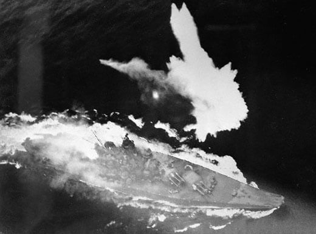

<WojnaNaPacyfiku />

### Droga Birmańska

Wojna na Pacyfiku toczyła się na wielu frontach, jeden z najważniejszych był w Chinach. W wojnie japońsko-chińskiej brali udział Brytyjczycy wspierając stronę chińską. Żeby móc zaopatrywać wojska Kuomintangu w latach 1937-38 zbudowali Drogę Birmańską - ciągnącą się przez 1150 km trasę przez północą Birmę i prowincje Junnan. W budowie wzięło udział 200 tys. robotników.

Droga biegła przez trudny teren, ale miała fundamentalne znaczenie dla przebiegu wojny, bo była jedyną dostępną aliantom komunikacją z Chinami. Droga lotnicza ze względu na wysokość Himalajów była bardzo ryzykowna i nie nadawała się do normalnego transportu.

W 1942 Birma została zajęta przez wojska japońskie, które zablokowały drogę. Jedyną możliwością dotarcia do Chin było przeskoczenie przez Garb (ang. the Hump) wschodnią część masywu Himalajów. Silne turbulencje, wiatr którego prędkość dochodziła do 32 km/h. Od grudnia 1942 działał most powietrzny. Ogółem przerzucono w ten sposób 33 tys ludzi i 600 tys. ton ładunku przy stracie 600 samolotów. Zginęło 1300 ludzi, kolejnych 340 zaginęło bez wieści. Była to jedyna metoda zaopatrzenia walczących w Chinach wojsk amerykańskich.

Jesienią 1944 udało się odbić część Birmy.

27 stycznia 1945 wreszcie odblokowano Drogę Birmańską, która łączy pozycje zajmowane przez wojska alianckie i chińskie.

### Bitwa o Manilę

Na tym etapie wojny na Pacyfiku, o tym jak udało się zdobyć Mariany i stamtąd bezpiecznie bombardować Japonię z B-29, pozostało już tylko skuteczną blokadą morską pozbawić ją zdolności do stawiania oporu, zagłodzić wojnę. Tu kluczowe było przecięcie szlaków handlowych w rejonie Tajwanu. Można było tego dokonać na dwa sposoby:

- Tak jak proponowała US Navy, dzięki panowaniu na morzu przeprowadzić intensywną operację morską polegającą na minowaniu szlaków i wysyłaniu okrętów podwodnych. Było to mało spektakularne, tanie i szybkie. Do tego pozostawiało Filipiny na marginesie wojny.
- Generał MacArthur, od 1942 głównodowodzący sił alianckich na obszarze południowo-zachodniego Pacyfiku miał inny pomysł. Filipiny tradycyjnie były największą proamerykańską bazą wpływów w tej części Azji. Kiedy musiał się stamtąd wycofać, obiecał, że wróci. I rzeczywiście zrobił z powrotu wielkie widowisko. Przekonał Roosevelta do długiej, krwawej i spektakularnej drogi lądowej. Filipiny nie zostaną pominięte, będą w całości zdobyte przez potężnego sojusznika. Prasa będzie miała co relacjonować. Nie bez znaczenia będzie też bezpośredni wpływ na politykę powojennych Filipin.

Głównodowodzący siłami japońskimi na Filipinach Tomoyuki Yamashita, nakazał opuścić stolicę.

31 stycznia Amerykanie wylądowali na największej wyspie Filipin Luzonie, na niej właśnie znajduje się Manila, stolica Filipin. 

Dowódca bazy morskiej w Manili kontradmirał Sanji Iwabuchi, nie zważając na rozkaz przełożonego, postanowił bronić się w mieście do ostatniego żołnierza.

2 lutego 1945 rozpoczyna się masakra w Manili (ang. Manila massacre aka Rape of Manila). Wojsko japońskie traktowało Filipińczyków jak podludzi, każdy pretekst stanowił powód do uznania za partyzanta i natychmiastowej egzekucji. Masowe mordy i taktyka spalonej ziemi miały być sposobem na utrzymanie pozycji.

Kiedy Amerykanie zetknęli się z wojskiem, które broni się za wszelką cenę, mając do wyboru, albo walczyć o każdy dom i tracić tysiące ludzi, czy po prostu zbombardować miasto i wziąć ruiny wybrali to drugie.

W ten sposób mieszkańcy stolicy Filipin znaleźli się między młotem a kowadłem. Bitwa potrwa cały miesiąc, a jej skutkiem będzie śmierć 100 tys. cywilów i zniszczenie całych dzielnic miasta. Zginie też 17 tys. żołnierzy japońskich i 1010 amerykańskich.

- [Mark Felton Productions "Asian Stalingrad - The Battle of Manila 1945" [YT 22:14]](https://www.youtube.com/watch?v=ZBZjTbotmg0)

### Bitwa o Corregidor

Jest to maleńka, górzysta wysepka blokująca wyjście z zatoki manilskiej. 14 km2 - 5% obecnej powierzchni Wrocławia; dla porównania tzw. Wielka Wyspa wrocławska to 9 km2.

Bitwa zaczęła się od skutecznego zbombardowania stanowisk plot. Atak rozpoczęło niebywale śmiałe lądowanie spadochroniarzy na płaskim szczycie dominującej góry. Po opanowaniu tej pozycji nastąpił desant z morza.

Bitwa trwała 10 dni. Z pięciu tysięcy Japończyków 20 żołnierzy dostanie się do niewoli. Dwudziestu. Reszta zginie. Amerykanów było tylko dwa tysiące, zginęło ich 235. Daje to wyobrażenie o przewadze sile ognia i skuteczności ataku spadochroniarzy.

Ale z drugiej strony była to bitwa, która dała Amerykanom wyobrażenie jak może wyglądać wojna o Japonię. A przecież Corregidor to Filipiny, a nie Japonia. Japonię będą mieli na Okinawie.

Corregidor był miejscem o symbolicznym znaczeniu. To na tej skalistej wysepce blokującej Zatokę Manilską został ulokowany sztab MacArthura zaraz po ataku na Pearl Harbor.

Mniej znana, ale nie mniej ważna rzecz rozegrała się w zupełnym cieniu, dosłownie i w przenośni. W 1942 po ewakuacji z Szanghaju najpierw w Naval Base Cavite, a potem na wyspie Corregidor w podziemnych korytarzach stacjonowała tajna jednostka kryptoanalityczna CAST, pod dowództwem komandora Rudolpha J. Fabiana. Badali japońską łączność z nasłuchu 2 Batalionu Służby Sygnałowej Sił Lądowych. Nazwa jednostki wzięła się od nazwy kodowej wyspy - "C". Z powodu zagrożenia w dwóch turach do marca 1942 całą jednostkę ewakuowano okrętami podwodnymi do Australii.

- [Mark Felton Productions "Daring American Parachute Assault 1945" [YT 14:03]](https://www.youtube.com/watch?v=jwTA-i4EYsY)

### Bitwa o Iwo Jimę

#### Miejsce

Iwo Jima mająca powierzchnię 22 km2 jest częścią Wysp Kazan, archipelagu wysp wulkanicznych należącego do Japonii. Została skolonizowana dopiero w XIX wieku. Choć do Tokio jest stąd 1200 km bezmiaru Pacyfiku, oficjalnie jest to japońska ziemia, więc jest to pierwsze terytorium japońskie, o które walczą Amerykanie.

Dla porównania: wrocławska była dzielnica Śródmieście 16 km2, wrocławska Wielka Wyspa 9 km2, Corregidor 14 km2.

<SeeAlso txt="Bitwa o Iwo Jimę" url="/festung-breslau/article/pacyfik-iwo-jima" />

#### Bitwa

Bitwa zaczyna się 19 lutego 1945 i zajmie (oficjalnie) 36 dni, aż do 26 marca. Zginie 4 tys. amerykańskich żołnierzy (ze 110 tys.) i ponad 20 tys. japońskich (z 21 tys.). Tak, 20 ponad tysięcy z 21 tysięcy. Do niewoli dostało się 216 Japończyków, a 20 073 zginęło w walce bądź popełniło samobójstwo. Oficjalne straty amerykańskie to 4197 zabitych, 19 tys. rannych (w wyniku ran zmarło 1401), 494 zaginionych.

Jest to jedna z kilku najważniejszych bitew w historii USA. 22 Marines i 5 marynarzy otrzymało najwyższe odznaczenie wojskowe Medal of Honor. W żadnej pojedynczej bitwie nie przyznano tylu.

#### Raising the Flag on Iwo Jima

Żeby zapewnić łączność obserwatorom na szczycie góry, trzeba było dociągnąć kabel telefoniczny, Wysłani na tę misję żołnierzami otrzymali flagę o rozmiarach 145x142 cm. W tym czasie na szczyt zmierzało trzech innych fotoreporterów Marines, wśród nich był Joe Rosenthal. Spotkali schodzącego w dół Lowery'ego i dowiedzieli się od niego, że flaga już została zawieszona. Żaden z nich nie wiedział o drugiej fladze. Chcieli już zejść, ale Lowery przekonał ich, że warto wejść na górę dla samych widoków. Dopiero na szczycie Rosenthal zobaczył, że żołnierze przygotowują się do powieszenia większej flagi, jako masztu użyli japońskiej rury wodociągowej. Zdjęcie wykonał w ostatniej chwili, nie mając nawet czasu, żeby spojrzeć przez wizjer. Przypadkiem uchwycił ikoniczną scenę, której kompozycji i Rembrandt by się nie powstydził. Jest to jedna z kilku najbardziej znanych scen całego XX wieku.

Dwa dni później 25 lutego ukazała się na pierwszej stronie New York Timesa, jako - "Raising the Flag on Iwo Jima". Historia zawieszenia flagi i późniejsze dzieje tego wydarzenia są opisane w "Flagach naszych ojców" filmie ze znanej dylogii Clinta Eastwooda.

Jeszcze w tym samym roku za tę fotografię otrzymał nagrodę Pulitzera. Stało się ono nie tylko rozpoznawalnym symbolem wojny na Pacyfiku, jest również wzorem dla Pomnika Korpusu Piechoty Morskiej (ang. Marine Corps War Memorial) w pobliżu Narodowego Cmentarza w Arlington. Zostało uznane za najczęściej reprodukowane zdjęcie w dziejach i stało się jedną z ikon amerykańskiego zaangażowania w II wojnę światową.

#### Filmy

Miała tak ogromne znaczenie medialne, że już w 1945 armia nakręciła kolorowy dokument "To the Shores of Iwo Jima".

W 1949 powstał film "Sands of Iwo Jima" z Johnem Waynem w roli głównej.

W zupełnie innej stylistyce utrzymany jest "The Outsider" z 1961, w którym Tony Curtiss wciela się w postać Iry Hayesa, Indianina, jednego z żołnierzy, którzy zatknęli flagę. Ira nie mógł znieść fetowania go jako bohatera i nie uzyskał rzeczywistej pomocy, popadł w alkoholizm i stał się tragicznym symbolem powojennych ofiar wojny.

Nam jest najbardziej znana z dylogii Clinta Eastwooda "Letters from Iwo Jima" i "Flags of Our Fathers".

- Yarnhub ["Iwo Jima, Stein and His Homemade Machinegun" [YT 5:09]](https://www.youtube.com/watch?v=feZ0tyeqUJU)

### Operation Starvation

27 marca 1945 rozpoczęła się Operation Starvation - zaminowanie z powietrza japońskich szlaków wodnych. B-29 zrzucały na spadochronach niekontaktowe miny morskie, blokując japońskie porty. Okazało się to bardzo skuteczne, w ostatnim półroczu wojny w tonażu zadano Japończykom większe straty niż przy użyciu wszystkich stosowanych metod łącznie. Musieli zrezygnować z 35 na 47 szlaków konwojowych. Port Kobe zmniejszył transport o 80%. Łącznie zatopiono 670 statków o tonażu ponad 1250 tys. ton. Twentieth Air Force wykonała 1,5 tys. lotów i zrzuciła 12 tys. min.

Ponadto było to niebywale tanie, nie angażowało wielkich sił i nie przynosiło strat własnych. Zarówno w ocenie japońskiej, jak i amerykańskiej, gdyby rozpocząć tę operację wcześniej byłaby szansa na zagłodzenie wojny. Ale ponieważ rozpoczęto ją w końcu marca 1945, wpływ był ograniczony. Zresztą na tym etapie Japonia nie prowadziła już wojny morskiej.

### Atol Ulithi

Na wyspach Karolinach jest atol Ulithi, znajduje się mniej więcej w połowie drogi pomiędzy Australią a Japonią. Podczas wojny Japonczycy umieścili tam stację pogodową i niewielką jednostkę wojskową. We wrześniu 1944 praktycznie bez walki została zdobyta przez Amerykanów. Statek badawczy USS Sumner przeprowadził rekonesans i okazało się, że jest to doskonałe miejsce na tymczasową bazę morską, nie ma zaplecza remontowego, ale jest tam dość miejsca nawet na 700 statków, czyli więcej niż Pearl Harbor. Na czas wojny krajowcy zostali przeniesieni w inne, bezpieczne miejsce i cały atol został zajęty przez US Navy.

Podczas końcowej fazy wojny na Pacyfiku była to największa baza morska, stanowiąca zaplecze operacji od czasu bitwy w Zatoce Leyte po bitwę na Okinawie.

20 listopada bazę zaatakowały torpedy załogowe Kaiten wystrzelone z dwóch okrętów podwodnych. Zatopiły tankowiec USS Mississinewa.

Kolejny atak w styczniu 1945 został zakończony zatopieniem japońskiego okrętu podwodnego I-48 z 122 ludźmi na pokładzie.

11 marca 1945 z południowej Japonii wystartowały samoloty kamikaze w misji Tan No. 2. Jej celem było zniszczenie floty zacumowanej na kotwicowisku przy atolu. 24 dwusilnikowe Yokosuka P1Y i 6 łodzi latających.

Do celu dotarły tylko dwa bombowce. Ich atak był zupełnym zaskoczeniem. Jeden z nich trafił w lotniskowiec klasy Essex USS Randolph, który pomimo zaciemnienia miał oświetlony pokład, powodując niewielkie zniszczenia i zabijając 26 marynarzy. Japończycy stracili 60 lotników zabitych i 13 samolotów.

13 marca 1945 było tam 647 statków, a do czasu ataku na Okinawę ich liczba wzrosła do 722.

Pod koniec czerwca podwodny lotniskowiec I-400 wycofał się z misji na Kanał Panamski, żeby zaatakować atol Ulithi, ale zanim dopłynął, armia japońska skapitulowała. Japończycy zbudowali trzy takie okręty, każdy z nich przewoził trzy wodnosamoloty Aichi M6A1 Seiran. Były to największe okręty podwodne o napędzie konwencjonalnym, jakie dotąd zbudowano. Miały długość 122 m.

Historia tej bazy morskiej jest mało znana, bo w ogóle jej istnienie było tajemnicą wojskową, dlatego nie zaistniała w mediach. A kiedy została odtajniona, media zajmowały się już innymi sprawami. Ale przez siedem miesięcy wielka laguna w atolu Ulithi była największą bazą morską na świecie.

### Fast Carrier Task Force atak na Kure i Kobe 18-19 marca 1945

Port w Kure (Honsiu) był jedną z największych japońskich baz morskich. Pod koniec wojny znajdowały się tam resztki Połączonej Floty. Do niedawna cumował tam Yamato.

Główną siłą uderzeniową US Navy na Pacyfiku była Fast Carrier Task Force (pl. szybka grupa uderzeniowa lotniskowców). Były to cztery niezależne grupy uderzeniowe mające w sumie 15 lotniskowców, każda składała się z trzech lub czterech lotniskowców i kilku okrętów osłony. Amerykanie odwrócili dotychczasowy sposób walki: ataku dokonywały samoloty, które miały większy zasięg i większą precyzję niż dotychczas stosowany ogień artylerii głównej okrętów liniowych. Natomiast dotychczasowy rdzeń floty, czyli pancerniki i niszczyciele służyły jako osłona plot dla lotniskowców.

W składzie 5 Floty admirała Spruance’a nosiła nazwę Task Force 58, kiedy przeszła w skład 3 Floty admirała Halseya, przemianowano ją na Task Force 38.

Jako Task Force 58 opuścili bazę w atolu Ulithi 14 marca. Zadaniem tej misji była likwidacja lotnisk i infrastruktury lotniczej na wyspach Kiusiu i Honsiu przed planowaną na 1 kwietnia inwazją Okinawy.

18 marca samoloty TF 58 zaatakowały 45 lotnisk na Kiusiu, ale te w większości były już opuszczone. Japońskie lotnictwo i marynarka przypuściły desperacki atak na amerykańskie lotniskowce. Efektem były niewielkie uszkodzenia na USS Enterprise i USS Intrepid. Poważniej został uszkodzony USS Yorktown, bomba zabiła 5 i raniła 16 marynarzy, zniszczono 110 japońskich samolotów.

Sukcesem tego dnia był zwiad lotniczy, który ustalił skład floty w portach Kure i Kobe. W Kure był Yamato, Haruna i trzy lekkie lotniskowce.

19 marca trzy grupy miały zaatakować Kure, a jedna Kobe.

Lotniskowiec USS Franklin został trafiony dwoma bombami i na okręcie rozpętał się pożar, który objął samoloty, w wyniku eksplozji i pożarów zginęło 724 marynarzy, a 265 zostało rannych. W walce powietrznej Amerykanie stracili 14 samolotów a Japończycy 25.

Ponad 300 samolotów (czyli więcej niż zaatakowało Pearl Harbor) skierowano na port Kure, gdzie celem była japońska flota. Efektem były jedynie niewielkie zniszczenia, żaden okręt nie został zatopiony, poważnie uszkodzony lotniskowiec osłony Kaiyō i lekki krązownik Ōyodo. W wyniku silnej obrony plot stracono 13 samolotów.

Ogółem rezultaty ataku były niezadowalające. USS Franklin był tak uszkodzony, że już do końca wojny nie wziął udziału w żadnej operacji. Jeszcze tego samego dnia TF 58 zaczęła się wycofywać na południe, walki trwały do 21 marca.

Kolejną operacją TF 58 był atak na Yokosuka 18 czerwca i ponownie na Kure 24-28 czerwca wspólnie z British Pacific Fleet. Tym razem zarówno skutki ataku, jak i straty własne były poważne.

- [Attack on Kure (March 1945)](https://en.wikipedia.org/wiki/Attack_on_Kure_(March_1945))

### Bitwa o Okinawę

1 kwietnia 1945 Amerykanie wysadzają desant na Okinawie, ojczyźnie karate. Kiedy popatrzymy na mapę dna morskiego, to widzimy, że w kierunku południowym od Wysp Japońskich wychodzą dwa grzbiety:

- pierwszy prosto na południe i jego częścią są właśnie izolowane Wyspy Wulkaniczne z Iwo Jimą i dużo dalej Mariany.
- drugi zakręca w kierunku kontynentu azjatyckiego i składa się ciągu wysp łączących Japonię z Tajwanem, jest to Riukiu (archipelag Nansei). To własne tam, w połowie drogi pomiędzy Tajwanem a Kiusiu znajduje się Okinawa.

Corregidor ma 5,5 km2, Iwo Jima 21 km2, Okinawa 1200 km2.

Wielkość i położenie Okinawy powodowały, że jej historia to balansowanie pomiędzy Chinami a Japonią z dużą dozą niezależności. Od średniowiecza do XVI wieku trwał okres dominacji wpływów chińskich. Od inwazji japońskiej w 1609 trwa okres "podwójnej zależności". W tamtym okresie dla Japończyków Okinawa to był obcy, izolowany ląd, coś w rodzaju bliskiej, zamorskiej kolonii. Taka zresztą była geneza karate, otóż Japończycy ze względu na niebezpieczeństwo wybuchu buntu zabronili mieszkańcom wyspy posiadania broni, i tak narodziła się sztuka walki wręcz Karate (jap. pusta ręka), używająca czasem broni niewojskowej, np. tonfa to po prostu sadzak do ryżu, nunczaku to cep.

O przyłączeniu Okinawy do Japonii zaczęto myśleć dopiero w okresie Meiji i nastąpiło to w latach 70. XIX wieku. Czyli w 1945 żyli jeszcze wciąż "najstarsi górale", którzy pamiętali okres względnej niezależności, ale gospodarka i społeczeństwo Okinawy było już trwale zintegrowane z Japonią.

- [Operation Kikusui](https://en.wikipedia.org/wiki/Operation_Kikusui)
- [Bitwa o Okinawę](http://www.sww.w.szu.pl/index.php?id=bitwa_okinawa)
- Linfamy ["Why Were These Japanese Schoolboys Forced to Blow Themselves Up in WW2? (Tekketsu Kinnotai)" [YT 14:31]](https://www.youtube.com/watch?v=o5Q3QScInWc) | ["The Japanese High School Girls Forced to be Battlefield Nurses in WW2 (Himeyuri)" [YT 13:39]](https://www.youtube.com/watch?v=7qca1MjRsmA)
- Dark Docs ["The Soldier Who Refused to Fight Back" [YT 10:45]](https://www.youtube.com/watch?v=e9wT1Z1mwrw)

### Yamato

Jak to ktoś ujął, wojna morska jest wojną produkcji okrętów. Wygra ten, kto wyprodukuje ich więcej. Japonia nie miała szans w tym wyścigu.

W 1941 Japończycy rzucili wyzwanie USA, mając wg swojej własnej oceny niewielkie szanse na zwycięstwo. Postanowili amerykańskiej przewadze zdefiniowanej w kategoriach ilości przeciwstawić japońską jakość. Nie mieli szans pokonać USA w tonażu czy generalnej sile ognia. To mała liczba o wiele lepszych japońskich okrętów miała pokonać w jednym lub dwóch decydujących starciach główną siłę uderzeniową wroga - amerykańskie lotniskowce. Potężne okręty takie jak Yamato czy jego bliźniak Musashi miały być odpowiedzią na przewagę USA w każdej innej dziedzinie. Liczono na to, że będą przeciwwagą dla siły ognia floty amerykańskiej, której wielkość okrętów ograniczał rozmiar kanału panamskiego. Dawid jednym celnym uderzeniem miał pobić Goliata.

Taka była idea stojąca za powstaniem Yamato i Musashi. Tak się jednak złożyło, że Yamato tylko raz miał okazję użyć głównej artylerii, podczas nieudanej próby obrony Filipin.

W końcu wysłano go w misji samobójczej do obrony Okinawy, miał paliwa tylko w jedną stronę. Jego celem było tzw. sztrandowanie, czyli wylądowanie na płyciźnie przybrzeżnej i pozostanie tam już na stałe jako bateria artylerii. Miał pełne zapasy amunicji.

7 kwietnia po trwającym ponad dwie godziny atakach prawie 400 samolotów amerykańskich w trzech falach, trafieniu przynajmniej 11 torpedami eksplodował jeden z magazynów amunicji. Grzyb wybuchu miał wysokość 6 km i był widoczny na odległej o 160 km Kyusiu. Z 2332 członków załogi udało się uratować tylko 277 ludzi.

Sam okręt jest tajemnicą dla miłośników marynistyki, bo po zatopieniu obu należących do tej rodziny pancerników tajna policja japońska Kempeitai dostała rozkaz zniszczenia całej dokumentacji łącznie ze zdjęciami i zadanie to wykonała dokładnie, więc wszystko, co wiemy, wynika z analizy zdjęć sporządzonych przez marynarkę wojenną USA.

Yamato był okrętem flagowym Połączonej Floty, czy morskiego składnika floty cesarskiej.

Dlaczego nie został przeznaczony do obrony kraju, a zamiast tego wysłany w bezsensownej, samobójczej misji? Odpowiedź na to pytanie pozwala zrozumieć sposób myślenia japońskiej kadry oficerskiej żyjącej w oparach kodeksu bushido. Obowiązkiem samuraja, a wszyscy oficerowie uważali się za samurajów, było zwycięstwo lub śmierć z honorem.

W 1944 już nie dało się ukrywać, że cały ciężar wojny prowadzonej przez cesarską armię ponoszą siły lądowe. Marynarka cesarska od samego początku nie zaliczyła żadnego istotnego zwycięstwa. Nawet Pearl Harbor, jeżeli realistycznie ocenić skutki było klęską. Amerykanie doświadczyli spektakularnego upokorzenia, ale US Navy nie została osłabiona. Lotniskowce nieruszone, suchy dok sprawny, zapasy paliwa kompletne. Bitwa o Midway w czerwcu 1942 jest punktem zwrotnym wojny na Pacyfiku i wielką klęską wielkiej cesarskiej floty. W 1945 nie było już żadnych szans na zwycięstwo a okręt flagowy Połączonej Floty, wielki, największy Yamato, cały lśniący i nietknięty nie był żadną dumą, lecz wręcz przeciwnie, był hańbą całej armii. Na Midway wszystkie japońskie pancerniki się spóźniły. Brał udział w dwóch bitwach w 1944, najpierw w bitwie na Morzu Filipińskim w czerwcu i potem w październiku w bitwie morskiej w Zatoce Leyte. W żadnej z nich nie odegrał żadnej roli. W drugiej oddał kilka niecelnych strzałów do niszczycieli przeciwnika i dostał dwa niegroźne trafienia torpedami. Jego bliźniak Musashi zatonął.

Już wcześniej z powodu ciągłego bazowania okrętu mówiono o "Hotelu Yamato", teraz jednak miał opinię "pływającego hotelu dla bezczynnych, nieudolnych admirałów". W każdej normalnej marynarce byłby jeszcze jakąś nadzieją, ale to była marynarka japońska i jedynym być może mającym element racjonalności składnikiem decyzji było poświęcenie okrętu na zadanie śmiertelnego ciosu, póki jeszcze można go zadać. Było bowiem oczywiste, że Amerykanie polują na Yamamoto, który w starciu z samolotami US Navy będzie bezradny. Jego port macierzysty w Kure był obiektem ataku w ramach Operation Starvation minowania z powietrza szlaków zaopatrzeniowych. Na minach zrzuconych przez amerykańskie samoloty wyleciał w powietrze jeden z niszczycieli wychodzący z tego portu.

Od 3 maja 1944 dowódcą naczelnym Połączonej Floty był admirał Soemu Toyoda. To jego decyzją były te dwie wielkie i przegrane bitwy floty japońskiej w 1944: na Morzu Filipińskim i w Zatoce Leyte. Obie były ryzykiem podjętym w obliczu kończących się zasobów, od których zależało funkcjonowanie floty. Flota więc była przydatna, tylko jeżeli zakończyłyby się zwycięstwem. Jeżeli by do nich nie doszło albo gdyby były przegrane, była bezużyteczna. Obie były klęską, a Yamato całkowicie sprawny i bez ofiar na pokładzie każdą chwilą istnienia przynosił wstyd.

To dlatego 4 kwietnia admirał Toyoda wydał rozkaz operacji Ten-gō (jap. Niebo) - rzucenia wszystkiego, co Marynarka jeszcze ma w samobójczym wysiłku na Okinawę. Przede wszystkim był to Yamato, oprócz niego lekki krążownik Yahagi i 6 niszczycieli. Jak to ujął dowódca wysłanej grupy okrętów wiceadmirał Seiichi Itō "*Sądzę, że otrzymaliśmy stosowną okazję, by umrzeć. Samuraj żyje tak, że zawsze jest przygotowany na śmierć*". Zginął na Yamato. Wypowiedź ta obrazuje jego stan umysłu w sytuacji, z której nie dano mu wyjścia. Był racjonalnym człowiekiem i uważał wysłanie okrętów na Okinawę za bezsensowne marnowanie sił. Zmienił swoje nastawienie, kiedy z dworu cesarskiego nadeszła wieść, że cesarz oczekuje jakiegoś działania Marynarki.

Możliwe, że zadaniem tej grupy bojowej było odciągnięcie uwagi Amerykanów od przerzucenia na Okinawę wszystkich posiadanych sił kamikaze, ale czynnikiem przesądzającym o losie wielkiego pancernika była wola cesarza i specyficzne rozumienie honoru przez kadrę oficerską.

- Military History not Visualized ["Yamato: Why not saved to defend Japan?" [YT 13:45]](https://www.youtube.com/watch?v=5osfQil1fn0)
- The Front ["Why the Japanese Navy and Army HATED Each other" [YT 12:35]](https://www.youtube.com/watch?v=N1L9J6D-ggE)
- Megaprojects ["Yamato Class: The Heaviest Battleships Ever Constructed" [YT 17:59]](https://www.youtube.com/watch?v=hS4uoPz_A00)
- [Imperial Japanese Navy Page](http://www.combinedfleet.com/kaigun.htm)

*Yamato tonie. 
Domena publiczna, [Link](https://commons.wikimedia.org/w/index.php?curid=44651)*

### USS Indianapolis (CA-35)

Amerykański ciężki krążownik typu Portland, biorący udział w inwazji na Okinawę 31 marca 1945 wczesnym rankiem zaatakowany przez pojedynczego kamikaze w samolocie Nakajima Ki-43. Samolot przedarł się przez obronę plot, ale został zestrzelony nad okrętem i rozbił się w wodzie za nim. Niestety, chwilę przed zestrzeleniem pilot zwolnił bombę, która przebiła okręt i eksplodowała w wodzie pod nim. Zginęło 9 marynarzy.

Zniszczenia oceniono na poważne i wymagające naprawy w Mare Island Naval Shipyard (40 km od San Francisco). Ta bomba przesądziła o losie okrętu. Do lipca remont został zakończony. Marynarze mieli nadzieję na spokojny przebieg reszty służby i rychły koniec wojny. W tzw. międzyczasie (spoiler warning) hitlerowskie Niemcy upadły i skapitulowały, bitwa o Okinawę dobiegła końca.

16 lipca opuszcza Hunters Point Naval Shipyard (również San Francisco) w ściśle tajnej misji i łamiąc rekordy prędkości, samotnie, całkowicie bez osłony dociera do Pearl Harbor 19 lipca, po krótkiej przerwie rusza dalej w tym samym stylu do Tinian (Mariany) gdzie dociera 26 lipca i tam oddaje swój cenny, ściśle tajny ładunek.

Misja najwyższej wagi zakończona sukcesem i tragedią. Okręt odesłano na Guam, gdzie nastąpił odpoczynek i wymiana załogi. Potem dalszy ciąg udziału w wojnie: USS Indianapolis został przydzielony do Task Force 95 i płynął na Filipiny.

30 lipca o godz. 0015 w prawą burtę okrętu trafiły dwie torpedy Type 95 japońskiego okrętu podwodnego I-58. Z 1195 członków załogi w wyniku wybuchów i pożarów zginęło 300 ludzi, reszcie udało się uciec. Był to ogromny sukces, biorąc pod uwagę, że wielki okręt tonął zaledwie 12 minut. Z tego powodu nie wszyscy mieli kamizelki ratunkowe i nie było łodzi. Prawie 900 ludzi pływało w morzu, oczekując rychłego ratunku. Jednak znajdowali się na środku bezmiernej otchłani Pacyfiku 1000 km od Filipin i tyleż samo od Marianów. Ich okręt nie wiedzieć czemu, choć już wykonał supertajną misję, nadal miał takie oznaczenie i tak samo nie miał osłony. Nikt o nich nie wiedział! Informacja ta szybko się rozeszła i spowodowała panikę. Tym większą, że zaczęły ich atakować rekiny, był to ich rejon żerowania. Minął cały dzień i cała noc, kolejny dzień i kolejna noc, co jakiś czas było słychać krzyki pożeranych ludzi.

Dopiero po prawie czterech dniach koszmaru, po 82 godzinach od zatopienia, 2 sierpnia o godz. 1025 na niebie pojawił się dwusilnikowy PV-1 Ventura, który jak się później okazało, wcale ich nie szukał, to był zwykły lot patrolowy. Przybyła pomoc. Pierwszy okręt, który rzeczywiście mógł podjąć rozbitków, dopłynął dopiero w nocy. Uratowano tylko 316 ludzi. Ponad pół tysiąca marynarzy zmarło z wycieńczenia, odwodnienia lub zostało pożartych przez rekiny.

Epizod ten został utrwalony w przynajmniej trzech filmach fabularnych:

- najsłynniejszy to "Szczęki" z 1974 w reżyserii Stevena Spielberga, gdzie historia ta jest opowiedziana
- "Mission of the Shark: The Saga of the U.S.S. Indianapoli" z 1991
- "USS Indianapolis: Men of Courage" z 2016

No dobrze: a jaka to była ta ściśle tajna akcja, którą krążownik wykonywał? Co było tym cennym ładunkiem dostarczonym w największej tajemnicy na Tnian?

Był to wzbogacony uran U-235, połowa takiego materiału na świecie, oraz inne materiały niezbędne do skonstruowania bomby atomowej. Na wyspie złożono z tego bombę uranową Little Boy, która cztery dni po uratowaniu rozbitków, 6 sierpnia 1945 o godz. 0815 została zrzucona na Hiroszimę.