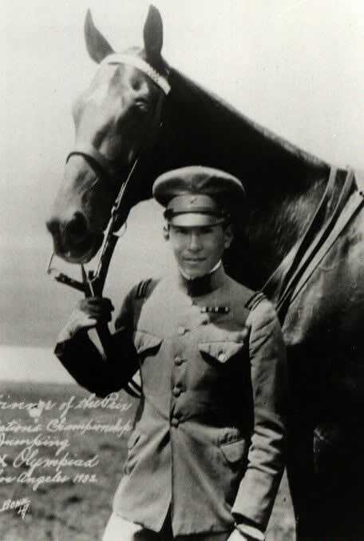

<WojnaNaPacyfiku />

### Miejsce

Iwo Jima mająca powierzchnię 22 km2 jest częścią Wysp Kazan, archipelagu wysp wulkanicznych należącego do Japonii. Została skolonizowana dopiero w XIX wieku. Choć do Tokio jest stąd 1200 km bezmiaru Pacyfiku, oficjalnie jest to japońska ziemia, więc jest to pierwsze terytorium japońskie, o które walczą Amerykanie.

Dla porównania: wrocławska była dzielnica Śródmieście 16 km2, wrocławska Wielka Wyspa 9 km2, Corregidor 14 km2

<!--
FBTODO
1/4 wszystkich ofiar śmiertelnych marines podczas WWII
czarny piasek
ogień zmasakrował zgromadzonych na plaży
rasizm, propaganda z obu stron
klimat sprzyjający zakażeniom infekcjom
atak szerokim frontem od góry po kamieniołom. Batalion atakujący kamieniołom 1 dnia z 900 ludzi ponad 700 zabitych i rannych.
Kuribayashi: Każdy żołnierz powinien myśleć o swojej pozycji ak o grobie. Walczyć do końca, jak najbardziej zaszkodzić przeciwnikowi.
ataki kamikaze, metamfetamina 6 tys ludzi rytuał bushido opaski samurajskie
saratoga, zatopiony lotniskowiec
w 4 dni marines traca 4,5 tys ludzi
podniesienie tej flagi zapewnilo byt marines na nastepne 500 lat
po 6 dniach ponad 1000 zabitych 3700 rannych, trudne do wyliczenia
maszynka do miesa 200m 500 zabitych
japonia mozdzierze trzonowe 320mm krew z uszu i nosa
atak na mozdzierze wychodnia siarki zapalal sie grunt i z dymu atakowali japonczycy 
japonskie granaty odbiezpieczane uderzeniem
mrfina fala ciepla bol odchodzi odpreza sie czlowiek
penicylina w tabletkach nowa
odcieci od wody i aminicji nadla walcza
bomby zapalajce z fosforem, miotacze ognia, trotyl
liczne samobojstwa, czasem symuluje kapitulacje by zdetonowac ukryte granaty
brutalne walki w nocy
pierwsza grupa na n brzegu po 8km, kompania c 278 ludzi 5 marca tylko 17, 
sulfonamid opaska
wschodni kaniec wyspy dolina smierci - usa stracila juz 11 tys ludzi opinia pbubliczna wstrzasnieta, morale narodu i oglosili zwyciestwo przed czasem
14 marca uznana za zabezpieczona, ale ciagle ostrzal 
American forces are paying heavily for the island - perhaps too heavily
porownywana z tarawa i saipan
bunkty kuribayashiego w dolinie smierci 10 dni walki, eszcz 1700 strat
odznaczenia - medal honoru z 27 przynanych z te bitwe 22 przypadaja marines
kilka miesiecy partyzanckiej walki
w 1968 usa zwraca japonii wyspe
marines 6 tys zabitych ponad 17 tys rannych
ponad 880 us nawy zabitych
od 18 do 20 tys japonczykow zabitych
ponad 2250 ladowan awaryjncyh b-29, i tak by dotarly
po 36 dniach uznana za zdobyta
 -->

### Bitwa

Bitwa zaczyna się 19 lutego 1945 i zajmie 36 dni, aż do 26 marca. Zginie 4 tys. amerykańskich żołnierzy (ze 110 tys.) i ponad 20 tys. japońskich (z 21 tys.). Tak, 20 ponad tysięcy z 21 tysięcy. Do niewoli dostało się 216 Japończyków, a 20 073 zginęło w walce bądź popełniło samobójstwo. Oficjalne straty amerykańskie to 4197 zabitych, 19 tys. rannych (w wyniku ran zmarło 1401), 494 zaginionych.

Wśród wielu ofiar pierwszego dnia walk było dwóch sierżantów Marines, dowódców sekcji karabinów maszynowych, których warto wspomnieć:

- **Darrell S. Cole** kiedy jego karabin maszynowy zaciął się, mając tylko pistolet i granat zniszczył stanowisko japońskiego karabinu maszynowego, tego dnia zniszczył ich w sumie pięć, używając granatów. Od jego nazwiska pochodzi nazwa niszczyciela rakietowego USS "Cole" (DDG-67) znanego z ataku terrorystycznego w Jemenie w 2000.
- **John Basilone** po samodzielnym zniszczeniu japońskiego schronu i wyprowadzeniu czołgu z pola minowego. Basilone był jednym z głównych bohaterów serialu "Pacyfik" z 2010.

Pod koniec bitwy najprawdopodobniej 22 marca gnie pułkownik Takeichi Nishi, arystokrata i sportowiec. W 1932 zdobył złoty medal w jeździectwie (skoki przez przeszkody) na Igrzyskach Olimpijskich w Los Angeles. Był znany i popularny w USA. Nawoływano go megafonami, proponując poddanie się do niewoli.

*Baron Takeichi Nishi i jego koń Uranus. 
By [http://www.iwo-jima.org/sensi/index.html](http://www.iwo-jima.org/sensi/index.html), Domena publiczna, [Link](https://commons.wikimedia.org/w/index.php?curid=1588725)*

Dowódcą obrony był generał Tadamichi Kuribayashi, który na wyspie wylądował 19 czerwca 1944. Jeszcze trwała batalia o Mariany. Już na wyspie dowiedział się o klęsce i od razu zrozumiał, że nie otrzyma żadnej pomocy. Nakazał ufortyfikowanie wyspy. Wiedział, że ze względu na przewagę siły ognia nie mają szans na wytrwanie w klasycznej, podręcznikowej walce. Nakazał ukrycie wszystkich punktów ogniowych pod ziemią. Iwo Jima stała się podziemną i skalistą fortecą. W tym celu wykorzystano również dominującą nad wyspą górę Suribachi, w wulkanicznych skałach powstała rozgałęziona sieć tuneli. Już po bitwie Amerykanie odkryli ich 18 km.

System ogniowy był starannie przemyślany, całą wyspę zamieniono w śmiercionośną pułapkę. 360 armat powyżej 75 mm, 300 dział plot i ponad 2 tys. karabinów maszynowych. Dwa lotniska.

Do 16 lutego 1945 Iwo Jima była bombardowana i atakowana z powietrza przez 60 dni. Przez ostatnie dwa dni przeprowadzono wzmożone bombardowanie. Planowano początkowo 9 dni, ale według oceny dowództwa miało to wystarczyć. Dowódca sił na Pacyfiku admirał Chester W. Nimitz powiedział, że będzie to "czterodniowy spacer Marines".

Pierwszego dnia desantowano na wyspę 30 tysięcy żołnierzy, ciężki sprzęt utknął, ale pierwsze minuty nie zapowiadały jatki, jaka miała się rozpętać. Nagle wszystkie ukryte stanowiska ogniowe pierwszej linii ekslodowały morderczym ogniem. Straty w pierwszym dniu były większe niż w Normandii,

Dzień później, 20 lutego, amerykańska piechota morska zajęła jedno z lotnisk.

21 lutego Amerykanie stracili lotniskowiec Saratoga zaatakowany przez 20 samolotów kamikaze.

Jest to jedna z kilku najważniejszych bitew w historii USA. 22 Marines i 5 marynarzy otrzymało najwyższe odznaczenie wojskowe Medal of Honor. W żadnej pojedynczej bitwie nie przyznano tylu.

### Raising the Flag on Iwo Jima

Stożek wulkaniczny Suribachi to nie tylko najwyższa góra tej wyspy, to tak naprawdę jedyna góra która tam się znajduje, ogromna wysokość względna sprawia, że dominuje nad okolicą i w oczywisty sposób jest głównym celem ataku. Jej nazwa oznacza moździerz kuchenny.

23 lutego rano, piątego dnia bitwy, Amerykanom udało się opanować powierzchnię Suribachi, wysłali dwa patrole na szczyt i po tym, jak nie napotykając na opór, dotarły na szczyt i powróciły, wysłali tam pluton żołnierzy z flagą. Zdjęcie tej flagi wykonał sierżant sztabowy Louis R. Lowery pracujący dla pisma Leatherneck. Była to niewielka flaga 140x70 cm, zbyt mała, żeby można było ją dostrzec z oddali.

Żeby zapewnić łączność obserwatorom na szczycie góry, trzeba było dociągnąć kabel telefoniczny, Wysłani na tę misję żołnierzami otrzymali znacznie większą flagę o rozmiarach 145x142 cm. W tym czasie na szczyt zmierzało trzech innych fotoreporterów Marines, wśród nich był Joe Rosenthal. Spotkali schodzącego w dół Lowery'ego i dowiedzieli się od niego, że flaga już została zawieszona. Żaden z nich nie wiedział o drugiej fladze. Chcieli już zejść, ale Lowery przekonał ich, że warto wejść na górę dla samych widoków. Dopiero na szczycie Rosenthal zobaczył, że żołnierze przygotowują się do powieszenia większej flagi, jako masztu użyli japońskiej rury wodociągowej. Zdjęcie wykonał w ostatniej chwili, nie mając nawet czasu, żeby spojrzeć przez wizjer. Przypadkiem uchwycił ikoniczną scenę, której kompozycji i Rembrandt by się nie powstydził. Jest to jedna z kilku najbardziej znanych scen całego XX wieku.

Dwa dni później 25 lutego ukazała się na pierwszej stronie New York Timesa, jako - "Raising the Flag on Iwo Jima". Historia zawieszenia flagi i późniejsze dzieje tego wydarzenia są opisane w "Flagach naszych ojców" filmie ze znanej dylogii Clinta Eastwooda.

Jeszcze w tym samym roku za tę fotografię otrzymał nagrodę Pulitzera. Stało się ono nie tylko rozpoznawalnym symbolem wojny na Pacyfiku, jest również wzorem dla Pomnika Korpusu Piechoty Morskiej (ang. Marine Corps War Memorial) w pobliżu Narodowego Cmentarza w Arlington. Zostało uznane za najczęściej reprodukowane zdjęcie w dziejach i stało się jedną z ikon amerykańskiego zaangażowania w II wojnę światową.

O tym, że wciąż jest to żywy symbol, świadczy wykorzystanie tej sceny przez Davida Cernego w rzeźbie przedstawiającej Polskę, wykonanej w ramach projektu Entropa zamówionego w 2009 przez rząd czeski z okazji objęcia prezydencji EU przez Czechy. W wizji Černego na czymś w rodzaju tortu na planie Polski księża wbijają tęczową flagę LGBT.

### Koniec bitwy

Amerykanie nie wdają się w walki w tunelach, wszystkie napotkanie cele niszczą granatami i miotaczami płomieni. Zasadnicza część walk kończy się 16 marca. Ale garnizon nie kapituluje. Celem walki nie jest obrona wyspy, ale przedłużanie starcia i wykrwawianie przeciwnika. Nieustanne angażowanie sił. Kuribayachi, który z tego powodu zakazywał ataków banzai, nie widząc już dalszej możliwości walki, w nocy 25 marca osobiście przeprowadza taki atak, stając na czele 300-osobowego oddziału. Zginęło 100 żołnierzy amerykańskich.

Bitwa oficjalnie kończy się 26 marca, ale data ta oznacza uznanie przez USMC, że nie ma już zorganizowanego oporu. Walki trwały jeszcze kilka miesięcy, już po 26 marca zginęło kilka tysięcy Japończyków. Ostatnich dwóch żołnierzy japońskich schwytano w 1949.

### Znaczenie

Pierwsze zwycięstwo Amerykanów w bitwie na japońskiej ziemi, pokonali japońską armię na wyspie Iwo Jima. Ale jakie realnie znaczenie miała ta wyspa i jej zdobycie? Iwo Jima znajduje się dokładnie w połowie drogi z mających strategiczne znaczenie Marianów, skąd startują amerykańskie B-29 bombardujące Japonię. Choć strategicznie położona nie odegrała wielkiej roli podczas wojny i sprawa tego, czy warto było ponosić takie ofiary, by zdobyć tę wyspę jest wciąż przedmiotem dyskusji, szczególnie ze względu na symboliczne znaczenie flagi na Suribachi. Podsumowując można zadać pytanie - czy warto było podnieść flagę na Suribachi?

- Japończycy mieli tam bazę myśliwców przechwytujących i radary wczesnego ostrzegania. Ale w ciągu trzech miesięcy poprzedzających inwazję te myśliwce zestrzeliły tylko 11 B-29, a likwidacja bazy radarowej nie oślepiła Japończyków, bo mieli drugą na wyspie Rota, która nigdy nie została zaatakowana.
- Już po zajęciu Iwo Jimy Amerykanie umieścili tam bazę myśliwców osłony, ale z powodu słabości japońskiej plot nie odegrały żadnej istotnej roli. Takich misji było tylko 10, zresztą Amerykanie szybko przestawili się z dziennych w miarę precyzyjnych bombardowań na nocne podpalenia, a z powodu słabej techniki radarowej i wysokości, z której operowały B-29 osłona myśliwska nie była im potrzebna.
- Iwo Jima stała się bazą dla międzylądowania i uzupełnienia paliwa dla bombowców. Ogółem B-29 wylądowały tam ok. 2200 razy, z czego 80% to było właśnie rutynowe tankowanie. Reszta to szkolenie, bo mała wyspa jest trudnym celem.
- Czasem jest podnoszona kwestia Iwo Jimy jako bazy ratunkowej dla powracających z misji samolotów. Bez wątpienia część lądowań miało charakter awaryjny i jest jakaś trudna do określenia liczba ludzi, którym zdobycie tej wyspy uratowało życie. Jednak po pierwsze, no właśnie - jest na tyle niewielka, że w ogóle jej nie znamy, po drugie Amerykanie mieli dobrze działający system ratowania załóg B-29 zmuszonych do lądowania w oceanie. Na tej ogromnej przestrzeni ratowali połowę ludzi.

40 lat po bitwie, 19 lutego 1985 zorganizowano pierwsze spotkanie weteranów obu stron. Odsłonięto dwujęzyczną tablicą pamiątkową z napisem głoszącym, że zebrani czczą pamięć wszystkich poległych.

### Filmy

Miała tak ogromne znaczenie medialne, że już w 1945 armia nakręciła kolorowy dokument "To the Shores of Iwo Jima".

W 1949 powstał film "Sands of Iwo Jima" z Johnem Waynem w roli głównej.

W zupełnie innej stylistyce utrzymany jest "The Outsider" z 1961, w którym Tony Curtiss wciela się w postać Iry Hayesa, Indianina, jednego z żołnierzy, którzy zatknęli flagę. Ira nie mógł znieść fetowania go jako bohatera i nie uzyskał rzeczywistej pomocy, popadł w alkoholizm i stał się tragicznym symbolem powojennych ofiar wojny.

Nam jest najbardziej znana z dylogii Clinta Eastwooda "Letters from Iwo Jima" i "Flags of Our Fathers".

### Odnośniki

- Yarnhub ["Iwo Jima, Stein and His Homemade Machinegun" [YT 5:09]](https://www.youtube.com/watch?v=feZ0tyeqUJU)