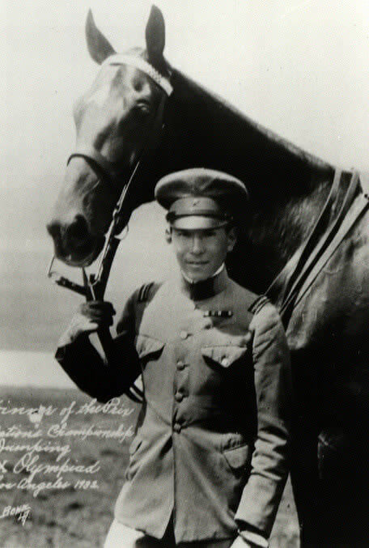

<WojnaNaPacyfiku />

### Wstęp

Bitwa o Iwo Jimę jest jedną z najbrutalniejszych i najkrwawszych tej wojny. Do dziś toczy się dyskusja czy ogromne straty nie wynikają z błędów podczas przygotowań i czy w ogóle była potrzebna.

<SeeAlso txt="Wojna na Pacyfiku 1945" url="/festung-breslau/article/pacyfik-1945" />

### Miejsce

Iwo Jima mająca powierzchnię 22 km2 jest częścią Wysp Kazan, archipelagu wysp wulkanicznych należącego do Japonii. Jest prawie zupełnie płaska, na jej południowym skraju wznosi się monumentalna bryła jedynej góry na tej wyspie - Suribachi.

Wyspa została skolonizowana dopiero w XIX wieku. Choć do Tokio jest stąd 1200 km bezmiaru Pacyfiku, oficjalnie jest to japońska ziemia, więc jest to pierwsze terytorium japońskie, o które walczą Amerykanie.

Dla porównania: wrocławska była dzielnica Śródmieście 16 km2, wrocławska Wielka Wyspa 9 km2, Corregidor 14 km2

### Bitwa

Bitwa zaczyna się 19 lutego 1945 i zajmie (oficjalnie) 36 dni, aż do 26 marca. Zginie 6 tys. amerykańskich żołnierzy (ze 110 tys.) i ponad 20 tys. japońskich (z 21 tys.). Tak, 20 ponad tysięcy z 21 tysięcy. Do niewoli dostało się 216 Japończyków, a 20 073 zginęło w walce bądź popełniło samobójstwo.

Dowódcą obrony był generał Tadamichi Kuribayashi, który na wyspie wylądował 19 czerwca 1944. Jeszcze trwała batalia o Mariany. Już na wyspie dowiedział się o klęsce i od razu zrozumiał, że nie otrzyma żadnej pomocy. Nakazał ufortyfikowanie wyspy. Wiedział, że ze względu na przewagę siły ognia nie mają szans na wytrwanie w klasycznej, podręcznikowej walce. Nakazał ukrycie wszystkich punktów ogniowych pod ziemią. Iwo Jima stała się podziemną i skalistą fortecą. W tym celu wykorzystano również dominującą nad wyspą górę Suribachi, w wulkanicznych skałach powstała rozgałęziona sieć tuneli. Już po bitwie Amerykanie odkryli ich 18 km.

Kuribayashi:
>Każdy żołnierz powinien myśleć o swojej pozycji jak o grobie. Walczyć do końca, jak najbardziej zaszkodzić przeciwnikowi.

System ogniowy był starannie przemyślany, całą wyspę zamieniono w śmiercionośną pułapkę. 360 armat powyżej 75 mm, 300 dział plot i ponad 2 tys. karabinów maszynowych. Dwa lotniska.

Do 16 lutego 1945 Iwo Jima była bombardowana i atakowana z powietrza przez 60 dni. Przez ostatnie dwa dni przeprowadzono wzmożone bombardowanie. Planowano początkowo 9 dni, ale według oceny dowództwa miało to wystarczyć. Dowódca sił na Pacyfiku admirał Chester W. Nimitz powiedział, że będzie to "*czterodniowy spacer Marines*".

Pierwszego dnia desantowano na wyspę 30 tysięcy żołnierzy, ciężki sprzęt utknął. Marines o 0900 bez przeszkód wylądowali na plaży z czarnym wulkanicznym piaskiem. Lądowanie nastąpiło na długim i prostym odcinku brzegu pomiędzy górą Suribachi na południu a kamieniołomami na północy. Szeroki front ataku. To był oczywisty kierunek i Japończycy dobrze się do tego przygotowali. Pierwsze minuty nie zapowiadały jatki, jaka miała się rozpętać. Amerykanie szybko zorientowali się, że są w pułapce, zaraz za plażą jest 5-metrowy stok popiołu wulkanicznego, który nie daje żadnej ochrony, nie można się w nim okopać. Punktualnie o 1000 wszystkie japońskie stanowiska eksplodowały morderczym ogniem. Nagle wszystkie ukryte stanowiska ogniowe pierwszej linii ogniowe zaczęły masakrować żołnierzy lądujących na wyspie. Straty w pierwszym dniu były większe niż w Normandii. Batalion atakujący kamieniołom pierwszego dnia został zmasakrowany, z 900 ludzi ponad 700 zabitych i rannych.

Wśród wielu ofiar pierwszego dnia walk było dwóch sierżantów Marines, dowódców sekcji karabinów maszynowych, których warto wspomnieć:

- **Darrell S. Cole** kiedy jego karabin maszynowy zaciął się, mając tylko pistolet i granat zniszczył stanowisko japońskiego karabinu maszynowego, tego dnia zniszczył ich w sumie pięć, używając granatów. Od jego nazwiska pochodzi nazwa niszczyciela rakietowego USS "Cole" (DDG-67) znanego z ataku terrorystycznego w Jemenie w 2000.
- **John Basilone** po samodzielnym zniszczeniu japońskiego schronu i wyprowadzeniu czołgu z pola minowego. Basilone był jednym z głównych bohaterów serialu "Pacyfik" z 2010.

20 lutego, amerykańska piechota morska zajęła jedno z lotnisk. Tempo posuwania się wojsk jest niewielkie, straty ogromne.

21 lutego nastąpił jedyny podczas tej bitwy atak kamikaze, zatonął lotniskowiec eskortowy USS Bismarck Sea, poważnie został uszkodzony lotniskowiec USS Saratoga.

Następne dni nie były lepsze, w 4 dni Marines tracą 4,5 tys zabitych i rannych. Po 6 dniach ponad 1000 zabitych i 3700 rannych, straty stają się trudne do wyliczenia. Najtrudniejszym odcinkiem walki jest tzw. Amfiteatr na płaskowyżu Motoyama, który zyskał miano "maszynki do mięsa" (ang. meatgrinder), przesunięcie frontu o 200 m kosztowało 500 zabitych. Noc nie była czasem na odpoczynek, Japończycy czasem pod wpływem metaamfetaminy atakowali nieustannie korzystając z ciemności, które osłabiały amerykańską przewagę. Pierwsza grupa która wylądowała na plaży, kompania C miała 278 ludzi, 5 marca tylko 17 z nich nadawało się do walki. 

Japończycy używali moździerzy trzonowych kalibru 320mm. Poranionym ciekła krew z nosa i uszu. Ustawili je na wychodni siarki i kiedy Marines zaatakowali zapalał się grunt, nastąpiła walka wręcz w dymie i oparach siarczanych.

Ogromnym problemem dla obu stron był brak wody, żołnierze mdleli. Klimat sprzyja infekcjom i zakażeniom. Rany, które gdzie indziej byłyby niegroźne, tutaj zabijają. Rannym dawano morfinę, człowiek czuł falę ciepła i ból odchodził. Czasem to było jedyne co można było zrobić. Była to jedna z pierwszych bitew podczas których zastosowano penicylinę w tabletkach i opaski sulfonamidowe. Ogromna ilość ciężkich poparzeń, smarowano wazeliną, okładano opatrunkiem i dawano dużą ilość wody.

Japończycy stosowali ataki kamikaze, przed samobójczymi atakami odprawiali rytuał bushido i zakładali opaski samurajskie. Zdarzało się że japońscy żołnierze symulowali rany lub poddawanie się do niewoli tylko po to, żeby w bezpośredniej bliskości żołnierzy amerykańskich zdetonować granat. do zaciekłości walk przyczyniała się rasistowska propaganda po obu stronach.

Amerykanie nie wdają się w walki w tunelach, wszystkie napotkanie cele niszczą granatami i miotaczami płomieni. Używają bomb zapalających z fosforem. Wrzucają do otworów trotyl.

Pod koniec bitwy najprawdopodobniej 22 marca gnie pułkownik Takeichi Nishi, arystokrata i sportowiec. W 1932 zdobył złoty medal w jeździectwie (skoki przez przeszkody) na Igrzyskach Olimpijskich w Los Angeles. Był znany i popularny w USA. Nawoływano go megafonami, proponując poddanie się do niewoli.

<BoxImageWrapper>

Baron Takeichi Nishi i jego koń Uranus. 
By [http://www.iwo-jima.org/sensi/index.html](http://www.iwo-jima.org/sensi/index.html), Domena publiczna, [Link](https://commons.wikimedia.org/w/index.php?curid=1588725)
</BoxImageWrapper>

Jest to jedna z kilku najważniejszych bitew w historii USA, porównywana z bitwami o Tarawę i Saipan. 22 Marines i 5 marynarzy otrzymało najwyższe odznaczenie wojskowe Medal of Honor. W żadnej pojedynczej bitwie nie przyznano tylu.

Major Howard Connor, oficer łączności 5th Marine Division:
>Were it not for the Navajos, the Marines would never have taken Iwo Jima.

Poległo 6 tys. Marines (jest to 1/4 ofiar śmiertelnych UsMC podczas tej wojny), 17 tys. zostało rannych. Zginęło ponad 800 marynarzy.

### Raising the Flag on Iwo Jima

Stożek wulkaniczny Suribachi to nie tylko najwyższa góra tej wyspy, to tak naprawdę jedyna góra która tam się znajduje, ogromna wysokość względna sprawia, że dominuje nad okolicą i w oczywisty sposób jest głównym celem ataku. Jej nazwa oznacza moździerz kuchenny.

23 lutego rano, piątego dnia bitwy, Amerykanom udało się opanować powierzchnię Suribachi, wysłali dwa patrole na szczyt i po tym, jak nie napotykając na opór, dotarły na szczyt i powróciły, wysłali tam pluton żołnierzy z flagą. Zdjęcie tej flagi wykonał sierżant sztabowy Louis R. Lowery pracujący dla pisma Leatherneck. Była to niewielka flaga 140x70 cm, zbyt mała, żeby można było ją dostrzec z oddali.

Żeby zapewnić łączność obserwatorom na szczycie góry, trzeba było dociągnąć kabel telefoniczny, Wysłani na tę misję żołnierzami otrzymali znacznie większą flagę o rozmiarach 145x142 cm. W tym czasie na szczyt zmierzało trzech innych fotoreporterów Marines, wśród nich był Joe Rosenthal. Spotkali schodzącego w dół Lowery'ego i dowiedzieli się od niego, że flaga już została zawieszona. Żaden z nich nie wiedział o drugiej fladze. Chcieli już zejść, ale Lowery przekonał ich, że warto wejść na górę dla samych widoków. Dopiero na szczycie Rosenthal zobaczył, że żołnierze przygotowują się do powieszenia większej flagi, jako masztu użyli japońskiej rury wodociągowej. Zdjęcie wykonał w ostatniej chwili, nie mając nawet czasu, żeby spojrzeć przez wizjer. Przypadkiem uchwycił ikoniczną scenę, której kompozycji i Rembrandt by się nie powstydził. Jest to jedna z kilku najbardziej znanych scen całego XX wieku.

Dwa dni później 25 lutego ukazała się na pierwszej stronie New York Timesa, jako - "Raising the Flag on Iwo Jima". Historia zawieszenia flagi i późniejsze dzieje tego wydarzenia są opisane w "Flagach naszych ojców" filmie ze znanej dylogii Clinta Eastwooda.

Jeszcze w tym samym roku za tę fotografię otrzymał nagrodę Pulitzera. Stało się ono nie tylko rozpoznawalnym symbolem wojny na Pacyfiku, jest również wzorem dla Pomnika Korpusu Piechoty Morskiej (ang. Marine Corps War Memorial) w pobliżu Narodowego Cmentarza w Arlington. Zostało uznane za najczęściej reprodukowane zdjęcie w dziejach i stało się jedną z ikon amerykańskiego zaangażowania w II wojnę światową.

Sekretarz Marynarki Wojennej James Forrestal:
>The raising of that flag on Suribachi means a Marine Corps for the next 500 years.

O tym, że wciąż jest to żywy symbol, świadczy wykorzystanie tej sceny przez Davida Cernego w rzeźbie przedstawiającej Polskę, wykonanej w ramach projektu Entropa zamówionego w 2009 przez rząd czeski z okazji objęcia prezydencji EU przez Czechy. W wizji Černego na czymś w rodzaju tortu na planie Polski księża katoliccy wbijają tęczową flagę LGBT.

### Koniec bitwy

Prasa donosi o zaciekłych walkach. Wschodnią część wyspy ochrzczono mianem Doliny Śmierci. Opinia publiczna jest wstrząśnięta kiedy dowiaduje się o stratach.

The Examiner, 17 lutego 1945:
>"American forces are paying heavily for the island, perhaps too heavily"

"WWII in color" odc. 8 "War to Victory":
>In what was described as a "typical" letter from an unidentified woman, the writer, addressing the secretary of Navy, said: 
>"Please for God's sake stop sending our finest youth to be murdered on places like Iwo Jima. It's too much for boys to stand, too much for mothers and homes to take. It is driving some mothers crazy. 
>"Why can't objectives be accomplished some other way? It is most inhuman and awful, stop, stop."

Odpowiedź:
>In response, secretary Forrestal declared briefly: 
>"My dear Mrs. - 
>"On December 7, 1941, the axis confronted us with a simple choice: Fight or be overrun. There was then, and is now, no other possibility. 
>Having chosen to fight, we had then, and have now, no final means of winning battles except through the valor of the marine or army soldier who, with rifle and grenades, storms enemy positions.

W trosce o morale narodu ogłoszono koniec bitwy i zwycięstwo. 14 marca wojsko uznało, że wyspa jest bezpieczna.

Garnizon japoński nie kapituluje. Celem walki nie jest obrona wyspy, ale przedłużanie starcia i wykrwawianie przeciwnika. Nieustanne angażowanie sił. Ufortyfikowany obszar w Dolinie Śmierci walczy jeszcze 10 dni, w tym czasie ginie kolejnych 1700 Marines. W końcu i Kuribayachi, który dotąd zakazywał ataków banzai, nie widzi już dalszej możliwości walki, w nocy 25 marca osobiście przeprowadza taki atak, stając na czele 300-osobowego oddziału. Zginęło 100 żołnierzy amerykańskich.

Bitwa oficjalnie kończy się 26 marca, ale data ta oznacza uznanie przez USMC, że nie ma już zorganizowanego oporu. Partyzanckie walki trwały jeszcze kilka miesięcy. Już po 26 marca zginęło kilka tysięcy Japończyków. Ostatnich dwóch żołnierzy japońskich schwytano w 1949.

### Znaczenie

Pierwsze zwycięstwo Amerykanów w bitwie na japońskiej ziemi, pokonali japońską armię na wyspie Iwo Jima. Ale jakie realnie znaczenie miała ta wyspa i jej zdobycie? Iwo Jima znajduje się dokładnie w połowie drogi z mających strategiczne znaczenie Marianów, skąd startują amerykańskie B-29 bombardujące Japonię. Choć strategicznie położona nie odegrała wielkiej roli podczas wojny i sprawa tego, czy warto było ponosić takie ofiary, by zdobyć tę wyspę jest wciąż przedmiotem dyskusji, szczególnie ze względu na symboliczne znaczenie flagi na Suribachi. Podsumowując można zadać pytanie - czy warto było podnieść flagę na Suribachi?

- Japończycy mieli tam bazę myśliwców przechwytujących i radary wczesnego ostrzegania. Ale w ciągu trzech miesięcy poprzedzających inwazję te myśliwce zestrzeliły tylko 11 B-29, a likwidacja bazy radarowej nie oślepiła Japończyków, bo mieli drugą na wyspie Rota, która nigdy nie została zaatakowana.
- Już po zajęciu Iwo Jimy Amerykanie umieścili tam bazę myśliwców osłony, ale z powodu słabości japońskiej plot nie odegrały żadnej istotnej roli. Takich misji było tylko 10, zresztą Amerykanie szybko przestawili się z dziennych w miarę precyzyjnych bombardowań na nocne podpalenia, a z powodu słabej techniki radarowej i wysokości, z której operowały B-29 osłona myśliwska nie była im potrzebna.
- Iwo Jima stała się bazą dla międzylądowania i uzupełnienia paliwa dla bombowców. Ogółem B-29 wylądowały tam ok. 2250 razy, z czego 80% to było właśnie rutynowe tankowanie. Reszta to szkolenie, bo mała wyspa jest trudnym celem.
- Czasem jest podnoszona kwestia Iwo Jimy jako bazy ratunkowej dla powracających z misji samolotów. Bez wątpienia część lądowań miało charakter awaryjny i jest jakaś trudna do określenia liczba ludzi, którym zdobycie tej wyspy uratowało życie. Jednak po pierwsze, no właśnie - jest na tyle niewielka, że w ogóle jej nie znamy, po drugie Amerykanie mieli dobrze działający system ratowania załóg B-29 zmuszonych do lądowania w oceanie. Na tej ogromnej przestrzeni ratowali połowę ludzi.

40 lat po bitwie, 19 lutego 1985 zorganizowano pierwsze spotkanie weteranów obu stron. Odsłonięto dwujęzyczną tablicą pamiątkową z napisem głoszącym, że zebrani czczą pamięć wszystkich poległych.

W 1968 USA zwróciło wyspę Japonii.

### Filmy

Miała tak ogromne znaczenie medialne, że już w 1945 armia nakręciła kolorowy dokument "To the Shores of Iwo Jima".

W 1949 powstał film "Sands of Iwo Jima" z Johnem Waynem w roli głównej.

W zupełnie innej stylistyce utrzymany jest "The Outsider" z 1961, w którym Tony Curtiss wciela się w postać Iry Hayesa, Indianina, jednego z żołnierzy, którzy zatknęli flagę. Ira nie mógł znieść fetowania go jako bohatera i nie uzyskał rzeczywistej pomocy, popadł w alkoholizm i stał się tragicznym symbolem powojennych ofiar wojny.

Nam jest najbardziej znana z dylogii Clinta Eastwooda "Letters from Iwo Jima" i "Flags of Our Fathers".

### Odnośniki

- Yarnhub ["Iwo Jima, Stein and His Homemade Machinegun" [YT 5:09]](https://www.youtube.com/watch?v=feZ0tyeqUJU)
- ["Marine Corps Commemorates 75th Anniversary of Iwo Jima"](https://www.marines.mil/News/News-Display/Article/2088180/marine-corps-commemorates-75th-anniversary-of-iwo-jima/)
- ["IWO JIMA: 50TH ANNIVERSARY: It was bloodiest Marine battle of World War II"](https://www.tampabay.com/archive/1995/02/19/iwo-jima-50th-anniversary-it-was-bloodiest-marine-battle-of-world-war-ii/)
- Real Time History ["Terrible Price For Victory - Why The Battle of Iwo Jima Was so Deadly (Documentary)" [YT 18:57]](https://www.youtube.com/watch?v=p_p53XwTs_E)