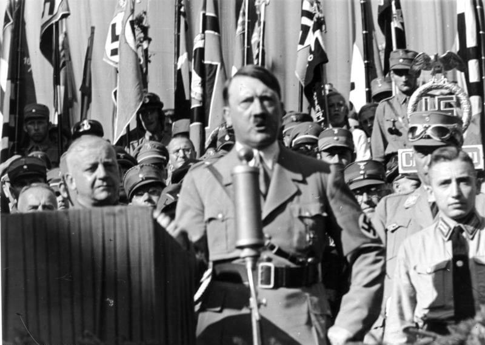
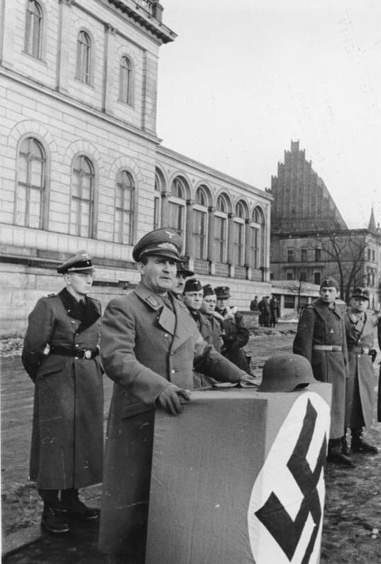

### Wstęp

Niniejszy skromny blog nie jest miejscem na głębszą analizę systemu politycznego III Rzeszy, ale pewne sprawy trzeba przedstawić, żeby temat był bardziej zrozumiały. Będzie to z pożytkiem, jeśli zrobimy to dobrze, lub tematem do dyskusji, jeśli zrobimy to źle.

### NSDAP

Nie wchodząc w szczegóły: w przypadku NSDAP mamy do czynienia z partią polityczną żerującą na rewanżyzmie, dumie i marzeniach.

Rewanżyzm dotyczył wojny i jej skutków.

- Niemcy jako naród nie mieli świadomości, że ich państwo, Rzesza kajzerowska, jest odpowiedzialne za wybuch Wielkiej Wojny.
- Drugim powodem rewanżyzmu był rezultat wojny. Niemcy roku 1918 były gospodarczą ruiną pogrążoną w politycznym chaosie, ale maszerująca wojna do nich nie dotarła. Wojska niemieckie w czasie kapitulacji wciąż walczyły za granicą, stąd legenda o "ciosie wbitym w plecy" (niem. Dolchstoßlegende), jakieś nieznane bliżej (potem przez NSDAP nazwane dokładnie), ukrywające się w mroku potęgi miały doprowadzić do klęski, do kapitulacji, do nędzy.
- Trzecim powodem rewanżyzmu były skutki wojny, i to ciągnące się latami, najpierw nędza Niemiec powojennych, potem słabość polityczna republiki pogardliwie określanej weimarską (to określenie Hitlera), a na końcu Wielki Kryzys, który dotknął wprawdzie cały świat, ale dla Niemców oznaczał przede wszystkim utratę - i to dla całego pokolenia - szans na odrobienie strat. Sensacją roku 1929 był plan Younga, który skrupulatnie wyliczał sumy gigantycznych reparacji, tak, żeby państwo niemieckie mogło się z nich wypłacić, nie sama wielkość tych sum była powodem kontrowersji - ona po prostu przekraczała wyobraźnię, ale harmonogram spłat, z którego wynikało, że Niemcy mają płacić za wojnę jeszcze ponad pół wieku, aż do roku 1988!

Co zaś do dumy, w efekcie wojny Niemcy z parweniusza stały się pariasem Europy, utraciły 13% swojego europejskiego terytorium, w tym sporą część na rzecz dopiero co powstałej, pogardzanej Polski określanej jako państwo sezonowe (niem. Saisonstaat Polen). Naród niemiecki utracił monarchię, Cesarstwo Niemieckie przestało istnieć, zamiast tego dostali słabą republikę - obcy ówczesnym Niemcom system demokratyczny. Żyjąc w bezpiecznych czasach i - zdawałoby się gwarantowanym od pokoleń i na pokolenia - pokoju, nie możemy zdawać sobie sprawy jak wyglądało życie polityczne rozszarpane przez ekstremistyczne bojówki, jak gwałtowne i gorączkowe były spory w parlamencie, za kulisami i na ulicy.

Tego właśnie dotyczyło marzenie - o nowych, lepszych, Niemczech, o prawdziwym porządku, o kraju jak z reklamy napoju mlecznego. Te trzy elementy składały się na cukier, którym żywiły się drożdże nazizmu. Rewanżyzm wymagał wroga, był nim dekadent, Żyd, bankier, każdy chory, obcy i wrogi element w kraju i za granicą. Duma patrzyła w przeszłość: germańską, ludową i cesarską, wyidealizowaną nacjonalistycznym dotknięciem volkizmu.

Marzenie zaś było wyzwaniem rzuconym przez organizację, budowaniem nowego porządku, budowaniem własnego kraju od nowa, z gotowością do poświęceń. Serce narodu filozofów uwiódł narcyz i komediant, wykrzykując to marzenie w prostych żołnierskich słowach, obiecując przywrócić dumę i zemścić się za krzywdy.

Od początku i całkiem jawnie ta porywająca naród wizja nowego porządku miała swoją koszmarną stronę: już w marcu 1933 powstaje obóz w Dachau, wzór dla całego systemu obozów wychowania, kary, pracy i w końcu zagłady. Na mocy ustaw norymberskich uchwalonych we wrześniu 1935 Żydzi utracili obywatelstwo niemieckie, pozostała im tylko - jak się wkrótce okaże - nic nie znacząca "przynależność państwowa" - to się okazuje w nocy z 9 na 10 listopada 1938 podczas "Nocy Kryształowej" (niem. Kristallnacht). W 1939 już po wojnie z Polską, kiedy pozory nie są potrzebne, zaczyna się wykonanie Akcji T4 (Aktion T4): likwidacji osób nieuleczalnie chorych i psychicznie chorych, w latach 1940-41 zamordowano 70 tysięcy ludzi w ramach "eliminacji życia niewartego życia” (Vernichtung von lebensunwertem Leben). A był to dopiero początek.

<SeeAlso comment="Teksty na stronę o Akcji T4" txt="github tdudkowski / t4" url="https://github.com/tdudkowski/t4" />

NSDAP była chaotyczną miksturą zarówno w sferze ideologii, jak i organizacji. Marginalna radykalna partyjka, w którą nikt nie wierzył. Ale w państwie bez prawdziwej armii i szanowanego porządku była jak zdyscyplinowana armia. W momencie kryzysu zaczęła być powiernikiem nadziei, konserwatyści i chrześcijanie ujrzeli w niej receptę na bolszewizm. W rozbitym parlamencie naziści mieli dość głosów, by stanowić poważną jednolitą siłę i byli jedyną liczącą się reprezentacją konserwatywnej prawicy.

Hitler został mianowany kanclerzem przez Hindenburga cieszącego się w narodzie niemieckim szacunkiem odwrotnie proporcjonalnym do zdolności umysłowych i nieomal natychmiast łamiąc reguły demokracji, ustanowił dyktaturę.

III Rzesza nie była ustanowionym legalnie nowym porządkiem prawnym, była to de lege dyktatura permanentnego nielegalnie ogłoszonego stanu wyjątkowego. Nigdy oficjalnie nie ogłoszono III Rzeszy jako takiej, samo pojęcie było propagandowym trikiem, nowym brandem, a ów stan wyjątkowy zakończył się dopiero w momencie kapitulacji, w maju 1945.

Nie jest prawdą, że Hitler doszedł do władzy demokratycznie. Owszem w demokracji, ale ze złamaniem jej zasad został kanclerzem i wykorzystał ten urząd oraz możliwości pozaprawne do złamania demokracji zamachem stanu i narzucenia dyktatury NSDAP. Tak oto partia stała się państwem. W Polsce znamy tego typu system z PRL, gdzie istniały struktury państwowe, ale nie tylko, że same były upolitycznione, przede wszystkim były drugorzędne wobec partyjnych, prawdziwą władzą było KC. Państwo było tylko fasadą, biurkiem, za którym siedziała Partia. Niemcy wciąż miały jakiś parlament (który się nie zbierał, bo nie było takiej potrzeby; jeżeli się zbierał to tylko po to, by wysłuchać Hitlera) i nawet jakiś rząd, ale dotychczasowy kanclerz oparł swoją władzę na istniejącym osobno filarze politycznym własnej partii, wprowadził zasadę wodzowską (niem. Führerprinzip), łącząc tytuły Kanclerza Rzeszy z nowym politycznym tytułem Führera, i to na urzędy i struktury partyjne przeszła realna władza.

Upartyjnione, zmobilizowane i zrzeszone zostało wszystko. Wszystkie organizacje zostały poddane nowej ideologii, wszystko służyło walce i zwycięstwu. Najpierw ujednoliceniu i ideologizacji uległy istniejące już organizacje. Ale przecież wciąż była cała masa ludzi, którzy do żadnych nie należeli. Powstawały więc nowe, których zadaniem było zaprząc całą ludność w galery idei narodowo-socjalistycznej. Związek Narodowosocjalistycznych Prawników Niemieckich (Bund Nationalsozialistischer Deutscher Juristen) i Związek Branżowy Niemieckich Akuszerek Rzeszy (Reichsfachschaft Deutscher Hebammen). To tyko dwa przykłady z wielu organizacji branżowych, akademickich, młodzieżowych, sportowych i innych, wszelkiego rodzaju przenikających wszystkie dziedziny życia zawodowego i prywatnego każdego obywatela Niemiec.

Początkowo te organizacje, zrzeszenia, stowarzyszenia są tylko propozycją, później z poparciem organów partyjnopaństwowych rosną w siłę, należy do nich coraz więcej ludzi, w końcu trzeba się tłumaczyć z nieprzynależenia, "Tato wszyscy moi koledzy są w Hitlerjugend, czemu ja nie jestem?" tak wygląda pełzająca ideologizacja życia codziennego, nie każdy ma siłę Augusta Landmessera. W końcu przynależność staje się obowiązkowa.

Taka była historia Hitlerjugend, która powstała w 1922 jako młodzieżówka SA, czyli bojówek NSDAP, organizacja całkowicie dobrowolna, ale od 1936 już przymusowa, od 1939 nieprzynależenie do HJ było zagrożone karą.

Mniej znaną organizacją był RAD (niem. Reichsarbeitsdienst) trochę przypominający Służbę Polsce. Stworzona w celu kształtowania ideologicznego starszej młodzieży, w 1936 wprowadzono nakaz półrocznej służby, od 1939 także dla kobiet. Obie organizacje nie tylko wrastały w społeczeństwo przymusem, ale również stawały się coraz bardziej militarystyczne.

W 1935 Hitler znajduje pretekst, by odrzucić ograniczenia Traktatu Wersalskiego i zamienia pozbawioną marynarki, lotnictwa i sił pancernych 100 tysięczną Reichswerę w pozbawiony jakichkolwiek limitów, gwałtownie rozwijający się Wehrmacht, który również upolitycznia.

<SeeAlso txt="Armia niemiecka 1918-45" url="/festung-breslau/article/armia-niemiecka" />

I nade wszystko - Wódz. Fũhrer jest wszystkim, masa potęgą, jednostka niczym. Jak to określił jeden z działaczy zapytany o program: "*nasz program zawiera się w dwóch słowach: Adolf Hitler*". W państwie nazistowskim nie było żadnej kolegialności, wszystko od Hitlera az po same doły partyjne, wojskowe, czy cywilne przepełniała zasada wodzowska. Powoływano ad hoc komitety, rady do rozwiązania danego problemy, ale miały skład parytetowy, a w końcu najczęściej kończyło się to tak, że Hitler delegował jednego człowieka do nadzorowania i rozwiązania problemu.

To pomieszanie partyjno-państwowe i nacisk na jednoosobowe przywództwo skutkowały zarówno oderwaniu praktyki od prawa, jak i chaosowi kompetencyjnemu. Niepisane zasady, partyjna teoria i koneksje były ważniejsze niż prawo. Walka o powiększenie dziedziny władzy pomiędzy urzędnikami była rozstrzygana w praktyce, nie na zasadzie prawa, czy stałych zasad. Państwo hitlerowskie było we władzy nieprzezwyciężalnego, immanentnego chaosu i w teorii i w praktyce. Hitler był jedyną odpowiedzią, bo ostatecznie o tym, kto ma rację na najwyższym szczeblu, to on rozstrzygał, a na niższych jego zaufani ludzie. Stworzył w ten sposób system, dla którego funkcjonowania był niezbędny, wszyscy walczyli o jego uwagę, czas i uznanie.

<BoxImageWrapper>

Adolf Hitler na tle lokalnych działaczy partyjnych 
By Bundesarchiv, Bild 119-11-19-12 / CC-BY-SA 3.0, [CC BY-SA 3.0 de](https://creativecommons.org/licenses/by-sa/3.0/de/deed.en), [Link](https://commons.wikimedia.org/w/index.php?curid=5415946)
</BoxImageWrapper>

### Gau, Gauleiter, Gauleitung

Cóż, a jak wyglądała organizacja. Pozbawiona własnych tradycji NSDAP powstawała ad hoc, organizacyjnie i ideologicznie. Nie reprezentowała jednolitej ideologii i miała synkretyczny charakter, w którym mogli się odnaleźć i tacy rewolucjoniści jak Röhm czy Strasserowie, jak i zakulisowi sponsorzy w rodzaju Kruppa. Pewne ogólnikowe postulaty powtarzane z notabene goebbelsowską natarczywością tworzyły ideologiczny wizerunek; image, apodyktyczny i wyróżniający ją z szeregu, jednolicie ubrani SA-mani, swastyka zawłaszczona przeciwnikom systemu wersalskiego (pewnym paradoksem historii, jest to, że człowiek, który pierwszy użył jej jako symbolu politycznego, jako dowódca freikorpsów - komandor porucznik Hermann Ehrhardt musiał uciekać przed prześladowaniami nazistowskimi) oraz mit przywódcy teatralnie odegrany przez Hitlera, który ćwiczył zarówno retorykę jak gestykulację. Są zachowane jego zdjęcia z wystudiowanymi pozami, przemyślana oprawa wystąpień - wszystko to było teatrem, w którym najpierw umarła demokracja, później prawa człowieka, samo człowieczeństwo, a w końcu zaczęli ginąć ludzie.

Wewnątrz partia rządziła się prawem wilczego stada i taka też była teoria Hitlera, to krew decyduje, nie wychowanie czy praca. Nie było ścisłego rozgraniczenia pomiędzy narodem a rasą, rasa była grupą pewnego dziedzictwa: zwyciężała lepsza rasa dlatego, że narzucała swoją wolę i właśnie, dlatego że potrafiła ją narzucić, była lepsza. Koło się zamykało. Władzę bierze ten, kto zdolny jest ją pochwycić i trzyma ją prawem silnego. NSDAP była partią wodzowską z samej definicji, pewnemu NSDAP-owcowi proszącemu o funkcję przywódcy oddziału Hitler odpowiada szorstko "jeżeli ludzie cię słuchają i jak twierdzisz, cieszysz się szacunkiem, to sam sięgnij po władzę".

O ile system komunistyczny tworzył iluzję kolegialności poprzez różnego rodzaju komitety na czele których stali prawdziwi przywódcy, ale teoretycznie jako emanacja pewnej grupy, najpierw ludu w postaci komitetu, a później komitetu w osobie pierwszego sekretarza, to narodowy socjalizm odwracał ten porządek i w tym przypadku to sam przywódca, jednoosobowa zasada władzy, udzielała pełnomocnictwa i legitymizacji. Sama Historia dała Niemcom Hitlera, Hitler był Fũhrerem, czyli wodzem, i od niego zależeli inni poniżsi wodzowie, porządek wodzowski spływał hierarchią w głąb społeczeństwa. To wszystko trzeba zrozumieć, żeby było jasne czym naprawdę była funkcja Gauleitera.

W statucie NSDAP z 1926 cały teren Niemiec, został podzielony na 32 Gau-y - rejony organizacyjne. Z grubsza rzecz biorąc odpowiadały podziałowi terytorialnemu Republiki Weimarskiej, który wynikał ze skomplikowanej historii państw niemieckich. Gau to stare, sięgające aż czasów frankońskich, czyli państwa Karola Wielkiego, germańskie słowo oznaczające obszar administracyjny, mniej więcej to, co w państwach anglosaskich określa słowo: hrabstwo, w tradycji słowiańskiej odpowiada mu słowo: opole.

Na czele Gau stał właśnie Gauleiter, rzeczą zasadniczą było to, że nie odpowiadał przed lokalną organizacją, nie był przez nią wybierany. To Wódz mianował poniższych wodzów i tylko przed nim odpowiadali, reguła ta stopniami hierarchii schodziła w dół. W późniejszym okresie każda z podległych NSDAP organizacji miała swojego Fũhrera i każdy szczebel regionalny też. Była to praktyczna implementacja idei wodzowskiej. W języku polskim Gauleiter jest tłumaczony jako naczelnik okręgu i takie tłumaczenie poprawnie oddaje znaczenie słowa, bo nie jest to samodzielny przywódca, jest zaledwie naczelnikiem, ale w obrębie okręgu jest jedyny i jego władza nie podlega dyskusji, prawu, ani weryfikacji. Kiedy NSDAP doszła do władzy, dokonała procesu znanego pod nazwą Gleichschaltung (ujednolicenie) - to właśnie Gau stał się podstawową jednostką administracji partyjnopaństwowej, prawdziwą władzą polityczną i urzędową jednocześnie. Gauleiter otrzymał ogromną władzę, praktycznie rzecz biorąc był lokalnym gubernatorem z nadania Fũhrera i dyktatorem; ale otrzymał również wiele obowiązków, jego urząd, czyli Gauleitung stał się podstawowym urzędem administracji lokalnej w skali Rejencji (niem. Regierung - odpowiednik województwa).

Rzeczą charakterystyczną dla NSDAP, w jej organizacji i nomenklaturze jest widoczny trybalny rewiwalizm. Ożywienie plemiennego mitu było jedną z trosk propagandy narodowosocjalistycznej. Miało temu służyć jeszcze jedno narzędzie powstałe być może w procesie instytucjonalizacji zjazdów partyjnych (parteitagów). Był to tzw. Thing (nie, nie chodzi tu o angielskie słowo "rzecz"), starogermańskie pojęcie oznaczające plemienne miejsce zebrań wspólnoty, bardziej na północ znane jako ting, w Skandynawii ding, w Brytanii folkmote. I właśnie na przykładzie nazistowskiego thingu można zobaczyć różnicę pomiędzy zakłamanym ideologicznie rewiwalizmem, który miał służyć widowiskom wspólnotowym i zaplanowanym z góry dokładnie wyreżyserowanym wydarzeniom, miał to być teatr, w którym odnajdzie się nowe społeczeństwo.

Natomiast naprawdę, w historycznych czasach funkcja była inna. Otóż thing, ting, ding i folkmote wszystko to były zebrania wspólnoty, które miały służyć dyskusji, bardziej lub mniej merytorycznej - to oczywiste - ale odnalezieniu się grupy w kontekście jakiegoś porozumienia, a nie narzuconego przez wodza zadania i wizji. Taki jest właśnie źródłosłów francuskiego słowa perlement, od którego bierze się nasz parlament - dyskusja. W rzeczywistości politycznej narodowego socjalizmu dyskusja jest wykluczona, nie ma o niej mowy, jest tylko widowisko i odgórna wizja.

- Najbardziej znany Thing w okolicach Wrocławia został zbudowany na Górze Świętej Anny (Annaberg)
- mniej znany i chyba niedokończony był w Masywie Ślęży w okolicy Gozdnicy (na południowy-zachód od Przełęczy pod Wieżycą, w dawnym wyrobisku).
- Najmniej znany i w ogóle niezrealizowany był monumentalny Thing wrocławski na Nowym Mieście pomiędzy Parkiem Słowackiego a Halą Targową. Tak wyglądała rola Gau-ów (naprawdę nie wiem jak to odmieniać) w narodowo-socjalistycznej Rzeszy.

Kiedy wybuchła wojna, nowo zdobyte tereny władze hitlerowskie podzieliły na dwa obszary, jeden włączono do Rzeszy, z drugiego utworzono Generalne Gubernatorstwo (Generalgouvernement) podzielone na dystrykty, miał to być tymczasowo śmietnik rasowy, przeznaczony do późniejszej kolonizacji.

Natomiast tereny włączone do Rzeszy podzielono na tzw. Reichsgau-y (jak to odmieniać?), takim właśnie Gauem Rzeszy był Kraj Warty (Reichsgau Wartheland; Gauleiter: Arthur Greiser) czy Kraj Sudetów (Sudetenland), oznaczało to, że mieszka tam, lub wkrótce będzie mieszkać, wystarczająco dużo ludności niemieckiej (różnych kategorii) by już teraz była to ziemia rdzennie niemiecka. Reichsgau był terenem władzy absolutnej Gauleitera.

Śląsk natomiast to był to zwykły Gau - Gau Schlesien. W latach 1925-34 zarządzał nim Gauleiter Helmuth Brückner, jak widać chodzi tu o okręg partyjny, jego następcą już Gauleiterem partyjnopaństwowym był Josef Wagner, aż do 1940.

W 1940 dołączono tereny utracone po Wielkiej Wojnie na rzecz Polski i cały, teraz już dużo większy Śląsk, podzielono na dwa Gau-y, górno- i dolnośląski:

- Gau Oberschlesien (Gauleiter: Fritz Bracht)
- Gau Niederschlesien (Gauleiter: Karl Hanke), obaj rządzą w latach 1940-45.

<BoxImageWrapper>

Karl Hanke, gauleiter dolnośląski 1940-45 
By Bundesarchiv, Bild 183-1989-1120-502 / CC-BY-SA 3.0, [CC BY-SA 3.0 de](https://creativecommons.org/licenses/by-sa/3.0/de/deed.en), [Link](https://commons.wikimedia.org/w/index.php?curid=5347635)
</BoxImageWrapper>

Organizacja terenowa Partii nie kończyła się na Gauleitungu. Szła głęboko do każdego niemieckiego domu. Zaczynała się od Fũhrera, Adolfa Hitlera, szła przez siedemnastu Reichsleiterów do 42 Gauleiterów. Od wyborów w 1930 ta struktura została rozwinięta. Z biegiem czasu ulegała zmianom, dalszej militaryzacji, ale jej działanie nie podlegało większym zmianom:

- **Kreiseleiter** zarządzał terenem okręgu wyborczego (niem. Kreise). W 1939 stanowisko to zostało zmilitaryzowane.
- Im podlegali **Ortsgruppenleiterzy** odpowiedzialni za miasto lub gminę.
- **Zellenleiter** zarządzał mniejszą jednostką, było to 10 do 12 kwartałów miejskich lub wieś.
- **Blockleiter** był najniżej w tej hierarchii, ale jego władza, choć niebezpośrednio była ogromna. Podlegało mu 40 do 60 gospodarstw domowych, do pomocy miał **Mitarbeiterów**, którzy mogli się wykazać aktywnością i awansować. Blockleiter był bezpośrednio w terenie i jak to się mówi "znał ludzi", był po prostu partyjnym sąsiadem, to do niego kierowano się z problemami, on mógł nadać bieg sprawom, kiedy zakład pracy albo instytucja miały kogoś zatrudnić wymagana była to jego opinia.

### Święta hitlerowskie

Partia organizując każdy aspekt życia społecznego nie mogła pozostawić świąt po staremu. Po pierwsze, często zawierały treści, znaczenie i symbole niezgodną z doktryną. Po drugie stanowiły świetną okazję do wdrożenia ideologii narodowo-socjalistycznej. Tworzenie nowego społeczeństwa odbywa się pod dyktat Fũhrera i jego naczelników, ale było pracą zespołową. Nikt się nie może z zespołu wyłamać. To byłby sabotaż.

- Pierwszym historycznie ogłoszonym świętem nazistowskim był 1 Maja; dwa miesiące po objęciu władzy już 10 kwietnia 1933 wyszedł przepis (Reichsgesetz) ustanawiający 1 Maja świętem państwowym jako **Dzień Pracy Narodowej** (niem. Tag der nationalen Arbeit). Tego dnia Hitler przemawiał do dziesiątek tysięcy ludzi zebranych na płycie lotniska Tempelhof - przyszli, bo liczyło się to jako dzień pracy, obecność była sprawdzana. 2 kwietnia 1933 wszystkie związki zawodowe zostały poddane brutalnemu ujednoliceniu de facto przestały istnieć, a działalność związkowa była jedna z przyczyn kierowania do obozów koncentracyjnych (niem. Gleichgeschtung). Pierwszomajowe święto w 1934 było już oficjalnie dniem wolnym od pracy i w nowelizacji uznanym jako Nationalen Feiertag des deutschen Volkes.
- Volkstrauertag[2] to nieznane w Polsce niemieckie święto państwowe: dzień żałoby po ofiarach wojny, zarówno cywilnych, jak i wojskowych. Powstało w 1893 jako połączenie różnych tego typu obrządków rozmaitych odłamów ewangelicyzmu. Naziści nie mogli pozostawić takiego święta bez ingerencji. W 1934 ogłosili Heldengedenktag (pl. **Dzień Pamięci Bohaterów**), zmieniając jego żałobną wymowę na pompatyczną i militarystyczną. Temu znaczeniu podporządkowali wystrój Nowego Odwachu w Berlinie, który jest głównym miejscem związanym z tym świętem.
- Najważniejsze święto partyjne z uroczyście organizowanym Parteitagiem organizowano w rocznicę Puczu Monachijskiego 8-9 listopada. Było to też święto państwowe "**Dzień Pamięci Ruchu**" (niem. Gedenktag für die Bewegung - Bewegung czyli Ruch to powszechnie przez hitlerowców używane określenie Partii i stowarzyszonych organizacji jako ruchu społeczno-politycznego), upamiętniano "męczenników" czyli 16 poległych podczas puczu towarzyszy partyjnych. Parteitagi organizowano najczęściej w Norymberdze, ze względu na bliskość Monachium, ale liczyło się przede wszystkim znaczenie Norymbergii jako dawnego miasta sejmowego Rzeszy. Zbudowano tam ogromne tereny zjazdowe.
- Uroczyście obchodzono również **urodziny Führera** (niem. Führergeburtstag), podczas których dekorowano domy flagami i prześcigano się w składaniu prezentów Hitlerowi.
- Ale to 30 stycznia była najważniejszym świętem nazistowskich Niemiec, tego dnia Hitler został mianowany kanclerzem, co ostatecznie kończyło mitologizowany w propagandzie tzw "okres walki". 30 stycznia to **przejęcie władzy** (niem. Machtergreifung), święto jednocześnie Partii, państwa i narodu. Zwyczajowym najważniejszym wydarzeniem tego dnia było przemówienie Hitlera do narodu.

Dla wojny charakterystyczne jest wycofywanie się Hitlera z widoku publicznego w miarę niepowodzeń na froncie.

W 1943 rozpoczętym katastrofą w Stalingradzie przemawia tylko dwa razy, w 1944 trzy i w 1945 znowu tylko dwa razy, pierwszy raz na Nowy Rok - jest to jego jedyna mowa noworoczna. I drugi raz właśnie 30 stycznia - siódme w tę rocznicę i ostatnie w ogóle publiczne przemówienie.

Liczba publicznych wystąpień Hitlera latami:
- 1933 11
- 1934 3
- 1936 3
- 1937 3
- 1938 8
- 1939 9
- 1940 7
- 1941 7
- 1942 6
- 1943 2 (w listopadzie spotkanie z 10 tys kadetów we Wrocławiu)
- 1944 3 (1 lipca mowa na pogrzebie generała Eduarda Dietla oraz 4 lipca spotkanie z 200 przedstawicielami przemysłu w hotelu "Platterhof" w Obersalzbergu)
- 1945 2 (mowa noworoczna i 30 stycznia)

### Propaganda

>Dlaczego ta "demokratyczna" prasa, uzależniona od ośrodków zagranicznych, nie dostrzega tego, jak wspaniale zmieniamy ten kraj? Dlaczego nie potrafi dostrzec, jak wiele pomocy dają nasze programy socjalne, jak bardzo zmniejszyliśmy bezrobocie, jak przywracamy moralność po tym bałaganie stworzonym przez naszych poprzedników?

7 lutego 1934 Goebbels, przemówienie przed prezydium Izby Kultury Rzeszy ["Jak w Niemczech „regermanizowano” prasę"](https://www.rp.pl/Historia/201019526-Jak-w-Niemczech-regermanizowano-prase.html)

### Hitlerjugend

>Wszystko co słabe, musi odpaść pod uderzeniami młota. W zamkach mego zakonu będzie wyrastać młodzież, która napełni świat przerażeniem. Chcę młodzieży gwałtownej, władczej, nieustraszonej i okrutnej. Te wszystkie cechy musi posiadać młodzież. Musi umieć znosić ból. Nie może mieć w sobie nic słabego ani czułego. Wolny, wspaniały drapieżnik musi znowu błyskać z jej oczu. Silną i piękną chcę mieć moją młodzież [...] Tylko z nią będę w stanie stworzyć to co nowe.

>Zacznę od młodych. My, starsi jesteśmy zużyci, przegnili do szpiku kości. Jesteśmy tchórzliwi i sentymentalni, obciążeni brzemieniem upokarzającej przeszłości i mamy we krwi tępe wspomnienia z czasów zniewolenia i służalczości. Ale nie moi wspaniali młodzi! Czyż jest ktoś świetniejszy na świecie? Popatrzcie na tych młodych mężczyzn i chłopców! Co za tworzywo! Z nimi mogę stworzyć nowy świat. Bohaterski czas młodości; z niej wyłoni się człowiek twórczy, boski... Gdy wróg powiada: “Nie przejdę na waszą stronę”, mówię mu spokojnie: “Twoje dziecko już należy do nas... Kimże sam jesteś? Przeminiesz. Jednakże twoi potomkowie już znaleźli się w nowym obozie. Już wkrótce będą znali tylko odnowiony naród”.

Za: Szymon Wrzesiński, Krzysztof Urban “Hitler-Jugend na Dolnym Śląsku 1933-1945” Agencja wydawnicza CB 2015.

### Socjalizm

>Mogliśmy się nazwać Partią Liberalną. Wybraliśmy jednak termin Narodowi Socjaliści. Nasz socjalizm jest narodowy. Żądamy spełnienia sprawiedliwych roszczeń klasy pracującej przez państwo, w oparciu o solidarność rasową. Dla nas państwo i rasa to jedno. 
>Komunizm nie jest socjalizmem. Marksizm nie jest socjalizmem. Marksiści ukradli ten termin i przekręcili jego znaczenie. Odbiorę socjalizm socjalistom. Socjalizm jest starożytną aryjską instytucją germańską.

dziennikarzowi George'owi Viereckowi w 1923

### Die Deutsche Wochenschau

Niemieckie kino ma początek w wojskowej wytwórni filmowej. 13 stycznia 1917 Naczelne Dowództwo na potrzeby propagandy wojennej powołało Bild- und Filmamt (Bufa). Generał Ludendorf dostrzegł ogromny potencjał filmu i 18 grudnia 1917 doprowadził do powołania Universum-Film AG (UFA) wielkiego, fundowanego i kontrolowanego przez państwo konglomeratu dotychczas istniejących niewielkich i niezależnych wytwórni, były to przede wszystkim "Nordisk" i "Decla". Tak powstała znana na całym świecie UFA. Było to narzędzie propagandy wojskowej. W tej formule z oczywistych powodów istniało niecały rok. W listopadzie 1918 skończyła się Wielka Wojna. W 1921 UFA została sprywatyzowana i już jako całkowicie cywilne firma rok później zbudowała studio filmowe w Neubabelsberg, później przenosząc się do sąsiedniego Poczdam-Babelsberg. Był to niemiecki Hollywood, miejsce narodzin ekspresjonizmu, działali tam tak znani twórcy filmowi jak Fritz Lang czy Friedrich Wilhelm Murnau, tam również karierę rozpoczęła Marlena Dietrich.

Już od czasów Wielkiej Wojny w kinie niemieckim przyjął się obyczaj rozpoczynania seansu od kroniki filmowej. Radio wciąż było mało popularne, telewizja istniała w umysłach kilku marzycieli, kronika filmowa dawała szansę zobaczenia co się dzieje na świecie.

Po przejęciu władzy (niem. Machtgreifung) w 1933 minister propagandy Joseph Goebbels zarządził, by każde wydanie kroniki filmowej (a było czterech głównych producentów) podlegało cenzurze. Od września 1939 monopol na wydawanie kroniki miała UFA, ale wciąż utrzymywano fikcję oddzielnych brandów. Dodano wówczas duet komików Tran und Helle (Ludwig Schmitz jako Tran i Joseph "Jupp" Hussels): Tran był śmiały i trochę głupawy, popełniał błędy, np. słuchając radia BBC, ale w porę te błędy naprawiał przystojny i rozumny Helle, nawracając biednego Trana na słuszną drogę narodowo-socjalistycznej ortodoksji. Dopiero w czerwcu 1940 powstała jednolita, propagandowa i jedyna wówczas niemiecka kronika filmowa Die Deutsche Wochenschau.

Najbardziej rozpoznawalnym elementem kroniki jest oczywiście głos i sposób mówienia narratora. Był nim Harry Giese, pochodzący z Magdeburga aktor teatralny i głosowy. Był on również narratorem antysemickiego "Der ewige Jude" z 1940.

Każdą edycję cotygodniowej kroniki przeglądał bardzo uważnie Goebbels, a potem Hitler. Po ich akceptacji kierowano ją do rozpowszechnienia. Dopóki produkcji nie zakłóciła wojna, powstawało 2 tys. kopii.

Ostatnie wydanie Die Deutsche Wochenschau ma datę 22 marca 1945. Do niektórych kopii przedostatniego wydania z 16 marca (1945/9) zdołano doczepić fragment z wizytą Hitlera w sztabie 9 Armii generała Bussego.

### Odnośniki

- Mark Felton Productions ["Nazi Day of the Dead - Berlin 1943" [YT 10:21]](https://www.youtube.com/watch?v=u1gISC92E2E) | ["Nazi Symbols - The Story Behind the Imagery" [YT 11:06]](https://www.youtube.com/watch?v=tuB2L6SN6Lg)
- U H ["Die Gestapo" [YT 41:52]](https://www.youtube.com/watch?v=Mx-1H4m2vqI) | ["Der Bund Deutscher Mädel (BDM)" [YT 27:12]](https://www.youtube.com/watch?v=bjPn7LJDJ-c)

### Przypisy

---

[2] Buß- und Bettag Dzień skruchy i modlitwy, ruchome święto wypadające między 16 i 22 listopadem, w 1893 ustanowione w Prusach swietem państwowym. W 1919 Volksbund Deutsche Kriegsgräberfürsorge (pl. Komisja Niemieckich Grobów Wojennych) zaproponowała Volkstrauertag upamietniające poległych żołnierzy niemieckich. W 1926 przeniesiono je na czas katolickiego Wielkiego Postu. Ze względów prawnych nie mógł zostać uznane za święto państwowe. 27 lutego 1934 hitlerowcy zmienili znaczenie święta, wprowadzając Heldengedenktag (pl. Dzień Pamięci Bohaterów). Joseph Goebbels nadał wytyczne np. zakazując opuszczania flag do połowy.

Szczególne było to święto w 1943 zaraz po klęsce pod Stalingradem. Jednym z punktów programu była wizyta Hitlera w Zeughaus (muzuem wojskowe) gdzie przywitali go przedstawiciele wszystkich rodzajów wojsk: Keitel, Milch, Doenitz i Himmler. Wewnątrz przywiała go VII Symfonia Brucknera. O 13.00 wygłosił krotką mowę, w której zapewnił, że front został ustabilizowany, a wrogowie Rzeszy zostaną pokonani. Potem zobaczył wystawę zdobycznego sprzętu, jednym z ludzi którzy mieli go po niej oprowadzić, był generał Rudolf Christoph Freiherr von Gersdorff. Miał przy sobie dwie brytyjskie bomby dywersyjne zwane "małżami" i gdyby Hitler nagle nie stracił zainteresowania wystawą i po paru minutach nie opuścił Zeughause, zostałby tego dnia zabity w samobójczym zamachu. Gersdorff na szczęście zaraz po wyjściu Hitlera zdołał rozbroić bomby ([Wysadzić "wodza" w powietrze. Zamach na Hitlera w Smoleńsku](https://www.dw.com/pl/wysadzi%C4%87-wodza-w-powietrze-zamach-na-hitlera-w-smole%C5%84sku/a-16672743)).

Po opuszczeniu Zeughausu został uroczyście przywitany przez dowódcę garnizonu berlińskiego generała Paula von Hase, również uczestnika spisku. Przegląd wojsk przed Nowym Odwachem i spotkanie z inwalidami obu wojen światowych i rannymi. Na końcu defilada.

### Odnośniki

- The People Profiles ["Heinrich Müller - Head of the Gestapo Documentary" [YT 1:06:00]](https://www.youtube.com/watch?v=iyjqFMQv2sQ)