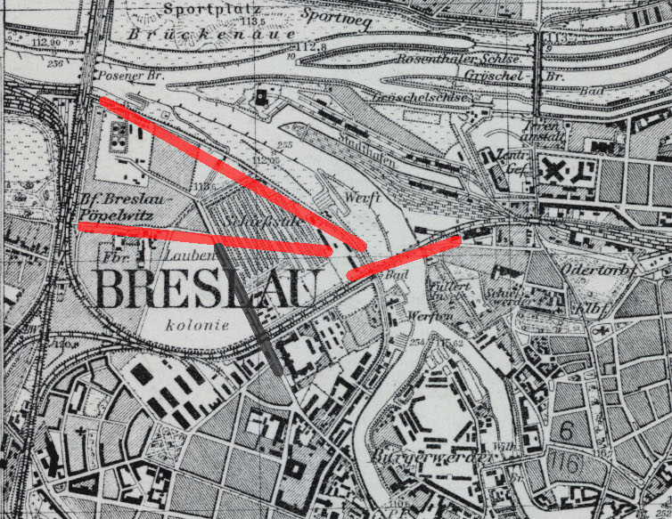

<DolnySlask />

### Wstęp

3 kwietnia siły 6 Armii sowieckiej zostały wzmocnione 374 Gwardyjskim Pułkiem Ciężkiej Artylerii Samobieżnej pod dowództwem pułkownika Nikołaja Wasilijewicza Smirnowa. Było to 21 dział samobieżnych ISU-152.

Od wejścia do walki Pułk wsparł 294 Dywizję Strzelecką w natarciu wzdłuż Odry od Parku Zachodniego przez Popowice w stronę nasypu kolejowego. Do 15 kwietnia linia frontu na odcinku zachodnim ustabilizowała się na linii nasypu kolejowego Popowice / Szczepin. Pułk miał wówczas na stanie już tylko 16 ISU-152.

Siły pancerne obrońców przedstawiały się nadzwyczaj skromnie. Była to 1 kompania pancerna pod dowództwem podporucznika Venztke, która wchodziła w skład Batalionu Niszczycieli Czołgów Breslau pod dowództwem majora W Rettera. Kompania posiadała na stanie:

- 1 niszczyciel czołgów Jadgpanzer IV
- 5 dział szturmowych Stug III
- 4 czołgi Panzerkampfwagen II
- 2 niszczyciele czołgów Marder
- 2 działa samobieżne Wespe

Główną siłą bojową kompanii był Jadgpanzer IV oraz Stugi.

Ponieważ Jadgpanzer był wyposażony w armatę przeciwpancerną 7,5 cm KwK 42 - a taką samą miała Panthera, stąd pojawiająca się czasem opinia, że we Wrocławiu były Panthery.

### Broń

#### ISU-152

Fabryka nr 100 w Czelabińsku 24 stycznia 1943 wyprodukowała eksperymentalne działo samobieżne Obiekt 236 - była to 152 mm haubicoarmata wz. 1937 (MŁ-20) na podwoziu czołgu KW i po pomyślnym przejściu testów wewnętrznych otrzymała oznaczenie SU-152. Zdecydowano o zmianie podwozia na kolejny model czołgu ciężkiego IS-2. Stąd zmiana nazwy z SU-152 na ISU-152 (oznaczenie fabryczne Obiekt 241). Powstawały kolejne prototypy, ostatecznie produkcję seryjną rozpoczęto w grudniu 1943. W 1944 wyprodukowano ich 1000.

Było to najcięższe działo samobieżne, używane przez Armię Czerwoną. Prawdziwy pancerny potwór, ważący 46 ton. Jego pierwotnym zadaniem było niszczenie fortyfikacji, schronów, umocnień i budynków. Okazał się jednak równie przydatny w walce z niemieckimi czołgami średnimi i ciężkimi. Jego armata MŁ-20S przebijała pochylony o 90 stopni pancerz 12 cm z odległości 500 m.

Załoga 5 osób (dwóch ładowniczych ze względu na wielkość amunicji).

#### Jagdpanzer IV

Niszczyciel czołgów Sd.Kfz.162 na podwoziu podstawowego czołgu Wehrmachtu, konia roboczego Panzerwaffen - Panzerkampfwagen IV. Pierwotnym uzbrojeniem była armata 7,5 cm KwK 40, w którą był uzbrojony również Panzer IV. Ale potem zanieniono ją na armatę z Panthery: przeciwpancerną 7,5 cm KwK 42 i w tej wersji był właśnie wrocławski Jadgpanzer IV.

Produkowany od stycznia 1944 do kwietnia 1945 w zakładach Vomag w Plauen (Saksonia) i od sierpnia 1944 do marca 1945 w Nibelungenwerke w St. Valentin (Austria). W obu wersjach wyprodukowano ich ponad 1880. Masa 25 ton, 4-osobowa załoga.

#### Sturmgeschütz III

Po Sd.Kfz. 251 najliczniej produkowany pojazd opancerzony Wehrmachtu, od 1940 powstało ich prawie 11,5 tys. Koncepcja artylerii szturmowej (niem. Sturmartillerie). Na podwoziu czołgu Panzerkampfwagen III umieszczono armaty kalibru 75 mm różnych wersji.

Paweł Piotrowski pisze, że te wrocławskie stugi to były StuG 40 Ausf. G, czyli wersja końcowa z armatą 7.5 cm KwK 40 (tą samą, która pierwotnie była na Jadgpanzer IV, najbardziej znana jest z Panzerkampfwagen IV). Waga 24 tony, załoga 4-osobowa.

### Plan ataku

Plan zakładał po przygotowaniu artyleryjskim przełamanie linii obrony na nasypie kolejowym i błyskawiczne wdarcie się na tyły wroga dotarcie do Odry i przejechanie po moście kolejowym na tereny przemysłowe i zdobycie elektrociepłowni.

Z masypu kolejowego na odcinku Popowic północnych miały wyjść dwa uderzenia:

- północne wzdłuż Odry Groblą Kozanowską
- południowe od Stacji Popowice Starogroblową

Oba miały się połączyć na terenie Strzelnicy i w drugim rzucie do końca dnia przebyć most kolejowy i zdobyć elektrociepłownię.

### Przebieg

Od 15 kwietnia trwały przygotowania i rozpoznanie terenu. Saperzy niwelowali nasyp kolejowy tak, żeby mogły przejechać po nim działa samobieżne.

18 kwietnia od 0700 do 1000 przygotowanie artyleryjskie. Jak się później okazało z powodu niedostatecznego rozpoznania pozycji nieprzyjaciela nieskuteczne.

Atak od początku napotyka problemy. Wykonane przez saperów przejścia muszą zostać poprawione. Mija kolejna godzina. Atak zaczyna się z opóźnieniem o 11.00.

Atak Groblą Kozanowską utyka na nasypie. Natomiast 4 bateria Pułku wykonująca uderzenie z obecnej Stacji Popowice wdarła się ok. 500 m na teren nieprzyjaciela, docierając do zachodniej części strzelnicy. Ale już na nasypie utracili osłonę piechoty. Strzelcy nie mają doświadczenia we współpracy z wojskami pancernymi.

Obrona na tym odcinku jest słaba, to tylko dwa Stugi. Informacja o ataku alarmuje sztab pułku Mohr odpowiedzialnego za front zachodni. Ponieważ dowódca kompanii pancernej podporucznik Venztke jest ranny, dowództwo sił pancernych przejmuje podporucznik Hartmann. Z ulicy Poznańskiej na Długą pojechał Jadgpanzerem, zabierając jeszcze trzy Stugi. Z jego relacji wynika, że jego oddział bez strat własnych zniszczył 12 ISU-125.

O godzinie 15.00 nastąpił kontratak batalionu Hitlerjugend wyposażonego w panzerfausty. Czerwonoarmiści zostali wyparci na nasyp kolejowy.

Już po bitwie odnaleziono trzynaste działo samobieżne ISU-152 niezniszczone, które utknęło w leju po bombie i nie mogło wyjechać. Niemcy planowali wydobycie go i użycie jako broni zdobycznej. Ale kiedy przystąpili do niwelacji terenu, okazało się, że w środku znajduje się załoga i zostali ostrzelani. Czerwonoarmiści prowadzili ostrzał i wyrzucali granaty. Załoga nie zareagowała na wezwanie do kapitulacji, więc czołg zniszczono panzerfaustem. Jak to opisuje porucznik Leo Hartmann:
>Później często zastanawiałem się nad tym, dlaczego załoga czołgu nie wysiadła, lecz tak zawzięcie broniła się aż do samego końca. Zakładam, że w czołgu znajdował się dowódca jednostki pancernej. Wczesnym rankiem, gdy przekroczyła ona nasyp kolejowy i zbierała się do właściwego ataku, czołg wpadł w lej po bombie. W tym momencie, gdy wróg stracił dowódcę, przybyłem z moimi działami i zacząłem robić porządek. Jednak rosyjski dowódca, który prawdopodobnie zorientował się w rozmiarach katastrofy, nie miał odwagi wracać i wolał raczej dać się wysadzić w powietrze.

*Plan miasta z 1942. 
Czerwone linie to planowane sowieckie uderzenie. Czarna to niemiecki kontratak*

### Podsumownie

Meldunki sowieckie wymieniają następujące przyczyny klęski:

- brak odpowiedniego rozpoznania terenu
- niedostateczne przygotowanie przejazdów przez nasyp i opóźnienie ataku o godzinę
- brak planowanego uderzenia na sąsiednim odcinku frontu
- utrata piechoty już na nasypie, zostali wybici lub się rozproszyli
- brak koordynacji podczas ataku
- brak obiecanego wsparcia piechoty

### Źródła

- Radosław Szewczyk "Pancerna rzeź w Breslau" s 40-47 Odkrywca 2017-04 (219)
- Echa z Festung Breslau
  - [W związku z Państwa licznymi prośbami o przybliżenie walk na wschód od stacji Wrocław-Popowice zamieszczamy kilka fragmentów sowieckiej dokumentacji dotyczącej słynnego pogromu 374 Ciężkiego Pułku Artylerii Samobieżnej Gwardii dnia 18 kwietnia 1945. ](https://www.facebook.com/EchazFestungBreslau/posts/3946174808776533)
  - [Mieliśmy już wgląd w opis "pancernej masakry" jaka wydarzyła się przy nasypie kolejowym na Popowicach ze strony sowieckiej. Teraz pora oddać głos Leutnantowi Leo Hartmannowi z Oddziału Przeciwpancernego "Breslau"](https://www.facebook.com/EchazFestungBreslau/posts/3950992174961463)
- Paweł Piotrowski "Wojska sowieckie i niemieckie biorące udział w walkach o Wrocław"  [w:] "Festung Breslau 1945 Historia i pamięć" 2009
- mapa [11780536 @ Topographische Karte 1:25 000 (Meßtischblatt) cz. wsch. (Ostdeutschland) /1870 - 1945/](http://igrek.amzp.pl/details.php?id=11780536)
