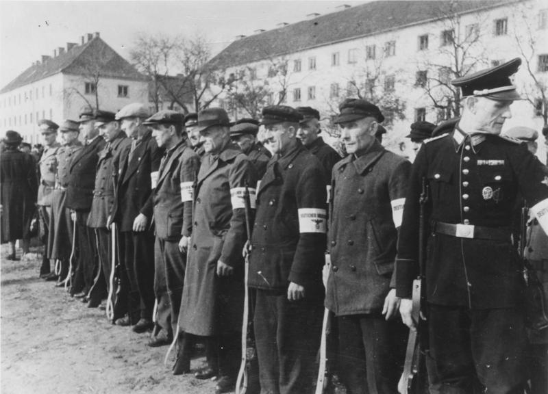

<ArmiaNiemiecka />

### Znaczenie

Słowo Volkssturm jest czasem tłumaczone jako Szturm Ludowy, co językowo jest poprawne, nie oddaje jednak słowa Volk w znaczeniu używanym przez władze narodowo-socjalistyczne. Właściwie zawsze oznaczało ono lud, ale "ten lud", esencję narodu niemieckiego, więc to jest Szturm, ale Narodowy. Są to, jakbyśmy dzisiaj powiedzieli, oddziały pospolitego ruszenia, którego powołanie od początku wojny postulowała armia.

Tak się jednak składa, że stosowne władze, czytaj Hitler, nie widziały żadnego celu w angażowaniu cywili, głęboko na tyłach w ćwiczenia wojskowe, które mogłyby nasuwać niewygodne pytania, po co obrona cywilna, jeżeli wojnę prowadzi niezwyciężona armia niemiecka.

Cywilna służba przeciwlotnicza - Flakhelfer - już istniała.

### Powstanie

Pod koniec 1944 z powodu zbliżania się obu wrogich armii do ziem niemieckich konieczność powołania pospolitego ruszenia stała się oczywista. Tu jednak powstały przynajmniej dwa problemy.

Było to po zamachu 20 lipca. Armia ostatecznie straciła zaufanie Hitlera, znalazła się pod ścisłym politycznym nadzorem Partii i SS. Niezależnie od stopnia każdy oficer znajdujący się w pobliżu Hitlera był rewidowany i pozbawiany broni.

Volkssturm został więc powołany przez Partię. Osobiście oczywiście przez Hitlera tajnym dekretem podpisanym przez niego 25 września 1944. Ale dekret był skierowany do gauleiterów (noszących również automatycznie tytuł Komisarza Obrony Rzeszy - niem. Reichsverteidigungskommissar), i to miejscowe organizacje partyjne były odpowiedzialne za formowanie tych oddziałów.

Decyzja ta oficjalnie została ogłoszona przez Himmlera 20 października w Reichsgesetzblatt (RGBl; Dziennik Ustaw Rzeszy wydawany w latach 1871-1945) i jest to oficjalna data powstania Volkssturmu. Tak się składa, że dokładnie wtedy (dokładnie dzień później: 21 X) bitwa o Akwizgran została rozstrzygnięta i po raz pierwszy wróg zwyciężył na niemieckiej ziemi.

Drugim problemem był brak kadr, zamierzano powołać wszystkich mężczyzn z roczników 1884-1928. czyli od 16 do 60 roku życia. Od Stalingradu kobiety miały obowiązek pracy. Plany były ogromne, oczekiwano, że uda się zmobilizować 6 mln ludzi, w 6710 batalionów.

Ale:

- Jedyni dostępni ludzie to byli mężczyźni po 60, nienadający się do służby wojskowej, chłopcy do 16 roku życia (obowiązkowa przynależność do Hitlerjugend) i mężczyźni zwolnieni ze służby wojskowej ze względu na pracę, jaką wykonywali.
- Z powodu braków materiałowych nie było mundurów; początkowo używano zafarbowanych mundurów partyjnych, potem już tylko opasek na ubrania cywilne.
- Nie było również właściwej broni, Partia nią nie dysponowała.
- Partia również nie miała jak tych ludzi wyszkolić.
- Nie było też, kiedy ich wyszkolić, w zakładach zbrojeniowych wprowadzono 78h tydzień pracy. Dlatego na szkolenie przeznaczona była niedziela, i to tylko 6 godzin włączając drogę tam i z powrotem.

Ostatecznie, chociaż patronat nad Volkssturmem miała Partia, szkolenie i zaopatrzenie powierzono armii.

Struktura organizacyjna była maksymalnie uproszczona: tylko cztery stopnie w ogóle nienawiązujące do hierarchii wojskowej: szeregowy, dowódca drużyny, dowódca plutonu i dowódca batalionu. Podobnie jak w przypadku SS TKV nie było formacji powyżej szczebla batalionu. Batalion miał liczyć 360 do 640 ludzi.

Formalnie podlegał gauleiterom, ale na linii frontu działał pod komendą armii.

*For documentary purposes the German Federal Archive often retained the original image captions, which may be erroneous, biased, obsolete or politically extreme. Das deutsche Volk steht auf Der Führer verkündete den Volkssturm. Deutsche Männer jeden Alters und aus allen Berufen sind zur Ausbildung angetreten und stehen zur Verteidigung ihrer Heimatgrenzen bereit. Foto: SS-PK-Falkowski/Transocean-Europapress (G) 21.10.1944 [Herausgabedatum] PK-H 6024 
By Bundesarchiv, Bild 146-1979-107-10 / Falkowski / CC-BY-SA 3.0, CC BY-SA 3.0 de, [Link](https://commons.wikimedia.org/w/index.php?curid=5483010)*

### Uzbrojenie

Wolkssturm był uzbrojony w to, co udało się znaleźć, bardzo często była to broń z zapasów pierwszowojennych, albo zdobyczna.

Podstawową bronią przeciwczołgową był panzerfaust. Formowano oddziały pod szumną nazwą kompanie niszczycieli czołgów (niem. Volkssturm Panzerjäger) z pancerfaustami zamocowanymi do rowerów.

Powstała seria projektów określanych wspólną nazwą Volkssturmgewehr w ramach Primitiv-Waffen-Programm, miała to być broń maszynowa, dająca się wyprodukować szybko, tanio, byle gdzie i w dużej liczbie.

- MP 507 aka Volkssturmgewehr VG 1-5 [Forgotten Weapons "Gustloff VG1-5 Nazi Last Ditch Rifles" [YT 17:59]](https://www.youtube.com/watch?v=LUeYVcredOc) | [IrytujacyHistoryk "VG 1-5" [YT 10:37]](https://www.youtube.com/watch?v=8nTSigeNWQE)
- Volksturm VG-5 [Forgotten Weapons "Volksturm VG-5, aka VK-98" [YT 10:26]](https://www.youtube.com/watch?v=A7S3IWyjQKY)
- MP 3008 [IrytujacyHistoryk "MP 3008 - Volkssturm" [YT 11:28]](https://www.youtube.com/watch?v=9keyfZjfouE) | [Waffenhof "Volkssturmwaffe MP3008 | Gerät Neumünster" [YT 8:42]](https://www.youtube.com/watch?v=vSjFvf5NtQc)
- [Niemieccy niszczyciele czołgów na rowerach – rejon Złotoryi 1945.](https://www.facebook.com/bobr1945/posts/3395625697217736)
- Simple History ["Last Ditch Axis Weapons" [YT 11:57]](https://www.youtube.com/watch?v=YE0JhyS2aKA)
- Military History Visualized ["Panzerfaust Evolution: PzF 30 to 250" [YT 17:45]](https://www.youtube.com/watch?v=viTBdqNwDNo) | ["Panzerfaust - How Effective was it? - Military History" [YT 7:24]](https://www.youtube.com/watch?v=ENc2ZDgkv7Q)
- Military History not Visualized ["Final Weapons of the Reich: Emergency Program 1945" [YT 15:32]](https://www.youtube.com/watch?v=JV_a_JIMYa4)
- IrytujacyHistoryk ["Panzerfaust" [YT 7:06]](https://www.youtube.com/watch?v=YXfJUafLH5E) | ["Panzerschreck (EN subs)" [YT 9:33]](https://www.youtube.com/watch?v=H7b1lvOvCIc) | ["Strzała - 2" [YT 10:06]](https://www.youtube.com/watch?v=GaIWRMfh8o4)

### Charakter

Istnieje ogromna różnica pomiędzy Volkssturmem na wschodzie, a na zachodzie Niemiec, która świetnie pokazuje różnice pomiędzy położeniem ludności cywilnej. Na zachodzie tworzenie tych oddziałów przebiegało z trudem, nie da się nawet dokładnie określić liczebności, być może było to ok. 150 tys. żołnierzy. Główną aktywnością zachodniego Volkssturmu było szybkie poddanie się do niewoli. Natomiast na wschodzie, szczególnie w Prusach Wschodnich cywile garneli się tych oddziałów i tam, gdzie udało się ich wyszkolić, stawili poważny opór. Wwschodni Volkssturm to przynajmniej 650 tys. żołnierzy.

Wszystkich mężczyzn podlegających tej służbie podzielono na cztery rzuty mobilizacyjne:

- I rzut roczniki 1884-1924, ich przejściowa służba w Volkssturmie mogła być pełniona bez szkody dla gospodarki; przeciętny wiek 52 lata. W większości weterani Wielkiej Wojny. Planowana liczebność 1,2 mln ludzi, 1850 batalionów.
- II rzut te same roczniki, ale tu należeli ci, którzy odgrywali większą rolę w gospodarce Rzeszy i z tego powodu nie mogli być na dłużej odrywani od swych codziennych zajęć. Większość nigdy nie odbyła służby wojskowej. Planowana liczebność 2 mln ludzi, 4860 batalionów.
- III rzut młodzież roczników 1925-28. 27 lutego 1945 włączono także młodzież z rocznika 1929. Wydzielenie młodzieży w odrębnym rzucie wynikało z decyzji o niewykorzystywaniu do walki na froncie rocznika 1928 i młodszych, ale w 1945, i tak przestano tego przestrzegać, rocznik 1928 powoływany był sukcesywnie do wojska w kolejnych miesiącach 1945.
- IV rzut wszyscy pozostali objęci obowiązkiem pracy, ale zdolni tylko do pełnienia służby wartowniczej i ochronnej; planowana liczebność: 1,4 mln ludzi.

Volsksturm przez swoje zaangażowanie, znajomość terenu odegra w bitwie o Wrocław poważną rolę.

### Odnośniki

- Military History not Visualized ["The Volkssturm" [YT 18:38]](https://www.youtube.com/watch?v=XHkBXuJUujI) | ["Beyond Volkssturm: Total War in East Prussia" [YT 13:07]](https://www.youtube.com/watch?v=nvcfpyzHRxw)
- History Hustle ["The Volkssturm – The Last Army of Germany in WW II" [YT 10:24]](https://www.youtube.com/watch?v=1UxmljU6OK8)
- Mark Felton Productions ["Volkssturm - Hitler's Last Ditch Civilian Army" [YT 12:06]](https://www.youtube.com/watch?v=9WWs5AxGRVY)
