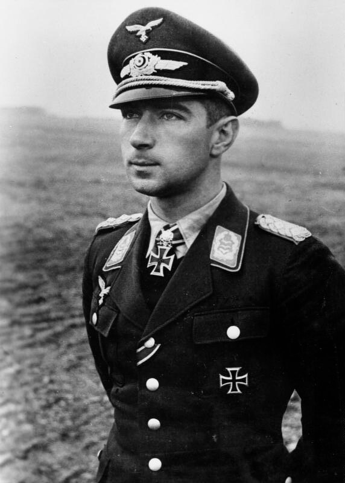

<ArmiaNiemiecka />

### Wstęp

Zagadnienie katastrof lotniczych zawsze poruszało wyobraźnię, a od kilkunastu lat jest szczególnie nośne i drażliwe politycznie.

Wrocław ma tradycje lotnicze sięgające daleko w przeszłość, miał najstarsze po berlińskim lotnisko, ale wraz z rozwojem lotnictwa ruch koncentrował się na stolicach i takie miasta pomiędzy - jak m.in. Wrocław - znalazły się nieco na marginesie. Wrocławianie zapytani o lotnisko wskażą Strachowice, czyli port lotniczy im. Mikołaja Kopernika, ale najpewniej będą mieli problem, jeśli zapyta się, jak stare jest to lotnisko i dlaczego ma takiego patrona.

Prawdopodobnie jeszcze większy problem sprawi im odpowiedź na pytanie o katastrofy lotnicze we Wrocławiu. 18 marca urodził się jeden z najsłynniejszych asów lotniczych Luftwaffe - Werner Mölders. Zginął 22 listopada 1941 podczas lądowania na lotnisku Gądów Mały (Klein-Gandau), we Wrocławiu. Kim był i dlaczego zginął - o tym będzie ten wpis. Leciał na pogrzeb swojego przełożonego, jednego z twórców Luftwaffe - Ernsta Udeta. Będzie więc to opowieść o dwóch lotnikach, trzech wojnach i Luftwaffe.

### Ernst Udet

Ernst Udet urodził się w 1896, we Frankfurcie nad Menem, ale wychowywał się w Bawarii. Podobnie jak Piotr Niestierow wspomniany przy okazji wpisu o Iwanie Połbinie, Udet zafascynował się lotnictwem natychmiast, kiedy dowiedział się o jego istnieniu, i tak się składa właściwie natychmiast po tym, jak powstało.

<SeeAlso txt="Generał Iwan Siemionowicz Połbin (1905-1945)" url="/festung-breslau/article/iwan-polbin" />

Jako 13-latek w 1909 brał udział w założeniu monachijskiego Aero-Club, zawsze się kręcił w pobliżu zakładów lotniczych i lotniska. Z przyjacielem zbudował szybowiec, ale się rozbił. Pierwszy lot odbył w 1913 w pobliskich Gustav Otto Flugmaschinenwerke w Puchheim k. Monachium.

Gustav Otto był zdolnym inżynierem i konstruktorem samolotów, pierwsze przedsiębiorstwo lotnicze założył w 1910 i udało mu się przed wybuchem wojny sprzedać 47 samolotów niemieckim siłom zbrojnym, ale nie miał powodzenia w interesach, ani relacjach międzyludzkich, może przyczyniło się do tego trudne dzieciństwo w cieniu ojca - Nicolausa Augusta Otto, wynalazcy silnika czterosuwowego. Już podczas Wielkiej Wojny leczył się z powodu depresji, miał kłopoty w interesach, a w końcu niepowodzenia w wielu dziedzinach życia doprowadziły go do samobójstwa w 1926. Jego przedsiębiorstwo z powodu kłopotów z utrzymaniem dostaw dla wojska zmieniło właściciela i jako Bayerische Flugzeugwerke (BFw) stało się podstawą późniejszego BMW.

### Wielka Wojna

Kiedy wybuchła wojna Ernst Udet 2 sierpnia (czyli dzień po tym, jak Cesarstwo Niemieckie wypowiedziało wojnę Rosji) zgłosił się na ochotnika do wojska, miał wówczas 18 lat, niestety miał też tylko 160 cm wzrostu więc z powodu niskiego wzrostu nie został przyjęty - na tym etapie wojny armia cesarska jeszcze przebierała w rekrutach.

Wkrótce potem Allgemeiner Deutscher Automobil-Club ogłosił zaciąg ochotników z motocyklami. Ernst miał motor, prezent od ojca z okazji ukończenia szkoły, zgłosił się i został przyjęty. Po krótkim okresie służby jako zmotoryzowany zwiadowca w 26 Württembergischen Reservedivision opłacił kurs pilota w szkole Gustava Otto i od kwietnia 1915 służył w lotnictwie.

Początkowo był pilotem dwumiejscowych samolotów obserwacyjnych na froncie zachodnim, ale szybko dostrzeżono jego umiejętności i w końcu 1915 został przeniesiony do jednostki myśliwskiej Kampf Einsitzer Kommando. Choć początkowo nie mógł się przełamać, miał problem w strzelaniu do innych samolotów i unikał walki powietrznej, szybko stał się jednym ze skuteczniejszych asów myśliwskich Wielkiej Wojny. W grudniu 1916 za trzecie zwycięstwo otrzymuje Żelazny Krzyż I klasy. W marcu 1918 został wybrany przez Manfreda von Richthofena (urodzonego we Wrocławiu - jakby ktoś zapomniał) do jego Jagdgeschwader Nr. I (JG I), tzw Cyrku Richthofena. W ciągu miesiąca otrzymuje najwyższe niemieckie odznaczenie wojskowe order Pour le Mérite. 21 kwietnia 1918 Richthofen ginie, a w maju Udet zostaje dowódcą 4 eskadry (Jagdstaffel 4).

Cyrk Richthofena, najsłynniejsza jednostka powietrzna Wielkiej Wojny, przy stratach 52 pilotów osiągnął podczas wojny 644 potwierdzonych zwycięstw. Początkowo latali na pomalowanych w jaskrawe kolory samolotach Albatros D.III.

Albatros Flugzeugwerke GmbH była jednym z najstarszych przedsiębiorstw lotniczych w Niemczech, założona przy najstarszym niemieckim lotnisku w Johannisthal (wówczas jeszcze pod Berlinem; drugim niemieckim lotniskiem był Klein Gandau, wówczas jeszcze pod Wrocławiem, obecnie Gądów Mały). Ogółem podczas Wielkiej Wojny wyprodukowali 10 tysięcy samolotów, większość z nich to były myśliwce z serii Albatros D. Trzecia wersja produkowana od 1917 w Ostdeutsche Albatros-Werke w Pile, powstało ich 1340. Dwupłat, skrzydła kryte płótnem, odkryta kabina, stałe podwozie. Miały aerodynamiczny kadłub i były uzbrojone w 2 karabiny maszynowe kalibru 7,92. Szybkie, choć nieco ustępujące zwrotnością myśliwcom alianckim. Używało ich także po wojnie lotnictwo polskie, m.in. podczas wojny z bolszewikami w 1920. Albatros Flugzeugwerke GmbH w 1931 stały się częścią zakładów Focke-Wulf-Flugzeugbau AG z siedzibą w Bremie.

Od 1917 jednostka Richthofena zostaje wyposażona w nowocześniejsze Fokkery, to właśnie używany od września 1917 trójpłatowiec Fokker Dr.1 stał się symbolem Czerwonego Barona. Operująca w okolicy Verdun eskadra Udeta dostaje Fokkery D VIII, szybkie dwupłaty o układzie typowym dla Wielkiej Wojny. Samolot ten miał opinię jednego z najlepszych myśliwców Wielkiej Wojny.

Istniejący od początków lotnictwa (1912) aż do bankructwa w 1998 holenderski Fokker to powszechnie rozpoznawalna marka. W 1910 Anton Fokker mający wówczas 20 lat zbudował swój pierwszy samolot "Pająk", był to pierwszy holenderski samolot. Przenosi się do Berlina i tam zakłada firmę, produkującą samoloty dla armii niemieckiej, która narzuca mu współpracownika Hugo Junkersa. Jego największym osiągnięciem jest wprowadzenie w samolotach państw centralnych zsynchronizowanego karabinu maszynowego, pierwszy raz zastosowanego w oblatanym w 1915 samolocie Fokker E.I. Wcześniej taki karabin zastosowali Francuzi w Morane-Saulnier z 1913, ale konstrukcja Fokkera jest o wiele doskonalsza. Po wojnie Fokker ucieka z Niemiec, gdzie działalność lotnicza zostaje ograniczona traktatem wersalskim, wykradając własne plany i prowadzi dalszą działalność w Holandii. Koncentruje się na lotnictwie cywilnym i umiera w 1939, w grudniu - więc jeszcze zobaczył początek kolejnej wojny.

Wielka Wojna kończy się w 11 listopada 1918, zostawiając Niemcy w chaosie, rewolucji i nędzy. Ernst Udet ma w tym czasie zaliczone 62 zwycięstwa powietrzne, co daje mu drugie miejsce, zaraz po nieżyjącym już Richthofenie (z 80 zwycięstwami) i status celebryty. Razem z Ritterem von Greim (dowódcą Luftflotte 6 od 5 maja 1943 do 24 kwietnia 1945, więc jeszcze będzie okazja o nim napisać, skoro odpowiada za most powietrzny z twierdzą Wrocław) odbywają pozorowane walki powietrzne, widowiska, z których zysk ma iść na kombatantów. Prowadzi życie playboya, dusza towarzystwa, zawsze otoczony kobietami, z tego właśnie powodu miało się rozpaść jego pierwsze małżeństwo. Próbuje swoich sił jako konstruktor i producent samolotów, ale bez powodzenia. Odbywa lotnicze safari w Afryce. Zaczyna karierę filmową, m.in. w Hollywood, jest aktorem i kaskaderem lotniczym. Występuje w trzech filmach z Leni Riefenstahl, jednym z nich jest niemy film z 1929 "Białe Piekło na Piz Palü" (Die weiße Hölle vom Piz Palü), gdzie gra siebie samego, czyli słynnego pilota, który w górach ratuje życie głównym bohaterom. Sceny we wnętrzach reżyserował Wilhelm Pabst. Tak, to jest ten sam film, o którym mowa jest w "Bękartach wojny" Tarantino. To niezwykle barwny okres w życiu Udeta, ale w sercu jest pilotem i szuka lotniczych wyzwań.

### Luftwaffe

W 1933 władzę w Niemczech zdobywają naziści. Z trzymającym się przez całe życie z daleka od polityki Udetem spotyka się inny lotniczy weteran Wielkiej Wojny, nie tak sławny i utytułowany pilot, mający zaledwie 22 zwycięstwa na koncie, ale za to ostatni dowódca Cyrku Richthofena, więc jego dawny przełożony - Hermann Göring, który w NSDAP jest od 1923 i jest jednym z najbardziej zaufanych ludzi Hitlera. W 1933 jest jednocześnie ministrem bez teki, ministrem spraw wewnętrznych Prus oraz - co najważniejsze - komisarzem Rzeszy do spraw lotnictwa. Obiecuje Udetowi sprowadzenie prosto z USA zupełnie nowego samolotu, oblatanego we wrześniu 1932 lekkiego bombowca Curtissa F11C Goshawk.

Z zewnątrz wygląda jak typowy samolot z czasów Wielkiej Wojny, dwupłat ze sztywnym podwoziem i otwartą kabiną. Ale miał pewną szczególną cechę, która wytyczała przyszłość w taktyce lotnictwa bombowego. Był przystosowany do bombardowania z lotu nurkowego. Teoria i praktyka takich bombardowań sięga jeszcze czasów przez Wielką Wojną, były dwa typy celów niewielkich, ale o ogromnym znaczeniu, które trudno było zbombardować metodą konwencjonalną: hangary Zeppelinów oraz okręty. Ale dopiero w latach 30. XX samoloty osiągnęły odpowiednią szybkość i udźwig, by takie bombardowanie było efektywne i bezpieczne (dla załóg). Ernst Udet zostaje współpracownikiem Göringa i wstępuje do NSDAP.

16 marca 1935 Hitler wprowadza ustawę o powszechnym poborze do wojska i tworzy Wehrmacht, to łamie wszystkie postanowienia traktatu wersalskiego, wspólnota międzynarodowa nie reaguje. Od tej pory oficjalnie i bez przeszkód Niemcy budują potęgę militarną.

W tym samym roku we wrześniu Reichstag uchwala rasistowskie ustawy norymberskie (Nürnberger Gesetze).

Rok później w sierpniu 1936 cały świat świętuje XI Letnie Igrzyska Olimpijskie w Berlinie. Igrzyska w Berlinie miały się odbyć już w 1916, ale wtedy zostały odwołane z powodu wojny, tym razem wojny jeszcze nie ma. Podczas Olimpiady odbywają się pokazy lotnicze, Ernst Udet na jednym z Curtissów prezentuje akrobacje lotnicze, z powodu których był tak sławny. Samolot Udeta przypadkiem, a właściwie cudem w zapomnieniu przetrwał wojnę i został odnaleziony pod Krakowem. Obecnie wystawiany jest w Muzeum Lotnictwa Polskiego w Krakowie.

Latając na Curtissie, Udet staje się zagorzałym zwolennikiem bombowców nurkujących i rozwijanego od 1933 Sturzbomber-Programm. Pierwsze próby poligonowe nie wypadają przekonująco, a wielu oficerów powątpiewa czy da się wyszkolić przeciętnego pilota do tak trudnego i ryzykownego manewru, czy nie jest to wyczyn będący w zasięgu wyłącznie asów lotniczych. Jednak przekonany, że precyzyjne bombardowania są przyszłością, Ernst Udet angażuje się w propagowanie bombardowania nurkowego i rozwój jednoosobowych bombowców nurkujących, kosztem innych projektów, takich jak wielki bombowiec dalekiego zasięgu Ural (nazwa wiele mówi o zamysłach projektanta, generała Walthera Wevera) czy He 177A ze skrzydłami o rozpiętości 30 metrów.

Jego oczkiem w głowie staje się oblatany w 1935 Junkers Ju 87 Stuka, i doprowadza do zarzucenia rozwoju konkurencyjnej konstrukcji Heinkel He 118, oraz zmarginalizowania samolotu Henschel Hs 123. Prawdopodobnie, gdyby nie Ernst Udet Ju 87 Stuka nigdy by nie wszedł do służby. Stuka staje się symbolem blitzkriegu i Luftwaffe, która dzięki niemu może niszczyć niewielkie cele (takie jak czołgi czy stanowiska artylerii) z czterokrotnie większą dokładnością i dziesięciokrotnie taniej niż używając czterosilnikowych ciężkich bombowców. Pierwszym poligonem dla nowego samolotu staje się wojna w Hiszpanii.

To prawdopodobnie wtedy pierwszy raz Iwan Połbin słyszy o taktyce bombardowania z lotu nurkowego i wypróbowuje ją rok później podczas wojny z Japończykami, i to na powolnym i nieporęcznym TB-3 o rozpiętości skrzydeł 40 m.

We wrześniu 1939 w Polsce Stukasy są już sprawdzoną i umiejętnie używaną bronią. Ale wtedy Udet ma już zupełnie inne problemy. Odpowiedzialny jest za organizację zaopatrzenia dla produkcji samolotów Luftwaffe.

W 1936 Udet staje na czele T-Amt działu projektowego Ministerstwa Lotnictwa Rzeszy (Reichsluftfahrtministerium: RLM). Jednak praca za biurkiem i biurokracja są sprzeczne z jego charakterem. Niszczą go intrygi i walka o władzę. Zaczynają się problemy z alkoholem. Widzi, że potrzeby są o wiele większe niż to, co może zapewnić niemiecki przemysł, szczególnie w zakresie rzadkich materiałów takich jak np. aluminium. Jego przełożony, Hermann Göring - niczym osławiony książę Potiomkin - kłamie w raportach, tak jakby problemów nie było.

Kiedy Niemcy przegrywają Bitwę o Anglię, Göring winą obciąża swoich podwładnych, głównie Udeta. W kwietniu i maju 1941 zgodnie z postanowieniami Paktu Ribbentrop-Mołotow niemieckiej delegacja przeprowadza inspekcję sowieckiego przemysłu lotniczego. Udet stoi na jej czele i informuje Göringa, że sowieci dysponują nowoczesnym i rozwiniętym przemysłem, że chociaż obecnie nie produkują nowoczesnych samolotów, to szybko mogą dorównać Niemcom, szczególnie jeśli chodzi o wydajność. Ale Göring ukrywa te informacje, licząc zapewne, że szybkie zwycięstwo uniemożliwi Armii Czerwonej zbudowanie nowoczesnego lotnictwa.

22 czerwca 1941 rozpoczyna się Operacja Barbarossa, atak Niemców na sowiety. 2 października rozpoczyna się jej decydujący akt - bitwa o Moskwę. Jest już o wiele za późno na zwycięstwo. Ernst Udet zdaje sobie sprawę z tego, że armia niemiecka utknęła pod Moskwą, a ponieważ nie może atakować, musi ulec przeciwnikowi mającemu większy potencjał, tym bardziej, że Hitler prowadzi wojnę na dwa fronty. Do połowy listopada jej los się nie zmienia i przyszłość bitwy wydaje się przesądzony, dla tak doświadczonego dowódcy oraz być może nieumiejętnego, ale znającego problemy z zaopatrzeniem, biurokraty jakim jest Udet.

Nie wytrzymuje napięcia i 17 listopada nad ranem popełnia samobójstwo. Ma 45 lat. Zostawia dwie wiadomości: "Ingelein czemu mnie zostawiłaś?" oraz "Żelazny jesteś winien mojej śmierci". Pierwsza odnosi się do jego kochanki, a "Żelazny" był przydomkiem Göringa. Władze Rzeszy ukryły prawdziwą przyczynę śmierci, oficjalnie ogłoszono, iż Generaloberst Ernst Udet zginął podczas testowania nowej broni, co nawet pasowało do jego charakteru. Urządzono mu pogrzeb państwowy z wszelkimi honorami. Właśnie w drodze na ten pogrzeb 22 listopada 1941 zginął we Wrocławiu Werner Mölders.

### Mölders

Mölders pochodzi z zagłębia Ruhry, jest 17 lat młodszy od Udeta, urodził się w 1913 czyli dokładnie, kiedy Udet pierwszy raz wznosi się w powietrze. Kiedy ma dwa lata, jego ojciec, z zawodu nauczyciel, jako oficer piechoty w marcu 1915 ginie we Francji. Jego rodzina przenosi się do Brandenburg an der Havel (miasto to jak sama nazwa wskazuje leży w Brandenburgii i nad Hawelą).

Od wczesnej młodości jest zaangażowanym katolikiem, być może za sprawą księdza Ericha Klawittera, w którym odnajduje ojcowski autorytet i który przez resztę jego życia jest jego mentorem duchowym.

Należy do sportowych organizacji katolickich, uwielbia wioślarstwo.

### Wojsko

W 1931 po ukończeniu szkoły średniej wstępuje do wojska. Początkowo służy w wojskach pionierskich (inżynieryjnych), ale w 1933 odbył pierwszą w swoim życiu podróż lotniczą, i tak go to zafascynowało, że natychmiast złożył podanie o przeniesienie do sił powietrznych. Został jednak odrzucony ze względu na kłopoty ze zdrowiem. Kiedy ponowił prośbę, udzielono mu warunkowej zgody (niem. bedingt tauglich) na rozpoczęcie szkolenia.

Od lutego do grudnia 1934 szkoli się w Deutsche Verkehrsfliegerschule (niemiecka szkoła lotnictwa transportowego) w Cottbus (Chociebuż). Miał w tym czasie problemy z chorobą lokomocyjną, ale udało mu się je pokonać. W 1935 uczy się w szkole lotnictwa bojowego w Tutow w Meklemburgii, a później w Jagdfliegerschule (szkole lotnictwa myśliwskiego) w Schleißheim k. Monachium.

21 maja 1935 otrzymuje stopień pilota, istniejącej od 26 lutego, Luftwaffe. W następnym roku został mianowany na stopień porucznika i jest dowódcą eskadry, a później instruktorem lotniczym.

W 1936 wybucha wojna domowa w Hiszpanii i Werner zgłasza się na ochotnika. Hiszpania jest poligonem Luftwaffe, dokonuje się tam nie tylko doskonalenie konstrukcji i taktyki Ju 87 Stuka. W Hiszpanii powstaje koncepcja nowoczesnego lotnictwa i wykształca się elita niemieckich sił powietrznych.

### Legion Condor

Mölders od kwietnia 1938 służy w 3 eskadrze Jagdgruppe 88, która wchodzi w skład Legionu Condor. Początkowo latają na samolotach Heinkel He 51, które są już w całości metalowe, ale wciąż są to dwupłaty ze sztywnym podwoziem i otwartą kabiną.

Wkrótce zostają przezbrojeni na zupełnie inny samolot - Messerschmitt Bf 109, znana na całym świecie ikona II Wojny Światowej.

Historia tego samolotu zaczęła się od analiz RLM w 1933, które wyznaczyło cztery kierunki badawcze, jeden z nich Rüstungsflugzeug III dotyczył jednoosobowego myśliwca. W marcu 1933 opracowano wymogi taktyczne: miał osiągać prędkość maksymalną 400 km/h i wysokość 6 km w 20 minut, mogąc unosić się w powietrzu przynajmniej przez 90 minut, pułap maksymalny 10 km. W 1936 odbyły się testy konkurencyjnych konstrukcji: Arado Ar 80, Focke-Wulf Fw 159 i Heinkel He 112. Chociaż Me 109 wywołał wiele kontrowersji, ostatecznie jednak sprawdził się w powietrzu i okazał się najlepszy. Na jego wybór wpłynęła być może także wiadomość o tym, że Brytyjczycy na podstawowy myśliwiec właśnie wybrali Supermarine Spitfire, który pod wieloma względami był podobny do Messerschmitta. Definitywnie skończyła się epoka dwupłatów z odkrytymi kabinami i sztywnym podwoziem. Spitfire został pierwszy raz zaprezentowany publicznie 27 czerwca 1936 podczas pokazów lotniczych na lotnisku Hendon. Dwa miesiące później na Olimpiadzie w Berlinie pokazano Bf 109.

W maju 1938 dowódca eskadry Adolf Galland wraca do Niemiec i Mölders zajmuje jego miejsce. Sam wraca do Niemiec 5 grudnia 1938, mając na koncie 15 strąceń (2 I-15, 12 I-16 i bombowiec Tupolew SB) oraz nominację na kapitana (Hauptmann). Od Hiszpanii jego samolotem jest Bf 109.

*Werner Mölders 
By Bundesarchiv, Bild 183-B12003 / Jütte / CC-BY-SA 3.0, [CC BY-SA 3.0 de](https://creativecommons.org/licenses/by-sa/3.0/de/deed.en" title="Creative Commons Attribution-Share Alike 3.0 de), [Link](https://commons.wikimedia.org/w/index.php?curid=5360743)*

### 1939

W marcu 1939 zostaje dowódcą JG 133, później przemianowanej na Jagdgeschwader 53 Pik As. We wrześniu 1939 pełni służbę na zachodniej granicy Niemiec.

Zostaje ranny podczas lądowania, ale szybko wraca do zdrowia i 19 września odnosi swoje pierwsze podczas tej wojny zwycięstwo strącając francuskiego Curtissa P-36 Hawk.

### Wojna z Francją

Podczas wojny z Francją sam zostaje strącony przez francuskiego pilota lecącego na Dewoitine D.520. Były to nowoczesne samoloty z 12-cylindrowymi silnikami widlastymi i 20 mm działkiem, dolnopłaty z zamkniętą kabiną, szybkie i mające dużą prędkość wznoszenia, ale weszły do służby w 1940 i w zbyt małej liczbie, by mieć jakiś wpływ na bieg wojny. Francuzi mieli ich tylko 75. Dostaje się do niewoli i jest tam trzy tygodnie, aż do kapitulacji Francji. Amerykanie nalegali, by wszystkich schwytanych lotników od razu wywozić za ocean, ale Francuzi uznali, że nie ma takiej potrzeby. Kiedy się kazało, że jest, cóż, było już za późno.

Później bierze udział w Bitwie o Anglię. Od czerwca 1940 do maja 1941 walczył z RAF-em, powiększając swoje konto do 68 zwycięstw powietrznych.

### Front wschodni

W czerwcu 1941 podobnie jak większość Luftwaffe zostaje przeniesiony na front wschodni i pierwszego dnia strąca 4 samoloty sowieckie, 3 bombowce Tupolew SB i jeden Curtiss P-36 Hawk. W ciągu trzech pierwszych tygodni uzyskał 33 dodatkowe strącenia. 15 lipca 1941 miał już w sumie 101 zwycięstw na koncie. Oznacza to 33 samoloty w 24 dni. Jako pierwszy żołnierz niemiecki, został odznaczony Krzyżem Rycerskim z Liśćmi Dębu, Mieczami i Brylantami a Hermann Göring wydał mu osobisty zakaz wykonywania lotów bojowych.

7 sierpnia 1941 w wieku 28 lat zostaje inspektorem lotnictwa myśliwskiego (Inspekteur der Jagdflieger), nie jest to stanowisko dowódcze, ale ma ogromne znaczenie - obowiązkiem inspektora jest tworzenie wytycznych i procedur, szczególnie w zakresie taktyki i doktryny walki powietrznej. Ma w tej dziedzinie dwa liczące się osiągnięcia:
- Jest współtwórcą tzw. formacji czterech palców (Vierfingerschwarm), elastycznej i szybko rozpowszechnionej podczas II Wojny Światowej asymetrycznej formacji składającej się z dwóch par, które w razie potrzeby mogły działać niezależnie, ale razem tworzyły odporną na atak i skuteczną jednostkę taktyczną o dużej zdolności manewrowania.
- We wrześniu 1941, po urlopie wrócił na front wschodni i dowodził jednostką z lotniska Czapłynka (obecnie Obwód chersoński - część Ukrainy nad Morzem Czarnym sąsiadująca z Krymem). Na lekkim samolocie obserwacyjnym Fieseler Fi 156 Storch (pl. bocian), wznosił się ponad wysokość, na jakiej operowały myśliwce i patrolował obszar powietrzny, wydając przez radio rozkazy podległym jednostkom. Ten sposób dowodzenia bezpośrednio z pierwszej linii później wprowadzono w Luftwaffe i do czasu wprowadzenia radaru była to najlepsza metoda kontroli przestrzeni, czasem porównywana do współczesnych samolotów AWACS. W ten sam sposób dowodził wojskami Rommel w Afryce.

Fieseler Fi 156 "Storch" to górnopłat ze sztywnym podwoziem i zamkniętą kabiną, na jego późnej wersji wzorowana jest PZL Wilga - stąd podobieństwo. Z wyglądu nieco archaiczny, ale była to nowoczesną konstrukcją wprowadzona do służby w 1935.

Nieoficjalnie jednak wciąż wykonywał misje bojowe, starając się szkolić swoich lotników. Jak wspomina jeden z jego podwładnych:
>Ustawił się za formacją sześciu samolotów Ił-2, trochę z boku, nagle obrócił samolot, otwierając ogień pod kątem 30 stopniu, Ił-2 błyskawicznie stanął w płomieniach, - widziałeś jak się to robi? - zapytał - dobrze, teraz ty bierzesz następnego; wykonałem manewr i rzeczywiście kolejny Ił-2 stanął w płomieniach, - i jeszcze raz! - to było jak lot szkoleniowy, cała lekcja nie trwała więcej jak 12 minut.

Ocenia się, że nieoficjalnie, wbrew zakazom, zestrzelił około 30 sowieckich samolotów. Wobec swoich pilotów był bezpośredni i opiekuńczy zarazem, miał przydomek Vati (tato, ojczulek), którego czasem używał jako drugiego nazwiska, np. podpisując listy. Pamiętajmy, że mowa jest o dowódcy, który zginął w wieku 28 lat. Dbał, o to by jeńców traktowano z godnością. Zarówno wojna w Hiszpanii, jak i walki na froncie wschodnim miały dla niego poważne znaczenie ideologiczne - w obu miejscach walczył z bolszewikami.

13 września 1941, zanim powrócił na front wschodni, ożenił się z Luise Baldauf, wdową po zabitym koledze. Jego córka Verena urodziła się już po jego śmierci.

### Katastrofa

17 listopada Ernst Udet popełnia samobójstwo, władze Rzeszy decydują się urządzić mu pogrzeb z honorami. Werner Mölders otrzymuje rozkaz przylotu do Berlina.

Wylatuje z Krymu samolotem Heinkel He 111, który ma zasięg 2300 km, więc teoretycznie mógłby przelecieć ten dystans bez międzylądowania. Ale pogoda jest fatalna, lecą pod wiatr i pilot jest zmuszony do wykonania dwóch międzylądowań, pierwsze - planowane - jest w Krakowie. Już wcześniej zmaga się z przeciwnym wiatrem, ale od Krakowa problem staje się coraz poważniejszy, zapada decyzja o dodatkowym międzylądowaniu we Wrocławiu.

Tam samolot rozbija się podczas podejścia do lądowania. Ginie pilot i Werner Mölders. Przeżył adiutant Möldersa, major Paul Wenzel.

Jak pisze o nim Norman Davies:
>As lotnictwa Werner Mölders (1913-1941) to kolejny przypadek wierzącego, który próbował być sługą dwóch panów. Ten weteran hiszpańskiej wojny domowej był odznaczony najwyższymi orderami za odwagę i zaledwie w 28. roku życia został mianowany generalnym inspektorem pilotów bojowych. Jako praktykujący katolik był wszakże stale śledzony przez gestapo, które zebrało obszerną kartotekę w jego sprawie. Kiedy zginął podczas przymusowego lądowania w Breslau-Gandau (Gądów), znaleziono przy nim listy, w których dał wyraz grozie, jaką budziły w nim mordy hitlerowców, oraz oczekiwaniu, że katolicy będą traktowani jako pełnoprawni Niemcy. Gestapo zdemaskowało tę korespondencję jako fałszerstwo, a Bormann wyznaczył nagrodę 100 tysięcy marek za informacje na temat jej "prawdziwego autora".

Jego zaangażowanie religijne dawało się we znaki dowództwu Luftwaffe już od wojny w Hiszpanii, ślubu w obrządku katolickim udzielił mu duchowy mentor ksiądz Erich Klawitter. Jego dowództwo wolałoby, żeby tak wyróżniający się oficer wybrał obrządek świecki, a już na pewno wybór Klawittera, który był na podstawie prawa o pulpicie (pozostałość po Kulturkampfie - zakaz krytyki władz z ambony) od 1936 był w niełasce. Co zaś do samych listów, jeśliby rzeczywiście zostały odnalezione przy zabitym, pozostałyby własnością gestapo i nikt by o nich się nie dowiedział. Bardziej prawdopodobna jest inna wersja, zaraz po śmierci Möldersa Anglicy rozpowszechniali poprzez radio i ulotki tekst domniemanych listów do Klawittera i były na tyle zręczną mistyfikacją, że Niemcy uznali, iż rzeczywiście ktoś z otoczenia Möldersa może być ich autorem, więc usiłowali go odnaleźć.

Co zaś do samej katastrofy - niewiele o niej wiadomo. Jest to spowodowane warunkami wojennymi, w prasie ukazały się tylko komunikaty.

Nie wiadomo dlaczego na miejsce lądowania wybrano nieutwardzone lotnisko na Gądowie Małym zamiast dużo nowocześniejszych i odległych tylko kilka kilometrów Strachowic, podobno samolot zderzył się z jakimś kominem przemysłowym, podobno rozbił się z powodu braku widoczności, podobno rozbił się na Pilczycach, podobno ktoś widział tam pomnik lotniczy ze śmigłem jeszcze w latach 50. XX przy hotelu. Podobno. Tak to niestety wygląda.

Śmierć Möldersa spowodowała przesunięcie terminu pogrzebu Ernsta Udeta. Obaj zostali pochowani podczas jednej ceremonii na honorowym miejscu, na Cmentarzu Inwalidów w Berlinie. Werner Mölders ma zaliczone oficjalnie 115 zwycięstw powietrznych.
