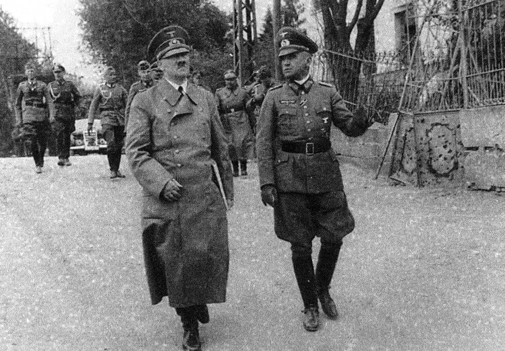

<ArmiaNiemiecka />

<DolnySlask />

### Wojsko pruskie od Wielkiego Elektora do Fryderyka II Wielkiego

Każdy kto zna dzieje Śląska, wie że ten kraj należy do Prus dopiero od wojen śląskich, konkretnie od pierwszej wojny śląskiej, od jej rezultatu czyli pokoju wrocławskiego 1742, ale ostatecznie dopiero od trzeciej wojny śląskiej, czyli wojny siedmioletniej zakończonej pokojem w Hubertusburgu 1763. Skąd więc tu Wielki Elektor, władca pruski panujący w latach 1640-88?

Rzecz w tym, że władca kraju tak biednego i prowincjonalnego jak Prusy mógł się poważyć na wojnę o Śląsk z Austrią tylko dzięki temu, że miał do dyspozycji potężną armię. A dzieje tej armii i militaryzacji wówczas księstwa Brandenburgii, a już wkrótce potem królestwa Prus zaczynają się od reform Fryderyka Wilhelma I, znanego właśnie jako Wielki Elektor. Przydomek ten bierze się z tego, że jego panowanie kompletnie zmieniło ten kraj. W miejsce niszczonego wojnami i klęskami żywiołowymi najbardziej prowincjonalnego i nędznego księstwa Rzeszy powstało państwo otwarte na świat, tolerancyjne, importujące i ludzi i ich wiedzę.

To właśnie Wielki Elektor w 1644 w miejsce prywatnej armii księcia, tworzonej według aktualnych potrzeb i możliwości władcy, powołał pierwszą stałą armię państwową. Dla jej zaopatrzenia powstały komisariaty wojenne, które od lat 60. XVII miały już charakter stały. System został ostatecznie zreorganizowany w 1684, kiedy powstały stałe, regionalne kamery wojen i domen (niem. Kriegs- und Domänenkammer). W rezultacie państwo stało się scentralizowanym systemem organizacji i zaopatrzenia wojska. Powstaje profesjonalna stała armia, której korpus oficerski został ściśle związany ze szlachtą księstwa. Szlachta miała zakaz służby w obcych armiach, a jednocześnie coraz trudniejsze było uniknięcie służby w kawalerii (tradycyjna domena szlachty), ponadto bez służby w wojsku nie można było zrobić kariery w administracji, ani dostać żadnego państwowego urzędu. Wyjątkiem byli wysokiej klasy specjaliści.

Obecnie słowo kamera w nazwie urzędu może się wydawać dziwne, owszem oryginalną nazwę Kammer można i w zasadzie powinno się tłumaczyć jako izba, czy komora (w sensie pomieszczenia, a więc i instytucji, która to pomieszczenie zajmuje, jak np NIK. albo komora celna). Jednak akurat w przypadku tego urzędu w polskiej historiografii przyjęło się nie tłumaczyć słowa Kammer na izba, więc mamy kamery.

Tak na marginesie można dodać, że generalnie kameralistyka to zarówno doktryna polityczno-gospodarcza jak i sztuka zarządzania państwa w zgodzie z tą doktryną, tak aby podnieść wydajność i maksymalnie wykorzystać wszystkie zasoby, którymi to państwo dysponuje. Było to pierwsze, jak byśmy to dziś określili, technokratyczne podejście do realizacji władzy politycznej. Na Śląsku kameralistyka oznaczała np. maksymalne wykorzystanie bogactw geologicznych w czasach pruskich, stąd taka dokładna prospekcja złóż geologicznych Fryderyka von Redena.

Następca Wielkiego Elektora, dzięki unii personalnej z państwem pruskim ogłosił się królem w Prusach (niem. König in Preußen) i żeby podnieść rangę swojego kraju z księstwa do królestwa, całość swojej domeny nazwał Prusami.

Kolejny władca Fryderyk Wilhelm I, prostak i despota, nade wszystko kochał swoją armię, od niego zaczyna się tzw "pruski dryl" i militaryzm pruski. Stworzył słynny na całą Europę Pułk Gigantów. Podzielił kraj na okręgi zajmujące się rekrutacją. Armia rozrosła się do 80 tys żołnierzy.

Dopiero jego syn, właśnie Fryderyk II Wielki użył tej armii, zdobywając Śląsk w serii trzech wojen śląskich. Największa i najważniejsza była właśnie trzecia wojna śląska, od długości trwania znana jako wojna siedmioletnia. Prusakom przyszło się zmagać na wielu frontach, właściwie ze wszystkimi sąsiadami (Austria, Rosja, Saksonia).

Mirabeau na wieść o śmierci Fryderyka II Wielkiego
>La Prusse n’est pas un pays qui a une armée, c’est une armée qui a un pays.

Prusacy byli bardzo dumni ze swojej armii. Dali lekcję całemu światu. Niestety dla nich świat tę lekcję odrobił. Niecałe pół wieku (dokładnie 43 lata) po wojnie siedmioletniej zostali sromotnie rozbici przez armię francuską w bitwach pod Jeną i Auerstädt w 1806. To był szok. Zostali zmuszenie do układów i uznania podległości wobec władzy napoleońskiej.

### Armia narodowa

Kilka lat później, kiedy tylko nadarza się taka możliwość znowu stają do wojny z Napoleonem i jest to decydujący dla całej ogólnoniemieckiej tradycji politycznej okres tzw. wojen wyzwoleńczych (niem. Befreiungskriege) zakończonej wprawdzie zwycięstwem pruskim, ale przy ogromnym wsparciu sojuszników, gł Rosji. Jasne było, że przyszedł czas na wielką reformę państwa pruskiego. Pod względem prawnym zostało stworzone właściwie od nowa, nie było dziedziny której reformy z lat 1809-13 by nie zrewolucjonizowały.

Jeszcze przed ponownym zjednoczeniem Niemiec, tym razem pod dyktando Prus powstaje idea niemieckiej armii narodowej. Król pruski Fryderyk Wilhelm III 17 marca 1813 w pałacu królewskim we Wrocławiu (obecnie siedziba Muzeum Miejskiego) wydaje odezwę An Mein Volk, w której po raz pierwszy odwołuje się do pojęcia narodowości niemieckich - "Preußen und Deutsche". Wzywa do powszechnego oporu i powstania przeciwko okupacji napoleońskiej. Odpowiedzią jest powołanie wielu milicji, rozmaitych grup zbrojnych znanych jako wolni jegrzy (Jäger) i Freikorpsy.

Najsłynniejszym takim oddziałem jest korpus Adolf von Lützowa sformowany z wrocławskich ochotników w rejonie Sobótki i Rogowa Sobóckiego. Oddział istniał tylko pół roku, po zdziesiątkowaniu w czerwcu 1813 reszta żołnierzy została wcielona do regularnej armii, ale wszedł do historii armii niemieckiej jako pierwsza tego typu patriotyczna, niepodległościowa formacja narodowa. Od kolorów korpusu: czarnych mundurów, czerwonych wyłogów i złotych guzików bierze się popularna w XIX wieku flaga niemieckiego stronnictwa republikańskiego (zwolennicy demokracji i konstytucji), czyli późniejsza flaga Niemiec z lat 1918-33 i współczesna.

### VI Korpus Armijny 1818-1918

Od 1818 mamy do czynienia z nową strukturą organizacyjną wojska. Przede wszystkim od tamtego czasu aż do końca WWII mamy do czynienia z rozwinięciem systemu stworzonego przez Fryderyka Wilhelma I, czyli pewnego rodzaju autarkią regionalną, tzn każdy region ma dostarczyć kompletną armię z wszystkimi rodzajami wojsk i sam ją zaopatrywać, także w żołnierza. Powstają tzw. Okręgi Wojskowe (niem. Wehrkreis) powiązane z podziałem na prowincje i rejencje. Każdy z nich tworzy i lokuje na swoim terenie jednostki wszystkich rodzajów: piechoty, kawalerii i wojsk inżynieryjnych (niem. Pioniertruppen). Z wyszkolonych rezerwistów w razie potrzeby jest tworzona Landwehra, czyli wojsko tworzone na czas mobilizacji. Tak to wygląda w czasach pokoju. Kiedy nadchodzi wojna, każdy Okręg Wojskowy formuje Korpus Armijny (niem. Armee-Korps), który kierowany jest decyzją sztabu na odpowiedni odcinek walk. W zasadzie powinien walczyć jako integralna armia, ale oczywiście nie ma w tej kwestii żadnej suwerenności. Dotychczasowy sztab Okręgu staje się sztabem Korpusu, ale Okręg nadal istnieje, powoływane jest jego nowe dowództwo o trochę innym charakterze. Zadaniem okręgu jest nadal zaopatrywanie wojska, ale tym razem chodzi o armię walczącą na froncie, więc chodzi głównie o zaciąganie rekruta oraz formowanie i wysyłanie na front Landwehry.

Tak to działało w czasach wojen Bismarcka, zakończonych zjednoczeniem Niemiec pod egidą Prus i powstaniem Cesarstwa. Wtedy pruska organizacja wojskowa została rozszerzona na całe Cesarstwo. W niektórych przypadkach ustanowiono nawet pruskie garnizony w miejscach strategicznych (np. Twierdza Koenigstein w Królestwie Saksonii).

W całym okresie od 1818 aż do końca Wielkiej Wojny na terenie Śląska siłą wojskową był VI Korpus Armijny (Das VI. Armee-Korps) ze sztabem we Wrocławiu. Początkowo miał siedzibę w szeregu kamienic zachodniej pierzei pl Solnego (Blücherplatz). Potem siedziba sztabu została przeniesiona do nowoczesnego, osobnego budynku Komendantury, który istniał prawie dokładnie 100 lat (1844-1945, ruiny zniesiono w 1948) na miejscu dawnej komandorii Joannitów, obok Opery. W 1928 Generalkommando Breslau ma siedzibę na Gajowickiej.

VI Korpus istnieje do końca Wielkiej Wojny i po jej zakończeniu zostaje rozformowany. Najsłynniejszym jego dowódcą jest [Remus von Woyrsch](https://pl.wikipedia.org/wiki/Remus_von_Woyrsch), który w latach 1914-17 dowodził Śląskim Korpusem Landwehry (niem. Landwehrkorps Woyrsch, później Armeeabteilung Woyrsch, potem Heeresgruppe Woyrsch). Jego zręcznym manewrom Wrocław i cały Dolny Śląsk zawdzięcza ocalenie przed rosyjskim natarciem.

### III Okręg Wojskowy 1920-34

W 1920 w wyniku postanowień Traktatu Wersalskiego powstaje nowa, niemiecka armia. Ochotnicza, zawodowa, ograniczona do 100 tys żołnierzy (dla porównania współczesna Bundeswehra operująca na przecież mniejszym terenie ma 180 tys) i podlegająca wielu restrykcjom. Oddzielny Okręg Wojskowy przy takiej liczebności nie był potrzebny, cały Śląsk wchodzi w skład III Okręgu Wojskowego z dowództwem w Berlinie.

Taka sytuacja trwa do 1933, kiedy to w Niemczech władzę przejmują hitlerowcy. Rozpoczyna się powolny i systematyczny demontaż ograniczeń wersalskich.

### VIII Korpus Armijny do marca 1943

1 października 1934 powstaje obejmujący cały Śląsk 8. Okręg Wojskowy (Wehrkreis VIII) i odpowiednio VIII. Armeekorps (8.)

Kilka miesięcy później w marcu 1935 Hitler wydaje dekret o mobilizacji, który powołuje zupełnie inną pozbawioną ograniczeń armię poborową. Zawodowa 100-tysięczna Reichswehra zostaje przekształcona w Wehrmacht. W 1939 Dolny Śląsk jest rejonem wyjściowym dla 8 Armii pod dowództwem generała Johannesa Albrechta Blaskowitza, sztab był w Nysie, główne siły stacjonowały we Wrocławiu i okolicach.

Od 4 lutego 1938 dowódcą VIII Korpusu Armijnego jest generał piechoty Ernst Busch.

We wrześniu 1938 Korpus został zmobilizowany i wziął udział w zajęciu czechosłowackich Sudetów po traktacie monachijskim. Później w marcu 1939 część oddziałów wkroczyła do okrojonej Czechosłowacji.

Latem 1939 nastąpiła generalna mobilizacja całego Wehrmachtu.

Kiedy wybuchła wojna z Polską 8. KA na lewym skrzydle 14 Armii w ramach Grupy Armii Południe pomaszerował prosto na wschód:

- 2 września Mikołów
- 3 września Oświęcim i linia Przemszy, ciężkie walki z polską 6 dywizją
- 4 września Babice, Chrzanów
- 7 września Nida w rejonie Wiślicy
- 9 września Staszów
- 11 września przeprawa przez Wisłę w Opatowcu i Nowym Korczynie i wieczorem dotarł do Mielca
- 14 września Leżajsk i okolice Biłgoraju
- 17 września Biłgoraj
- do 20 września walki w rejonie na południowy zachód od Tomaszowa, zniszczone polskie dywizje 6, 21 i 23
- 22 września ciężkie walki na południe od Zamościa
- 24-27 września marsz na zachód za San

2 października 1939 przeniesiony na front zachodni do Eifel. I już tam la leżach zimowych 25 października następuje zmiana dowódcy na generała Waltera Heitza, który pozostaje na tym stanowisku aż do końca Korpusu w kotle stalingradzkim.

W wojnie z Francją w 1940 początkowo na północnym skrzydle grupy armii A

- 15 maja przez Malmedy na północ od Dinant
- 20 maja skierowany na wschód od linii Saint Quentin - Cambrai
- do 25 maja skierowany do obszaru na zachód od Douai
- 30 maja wycofany z frontu i skierowany na południe
- po zakończeniu pierwszej fazy kampanii zachodniej w rejonie Lens i Douai jako rezerwa Grupy Armii B
- 9 czerwca przydzielony do 18 Armii
- 14 czerwca uczestniczył w zajęciu Paryża
- 16 czerwca Chartres
- 18 czerwca na południowy wschód od Cloyes
- 19 czerwca obszar po obu stronach Vendome 65 kilometrów na zachód od Orleanu
- 20 czerwca dotarł do Loary w Tours i przekroczył przekroczył rzekę w Amboise, potem skierował się na południe
- 25 czerwca zatrzymał się i maszerował na Atlantyk w pobliżu La Rochelle

W maju 1941 przeniesiony do Prus Wschodnich.

Od 22 czerwca 1941, czyli od samego początku udział w Operacji Barbarossa.

- Grodno
- sierpień kocioł smoleński
- początek września w rejonie na północny wschód od Smoleńska
- koniec września Jarcewo
- październik bitwa pod Wiaźmą, potem skierował się na Rżew w kierunku Wołgi

W listopadzie wyłączony z frontu i skierowany do Grupy Armii D we Francji. Uzupełnienie składu i odpoczynek. W marcu 1942 z powrotem na front wschodni w rejon Charkowa.

Od kwietnia 1942 8. KA w składzie 6. Armii pod dowództwem generała Paulusa. Bitwa o Charków, powstrzymanie natarcia sowieckiego w Pierwomajsku. W tramach ofensywy letniej w końcu czerwca z Biełgorodu na Oskoł. Rzeka Czir i Kletskaja nad Donem. Potem w kotle stalingradzkim i rozbity w styczniu 1943 razem z całą armią Paulusa. Kapitulacja 2 lutego 1943.

Wszyscy pozostali przy życiu wzięci do niewoli. Oficjalne rozwiązanie Korpusu 5 marca 1943.

<BoxImageWrapper>

Arras, maj 1940. Hitler i generał Walter Heitz, dowódca VIII Korpusu Armijnego od 25 października 1939 do Stalingradu. Umarł w niewoli w 1944. 
By Unknown German press photographer - [https://ww2gravestone.com/people/heitz-walter/](https://ww2gravestone.com/people/heitz-walter/), Domena publiczna, [Link](https://commons.wikimedia.org/w/index.php?curid=74334078)
</BoxImageWrapper>

### VIII Korpus Armijny od marca 1943 do maja 1945

Jeszcze w tym samym miesiącu, czyli w marcu 1943 odtworzony w ramach 16 Armii w rejonie Stara Russa w obwodzie nowogrodzkim.

20 lipca 1943 już jako VIII KA pod dowództwem generała piechoty Gustava Höhne.

W połowie września w rejonie Chołm w obwodzie nowogrodzkim. 19 listopada włączono grupę bojową generała porucznika Thumm i grupę policyjną generała Wagnera (estnische 132. SS-Freiwilligen-Brigade und lettische SS-Polizei-Regiment Riga). Do marca 1943 w rejonie Newel w składzie 16 Armii.

Od kwietnia do czerwca 1944 część 2 Armii. 1-15 kwietnia dowódcą jest generał Johannes Block, po nim do 12 maja dowództwo obejmuje generał Hans Schlemmer, potem do 10 września po raz kolejny generał piechoty Gustav Höhne. Po klęsce Grupy Armii Środek odwrót do Brześcia Litewskiego. W lipcu 1944 w składzie 4 Armii Pancernej. W sierpniu 1944 w składzie 9 Armii i brał udział w tłumieniu Powstania Warszawskiego. Od 10 września dowódcą jest generał Walter Hartmann.

Od lutego 1945 podlegał 17 Armii, tak samo jak znajdująca się wówczas w oblężeniu Twierdza Wrocław. Południowy zachód od Opola, potem Ząbkowice Śląskie. Od 19 marca do 20 kwietnia dowódcą jest generał Friedrich Wiese, potem aż do 8 maja generał Horst von Mellenthin. Koniec wojny to kapitulacja na wschód od Pragi.

### 6 Armia ogólnowojskowa

Dużo wspólnego z Wrocławiem ma inna, jeszcze bardziej feralna <a href="https://pl.wikipedia.org/wiki/6_Armia_(ZSRR)">6 Armia ogólnowojskowa</a> (też podobnie jak 8. Armia Blaskowitza brała udział w inwazji na Polskę) podczas WWII trzykrotnie kompletnie rozbijana i potem formowana na nowo. Po raz ostatni w grudniu 1944 z poboru na Ukrainie, tzw ogólnowojskowa czyli najgorszego sortu dowodzona przez byłego dowódcę wojsk konwojowych NKWD generała lejtenanta Władimira Aleksiejewicza Głuzdowskiego, którego PRL-owska propaganda na siłę robiła Polakiem. Fatalne w skutkach oblężenie wynikało z 2x niedoszacowania sił niemieckich oraz ambicji marszałka Żukowa dowódcy 1. Frontu Ukraińskiego, który chciał zdobyć miasto, co nie miało sensu bo jego garnizon nie posiadał żadnej zdolności ofensywnej.

### Podsumowanie

W skrócie więc wygląda to tak:

- 1818-1920 VI Korpus Armijny
- 1920-34 III Okręg Wojskowy z dowództwem w Berlinie
- 1934-39 VIII Korpus Armijny, od 1939 już tylko Okręg Wojskowy. 8. KA zostaje zniszczony dwukrotnie: w styczniu 1943 w Stalingradzie i w maju 1945 w północnych Czechach.
- Powołany ad hoc garnizon obrony Twierdzy Wrocław, na bazie 609 Dywizji do zadań specjalnych
- 1945 1 Front Ukraiński, Wrocław oblega 6 Armia ogólnowojskowa

### Odnośniki

- [Heeresdienststelle Breslau VIII. Armeekorps (8.) Generalkommando Hoehne](http://www.lexikon-der-wehrmacht.de/Gliederungen/Korps/VIIIKorps.htm)
- [Krótka historia walk o Oleśnicę](https://www.olesnica.nienaltowski.net/WalkiwOlesnicy.htm)
- [Ligota Dolna - dawne lotnisko](http://www.straznicyczasu.pl/viewtopic.php?t=934)