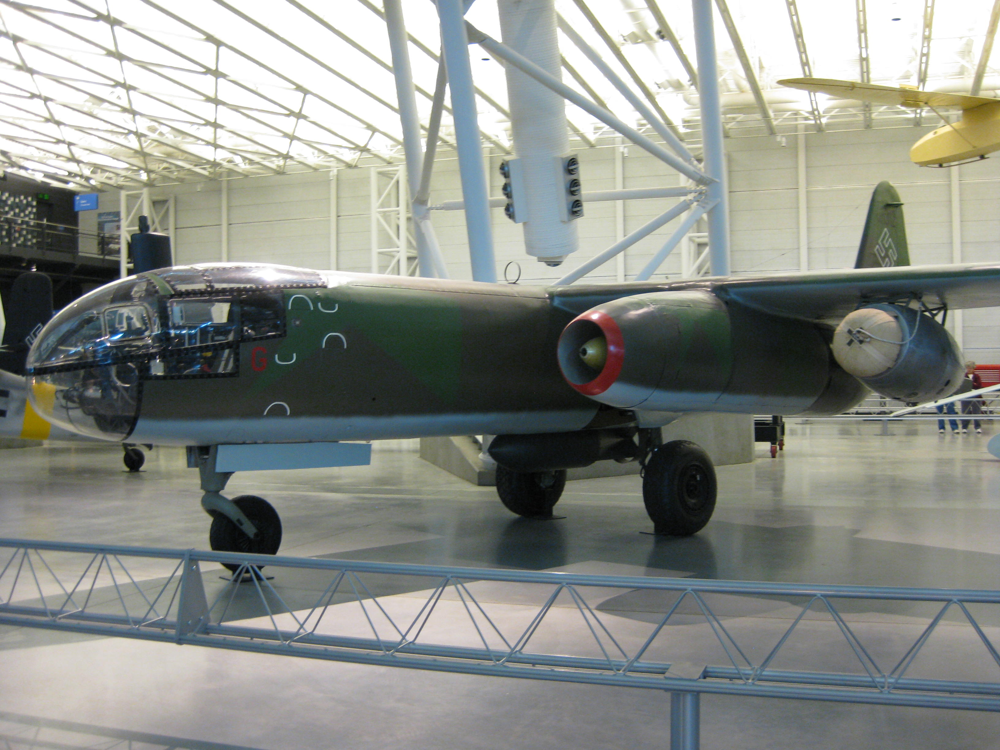

<ArmiaNiemiecka />

Artykuł ten został wydzielony z większego poświęconego tzw. cudownej broni (niem. Wunderwaffe), która wg twierdzeń hitlerowskiej propagandy dzięki przewadze technologicznej miała zapewnić zwycięstwo. Więcej o Wunderwaffe:

<SeeAlso txt="Wunderwaffe" url="/festung-breslau/article/wunderwaffe" />

## Lotnictwo

Reichsluftfahrtministerium (pl. Ministerstwo Lotnictwa Rzeszy) i Oberkommando der Luftwaffe (OKL):

- 18 lutego 1943 zamówienie na jednomiejscowy samolot szturmowy do walki z oczekiwaną inwazją brytyjską
- 1943 (?) program Göringa 3x1000: samolot szturmowy, bombowy: zasięg 1000 km, prędkość 1000 km/h, nośność 1000 kg uzbrojenia (bomby lub rakiety)
- 3 lipca 1944 wstrzymanie wszystkich programów lotniczych na rzecz awaryjnego projektu myśliwca (niem. Jägernotprogramm)
- 17 stycznia 1945 wstrzymano wszystkie projekty na rzecz dwóch: Messerschmitt Me 262 i Heinkel He 162.

### Awaryjny program myśliwca (Jägernotprogramm)

3 lipca 1944 decyzja o wstrzymaniu wszystkich programów lotniczych na rzecz awaryjnego projektu myśliwca (niem. Jägernotprogramm). Był to koniec wszystkich projektów Amerikabomber.

Ogłoszono program Volksjäger - zakładający skonstruowanie myśliwca odrzutowego łatwego w produkcji masowej i skutecznego w niszczeniu alianckich bombowców. Zakładano użycie silnika odrzutowego BMW 003 i maksymalnie prostą konstrukcję, bez potrzeby używania trudnych do pozyskania materiałów. Samolot ten mógł być nawet jednorazowego użytku, w każdym razie nie był przeznaczony do naprawy. Miał być pilotowany przez ludzi po krótkim szkoleniu szybowcowym. W tej kategorii wygrał Heinkel He 162.

W ramach tego programu były rozwijane przede wszystkim istniejące już samoloty, bliskie fazie wdrożenia. Był to głównie Me 262, rakietowy Komet. Był też tłokowy, podwójny Dornier Do 335.

W zakres programu wchodziły również bombowce, ale tylko odrzutowe: Arado Ar 234, Junkers Ju 287 i Heinkel He 343.

Większość proponowanych konstrukcji nie doszła do fazy prototypu, ale niektóre były bardzo oryginalne.

- Przede wszystkim najdziwniejszy pojazd lotniczy - Bachem Ba 349 Natter.
- Drewniany szybowiec do niszczenia bombowców - Blohm & Voss BV 40.
- Wynoszony rakietą miniaturowy myśliwiec przechwytujący - Heinkel P.1077
- Miniaturowy samolot rakietowy zrzucany z bombowca - Arado E.381
- Myśliwiec z silnikiem strumieniowym zasilany koksem - Lippisch P.13a

Odnośniki:

- Military History not Visualized ["Final Weapons of the Reich: Emergency Program 1945" [YT 15:32]](https://www.youtube.com/watch?v=JV_a_JIMYa4)

### Me 262

W 1943 alianci z grozą odkryli, że Niemcy mają zaawansowany projekt samolotu odrzutowego. Hitler tu oczywiście musiał się wtrącić i zmusił konstruktorów do przerobienia go na bombowiec, co spowodowało poważne opóźnienie.

Pionierami w dziedzinie napędu odrzutowego byli Brytyjczycy, ale będąc od 3 września 1939 w stanie wojny z hitlerowskimi Niemcami, musieli zaangażować wszystkie środki w to, co się daje wyprodukować od razu i zmodernizować na bieżąco. Własny odrzutowiec to był bardzo zaawansowany projekt, szczególnie z powodu silnika. Ówczesna technologia dopiero raczkowała, silniki były bardzo zawodne i często się zapalały. Dokładnie z tego samego powodu oba projekty i brytyjski i niemiecki zostały poważnie opóźnione.

Pierwszy niemiecki odrzutowiec Heinkel He 178 został oblatany już 27 sierpnia 1939. Ale decyzje Hitlera i szefostwa Luftwaffe były dla niemieckiego programu lotnictwa odrzutowego jednoznaczne - liczbę inżynierów ograniczono do 35, czyli program zamrożono. Wszystko musiało iść w tłoki, bo tanie, sprawdzone i łatwe w produkcji samoloty z silnikami tłokowymi miały wystarczyć do zapewnienia zwycięstwa. Dlatego prototyp Me 262 został oblatany dopiero 18 lipca 1942.

19 kwietnia 1944 sformowano Erprobungskommando 262 (Erprobungskommando to nazwa jednostki mającej za zadanie wypróbowanie nowego rodzaju broni) stacjonujące na lotnisku Lechfeld k. Augsburga i już podczas operacji Overlord (lądowanie w Normandii) alianci zetknęli się z nimi w boju. Szybkością i parametrami lotu przewyższały wszystkie samoloty alianckie. Przy prędkości 900 km/h stanowiły trudne do zwalczenia zagrożenie dla alianckich flotylli bombowców. W sumie wyprodukowano ich 1400, ale w danym momencie nigdy nie było więcej niż 200 sprawnych maszyn gotowych do lotu. Największy problem stanowiły oczywiście silniki. Były nie tylko zawodne, ale miały niewielki resurs, trzeba było często je wymieniać.

Alianci szybko odkryli ich słaby punkt. Charakterystyka pracy silnika powodowała, że Me 262 był bezbronny podczas startu i lądowania. Pilot nie był wtedy w stanie wykonać żadnych manewrów. Pierwszym, który zestrzelił Me 262, był legendarny Chuck Yeager (pierwszy człowiek, który przekroczył barierę dźwięku). 7 października porucznik Urban Drew zestrzelił dwa startujące Me 262.

25 lutego 1945 5 mustangów z 55th Fighter Group zaskoczyło cała startująca eskadrę Me 262, zniszczyli pięć samolotów.

Najgroźniejszym przeciwnikiem dla Me 262 był brytyjski Hawker Tempest. Alianci uznali Me 262 za samoloty tak niebezpieczne, że priorytetem było zniszczenie ich wszystkich. Najczęściej stosowaną taktyką (tzw. Rat Scramble) było śledzenie Me 262 i zaatakowanie podczas zejścia do lądowania. W odpowiedzi Niemcy ustawiali "aleje plot" czyli zagęszczenie ponad 150 dział plot 20 mm na podejściach do lotniska. To zapewniło bezpieczeństwo Me 262.

19 marca 1945 zbombardowano główne zakłady produkujące Me 262. Efekt był niewielki, bo ze względu na panowanie aliantów w powietrzu produkcja była rozproszona po wielu zakładach na sporym obszarze, a kluczowe elementy takie jak silniki Jumo 004 wytwarzano w podziemnych, fabrykach chronionych przed atakiem z powietrza.

Najlepszym przykładem był zakład w Walpersbergu, który był umieszczony w nieczynnej kopalni we wnętrzu góry. Produkowano tam kompletne samoloty, które potem wyciągano na płaski szczyt. Na nim znajdował się pas startowy, zmontowany samolot od razu leciał na docelowe lotnisko. Skrzydła powstawały w najstarszym niemieckim tunelu autostradowym w Engelberg (na zachód od Stuttgartu).

B8 Bergkristall-Esche II powstała sieć tuneli w St. Georgen/Gusen, w których pracowali więźniowie KL Gusen II. Powstawało tam prawie pół tysiąca kompletnych kadłubów miesięcznie. Średni czas życia więźnia tego obozu to pół roku. Od 35 do 50 tysięcy ludzi zmarło lub zostało zamordowanych w procesie produkcji Me 262.

31 narca 1945 pierwszy nietknięty Me 262 w rękach aliantów. Został wysłany do USA. Pilot niemiecki zmienił strony i oddał samolot.

I tegoż samego dnia: Jagdgeschwader 7 skrzydło Luftwaffe pierwsza jednostka wyposażona w całości w Me 262 osiągnęło tego dnia swój niepobity nigdy później rekord: zestrzelono 19 4-silnikowych bombowców i dwa myśliwce.

Odnośniki:

- Yarnhub ["When Me-262s Battled Mustangs Over Germany" [YT 6:11]](https://www.youtube.com/watch?v=ZsjMBMv0w0g)
- Military Aviation History ["The 'Real' Reason(s) Why The Me 262 Had Bombs" [YT 38:38]](https://www.youtube.com/watch?v=SDYHd1PuR5U)
- WarsofTheWorld ["What Was the Post War Career of the Messerschmitt Me 262?" [YT 17:23]](https://www.youtube.com/watch?v=E0nzKdHtLTc)
- Lost Battlefields w Tino Struckmann ["REIIMAHG THE ENORMOUS ME262 TURN-KEY FACTORY" [YT 1:36:49]](https://www.youtube.com/watch?v=LyOAbB3vT3A)
- Epicaviation47 ["(4K) Mega Rare ME-262 Startup,Takeoff and More" [YT 11:02]](https://www.youtube.com/watch?v=kKKGXeg7udE)
- [Summary of debriefing German pilot Hans Fey on operational performance & late war deployment of the Me 262 jet fighter
Conducted by Major Ernst Englander, Spring, 1945](http://zenoswarbirdvideos.com/Images/Me262/ME262PILOTDEBRIEF.pdf)

### Prędkość dźwięku

Urodzony w Nysie fähnrich (stopień odpowiadający młodszemu sierżantowi) Hans Mutke pilotujący Me 262 eskadry szkoleniowej Ergänzungs-Jagdgeschwader 2 (EJG 2) wystartował 9 kwietnia 1945 z Fliegerhorst Lechfeld k Lagerlechfeld (Bawaria) i wzniósł się na 12 tys. m. Była piękna pogoda, fantastyczne warunki do lotu, widzialność na 100 km.

Ponieważ został zaalarmowany o zbliżającym się P-51 Mustang, mając pełną moc silnika, zaczął lecieć 40 stopni w dół. Twierdzi, że nagle jego samolot wpadł w wibracje, zaczął chybotać, a prędkościomierz powietrzny utknął na 1100 km/h (maksymalna prędkość samolotu to 870 km/h). Pełną sterowność maszyny odzyskał dopiero po zmniejszeniu prędkości do ok 500 km/h.

Prędkość dźwięku na tej wysokości to 1062 km/h, co oznaczałoby, że Mutke byłby pierwszym człowiekiem, który przekroczył barierę dźwięku. Mutke twierdzi zresztą, że nie zdawał sobie sprawy z tego, co się działo, dopiero kiedy usłyszał, jak opisuje to Chuck Yeager, pierwszy człowiek, który dokonał tego z całą pewnością w 1947, zrozumiał, że być może przypadkiem przydarzyło mu się cos bardzo podobnego. Wiele wskazuje, że Mutke doświadczył efektów prędkości poddźwiękowej, czyli powyżej 0,8 Macha, których kilka zdarzyło się tej wojny, pierwszy taki wypadek miał miejsce już w 1942 i dotyczyło to Republic P-47 Thunderbolt, potem miały tego dokonać P-51 Mustang i Spitfire.

Istnieje również relacja, ale bez żadnych innych dowodów czy potwierdzeń, że pilot oblatywacz Heini Dittmar 6 lipca 1944 lecąc na samolocie rakietowym Me 163B Komet V18, osiągnął prędkość 1130 km/h i dało się słyszeć grzmot dźwiękowy.

Możliwe zresztą, że pierwszym człowiekiem, który przekroczył barierę dźwięku, był pilot oblatywacz Lothar Sieber, który 1 marca 1945 dokonywał oblotu pionowzlotu rakietowego Bachem Ba 349 Natter. W 55 sekund wzniósł się na wysokość 14 km. Niestety zginął podczas tego lotu.

Rutynowo prędkość dźwięku przekraczały wszystkie rakiety V2 startujące od 1942, we wrześniu 1944 V2 podczas końcowej fazy loty przekraczały prędkość 4 Mach.

Anglicy w tym czasie rozwijali projekt odrzutowego samolotu naddźwiękowego Miles M.52, który w kwietniu 1945 osiągnął fazę testów na modelach. Na początku 1946 odgórnie go wygaszono.

- [Hans Guido Mutke](https://en.wikipedia.org/wiki/Hans_Guido_Mutke)

### Messerschmitt Me 163 Komet

Napęd odrzutowy funkcjonuje na zasadzie spalania paliwa w komorze silnika. Produkty spalania są kierowane przez dysze w jedną stronę, dzięki czemu na zasadzie akcja-reakcja pojazd porusza się w przeciwną. Do spalania potrzebne są dwie rzeczy: paliwo oraz utleniacz. Ze względu na to, jak jest dostarczany utleniacz, silnik odrzutowy dzieli się na dwa rodzaje:

- silnik rakietowy: utleniacz jest dostarczany ze zbiornika
- silniki odrzutowe z dopływem powietrza, zazwyczaj określane po prostu silnikami odrzutowymi: jak sama nazwa wskazuje, utleniaczem jest tu powietrze atmosferyczne kompresowane w turbinie przed komorą spalania.

Teraz staje się jasne, dlaczego samoloty nigdy nie polecą w kosmos, po prostu powyżej pewnej wysokości atmosfera jest zbyt rzadka, by zapewnić dostateczną ilość utleniacza. Pewnym rozwiązaniem byłby samolot rakietowy, czyli dodanie zbiornika z utleniaczem. Ale tu wystarczy popatrzyć na rakiety kosmiczne, które w zasadzie są głównie zbiornikami paliwa, żeby zrozumieć, dlaczego nie mamy samolotów rakietowych. Tzn. prawie nie mamy.

Niemcy zbudowali w czasie wojny samolot rakietowy - Me 163 Komet. Był fenomenalną bronią z licznymi wadami. Oblatany został już 1 września 1941. Już wtedy przekroczył prędkość 1000 km/h. Ale z powodu awaryjności był to samolot równie niebezpieczny dla nieprzyjaciela, jak i pilota. Sama technologia rakietowa - ogromne zużycie paliwa i konieczność transportu utleniacza powodowała nieprzezwyciężalne ograniczenia. Czas lotu ok. 10 minut. Potem samolot stawał się bezbronnym, powolnym szybowcem.

Alianci nie mieli jak walczyć z tymi samolotami, ale bardzo szybko opracowali prostą metodę jak ich unikać. Po prostu trasy bombowców omijały lotniska, na których bazowano te samoloty. Ze względu na ich niewielki zasięg nie było to trudne.

Prędkość była tak samo zaletą, jak i wadą. Z taką różnicą prędkości celowanie było bardzo utrudnione. Próbowano zoptymalizować broń montując Sondergerät 500 Jägerfaust - było to 10 jednostrzałowych, bezodrzutowych dział z krótką lufą 50 mm skierowanych ku górze, uruchamiała je fotokomórka. Zasada była prosta: Komet wlatuje pod bombowiec, fotokomórka automatycznie odpala działa. Znany jest tylko jeden przypadek zastosowania tej broni. 10 kwietnia zniszczyła brytyjskiego Lancastera.

- Mark Felton Productions ["Japan's Nazi Rocket Fighter" [YT 11:23]](https://www.youtube.com/watch?v=nggb5atqPro) | ["Mustang vs. Komet - Germany 1944" [YT 5:30]](https://www.youtube.com/watch?v=bNw3a_07OjI)
- Dark Skies ["Me 163 Komet - The Secret Nazi Rocket Fighter - Fastest Plane of WW2" [YT 12:51]](https://www.youtube.com/watch?v=D5sBgPECdtk)

### Arado Ar 234

Pierwsze szkice powstały na początku 1941 na złożone przez Ministerstwa Lotnictwa zamówienie na szybki samolot rozpoznawczy. Samolot był ukończony jeszcze w tym samym roku, ale bardzo długo nie było do niego silników. Dopiero w lipcu 1943 udało się oblatać pierwszy prototyp. W Rechlinie w czerwcu 1944 pokaz samolotu oglądał Hitler i nakazał zrobić z niego bombowiec.

Osiągał prędkość maksymalną 820 km/h i był zarówno szybszy, jak i zwrotniejszy od Me 262, do grudnia 1944 trwały prace nad różnymi prototypami, ale wczesne wersje zaczęto produkować jeszcze w maju 1944 początkowo w Brandenburg nad Hawelą, potem w Neubrandenburgu i Alt-Lönewitz.

Od lipca 1944 wykonywały loty zwiadowcze nad Francją i Wielką Brytanią. Od grudnia używano ich jako bombowców, pierwszym celem było Liège (Belgia), w marcu 1945 alianckie czołgi koło Düren (Nadrenia Północna-Westfalia) a 17 marca 1945 most na Renie w Remagen zrzucając bomby o wadze 1 tony.

2 marca 1945 k Düren Ar 234 w osłonie 71 myśliwców Messerschmitt Bf 109 zostały zaatakowane przez myśliwce Spitfire i Tempest. Dwa Arado zestrzelono, obaj piloci zginęli.

Wyposażony w radar miał być nocnym myśliwcem, ale nie odniósł sukcesów.

Pod koniec wojny coraz częściej padały ofiarą myśliwców takich jak Hawker Tempest czy P-47 Thunderbolt.

- Military History Visualized ["Arado Ar 234 - First Jet Bomber and Variants" [YT 14:06]](https://www.youtube.com/watch?v=y7MgMbZYpy0)
- Dark Skies ["Germany Scared the US Air Force into Creating its First Jet Bomber - The B-45 Tornado" [YT 8:50]](https://www.youtube.com/watch?v=xh50hsaHaw4)

<BoxImageWrapper>

Arado Ar 234 140312 on display at the Steven F. Udvar-Hazy Center in October 2009 
By Nick-D - Own work, CC BY-SA 3.0, [Link](https://commons.wikimedia.org/w/index.php?curid=21913617)
</BoxImageWrapper>

### Horten Ho 229

Samolot opracowywano w ramach Sonderkommando IX. Właściwym twórcą samolotu o oficjalnej nazwie H IX był głównie Reimar Horten, jego brat był zajęty pracą w Berlinie.

- W 1944 1 marca udało im się oblatać pierwszy prototyp (V1), który był szybowcem testującym aerodynamikę samolotu. Dalsze prace były wstrzymywane przez brak silnika.
- 21 września 1944 Horten-Projekt został włączony do Jägernotprogramm.
- W końcu dostali silnik, ale nie ten, który był pierwotnie planowany (BMW 003). Otrzymali Junkers Jumo 004 o innej charakterystyce i rozmiarach, musieli więc drugi prototyp (V2) przebudować.
- Pierwszy lot 2 lutego 1945 wypadł pomyślnie.
- 18 lutego 1945 odbyły się dwa kolejne loty próbne drugiego prototypu samolotu braci Horten. Po 45 minutach drugiego lotu jeden z silników nagle zapłonął i zgasł, pilot podporucznik Erwin Ziller być może starając się uratować cenną maszynę, nie wyskoczył, ale próbował odzyskać panowanie. Zbyt mała wysokość, to był niecały kilometr, nie pozwoliła mu na to. Samolot rozbił się obok lotniska, a pilot wyrzucony podczas zderzenia z ziemią odniósł poważne obrażenia. Dwa tygodnie później zmarł.
- Jak bardzo hitlerowcy byli oderwani od rzeczywistości świadczy fakt, że Reimar Horten nie był obecny na lotnisku, bo pracował nad kolejną wersją swojego odrzutowca H XVIII, sześciosilnikowym bombowcem do ataku na USA.
- Dokładnie w tym czasie Armia Czerwona była 90 km od Berlina. I właśnie z tego powodu dalsze prace konstrukcyjne przeniesiono do Gothaer Waggonfabrik w Turyngii. Tam w marcu przystąpiono do realizacji zamówienie na 40 kolejnych samolotów Horten. Zaczęto budować kilka kolejnych, ale tylko jeden (V3) udało się prawie dokończyć.
- 15 kwietnia Gotha została zdobyta przez US Army i V3 został przewieziony do USA. Nigdy nie latał.

I to cała historia tych samolotów. Zarówno szybowiec V1, jak i V3 zostały zabrane do USA. Obecnie jedynym istniejącym egzemplarzem jest właśnie V3 należący obecnie do kolekcji Smithsonian.

Produkujące te samoloty zakłady Gothaer Waggonfabrik zaproponowały ulepszoną wersję samolotu Horten - Gotha Go P.60. Silniki znajdowały się nie obok siebie, ale nad i pod kadłubem, a piloci byli w pozycji leżącej na brzuchu. Samolot miał pełnić funkcję myśliwca. Propozycja została odrzucona przez Reichsluftfahrtministerium, które zażądało większej liczby Ho 229.

- Military Aviation History ["Was This The First Stealth Fighter? - Horten Ho 229" [YT 37:15]](https://www.youtube.com/watch?v=NSrszi6ivyM)

Powojenne konstrukcje Reimara Hortena z Argentyny.

- [FMA I.Ae 38](https://en.wikipedia.org/wiki/FMA_I.Ae_38) | [I.Ae. 34 Clen Antú](https://en.wikipedia.org/wiki/I.Ae._34_Clen_Ant%C3%BA) | [I.Ae. 41 Urubú](https://en.wikipedia.org/wiki/I.Ae._41_Urub%C3%BA)

### Bachem Ba 349 Natter

Jedną z najdziwniejszych konstrukcji lotniczych zbudowanych pod koniec wojny przez hitlerowskie Niemcy był Natter (pl. Żmija) - drewniany pionowzlot rakietowy. Odpalany zdalnie i przez większą część lotu sterowany radiowo był trochę rakietą, trochę szybowcem trochę samolotem. Założeniem było osiągnięcie prędkości poddźwiękowej - 0.95 Macha. W 4,5 minuty miał osiągnąć pułap 6 tys. m. Zasięg 40 km maksymalny pułap 12 tys. m. Posiadał niewielkie, masywne skrzydła i usterzenie ogonowe. Pilot miał przejąć kontrolę po wejściu w strefę celu, czyli wykrytych radarami bombowców alianckich. Umieszczony nad bombowcami lotem szybowcowym miał dokonać ataku i zniszczyć bombowce rakietami. Drewniany kadłub był jednorazowy, po wykonaniu zadania pojazd ulegał kontrolowanej destrukcji. Silnik i pilot mieli wrócić na ziemię na spadochronach.

1 marca 1945 oblot w Stetten am Kalten Markt (Badenia-Wirtembergia) zakończył się katastrofą. Pilot oblatywacz Lothar Sieber zginął. Możliwe, że był pierwszą osobą która przekroczyła prędkość dźwięku. Po pierwsze jednak nie wiemy tego na pewno, po drugie wynik nie może być zaliczony jeżeli lot zakończył sie katastrofą.

Na pewno pierwszym pojazdem, który przekroczył prędkość dźwięku i przy okazji pierwszym pojazdem kosmicznym była takieta V2, która przynajmniej dwukrotnie w 1944 przekroczyła umowną granicę kosmosu (100 km).

Mimo tego niepowodzenia próby Nattera kontynuowano. Do kwietnia zbudowano 36 egzemplarzy. 1 kwietnia utworzono Erprobungskommando 600 (pl. oddział doświadczalny). Pierwszy atak miał nastąpić w urodziny Hitlera 20 kwietnia, ale nie doszedł do skutku, bo baza lotnicza była zagrożona przez wojska alianckie i samoloty ewakuowano. Wszystkie zostały porzucone w Austrii. 4 maja alianci odkryli 2 spalone Żmije, kolejnego dnia 4 nietknięte. Jedna wpadła w ręce Armii Czerwonej.

Jedyny ocalały Bachem jest w kolekcji Smithsonian w Maryland.

Japończycy opracowali kopię Nattera - Mizuno Shinryu / Jinryū (pl. Boski Smok) przeznaczony do ataków samobójczych. W lipcu 1945 odbyły się próby w locie wyholowanych szybowców w układzie kaczki. Nie doszło do wyposażenia ich w rakiety startowe, ani nawet do uściślenia taktyki walki. Jako potencjalny cel rozważano przede wszystkim bombowce B-29 i okręty.

- [Mark Felton Productions "Natter Assault! Germany's Vertical Launch Fighter" [YT 9:39]](https://www.youtube.com/watch?v=XzMCZObXQw8)

### Heinkel He 162 Spatz

Zwycięzca programu Volksjäger. Górnopłat z silnikiem BMW 003 nad kadłubem i typowe dla odrzutowców chowane trójkołowe podwozie. Projkt zatwierdzono 25 września 1944. Oblot po 72 dniach - 6 grudnia. Prędkości maksymalna 900 km/h. Zasięg ponad 900 km.

Zbudowano ich ponad 300. Zostały w niewielkim stopniu unit w boju w kwietniu i maju 1945.

- Dark Skies ["He 162 - Germany's Emergency Wooden Fighter Jet Kept Falling Apart" [YT 10:32]](https://www.youtube.com/watch?v=SQA_Z2gBJis)

### Heinkel Lerche

Opracowywany od 1944 pierścieniopłat, prace zakończono na etapie projektu w marcu 1945. W zamyśle miał to być myśliwiec i samolot szturmowy pionowego startu. Start i lądowanie w pozycji pionowej. Napęd miały stanowić dwa duże, przeciwbieżne wirniki umieszczone w połowie kadłuba wewnątrz pierścienia, który miał pełnić funkcję skrzydła podczas lotu poziomego.

### Dornier Do 335 Pfeil

Zaskakujący wyglądem Do 335 miał przełamać dominację aliantów na niebie, bez zastosowania napędu odrzutowego. Strzała miała dwa silniki i dwa śmigła - z przodu i z tyłu. Samolot osiągał prędkość maksymalną 760 km/h i został włączony do awaryjnego projektu myśliwca (niem. Jägernotprogramm).

Zbudowano tylko kilkanaście prototypów, tylko jeden ocalał, 22 kwietnia 1945 przejęty przez aliantów. Wywieziony do USA był testowany w ramach Operation Lusty - programu badania niemieckiej broni lotniczej.

- Mark Felton Productions ["Dornier Do. 335 - Hitler's Steel Arrow" [YT 8:02]](https://www.youtube.com/watch?v=W-0hzs7yO2Y)
- [Dark Skies "Dornier Do 335 - Fastest Piston Fighter of WW2" [YT 11:22]](https://www.youtube.com/watch?v=fri6qexq8JY)

### Ju 287

Czterosilnikowy bombowiec odrzutowy ze skrzydłami o odwrotnym skosie (wysunięte końcami do przodu). Planowano zastosowanie silników Junkers Jumo 004, dwóch z przodu po obu stronach kadłuba i dwóch na skrzydła. Z powodu oryginalnej konstrukcji i oczekiwanego tempa wdrożenia jedyny zbudowany prototyp powstał w dużej części z elementów innych samolotów, nawet amerykańskiego B-24 Liberator. Oblot na lotnisku Brandis k. Lipska (Saksonia) 8 sierpnia 1944. Zaczęto budowę drugiego prototypu.

Część konstruktorów pracujących przy tym samolocie została wzięta do niewoli w ramach operacji Osoawiachim i sowietach opracowali bombowiec odrzutowy OKB-1 140, oblatany 30 września 1948. W 1950 projekt zamknięto.

Inżynierowie niemieccy w latach 50. wrócili do Niemiec, tzn. do DDR i tam władze postanowiły stworzyć w Dreźnie ośrodek badań lotniczych, z Brunolfem Baade na czele. Powstał samolot pasażerski Baade 152. Zbudowano dwa prototypy, ale jeden się rozbił i załoga zginęła. Potem okazało się, że samolot konkurowałby na rynku z konstrukcjami CCCP i projekt oraz wydział lotniczy Politechniki Drezdeńskiej zamknięto w 1961.

- Tankenstein ["The Junkers Ju 287 German Jet Bomber - Complete Documentary of The Forward Swept Wing Frankenplane" [YT 10:06]](https://www.youtube.com/watch?v=lOtSaIk-O_w)

### Messerschmitt Me 329

Ciężki myśliwiec i samolot szturmowy w układzie latającego skrzydła mający zastąpić Me 410. Osłona kroplowa kabiny i zdalne sterowanie bronią defensywną umieszczoną z tyłu samolotu. Projekt był futurystyczny, ale nie przedstawiał wartości bojowej dużo większej niż Me 410 i dlatego miał niski priorytet. Zimą 1944/45 przetestowano w Rechlin pełnoskalowy model szybowcowy i na tym prace się zakończyły.

- [Messerschmitt Me 329](https://en.wikipedia.org/wiki/Messerschmitt_Me_329)
- Panzer Archeology ["Prototyp Niemieckiego Ciężkiego Samolotu Myśliwskiego - Messerschmitt Me 329" [YT 2:02]](https://www.youtube.com/watch?v=LYaaAEPUr04)

### Messerschmitt P.1101

Wielozadaniowy samolot odrzutowy o zmiennej geometrii skrzydła, skos miał się zmieniać w zakresie 35°-45°. Miał pełnić funkcję myśliwca przechwytującego i samolotu zwiadowczego. Ponieważ docelowe silniki He S 011 nie były gotowe, zastępczo planowano je wyposażyć w Jumo 004B. Powstał jeden prototyp, ale nie zdołano go oblatać.

W kwietniu 1945 Amerykanie zdobyli zakłady Messerschmitta w Oberammergau. Samolot zabrali i przebadali. Na jego bazie powstał Bell X-5, który od niemieckiego samolotu różnił się tym, że skos skrzydeł mógł przestawiać w locie w trzech pozycjach: 20°, 40° i 60°.

- [Messerschmitt P.1101](https://en.wikipedia.org/wiki/Messerschmitt_P.1101)
- Tankenstein ["Complete Documentary of The Messerschmitt P.1101 -The Most Advanced Aircraft Of WWII That Never Flew" [YT 10:14]](https://www.youtube.com/watch?v=HbBa0NZG-vg)

### Messerschmitt P.1111

Lekki myśliwiec przechwytujący, skrzydła w układzie delty (no prawie). Prace zakończono na etapie projektu, bo zaczęły się w... styczniu 1945. Dośc powiedzieć, że kiedy Willy Messerschmitt dowiedział się, że musi je przerwać (a było to 25 lutego 1945, własnie skończyła się bitwa o Poznań, Armia Czerwona była na Odrze), natychmiast przystąpił do koleejnego projektu - P.1112.

### Messerschmitt P.1112

Willy Messerschmitt, jeden z głównych konstruktorów Luftwaffe pracuje nieprzerwanie i udoskonala swoje projekty. W styczniu pod wpływem krytyki P.1106 i P.1110 zaczyna prace nad P.1111 mającym skrzydła w układzie delty, trochę przypomina "latające skrzydło". Uproszczona, dobra aerodynamicznie konstrukcja, bezogonowa. Niewiele pali - to ważne bo III Rzesza nie ma już paliwa. Willi krytykowany jest za umieszczenie zbiorników paliwa w skrzydłach. Dowiaduje się, że z P.1111 nic nie będzie. Czy się załamuje, czy mówi, że wszystko na nic i zabiera się za pakowanie walizek? Nie.

25 lutego 1945 kiedy Armia Czerwona jest na Odrze zaczyna pracę nad swoim kolejnym projektem P.1112. Zastosował rzadko spotykane usterzenie motylkowe. Zostało wynalezione przez Polaka Jerzego Rudlickiego w 1930 i znamy je z amerykańskiego F-117.

Co ciekawe w dniach 27-28 lutego w Oberammergau przeprowadzono analizę P.1111 i pod każdym względem wypadła ona znakomicie, poza oczywiście problemem ze zbiornikami paliwa. Którego już nie było.

Niemieckie doświadczenia usiłował przyswoić amerykański Chance Vought. Woldemar Voigt jeden z głównych inżynierów Messerschmitta, który pracował m.in. przy P.1110 i P.1112. Po wojnie wyjechał do USA pracować dla Voughta i nie był jedynym niemieckim konstruktorem, który znalazł tam zatrudnienie. Chance Vought, który obficie korzystał również z dokumentacji i wiedzy zdobytej o niemieckich samolotach odrzutowych ukrywał ten fakt, oficjalnie całą pracę projektową wykonywali amerykańscy inżynierowie. Efektem pracy Voigta był F7U Cutlass o bardzo oryginalnej bezogonowej konstrukcji. Zastosowano hydrauliczne wspomaganie sterowania. Fatalny i nieudany samolot, który zabił 21 lotników. 

- [Messerschmitt P.1112](https://pl.wikipedia.org/wiki/Messerschmitt_P.1112)
- [Chance Vought F7U Cutlass](https://pl.wikipedia.org/wiki/Chance_Vought_F7U_Cutlass)
- Dark Skies ["F7U Cutlass - The Strangest and Most Dangerous Navy Jet Ever Flown" [YT 9:21]](https://www.youtube.com/watch?v=BNMsgjEh9s8)

### Focke-Wulf Ta 183

Focke-Wulf Volksflugzeug projekt realizowany od 1942 w ramach zamówienia Volksjäger, potem go zarzucono i na jego podstawie powstał Plan V Entwurf I - późniejszy Ta 183. Podstawową cechą miał być napęd mieszany rakietowo-odrzutowy pozwalający błyskawicznie wznieść się na docelowy pułap. W połowie 1944 zrezygnowano z napędu rakietowego i przeprojektowano skrzydła, teraz były drewniany o ostrym skosie. Nieoficjalna nazwa: Huckebein. Napęd miał stanowić silnik Heinkel HeS 011A.

23 lutego 1945 podpisano zamówienie na samoloty, które miały być montowane w Bad Eilsen, produkcja miała ruszyć we wrześniu 1945.

Plany samolotu i być może niedokończony prototyp przejęli sowieci i podobno MiG-15 miał być wynikiem ich badań, ale jest to bardzo dyskusyjne. Na pewno Kurt Tank wykorzystał doświadczenia zdobyte przy projektowaniu tego samolotu w budowie argentyńskiego FMA Pulqui II. Również Saab 29 Tunnan jest częściowo na nim wzorowany.

- [Focke-Wulf Ta 183](https://en.wikipedia.org/wiki/Focke-Wulf_Ta_183)

### Focke-Wulf Triebflügel

Niezrealizowany projekt rakietowego myśliwca przechwytującego pionowego startu. Zaprojektowany i testowany w tunelu aerodynamicznym w 1944. Zanim rozpoczęto konstrukcję prototypu zakłady zajęli Amerykanie.

Samolot startować i lądować miał w pozycji pionowej. Nie miał skrzydeł, z tyłu kadłyba usterzenie podobne do rakiety. Napęd miał stanowić wielki wirnik z trzema śmigłami umieszczony za kabiną pilota, napędzany silnikami odrzutowymi na końcach śmigieł. Start miały zapewnić pomocnicze silniki rakietowe obracające śmigła, a potem siła odśrodkowa miała dostarczyć paliwa do właściwych silników strumieniowych.

### Henschel Hs 132

18 lutego 1943 niemieckie ministerstwo lotnictwa opublikowało zamówienie na jednomiejscowy samolot szturmowy do walki z oczekiwaną inwazją brytyjską. Do maja 1944 Henschel przeprowadził próby w tunelu aerodynamicznym.

Niewielki, ekonomiczny bombowiec nurkujący opracowany pod koniec wojny, miał być napędzany silnikiem BMW 003 umieszczonym na górze kadłuba. Ze względu na niewielkie przekrój kadłuba pilot miał być w pozycji leżącej, twarzą w dół. Kontrakt na sześć prototypów zatwierdzono w maju 1944. Budowa zaczęła się w marcu 1945. Powstały trzy prototypy, tylko jeden ukończony, nieoblatany.

Miały przenosić 8 rakiet ppanc Panzerblitz.

## Blohm & Voss BV 155

- [Blohm & Voss BV 155](https://en.wikipedia.org/wiki/Blohm_%26_Voss_BV_155)

## Hütter Hü 136

- Plane Encyclopedia ["Flying Panzer | Hütter Hü 136 Stubo" [YT 7:56]](https://www.youtube.com/watch?v=j-3DXu5YJyw)
- [Hütter Hü 136](https://en.wikipedia.org/wiki/H%C3%BCtter_H%C3%BC_136)

### DFS 194

Pierwszy projekt bardzo oryginalnego konstruktora Alexandra Lippischa, którego specjalnością były skrzydło w układzie delta, samoloty bezogonowe i badania nad efektem przypowierzchniowym.

DFS 194 początkowo miał być naędzany śmigłem pchającym, ale RLM zamówiło wersję odrzutową, więc Lippisch 2 stycznia 1939 przeniósł się z zespolem do Messerschmitta. W Peenemünde przeprowadzono próby z silnikiem rakietowym. W sierpniu 1940 odbyły się pierwsze próby w locie, ponieważ były zadowalające projekt uzyskał status priorytetowy. Tak powstał Messerschmitt Me 163 Komet.

### Lippisch P.13a

Niezwykły nawet jak na Lippischa bezogonowy samolot ze skrzydłami w układzie delta napędzany ilnikiem strumieniowym (ang. ramjet). Zaprojektowany w 1944, nie zbudowano ani jednego prototypu, ale próby w tunelu aerodynamicznym wykazały bardzo dobre osiągi i stabilność samolotu. Z braku paliwa lotniczego miał być napędzany koksem umieszczonym za wlotem powietrza w koszu obracającym się raz na sekundę. Silnik odrzutowy miał zacząc pracę od 320 km/h, do tej prędkości smaolot miał być rozpędzony silnikami rakietowymi.

Zbodowano beznapędowy prototyp w celu sprawdzenia właściwości aerodynamicznych - szybowiec DM-1. Był on testowany w zakładach  Akaflieg München w Prien am Chiemsee (Bawaria). Zanim został oblatany 3 maja Amerykanie zdobyli zakłady i wywieźli prototyp do Langley Field (Virginia) gdzie był badany w tunelu aerodynamicznym przez NACA (poprzedniczkę NASA, założoną 1915).

### Bücker Bü 181 Bestmann

Warto również wspomnieć o przystosowaniu samolotu treningowego do zwalczania czołgów. Bü 181 został wyposażony w pancerfausty umieszczone na skrzydłach.

Pierwszy raz został użyty w tej roli 19 kwietnia w okolicy Tübingen (Badenia-Wirtembergia), 6 Bü 181 nie znalazło żadnych czołgów, ale udało się zniszczyć kilka ciężarówek. 20 kwietnia również nie udało się znaleźć celu. Ostatnim zadaniem jednostki było zniszczenie własnych samolotów pozostawionych na lotnisku 24 kwietnia.

- Mark Felton Productions ["Last Ditch German Tank Busters 1945" [YT 4:31]](https://www.youtube.com/watch?v=hNwnPA_lMfU)

### Zeppelin Fliegende Panzerfaust

- [Zeppelin Fliegende Panzerfaust](https://en.wikipedia.org/wiki/Zeppelin_Fliegende_Panzerfaust)

### Amerikabomber / Ju-390

Jedną z obsesji Hitlera było zaatakowanie Nowego Jorku. Amerykanie bowiem mogli wysłać wojsko do Wielkiej Brytanii i stamtąd zaatakować okupowany przez Niemców kontynent. Sami jednak byli poza zasięgiem zarówno wojsk japońskich, jak i niemieckich. Cios wymierzony w Nowy Jork przynajmniej symbolicznie wymazywałby tę nierówność.

Jednym ze sposobów na zaatakowanie Ameryki było skonstruowanie bombowców o odpowiednio dużym zasięgu. Nie było to aż tak bardzo niemożliwe, planowano bowiem wykorzystać przyjazne niebo Hiszpanii i międzylądowanie na Azorach. Stamtąd jest ok. 4 tys. km w jedną stronę do Nowego Jorku. Brano również pod uwagę skierowanie bombowców do lądowania w którymś z zaprzyjaźnionych krajów Ameryki Południowej.

Budowę dalekosiężnego bombowca rozważano od 1938, ale dopiero na początku 1942 po wypowiedzeniu wojny USA Ministerstwom Lotnictwa (niem. Reichsluftfahrtministerium) opracowało program takiego samolotu. Wszystkie okazały się zbyt drogie, skomplikowane i zawodne. Ostatecznie zarzucono konstruowanie bombowców i zatrzymano wszystkie programy rozwojowe 3 lipca 1944 na rzecz awaryjnego projektu myśliwca (niem. Jägernotprogramm).

Z 4 projektów, które w ogóle mogły się ubiegać o taką misję, najbardziej zaawansowany był Ju-390, którego pierwszy prototyp został oblatany we wrześniu 1944.

Drugi prototyp (Ju 390 V2) przeznaczony do zwiadu morskiego był wyposażony w radar FuG 200 Hohentwiel opracowany przez berliński C. Lorenz AG. Konstruktor samolotu profesor Heinrich Hertel 26 września 1945 zeznał Brytyjczykom, że nigdy nie został ukończony.

Ale podporucznik Joachim Eisermann zapisał w dzienniku pokładowym, że 9 lutego 1945 w bazie lotniczej Rechlin odbył 50-minutowy lot tym samolotem wykonując kilka okrążeń, a potem 20-minutowy lot na lotnisko w Lärz. Jednak wszystkie inne świadectwa mówią, że drugi prototyp nigdy nie latał.

Inne samoloty (wszystkie tłokowe), które określano tym mianem to:

- Focke-Wulf Ta 400: anulowany już w październiku 1943. Na bazie Focke-Wulf Fw 200. Miał być wyposażony m in w silniki odrzutowe Jumo 004. Powstał tylko drewniany model do badań aerodynamicznych. [Focke-Wulf Ta 400](https://en.wikipedia.org/wiki/Focke-Wulf_Ta_400)
- Heinkel He 277: na bazie He 177. Budowany od 1941, zbudowano kilka prototypów, trzy latały. [Heinkel He 277](https://en.wikipedia.org/wiki/Heinkel_He_277)
- Messerschmitt Me 264: dwa prototypy, żaden nie latał. [Messerschmitt Me 264](https://en.wikipedia.org/wiki/Messerschmitt_Me_264)

Warto też wspomnieć o innych gigantach:

- Dark Skies ["The Plane Built for Hitler to Escape? - BV 238" [YT 10:08]](https://www.youtube.com/watch?v=IbIjjkY9kUk)
- [Messerschmitt Me 323 Gigant](https://en.wikipedia.org/wiki/Messerschmitt_Me_323_Gigant)
- Mark Felton Productions ["The America Rocket - WWII German Space Weapon" [YT 11:11]](https://www.youtube.com/watch?v=1AQIyXV5nGI) Silbervogel - wizja dosć fantastyczna, ale w 1941 Eugen Sänger rzeczywiście złozył taki projekt w RLM.

Odnośniki:

- [Junkers Ju 390](https://en.wikipedia.org/wiki/Junkers_Ju_390)
- Mark Felton Productions ["Amerika Bomber - The German Plan to Bomb New York" [5:19]](https://www.youtube.com/watch?v=8hWLp0g7jYk) | ["Secret Axis Flights - Europe to Tokyo" [YT 10:22]](https://www.youtube.com/watch?v=r7PzpHNa8iM)
- Dark Skies ["Hitler's Amerika Bomber - How Germany Almost Reached America" [YT 18:33]](https://www.youtube.com/watch?v=9sdm7g8ZKUo)
- Dark Docs ["Operation Pastorius - Hitler's Dream to See New York in Flames" [YT 11:30]](https://www.youtube.com/watch?v=Nf7T24DMmSE)
- Dreamtimeent ["The Nazi Plan To Bomb NY - 1998 Film feat. Wernher von Braun, The Horten brothers Eugen Sänger" [YT 43:27]](https://www.youtube.com/watch?v=rlQ37pQBctw)
- WarsofTheWorld ["The Nazi's Plans to Blitz New York City" [YT 17:54]](https://www.youtube.com/watch?v=8xuWj9su1qc)
- Okruchy Historii ["Jak Niemcy chcieli podbić Atlantyk z powietrza."](https://www.facebook.com/OkruchyHistorii.Blog/posts/5182334935129792)

### Flettner Fl 282 Kolibri

Anton Fletner jest zapomnianym niestety wynalazcą. Kiedy wybuchła Wielka Wojna zgłosił się do wojska z pomysłem zdanego sterowania maszynami wojennymi. Projekty zdalnie sterowanej torpedy, pojazdu i samolotu zostały odrzucone. Zaproponował zdalnie sterowany samolot i kierowaną przewodowo bombę lotniczą. Wymyślił klapkę odciążającą na końcach sterów, od jego nazwiska nazywaną fletnerem. Po wojnie skonstruował wentylator rotorowy, a potem napęd rotorowy statków, rewolucjonizując używany od tysięcy lat żagiel.

Tak zaczął się jego związek z Marynarką, w 1935 skonstruował wiatrakowiec Fl 184, a potem wirolot, już na zamówienie Kriegsmarine, która chciała mieć pojazd obserwacyjny pionowego startu. Oblatany w 1939 rozwijał prędkość 140 km/h, miał zasięg 300 km, udźwig jednej tony i osiągał pułap 4 km.

Tak gwoli wyjaśnienia: wiatrakowiec napędzany jest śmigłem w poziomie, a wirnik jest bierny, obraca się wskutek autorotacji. Wirolot ma już napęd wirnika, ale dodatkowo ma śmigło napędowe.

W 1937 Anton Fletner opracował konstrukcję wirników nośnych śmigłowca, w której dwa wirniki nachodzą na siebie i pracują zsynchronizowane i umieszczone wobec siebie pod kątem ostrym - nazywa się to układem Flettnera i dziś np. amerykański Kaman produkuje helikoptery w tym układzie. Taka maszyna nie ma momentu obrotowego, więc nie potrzebuje śmigła ogonowego.

Oblatany w 1941 Koliber był pierwszym na świecie seryjnie produkowanym śmigłowcem. Wyprodukowano ich w sumie ponad 20 egzemplarzy. Był to przede wszystkim pojazd obserwacyjny Kriegsmarine, który od 1942 służył na Bałtyku, Morzu Śródziemnym i Egejskim. Używała go również Armia jako platformy dla obserwatora artyleryjskiego. Mały, sprawdzony i niezawodny.

Z powodu rosnącej liczby bombardowań Berlina w sierpniu 1943 zakład Flettnera zaczął się przenosić do Świdnicy, transfer w trudnych okolicznościach zajął kilka miesięcy. W lutym 1944 w świdnickim zakładzie pracowało 120 ludzi. 22 czerwca 1944 zorganizowano symulowaną walkę lotniczą Kolibra z Fw 190. W 1944 Ministerstwo Lotnictwa Göringa zadowolone z maszyny zamówiło w BMW 1000 tych śmigłowców.

Ale nadciąga Armia Czerwona. 1 lutego zakład Flettnera jest ewakuowany na lotnisko Berlin Tempelhof. Dwa dni po ściągnięciu tam śmigłowców zostają one zniszczone kolejnym bombardowaniem. To, co ocalało przeniesiono do Bad Tolz (Bawaria), zostały już tylko dwa Kolibry, kiedy wkraczają tam Amerykanie.

### Focke-Achgelis Fa 223 Drache

Zanim Kurt Tank pojawił się w Focke-Wulf, firma ta charakteryzowała się niecodziennymi i bardzo oryginalnymi konstrukcjami. To właśnie oni skonstruowali pierwsze seryjnie produkowane śmigłowce. Ich pierwszy helikopter Focke-Wulf Fw 61 został oblatany jeszcze w 1936, a eksperymenty nad takim pojazdem zaczęły się już w 1932.

Prezentacja tego śmigłowca odbyła się w Berlinie w 19 lutego 1938. W hali sportowej Deutschlandhalle latała na nim Hanna Reitsch. Do 1939 był już na tyle dopracowany, że potrafił przelecieć w linii prostej 200 km i wznieść się na ponad 3,5 km.

Ich następną konstrukcją był właśnie Fa 223 Drache (pl. Smok) opracowany w ośrodku badawczym w Rechlinie (Meklenmburgia - Pomorze Przednie) już w 1940 osiągnął prędkość maksymalną 120 km/h.

Zalety pionowo startującego statku powietrznego dostrzegło wojsko. Zamówiło 100 tych śmigłowców. Rozwój utrudniały bombardowania. Z tego powodu produkcję przeniesiono do Laupheim (Badenia-Wirtembergia). Do końca 1944 zbudowano tam siedem maszyn, które były poddawane wielu próbom. Rezultaty były na tyle pomyślne, że zamówienie zwiększono do 400. Produkcje planowano przenieść do Berlin Tempelhof. Udało się tam zbudować jeden śmigłowiec.

Na początku 1945 wszystkie trzy istniejące jeszcze prototypy tworzyły specjalną jednostkę transportową - Transportstaffel 40 stacjonującą w Mühldorf (Bawaria). W kwietniu zostanie przeniesiona do Aigen (Styria w Austrii) i tam ją zastanie koniec wojny.

25 lutego śmigłowiec z Tempelhof otrzymał "specjalny rozkaz od Adolfa Hitlera" - lot do Gdańska. Wyruszył z zespołem trzech pilotów i nie wiedzieć czemu skierował się na SW, dotarł do Würzburg (Turyngia) 400 km od Berlina. Następnego dnia poleciał na północ, lądując w Werder (Meklenmburgia) 150 km na NW od Berlina. 28 lutego skierował się na Szczecin, ale zła pogoda wymusiła lądowanie w Prenzlau. Następnego dnia mieli już dolecieć do Gdańska, ale znowu pogoda uniemożliwiła dotarcie do celu i ostatecznie dotarli tylko do Słupska. Był już 5 marca i sytuacja na froncie była fatalna. Polecieli nad terenami już zajętymi przez sowietów do Gdańska, okazało się, że miasto (spoiler) jest już zajęte przez Armię Czerwoną. Tam otrzymali rozkaz powrotu do Werder. Odbyli długi lot wzdłuż wybrzeża z postojem w Garz (Rugia), do Werder docierając 11 marca. Cała ta podróż to 1675 km i 16,5 godzin lotu.

Czytając to, zapewne zadajesz sobie pytanie, co, albo kogo takiego ważnego mieli zabrać z Gdańska. Otóż tego nie wiadomo. Do dziś jest to tajemnica.

Po wojnie Amerykanie zabrali Smoka okrętem, ale ponieważ na pokładzie mieli miejsce tylko na jednego, drugi miał zostać zniszczony. Brytyjczycy nie chcieli do tego dopuścić i zdecydowali się zabrać go do siebie drogą lotniczą. Po prostu przelecieli nad Kanałem - w ten sposób hitlerowski Smok był pierwszym helikopterem, który przeleciał Kanał. Uległ zniszczeniu podczas prób w październiku 1945.

Francuzi zbudowali trzy Smoki pod nazwą SE.3000, a Czesi z dostępnych części złożyli dwa jako VR-1.

- [Mark Felton Productions "Dragon - The First Helicopter to Cross the English Channel" [YT 5:15]](https://www.youtube.com/watch?v=Fl_E_nREWgI)
- [Dark Skies "The Luftwaffe Fa 223 Dragon - First Helicopter to Reach Production Status" [YT 14:04]](https://www.youtube.com/watch?v=PVEOR3ZcJk8)

### Atak samobójczy / Total-Einsatz

W artykule o Hannie Reitsch jest mowa o idei hitlerowskiego kamikaze. Choć nie odegrała ona żadnego znaczenia i jest to zjawisko marginalne, to ponieważ pojawia się kilkukrotnie na łamach tej kroniki, zebrałem tu wszystkie informacje na ten temat.

<SeeAlso txt="Kapitan Hanna Reitsch (1912-79)" url="/festung-breslau/article/hanna-reitsch" />

Niemcy używali wobec misji samobójczych eufemizmu Total-Einsatz.

Wszystkie wymienione poniżej oddziały należały do Kampfgeschwader 200 (KG 200) oddziału specjalnego Luftwaffe powołanego do wykonywania nietypowych zadań, eksperymentów, testowania nieprzyjacielskich samolotów itp. Jego dowódcą był Werner Baumbach. 

#### Leonidas Geschwader

Choć koncepcja ataków samobójczych została odrzucona przez Hitlera, nadal nad nią pracowano. Znany jest projekt jednostki pod nazwą Eskadra Leonidasa.

Zebrano 70 ochotników, samolot pierwszego wyboru Me 328 nie był dostępny, więc zdecydowano się na modyfikację latającej bomby V1 - Fieseler Fi 103R nazwa kodowa Reichenberg, w Segelflug Reichenberg GmbH zbudowano ich 175, większość w fabryce amunicji lotniczej w Neu Tramm (Dolna Saksonia).

Teoretycznie dawały szansę na wyskoczenie przed uderzeniem w cel, ale mały kokpit znajdował się tuż przed wlotem silnika pulsacyjnego, co sprawiało, że praktycznie pilot nie miał żadnych szans. Wykonano kilka prób w locie, ale wyniki nie były dobre.

Jedynym znanym przykładem tego typu operacji była seria ataków samobójczych (Selbstopfereinsätze) dokonana przez 5 eskadrę Kampfgeschwader 200 w dniach 17-20 kwietnia mająca na celu zatrzymanie Armii Czerwonej przez zniszczenie wszystkich przepraw na Odrze. Używali, czego się tylko dało, ale nie dysponowali żadnym Reichenbergieem. Zginęło 35 pilotów. Na pewno udało się zniszczyć tylko jeden most - w Kostrzyniu nad Odrą. Już 20 kwietnia sowieci zdobyli Jüterbog.

- Mark Felton Productions ["German Kamikazes - The Leonidas Squadron" [YT 10:55]](https://www.youtube.com/watch?v=D1aYEoqQgCY)

#### Sonderkommando Elbe

Celem tej jednostki było zniszczenie alianckich flotylli bombowców. Mieli to robić, taranując usterzenie ogonowe. Używali Messerschmittów Bf 109 wyposażonych w tylko jeden kaem. Pilot miał wyskoczyć na spadochronie tuż przed atakiem, ale szanse na przeżycie były niewielkie.

W opracowaniu był specjalny samolot rakietowy służący do taranowania - Zeppelin Rammer (Rammjäger). Ze względu na mały dystans miał być holowany do strefy celu jak szybowiec, w trakcie misji miał go napędzać silnik Schmidding-533-Feststoffraketentriebwerk, skrzydła z płyt stalowych o grubości 3 cm miały mu umożliwić przetrwanie zderzenia, po którym zamieniał się w szybowiec. Nie ma żadnych pewnych informacji o prototypach.

Znany jest jeden przykład ataku tej jednostki. 7 kwietnia wzięło w nim udział 180 Bf 109, zaatakowano 15 bombowców, 8 zniszczono. Jednostka została rozwiązana 17 kwietnia, a piloci spieszeni i wysłani do walki w Berlinie.

- Grzegorz Bobrek ["Jak powstała samobójcza jednostka Luftwaffe" [YT 22:21]](https://www.youtube.com/watch?v=PydSnt-IBLo)
- Mark Felton Productions ["Operation Werewolf - Sonderkommando Elbe Ram Attacks 1945" [YT 12:34]](https://www.youtube.com/watch?v=y7ZRCpKlzEw)
- Yarnhub ["Sonderkommando Elbe" [YT 6:42]](https://www.youtube.com/watch?v=MDkh3tdAITU)
- [Sonderkommando Elbe](https://en.wikipedia.org/wiki/Sonderkommando_Elbe)

#### Mistel

Aktywnym przeciwnikiem samobójczych systemów broni był dowódca KG 200 Werner Baumbach. Był twórcą koncepcji bombowca hybrydowego - Mistel. 15 marca przekonał Hitlera, że samobójcza broń jest niezgodna z niemiecką tradycją.

Bombowce hybrydowe (niem. Mistelschlepp, wleczenie jemioły) to dwa połączone ze sobą samoloty, z których jeden jest bezzałogową bombą, a w drugim jest pilot, naprowadzający całą konstrukcję na cel. Podczas nalotu uzbraja bombę, kieruje ją na cel, odłącza się i wraca. Po raz pierwszy planowali je zastosować Brytyjczycy do walki z niemieckimi sterowcami, Niemcy natomiast eksperymentowali z tymi samolotami od 1942 i rok później mieli już działające Jemioły. Było wiele rodzajów tych bombowców, najczęstszą kombinacją był Ju 88 i FW 190.

8 kwietnia 1945 pięć Misteli dokonało bez powodzenia ataku na prowizoryczny, drewniany most kolejowy w Warszawie. Mosty na Wiśle miały ogromne znaczenie dla utrzymania ofensywy wiślańsko-odrzańskiej. W tym okresie Armia Czerwona dysponowała tylko trzema mostami kolejowymi na Wiśle.

- Mark Felton Productions ["German Kamikazes - The Leonidas Squadron" [YT 10:55]](https://www.youtube.com/watch?v=D1aYEoqQgCY)
- Dark Skies ["Double Stack - Germany's Top-Secret Mistel Bomber" [YT 9:27]](https://www.youtube.com/watch?v=lOJJcUu4_to)