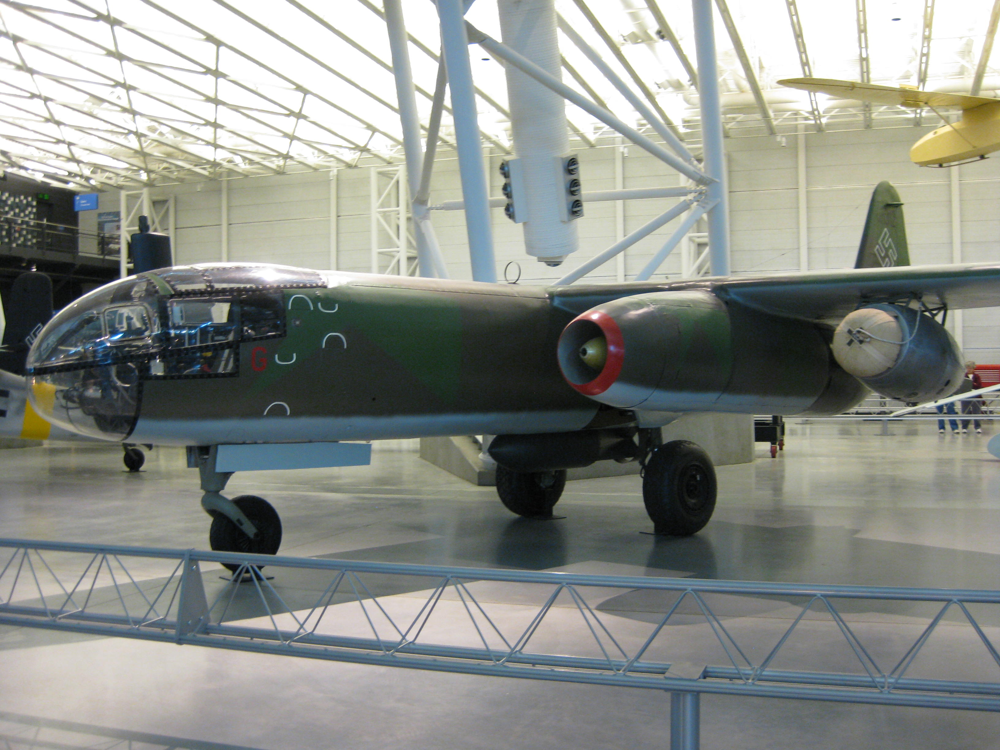
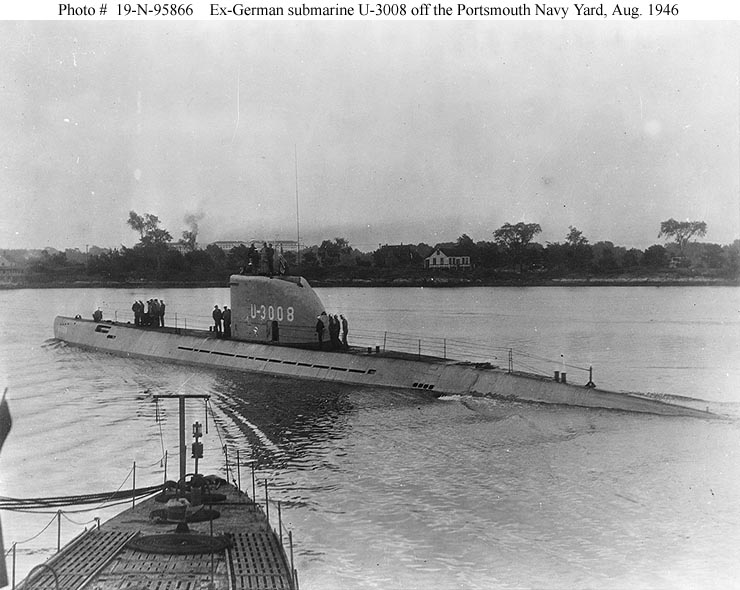

Niniejszy artykuł w obecnej formie jest dopracowanym i rozwiniętym zbiorem wszystkich wątków związanych z nowymi, eksperymentalnymi broniami III Rzeszy, które pojawiły się w tej kronice wojennej. To jest wstępna forma i będzie rozwijana.

Inne artykuły dotyczące niemieckiej armii:

- [Armia niemiecka 1918-45](/festung-breslau/article/armia-niemiecka)
- [Volkssturm](/festung-breslau/article/volkssturm)
- [SS](/festung-breslau/article/ss)
- [Wojsko na Dolnym Śląsku 1818-1945](/festung-breslau/article/wojsko-dlnslask)

### Wunderwaffe

**Cudowna broń** - jest to bardzo ogólny termin propagandowy okeślający szczególny rodzaj broni, którego wprowadzenie trwale zmieni sytuację na polu walki lub generalny układ sił i pozwoli uzyskać taką przewagę, która doprowadzi do tzw ostatecznego zwycięstwa (niem. Endsieg).  Tego pojęcia stale używano w propagandzie, nie uściślając czym konkretnie ta cudowna broń ma być. Dzięki temu wszystkie nowe środki walki mogły być uznawane za cudowne bronie.

Na froncie wschodnim największym zagrożeniem była masa czołgów T-34. Z kolei na zachodzie największym problemem były ogromne flotylle bombowców angielskich w nocy i amerykańskich za dnia bezkarnie bombardujących wszyskie niemieckie miasta od Monachium po Gdańsk. Tak więc uformowały się dwie główne rodziny cudownych broni: jedna służy do zwalczania czołgów T-34 na otwartej przestrzeni równin śródkowoeuropejskich, a druga zestrzeliwanie alianckich bombowców.

Więc na wschodzie taką cudowną bronią był np czołg Tygrys, mający przeciwstawić jakość mnogości sowieckich T-34 jak i panzerfaust, który miał dać piechocie a potem i cywilom możliwość zwalczania tychże T-34. Na froncie zachodnim odrzutowce i rakiety plot. Tu głównym narzędziem był szeroko zakrojony Jägernotprogramm, czyli awaryjny program myśliwca.

Trzecią kategorią był szczególny rodzaj wunderwaffe, którego celem była ZEMSTA, były tak określane - Vergeltungswaffe (pl. broń zemsty). Tą zemstą było zniszczenie Londynu. W późniejszym okresie wojny, kiedy Londyn znalazł się poza ich zasięgiem atakowano nimi kluczowe na alianckiej inwazji punkty, szczególnie port w Antwerpii, który był głównym źródłem zaopatrzenia alianckich sił w Europie.

Opisane są w osobnym artykule: [Vergeltungswaffe od V1 do V4 / broń zemsty](/festung-breslau/article/vergeltungswaffe)

### Awaryjny program myśliwca

3 lipca 1944 Oberkommando der Luftwaffe (OKL) z poparciem Goeringa podjęło decyzję o wstrzymaniu wszystkich programów lotnicznych na rzecz awaryjnego projektu myśliwca (niem. Jägernotprogramm). Był to koniec wszystkich projektów Amerikabomber.

Ogłoszono program Volksjäger - zakładający skonstruowanie myśliwca odrzutowego łatwego w produkcji masowej i skutecznego w niszczeniu alianckich bomnbowców. Zakładano użycie silnika odrzutowego BMW 003 i maksymalnie prostą konstrukcję, bez potrzeby używania trudnych do pozyskania materiałów. Samolot ten mógł być nawet jednorazowego użytku, w każdym razie nie był przeznaczony do naprawy. Miał być pilotowany przez ludzi po krótkim szkoleniu szybowcowym. W tej kategorii wygrał Heinkel He 162.

W ramach tego programu były rozwijane przede wszystkim istniejące już samoloty, bliskie fazie wdrożenia. Był to głównie Me 262, rakietowy Komet. Był też tłokowy, podwójny Dornier Do 335.

W zakres programu wchodziły również bombowce, ale tylko odrzutowe: Arado Ar 234, Junkers Ju 287 i Heinkel He 343.

Większość proponowanych konstrukcji nie doszła do fazy prototypu, ale niektóre były bardzo oryginalne.

- Przede wszystkim najdziwniejszy pojazd lotniczy - Bachem Ba 349 Natter.
- Drewniany szybowiec do niszczenia bombowców - Blohm & Voss BV 40.
- Wynoszony rakietą miniaturowy myśliwiec przechwytujący - Heinkel P.1077
- Miniaturowy samolot rakietowy zrzucany z bombowca - Arado E.381
- Myśliwiec z silnkiem strumieniowym zasilany koksem - Lippisch P.13a

### Ju 287

FBTODO

- Tankenstein ["The Junkers Ju 287 German Jet Bomber - Complete Documentary of The Forward Swept Wing Frankenplane" [YT 10:06]](https://www.youtube.com/watch?v=lOtSaIk-O_w)

### Me 262

W 1943 alianci z grozą odkryli, że Niemcy mają zaawansowany projekt samolotu odrzutowego. Hitler tu oczywiście musiał się wtrącić i zmusił konstruktorów do przerobienia go na bombowiec, co spowodowało poważne opóźnienie.

Pionierami w dziedzinie napędu odrzutowego byli Brytyjczycy, ale będąc od 3 września 1939 w stanie wojny z hitlerowskimi Niemcami musieli zaangażować wszystkie środki w to co się daje wyprodukowac od razu i zmodernizować na bieżąco. Własny odrzutowiec to był bardzo zaawansowany projekt, szczególnie z powodu silnika. Ówczesna technologia dopiero raczkowała, silniki były bardzo zawodne i często się zapalały. Dokładnie z tego samego powodu oba projekty i brytyjski i niemiecki zostały poważnie opóźnione.

Pierwszy niemiecki odrzutowiec Heinkel He 178 został oblatany już 27 sierpnia 1939. Ale decyzje Hitlera i szefostwa Luftwaffe były dla niemieckiego programu lotnictwa odrzutowego jednoznaczne - liczbę inżynierów ograniczono do 35, czyli program zamrożono. Wszystko musiało iść w tłoki. Dlatego prototyp Me 262 został oblatany dopiero 18 lipca 1942.

19 kwienia 1944 sformowano Erprobungskommando 262 (Erprobungskommando to nazwa jednostki mającej za zadanie wypróbowanie nowego rodzaju broni) stacjonujące na lotnisku Lechfeld k Augsburga i już podczas operacji Overlord (lądowanie w Normandii) alianci zetknęli się z nimi w boju. Szybkością i parametrami lotu przewyższały wszystkie samoloty alianckie. Przy prędkości 900 km/h stanowiły trudne do zwalczenia zagrożenie dla alianckich flotylli bombowców. W sumie wyprodukowano ich 1400 ale w danym momencie nigdy nie było więcej jak 200 sprawnych maszyn gotowych do lotu. Największy problem stanowiły oczywiście silniki. Były nie tylko zawodne, ale miały niewielki resurs, trzeba było często je wymieniać.

Alianci szybko odkryli ich słaby punkt. Charakterystyka pracy silnika powodowała, że Me 262 był bezbronny podczas startu i lądowania. Pilot nie był wtedy w stanie wykonać żadnych manewrów. Pierwszym, który zestrzelił Me 262 był legendarny Chuck Yeager (pierwszy człowiek, który przekroczył barierę dźwięku). 7 października porucznik Urban Drew zestrzelił dwa startujące Me 262.

25 lutego 1945 5 mustangów z 55th Fighter Group zaskoczyło cała startująca eskadrę Me 262, zniszczyli pięć samolotów.

Najgroźniejszym przeciwnikiem dla Me 262 był brytyjski Hawker Tempest. Alianci uznali Me 262 za samoloty tak niebezpieczne, że priorytetem było zniszczenie ich wszystkich. Najczęściej stosowaną taktyką (tzw Rat Scramble) było śledzenie Me 262 i zaatakowanie kiedy schodzi do lądowania. W odpowiedzi Niemcy ustawiali "aleje plot" czyli zagęszczenie ponad 150 dział plot 20 mm na podejsciach do lotniska. To zapewniło bezpieczeństwo Me 262.

19 marca 1945 zbombardowano główne zaklady produkujące Me 262. Efekt był niewielki bo ze względu na panowanie aliantów w powietrzu produkcja była rozproszona po wielu zakładach na sporym obszarze, a kluczowe elementy takie jak silniki Jumo 004 wytwarzano w podziemnych, fabrykach chronionych przed atakiem z powietrza.

Najlepszym przykładem był zakład w Walpersbergu, który był umieszczony w nieczynnej kopalni we wnętrzu góry. Produkowano tam kompletne samoloty, które potem wyciągano na płaski szczyt. Na nim znajdował się pas startowy, zmontownay samolot od razu leciał na docelowe lotnisko. Skrzydła powstawały w najstarszym niemieckim tunelu autostradowym w Engelberg (na zachód od Stuttgartu).

B8 Bergkristall-Esche II powstała sieć tuneli w St. Georgen/Gusen, w których pracowali więźniowie KL Gusen II. Powstawało tam prawie pół tysiąca kompletnych kadłubów miesięcznie. Średni czas życia więźnia tego obozu to pół roku. Od 35 do 50 tysięcy ludzi zmarło lub zostało zamordowanych w procesie produkcji Me 262.

31 narca 1945 pierwszy nietknięty Me 262 w rękach aliantów. Został wysłany do USA. Pilot niemiecki zmienił strony i oddał samolot.

I tegoż samego dnia: Jagdgeschwader 7 skrzydło Luftwaffe pierwsza jednostka wyposażona w całości w Me 262 osiągnęło tego dnia sówj niepobity nigdy później rekord: zestrzelono 19 4-silnikowych bombwoców i dwa myśliwce.

- Military Aviation History ["The 'Real' Reason(s) Why The Me 262 Had Bombs" [YT 38:38]](https://www.youtube.com/watch?v=SDYHd1PuR5U)

### Prędkość dźwięku

Urodzony w Nysie fähnrich (stopień odpowiadający młodszemu sierżantowi) Hans Mutke pilotujący Me 262 eskadry szkoleniowej Ergänzungs-Jagdgeschwader 2 (EJG 2) wystartował 9 kwietnia 1945 z Fliegerhorst Lechfeld k Lagerlechfeld (Bawaria) i wzniósł się na 12 tys m. Była piękna pogoda, fantastyczne warunki do lotu, widzialność na 100 km.

Ponieważ został zaalarmowany o zbliżającym się P-51 Mustang mając pełną moc silnika zaczął leciec 40 stopni w dół. Twierdzi, że nagle jego samolot wpadł w wibracje, zaczął chybotać a prędkościomierz powietrzny utknął na 1100 km/h (maksymalna prędkość samolotu to 870 km/h). Pełną sterowność maszyny odzyskał dopiero po zmniejszeniu prędkości do ok 500 km/h.

Prędkość dźwięku na tej wysokości to 1062 km/h, co oznaczałoby że Mutke byłby pierwszym człowiekiem, który przekroczył barierę dżwięku. Mutke twierdzi zresztą, że nie zdawał sobie sprawy z tego co się działo, dopiero kiedy usłyszał jak opisuje to Chuck Yeager, pierwszy człowiek, który dokonał tego z całą pewnością w 1947, zrozumiał, że być może przypadkiem przydarzyło mu się cos badzo podobnego. Wiele wskazuje, że Mutke doświadczył efektów prędkości poddźwiękowej, czyli powyżej 0.8 Macha, których kilka zdarzyło się tej wojny, pierwszy taki wypadek miał miejsce już w 1942 i dotyczyło to Republic P-47 Thunderbolt, potem miały tego dokonać P-51 Mustang i Spitfire.

Istnieje również relacja, ale bez żadnych innych dowodów czy potwierdzeń, że pilot oblatywacz Heini Dittmar 6 lipca 1944 lecąc na samolocie rakietowym Me 163B Komet V18 osiągnął prędkość 1130 km/h i dało się słyszeć grzmot dźwiękowy.

Możliwe zresztą, że pierwszym człowiekiem, który przekroczył barierę dźwięku był pilot oblatywacz Lothar Sieber, który 1 marca 1945 dokonywał oblotu pionowzlotu rakietowego Bachem Ba 349 Natter. W 55 sekund wzniósł się na wysokość 14 km. Niestety zginął podczas tego lotu.

Rutynowo prędkość dźwięku przekraczały wszystkie rakiety V2 startujące od 1942, we wrześniu 1944 V2 podczas końcowej fazy loty przekraczały prędkość 4 Mach.

Anglicy w tym czasie rozwijali projekt odrzutowego samolotu nadźwiękowego Miles M.52, który w kwietniu 1945 osiągnął fazę testów na modelach. Na początku 1946 odgórnie go wygaszono.

- [Hans Guido Mutke](https://en.wikipedia.org/wiki/Hans_Guido_Mutke)

### Messerschmitt Me 163 Komet

Napęd odrzutowy funkcjonuje na zasadzie spalania paliwa w komorze silnika. Produkty spalania są kierowane przez dysze w jedną stronę dzięki czemu na zasadzie akcja reakcja pojazd porusza się w przeciwną. Do spalania potrzebne są dwie rzeczy: paliwo oraz utleniacz. Ze względu na to jak jest dostarczany utleniacz silnik odrzutowy dzieli się na dwa rodzaje:

- silnik rakietowy - utleniacz jest dostarczany ze zbiornika
- silniki odrzutowe z dopływem powietrza, zazwyczaj określane po prostu silnikami odrzutowymi, jak sama nazwa wskazuje, utleniaczem jest tu powietrze atmmosferyczne kompresowane w turbinie przed komorą spalania.

Teraz staje się jasne dlaczego samoloty nigdy nie polecą w kosmos, po prostu powyżej pewnej wysokości atmosfera jest zbyt rzadka by zapewnić dostateczną ilość utleniacza. Pewnym rozwiązaniem byłby samolot rakietowy, czyli dodanie zbiornika z utleniaczem. Ale tu wystarczy popatrzyć na rakiety kosmiczne, które w zasadzie są głównie zbiornikami paliwa, żeby zrozumieć dlaczego nie mamy samolotów rakietowych. Tzn. prawie nie mamy.

Niemcy zbudowali w czasie wojny samolot rakietowy - Me 163 Komet. Był fenomenalną bronią z licznymi wadami. Oblatany został już 1 września 1941. Już wtedy przekroczył prędkość 1000 km/h. Ale z powodu awaryjności był to samolot równie niebezpieczny dla nieprzyjaciela jak i pilota. Sama technologia rakietowa - ogromne zużycie paliwa i konieczność transportu utleniacza powodowała nieprzezywciężalne ograniczenia. Czas lotu ok 10 minut. Potem samolot stawał się bezbronnym, powolnym szybowcem.

Alianci nie mieli jak walczyć z tymi samolotami, ale bardzo szybko opracowali prostą metodę jak ich unikać. Po prostu trasy bombowców omijały lotniska, na których bazowano te samoloty. Ze względu na ich niewielki zasięg nie było to trudne.

Prędkość była tak samo zaletą jak i wadą, z taką różnicą prędkości celowanie było bardzo utrudnione. Próbowano zoptymalizować broń montując Sondergerät 500 Jägerfaust - było to 10 jednostrzałowych, bezodrzutowych dział z krótką lufą 50 mm skierowanych ku górze, uruchamiała je fotokomórka. Zasada była prosta: Komet wlatuje pod bombowiec, fotokomórka automatycznie odpala działa. Znany jest tylko jeden przypadek zastosowania tej broni. 10 kwietnia zniszczyła brytyjskiego Lancastera.

- Mark Felton Productions ["Japan's Nazi Rocket Fighter" [YT 11:23]](https://www.youtube.com/watch?v=nggb5atqPro) | ["Mustang vs. Komet - Germany 1944" [YT 5:30]](https://www.youtube.com/watch?v=bNw3a_07OjI)
- Dark Skies ["Me 163 Komet - The Secret Nazi Rocket Fighter - Fastest Plane of WW2" [YT 12:51]](https://www.youtube.com/watch?v=D5sBgPECdtk)

### Heinkel He 162 Spatz

Zwycięzca programu Volksjäger. Górnopłat z silnikiem BMW 003 nad kadłubem i typowe dla odrzutowców chowane trójkołowe podwozie. Projkt zatwierdzono 25 września 1944. Oblot po 72 dniach - 6 grudnia. Prędkośc maksymalna 900 km/h. Zasięg ponad 900 km.

Zbudowano ich ponad 300. Zostały w niewielkim stopniu uzyte w boju w kwietniu i maju 1945.

### Dornier Do 335 Pfeil

Zaskakujący wyglądem Do 335 miał przełamać dominację aliantów na niebie, bez zastosowania napędu odrzutowego. Strzała miała dwa silniki i dwa śmigła - z przodu i z tyłu. Samolot osiągał prędkość maksymalną 760 km/h i został włączony do awaryjnego projektu myśliwca (niem. Jägernotprogramm).

Zbudowano tylko kilkanaście prototypów, tylko jeden ocalał, 22 kwietnia 1945 przejęty przez aliantów. Wywieziony do USA był testowany w ramach Operation Lusty - programu badania niemieckiej broni lotniczej.

- Mark Felton Productions ["Dornier Do. 335 - Hitler's Steel Arrow" [YT 8:02]](https://www.youtube.com/watch?v=W-0hzs7yO2Y)
- [Dark Skies "Dornier Do 335 - Fastest Piston Fighter of WW2" [YT 11:22]](https://www.youtube.com/watch?v=fri6qexq8JY)

### Arado Ar 234

Pierwsze szkice powstały na początku 1941 na złożone przez Ministerstwa Lotnictwa zamówienie na szybki samolot rozpoznawczy. Samolot był ukońcozny jeszcze w tym samym roku, ale bardzo długo nie było do niego silników. Dopiero w lipcu 1943 udało się oblatać pierwszy prototyp. W Rechlinie w czerwcu 1944 pokaz samolotu oglądał Hitler i nakazał zrobić z niego bombowiec.

Osiągał prędkość maksymalną 820 km/h i był zarówno szybszy jak i zwrotniejszy od Me 262, do grudnia 1944 trwały prace nad róznymi prototypami, ale wczesne wersje zaczęto produkować jeszcze w maju 1944 początkowo w Brandenburg nad Hawelą, potem w Neubrandenburgu i Alt-Lönewitz.

Od lipca 1944 wykonywaly loty zwiadowcze nad Francją i Wielką Brytanią. Od grudnia używano ich jako bombowców, pierwszym celem było Liège (Belgia), w marcu 1945 alianckie czołgi koło Düren (Nadrenia Północna-Westfalia) a 17 marca 1945 most na Renie w Remagen zrzucając bomby o wadze 1 tony.

2 marca 1945 k Düren Ar 234 w osłonie 71 myśliwców Messerschmitt Bf 109 zostały zaatakowane przez myśliwce Spitfire i Tempest. Dwa Arado zestrzelono, obaj piloci zginęli.

Wyposażony w radar miał być nocnym myśliwcem, ale nie odniósł sukcesów.

Pod koniec wojny coraz częsciej padały ofiarą myśliwców takich jak Hawker Tempest czy P-47 Thunderbolt.

- Military History Visualized ["Arado Ar 234 - First Jet Bomber and Variants" [YT 14:06]](https://www.youtube.com/watch?v=y7MgMbZYpy0)
- Dark Skies ["Germany Scared the US Air Force into Creating its First Jet Bomber - The B-45 Tornado" [YT 8:50]](https://www.youtube.com/watch?v=xh50hsaHaw4)

*Arado Ar 234 140312 on display at the Steven F. Udvar-Hazy Center in October 2009 
By Nick-D - Own work, CC BY-SA 3.0, [Link](https://commons.wikimedia.org/w/index.php?curid=21913617)*

### Horten Ho 229

18 lutego 1945 odbyły się dwa kolejne loty próbne drugiego prototypu samolotu braci Horten. Po 45 minutach drugiego lotu jeden z silników nagle zapłonął i zgasł, pilot podporucznik Erwin Ziller być starając się uratować cenną maszynę nie wyskoczył, ale próbował odzyskać panowanie. Zbyt mała wysokość, to był niecały kilometr, nie pozwoliła mu na to. Samolot rozbił się obok lotniska, a pilot wyrzucony podczas zderzenia z ziemią odniósł poważne obrażenia. Dwa tygodnie później zmarł.

Podsumowując:

Dotychczasowe prace były wykonywane w ramach tzw Sonderkommando IX, twórcą samolotu o oficjalnej nazwie H IX był głównie Reimar Horten, jego brat był zajęty pracą w Berlinie.

- W 1944 1 marca udalo im się oblatać pierwszy prototyp (V1), który był szybowcem testującym aerodynamikę smaolotu. Dlasze prace były wstrzymywane przez brak silnika.
- 21 wrzesnia 1944 Horten-Projekt został włączony do Jägernotprogramm.
- W końcu dostali silnik ale nie ten który był pierwotnie planowany (BMW 003), ale Junkers Jumo 004 o innej charakterystyce i rozmiarach, musieli więc drugi prototyp (V2) przebudować. Pierwszy lot 2 lutego wypadł pomyślnie.
- Jak bardzo hitlerowcy byli oderwani od rzeczywistości świadczy fakt, że Reimar Horten nie był obecny na lotnisku, bo pracował nad kolejną wersją swojego odrzutowca H XVIII, sześciosilnikowym bombowcem do ataku na USA.
- Dokładnie w tym czasie Armia Czerwona była 90 km od Berlina. I właśnie z tego powodu dalsze prace konstrukcyjne przeniesiono do Gothaer Waggonfabrik w Turyngii. Tam w marcu przystąpiono do realizacji zamówienie na 40 kolejnych samolotów Horten. Zaczęto budować kilka kolejnych, ale tylko jeden (V3) udało się prawie dokończyć 
- 15 kwietnia Gotha została zdobyta przez US Army i V3 został przewieziony do USA. Nigdy nie latał.

I to cała historia tych samolotów. Zarówno szybowiec V1 jak i V3 zostały zabrane do USA. Obecnie jedynym istniejącym egzemplarzem jest właśnie V3 należący obecnie do kolekcji Smithsonian.

Proodukujące te samoloty zakłady Gothaer Waggonfabrik zaproponowały ulepszoną wersję samolotu Horten - Gotha Go P.60. Silniki znajdowały się nie obok siebie, ale nad i pod kadłubem, a piloci byli w pozycji leżącej na brzuchu. Samolot miał pełnić rolę myśliwca. Propozycja została odrzucona przez Reichsluftfahrtministerium, które zażądało większej liczby Ho 229.

- Military Aviation History ["Was This The First Stealth Fighter? - Horten Ho 229" [YT 37:15]](https://www.youtube.com/watch?v=NSrszi6ivyM)

### Bachem Ba 349 Natter

Jedną z najdziwniejszych konstrukcji lotniczych zbudowanych pod koniec wojny przez hitlerowskie Niemcy był Natter (niem. Żmija) - drewniany pionowzlot rakietowy. Odpalany zdalnie i przez większą cześć lotu sterowany radiowo był trochę rakietą, trochę samolotem. Założeniem było osiągnięcie prędkości poddzwiękowej - 0.95 Macha. W 4,5 minuty miał osiągnąć 6 tys m. Zasięg 40 km maksymalny pułap 12 tys m. Posiadał niewielkie, masywne skrzydła i usterzenie ogonowe. Pilot miał przejąć kontrolę po wejściu w strefę celu czyli wykrytych radarami bombowców alianckich. Umieszczony nad bombowcami lotem szybowcowym miał dokonać ataku i zniszczyć bombowce rakietami. Drewniany kadłub był jednorazowy, silnik i pilot mieli wrócić na ziemię na spadochronach.

1 marca 1945 oblot w Stetten am Kalten Markt (Badenia-Wirtembergia) zakończył się katastrofą. Pilot oblatywacz Lothar Sieber zginął.

Mimo tego niepowodzenia próby kontynuowano. Do kwietnia zbudowano 36 egzemplarzy. 1 kwietnia utworzono Erprobungskommando 600. Pierwszy atak miał nastąpić w urodziny Hitlera 20 kwietnia, ale nie doszedł do skutku bo baza latnicza była zagrożona przez wojska alianckie i samoloty ewakuowano. Wszystkie zostały porzucone w Austrii. 4 maja alianci odkryli 2 spalone Żmije, kolejnego dnia 4 nietknięte. Jedna wpadła w ręce Armii Czerwonej.

Jedyny ocalały Bachem jest w kolekcji Smithsonian w Maryland.

Japończycy opracowali kopię Nattera - Mizuno Shinryu / Jinryū (pl. Boski Smok) przeznaczony do ataków samobójczych. W lipcu 1945 dbyły się próby w locie wyholowanych szybowców w układzie kaczki. Nie doszło do wyposażenia ich w rakiety startowe, ani nawet do uściślenia taktyki walki. Jako potencjalny cel rozważano przede wszystkim B-29 i okręty.

- Mark Felton Productions ["Natter Assault! Germany's Vertical Launch Fighter" [YT 9:39]](https://www.youtube.com/watch?v=XzMCZObXQw8)

### Messerschmitt Me 329

FBTODO

- [Messerschmitt Me 329](https://en.wikipedia.org/wiki/Messerschmitt_Me_329)

### Messerschmitt P.1101

FBTODO

- [Messerschmitt P.1101](https://en.wikipedia.org/wiki/Messerschmitt_P.1101)
- Tankenstein ["Complete Documentary of The Messerschmitt P.1101 -The Most Advanced Aircraft Of WWII That Never Flew" [YT 10:14]](https://www.youtube.com/watch?v=HbBa0NZG-vg)

### Amerikabomber / Ju-390

Jedną z obsesji Hitlera było zaatakowanie Nowego Jorku. Amerykanie bowiem mogli wysłać wojsko do Wielkiej Brytanii i stamtąd zaatakować okupowany przez Niemców kontynent. Sami jednak byli poza zasięgiem zarówno wojsk japońskich jak i niemieckich. Cios wymierzony w Nowy Jork przynajmniej symbolicznie wymazywałby tę nierówność.

Jednym ze sposobów na zaatakowanie Ameryki było skonstruowanie bombowców o odpowiednio dużym zasięgu. Nie było to aż tak bardzo niemożliwe, planowano bowiem wykorzystać przyjazne niebo Hiszpanii i międzylądowanie na Azorach. Stamtąd jest ok 4 tys km w jedną stronę do Nowego Jorku. Brano również pod uwagę skierowanie bombowców do lądowania w którymś z zaprzyjaźnionych krajów Ameryki Połudnniowej.

Budowę dalekosiężnego bombowca rozważano od 1938, ale dopiero na początku 1942 po wypowiedzeniu wojny USA Ministerstwom Motnictwa (niem. Reichsluftfahrtministerium) opracowało program takiego samolotu. Wszyskie okazały się zbyt drogie, skomplikowane i zawodne. Ostatecznie zarzucono konstruowanie bombowców i zatrzymano wszystkie programy rozwojowe 3 lipca 1944 na rzecz awaryjnego projektu myśliwca (niem. Jägernotprogramm).

Z 4 projektów, które w ogóle mogły się ubiegać o taką misję najbardziej zaawansowany był Ju-390, którego pierwszy prototyp został oblatany we wrześniu 1944.

Drugi prototyp (Ju 390 V2) przeznaczony do zwiadu morskiego był wyposażony w radar FuG 200 Hohentwiel opracowany przez berliński C. Lorenz AG. Konstruktor samolotu profesor Heinrich Hertel 26 września 1945 zeznał Brytyjczykom, że nigdy nie został ukończony.

Ale podporucznik Joachim Eisermann zapisał w dzienniku pokładowym, że 9 lutego 1945 w bazie lotniczej Rechlin odbył 50 minutowy lot tym samolotem wykonując kilka okrążeń, a potem 20 minutowy lot na lotnisko w Lärz. Jednak wszystkie inne świadectwa mówią, że drugi prototyp nigdy nie latał.

Inne samoloty (wszystkie tłokowe), które określano tym mianem to:

- Focke-Wulf Ta 400: anulowany już w październiku 1943. Na bazie Focke-Wulf Fw 200. Miał być wyposażony m in w silniki odrzutowe Jumo 004. Powstał tylko drewniany model do badań aerodynamicznych. [Focke-Wulf Ta 400](https://en.wikipedia.org/wiki/Focke-Wulf_Ta_400)
- Heinkel He 277: na bazie He 177. Budowany od 1941, zbudowano kilka prototypów, trzy latały. [Heinkel He 277](https://en.wikipedia.org/wiki/Heinkel_He_277)
- Messerschmitt Me 264: dwa prototypy, żaden nie latał. [Messerschmitt Me 264](https://en.wikipedia.org/wiki/Messerschmitt_Me_264)

Warto też wspomnieć o innych gigantach: [Dark Skies "The Plane Built for Hitler to Escape? - BV 238" [YT 10:08]](https://www.youtube.com/watch?v=IbIjjkY9kUk), [Messerschmitt Me 323 Gigant](https://en.wikipedia.org/wiki/Messerschmitt_Me_323_Gigant)

- [Junkers Ju 390](https://en.wikipedia.org/wiki/Junkers_Ju_390)
- [Dark Skies "Hitler's Amerika Bomber - How Germany Almost Reached America" [YT 18:33]](https://www.youtube.com/watch?v=9sdm7g8ZKUo)
- Mark Felton Productions ["Amerika Bomber - The German Plan to Bomb New York" [5:19]](https://www.youtube.com/watch?v=8hWLp0g7jYk) | ["Secret Axis Flights - Europe to Tokyo" [YT 10:22]](https://www.youtube.com/watch?v=r7PzpHNa8iM)
- Dreamtimeent ["The Nazi Plan To Bomb NY - 1998 Film feat. Wernher von Braun, The Horten brothers Eugen Sänger" [YT 43:27]](https://www.youtube.com/watch?v=rlQ37pQBctw)
- WarsofTheWorld ["The Nazi's Plans to Blitz New York City" [YT 17:54]](https://www.youtube.com/watch?v=8xuWj9su1qc)
- Okruchy Historii ["Jak Niemcy chcieli podbić Atlantyk z powietrza."](https://www.facebook.com/OkruchyHistorii.Blog/posts/5182334935129792)

### U-boot XXI

U-booty była to jedna z tych formacji, w których hitlerowcy pokładali nadzieje na zmianę układu sił w wojnie z Anglią. Nie mogli rywalizować na morzu w okrętach liniowych. Chcieli zniszczyć potęgę morską Albionu spod wody. Dzisiaj wiadomo, że tak naprawdę nie mieli na to szans. Technologie wykrywania i niszczenia okrętów podwodnych alianci rozwijali szybciej niż Niemcy zdołali je produkować. Ogółem u-booty odpowiadają za utratę kilku procent tonażu floty transportowej zasilającej Wielką Brytanię i sowiety. Ale to własnie Atlantyk był polem bitwy najbardziej zaprzątającym uwagę Churchilla, wiedział bowiem, że dopóki tam ma przewagę wojna trwa, a kiedy-jeśli ją straci, straci wszystko.

Te okręty były z dzisiejszego punktu widzenia bardzo niedoskonałe. Nieco zmodernizowane konstrukcje z czasów Wielkiej Wojny. W zasadzie były to łatwe do uszkodzenia i praktycznie bezbronne okręty nawodne z możliwością zanurzenia. Pod wodą mogły przebywać krótko.

Przełomem był dopiero produkowany od kwietnia 1944 model XXI. Jak to się uważa był to nie tylko najnowocześniejszy okręt podwodny WWII, ale przede wszystkim pierwszy okręt podwodny z prawdziwego zdarzenia. W sumie wyprodukowano ich 118.

- [Becks Hobby Productions "German WWII Submarine Type XXI (Elektroboot) - Design, construction & assembly" [YT 15:27]](https://www.youtube.com/watch?v=FJ_O4DKcdkg)
- Michał Banach ["U-booty typu XXI – najlepsze okręty podwodne II wojny światowej"](https://www.smartage.pl/u-booty-typu-xxi-najlepsze-okrety-podwodne-ii-wojny-swiatowej/)

*U 3008 już po wojnie; Portsmouth Naval Shipyard, Kittery, Maine. 
Von Photograph from the Bureau of Ships Collection in the U.S. National Archives. Photo #: 19-N-95866, Gemeinfrei, [Link](https://commons.wikimedia.org/w/index.php?curid=6295212)*

### Niemiecki program atomowy

#### KL Ohrdruf

Był to niewielki obóz koncentracyjny na południe od Gotha (Turyngia) założony w listopadzie 1944, podporządkowany KL Buchenwald. Początkowo było tam ok 10 tys więźniów, później do marca 1945 ich liczba wzrosła do 20 tys, głównie Rosjanie.

Niemiecki historyk Rainer Karlsch w 2005 opublikował książkę "Hitlers Bombe", w której przedstawia tezę jakoby 4 marca 1945 na poligonie przy obozie koncentracyjnym miała miejsce próba hitlerowskiej bomby atomowej powstałej w ramach programu atomowego pod zarządem Kurta Diebnera. Są zeznania świadków relacjonujących wybuch z wielkim, oślepiającym błyskiem, ale przeprowadzone rok po publikacji książki badania gruntu nie wykazały żadnego promieniowania wykraczajcego poza normę. Mówi się też o bombie hybrydowej, "brudnej", lub paliwowej.

Ale nawet i na to brak jest dowodów, skalę i postępy niemieckiego programu atomowego znamy z danych Operacji Alsos. Wykluczają one skonstruowanie bomby atomowej. Niemcom brakowało wszystkiego, a do tego utknęli w ślepej uliczce zależności od ciężkiej wody, kiedy właściwym rozwiązaniem było spowalnianie reakcji prętami grafitowymi.

- ["New light on Hitler’s bomb"](https://physicsworld.com/a/new-light-on-hitlers-bomb/)
- ["Hitler killed hundreds with crude nuclear bomb: author"](https://www.smh.com.au/world/hitler-killed-hundreds-with-crude-nuclear-bomb-author-20050315-gdkxjq.html)

#### Alsos Mission

Była to tajna amerykańska operacja wywiadowczo-naukowa mająca na celu zbadanie niemieckich osiągnięć naukowych, szczególnie hitlerowskiego programu nuklearnego. Drugim zadaniem, a własciwie priorytetem misji było uniemożliwienie, albo przynajmniej utrudnienie dostępu do tej wiedzy wszystkim innym, czyli także sojusznikom. Trzeba było działać śmiało i nieszablonowo. Na samym początku misja składała się z 7 oficerów i 43 naukowców.

Jeszcze w trakcie walk o Paryż 23 sierpnia 1944 dotarli do Frédérica Joliot-Curie, ponieważ było pewne, że kontaktowali się z nim naukowcy niemieccy. Paryż był ważny dla niemieckiego programu atomowego bo znajdował się tam cyklotron. Rozmawiali również z urzędnikami z Union Minière du Haut Katanga o transportach uranu do Niemiec. Udało im się wyśledzić 68 ton rudy wysłanej do Belgii i 30 ton we Francji.

23 listopada w Strasburgu odnaleźli laboratorium atomowe i pozostawionej tam dokumentacji dowiedzieli się, że Niemcy juz nie sa w stanie zbudować bomby atomowej. Wciąż istniała obawa, że użyją "brudnej bomby". W marcu 1945 od pojmanych w Kolonii Niemców dowiedzieli się, że ruda jest oczyszczana w zakładzie w Oranienburgu.

Zwiad lotniczy ustalił położenie zakładu. 15 marca 1945 został zbombardowany przez 612 bombowców B-17. Niemiecki program nuklearny został zatrzymany, jak się później okazało, na zawsze.

30 marca dotarli do miasta uniwersyteckiego Heidelberg, od pojmanych tam naukowców dowiedzieli się, że program atomowy został rozproszony w kilku małych miastach. W Stassfurcie na terenie sowieckiej strefy okupacyjnej pozyskali 11 ton uranu.

W kwietniu sformowali jednostkę znaną jako T-force i przeprowadzili operację Harborage, wyprzedzając linię frontu i dokonując rabunku wszystkiego co się da. W Hechingen, Bisingen i Haigerloch złupili laboratoria, dokumentację i co najważniejsze ciężką wodę i 1,5 tony metalicznego uranu.

#### Staßfurt

13 września 1943 w tym mieście leżacym 30 km na południe od Magdeburga (Saksonia-Anhalt) powstała filia KL Buchenwald: Staßfurt I / Neustaßfurt. Około pół tysiąca więźniów głównie z Francji i Polski pracowało tam w podziemnych zakładach Ernst Heinkel AG. Większość z nich zginęła.

11 kwietnia wciąż żyjący więźniowie uformowani w kolumnę zostali odesłaniw  marszu śmierci. Następnego dnia miasto poddało się bez walki Amerykanom.

Szybko okazało się, że jest tam prawdziwy skarb. Bezcennych 1100 ton rudy uranowej i tlenku uranu. Przed agentami Alsos stanęło powazne wyzwanie. Ponieważ miasto znajdowało się w przyszłej sowieckiej strefie okupacyjnej musieli za wszelką cenę wywieźć wszystko i to w warunkach frontowych. Ciężarówka była na wagę złota. Zajęło im to całe 10 dni (lub 3), potrzebowali 260 ładunków, ale się udało. Sowieci zostali z niczym.

Bomba atomowa, która 6 sierpnia została zrzucona na Hiroszimę zawierała 64 kg uranu. Podobno część tego uranu pochodziła ze Staßfurtu.

- ["Vor 70 Jahren: Amerikaner befreien Staßfurt"](https://www.volksstimme.de/nachrichten/lokal/stassfurt/1457877_Vor-70-Jahren-Amerikaner-befreien-Stassfurt.html)

#### Stadtilm

Stadtilm - miasto 30 km na południe od Erfurtu (Turyngia). W sierpniu 1943 grupa badawcza Kurta Diebnera zbudowała laboratorium atomowe w sklepionej piwnicy ówczesnego gimnazjum. Przeprowadzono tam eksperymenty z rozszczepieniem jąder uranu oraz testy spalania tlenkami uranu i deuteru. Na początku kwietnia Diebner zbiegł do Bawarii zabierając wyniki badań.

12 kwietnia miasto zdobyli Amerykanie.

#### Heigerloch, Hechingen, Tailfingen

22 kwietnia 1945 Misja Alsos nie napotykając oporu osiąga jednocześnie trzy cele:

- Dociera do wskazanego w Heidelbergu **Heigerloch**, gdzie w piwnicy pod kościołem zamkowym odnajdują eksperymentalny reaktor (niem. Forschungsreaktor Haigerloch), ale bez uranu i ciężkiej wody. Po kilku godzinach odnajdują ukryte w szambie dokumentację. 3 beczki ciężkiej wody i 1,5 tony (rudy?) uranu. 24 kwietnia ksiądz wynegocjował ocalenie piwnicy i dziś znajduje się tam Atomkeller-Museum z repliką reaktora.
- W **Hechingen** pojmali 25 naukowców
- W **Tailfingen** był sam Otto Hahn i 9 jego współpracowników

Wprawdzie Heisenberg wciąż jest pzoa ich zasięgiem, ale niemiecki program atomowy już nie istnieje.

- Mark Felton Productions ["Hunting Heisenberg: Capturing Germany's Atomic Secrets" [YT 10:43]](https://www.youtube.com/watch?v=QrCc9XfNoBE)
- [Operation Harborage](https://en.wikipedia.org/wiki/Operation_Harborage)

#### Heisebnberg

2 maja - ostatnie zadanie Misji Alsos wykonane. Profesor Heisebnberg pojmany.

- ["New light on Hitler’s bomb"](https://physicsworld.com/a/new-light-on-hitlers-bomb/)
- ["Hitler killed hundreds with crude nuclear bomb: author"](https://www.smh.com.au/world/hitler-killed-hundreds-with-crude-nuclear-bomb-author-20050315-gdkxjq.html)
- [Alsos Mission](https://en.wikipedia.org/wiki/Alsos_Mission)

### Zuse

Jednym z mało znanych rozdziałów historii komputerów jest działalność Konrada Zuse. Niestety jego aktywność wypadła na czasy III Rzeszy i nie jest dobrze widziany jako jeden z pionierów informatyki.

W 1941 zbudował pierwszą w pełni programowalną maszyne liczącą - Z3.

W latach 1942-45 budował kolejną maszynę Z4, która odczytywała i zapisywała dane z taśmy perforowanej.

Wiosną 1945 Z4 już działał i żeby nie wpadł w ręce sowieckie został przewieziony do Getyngi gdzie w laboratorium Aerodynamische Versuchsanstalt służył od obliczeń przepływów. Na początku kwietnia maszyna została wywieziona do Bawarii i ukryta. Tam Zuse spotkał Wehrnera von Brauna.

Po wojnie maszyną zajął się szwajcarski Seminar for Applied Mathematics. Obecnie jest w zasobach Deutsches Museum w Monachium.

Konrad Zuse założył Zuse KG które działało kilkanaście lat i w 1969 zostało przejęte przez Siemensa.

### Atak samobójczy / Total-Einsatz

W artykule o [Hannie Reitsch](/festung-breslau/article/hanna-reitsch) jest mowa o idei hitlerowskiego kamikaze. Choć nie odegrała ona żadnego znaczenia i jest to zjawisko marginalne, to ponieważ pojawia się kilkukrotnie na łamach tej kroniki zebrałem tu wszystkie informacje na ten temat.

Niemcy używali wobec misji samobójczych eufemizmu Total-Einsatz.

Wszystkie wymienione poniżej oddziały należały do Kampfgeschwader 200 (KG 200) oddziału specjalnego Luftwaffe powołanego do wykonywania nietypowych zadań, eksperymentów, testowania nieprzyjacielskich samolotów itp. Jego dowódcą był Werner Baumbach. 

#### Leonidas Geschwader

Choć koncepcja ataków samobójczych została odrzucona przez Hitlera nadal nad nią pracowano. Znany jest projekt jednostki pod nazwą Eskadra Leonidasa.

Zebrano 70 ochotników, samolot pierwszego wyboru Me 328 nie był dostępny, więc zdecydowano się na modyfikację latającej bomby V1 - Fieseler Fi 103R nazwa kodowa Reichenberg, w Segelflug Reichenberg GmbH zbudowano ich 175, większość w fabryce amunicji lotniczej w Neu Tramm (Dolna Saksonia).

Teoretycznie dawały szansę na wyskoczenie przed uderzeniem w cel, ale mały kokpit znajdował się tuż przed wlotem silnika pulsacyjnego co sprawiało, że praktycznie pilot nie miał żadnych szans. Wykonano kilka prób w locie, ale wyniki nie były dobre.

Jedynym znanym przykładem tego typu operacji była seria ataków samobójczych (Selbstopfereinsätze) dokonana przez 5 eskadrę Kampfgeschwader 200 w dniach 17-20 kwietnia mająca na celu zatrzymanie Armii Czerwonej przez zniszczenie wszystkich przepraw na Odrze. Używali czego się tylko dało, ale nie dysponowali żadnym Reichenbergieem. Zgineło 35 pilotów. Na pewno udalo się zniszczyć tylko jeden most - w Kostrzyniu nad Odrą. Już 20 kwietnia sowieci zdobyli Juteborg.

- Mark Felton Productions ["German Kamikazes - The Leonidas Squadron" [YT 10:55]](https://www.youtube.com/watch?v=D1aYEoqQgCY)

#### Sonderkommando Elbe

Celem tej jednostki było zniszczenie alianckich flotylli bombowców. Mieli to robić taranując usterzenie ogonowe. Używali Messerschmittów Bf 109 wyposażonych w tylko jeden kaem. Pilot miał wyskoczyć na spadochronie tuż przed atakiem, ale szanse na przeżycie były niewielkie.

W opracowaniu był specjalny samolot rakietowy służący do taranowania - Zeppelin Rammer (Rammjäger). Ze względu na mały dystans miał być holowany do strefy celu jak szybowiec, w trakcie misji miał go napędzać silnik Schmidding-533-Feststoffraketentriebwerk, skrzydła z płyt stalowych o grubości 3 cm miały mu umożliwić przetrwanie zderzenia, po którym zamieniał się w szybowiec. Nie ma żadnych pewnych informacji o prototypach.

Znany jest jeden przykład ataku tej jednostki. 7 kwietnia wzięło w nim udział 180 Bf 109, zaatakowano 15 bombowców, 8 zniszczono. Jednostka została rozwiązana 17 kwietnia, a piloci spieszeni i wysłani do walki w Berlinie.

- Grzegorz Bobrek ["Jak powstała samobójcza jednostka Luftwaffe" [YT 22:21]](https://www.youtube.com/watch?v=PydSnt-IBLo)
- Mark Felton Productions ["Operation Werewolf - Sonderkommando Elbe Ram Attacks 1945" [YT 12:34]](https://www.youtube.com/watch?v=y7ZRCpKlzEw)
- Yarnhub ["Sonderkommando Elbe" [YT 6:42]](https://www.youtube.com/watch?v=MDkh3tdAITU)
- [Sonderkommando Elbe](https://en.wikipedia.org/wiki/Sonderkommando_Elbe)

#### Mistel

Aktywnym przeciwnikiem samobójczych systemów broni był dowódca KG 200 Werner Baumbach. Był twórcą koncepcji bombowca hybrydowego - Mistel. 15 marca przekonał Hitlera, że samobójcza broń jest niezgodna z niemiecką tradycją.

Bombowce hybrydowe (niem. Mistelschlepp, wleczenie jemioły) to dwa połączone ze sobą samoloty, z których jeden jest bezzałogową bombą, a w drugim jest pilot, naprowadzający całą konstrukcję na cel. Podczas nalotu uzbraja bombę, kieruje ją na cel, odłącza się i wraca. Po raz pierwszy planowali je zastosować Brytyjczycy do walki z niemieckimi sterowcami, Niemcy natomiast eksperymentowali z tymi samolotami od 1942 i rok później mieli już działające Jemioły. Było wiele rodzajów tych bombowców, najczęstszą kombinacją był Ju 88 i FW 190.

8 kwietnia 1945 pięć Misteli dokonało bez powodzenia ataku na prowizoryczny, drewniany most kolejowy w Warszawie. Mosty na Wiśle miały ogromne znaczenie dla utrzymania ofensywy wiślańsko-odrzańskiej. W tym okresie Armia Czerwona dysponowała tylko trzema mostami kolejowymi na Wiśle.

- Mark Felton Productions ["German Kamikazes - The Leonidas Squadron" [YT 10:55]](https://www.youtube.com/watch?v=D1aYEoqQgCY)
- Dark Skies ["Double Stack - Germany's Top-Secret Mistel Bomber" [YT 9:27]](https://www.youtube.com/watch?v=lOJJcUu4_to)

#### Bücker Bü 181 Bestmann

Warto również wspomnieć o przystosowaniu samolotu treningowego do zwalczania czołgów. Bü 181 został wyposażony w pancerfausty umieszczone na skrzydłach.

Pirewszy raz został użyty w tej roli 19 kwietnia w okolicy Tübingen (Badenia-Wirtembergia), 6 Bü 181 nie znalazło żadnych czołgów ale udało się zniszczyć kilka ciężarówek. 20 kwietnia również nie udało się znaleźć celu. Ostatnim zadaniem jednostki było zniszczenie własnych samolotów pozostawionych na lotnisku 24 kwietnia.

- Mark Felton Productions ["Last Ditch German Tank Busters 1945" [YT 4:31]](https://www.youtube.com/watch?v=hNwnPA_lMfU)

### Henschel Hs 293

- [Henschel Hs 293](https://pl.wikipedia.org/wiki/Henschel_Hs_293)

### I-400

- War Stories with Mark Felton ["Target Australia! Japanese Submarine Attacks on Sydney and Newcastle (Ep. 1)" 21:41](https://www.youtube.com/watch?v=L20_CFo8SqA)

### X-4

- [X-4 – kierowany pocisk rakietowy powietrze–powietrze opracowany w latach 1942–1944 w zakładach Ruhrstahl przez dra Maksa Kramera.](https://www.facebook.com/groups/735333356987206/permalink/1134708220383049/)
- Military Aviation History ["German Anti-Air Missiles of World War 2" [YT 6:47]](https://www.youtube.com/watch?v=Cx_lsh0BJGs)

### Odnośniki

- Yarnhub ["When Me-262s Battled Mustangs Over Germany" [YT 6:11]](https://www.youtube.com/watch?v=ZsjMBMv0w0g)
- Mark Felton Productions ["B-17 Flying Bombs - WW2 Attack Drones" [YT 9:37]](https://www.youtube.com/watch?v=eTvX0cB2ER8)
- Lost Battlefields w Tino Struckmann ["LAST NAZI SECRET ON THE GROUND IN PENEMUNDE SPECIAL." [YT 1:25:07]](https://www.youtube.com/watch?v=TIqQLFJS0N4)
- Military Aviation History ["Secret Weapon? Panzerblitz: 1944 Luftwaffe Anti-Tank Rocket" [YT 33:42]](https://www.youtube.com/watch?v=6KK0wkNmTYM)
- Dark Docs ["Operation Pastorius - Hitler's Dream to See New York in Flames" [YT 11:30]](https://www.youtube.com/watch?v=Nf7T24DMmSE)

### Źródła

- Dudziak Marek "W poszukiwaniu Wunderwaffe. Bronie V na ziemiach polskich" Replika 2018, 240 s, ISBN 978-83-7674-585-5
- Leszek Adamczewski "Burza nad Provinz Pommern" Replika 2012, ISBN 978-83-66481-13-8, 416 s;"Z Peenemünde do gwiazd" s 93-106, "W rytmie bałtyckich fal" s 120-137