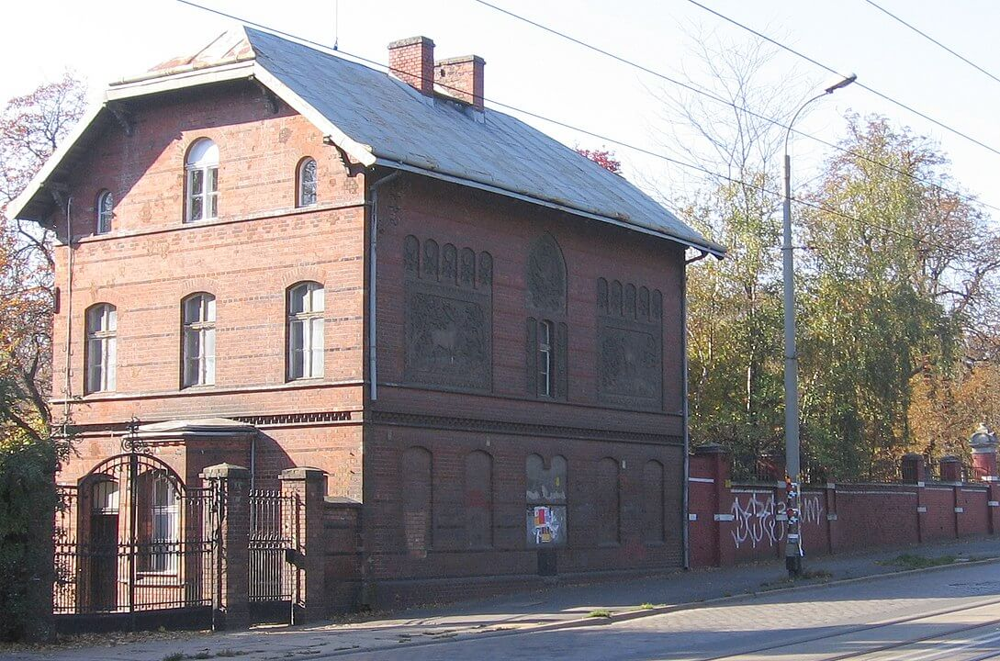

<DolnySlask />

### Wstęp

Wrocław pod wieloma względami jest miastem wyjątkowym. Ma ogromne tradycje w dziedzinie ogrodów i parków.

Do początków XIX wieku jest typowym ufortyfikowanym miastem uwięzionym w ciasnocie murów, śmierdzącym i zabłoconym. Czasem cenną przestrzeń miejską poświęcano, tworząc małe ogrody. Istniały one w klasztorach i rezydencjach miejskich. Oprócz estetycznego miały one również znaczenie gospodarcze. Już na najdawniejszych wizerunkach Wrocławia możemy ujrzeć fontanny, których zadaniem było polepszanie powietrza i walka z wszechobecnym kurzem. Ale cały czas, żeby naprawdę odetchnąć przyrodą, trzeba było opuścić miejskie mury.

### Ogród Laurentiusa Scholza

Ewenementem i unikatem w historii europejskich ogrodów był wrocławski ogród botaniczny Laurentiusa Scholza - syna wrocławskiego aptekarza i wykształconego m.in. na uniwersytecie w Bolonii lekarza. Scholz kontynuował tradycje naukowe innego znanego wrocławskiego naukowca i lekarza: Cratona von Craftheima, a do Wrocławia wrócił na stałe w 1585 (w tym roku umarł Crato) i tu spędził resztę życia.

Już w dwa lata po przyjeździe tworzy swój ogród - znany w całej Europie dzięki wydanemu w 1594 zbiorowi 50 epigramatów "In Laurentii Schol zii hortum epigrammata amicorum". Był to schyłek renesansu, w Anglii najlepsze lata epoki elżbietańskiej, rok później Drake niszczy hiszpańską Wielką Armadę.

Przedwcześnie, w wieku zaledwie 47 lat, Scholz umiera, a ogród kupuje aptekarz Kalenberg i przeznacza go pod uprawę ziół leczniczych. Dlatego Wrocławianie dość szybko zapomnieli o tym ogrodzie.

Ale w Europie ogród był znany dzięki publikacjom. Choć istniał tylko 12 lat, ogród Scholza był tworem epoki końca renesansu i łączył w sposób typowy dla manieryzmu arteficialia (wytwory rąk ludzkich: dzieła sztuki, fontannę) i naturalia: muzeum osobliwości, labirynt z rosarium, cieplarnię, piramidy z rzadkich kamieni, urządzano tam Floralia Vratislaviensia (sympozjony platońskie ze ścisłym regulaminem i nakazem tajemnicy), najwięcej jednak miejsca zajmował ogród botaniczny, gdzie rosło prawie 400 gatunków na osobnych grządkach. Jeden z najciekawszych ogrodów renesansowych w krajach niemieckich i w tym czasie nie miał odpowiedników. Niestety jego dzieło nie przeistoczyło się w jakąś dłużej trwającą tradycję.

Znajdował się dokładnie pomiędzy kościołem pw. św. Krzysztofa a budynkiem IX LO (zbudowanym w latach 1891-93 jako Szkoła Ludowa "Kanonenhof"). Obecnie w tym miejscu wznosi się nowy biurowiec Skanska - na miejscu dawnej drukarni.

### Demolicja

Dopiero rozkaz demolicji wydany przez Hieronima Bonapartego redefiniuje przestrzeń miejską na wzór francuski. Już bowiem Ludwik XIV "Król Słońce" (fr. le Roi-Soleil) uznał, że Francja jest bezpieczna, a jej stolica nie potrzebuje murów i w latach 70. XVII dokonał rozbiórki fortyfikacji, tworząc Wielkie Bulwary (fr. Les Grands Boulevards) i monumentalne bramy miejskie. Było to posunięcie polityczne, raczej manifestacja potęgi kraju niż stwierdzenie nieużyteczności fortyfikowania miast. Bardzo długo jeszcze doktryna wojskowa nakazywała utrzymywanie i rozbudowę umocnień miejskich.

Dopiero epoka napoleońska ostatecznie udowodniła ich brak użyteczności. W ten sposób francuskie rozwiązanie urbanistyczne zostało przyniesione do Wrocławia za pośrednictwem francuskiego dowódcy. Wrocław posiada mnóstwo takich śladów francuskiej myśli architektonicznej i urbanistycznej - od obecnych resztek Kaiser-Wilhelm-Straße, czyli Alei Powstańców Śląskich po Hotel Monopol. Mieszczanie wrocławscy starali się bowiem czerpać z najlepszych wzorów, a zanim słońce wzeszło po drugiej stronie Atlantyku, to Francja wiodła prym w tej dziedzinie. Za pewnego rodzaju skundloną formą takiego importu można uznać (uwaga: żart) pseudocorbusierowskie blokowiska, nasze PRL-owskie maszyny do mieszkania.

Główną przyczyną rozkazu demolicji był oczywisty fakt, że armia francuska nie chciała kłopotać się wrocławskimi fortyfikacjami. Pomimo, że zdobycie miasta nie było jakimś problemem. Inicjatywa ta została przyjęta przez wrocławian z entuzjazmem, na te cholerne urządzenia fortyfikacyjne wydawali każdego roku fortunę, siedzieli za murami jak w więzieniu, a same fortyfikacje zajmowały tyle samo miejsca to miasto. No, i już nie były to czasy na miasta-twierdze tego typu.

### Promenada

W ciągu kilkudziesięciu lat - w głównym zarysie do lat 80. XIX - na linii dawnych fortyfikacji zbudowano obecną Promenadę (słowo pochodzenia francuskiego), która łączyła miejskie tereny zielone.

### Uniwersytecki ogród botaniczny

Jeszcze w epoce napoleońskiej, w 1811 władze pruskie zlikwidowały dwa słabe uniwersytety, mając nadzieję utworzyć nowy: stworzony przez jezuitów uniwersytet wrocławski oraz Viadrinę z Frankfurtu nad Odrą. W ich miejsce utworzyły państwowy pruski uniwersytet Śląski Uniwersytet im. Fryderyka Wilhelma (Schlesische Friedrich-Wilhelms-Universität Universitas Leopoldina). Warto dodać, że zaledwie rok wcześniej powstaje Uniwersytet Humboldta w Berlinie (HU Berlin; Die Humboldt-Universität zu Berlin), pokazuje to skalę reformy w państwie pruskim. Nowo powstały uniwersytet w przeciwieństwie do instytucji jezuickiej spełnia wymogi co do minimalnej ilości wydziałów, ma ich pięć: teologii katolickiej, teologii ewangelickiej, prawa, medycyny i filozofii. Od razu też powstaje jego Ogród Botaniczny. Przez wiele lat zarówno uniwersytet, jak i ogród są pozbawionymi większego znaczenia prowincjonalnymi instytucjami.

### Ogrody miejskie

Pod koniec XVII zaczyna się w Europie tworzyć miejskie ogrody i promenady, np. istniejący od 1649 berliński Großer Tiergarten, fundowane przez władców lub magnatów, później przez władze miejskie.

W przypadku prywatnych parków czasem wstęp biletowano.

Taki był właśnie początek najstarszego i największego wrocławskiego parku miejskiego - Parku Szczytnickiego. Jego początkiem był założony we wsi Szczytniki (Scheitnig) prywatny ogród księcia Ludwiga von Hohenlohe-Ingelfingen, przedstawiciela jednego z najbogatszych rodów niemieckich i jednocześnie dowódcy miejskiego garnizonu. Część tego ogrodu w formie dzikiego parku w stylu angielskim została odpłatnie udostępniona jako teren spacerowy w 1789.

W latach 1801-15 miasto wykupiło ten obszar, uznając, że stanowi doskonałe miejsce na przyszły park miejski. Same Szczytniki włączono do miasta dopiero w 1868, więc ściśle rzecz biorąc były to wówczas tereny podmiejskie. Z powodów finansowych początkowo nic tam się nie działo, dopiero w 1854 zapada decyzja o scaleniu dawnego Ogrodu Książęcego i utworzeniu tam parku miejskiego, ułatwiła to powódź, która dotknęła m.in. Szczytniki i umożliwiła wykupienie resztek terenu znajdujących się w rękach prywatnych. Już od 1833 wrocławianie emocjonują się wyścigami konnymi na pobliskim Dąbiu. I z taką właśnie sytuacją wkraczają Szczytniki w finansowe prosperity lat 60. XIX. W 1863 wybucha powstanie styczniowe, w USA trwa wojna secesyjna, a wrocławianie wznoszą nowy budynek Ratusza.

### Heinrich Göppert

Człowiekiem o wielkich zasługach dla Wrocławia, którego koniecznie trzeba w tym miejscu wspomnieć, jest Heinrich Robert Göppert (1800-84), lekarz botanik i działacz społeczny. Studiował we Wrocławiu i Berlinie. Odznaczył się już podczas epidemii cholery w 1831 (tej samej, którą ściągnęli do Europy Rosjanie, tłumiąc powstanie listopadowe i która zabiła Clausewitza).

Już od 1926 jest związany ze Śląskim Towarzystwem Kultury Ojczyźnianej (Schlesische Gesellschaft für Vaterländische Kultur) jedną z najważniejszych organizacji społecznych we Wrocławiu i na Śląsku. Od 1846 aż do śmierci jest jego prezesem. W latach 1846/47 jest rektorem uniwersytetu.

Ale zajmuje go głównie praca badawcza i popularyzatorska. Od 1852 do śmierci jest dyrektorem Ogrodu Botanicznego i nadaje mu obecny kształt, udostępnił go do zwiedzania. Zajmuje się pochodzeniem węgla kamiennego, brunatnego i bursztynu, tworzy w Ogrodzie Botanicznym zachowany do dziś profil geologiczny zagłębia wałbrzyskiego, które wówczas się dynamicznie rozwija. Wprowadza też wiele zmian w Parku Szczytnickim. Założył Muzeum Botaniczne, był jednym z inicjatorów powstania Śląskiego Muzeum Sztuk Pięknych. W 1875 został honorowym obywatelem Wrocławia. Jest zaangażowany właściwie w każdą inicjatywę związana z miejską zielenią, higieną czy popularyzacją nauki.

Jest również jednym z inicjatorów i założycieli wrocławskiego ogrodu zoologicznego (Zoologischer Garten).

### Zoo

Tradycja trzymania i pokazywania egzotycznych zwierząt sięga starożytności. Za najstarszy istniejący ogród zoologiczny w Europie uważa się wiedeński Tiergarten Schönbrunn powstały w 1752, udostępniony publiczności 10 lat później. W 1775 powstaje zoo w Madrycie a w 1795 menażeria królewska z Wersalu - króla ścięto dwa lata wcześniej - zostaje przeniesiona do paryskiego ogrodu botanicznego w Jardin des Plantes.

W XIX wieku ogrody zoologiczne, dotąd instytucja królewska, stają się w wyniku powszechnego zainteresowania historią naturalną i rozwojem nauki i techniki instytucjami państwowymi, często związanymi z uniwersytetami, mającymi na celu jednocześnie cele badawcze i popularyzację. Tak jest do dzisiaj. W 1826 powstaje Zoo w Londynie, a w 1831 w Dublinie. W 1844 powstaje pierwsze pruskie Zoo - w Berlinie, drugim jest wrocławskie.

### Zoo we Wrocławiu

Komitet założycielski powołany z inicjatywy nadburmistrza dra Juliusa Elwangera składający się z aptekarzy, lekarzy, arystokratów i naukowców działał już od 1863. Ponieważ nie udało się zgromadzić potrzebnych funduszy, 21 marca powołano Towarzystwo Akcyjne z kapitałem 100 tys. talarów, za które kupiono 8 ha, ogród otwarto w październiku 1864. Jego pierwszym dyrektorem aż do śmierci w 1882 był Franz Schlegel, a za dobór i opiekę nad zwierzętami odpowiadał - oczywiście! - profesor Heinrich Göppert.

Oficjalne otwarcie nastąpiło 10 lipca 1865. Lwy tygrysy i lamparty mieszkały początkowo w wozach cyrkowych. Na samym początku zoo miało 189 zwierząt w tym 165 podarowanych przez wrocławian. Ale szybko się rozwijało, już wkrótce prezentowano w nim 400 zwierząt z 50 gatunków.

Najstarszym budynkiem i jednym z najstarszych we Wrocławiu przykładów neogotyku jest baszta niedźwiedzi zbudowana na rok przed oficjalnym otwarciem ogrodu, w 1864. Niedźwiedzie były już tam w dniu otwarcia i stanowiły wówczas największą jego atrakcję.

Kilka lat później pojawił się pierwszy słoń. Żeby go kupić, zorganizowano trwającą trzy miesiące loterię fantową, wrocławianie zrobili zbiórkę przedmiotów losowanych później jako nagrody. Z London Zoo kupiono słonia indyjskiego o imieniu Peter, za 450 funtów szterlingów (obecne 30 tys dolarów). Do Wrocławia przywieziono go uroczyście w 1873, na statku dotarł przez Hamburg do Szczecina, tam został załadowany na wagon kolejowy i przywieziono go na ówczesny Dworzec Górnośląski (w pobliżu Dworca Głównego). Stamtąd na specjalnie przygotowanym wozie ciągniętym przez 6 koni triumfalnie przejechał przez całe miasto. Umieszczono go w specjalnie wzmocnionej stodole i nadano nowe imię - Theodor. Jako największe i najbardziej egzotyczne zwierzę był niekwestionowaną gwiazdą zoo. Dopiero po piętnastu latach, w 1888, doczekał się słoniarni z prawdziwego zdarzenia, niestety w tym samym roku zdechł. W całej historii było 25 słoni.

Najbardziej osobliwą i kontrowersyjna z dzisiejszego punktu widzenia atrakcją były tzw. "wystawy ludów egzotycznych", pierwsza miała miejsce w 1876. Było to popularne w ogrodach francuskich i angielskich, gdzie prezentowano tubylców z kolonii, w Anglii mówiono "ludzkie zoo" (ang. Human zoo), a we Wrocławiu były to "pokazy ludów etnicznych" (niem. Völkerschau).

Do Wrocławia przez Hamburg przyjeżdżały grupy składające się z całych rodzin ze zwierzęcym dobytkiem, m.in. psami, kozami i końmi. Pokazywali, jak wygląda ich codzienne życie. Organizowano pokazy jazdy konnej, rzucania dzidami i strzelania z łuku. Takie prezentacje trwały od kilku do kilkunastu dni i cieszyły się niebywałym powodzeniem, zyski ogrodu rosły niesamowicie. Byli m.in. Beduini i Tunezyjczycy. To właśnie oni w lipcu 1904 dokonali niepobitego do dziś rekordu - w jeden dzień, w czasie 9 godzin, zoo odwiedziło 41 tys. osób.

<BoxImageWrapper>

Dawne wejście do Zoo. 
Domena publiczna, [Link](https://commons.wikimedia.org/w/index.php?curid=393109)
</BoxImageWrapper>

Lata 1887-89 to okres rozkwitu, powstały wtedy trzy kolejne pawilony: ptaszarnia, słoniarnia (zachowana w praktycznie niezmienionym stanie, unowocześniono ją tylko wg współczesnych wymogów) oraz wiele razy przebudowywana małpiarnia. Także pawilon drapieżców. W tym czasie stało się jednym z największych ogrodów zoologicznych na świecie.

Do osiągnięć z tych czasów zalicza się przede wszystkim pierwsze w świecie urodziny tapira malajskiego. Niezwykłą popularnością cieszyła się gorylica Pussi, kupiona w 1894 za 2400 marek w ogrodzie w Liverpoolu we wrocławskim zoo przeżyła aż siedem lat, co wówczas było rekordem długości życia małpy w niewoli. W 1898 dojrzała i regularnie co 4 tygodnie wykazywała oznaki podniecenia seksualnego, rozkładając tylne nogi na widok pielęgniarza. Zdechła z powodu choroby nerek w 1906, pozostał po niej posąg z brązu w gabinecie dyrektora, dzieło rzeźbiarza Kieselweltera. Dyrektor Stechmann w testamencie przepisał oszczędności swojego życia 38 tys. marek na potrzeby ogrodu. Na początku XX wieku było 318 tysięcy zwiedzających.

### Okres międzywojenny

Wielka Wojna, chociaż oszczędziła Wrocław militarnie, dla zoo okazała się katastrofalna. Liczba oglądających spadła do 200 tys. Zoo było spółką akcyjną i bez zysków nie mogło przetrwać. 1 kwietnia 1921 zostało zamknięte, przez miesiąc sprzedawano zwierzęta, m.in. do Berlina, Lipska i Kolonii. Teren ogrodu stał się ogólnodostępnym parkiem, pawilony przystosowano do nowych celów: restauracja i sala koncertowa w słoniarni, kawiarnia Mokka-Haus w ptaszarni, pawilon zwierząt drapieżnych planowano zamienić w pokazową mleczarnię (jak drezdeńską Molkerei Gebrüder Pfunds).

W 1927 ogród zoologiczny otwarto na nowo, dzięki bezzwrotnej pożyczce, jakiej udzieliły władze miasta, które w ten sposób stało się pośrednio jego właścicielem. W kilka tygodni przywieziono kilka tysięcy zwierząt. Podczas pierwszego roku przewinęło się ponad milion zwiedzających. W latach 30. XX wrocławski ogród należał do światowej czołówki, miał prawie 2 tysiące zwierząt.

Kiedy do władzy doszli naziści, pierwszy powojenny dyrektor Hans Honingmann z powodu żydowskiego pochodzenia wyemigrował do Anglii.

Gwiazdą był wychowany przez pielęgniarzy szympans Moritz, posiadał wiele cyrkowych umiejętności, m.in. jeździł na rowerze, pił herbatę i palił papierosy. Były słonie, niedźwiedzie malajskie i manat (krowa morska).

### Wojna

Podczas wojny zoo funkcjonowało bez zakłóceń. Opinia bezpiecznego schronu Rzeszy, jaką cieszył się Wrocław, spowodowała nawet zwiększenie jego oferty, przywożono tu zwierzęta z innych zagrożonych miast niemieckich: samica słonia indyjskiego, szympans i orangutan z Norymbergi, a z Düsseldorfu słoń afrykański.

Wszystko to skończyło się gwałtownie w styczniu 1945, kiedy pierwsze bomby spadły na miasto. Na zoo pierwsza bomba spadła jeszcze 7 października 1944 niszcząc kasę - jakże to symboliczne. Zniszczony też został stojący obok od 1884 niedźwiedź z brązu. Ale nikt nie zginął. Za małpiarnią znajdował się bunkier.

Z dnia na dzień bombardowania stały się codziennością, wkrótce oprócz bomb lotniczych na Wrocław zaczęły spadać pociski artyleryjskie. Zwierzęta wpadły w panikę. Zdarzało się, że uciekały ze zniszczonych pawilonów i klatek. Jedna z kobiet opowiadała, że przerażony tygrys padł jej do stóp.

### Zagłada

Wobec zagrożenia komendant miasta nakazał zabicie wszystkich większych zwierząt, które jeśli wydostaną się z zamknięcia, mogłyby stanowić zagrożenie. Decyzja ta nie była niczym oryginalnym ani nie dowodziła okrucieństwa - to samo robiono we wszystkich niemieckich ogrodach zoologicznych. Niektóre zwierzęta ginęły z powodu ostrzału. Należała do nich wrocławska osobliwość, znajdujący się tu od 1934 manat, jedyny w Europie, a jeden z nielicznych na świecie. Mieszkał w betonowym basenie 4x4m, w którym było 80 cm wody, przyczyną śmierci było wybicie wszystkich szyb i wychłodzenie. Z przeziębiania i stresu zdechły hipopotam karłowaty, mandryl i trzy szympansy.

Zagłada zwierząt z wrocławskiego zoo jest tematem opowiadania Kornela Filipowicza "Egzekucja w zoo" i filmu Jana Rutkiewicza z 1975 pod tym samym tytułem.

- Najpierw zabito drapieżniki. 13 lutego na rozkaz komendanta Twierdzy w zoo pojawił się oddział saperów ze Szczytnik pod dowództwem lekarza Herberta Kraekera. Jak później napisał: "*Przed nami nasze ukochane zoo. Dyrektor Martin Schlott przywitał nas przygnębiony i smutny. Skierowaliśmy się najpierw ku wilkom. Padły na miejscu trafione strzałami karabinowymi z bliskiej odległości. Bystro i nieufnie mierzyły nas wzrokiem*". Następne były niedźwiedzie brunatne. Na odgłos strzałów schowały się, żołnierze i pielęgniarze przywoływali je do siebie smakołykami. Wszystkie zginęły, z wyjątkiem niedźwiedzicy Loli, która ukryła się za kamieniami i pozostała niezauważona. Potem przyszła kolej na białe niedźwiedzie. "*Dyrektor Schlott stał trupio blady, z twarzą odwróconą od zwierząt. Łzy płynęły mu po policzkach. Dzieło jego życia ulegało zagładzie*". Kolejno: lwy, lamparty, tygrysy.
- 18 lutego, zaraz po oblężeniu i odrzuceniu sowieckiego ultimatum, Zoo jest pod ostrzałem artylerii sowieckiej, giną dwa hipopotamy: Paula i julia
- bomby zniszczyły wiele klatek z papugami i innymi kolorowymi ptakami śpiewającymi, te które ocalały pofrunęły do Parku Szczytnickiego, większość padła ofiarą mrozu i drapieżników, w 1945 zima byłą sroga.
- W marcu przychodzi na świat żyrafa Christel.
- 21 marca bomby z sowieckiego samolotu spadają na wybiegi jeleni i wielbłądów, większość z nich ginie.
- Podczas karmienia słoni ginie na wybiegu trafiony odłamkami opiekun Wilhelm Skropke.
- 25 marca, gdy mała żyrafa i jej matka pierwszy raz wychodzą na wybieg, samolot sowiecki z lotu koszącego ostrzeliwuję bronią pokładową, w ostatniej chwili udaje im się schronić w żyrafiarni (Giraffenhaus).
- W 1945 zoo miało 4 słonie, zabito je 30 marca, podobno ich mogiła znajduje się pod wybiegiem dla słoni, jednak nie ma na to żadnych dokumentów. Kwestią dyskusyjną jest czy wszystkie zwierzęta mogli zabić żołnierze, nawet z bliskiej odległości broń wojskowa nie nadaje się do zabijania niedźwiedzi i słoni. Na wyposażeniu zoo znajdowała się broń myśliwska należąca do dyrektora. Normalną rzeczą jeszcze na początku XX wieku było, że dyrektorzy ogrodów zoologicznych udawali się na safari i polowali na grubego zwierza w Afryce.
- 5 kwietnia bomby trafiają w ptaszarnią, fala uderzeniowa miażdży delikatne płuca ptaków, inne giną od odłamków rozpryskujących sie szyb.
- 13 kwietnia pocisk trafia w żyrafiarnię, na miejscu giną ojciec i matka, Christel 4 dni później, w jamie brzusznej miała wielki odłamek pocisku.

Ofiarą wojny padła 1/3 zwierząt wrocławskiego zoo. Przetrwało 200 może 300 zwierząt: jedna z czterech żyraf, hipopotamy, tapiry, zebra, wielbłądy, pawiany masajskie, niedźwiedzica Lola, lew Astor i szympans Moritz. Hipopotam nilowy Lorbas koniec wojny przeżył w podwrocławskiej wsi. Trudno dokładnie ocenić straty wojenne, bo to, co nastąpiło potem, wcale nie było lepsze. Żołnierze i szabrownicy zabijali zwierzęta dla mięsa, a czasem i dla zabawy. Niektóre zwierzęta zbiegły i błąkały się po ulicach, świadkowie wspominali małpę, która wędrowała ulicami wraz ze swoim dzieckiem. Wszystkie budynki były uszkodzone, jak później napisał pierwszy dyrektor polskiego zoo, Karol Łukaszewicz:
>W ogrodzie nie istniała ani jedna szyba, nie działało centralne ogrzewanie, nie było wody.

### Po wojnie

Z powodu powojennego szabru budynki i cała infrastruktura zoo ucierpiała bardziej niż w wyniku wojny.

Ponieważ wobec ówczesnych potrzeb nie było możliwości odbudowy ogrodu, podjęto decyzję o jego likwidacji. Zwierzęta, które przeżyły, odesłano do Poznania, Łodzi i Krakowa. Szympans Moritz trafił do Łodzi, żyrafa do Poznania - oba zwierzęta zdechły jeszcze w tym samym roku. Pracownicy poznańskiego zoo trafili na sowiecki patrol, który o mało ich nie rozstrzelał za szaber, na szczęście jeden z nich w ostatniej chwili przypomniał sobie jak się po rosyjsku nazywa hipopotam - begiemot. Zaciekawieni żołnierze zajrzeli na ciężarówkę i kiedy zobaczyli zwierzęta, konwojowali ich aż do Poznania.

Ostatni niemiecki dyrektor zoo, Schlott, wyjechał z Wrocławia w 1946 i został dyrektorem zoo w Wuppertalu. Zmarł na atak serca w 1950. W 1947 do Wrocławia przyjechał późniejszy dyrektor zoo Łukaszewicz i opisywał je:
>Rozwalone budynki i urządzenia, okna bez szyb, spalone i postrzelane kikuty drzew, pnie leżące w poprzek ścieżek, na trawnikach zoo groby i pokrzywy, na wybiegach ziemniaki i pomidory, w ptaszarni wywieszona bielizna, w pawilonie antylopy mieszkający ludzie, a w bibliotece ogrodu zamiast książek worki z kaszą i połcie słoniny.

O odbudowie zoo prawdopodobnie zadecydowała Wystawa Ziem Odzyskanych odbywająca się w pobliskiej Hali Stulecia (wówczas Hali Ludowej). Teren dawnego ogrodu straszył jak wyrzut sumienia, Już w 1947 historia wrocławskiego zoo zaczyna się na nowo. Ale to jest - oczywiście - temat na oddzielną opowieść.

Dziś zoo wrocławskie jest najstarszym i największym ogrodem zoologicznym w Polsce, zajmuje teren 30 ha, znajduje się tam 7 tysięcy zwierząt należących do 1 tysiąca gatunków. W tym roku będzie obchodzić 156 rocznicę powstania. Znajduje się w grupie 20 najstarszych ogrodów zoologicznych na świecie. Unikalną wartością jest zachowany w 70% układ ścieżek oraz stare XIX-wieczne pawilony. W innych ogrodach zostały zniszczone podczas wojny lub rozebrane z powodu modernizacji, wrocławskie ocalały i są atrakcją samą w sobie, wielu gości z zagranicy przyjeżdża głównie z ich powodu.

### Odnośniki

- ["Wrocławskie zoo przed wojną. Jakie zwierzęta w nim mieszkały? (UNIKATOWE FOTOGRAFIE)"](https://wroclaw.naszemiasto.pl/wroclawskie-zoo-przed-wojna-jakie-zwierzeta-w-nim-mieszkaly/ar/c13-7979931)
