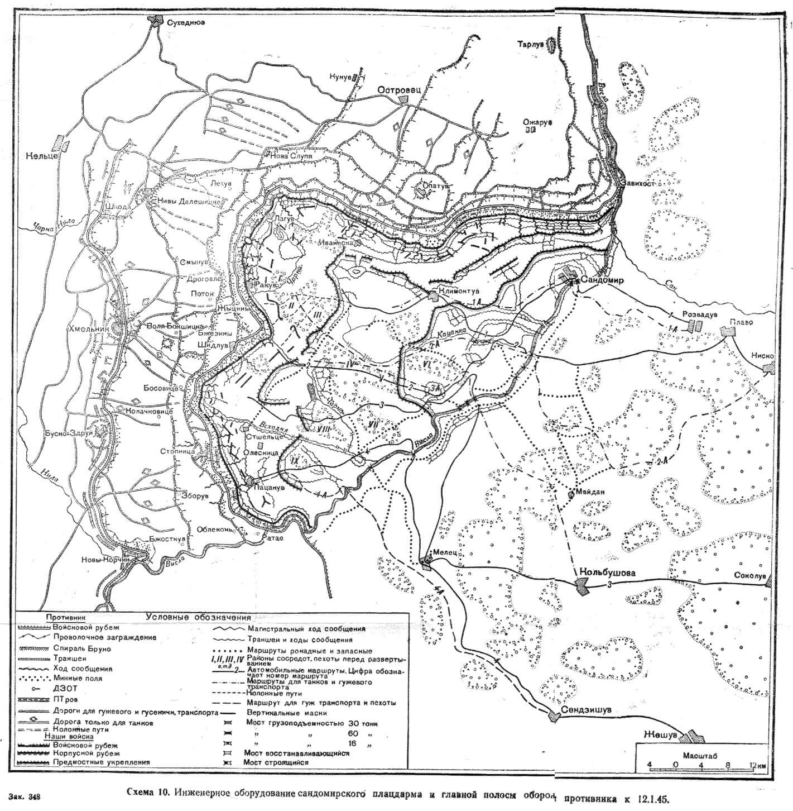

### Atak!

Dziś o czwartej rano, prawie cztery godziny przed świtem, zaczęło się przygotowanie artyleryjskie ostatniej ofensywy tej straszliwej wojny.

1 Front Ukraiński pod dowództwem marszałka Iwana Koniewa rozpoczął operację sandomiersko-śląską, pierwszą część operacji wiślańsko-odrzańskiej. Jak sama nazwa wskazuje, celem operacji było wyjście z linii Wisły i dojście do Odry.

### Operacja wiślańsko-odrzańska

Głównym celem początku operacji wiślańsko-odrzańskiej było przełamanie linii Wisły w środku zimy, ponieważ tylko gruby lód umożliwiał przebycie tak wielkiej rzeki przynajmniej piechocie i lekkim pojazdom bez pomocy saperów. Na lodzie też łatwiej zmontować przeprawy. Był mróz, ale temperatura rzadko schodziła poniżej 15 stopni. Ziemia wszędzie była pokryta śniegiem, ale nie napadało go wiele. Doskonałe warunki do przeprowadzenia operacji ofensywnej. Ze względu na skutą mrozem ziemię i stałe ujemne temperatury zły czas na obronę. Śnieg zapewniał widzialność także w nocy, a to sprzyjało stronie mającej przewagę w powietrzu. Rubież Wisły i na śląskim odcinku również Odry musiały zostać pokonane jeszcze w styczniu.

To zaskakujące, ale aż do połowy stycznia dowództwo niemieckie nie tylko w ogóle lekceważyło front wschodni, ale nawet na tym froncie wschodnim za priorytetowe uznawało Prusy Wschodnie, gdzie była wielka koncentracja armii i miliony niemieckich cywilów oraz odcinek węgierski, którego upadek oznaczałby odcięcie od resztek ropy i odcięcie wojsk na Bałkanach. To, że wschodnia Warszawa jest w rękach sowieckich, nie spowodowało wzmożenia obrony na najkrótszej drodze z Moskwy do Berlina.

Nie wynikało to z zamysłu operacyjnego ani błędu dowodzenia. Od Operacji Bagration, która kosztem ogromnych strat unicestwiła armie niemieckie na Białorusi Wehrmacht był stale dotknięty syndromem krótkiej kołdry. Wojna w Prusach i na froncie węgierskim powodowała odsyłanie kolejnych jednostek z odcinka centralnego. Ponieważ od września 1944 jak się wydaje nic ważnego się tam nie wydarzało, panował relatywny spokój, nie wymagał dodatkowego wojska.

Co nie oznacza, że na froncie polskim nie czyniono pewnych przygotowań. Powstało głównie na papierze, a częściowo realnie kilka linii obronnych pomiędzy linią Wisły a linią Odry. Zostały nazwane alfabetycznie od wschodu: A, B, C, D i E. Ponadto w bezpośredniej bliskości frontu wyznaczono dwie pozycje, przede wszystkim linia Hubertus (niem. Hubertus-stellung), która znacznie, bo o 100 km, skracała długość frontu i Pozycja Pilicy (niem. Pilica Riegel).

- Pas obrony A wzdłuż dolnej Bzury, środkowej Pilicy i Nidy do Wisły i nad Wisłokę do Karpat.
- Pas obrony B dolny bieg Wisły, miasta umocnione Gdańsk, Toruń, Grudziądz, górna Warta i półkolem chronił GOP, biegnąc potem do rzeki Białej.
- Pas obrony D to dawne jeszcze przedwojenne, niemieckie linie obronne od północy: Wał Pomorski, MRU i Oderstellung.
- Pas obrony C odchodził cięciwą od D z główną pozycją w zamienionym w twierdzę Poznaniu.
- Pas obrony E dolna i środkowa Odra, Nysa Łużycka i Pogórze Sudeckie.

Szef Sztabu Generalnego Grupy Armii A generał von Xylander opracował plan zrównoważenia ogromnej przewagi sowieckiej. Była to operacja Schlittenfahrt (pl. Jazda na saniach) polegająca na tym, że podczas przygotowania artyleryjskiego wojsko niemieckie cofnie się na linię Hubertus, jednocześnie na tę linię ruszą oddziały zaplecza frontu. W ten sposób uderzenie artyleryjskie trafi w pustkę i to Wehrmacht będzie dyktował, gdzie podejmuje walkę. Plan ten oczywiście wymagał akceptacji Naczelnego Dowództwa, a przede wszystkim Hitlera, a ten w miarę pogarszania sę sytuacji na froncie coraz bardziej alergicznie reagował na najmniejszą nawet sugestię cofnięcia się. Ostatecznie nie został zaakceptowany i oddziały pierwszoliniowe musiały pozostać na pozycji skazanej na zagładę, a drugoliniowe zostały - jak się później okazało - wysłane do walki za późno.

Czy zastosowanie się do Schlittenfahrt coś by zmieniło? Biorąc pod uwagę jakość dowodzenia Wehrmachtu zapewne tak, ale wobec skali sowieckiej przewagi nie byłaby to zmiana jakościowa. Najpóźniej od bitwy na Łuku Kurskim wojna była dla Niemiec przegrana. Opisujący plan generała von Xylandera von Ahlfen w toku narracji tak rozdaje rację, żeby nieobecni i przeklęci mieli jej jak najmniej. To wspaniały Wehrmacht, doskonali dowódcy oraz dzielni niemieccy żołnierze prowadzili tę walkę ze wschodnią barbarią (nie zastanawiać się kto zaczął) i gdyby Hitler i Partia się tak nie wtrącali, poszłoby o wiele lepiej.

Armia Czerwona była wyczerpana wojną, nie wierzmy w powiedzenie "liudzi u nas mnogo". Podwyższono wiek mobilizacyjny, cała generacja mężczyzn zginęła lub została okaleczona na wojnie. Całe pokolenie kobiet było pozbawione perspektyw założenia rodziny. W samych działaniach wojennych zginęło 10 mln żołnierzy Armii Czerwonej, kolejne 10 mln obywateli sowieckich zginęło w wyniku działań wojskowych lub zbrodni wojennych. Jeszce kolejne 6 mln zginęło z głodu, chorób i warunków wojennych. Zaplecze wojny krwawiło bardziej niż front. Więcej niż co dziesiąty mieszkaniec sowietów zginął na tej wojnie, ponad 13%. Ale była też do wojny najlepiej w swojej historii przygotowana. Bezwzględna, doświadczona w obronie i jeszcze bardziej w ataku, gigantyczna machina zniszczenia w koszmarze wojny, który dla milionów mężczyzn i kobiet mógł się zakończyć tylko w jednym miejscu - w Berlinie.

Na drodze do Berlina stał Wehrmacht, niedawno powołany Volkssturm i nieliczne oddziały SS. Linii Wisły broniło ok. pół miliona żołnierzy niemieckich. Po drugiej stronie ponad 2 mln żołnierzy Armii Czerwonej mających sześciokrotną przewagę w artylerii i wojskach pancernych i dziesięciokrotną w lotnictwie. Od dwóch lat zwyciężali.

### Przyczółek baranowsko-sandomierski

Na odcinku pierwszego uderzenia atakujące oddziały nie musiały forsować Wisły, przeprawy mieli daleko na zapleczu, bezpieczne pod ochroną własnego lotnictwa. Atak 12 stycznia nastąpił na przyczółku baranowsko-sandomierskim, utworzonym jeszcze latem ubiegłego roku. Niemcy zaciekle usiłowali ten przyczółek zlikwidować, ale bez powodzenia. Ostatecznie w rękach sowieckich pozostał cały obszar pomiędzy Baranowem a Sandomierzem, mniej więcej 40 na 70 km, ponad 2 tys. km2, mający 120 km linii frontu. Pięć dni wcześniej, 7 stycznia przeprowadzili ćwiczenia w wysunięciu artylerii na pozycje bojowe. Wszystko było przygotowane.

W ataku z przyczółka wzięła udział większość 1. Frontu Ukraińskiego: przede wszystkim najważniejszy atakujący oddział, czyli słynna 3 Gwardyjska Armia Pancerna generała Rybałki, ponadto 4 Armia Pancerna, 3 i 5 Armia Gwardyjska, oraz armie ogólnowojskowe: 5, 13, 52 i 60. Osiem armii, z tego połowa to elitarne: gwardyjskie i pancerne.

Jak widać, w uderzeniu z przyczółka baranowsko-sanomierskiego z większych jednostek nie wzięły udziału tylko 3 Armia Pancerna i armie ogólnowojskowe: 6, 21 i 59. Jedna z tych armii zaplecza: 6 Armia Ogólnowojskowa pod dowództwem generała Władimira Głuzdowskiego już za miesiąc dokona oblężenia i ataku na Wrocław.

Z drugiej strony stało tylko 6 dywizji niemieckich, w tym dwie pancerne. Linia frontu i przebieg sił niemieckich wyglądał następująco:

- od Wisły do Stopnicy 304 DP
- od Stopnicy do Kurozwęków 17 Dywizja Pancerna
- od Kurozwęków do Łagowa 16 Dywizja Pancerna
- od Łagowa do Włostowa 88 i 291 DP
- od Włostowa do Wisły 342 DP

Przewaga sowiecka była gigantyczna. Wystarczy powiedzieć, że na jeden kilometr frontu przypadało 1,5 tys. czerwonoarmistów i mniej niż 140 żołnierzy niemieckich. W czołgach i artylerii przewaga ponad sześciokrotna. Von Ahlfen pisze, że zwiad lotniczy donosił o ogromnej, nigdy dotąd nie spotykanej koncentracji artylerii: 250 luf na km. Korzystając z przewagi w powietrzu sowieci w strefie frontu umieścili baterie po 20, a czasem i 60 dział.

Cały Front to było ponad milion ludzi. 60% tej potęgi skoncentrowane było na niewielkim obszarze przyczółka. Żeby uświadomić sobie, jaka to była koncentracja: powierzchnia przyczółka 2200 km2 to 7x powierzchnia współczesnego Wrocławia, na tej powierzchni jest tylu ludzi, ilu mieszka we Wrocławiu teraz, ale weźmy pod uwagę, że nie ma trwałej infrastruktury, wielopiętrowych budynków, ludzie gnieżdżą się w ukrytej i ufortyfikowanej pozycji bez zaplecza i mają ogromne ilości zapasów wojennych i sprzętu. W języku niemieckim jest pojęcie używane czasem w kontekście wojskowym: spannungsbogen, czyli łuk napięty do granic możliwości kiedy jest tuż przed wystrzałem. Utrzymać długo takiego napięcia niesposób. Posiada ogromną energię. Można ją tylko rozładować łagodnie i ostrożnie albo wystrzelić z całą mocą. Ten niewielki przyczółek był od kilku dni takim napiętym łukiem i dzisiaj wystrzelił.

<BoxImageWrapper>

Przygotowanie inżynieryjne przyczółka baranowsko-sandomierskiego, stan na 12 stycznia 1945. 
Źródło: dws.org.pl
</BoxImageWrapper>

### Atak, pierwszy dzień ofensywy

Pierwszy atak wyprowadzono na sześciokilometrowym odcinku w rejonie wsi Mokre. Dziś znajduje się tam pomnik z napisem
>Z tego miejsca dnia 12.I.1945 roku o godzinie 4-tej wojska 1-go Frontu Ukraińskiego Armii Radzieckiej pod dowództwem marszałka Koniewa huraganowym ogniem rozpoczęły ofensywę zimową w wyniku której wyzwolona została Polska. Rozgromiony hitleryzm. Chwała niezwyciężonej Armii Radzieckiej.

Jak opisuje to Ahlfen po krótkim przygotowaniu artyleryjskim na kilka godzin zapadła cisza, ruszyli do ataku około dziesiątej, miażdżąc artylerią obronę. Po raz kolejny wehrmachtowcy wsłuchali się w organy Stalina (niem. Stalinorgel, katiusze). Walka była zacięta i makabryczna.
>Zaskakującą nowością, której znaczenie doceniono dopiero później, było pozostawienie przejść około 150-metrowej szerokości bez ostrzału - które niedostrzeżone w gęstym dymie ogólnie intensywnego ognia wróg sprytnie i błyskawicznie wykorzystał do wdarcia się i głębokiego przebicia jeszcze w trakcie ostrzału artylerii. Słuszność przedstawionej oceny wartości ognioodpornych schronów znajduje istotne potwierdzenie w 304. Dywizji Piechoty. Sztolnie założone na kilku stromych stokach wytrzymały napór ognia. W tamtym batalionie było zaledwie 5 rannych. Ale to był wyjątek. Nie dość, że większość żołnierzy została rozbita fizycznie lub moralnie, to detonacje ognia huraganowego wzbiły tak potężne chmury czarnego pyłu i brązowego piachu, że - po wymieszaniu z zasłoną dymną nieprzyjaciela - utworzyła się warstwa, która spowiła gęstą mgłą pola bitwy nawet w odległości 10 km i zasłoniła świecące na bezchmurnym niebie słońce. Widoczność nie była lepsza niż w dość jasną, księżycową noc. [...] W tym piekle pełnym ognia, dymu i ciemności, posłuszeństwa odmówiła wkrótce także większość połączeń telekomunikacyjnych, a więc - bez misji łączników - dowodzenie stało się niemożliwe. Ku swemu wielkiemu zaskoczeniu wróg w wyniku naszego bezpośredniego ostrzału poniósł ogromne straty na naszych stanowiskach zaporowych artylerii, które stawiły mu zaciekły opór. Fakt, że na tych stanowiskach ogniowych straciliśmy 2/3 armat, świadczy jak ciężki bój toczyli kanonierzy aż do ostatniego odpalonego granatu.

Majewski: "*12 stycznia wieczorem szerokość włamania wynosiła już 35 km, zaś głębokość 20 km*". Co jest typowe dla sowieckich głębokich operacji, wyłomu dokonały dywizje piechoty i dopiero kiedy wiadomo było, że pierwsza linia nieprzyjaciele nie istnieje, w wyłom wprowadzono armie pancerne. Tutaj były to:

- 3 Armia Pancerna Gwardii
- 4 Armia Pancerna
- 2 korpusy pancerne 5 Armii Gwardii.

### Odnośniki

- Ciekawostki Historyczne: [Paweł Szymański "Ofensywa styczniowa, czyli jak Żukow z Koniewem „zaorali” Niemców w trzy tygodnie"](https://ciekawostkihistoryczne.pl/2020/01/12/ofensywa-styczniowa-czyli-jak-zukow-z-koniewem-zaorali-niemcow-w-trzy-tygodnie/)
- jura-pilica.com ["1945. Wyzwolenie"](http://www.jura-pilica.com/?1945-wyzwolenie,385)
- dws.org.pl [Przyczółek sandomierski 1944](https://www.dws.org.pl/viewtopic.php?f=2&t=12333&start=0)
- Gmina Lipnik ["Przyczółek Sandomiersko - Baranowski w II poł. 1944 r. w relacji mieszkańców Gminy Lipnik" [YT 25:00]](https://www.youtube.com/watch?v=kS4JuPXyM5U)
