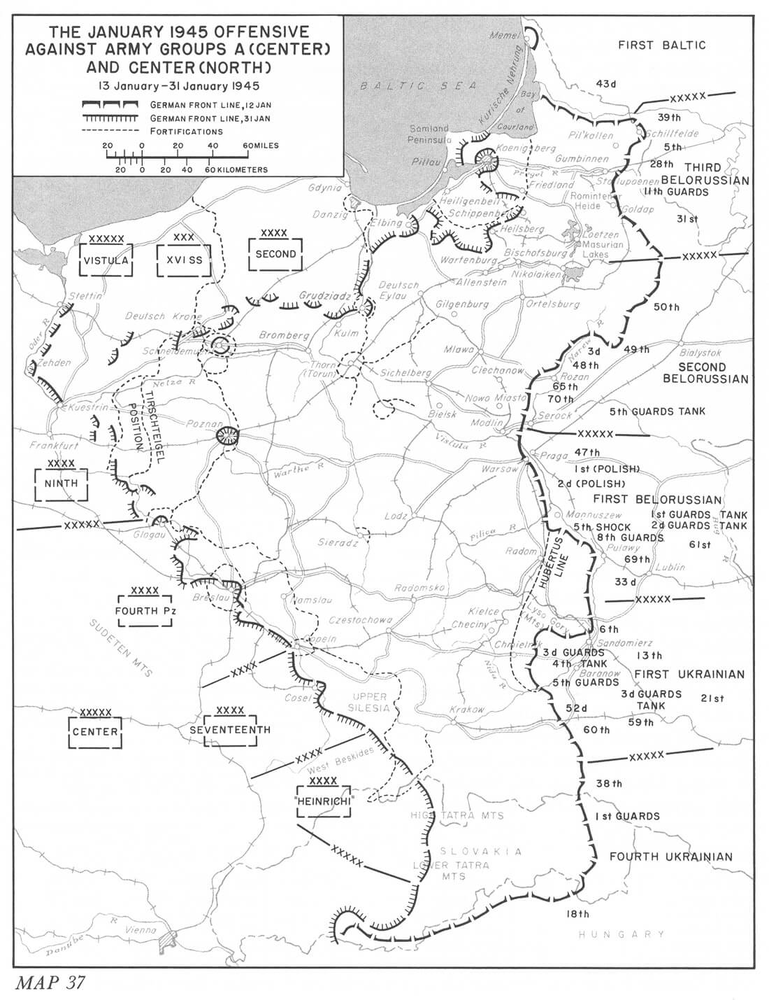

### Ofensywa

To już drugi dzień ofensywy na odcinku południowym. Niemiecka obrona pękła. W bitwie o przyczółek Niemcy stracili 20 tys. żołnierzy, ponad 200 czołgów i dział pancernych. Jutro ruszy atak 1 Frontu Białoruskiego na wysokości Warszawy.

*Sytuacja na froncie wschodnim pomiędzy 13 a 31 stycznia, pozycje Frontów na początku ofensywy styczniowej. 
Źródło: ibiblio*

Jak wynika z tego, co pisze Ahlfen, dowództwo niemieckie nie miało żadnego obrazu sytuacji, oprócz ogólnej informacji, że potężnego ataku nie udało się zatrzymać:
>Przy tak burzliwym przebiegu pierwszego dnia bitwy i wobec przerwania łączności trudno zakładać, by wieczorem 12 stycznia 4. Armia Pancerna mogła już dokładnie wiedzieć, że przełomu nie da się zaryglować. W ciągu przedpołudnia 13 stycznia jednak obraz musiał się tymczasem wyklarować. Dostrzeżono bowiem, że nocą wróg zaczął się przebijać na zachód.

O ofensywie poinformowała niemiecka kronika filmowa:
>Nasze wojska w Prusach Wschodnich mają wysokie morale i są pewne zwycięstwa.

### Wędrujący kocioł

Niemcy skierowali na front polski dwie dodatkowe dywizje "Brandenburg" i "Hermann Göring", wyznaczając im taki region rozwinięcia, że kiedy przybyły, musiały się wyładowywać bezpośrednio na froncie lub wręcz na tyłach nieprzyjaciela.

Tu zaczyna się historia "Wędrującego kotła". Określenie to wprowadzone w powojennych wspomnieniach przez Guderiana jest powszechnie używane w odniesieniu do generalnego ruchu wojsk niemieckich, które za wszelką cenę starały się oderwać od nacierającej Armii Czerwonej i w możliwie jak największym porządku, nieustannie staczając potyczki, wycofać na bezpieczny teren daleko na tyłach. Problem w tym, że linia frontu przesuwała się szybciej niż te "wędrujące kotły" zdołały się poruszać, więc ciągle znajdowały się w sytuacji oblężenia i stąd ich nazwa.

Było ich kilka, ale najsłynniejszy jest "wędrujący kocioł" Nehringa i tu zostanie przedstawiona jego historia.

### Waluta PKWN

Reprezentujące interesy Moskwy nowe władze polskie tymczasowo ulokowane w Lublinie wydały tego dnia ważny dokument: Krajowa Rada Narodowa (zastępująca Parlament - sama nazwa wskazywała na formułę sowiecką) ogłosiła dekret wycofujący rubla. Tydzień wcześniej, 6 stycznia, na całym terenie tzw. Rzeczpospolitej Lubelskiej wycofano z obiegu złotówki okupacyjne Banku emisyjnego wydawane przez władze niemieckie Generalnej Guberni, tzw. "młynarki". Posiadający takie złotówki mogli je wymienić od 10 stycznia do końca lutego. Na co? Na wprowadzony 24 sierpnia 1944 dekretem PKWN pieniądz wydawany przez Centralną Kasę Skarbową PKWN, był to bilet skarbowy o nazwie Złoty (to raczej nie mogło ulec zmianie).

Nowe pieniądze nowych władz miały dumny napis Narodowy Bank Polski, który powstał dopiero 15 stycznia 1945. Drukowane były w Moskwie. Dla dopełnienia informacji trzeba dodać, że Rzeczpospolita Lubelska była zależnym państwem, nieuznawanym nigdzie na świecie, mającym ogromne wydatki (budowanie struktur państwowych i armia na utrzymaniu) i brak dochodów. Bez aparatu państwowego nie było bowiem jak ściągać podatków.

### Bombardowania

13 i 14 stycznia brytyjskie RAF Bomber Command bombardowało węzeł komunikacyjny w Saarbrücken, przeprowadzono 3 bombardowania, pierwsze o 15.22, drugie o 19.00, trzecie kolejnego dnia o 15.00. Obiektem ataku była infrastruktura kolejowa. Łącznie zrzucono 7,5 tys. bomb. Zginęło 21 osób.

O wiele ważniejsze było inne bombardowanie. Niedobór ropy od początku był problemem dla armii niemieckiej. Już w sierpniu 1944 Niemcy utracili ostatnie strategiczne źródło ropy - rafinerię w Ploiești w Rumunii. Od tamtej pory byli skazani na sześciokrotnie droższą benzynę syntetyczną produkowaną z węgla.

Amerykanie wysłali 250 bombowców na fabrykę syntetycznej benzyny w Policach koło Szczecina (niem. Hydrierwerke Pölitz - Aktiengesellschaft) należącą do IG Farbenindustrie. Wytwarzała wysokiej klasy paliwo, m.in. dla Luftwaffe i Kriegsmarine. Pracowało w niej kilkadziesiąt tysięcy robotników przymusowych. Często pisze się, że ten trwający 14 minut atak ostatecznie zakończył jej funkcjonowanie. Najprawdopodobniej jednak tylko poważnie zmniejszył produkcję i straciła na znaczeniu. Była to jedna w 15 fabryk tego typu.

Na wschodzie była tylko jedna: w Monowicach. Był to obóz pracy Auschwitz III Monowitz, również własność IG Farben, oddział Buna-Werke GmbH Schkopau, tego dnia 250 km od linii frontu. 27 stycznia razem z całym obszarem Oświęcimia zostanie wyzwolony. III Rzesza pozostanie już tylko z topniejącymi z każdym dniem zapasami ropy. Ostatni nalot na Police nastąpi 8 marca.

### Odnośniki

- Przemysław Mrówka ["Reforma walutowa 1945 roku. Pierwsza grabież Polski Ludowej"](https://tytus.edu.pl/2018/10/30/reforma-walutowa-1945-roku-pierwsza-grabiez-polski-ludowej/)
- [Banknoty Generalnego Gubernatorstwa](http://generalgouvernement.pl/dokumenty-gg/banknoty-generalnego-gubernatorstwa/)
- Earl F. Ziemke "Stalingrad to Berlin: The German Defeat in the East" [The January Offensive](https://www.ibiblio.org/hyperwar/USA/USA-EF-Defeat/USA-EF-Defeat-19.html)

