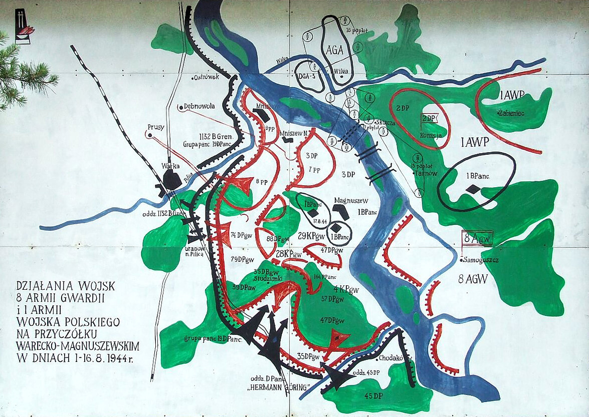

### Ofensywa 1 Frontu Białoruskiego

Dziś do ataku ruszył 1 Front Białoruski. Pierwszym celem jest oczywiście zdobycie Warszawy. Generalnym kierunkiem natarcia Frontu jest Poznań. Ostatecznym celem i największą ambicją głównodowodzącego Frontem marszałka Gieorgija Żukowa - Berlin. Żukow to okrutny i bezwzględny dowódca, bez wahania poświęca życie tysięcy swoich żołnierzy. To powszechna cecha sowieckich dowódców i pewnym wyjątkiem jest tu marszałek Konstanty Rokossowski, który jako jedyny w ogóle brał pod uwagę czynnik strat. Żukow nie jest normą w Armii Czerwonej, jest przeciwieństwem Rokossowskiego.

Nie atakuje Warszawy frontalnie, bo to nie ma sensu. Utknąłby w ruinach na samym początku operacji, ponosząc ogromne straty i tracąc niepotrzebnie czas. Zresztą generalna dyrektywa ofensywy brzmi: przeć jak najdalej, omijając główne punkty oporu i zmuszając główne siły niemieckie do wycofania się z obawy przed okrążeniem. Jest to zgodne ze stosowaną w Armii Czerwonej strategią tzw. głębokich operacji. Warszawa zostanie wzięta z okrążenia, w tym czasie siły sowieckie będą już daleko na tyłach.

Warszawa miasto jako cel została podarowana Polakom, dzięki kleszczom i wycofaniu się większości sił niemieckich zdobędą ją łatwo.

Najtrudniejsze do wykonania i angażujące najwięcej sił było uderzenie na osi Białobrzegi - Skierniewice - Kutno. Wychodzi ono z przyczółka warecko-magnuszewskiego.

Jest to przyczółek dużo mniejszy od baranowsko-sandomierskiego, powstały trochę przez niedopatrzenie niemieckie na tym odcinku. Interesujące jest to, że pierwszy desant nastąpił 1 sierpnia 1944, dokładnie w dniu wybuchu Powstania Warszawskiego. W walkach o przyczółek uczestniczy 1 Armia WP, ogółem tracą tam prawie 500 zabitych.

Dopiero 9 sierpnia Niemcy usiłują zepchnąć Armię Czerwoną na wschodni brzeg, wysyłając do walk elitarną dywizję Pancerno Spadochronową Hermann Göring. Jej charakter jest równie osobliwy, jak nazwa: jest to lądowa dywizja Luftwaffe. To właśnie z nimi do 17 sierpnia walczy 1 Brygada Pancerna im. Bohaterów Westerplatte. Jest to bitwa pod Studziankami (obecnie Studzianki Pancerne) znana z serialu "Czterej pancerni i pies". To podczas tej bitwy ginie dowódca czołgu porucznik Olgierd Jarosz i tam nasza załoga traci również swój pierwszy czołg, którym przyjechała aż z Siedlec nad Oką: T-34-76.

- Military History not Visualized ["Why a Parachute Panzer-Division?" [YT 25:13]](https://www.youtube.com/watch?v=5WQplv3Xe1g)

*Przyczółek warecko-magnuszewski w okresie bitwy pod Studziankami. 
Źródło: Wikipedia [By I, Hiuppo, CC BY 2.5](https://commons.wikimedia.org/w/index.php?curid=2330967)*

Właśnie z tego przyczółka dzisiaj 61 Armia przystąpiła do oskrzydlającego Warszawę od południa natarcia w kierunku Warki, Grójca i Grodziska Mazowieckiego.

Drugie wspomagające uderzenie idzie z prosto na zachód z Puław w kierunku Radomia i Łodzi. Na przełomie lipca i sierpnia o zdobycie przyczółka na tym odcinku bezskutecznie walczyły oddziały 1 Armii WP. Zadanie to powierzono 69 Armii. Wspomagające uderzenie równoległe na Skarżysko-Kamienne prowadziła 33 Armia.

To sytuacja na południe od Warszawy. Równolegle 1 Front Białoruski przystąpił do wyjścia do oskrzydlenia od północnego-zachodu. Najpierw trzeba było zlikwidować zgrupowanie niemieckie w widłach Wisły i Narwi (dawniej Bugonarwi). Już jutro atak na Modlin.

### 1 Front Ukraiński

To już trzeci dzień natarcia 1 Frontu Ukraińskiego. Oddziały niemieckie są zniszczone lub w pełnym odwrocie. Niemieckie dywizje pancerne atakujące 3 Armię Pancerną Gwardii i 4 Armię Pancerną, w trakcie przekraczania Nidy zostały odparte z powrotem pod Kielce i w dalszej swojej drodze łącząc się z rozbitym przez 1 Front Białoruski XXX Korpusem pancernym - formacja ta pod dowództwem generała W. Nehringa była później znana jako "Wędrujący kocioł".

Pomimo wojennego zamieszania informacja o ofensywie 1 Frontu Białoruskiego błyskawicznie dociera do 4 Armii Pancernej. Jak pisze von Ahlfen:
>I faktycznie, rankiem 14 stycznia jeszcze w głębokim mroku, otwarty został ogień bębnowy z taką samą mocą jak dwa dni wcześniej na przyczółku w Baranowie. Rozmiary tego wstrząsu może uświadomić fakt, że na stanowisku bojowym nieobjętej atakiem jednostki zaporowej, leżącym w odległości 10-15 km na południe od przyczółka w Puławach, podłogi schronów podczas całego huraganu ognia mocno się trzęsły.

### Alarm na Śląsku

Na Górnym Śląsku ogłoszono alarm Gneisenau, nastąpiła mobilizacja obrony cywilnej. Dowództwo VIII Okręgu Wojskowego wystawiło załogi na liniach obrony B1 i B2. Do 16 stycznia obsadziło je 16 batalionów Volkssturmu (na całym terenie Okręgu było ich już 28, a do 3 lutego 39). Jest to już ostatni okręg przemysłowy, który jeszcze mają, zamierzają go bronić za wszelką cenę.

### KL Plaszow

Ostatecznie zlikwidowany zostaje dziś Obóz Koncentracyjny Płaszów (1 km na południowy-wschód od Kopca Krakusa; niem. Konzentrationslager Plaszow bei Krakau). Został założony na terenie dawnych cmentarzy żydowskich, później znacznie powiększony. Skierowano tam Żydów krakowskich po likwidacji getta.

To właśnie jeden z oddziałów tego obozu był własnością Oskara Schindlera upamiętnionego również nam wszystkim znanym, oskarowym filmem Stevena Spielberga "Lista Schindlera" (8 Oscarów! m.in. Spielberg za reżyserię i Janusz Kamiński za zdjęcia). Dziś ostatnich przebywających w obozie więźniów skierowano do Auschwitz-Birkenau. Całą drogę w trzaskającym mrozie przebyli pieszo. Zaczynają się "marsze śmierci", w języku hitlerowskich oprawców określane "ewakuacjami".

### NSZ Brygada Świętokrzyska

Najważniejszą częścią polskiej armii podziemnej była Armia Krajowa 14 lutego 1942 przemianowana rozkazem Naczelnego Wodza generała Władysława Sikorskiego ze Związku Walki Zbrojnej istniejącego od 13 listopada 1939. Była to oficjalna część Polskich Sił Zbrojnych utworzonych jesienią 1939 na podstawie umów sojuszniczych. Oficjalna armia partyzancka państwa polskiego.

Jeszcze w 1940 rozpoczęła się akcja scaleniowa, której celem było zjednoczenie wszystkich grup oporu pod jednolitym dowództwem. Przebiegała powoli i jej rezultaty nie były zadowalające. Największym sukcesem było włączenie części Batalionów Chłopskich oraz Szarych Szeregów. Fiaskiem zakończyły się rozmowy z Narodowymi Siłami Zbrojnymi wywodzącymi się z nacjonalistycznego Obozu Narodowo Radykalnego. Trwały od połowy 1943 i zakończyły się w marcu 1944 umową scaleniową, na podstawie której ok 10% oddziałów NSZ przeszło pod komendę AK, reszta pozostała niezależna.

W czerwcu 1944 dochodzi do zgrupowania kilku oddziałów NSZ na Kielecczyźnie. Kiedy nadchodzi front, wycofują oddziały na zachód, za Wisłę i tam 11 sierpnia powstaje Brygada Świętokrzyska NSZ. W grudniu 1944 było to ok. 800 żołnierzy.

Ofensywa sowiecka kompletnie ich zaskoczyła. W nocy z 13 na 14 stycznia zaczęli się wycofywać na zachód. Dziś 14 stycznia weszli w kontakt z Niemcami i za porozumieniem przekroczyli Piłę. Jak to określił dowódca Brygady w rozkazie "*weszliśmy w stan niewojowania z Niemcami na czas nieokreślony*". Następnego dnia również za zgoda niemiecką przeszli linie umocnień we wsi Koziegłowy. Niemcy przydzielili im dwóch oficerów łącznikowych SS. Jednym z nich był Haupsturmführer SS Paul Fuchs szef Gestapo dystryktu Radom.

Na różnym poziomie operacyjnym kontakty z Niemcami i Gestapo były stałym modus operandi tej jednostki, tu kluczową postacią jest oficer do zadań specjalnych NSZ Hubert Jura ps. "Tom", od 1943 agent radomskiego Gestapo. Jak to napisał w meldunku z 2 stycznia 1945 Jan Zientarski, komendant kielecki AK:
>Działalność NSZ bez zmian. Wyraźna współpraca z Niemcami. Rannych Niemcy proponują odstawić do szpitali niemieckich. Notowane są kontakty z Gestapo.

### Heinrich Schroth

Niemiecki aktor teatralny i filmowy. Ze względu na doświadczenie teatralne w początkach kina niemego otrzymał wiele głównych ról, ale potem jego gwiazda przygasła i dopiero dojście hitlerowców do władzy dało mu drugą szansę. Występował w wielu filmach propagandowych i był mocno zaangażowany w czystki nazistowskie wśród ludzi sztuki.

W 1944 został umieszczony na Gottbegnadeten-Liste.

14 stycznia zmarł w Berlinie w wieku 74 lat.

### Polska lubelska

Tymczasem w Lublinie dzisiaj święto - w dość nietypowej porze, bo nie na początku października, a w połowie stycznia odbyła się uroczysta inauguracja pierwszego roku akademickiego na Uniwersytecie Marii Curie-Skłodowskiej. Powołano go dekretem PKWN 23 października 1944. W styczniu miał już 5 wydziałów: Lekarski, Przyrodniczy, Rolny, Weterynaryjny i Farmaceutyczny; 42 profesorów (głównie z Wilna i Lwowa) i ponad 800 słuchaczy.

Lublin jest w rękach polskich od 25 lipca 1944, od 2 sierpnia jest siedzibą PKWN.

### Odnośniki

- [Okupowany Kraków "Niemiecki obóz Plaszow 1942-1945" [YT 28:24]](https://www.youtube.com/watch?v=MOuA8XarT9E)
- [Historia walk na przyczółku warecko-magnuszewskim](https://www.skansen-mniszew.pl/o-skansenie/historia-walk-na-przyczolku-warecko-magnuszewskim)
- [Mark Felton Productions "https://www.youtube.com/watch?v=kWJJFC8j8nU" [YT 10:43]](https://www.youtube.com/watch?v=kWJJFC8j8nU)
