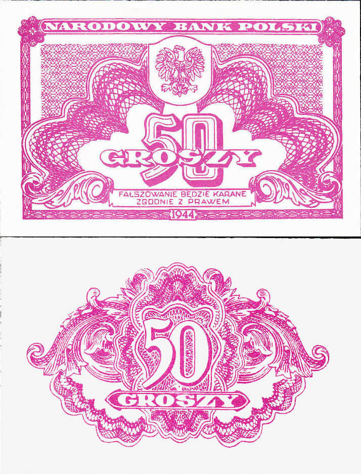

### Przełamanie linii Wisły

Oba sowieckie Fronty w pełnym natarciu. Tego dnia łączna długość przełamania frontu osiąga 500 km. Linia na Wiśle jest już dla Niemców przegrana. Większość ocalałych jednostek wycofuje się z zamiarem przegrupowania po osiągnięciu bezpiecznej pozycji. Zadaniem Armii Czerwonej jest nie dać im na to czasu.

Tak się składa, że uderzenia obu sowieckich Frontów spadły na Grupę Armii A (późniejsza Grupę Armii Środek), której obszar działania rozciągał się od Tatr Bielskich po Warszawę, punktem demarkacyjnym była twierdza Modlin. Dalej na północ była Grupa Armii Środek. Było to 500 km linii obrony obsadzony przez kolejno od północy:

- 9 Armia pod dowództwem generała Smilo Freiherra von Lüttwitza.
- 4 Armia Pancerna pod dowództwem generała Gräsera
- 17 Armia pod dowództwem generała Schulza
- Grupa Armijna Heinrici łącznie z 1. Armią Pancerną pod dowództwem generała Heinrici

Na północy 47 Armia przeprawiła się przez Wisłę i nacierała wprost na Modlin i Błonie, kierując się na obszar ataku 61 Armii, która uderzywszy z przyczółka warecko-magnuszewskiego kierowała się na Warkę, Grójec i Grodzisk Mazowiecki. Połączenie obu tych Armii zamknęłoby w oblężeniu cały region Warszawy. W krwawych walkach o Modlin zajęto Nowy Dwór Mazowiecki, w większości go niszcząc. 61 Armia zajęła Grójec, natychmiast w szkole został założony szpital polowy.

Na południu Niemcy zostali odepchnięci na ponad 100 km, elita natarcia zajęła Kielce oraz Koniecpol. Armia Czerwona jest już na wschód od Krakowa i tylko 40 km od Częstochowy. 3 Armia Pancerna Gwardii, 5 Armia Gwardii i 52 Armia przekroczyły Pilicę i nacierały w kierunku Częstochowy. Znajdująca się na kierunku głównego uderzenia 4 Armia Pancerna jest już rozbita.

Pada generalny rozkaz wycofania się, jak pisze von Ahlfen:
>Do południa [15 stycznia] jednak ze względu na sytuację pod Kielcami i na zachód od nich oraz wskutek wyłomu w 9. Armii, za zgodą OKH czy też bez niej, podjęto decyzję o natychmiastowej kapitulacji frontu na Wiśle. Rozkaz dla jednostki zaporowej brzmiał: "Natychmiast opuścić front na Wiśle, obrona pozycji na tyłach z obu stron Sienna, a także skrzyżowania dróg Iłża.

Tak więc dopiero dziś oddziały XXIV Korpusu Pancernego i XLII Korpusu Piechoty dostały pozwolenie, by opuścić pozycje obronne na Wiśle. W tym czasie awangarda RKKA była już 100 km za nimi, byli więc praktycznie rzecz biorąc w okrążeniu, bez łączności z resztą swoich wojsk. Znajdowali się wtedy na południe od Radomia w rejonie Iłży. Te oddziały to zalążek "Wędrującego kotła", którego historię opisywał von Ahflen, z takim zapałem przedstawiając ją jako przykład dzielności i sprawności wojsk niemieckich, a szczególnie niemieckich oficerów. Przeciwstawił je błędnym kalkulacjom i dyrektywom sztabu a szczególnie Hitlera, który w jego mniemaniu najbardziej zawinił tym, że wojnę źle prowadził, nie pozwalając rozegrać jej prawdziwym - takim jak von Ahlfen - żołnierzom.

### Narodowy Bank Polski

Dziewięć dni temu, 6 stycznia, KRN na terenie Rzeczpospolitej Lubelskiej wycofała złotówki okupacyjne wydawane pod nadzorem niemieckim, tzw. "młynarki", dwa dni temu wycofano rubla. Od tej pory jedynym legalnym środkiem płatniczym była nowy Złoty od 24 sierpnia 1944 wydawany przez Centralną Kasę Skarbową PKWN i drukowany w Moskwie. Miała nadruk NBP. Do dziś był to tylko nadruk.

Bo dziś, 15 stycznia KRN powołał Narodowy Bank Polski. Można by powiedzieć po raz kolejny, bo w 1924 powstał Bank Polski Spółka Akcyjna, główne narzędzie reformy walutowej Grabskiego, która zamieniła markę polską na Złotego. Nowy NBP nie był spółka akcyjną, to była instytucja nowej, komunistycznej Polski, w całości państwowa, pod zarządem ministra skarbu. Początkowo jego zadaniem była tylko emisja pieniądza. Potem w zakres kompetencji weszła też kontrola i zarządzanie finansami newralgiczną częścią przemysłu. Miał również monopol w zakresie oszczędności i kredytów.

W tym czasie przedwojenny NBP SA funkcjonował i wciąż był legalny. W 1939 w dość dramatycznych okolicznościach udało się ewakuować złoto i dewizy banku. Od 1940 siedzibę miał w Londynie. Od 1941 zarządzał nim Bohdan Winiarski prawnik i profesor Uniwersytetu Poznańskiego. W 1946 nie widząc innej możliwości, Winiarski podjął decyzję o przeniesieniu siedziby Banku do Warszawy i przewiezieniu tam skarbu. Przywieziono też nowe, wydrukowane na zachodzie banknoty, które jednak nie weszły do obiegu, bo monopol miał już państwowy NBP. Bank nie mając skarbu ani możliwości funkcjonowania przeszedł w fazę likwidacji zakończoną w 1952. Skarb został przejęty i wykorzystany na wydatki budżetowe oraz odszkodowania wobec USA, UK i Francji, które przejęły roszczenia własnych obywateli wobec znacjonalizowanego majątku na terenie PRL.

<BoxImageWrapper>

Banknot rządu lubelskiego, wydawany przez Centralną Kasę Skarbową PKWN od 24 sierpnia 1944. NBP powstał dopiero 15 stycznia 1945. 
Źródło: domena publiczna (podlinkowany poniżej artykuł o reformie walutowej 1945)
</BoxImageWrapper>

Nowy NBP przejął kontrolę nad wydawaniem pieniądza. Te pierwsze powojenne polskie złotówki zostały wycofane dopiero podczas kolejnej reformy walutowej w 1950.

- [Tajna misja – ewakuacja polskiego złota](http://kronikarium.pl/)
- ["Wrzesień 1939. 80 ton polskiego złota w niebezpieczeństwie!"](https://polskieradio24.pl/39/156/artykul/677930,wrzesien-1939-80-ton-polskiego-zlota-w-niebezpieczenstwie)

### Masakra w Krakowie

Tymczasem w Krakowie panika, W dzielnicy Dąbie urządzono łapankę, wyciągnięto z domów 49 osób, 30 kolejnych osób przywieziono z więzienia Gestapo na Montelupich i wszystkich rozstrzelano. Dokładna przyczyna nie jest znana, prawdopodobnie zamordowano tych ludzi dla postrachu, bo w dzielnicy znajdowały się obiekty wojskowe. 9 lutego 1945 ciała pomordowanych zostały w zbiorowej mogile na cmentarzu na Rakowicach.

### Ataki UPA

W nocy UPA dokonało dwóch ataków na polskich mieszkańców wsi Błyszczanka i Latacz, oddalonych od siebie o dwadzieścia kilka km, obie w znanym nam z historii powiecie Zaleszczyki (województwo tarnopolskie).

W Błyszczance gdzie polskie domy znajdowały się pomiędzy ukraińskimi, to sąsiedzi namawiali na otwarcie domów, potem wszystkich domowników mordowano siekierami. Strzelano tylko do uciekających. Zamordowano ponad 60 ludzi.

W Lataczu najpierw oddział UPA zgromadził się na skraju wsi i potem dokonał ataku, chodząc od domu do domu. W tym wypadku ukraińscy sąsiedzi w tym ksiądz greckokatolicki mieli czas na uratowanie, choć części Polaków. Część stawiła zbrojny opór. Zginęło około 80 Polaków.

### Brygada Świętokrzyska NSZ

W okolicy Pogwizdowa zostali ostrzelani przez Niemców, byli ranni i zabici. Dziś na podstawie porozumienia z Niemcami uzyskano zgodę na przekroczenie Pilicy w Żarnowcu. Z powodu pośpiechu i ostrzału sowieckiego utracono część taborów.

O nowej sytuacji poinformował swoich podkomendnych dowódca Brygady Świętokrzyskiej pułkownik Antoni Szacki ps "Bohun"
>Ofensywa bolszewicka zmusiła nas do przesunięcia się na zachód Polski. Na drodze stanęły nam umocnienia niemieckie. W dniu 14 bm. starliśmy się z Niemcami, chcąc przebić się na zachód. Nie daliśmy rady. W dniu 15 bm. czołgi bolszewickie zaatakowały nas od wschodu. Dla ratowania brygady porozumiałem się z d\[owództ]wem fortyfikacji niemieckich, aby zezwoliło nam przejść przez ich linie na zachód. Tym samym weszliśmy w stan niewojowania z Niemcami na czas nieokreślony. Mam nadzieję, że szybko toczące się wypadki wojenne pozwolą nam w niedalekiej przyszłości zameldować się u Naczelnego Wodza i prawowitego Rządu Polskiego i według jego rozkazu zwrócić nasz oręż przeciwko wrogowi, którego każe nam zwalczać.

- ["Kampfgruppe Obstlt Richter z 10 Pz Gren Div, która znalazła się w odpowiednim miejscu i czasie, czyli na zapleczu Szczekocin w nocy z 15/16 stycznia 1945, liczyła batalion i dwie lekkie baterie, jednak i wówczas BŚ NSZ marzyć mogła jedynie o przejściu siłowym na Zachód ; )"](https://twitter.com/dwojkarz/status/1542480431198736386)
- ["zapomniany, cichy bohater styczniowych dni, generalleutnant Werner Schartow, dca 602 sztabu dywizyjnego specjalnego przeznaczenia, "polował" na BŚ NSZ, jatkę pod Pogwizdowem zrobili jego podkomendni, 15 stycznia 1945 "nadzorował" przejście Polaków przez most na Pilicy"](https://twitter.com/dwojkarz/status/1613453549933068288)
- ["generalleutnant Paul Scheuerpflug, dca 68 Dywizji Piechoty, "witał kwiatami" członków BŚ NSZ na niemieckim, europejskim brzegu Pilicy, pod czujnym okiem podległej mu dywizyjnej grupy bojowej "Bohun" i reszta Polaków spędzili noc z 15/16 stycznia 1945 w Solcy, co im się przyśniło?"](https://twitter.com/dwojkarz/status/1613456734663888896)

### Operacja Crossbow

Wojna nie oznacza wcale automatycznie szybkiego rozwoju techniki wojennej, Właśnie ze względu na ogromne potrzeby frontu Niemcy wstrzymali rozwój programu samolotów odrzutowych. Uznano, że wojnę na wschodzie wygra się samolotami tłokowymi i odrzutowce nie są potrzebne do pokonania Armii Czerwonej. Wkrótce się jednak okazało, że front wschodni to nie wszystko. Bombardowania przeprowadzane przez ogromne, alianckie flotylle bombowców powodowały problemy zarówno propagandowe, jak i gospodarcze. Walczyli z nimi skutecznie w strefie celu, ale wtedy było już za późno. Okazało się, że potrzebne są bardzo szybkie samoloty myśliwskie uzbrojone w działka. W kwietniu 1944 wprowadzono odrzutowe Me 262, w lipcu rakietowe Me 163 Komet, a we wrześniu pierwszy odrzutowy bombowiec Arado Ar 234.

Propaganda hitlerowska głosiła ideę "cudownej broni" (niem. Wunderwaffe), która samą przewagą technologiczną miała dokonać zmiany sytuacji na froncie. Jednym ze składników tej idei były "bronie odwetowe" (niem. Vergeltungswaffe)

- V1 (Fieseler Fi 103) dron odrzutowy, napędzana silnikiem pulsacyjnym bomba latająca z głowicą 850kg, miała zasięg 240 km, prędkość maksymalna 645 km/h sprawiała, że można je było wykryć na czas radarem i zestrzelić z samolotu... można by próbować zestrzelenia, bo masa ładunku była zagrożeniem na odległości celnego strzału, od czerwca 1944 na Anglię wystrzelono ich ok. 10 tys.; doleciało 7 tys., z czego prawie 4 tys. na Londyn i okolice. 5500 ofiar śmiertelnych i 16 tys. rannych.
- V2 (Aggregat 4 - A4) pierwszy w historii skuteczny rakietowy pocisk balistyczny zbudowany pod kierownictwem Wernhera von Brauna, pierwsza rakieta bojowa została wystrzelona 7 września 1944 na Paryż. Do końca marca 1945 z Holandii odpalono ich ponad 3 tys., z czego na Londyn spadło ponad 1300. Ogółem straty aliantów to 7 tysięcy zabitych cywilów i żołnierzy.
- V3 segmentowe działo dalekiego zasięgu.

<SeeAlso txt="Vergeltungswaffe" url="/festung-breslau/article/vergeltungswaffe" />

Szczególną troskę Brytyjczyków wzbudziła rakieta V2, dopóki było to możliwe, uderzenia tej rakiety trzymano w tajemnicy i londyńczycy mogli przeczytać w prasie lokalnej o tym, że kamienice wylatują w powietrze z powodu wybuchu gazu. Ale kto uwierzy w epidemię eksplozji gazowych? Bardzo szybko nie tylko dowództwo, ale i opinia publiczna dowiedziała się, że Niemcy dysponują niewykrywalnym, niedającym się zniszczyć pociskiem o wielkiej mocy. Dla wysiłku wojennego te rakiety były bez znaczenia, ale zagrożony był dom. Na Londyn spadło ich 1358, ofiary to 2754 zabitych i 6,5 tys. rannych.

Problem polegał na tym, że leciały torem balistycznym, na Londyn spadały z góry z prędkością kilku tys. km/h. Naddźwiękowy pocisk jest dla obserwatorów po prostu eksplozją następująca bez żadnego ostrzeżenia. V1 można było z daleka usłyszeć i się schronić. V2 zabijała bez ostrzeżenia.

Brytyjczycy postępy niemieckiego programu rakietowego śledzili z wielkim niepokojem już od 1943. Operacja wywiadowcza miała kryptonim Bodyline. Kiedy pojawił się problem zwalczania, zmieniono kryptonim na Crossbow (pl. Kusza). Już wcześniej opracowywano system zagłuszania sterowaniem rakietami. Skonstruowano mikrofony kierunkowe pozwalające wykryć ich wystrzeliwanie, a więc przewidzieć, kiedy pojawią się nad Londynem.

Generał Frederick Alfred Pile dowódca brytyjskiej obrony przeciwlotniczej 25 sierpnia 1944 zaproponował wystrzelenie na przewidywaną trajektorię lotu ok. 300 tys. pocisków plot. Wzbudziło to zrozumiały sprzeciw, przynajmniej 2% tych pocisków, czyli 90 ton stali miało spaść na Londyn.

Dziś odbyło się kolejne zebranie grupy roboczej Crossbow, na którym Pile przedstawił swój nowy plan: użycia udoskonalonych pocisków. Przy odpowiednio wczesnym alarmie i podziale obszaru Londynu na siatkę z rozsądnym rozmieszczeniem dział plot wystarczyło już tylko 150 pocisków na rakietę. Komitet jednak uznał, że nie będzie przeprowadzał prób, bo jak dotąd nie została opracowana żadna sensowna metoda wczesnego wykrycia rakiet V2.

- Mark Felton Productions ["The V-2 Missile Heist" [YT 12:36]](https://www.youtube.com/watch?v=UqystIYoJ6o) | ["Nazis in Space! The True Story" [YT 6:22]](https://www.youtube.com/watch?v=3Z6EqhF0xgg) | ["Nazi Rocket Monkeys - The First Astronauts" [YT 12:49]](https://www.youtube.com/watch?v=IUmVP4A2LI4) | ["British V-2 - How the UK Almost Won the Space Race" [YT 7:02]](https://www.youtube.com/watch?v=wWFFzL65dEQ)

### Life "The Incredible Patrol"

W dzisiejszym numerze Life ukazał się artykuł opisujący niezwykły patrol. Po operacji Market-Garden amerykańskie dywizje 101 i 83 zostały przesunięte na linię frontu w rejonie Nijmegen. Wykonywali typowe zadania piechoty, które polegały m.in. na odbywaniu regularnych patroli na obszar kontrolowany przez nieprzyjaciela i zdobywaniu tam jeńców, którzy mieli stanowić źródło informacji dla wywiadu.

Patrol 6 spadochroniarzy 101 Dywizji Powietrznodesantowej wyruszył 30 października 1944 o godzinie 20.00. Dowodził nimi porucznik Hugo S. Sims Jr. Przekroczyli rubież rzeki Nederrijn. Tych kilku żołnierzy różnymi metodami korzystając z podstępu i zaskoczenia wzięło do niewoli 32 żołnierzy niemieckich, ostatnich 8 już po dotarciu z powrotem nad Nederrijn. Zadanie wykonali bez strat.

Za ten sukces Sims został odznaczony Krzyżem Wybitnej Służby (ang. Distinguished Service Cross).

W przekonaniu wielu żołnierzy było to niepotrzebne ryzyko, bo najczęściej łapano zwykłych żołnierzy, którzy nie wiedzieli zbyt wiele, zresztą schwytani przez aliantów zachodnich nie mieli żadnych powodów do zdradzania tajemnicy wojskowej. Sam Sims pisze we wspomnieniach:
>There was a strong feeling that this patrolling was unnecessary... One of the patrols even punctured the rubber boats to be used [to cross the river] so the patrol would have to be called off.

- [LIFE 15 Sty 1945](https://books.google.pl/books?id=YlMEAAAAMBAJ&pg=PA74&lpg=PA74&dq=Life+%22The+Incredible+Patrol%22&source=bl&ots=vaJP0mTdlq&sig=ACfU3U2U1zWh18fcPOPTZooptldN0ZBMCw&hl=pl&sa=X&ved=2ahUKEwix8vDXl7z1AhUFjosKHfCwBqoQ6AF6BAgbEAM#v=onepage&q=Life%20%22The%20Incredible%20Patrol%22&f=false)
- HistoryNet.com ["The Incredible Six-Man Patrol Who Captured 32 POWs in a Single Day"](https://www.historynet.com/the-incredible-6-man-patrol-who-captured-32-pows-in-a-single-day.htm)
- Liberation Route Europe ["The Incredible Patrol"](https://www.liberationroute.com/fr/pois/500/the-incredible-patrol)
- ["The Incredible Patrol"](http://peteandlaurie.blogspot.com/2009/10/incredible-patrol.html)
