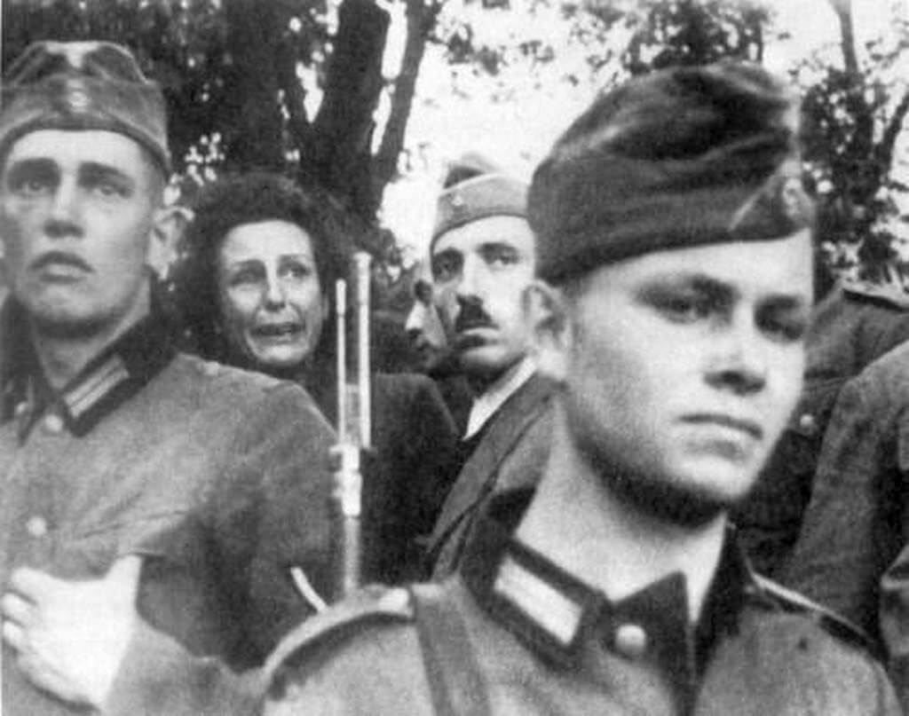

### Warszawa

To krytyczna faza boju o Warszawę. Oddziały 1 Armii WP zbliżają się do stolicy. Aż do dziś nie wiadomo, czy Niemcy będą bronić miasta, czy się z niego wycofają. Po godzinie 15.00 pierwsze meldunki o wycofujących się oddziałach. Dziś oddziały polskie wychodzą na przedpola Warszawy. Jutro rozstrzygnięcie.

Dowództwo Grupy Armii A wobec perspektywy okrążenia podjęło decyzję o przeniesieniu się na kolejną rubież.

Tymczasem na zapleczu Warszawy wojska 1 Frontu Białoruskiego zdobywają Żyrardów.

Idąca na Łódź 69 Armia zdobywa Iłżę, Radom i Szydłowiec. Jest 70 km od Łodzi.

Dla wojsk niemieckich sytuacja przedstawia się dramatycznie i nawet po latach tak to wspomina von Ahlfen, pisząc o sobie:
>Dowódca jednostki zaporowej von Ahlfen po opuszczeniu pozycji na Wiśle znalazł się świtem 16 stycznia na pozycji straży tylnej, gdy pospiesznie przekazany droga radiową rozkaz XLII Korpusu wezwał go na stanowisko dowodzenia w miasteczku Iłża. Tam otrzymał ostatni osobisty radiowy rozkaz otaczanego szacunkiem generała dowodzącego Recknagela, który dwa dni później wraz ze swoim szefem sztabu korpusu pułkownikiem von Drabichem-Waechterem zginął w walce wręcz. "Jednostka zaporowa broniąc skrzyżowania dróg w Iłży, kontynuuje pospieszny marsz na pozycję Hubertus, którą trzeba obronić. Chodzi przy tym o ochronę północnego skrzydła Korpusu wycofującego się na zachód". Tak brzmiał rozkaz zakończony zawołaniem z głębi serca "Niech Bóg ma Pana w opiece!".

Jeżeli chodzi o losy generała Recknagela, panuje tu pewne zamieszanie. Ahlfen bowiem pisze, że zginął 2 dni później, czyli 18 stycznia. Majewski podaje, że 17 stycznia w pobliżu Końskich polscy partyzanci (nie podaje przynależności organizacyjnej) rozbili cały sztab Korpusu, a Recknagel został wzięty do niewoli. Zaś [Lexikon der Wehrmacht - Recknagel, Hermann](http://www.lexikon-der-wehrmacht.de/Personenregister/R/RecknagelH.htm) i za nim niemiecka Wikipedia informują, że został zastrzelony przez partyzantów 23 stycznia, gdzieś między Piotrkowem Trybunalskim a Tomaszowem Mazowieckim. Cóż, najwidoczniej von Ahlfen myli dzień, a Majewski przemilcza fakt egzekucji.

- [no i Kanclerza nie posłuchali...](https://twitter.com/dwojkarz/status/1543247634630074371)

### Ryszard Moszkowski i Róża Etkin

Tego dnia w Warszawie, w bliżej nieznanych okolicznościach (są różne wersje) zamordowani zostali Ryszard Moszkowski i jego żona Róża Etkin.

Moszkowski był znanym polskim rzeźbiarzem pochodzenia żydowskiego. Urodził się we Francji i tam też uczył się rzeźbiarstwa m.in. pod kierunkiem znanego wszystkim polskim turystom odwiedzającym Paryż wielkiego rzeźbiarza francuskiego o nie dającym się zapomnieć nazwisku Bourdelle (najważniejsza dla nas jego realizacja to pomnik Adama Mickiewicza znajdujący się prawie na drodze z Trocadéro do wieży Eiffla).

Podczas okupacji wraz z żoną ukrywali się po aryjskiej stronie. Ostatnich ich schronieniem była piwnica na Żoliborzu. Tylko jeden dzień dzielił ich od przetrwania.

### 1. Front Ukraiński

1 Front Ukraiński zdobywa dzisiaj Końskie, Radomsko i dociera do Częstochowy.

I tu trzeba na chwilę zrobić przerwę i opowiedzieć o 2 rzeczach:

### Masakra w Końskich 12 września 1939

Końskie znane jest z masakry urządzonej przez wojska niemieckiej, której świadkiem była najbardziej znana reżyserka niemiecka Leni Riefenstahl. Jest to jedna z tych osób, o których można powiedzieć, że stworzyły kino współczesne. Do dziś jej filmy szczególnie: "Triumph des Willens" (zapis Parteitagu w Norymberdze) i "Olimpia" (Olimpiada Berlin 1936) są dokładnie analizowane przez adeptów sztuki filmowej. Do realizacji tych filmów została wybrana przez Hitlera. Ze względu na to uwikłanie w propagandę hitlerowską po wojnie została dotknięta ostracyzmem i nigdy już nie wróciła do głównego nurtu.

W Polsce była jako, jak to się dzisiaj mówi, embedowany filmowiec, bezpośrednio obserwując triumfalny pochód Wehrmachtu w pierwszej prawdziwej wojnie. Miał to być jej kolejny film. Po tym, co zobaczyła w Końskich, zerwała i realizację tego filmu i współpracę z NSDAP. Nie zrobiła dla nich już żadnego filmu.

12 września 1939 w Końskich miał się odbyć pogrzeb 4 żołnierzy niemieckich poległych w walkach z regularnym wojskiem polskim. Spędzono na rynek około 50 Żydów, którzy traktowani z niezwykłym okrucieństwem mieli wykopać groby. W zamieszaniu, po tym, jak otrzymywali sprzeczne polecenia, obawiając się linczu, w panice rzucili się do ucieczki. Niestety akurat w tym momencie nadjechał oficer niemiecki, który nie znając sytuacji i tylko widząc uciekających mężczyzn, otworzył do nich ogień. Zginęło 22 ludzi. Był to początek wojny i taka masakra byłą jeszcze czymś niezwykłym. Oficer ten został postawiony przed sądem i skazany na rok więzienia.

*Leni Riefenstahl podczas masakry w Końskich, 12 września 1939. 
Żródło: reddit (to zdjęcie jest wszędzie w internecie, licencja?)*

### Ostrowiec Świętokrzyski "Popiół i diament"

Drugie ważne wydarzenie ma miejsce w Ostrowcu Świętokrzyskim. Jan Foremniak, komunistyczny partyzant, oficer Armii Ludowej, świeżo mianowany wojewodą kieleckim (świętując ten niezwykły awans?), wraz z kolegami dokonał napadu rabunkowego na mieszkanie. Został tam dziś zastrzelony przez Stanisława Kosickiego, dowódcę patrolu porządkowego AK.

Wydarzenie to po propagandowych zmianach stało się podstawą akcji powieści Jerzego Andrzejewskiego "Popiół i diament", wydanej pierwotnie w 1947 pod tytułem "Zaraz po wojnie". Dopiero rok później po pewnych zmianach ukazała się pod obecnym tytułem. Wszyscy znamy film Andrzeja Wajdy z 1958 na podstawie tej powieści, ze znakomitą rolą Zbigniewa Cybulskiego.

Kosicki zbiegł do Krakowa i tam się ukrył w klasztorze kapucynów. Zdradzony i przewieziony do wiezienia UB w Kielcach, dostał wyrok śmierci. Kiedy nie znając daty wykonania wyroku, oczekiwał na egzekucję, kieleckie więzienie, w którym siedział, zostało rozbite przez 250-osobowy oddział Antoniego Hedy ps. "Szary". Kilkuset (źródła się różnią - od 300 do 700) więźniów uwolniono.

Nie po raz pierwszy Kosicki miał nieziemskie szczęście. Dwa lata wcześniej, latem 1944 udało mu się uciec z transportu do Oświęcimia. Po ucieczce z Kielc ukrywał się na Wybrzeżu, aż do amnestii w 1947. Wtedy się ujawnił i zaczął normalne życie. Jednak w 1954 został zdemaskowany, ale ponieważ posiadał dokument amnestyjny, został zwolniony. SB z powodu tej historii z Foremniakiem przez wiele lat go szykanowało. Nie mógł znaleźć pracy, rozbili mu rodzinę. Całą historię opisał Jerzy Kąkolewski w książce "Diament znaleziony w popiele".

### Częstochowa

Śmiały atak sowieckich czołgów z 7 korpusu pancernego gwardii, wywołuje panikę w niemieckim garnizonie, dezorganizacja. Plany wysadzenia klasztoru niezrealizowane. Miasto padnie już jutro.

### Ewakuacja

W nocy sztab Grupy Armii A wobec zagrożenia Krakowa i walk w mieście ewakuuje się z Częstochowy do Opola. Pozostanie tam tylko tydzień.

Niemcy zaczynają wycofywać nie tylko wojsko. W Kraju Warty (niem. Wartheland aka Warthegau) - większość Wielkopolski wcielona do Rzeszy i przeznaczona do całkowitej germanizacji - ogłoszona zostaje ewakuacja. Tysiące niemieckich rodzin chłopskich w panice i pośpiechu pakuje się na wozy i ucieka. Spora część z nich dotrze jutro do Wrocławia, wywołując tam poważny niepokój.

Większość z nich to niemieccy osadnicy, których władze hitlerowskie skusiły do szukania nowego życia na odebranych Polakom gospodarstwach. Dziś każą im uciekać, zwierzęta gospodarskie, których nie można zabrać, zabić. Wszystko, czego się nie da zabrać, zniszczyć. Cena wojny.

### Bombardowanie Magdeburga

Dziś okrutnie został zbombardowany Magdeburg.

Najpierw Amerykanie wysłali 127 bombowców B-24 Liberator, które w samo południe dokonały ataku na obszar przemysłowy i węzeł kolejowy. Nie spodziewano się kolejnego bombardowania tego samego dnia.

Po 19.00 ze wschodniej Anglii wystartował zespół 371 brytyjskich bombowców, które pomiędzy wieczorem pomiędzy 21.30 a 22.00 przeprowadziły bombardowanie dywanowe na centrum miasta. Pierwotny kierunek lotu tej flotylli wskazywał na Berlin, ale podczas lotu Brytyjczycy zakłócili działanie niemieckich radarów i zmienili kierunek na Magdeburg. Dlatego bombardowanie było całkowitym zaskoczeniem dla mieszkańców, nie ogłoszono alarmu, nie mieli czasu dobiec do schronów. Zginęło około 16 tys. ludzi.

### Hitler w Berlinie

Było już jasne, że operacja Nordwind mająca uratować z okrążenia niemieckie wojska biorące udział w ofensywie w Ardenach zakończyła się niepowodzeniem. Dziś Hitler opuścił Adlerhost. Powrócił do Berlina, i już w nim go aż do śmierci pozostał. Za 104 dni popełni samobójstwo.

### Nacjonalizacja Renaulta

Podczas okupacji Louis Renault założyciel i właściciel zakładów Renault odmówił produkcji czołgów, ale robił ciężarówki dla Wehrmachtu.

Po wyzwoleniu Francji jego zakłady stały się bastionem stronnictwa komunistycznego. Domagano się rekwizycji i ukarania Renaulta, który już wtedy nie miał żadnych politycznych sojuszników, pamiętano mu bowiem bezwzględne traktowanie strajków w latach 1936-38.

Rząd tymczasowy oskarżył go o kolaborację. Tego typu oskarżenia były powszechne. Tak jak wielu innych przedsiębiorców wtrącono go do więzienia i tam 23 października 1944 zmarł. 1 stycznia de Gaulle wydał dekret o pośmiertnym wywłaszczeniu Renaulta. Dzisiaj znacjonalizowano masę własnościową zakładów Renault.

### Odnośniki

- [Wyzwolenie Końskich 16 stycznia 1945](https://www.konskie.org.pl/2012/01/wyzwolenie-konskich-16-stycznia-1945.html)
- [Ocalenie Jasnej Góry](https://www.tygodnikprzeglad.pl/ocalenie-jasnej-gory/)
