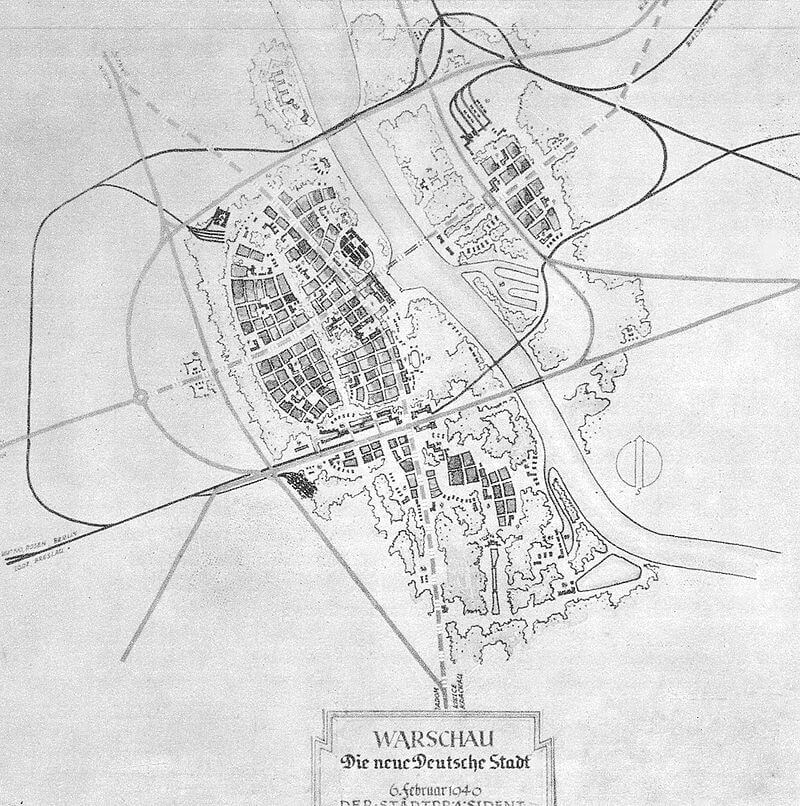

### Warszawa!

Warszawa! Po 1939 dniach niemieckiej okupacji wreszcie wolna od wojsk niemieckich.

Bez wątpienia najważniejszym wydarzeniem dzisiaj na całym polskim froncie jest zdobycie Warszawy.

Poprzedniego dnia oddziały 1 Armii WP dotarły do Legionowa. W nocy z Pragi przeprawiła się 6 DP i zaczęła walki w centrum.

Dziś główne siły przeprawiły się na wysokości Grójca i nacierały od południa. Natarcie prowadziła 2 DP. O godzinie 10.00 wkroczyła do miasta. Połączenie polskich dywizji nastąpiło w rejonie Ogrodu Saskiego.

W obawie przed okrążeniem jeszcze wczoraj Niemcy zaczęli się wycofywać. W mieście były już tylko 4 bataliony niemieckie. Wciąż toczyły się walki o Modlin, ale przewaga sowiecka była widoczna na każdym odcinku frontu. Okrążenie było nieuchronne. Zaledwie po kilku godzinach walk, obawiając się okrążenia, Niemcy opuścili miasto.

Do godziny 16.00 17 stycznia Warszawa, a właściwie ruiny Warszawy były wolne od wojsk niemieckich.

Hitler, który dopiero co, bo wczoraj wrócił z frontu w Ardenach, z Adlerhost, na wieść o poddaniu wpadł w furię. Warszawa była jedna z tzw. twierdz, czyli miejsc przeznaczonych do obrony za wszelką cenę.

Po tym, jak padły rachuby najpierw na zniszczenie anglosaskiej inwazji z morza, potem niepewna stała się Linia Zygfryda i w końcu po fiasku ofensywy ostatniej szansy w Ardenach jedyne co Hitlerowi zostało to liczyć na rozłam w koalicji antyhitlerowskiej i połączenie się Anglosasów i Niemców (w końcu ludy germańskie, nie?) w wojnie z sowietami, czyli “żydobolszewizmem”. W tej sytuacji te izolowane, położone daleko na wschodzie, wciąż broniące się miasta miały być jego wkładem w tę nową koalicję równie cennym co cała wciąż istniejąca armia.

Ponadto zdawał sobie sprawę z ogromnego znaczenia symbolicznego i propagandowego stolicy Polski. Czy Stalin zajął, czy wyzwolił Warszawę to było bez znaczenia. Liczyło się to, że Hitler ją stracił. I cały świat to widzi. Nie udało się zrobić z Warszawy drugiego Stalingradu. W tej sytuacji ostatnią nadzieją pozostał Poznań.

Wszyscy odpowiedzialni za podjęcie tej ze wszech miar racjonalnej pod względem wojskowym decyzji zostali przykładnie ukarani.

12 lipca 1940 Hans Frank
>jeżeli chodzi o Warszawę, Führer postanowił, że odbudowa miasta Warszawy jako stolicy polskiej żadną miarą nie wchodzi w rachubę. Führer życzy sobie, aby w związku z rozwojem ogólnej sytuacji Warszawa zeszła do poziomu miasta prowincjonalnego.

Plany hitlerowców zawierał tzw. Plan Pabsta przedstawiony gubernatorowi Hansowi Frankowi 6 lutego 1940 (niem. Die neue Deutsche Stadt Warschau, część General Plan Ost). Opracowany przez architektów: Huberta Grossa i Ottona Nurnberga pod kierownictwem naczelnego architekta Warszawy Friedricha Pabsta.

Znany jest w kilku wersjach, ale zasadniczo polegał na przekształceniu głównego ośrodka państwowego, zamieszkanego przez ponad milion ludzi w prowincjonalny, duży węzeł komunikacyjny, którego główną częścią miało być niemieckie osiedle, a liczba ludności nie przekracza 200 tys. Na lewym brzegu wzorcowe osiedla dla niemieckich urzędników administrującymi podbitymi terenami wschodnimi. Na Pradze 1 km2 osiedle dla polskich niewolników. W miejscu Zamku Królewskiego miała powstać hala widowiskowa, a na Placu Zamkowym gigantyczna figura Germanii. Pozostać miało tylko Krakowskie Przedmieście i Belweder (jako siedziba niemieckich władz).

W tym celu należało całą Warszawę zniszczyć. Miano do tego przystąpić po tzw. ostatecznym zwycięstwie, ale w dużej części udało się ten plan zniszczeń zrealizować podczas Powstania Warszawskiego i potem. Od października aż do stycznia 1945 oddziały Technische Nothilfe (TN aka TeNo, Techniczna Pomoc Ratownicza) zniszczyły 30% lewobrzeżnej Warszawy.

Były to paramilitarne jednostki, techniczna obrona cywilna powołana w 1919, której pierwotnym zadaniem była ochrona obiektów przemysłowych przed aktami sabotażu w gorącej sytuacji politycznej Niemiec powojennych. Odbyły długą, orwellowską drogę, by stać się oddziałami niszczycieli miast.

<BoxImageWrapper>

Warszawa wg planu Pabsta. 
Źródło: Wikipedia [By Hubert Gross († 1992), Otto Nurnberger and others. - The book of Stanisław Jankowski, Adolf Ciborowski "Warszawa 1945 i dziś" Publisher: Wydawnictwo Interpress, Warszawa, 1971 strona 22](https://commons.wikimedia.org/w/index.php?curid=2264913), Domena publiczna
</BoxImageWrapper>

Ta Warszawa nazywana "Paryżem północy", miasto sejmowe i od XVI wieku faktyczna stolica Polski, w której w XIX wieku wybuchły dwa powstania narodowe, wielka Warszawa wizji Prezydenta Starzyńskiego zamordowanego przez Niemców w grudniu 1939. Zdegradowana w Generalnej Guberni do roli miasta powiatowego, Warszawa z planu Pabsta ograniczona do niemieckiego osiedla i węzła kolejowego. Warszawa największego getta w Polsce, heroiczne miasto dwóch powstań, zniszczone wojną, powstaniami i potem po upadku Powstania Warszawskiego celowo i systematycznie obracane w ruiny było wreszcie wolne od hitlerowskiego okupanta. Symbolicznie i realnie zaczynał się nowy etap w historii Polski. Były wprawdzie koncepcje utworzenia wielkiego pomnika wojny i przeniesienia stolicy gdzieś indziej (najczęściej wymieniano niezniszczoną Łódź), ale formułowane przez pojedynczych ludzi nie miały żadnego wpływu na rzeczywistość.

Jeszcze zanim zostaną podjęte oficjalne decyzje, było wiadomo i było to rzeczą oczywistą, choć zdawałoby się, że niemożliwą do wykonania - Warszawa zostanie odbudowana. Polacy odzyskają stolicę. Już 3 stycznia 1945 KRN podjęła decyzje o konieczności odbudowy Warszawy i ustanowienia jej stolicą Polski. 19 września 1944 wyznaczyła na Prezydenta Warszawy Mariana Spychalskiego.

Prawobrzeżna Warszawa została zdobyta do 5.30 15 września 1944, ale to na lewym brzegu było centrum miasta. To wielki moment dla Polski. Zniszczenia lewobrzeżnej części miasta szacowano na 85%, całkowicie zniszczona infrastruktura, 20 mln m3 gruzów. Warszawa była rozległą po horyzont kupą gruzów, w której w nieprawdopodobnie prymitywnych warunkach, gnieździło się kilka tysięcy ludzi. Już jutro zaczną przybywać nowi. Ruiny zaczną odżywać.

### Herrlisheim

SS-Obersturmführer Bachmann

FBTODO

- Mark Felton Productions ["2 SS Panthers vs. 21 US Shermans" [YT 10:19]](https://www.youtube.com/watch?v=86K0ncTkAkA)
- ["Battle of Herrlisheim – 2 Panthers vs. 21 Shermans"](https://opposingfronts.com/2-panthers-vs-21-shermans/)

### 1. Front Białoruski

Główne siły sowieckie 1 Frontu Białoruskiego zajęły dziś Gorlice, Przedbórz i Zgierz. Łódź była na wyciągnięcie ręki.

### Masakra w Radogoszczu

W Łodzi załoga policyjnego więzienia niemieckiego na Radogoszczu rozpoczęła likwidację więźniów. Najpierw rozstrzelano więźniów funkcyjnych. Kiedy w nocy hitlerowcy przystąpili do egzekucji pozostałych więźniów, ci stawili opór. W tej sytuacji podpalono oddział i systematycznie likwidowano ocalałych. Do rana zamordowano około 1,5 tys ludzi, ocalało około 30 więźniów, którzy zdołali się ukryć. Był to wstrząs dla całej Łodzi, wielu jej mieszkańców przyszło na miejsce masakry, szukając swoich bliskich. Odpowiedzialny za tę zbrodnię komendant więzienia, porucznik policji Walter Pelzhausen, we wrześniu 1947 stanął przed sądem w Łodzi i został skazany na karę śmierci. Wyrok wykonano 1 marca 1948 roku. Obecnie na miejscu więzienia znajduje się muzeum.

### 1. Front Ukraiński

Wojska 1 Frontu Ukraińskiego zdobyły dziś Jasło, Radomsko i i po dwóch dniach walki Częstochowę.

To dzisiaj wg Majewskiego sztab XXXXII Korpusu (taką dziwną notację podaje, Ahlfen poprawnie XLII) 4 Armii Pancernej podczas wycofywania się został rozbity w rejonie Końskich przez polskich partyzantów, którzy wzięli do niewoli jego dowódcę, generała H. Recknagla. To że generał został zastrzelony przez partyzantów sześć dni później, przemilcza.
 
Sd.Kfz.251/1 Ausf. D, zatonął w Pilicy. Został wydobyty w dniach 29 - 31 marca 1989. Należy do Muzeum Polskiej Techniki Wojskowej, nie jest eksponowany.

### KL Auschwitz-Birkenau

Zaczyna się ostatnia faza likwidacji obozu koncentracyjnego Auschwitz-Birkenau. Dziś do Wodzisławia Śląskiego wyruszył najsłynniejszy i najbardziej makabryczny marsz śmierci. Zarządzono ewakuację 56 tys. więźniów, droga do Wodzisławia to 63 km, pogoda była mordercza. Dopiero w Wodzisławiu załadowano więźniów na wagon kolejowe i przewieziono ich dalej. Liczbę ofiar brutalności, warunków i egzekucji szacuje się na 15 tys. ludzi. Zaczyna się trwająca do 25 stycznia ewakuacja KL Auschwitz.

### Ferdinand Schörner na czele Grupy Armii A

Hitler rozwścieczony katastrofalną sytuacją na froncie pozbawia dowództwa generała Josefa Harpe i na czele Grupy Armii A stawia generała Ferdinanda Schörnera (Majewski pisze, że miało to miejsce "*W nocy z 19 na 20 stycznia po wysłuchaniu wspólnego raportu dowództw trzech rodzajów sił zbrojnych na temat sytuacji na froncie wschodnim.*").

Zapamiętajmy to nazwisko, ponurym cieniem położy się na losach operacji sowieckich i dziejach 2 Armii WP. Jest to zatwardziały hitlerowiec, bezwzględny morderca także i własnych żołnierzy słynie z brutalności, jego dewizą było "*kto się cofnie, zostanie rozstrzelany!*". Krytykowany przez środowiska weteranów za wydany w 1945 rozkaz rozstrzelania bez procesu każdego żołnierza przyłapanego za linią frontu bez pisemnych rozkazów. Ma myląco szwejkowski wygląd, ale to zaufany człowiek Partii i nie zdradziłby Hitlera nawet na jego rozkaz. Wzorcowy człowiek narodowego socjalizmu. Jeden z niewielu wyższych oficerów, który cieszył się pełnym politycznym zaufaniem Hitlera. Najpierw dowodzona przez niego Grupa Armii A, już wkrótce przemianowana na Grupę Armii Środek, a potem po prostu formowane z tego, co było do dyspozycji, zgrupowanie Schörnera jest jedynym i ostatnim niebezpiecznym związkiem bojowym zagrażającym operacjom 1 Frontu Ukraińskiego, i to aż do końca wojny.

### Aresztowanie Wallenberga

Od października 1944 trwała prowadzona przez 2 Front Ukraiński ofensywa na Budapeszt. Dowodzący Frontem marszałek Rodion Malinowski wezwał do swojej kwatery w Debreczynie dyplomatę, sekretarza ambasady szwedzkiej, Raoula Wallenberga. Ostatnie znane nam słowa Wallenberga zapisane w notatniku brzmią: "*Wybieram się do Malinowskiego, ale czy jako gość, czy więzień, tego jeszcze nie wiem*". I jest to jedna z bardziej ponurych historii tej wojny.

Wallenberg był bohaterem. Do Budapesztu przybył dopiero 9 lipca 1944 już po głównej fali wywózek Żydów węgierskich do Auschwitz. Zamordowano ponad 400 tys. ludzi. Wciąż na Węgrzech istniała 250 tysięczna gmina żydowska, desperacko szukając ratunku, m in przez uzyskanie dokumentów obywateli państw trzecich. Wallenberg natychmiast przystąpił do działania. W samej ambasadzie zatrudnił kilkuset Żydów, tysiącom dał ratunek, lokując ich w domach mających immunitet. Była to ogromna akcja mająca wsparcie USA, Watykanu i Czerwonego Krzyża. Stworzył sieć pomocy humanitarnej, medycznej, ośrodki opieki dla chorych, domy dziecka. Wystawił około 10 tys. paszportów. Ocenia się, że organizacja stworzona przez niego uratowała 100 tys. ludzi. Ma honorowe obywatelstwo USA, Izraela i Kanady tytuł Sprawiedliwego Wśród Narodów Świata i pomnik w Budapeszcie.

17 stycznia został aresztowany przez NKWD i zniknął. Szwecja i wiele organizacji międzynarodowych starały się ustalić dalsze losy Wallenberga, bez żadnego skutku. Pojawiały się nieoficjalne informacje, wiele relacji więźniów, którzy mówili, że widzieli go, nawet z nim siedzieli w jednej celi. Ale nie było to nic pewnego. Takie informacje pojawiały się aż do lat 80. Tajemnicą jest nie tylko, co dokładnie stało się z Wallenbergiem, ale nawet to dlaczego sowieci go uwięzili. Dwie najbardziej prawdopodobne hipotezy mówią, że albo przypadkiem go zabili, albo został uwięziony i zamordowany, bo znał szczegóły zbrodni katyńskiej. Co warto podkreślić, jego rodzina była związana z Wrocławiem, mamy we Wrocławiu pałac Wallenberg-Pachalych.

### Szare Szeregi

Dziś rozwiązano Szare Szeregi, organizację konspiracyjną ZHP.

### 605 Dywizja Piechoty rosyjska

- [Gliederung 650 Dywizji Piechoty (rosyskiej), 17 stycznia 1945, jest moc! Panzerschrecki w każdym pułku (kilkadziesiąt), mocny, organiczny oddział niszczycieli czołgów, przy nich 23 Dywizja SS, o której pisałem niedawno, to nędza, ci maja tu wszystko, Holendrzy nie mieli nic](https://twitter.com/dwojkarz/status/1543301691721801731)

### Luftwaffe

Brak dostaw ropy powoduje uziemienie Luftwaffe. Dzisiejszy rozkaz ogranicza zadania niemieckich sił powietrznych do transportu (z braku eskorty nocnego), zwiadu i niszczenia czołgów. Czyli w działaniu pozostają wyłącznie Ju 52, He 111, Fi 156 Stork i Ju 87 Stuka.

W całym lotnictwie wstrzymano prace rozwojowe nad wszystkimi nowymi konstrukcjami już (już?) 17 stycznia 1945, polecając skoncentrować wszystkie wysiłki i dostępne jeszcze środki na dwóch samolotach:

- Me 262
- Heinkel He 162 (Volksjäger).

<SeeAlso txt="Wunderwaffe" url="/festung-breslau/article/wunderwaffe" />

### Wrocław

W tym czasie we Wrocławiu panował spokój. Podobnie jak Drezno miał opinię schronu Rzeszy, miasta, do którego nie dotrą bombowce, któremu wojna zostanie oszczędzona. Prawie nikt jeszcze nie wiedział, że miasto zostało ogłoszone twierdzą, rozkaz ten był trzymany w tajemnicy. Wydaje się to nieprawdopodobne, ale aż do dziś nikt we Wrocławiu nie wiedział o sowieckiej ofensywie, ani o jej gwałtownych postępach. Panowała blokada informacyjna. Nikt by nie dał wiary wiadomości, że Armia Czerwona jest w Częstochowie, że jest na przedpolach Łodzi i Krakowa. Niepowstrzymanie zbliżała się do Śląska. Krążyły plotki, które niebezpiecznie było powtarzać. Do dziś.

Bo dzisiaj wszystkie wrocławskie oddziały zapasowe postawione w stan gotowości. Ogłoszono alarm mobilizacyjny Gneisenau. Na ulicach wylotowych i dworcach kolejowych wystawiono 7 posterunków, żołnierze garnizonu zatrzymywali wszystkich mundurowych niezależnie od stopnia i posiadanych rozkazów i kierowali ich do punktu zbornego w Koszarach Kirasjerów Wielki Elektor (obecnie ulica Hallera).

Dowództwo VIII Okręgu Wojskowego podporządkowane dowództwu Grupy Armii A i przekształcone w Grupę Korpuśną "Breslau", jej zadaniem była organizacja obrony Dolnego Śląska.

Do Wrocławia docierają uciekinierzy z Kraju Warty. To znak, że sowieci są blisko.

Wieczorem pojawiły się informacje o poddaniu Warszawy.

Dzisiaj front po raz pierwszy dotknął Wrocławia. Już po zmroku, krótko przed 19.00 sowieckie samoloty zaczęły bombardować miasto. Nieskoordynowany, nietrwający dłużej niż godzinę nalot nie przyniósł wielkich strat. Nie był to też pierwszy nalot tej wojny, ten miał miejsce 7 października 1944.

Jednak w styczniu nawet ci, którzy nie wiedzieli o ofensywie, oczekiwali jej. Teraz już wiedzieli, że czasy bezpieczeństwa minęły. Od dawna nie było we wrocławskich domach ważniejszego tematu, ale teraz stało się jasne, że szybka decyzja pozostać czy uciec może rozstrzygnąć o życiu lub śmierci. Spoglądano na wschód, nasłuchując. Fizycznie niemożliwością było usłyszeć artylerię z tej odległości, zresztą o tej porze wojsko przygotowywało się do następnego dnia wojny. Ale w tej mroźnej, nocnej ciszy 17 stycznia każdy odgłos ze wschodu rozbrzmiewał eksplozją.

Warszawa padła, Wrocław jest bombardowany. Zbliżała się zagłada.

### Filipiny

6 DP nacierała na miasto Urdaneta. Piechota została przygwożdżona ogniem japońskich moździerzy. Jako wsparcie wysłano pluton czołgów pod dowództwem porucznika Roberta Courtwrighta. Były to trzy czołgi M4A3 Sherman.

W pobliskim lasku mangowca ukryte były trzy japońskie czołgi Typ 97 Chi-Ha. Były to wprowadzone do użytku w 1936 czołgi z 25 mm pancerzem przednim, nitowanym korpusem i armatą 57 mm. Ważył 15 t. W kategoriach japońskich był to czołg średni. Całkiem dobry na początku wojny i sprawował się dobrze na froncie chińskim, gdzie przeciwnik praktycznie nie miał broni pancernej. W 1945 był jednak już dramatycznie przestarzały. Nie miał żadnych szans w walce z amerykańskimi Shermanami. Chyba, że z zaskoczenia i z boku.

Na tym polegał pan japońskiego dowódcy, chorążego Kojura Wady. Ukryte japońskie czołgi miał czekać aż Amerykanie zbliżą się na 30 metrów.

Wszystkie otworzyły ogień w tym samym momencie zasypując przeciwnika pociskami. Wyłączyły z walki dwa z nich, trzeci dowodzony przez sierżanta Schrifta miał rozwaloną gąsienicę, jednak wciąż walczył. Amerykanom udało się obrócić czołg frontem do przeciwnika, używając ocalałej gąsienicy. Pierwszym zniszczonym przez nich czołgiem była maszyna, którą dowodził chorąży Wada. Została trafiona w korpus. Drugi czołg pod dowództwem sierżanta Kokai został trafiony przez osłonę armaty. Widząc, że nie ma szansy z pancerzem przednim Shermana, Wada rozkazał załodze trzeciego czołgu skrócić dystans. Sierżant Suzuki ruszył naprzód, ale jego czołg również został zniszczony. 

Ogółem Japończycy wystrzelili 60 pocisków, stracili w potyczce wszystkie trzy czołgi. Straty amerykańskie to jeden czołg zniszczony i dwa uszkodzone, dwóch czołgistów zabitych i dwóch rannych. Załoga sierżanta Schrifta została odznaczona Srebrną Gwiazdą.

W walkach o Urdanetę Japończycy stracili 60 zabitych i dziewięć czołgów. Amerykanie natomiast 5 zabitych i 15 rannych.

- Steven J. Zaloga "Osprey Duel 43 - M4 Sherman vs Type 97 Chi-Ha. The Pacific 1945"
- Mark Felton Productions ["Sherman vs. Type 97 - Luzon 1945" [YT 5:01]](https://www.youtube.com/watch?v=OiB7t1HvLs8)

### Odnośniki

- [Czy Łódź po II wojnie światowej mogła zostać polską stolicą?](https://wielkahistoria.pl/czy-lodz-po-ii-wojnie-swiatowej-mogla-zostac-polska-stolica/)
- [Rosja odtajniła raport marszałka Żukowa z 1945 o Warszawie. "Miasto jest martwe""](https://wiadomosci.dziennik.pl/historia/aktualnosci/artykuly/589405,rosja-raport-marszalka-zukowa-ii-ww-wojna-1945-warszawa.html)
