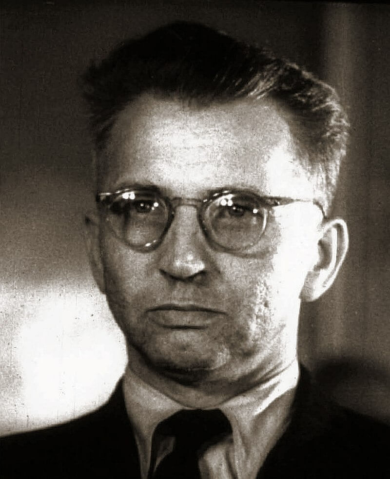

### Oberkomando

W Dowództwie Naczelnym dopiero teraz dochodzi do przełomu. Sztabowcy niemieccy uświadamiają sobie powagę sytuacji na wschodzie. Dziś generał Winter przekazuje Jodlowi memoriał w istocie skierowany do Hitlera, ostrzegający, że sytuacja na froncie wschodnim grozi przegraniem wojny i wzywający do przejścia do obrony na froncie zachodnim i skierowaniu wszystkich rezerw na wschód.

### Sûre

FBTODO

- [„The 8th infantry captured German soldiers along the Sauer river on January 19, 1945“ / The young Landser has already won the Iron Cross 2nd class. / The Cross itself was only worn at the day it was presented. After that, the ribbon was sewn in the second buttonhole. / Morning](https://twitter.com/History1History/status/1570249999233191936)

### Operacja wiślańsko-odrzańska

Wczoraj minął tydzień od rozpoczęcia operacji wiślańsko-odrzańskiej na odcinku południowym i pięć dni od włączenia się do ofensywy 1 Frontu Białoruskiego. Najważniejsze zdobyte miasta to: Warszawa, Częstochowa, Kielce, Radom. Wszędzie Niemcy ustępują, nie ma żadnej przygotowanej linii oporu. Żadne miasto nie zostało porządnie ufortyfikowane.

Dziś zdobyto Stare Miasto w Krakowie.

1 Armia Pancerna pod dowództwem generała Michaiła Katiukowa wkroczyła do Łodzi. Już wczoraj do Helenówka dotarł 2 Batalion Czołgów kapitana Boczkowskiego. Katiukow:
>Zabroniłem Boczkowskiemu prowadzenia walk w mieście. Stare miasto tkaczy zostałoby zniszczone, a wraz z nim jego fabryki, co przyniosłoby Polsce duże straty

Dziś 1 Armia Pancerna wkroczyła do miasta z dwóch kierunków: od strony ulicy Rzgowskiej i Narutowicza oraz od strony Łagiewnik i Szosy Rokicińskiej. Łódź zdobyta!

(wiki podaje informację, że była to stalingradzka 8 Gwardyjska Armia pod dowództwem generała Wasilija Czujkowa)

Tylko dzisiaj Niemcy zostają wyparci z 600 miejscowości. 1 Front Białoruski zalicza dziś do swoich zdobyczy oprócz Łodzi, także Kutno i Kłodawę.

### Mława

FBTODO
19 stycznia 1945 r. – do Mławy wkroczyły wojska radzieckie II Frontu Białoruskiego.

### Kinder-KL Litzmannstadt

Zajęcie Łodzi przez Armię Czerwoną oznacza koniec działania obozu prewencyjnego dla młodych Polaków Policji Bezpieczeństwa w Łodzi.

Powstał w grudniu 1942 na terenie łódzkiego getta i był przeznaczony dla Polaków w wieku od 6 do 16 lat. Osadzano tem dzieci schwytane przez policję na drobnych przestępstwach oraz sieroty po zabitych bądź aresztowanych rodzicach. Przez cały czas istnienia obozu przewinęło się przez niego 2 do 3 tysięcy dzieci, ok 200 z nich zmarło. W momencie wyzwolenia było tam osadzonych 800 osób.

- [Obóz przy ulicy Przemysłowej w Łodzi](https://pl.wikipedia.org/wiki/Ob%C3%B3z_przy_ulicy_Przemys%C5%82owej_w_%C5%81odzi)

### Egzekucja w Skaryszewie

W marcu 1944 w Kaliszu nastąpiła wpadka i Niemcy aresztowali kilkadziesiąt osób działających w podziemiu. Szokiem dla nich okazał się fakt, że wiele z nich to byli Niemcy. Postanowili zorganizować proces pokazowy. Prowadziło go łódzkie Gestapo. Śledztwo i proces trwały 9 miesięcy i wydano wiele wyroków śmierci.

Prawo nakazywało odczekać z egzekucją przynajmniej 100 dni. Wobec zbliżającego się frontu zdecydowano się przyspieszyć egzekucję. Wywieziono 56 osób do lasu pod Skaryszewem i rozstrzelano.

Po ekshumacji udało się ustalić tożsamość tylko 30 osób. Resztę pochowano w zbiorowej mogile na cmentarzu tynieckim.

### Dolny Śląsk

Również dziś Armia Czerwona po dwóch dniach walki przełamała linię obronną B i przekroczyła dawną granicę polsko-niemiecką wkraczając do Rzeszy, na Dolny Śląsk.

1 Front Ukraiński dotarł do Odry i utworzył kilka przyczółków.

Na Śląsku Opolskim zdobył Byczynę i Gorzów Śląski.

### "Wędrujący kocioł"

Pod Paradyżem "wędrujący kocioł" o 3 nad ranem znalazł się w pod ogniem i po kilkugodzinnym boju już się wydawało, że nie da się oderwać od nieprzyjaciela, ani przebić do swoich, kiedy nagle i cudownie pojawiła się, nie, nie była to amerykańska kawaleria..., ale czołgi XXIV Korpusu Pancernego generała Nehringa. Do wieczora większość "wędrującego kotła" dotarła do Pilicy w okolicy Sulejowa. Wciąż byli kilkadziesiąt km za frontem.

Dla Ahfena to kulminacyjny moment losu tych oddziałów warto zwrócić uwagę, jak pieczołowicie odnotowuje sytuacje, kiedy szczęśliwy traf lub warunki pogodowe staja po stronie Niemców. Ta wielka armia oglądała przez lornety Moskwę, wielu żołnierzy ma zdjęcia z Krymu. A teraz uciekają a cała ich nadzieja w chmurach i mgle.

### Brygada Świętokrzyska NSZ

W nocy z 19 na 20 stycznia Brygada Świętokrzyska NSZ już w eskorcie niemieckiej przekroczyła Odrę w Krapkowicach.

Dziś mają miejsce trzy niebywale ważne dla Polski wydarzenia, które jakże symbolicznie zbiegają się jednego dnia. Tak to bywa, kiedy historia naciera galopem:

### Armia Krajowa

Rozwiązanie Armii Krajowej. Wobec braku uzasadnienia dla dalszego trwania w konspiracji i wyzwolenia większości ziem polskich spod hitlerowskiej okupacji generał Leopold Okulicki "Niedźwiadek" wydał rozkaz demobilizacji dla żołnierzy Armii Krajowej:
>Żołnierze Armii Krajowej! Daję Wam ostatni rozkaz. Dalszą swą pracę i działalność prowadźcie w duchu odzyskania pełnej niepodległości Państwa i ochrony ludności polskiej przed zagładą. Starajcie się być przewodnikami Narodu i realizatorami niepodległego Państwa Polskiego. W tym działaniu każdy z Was musi być dla siebie dowódcą. W przekonaniu, że rozkaz ten spełnicie, że zostaniecie na zawsze wierni tylko Polsce oraz by wam ułatwić dalszą pracę - z upoważnienia Pana Prezydenta Rzeczypospolitej Polskiej zwalniam Was z przysięgi i rozwiązuję szeregi AK. 
>W imieniu służby dziękuję Wam za dotychczasową ofiarną pracę. Wierzę głęboko, że zwycięży nasza Święta Sprawa, że spotkamy się w prawdziwie wolnej i demokratycznej Polsce. Niech żyje Wolna, Niepodległa, Szczęśliwa Polska!

Drugi, tajny rozkaz, ponura zapowiedź realiów komunistycznej Polski, skierowany do sztabów AK brzmiał:
>W zmienionych warunkach nowej okupacji działalność naszą nastawić musimy na odbudowę niepodległości i ochronę ludności przed zagładą. W tym celu i w tym duchu wykorzystać musimy wszystkie możliwości działania legalnego, starając się opanować wszystkie dziedziny życia Tymczasowego Rządu Lubelskiego [...] AK zostaje rozwiązana. Dowódcy nie ujawniają się. Żołnierzy zwolnić z przysięgi, wypłacić dwumiesięczne pobory i zamelinować. [...] Zachować małe dobrze zakonspirowane sztaby i całą sieć radio. Utrzymać łączność ze mną i działajcie w porozumieniu z aparatem Delegata Rządu

*Leopold Okulicki "Niedźwiadek", ostatni dowódca Armii Krajowej. Zdjęcie z procesu szesnastu w Moskwie 1945. Rok później zamordowany. 
[By nieznany - Institute of National Remembrance Archive](https://commons.wikimedia.org/w/index.php?curid=11816506), Domena publiczna*

### Warszawa

Jakby w kontrapunkcie dokładnie tego samego dnia w Warszawie odbyła się defilada 1 Armii WP.

### Cenzura

I również w Warszawie rozkazem ministra bezpieczeństwa publicznego Stanisława Radkiewicza powołana została fundamentalna dla państwa totalitarnego instytucja - cenzura. Dziś zaczyna działalność Centralne Biuro Kontroli Prasy, później w PRL znane jako Główny Urząd Kontroli Prasy, Publikacji i Widowisk z siedzibą na Mysiej. Od początku stawiał na młode kadry, nie stawiając wielkich wymagań, w zasadzie wystarczyło umieć i chcieć czytać i mieć odpowiednią linię polityczną. To znak nowych czasów. Pierwszy spis wydawnictw zakazanych, tzn. przeznaczonych do usunięcia z bibliotek powstał dopiero 6 listopada 1945.

### Syców

(Ustalić datę) Dowódca 269 DP spotkał się w zamku w Sycowie (niem. Groß Wartenberg) z jego właścicielem księciem kurlandzkim Bironem i jego małżonką księżną Herzelaide, wnuczką cesarza Wilhelma II.

Zalecił im bezzwłoczne opuszczenie zamku, wspaniałej neogotyckiej rezydencji z początku XIX wieku. Nie było czasu na wywiezienie ślubnego prezentu cesarza: królewskiej kolekcji szkła i porcelany dawnego poczdamskiego kolegium tytoniowego Fryderyka Wilhelma I. Udało się natomiast wywieźć w ostatniej chwili pozostawione w Oleśnicy (niem. Oels) bagaże księżniczki małżonki następcy tronu, Cecylii Augusty Marii Mecklenburg-Schwerin.

Kilka dni później Syców z zamkiem wpadł w ręce sowieckie nietknięty, Armia Czerwona stacjonowała tam później pół roku, połowę miasta obracając w ruiny, wypalone do cna zamek i ratusz musiały zostać rozebrane przez Polaków.

### Wrocław

W przeciwieństwie do Poznania, który dopiero od drugiego rozbioru (1793) jest Prusach i jest traktowany jak brama do Berlina, Wrocław leży na uboczu i nie jest sowietom do niczego potrzebny, bo - jak się wkrótce okaże - Odra na tym odcinku nie jest żadną przeszkodą. Wrocław ma znaczenie strategiczne, ale tylko dla Niemców jako lokalna pozycja obrony wiążąca siły nieprzyjaciela i organizująca opór w regionie Dolnego Śląska.

A jednak po obu stronach zapadły już decyzje o jego zagładzie. Dla Niemców Wrocław był symbolem: kresowe miasto Rzeszy, stolica Śląska, miejsce formowania się Freikorpsu Lũtzowa. Ostatnią nadzieją Hitlera było przeciąganie wojny jak najdłużej by doprowadzić do separatystycznego pokoju i wspólnie z aliantami zachodnimi ruszyć na sowietów. Z podobnych powodów zdecydowany był zająć miasto marszałek Koniew dowódca 1 Frontu Ukraińskiego. Obawiał się wciąż silnej Grupy Armii A i chciał mieć bezpieczne zaplecze do walk na Przedgórzu Sudeckim.

Mimo utraty kluczowych pozycji na wschodzie zatrzymanie Armii Czerwonej gdzieś pomiędzy Wisłą a Odrą wydaje się wciąż nie ulegać wątpliwości. Przecież Wehrmacht nie może ulec. Przecież propaganda zapewniała, że Iwan jest już wyczerpany wojną i niezdolny do ataku. Przecież tak bardzo chcieli w to wierzyć.

Dr Stefan Kuczyński:
>W pierwszych dniach stycznia 1945r. poczęło to "coś" przemawiać. Wracała fala spod murów Stalingradu, Moskwy, Leningradu. W tej odległy jeszcze pomruk wsłuchiwali się Polacy, dręczeni niewolnicy w fabrykach wrocławskich Linke-Hofmann-Werke, Archimedeswerk, Hydrometer, Knauth. Wracała fala. Z każdym dniem była coraz bliżej, a równocześnie z każdym dniem słup rtęci termometru spadał, mróz skuwał ziemię, powoli zaczął prószyć śnieg. Razem z nim przybierał Wrocław inne oblicze: wzmógł się ruch samochodów, rozszalało się Gestapo, węsząc za "dezerterami", za ukrywającymi się w mieście członkami organizacji podziemnych. Zaludniały się bunkry przy ulicy Grabiszyńskiej i Ładnej, przy placu Strzegomskim, przy dworcu Odra, podziemia przy Nowym Targu i placu Solnym oraz przed Dworcem Głównym.

Luiza Hartman:
>Spokój i poczucie bezpieczeństwa, aż do jesieni 1944 r. było udziałem nie tylko naszej rodziny, ale i większości mieszkańców Breslau. Trzeba było wprawdzie oszczędzić środki żywnościowe, ale zapobiegliwość ojca i gospodarność naszej mamy powodowała, że nie odczuwaliśmy na ogół dotkliwych braków. (...) Niedługo po powrocie do domu, zobaczyłam że na ulicach pojawiły się oddziały Volkssturmu, do których powołano wszystkich, którzy dotąd uniknęli powołania do wojska. Przemówienie noworoczne gauleitera Hankego nacechowane było optymizmem i wielką pewnością sibie. "Rosjanie nigdy nie przekroczą granicy Śląska - oświadczył przez radio - a jeśli się do niej zbliżą, to zostaną odparci na wschód, jak przed wiekami hordy Mongołów"... Mimo tych słów z każdym dniem odczuwało się narastające napięcie i przygnębienie.

Sytuacja rozwija się niezwykle dramatycznie. Jak pisze Horning jeszcze 17 stycznia Wrocław "*przypominał normalnie funkcjonujące miasto*". Dopiero następnego dnia Wraz z załamaniem sytuacji na wschodzie na dworcach zaczęły się gromadzić tłumy. Wkrótce pojawiły się pierwsze wozy z uciekinierami z Kraju Warty, do którego sowieci wtargnęli już 16 stycznia. Jeszcze dziś 19 stycznia władze zapewniały, że Gau (jednostka administracyjno-państwowa, na której czele stał Gauleiter; partyjny odpowiednik województwa) na zawsze pozostanie niemiecki, tymczasem uciekinierzy z poznańskiego, głównie chłopi na wozach, tworzyli już niekończącą się, nieprzeliczoną kolumnę.

Dziś gauleiter Karl Hanke wydał rozkaz ewakuacji powiatów dolnośląskich położonych na wschód od Odry. Wkrótce dołączyli do uciekinierów z Kraju Warty. Od miesięcy do Wrocławia przybywają uchodźcy. Nigdy dotąd nie było ich tylu. Teraz już nawet nie próbują się zatrzymywać. Nie ma dla nich miejsca, jak i Wrocław nie jest już dla nich miejscem bezpiecznym. A dla wrocławian? 19 stycznia to ostatni dzień, kiedy pytający co robić słyszą od władz zdecydowane: pozostać!

Już wieczorem następuje zmiana: w ten piątkowy wieczór funkcjonariusze Partii obchodzili domy i wzywali do udania się na dworzec i jak najszybszego wyjazdu. Gauleiter Hanke podjął decyzję o ewakuacji Wrocławia. Jutro zostanie ogłoszona publicznie.

W sobotę we Wrocławiu rozpęta się piekło.

### Odnośniki

- [Tajemnica lasu Gołys. Historia zbłąkanych lotników](http://www.serwislokalny.com/aktualnosci/1777/tajemnica-lasu-golys-historia-zblakanych-lotnikow/)
- [W lesie odkryli samolot i szczątki żołnierzy](https://tvn24.pl/katowice/bierun-w-lesie-odkryli-samolot-ze-szczatkami-zolnierzy-ktory-spadl-75-lat-temu-3224705)
- [Waldemar Kowalski "Kraków zabytkami stoi dzięki Armii Czerwonej? Sowiecki manewr wcale nie ocalił miasta"](https://natemat.pl/130001,krakow-zabytkami-stoi-dzieki-armii-czerwonej-kulisy-sowieckiego-manewru-sprzed-70-lat)

