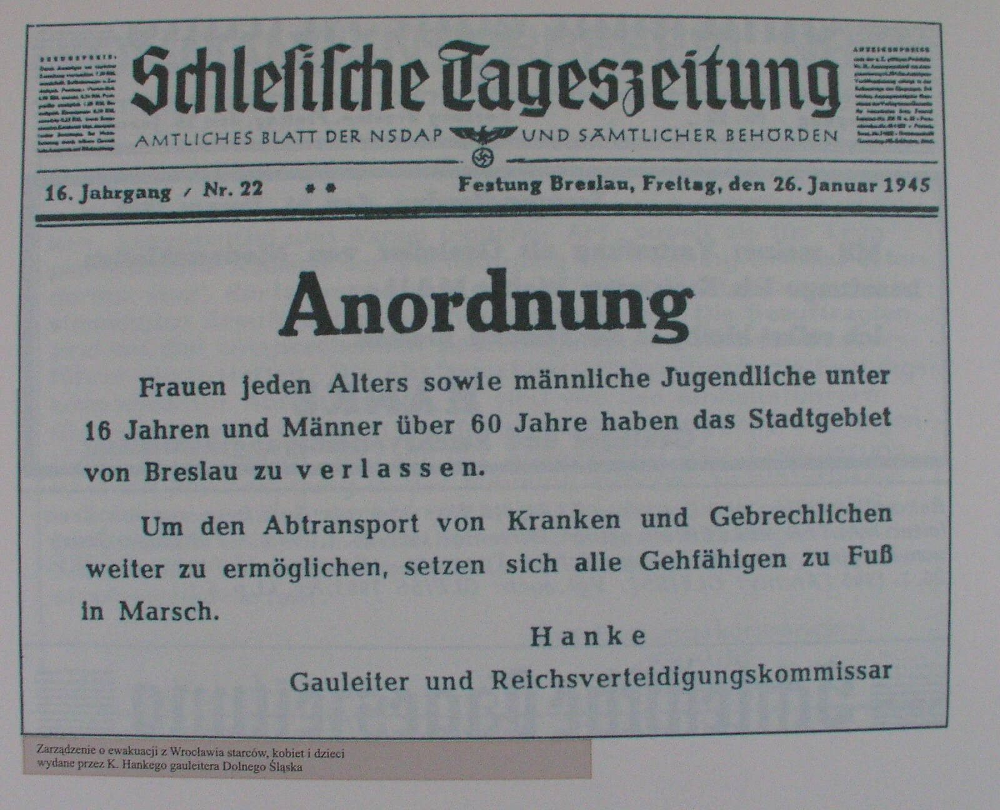

### 1. Front Białoruski

1 Front Białoruski zajął dziś Konin, Brześć Kujawski, Koło, Radziejów, Nidzicę i Włocławek.

Awangarda Frontu dotarła do Poznania i podjęła próbę ataku z marszu. Niestety jak się okazało, miasto było już przygotowane do obrony. Stanowiło pierwszą poważną przeszkodę na drodze żołnierzy Żukowa do Berlina.

W lesie pod Grajewem Niemcy rozstrzelali ponad 120 osób, głównie członków miejscowej inteligencji wraz z rodzinami.

### 1 Front Ukraiński

1 Front Ukraiński: Koziegłowy, Olkusz i Nowy Sącz.

Podczas walk o Kluczbork sowieccy jeńcy wojenni, będący robotnikami przymusowymi w zakładzie produkującym drut kolczasty, zorganizowali bunt, 18 z nich zginęło.

W Sieradzu opuszczonym przez Wehrmacht doszło do tragicznej pomyłki. Całkowicie cywilne już miasto zostało zbombardowane przez sowieckich lotników, około 100 osób zginęło, 200 zostało rannych.

### Masakra w Ostrzeszowie

Od rana w Ostrzeszowie żandarmi wywlekali Polaków z ich z domów. Organizowano łapanki na ulicach. Zebrano ich na rynku pod Ratuszem i trzymano pod silną strażą. Chwytanych brutalnie bito i czasem do nich strzelano. W ten sposób na ulicach zmordowano 14 ludzi w tym jednego Niemca, przesiedleńca znad Morza Czarnego.

Na Rynku dla postrachu zorganizowano pokazową egzekucję - rozstrzelany został uczeń krawiecki Walenty Płaczek. Pozostałych 80 aresztowanych zamknięto i byli przeznaczeni do egzekucji następnego dnia. Jutro uratuje ich wkroczenie sowietów.

Wydarzenia te przeszły do historii pod nazwą Krwawa Sobota.

### Górny Śląsk

Zaczyna się okrążenie Górnego Śląska. Oddziały 1 Frontu Ukraińskiego zaczęły przekraczać dawną granicę niemiecko-polską sprzed 1939.

Marsz śmierci z Auschwitz dotarł do Żor. Rozstrzelano tam 47 ludzi.

### Egzekucja Wacława Krzeptowskiego

Oddział AK "Kurniawa" (burza śnieżna) pod dowództwem porucznika Tadeusza Studzińskiego "Kurzawy" aresztował w okolicy Zakopanego Wacława Krzeptowskiego i dzisiaj dokonał jego egzekucji przez powieszenie. Przy ciele zabitego znaleziono testament:
>Ja niżej podpisany Wacław Krzeptowski urodzony 1897 roku dnia 24 czerwca w Kościeliskach przekazuję cały swój nieruchomy i ruchomy majątek uwidoczniony w księgach hipotecznych w Zakopanem na rzecz oddziału partyzanckiego Kurniawa grupy Chełm AK z własnej nieprzymuszonej woli, jako jedyne zadośćuczynienie dla narodu polskiego za błędy i winy popełnione przeze mnie wobec polskiej ludności Podhala w okresie okupacji niemieckiej od roku 1939 do 1945 Kościelisko, 20 stycznia 1945, 22.30

Krzeptowski był przewodniczącym Goralenverein, organizacji założonej 29 listopada 1939 przez część działaczy Związku Górali, którzy byli zwolennikami kolaboracji. Według hitlerowskiej teorii rasowej byli przedstawicielami tzw. Goralenvolk, czyli germańskich górali. Jakkolwiek by to nie wyglądało dziwnie, Niemcy wierzyli w istnienie germańskich górali w Tatrach, miało to być dowodem na odwieczną germańskość tych ziem.

Idea ta nie cieszyła się popularnością wśród górali, np. próba utworzenia oddziału wojskowego spaliła na panewce, ale były regiony gdzie wiele osób poszło na kolaborację z okupantem. Jest to temat do dziś wstydliwy i powodujący wiele podziałów. Krzeptowski był głównym działaczem i organizatorem tego ruchu. Od 1942 był na czele Goralisches Komitee samorządu będącego namiastką autonomii góralskiej. Spotkał się z gauleiterem Hansem Frankiem i starał się namówić go do idei założenia suwerennego państwa góralskiego. Prześmiewczo był nazywany "goralenführerem"

Wziął udział w powstaniu słowackim, a kiedy wrócił w swoje strony, zabiło go AK. Został pochowany na cmentarzu parafialnym w Kościelisku.

- Okupowana Polska ["Wacław Krzeptowski - przywódca Goralenvolk" [YT 19:26]](https://www.youtube.com/watch?v=nKeGXjU59Q8)

### Wrocław

Przenieśmy się do Wrocławia, na Dolny Śląsk, ziemie rdzennie niemieckie.

Jest 20 stycznia, sobota. Najbardziej tragiczny weekend w historii Wrocławia. Decyzję o ewakuacji Wrocławia gauleiter Hanke podjął 19 stycznia, jeszcze wczoraj funkcjonariusze NSDAP obchodzili domy, wydając polecenie natychmiastowego skierowania się na dworzec i wyjazdu. Dotarli do nielicznych.

Dziś ogłoszono to wszystkim: wszystkie kobiety i dzieci mają opuścić miasto. Z megafonów słychać:
>Uwaga! Uwaga! Mieszkańcy Wrocławia! Komisarz Obrony Rzeszy i Gauleiter Śląska ogłaszają: Wrocław będzie stopniowo ewakuowany. Nie ma żadnych powodów do niepokoju i paniki. Najpierw miasto opuszczą kobiety i dzieci. Należy zabrać bagaż podręczny. Kobiety z małymi dziećmi mają zabrać ze sobą kochery: NSV [nazistowska opieka społeczna] przygotuje kuchnie polowe i dystrybucje mleka. Bliższe informacje udzielają dzielnicowe punkty ewakuacyjne...

A potem po prostu:
>Kobiety i dzieci mają natychmiast opuścić miasto.

Polecenie, które wówczas otrzymali wrocławianie, podsumowuje obwieszczenie z 26 stycznia 1945 opublikowane w formie afisza i w "Schlesische Tageszeitung":
>Zarządzenie! 
>Wszystkie kobiety, młodociani poniżej 16 roku życia i mężczyźni mający więcej niż 60 lat muszą natychmiast opuścić miasto. 
>Aby umożliwić ewakuację osób chorych i niedołężnych, są zobowiązani udać się w drogę pieszo. 
>Hanke 
>Gauleiter i Komisarz Obrony Rzeszy 

Obwieszczenie to było ponawiane wielokrotnie i w różnych formach aż do zamknięcia oblężenia wokół Wrocławia. Wiele osób opuściło miasto, ale powróciło jeszcze tego samego dnia, albo po kilku dniach widząc, co się dzieje, jakie warunki panują na drodze.

*Obwieszczenie gauleitera Karla Hanke datowane na 26 stycznia 1945 nakazujące opuścić miasto wszystkim kobietom, dzieciom do 16 roku życia i mężczyznom po 60. 
Tekst oryginału: "Anordnung! 
Frauen jeden Alters sowie männliche Jugendliche unter 16 Jahren und Männer über 60 Jahre haben das Stadtgebiet von Breslau zu verlassen! 
Um den abtransport von Kranken und Gebrechlichen weiter zu ermöglichen, setzen sich alle Gefälligen zu fuß in marsch" 
Źródło: Wikipedia, domena publiczna*

Jak to relacjonuje ówczesny wojskowy komendant Twierdzy, generał Krause, jeszcze w grudniu na naradzie w Berlinie przedstawił konieczność ewakuacji ludności Wrocławia, mówiąc, że z zachodu przeniesiono na ten teren traktowany jako bezpieczny schron Rzeszy obiekty przemysłowe i podjęto działania mobilizacyjne w sektorze cywilnym. Ze wschodu napływały masy uchodźców. Pod koniec 1944 Wrocław liczył około miliona mieszkańców, co stanowiło dramatyczny wzrost wobec niewiele ponad 600 tys. w czasach pokoju, a i tak przedwojenny Wrocław był jednym z najbardziej zagęszczonych miast Rzeszy. Trzeba też wziąć pod uwagę, że miał wówczas znacznie mniejszą powierzchnię, ok 60% obecnego stanu: 175 km2 wobec obecnych 292 km2.

Obrona tak zagęszczonego miasta była niemożliwa i była zbrodnią. Kolej była gotowa podstawić 100 pociągów na kilka dni, Krause proponował ewakuować ok. 200 tys. starszych i słabszych mieszkańców, kobiet w ciąży i matek z dziećmi. Jednak wówczas Karl Hanke odrzekł
>Gdzie ja mam podziać tych ludzi, a poza tym Führer każe mnie rozstrzelać, jeżeli teraz w czasie najgłębszego pokoju, przyjdę do niego z czymś takim.

Na początku wydawało się, że instytucje miejskie jeszcze działają. Tysiące ludzi zmierzało w kierunku dworców kolejowych tylko po to, żeby dowiedzieć się, że nawet jeżeli jeszcze pociągi jeżdżą, to oni się do nich nie dostaną, natomiast ci, którzy zdołali tam dotrzeć, nie mogli się z nich wydostać. Ludzie ginęli w ścisku, tratowali się nawzajem. Najpierw to były pojedyncze ofiary, później setki. Z powodu tłoku nie było jak usuwać zwłok.

Fala uciekinierów ruszyła na południe, by pieszo wydostać się z miasta. Nie przygotowano im żadnych środków transportu, żadnej aprowizacji i pomocy na drodze. Nie zorganizowano noclegów ani choćby elementarnej opieki medycznej. Średnia temperatura stycznia wynosiła wtedy ok -6°C, w nocy spadała do -20°C co oznaczało, skutą mrozem ziemię i brak bezpiecznego noclegu w nieogrzewanych pomieszczeniach. Najsłabsi ginęli.

Świadkowie wspominają, jak wyglądała droga ewakuacji. Ponieważ ziemia była zbyt twarda, by pochować umarłych, pozostawiano ich na poboczu. Najbardziej rzucały się w oczy trupy dzieci, często niemowląt w becikach leżących na ziemi, wózki były wciąż potrzebne żywym.

W krótkim czasie miasto opuściło ponad pół miliona ludzi, do 700 tys. Większość z nich to były kobiety, ludzie starsi i dzieci. Przez Oporów szli na Kąty Wrocławskie i dalej w kierunku na Legnicę. Ocenia się, że około 90 tysięcy z nich zmarło.

Była to tzw. Wielka Ucieczka (niem. die große Flucht). Część znalazła schronienie w Wałbrzychu w opuszczonych zakładach przemysłowych. Ci którzy dotarli do Drezna padli ofiarą bombardowania, które w połowie lutego obróciło miasto w ruiny.

Ksiądz Paul Peikert:
>Śląsk jest kwitnącą krainą chłopów, serce się kraje na widok rodzin chłopskich wypędzonych przemocą. Właściciele są niemal bez wyjątku na froncie, podobnie ich synowie, być może nawet ich córki. Głównie są to ludzie starsi i dzieci, które siedzą na wozach, lub młodsze kobiety, które tylko przy pomocy jeńców wojennych musiały uprawiać swoją rolę. Ta masowa ucieczka przypada w dodatku w ostre dni zimy, gdy temperatura spada do 13-15 stopni. Dzieci zamarzają i ich krewni układają je na skraju ulicy. Donoszą, że zwozi się do tutejszych kostnic pełne ciężarówki takich zmarzniętych dzieci. Moja służąca opowiadała mi dziś, że sama widziała 8 zwłok dzieci na swej drodze przy szosie strzelińskiej za koleją obwodową i trupa starego mężczyzny w przydrożnym rowie. [...] Także Wrocław doczekał się ewakuacji. Prawdziwa panika i zamęt ogarnęły masy. Dworce kolejowe są całymi dniami tak przepełnione, że przebrnięcie przez tłumy jest niemożliwością. Wszystko tłoczy się do pociągów, które mogą przyjąć tylko ograniczoną ilość uciekinierów, największa część musi pozostać i próbować następnym razem. Większość ludzi zabiera wózki dziecięce i niezbędny bagaż, pieszo udając się szosą w niepewne. Obok chłopskich wozów ciągną nieprzerwane kolumny mieszczan, którzy na wózkach dziecięcych i kolaskach wiozą swą chudobę ku nieznanej jeszcze i wątpliwej przyszłości. Od tych kobiet i dzieci wymaga się, aby ogromną drogę przebyły pieszo. Obiecuje się im, że w Jaworzynie będą miały połączenie kolejowe, ale drogę z Wrocławia do Jaworzyny muszą przebyć pieszo. Skoro zaś dotrą do Jaworzyny - tam taki sam widok przepełnionego dworca.

Taki był koszt tchórzliwego zaniedbania i odłożenia ewakuacji na później, co w połączeniu z decyzją o obronie miasta bez względu na koszty spowodowało masakrę. Kiedy usłyszymy o "Wypędzonych", przypomnijmy sobie kto, ich wypędził i w jakich warunkach. W Prusach Wschodnich sytuacja przedstawiała się jeszcze gorzej. Stamtąd nie było nie tylko jak, ale i dokąd uciec.

### Opole

Inaczej niż we Wrocławiu, w Opolu - również ogłoszonym Twierdzą - ewakuacja przebiegła planowo i w zorganizowany sposób. Rozpoczęto ją jeszcze 18 stycznia, a dziś kiedy padł rozkaz ewakuacji, mieszkańców Opola wywożono autobusami, a potem pociągami w stronę Kłodzka.

W ciągu czterech dni miasto opuściło 60 tysięcy ludzi. Zostało mniej niż tysiąc. Więźniów i robotników przymusowych ewakuowano w konwojach pieszych. Tyle się dało zrobić.

Komendantem miasta był pułkownik hrabia Friedrich Albrecht von Pfeil pochodzący ze starego śląskiego rodu, którego historia w tym regionie sięgają średniowiecza. Opole wiele mu zawdzięcza. Jutro popełni samobójstwo.

### Odnośniki

- [Ostrzeszów uczcił rocznicę Krwawej Soboty](http://wlkp24.info/ostrzeszow-uczcil-rocznice-krwawej-soboty/)
- [Beata Maciejewska "Z Festung Breslau pierwsza wyszła śmierć"](https://wroclaw.wyborcza.pl/wroclaw/1,35771,17262745,Z_Festung_Breslau_pierwsza_wyszla_smierc.html)
- [Ostatnia twierdza Rzeszy](https://wroclife.pl/czas-wolny/ostatnia-twierdza-rzeszy/)
