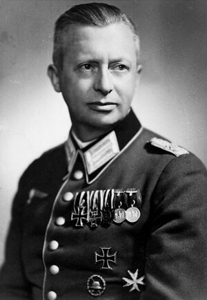

### 3. Front Białoruski 

Żołnierze 105 pułku piechoty NKWD w zasadzce pod Kowalkami koło Naczy (grodzieńszczyzna) zastrzelili Jana Borysewicza ps. "Mściciel", zdolnego dowódcę lokalnej partyzantki. We wrześniu 1939 dowodził plutonem, potem był więziony przez NKWD. W 1941 zaczynał z kilkuosobowym oddziałem, wkrótce miał oddział 650 dobrze uzbrojonych ludzi. Brał udział a operacji "Ostra Brama".

Sowieci obwozili ciało kapitana AK jak trofeum, wystawiając je na widok pubLiczny na rynkach miasteczek.

### 2 Front Białoruski

Po kilku dniach powolnych postępów udało się dokonać wyłomu w linii przeciwnika. Drugim etapem operacji wschodniopruskiej jest operacja mławsko-elbląska. Dziś Stawka wydaje rozkaz: przez atak w kierunku Zalewu Wiślanego należy odciąć wycofujące się wojska Grupy Armii Środek: 2 i 4 Armie.

Dziś zdobyto Nidzicę.

W lesie w pobliżu Małszewa uciekający na rozkaz Wehrmachtu mieszkańcy zostali zatrzymani przez czerwonoarmistów. Trzy rodziny, kilkanaście osób. Wszystkim kazano zsiąść z wozów. Tylko trzy osoby się uratowały. Jest to tylko jedna z wielu egzekucji, jakie miała miejsce w tych lasach. To już były ziemie traktowane jak Rzesza, a Mazurzy dla Armii Czerwonej i później dla PRL-u nie różnili się od Niemców.

- Olaf Popkiewicz ["Wielka Ewakuacja 1945 czyli Mierzeja Wiślana cz. IV" [YT 30:41]](https://www.youtube.com/watch?v=SRBKz3NBUEY)

### Mauzoleum Hindenburga

20 km na południe od Olsztyna znajduje się Olsztynek. Na zachód od Olsztynka w latach 1924-27 wybudowano monumentalny pomnik bitwy pod Tannenbergiem (niem. Tannenberg-Denkmal). Bitwa ta w sierpniu 1914 zadecydowała o przewadze niemieckiej na tym odcinku frontu. Była nie tylko wielkim zwycięstwem militarnym, ale przede wszystkim propagandowym. Było to wielkie zwycięstwo niemieckiej armii na niemieckich kresach, które zbudowało pozycję dwóch wielkich dowódców: Hindenburga i Ludendorfa. Tej popularności Paul von Hindenburg zawdzięcza zwycięstwo w wyborach prezydenckich, pełnił tę funkcję w latach 1925-34.

Już w nowych warunkach politycznych Niemiec hitlerowskich pomnik stał się świątynią nacjonalizmu. 2 sierpnia 1934 zmarł prezydent Paul von Hindenburg. Mieszkał w Ogrodzieńcu (niem. Neudeck), miał tam majątek 900 ha. Ogrodzieniec jest 60 km na zachód od pomnika. Odbyły się wielkie państwowe uroczystości, w których wziął udział Hitler. Przy okazji przebudowano pomnik i nadano mu nową nazwę Mauzoleum Hindenburga.

Całość miała formę zamkowego muru z ośmioma wyniosłymi wieżami wysokości 20 metrów. Wewnątrz były trybuny i krypta. Za wzór obrano Stonehenge i XIII-wieczny zamek Castel del Monte cesarza Fryderyka II Hohenstaufa.

Wraz ze zbliżaniem się frontu trumny Hindenburga i jego żony usunięto i przez Królewiec 25 stycznia ewakuowano do Turyngii, gdzie zostały ukryte w kopalni soli.

Dziś rano dowódca 299 DP pułkownik Göbel otrzymał rozkaz wysadzenia go w powietrze. Nie miał niezbędnych ku temu materiałów wybuchowych, użył więc tego co miał czyli niewielkiej liczby min i wysadził najważniejszą część Mauzoleum - kryptę Hindenburga. Wieczorem dojechało 30 ton ładunków wybuchowych i od razu przystąpiono do pospiesznego wysadzania. Destrukcję pomnika kontynuowano jeszcze 22 stycznia, ale nie udało się doprowadzić jej do końca bo front zbliżał się zbyt szybko.

Ruiny zostały rozebrane przez czerwonoarmistów i potem przede wszystkim przez Polaków. Lew znajduje się przed Ratuszem w Olsztynku. Pozyskane materiały zostały użyte na potrzeby wielu budowli, m.in. warszawskiego Domu Partii czyli obecnej Giełdy.

### 1. Front Białoruski

Tempo sowieckich postępów nie słabnie.

Dziś 1 Front Białoruski zdobywa Turek, Konin, Gniezno, Płock, Inowrocław, Żnin, Nowe Miasto Lubawskie, Piechcin, Rypin i Szubin.

Awangarda Frontu dotarła do Poznania.

### 1. Front Ukraiński

Na południu 1 Front Ukraiński ugruntowuje pozycję krakowską, zdobywa Wieliczkę i Myślenice. Najważniejszy jest w tej chwili kierunek uderzenia na Górny Śląsk. Zdobyte zostają Strzelce Opolskie, Dobrodzień, Rychtal i Kluczbork, daleko na zachodzie Namysłów i Bierutów. Awangarda Frontu zdobywa Kępno i Olesno.

10 Gwardyjski Korpus Pancerny z 4 Gwardyjskiej Armii Pancernej zdobył Ostrzeszów, uwalniając 80 aresztowanych wczoraj Polaków, którzy dziś mieli zostać rozstrzelani.

Na drodze do Wrocławia pierwszym miastem po niemieckiej stronie granicy z 1939 był Syców.

Wieczorem 21 stycznia został opuszczony przez cywilów i władze niemieckie. Pozostał niewielki 2 tys. garnizon złożony z Wehrmachtu, Volkssturmu i SS. Jeszcze tego samego dnia w nocy czołgi Rybałki przełamują opór i zdobywają Syców.

Są już w Rzeszy! To niemiecka ziemia. Do Wrocławia mają w linii prostej 50 km. Gdyby nie zaciemnienie, mogliby wypatrywać łuny miasta.

Z okolic Opola ma wyjść natarcie mające na celu okrążenie sił niemieckich na Górnym Śląsku. Wczorajszy rozkaz Koniewa nakazuje 3 Armii Pancernej Gwardii generała Rybałki dokonać niezwykłego manewru: będąc w trakcie walki, na czole frontu, ma zachowując prędkość i pełną zdolność bojową skręcić całą Armią pod kątem prostym w lewo, na południe i zajść od tyłu siły niemieckie znajdujące się przed 5 Armią Gwardii, która po zdobyciu Częstochowy wyraźnie zwolniła.

Ten manewr zagrozi siłom niemieckim na Górnym Śląsku. A 3 Armia jest jednostką, która może tak trudny rozkaz wykonać. Kieruje się na południe. VIII Korpus wycofuje się za Odrę.

### Opole

Do Opola gdzie tymczasowo znajduje się sztab Grupy Armii A, przybył minister uzbrojenia Rzeszy Albert Speer i odbył długą rozmowę z generałem Schörnerem (który dopiero w Opolu odnalazł swój sztab). Miało to miejsce w nieistniejącym już hotelu Form, przy obecnej ulicy Krakowskiej.

Opole miało kluczowe znaczenie dla utrzymania regionu, a jego upadek oznaczał utratę Górnego Śląska. Komendant miasta, von Pfeil, który zrobił, co mógł by ewakuować ludność cywilną, oprócz tego stosując się do rozkazów. Przygotował obronę miasta, jakby było twierdzą. Był to bezsens, bo dysponując środkami, które miał do dyspozycji nie dało się tego zrobić, z planowanych umocnień powstała może 1/3, ponadto nie mając trzech obiecanych dywizji pierwszoliniowych, nie miał tych umocnień czym obsadzić. Bronić się można było jakiś czas, ale oddając Opole prawobrzeżne, na linii Odry. To jednak było sprzeczne z ideą twierdz - "łamaczy fal" (niem. Wellenbrecher), które jako punkty silnego oporu miały załamać natarcie sowieckie.

Stan przygotowania miasta Schörner i Speer ocenili jako fatalny. O wszystko oskarżyli von Pfeila, twierdząc przy tym, że nie tylko nie dopełnił obowiązków, ale zabawia się, kiedy wroga armia podchodzi do miasta. Von Pfeil wiedząc, że rozkaz obrony pozycji do ostatniego żołnierza jest niedorzeczny, a rzekoma twierdza w obecnej postaci padnie od razu, co oznacza, że zgodnie z prawem hitlerowskim tamtych czasów ukarana zostanie za to jego rodzina (tak hitlerowcy dyscyplinowali ważnych oficerów). Jeszcze tej nocy popełnił samobójstwo w swojej kwaterze (wówczas siedziba dyrekcji kolei, obecnie budynek Komendy Wojewódzkiej Policji).

<BoxImageWrapper>

Pułkownik hrabia Friedrich Albrecht von Pfeil. Komendant obrony twierdzy Opole. 
Źródło: [Karbowiak o Festung Oppeln i Tragedii Górnośląskiej](https://ngopole.pl/2013/01/31/karbowiak-o-tzw-tragedii-gornoslaskiej-i-festung-oppeln/)
</BoxImageWrapper>

Wkrótce potem rozkaz o obronie do ostatniego żołnierza istotnie anulowano. A jego następca, generał Fritz Gräser uznając, że skoro ma łącznie z policjantami i Volkssturmem tylko 10 tysięcy żołnierzy obrona przed linią Odry jest bezcelowa. Rozkazał wycofanie za Odrę. Taki był krótki żywot Festung Oppeln, która jeszcze zanim pojawili się sowieci, stała się po prostu rejonem umocnionym Opole. Już za dwa, trzy dni prawobrzeżne Opole zostanie zajęte przez Armię Czerwoną. Wszystkie mosty były już zniszczone.

- History Hiking ["Festung Oppeln. Twierdza, której nie było" [YT 15:13]](https://www.youtube.com/watch?v=itP-ezZlXYs)

### Polska Cerekiew

Oświęcimski marsz śmierci dotarł do Opolszczyzny. W Polskiej Cerekwi strażnicy z SS zamordowali 19 więźniów niezdolnych do dalszego marszu.

### Wrocław

Wszystko to w wielokrotnie większej skali i w tragicznej formie powtórzy się we Wrocławiu.

Kilka dni temu wojna była daleko gdzieś w okolicach Wisły za potężnym, stalowym murem Wehrmachtu. Dziś widzą już, że ten mur runął i w przerażeniu powtarzają plotki, że lada dzień sowieckie czołgi dotrą na rubieże Wrocławia. Również 21 stycznia nastąpiło załamanie operacji Nordwind - ostatniej próby ratowania pozycji w Ardenach. Teraz można było się już tylko cofać, i to na niemieckiej ziemi. Nawet jeśli wiadomość o tym dociera do Wrocławia, czy wobec fiaska na wschodzie kogokolwiek to obchodzi? Wątpliwe. Nikt we Wrocławiu nie wie, że pięć dni temu, 16 stycznia Adolf Hitler powrócił do Berlina i tam już pozostanie.

Panika wybuchła z całą siłą. Udzieliła się wszystkim. Jeszcze cztery dni temu wojna jakby nie istniała. Z dnia na dzień następowała eskalacja napięcia, niedostrzegalnie zamieniającą codzienną rzeczywistość w koszmar.

17 stycznia na ulicach pojawiły się wojskowe posterunki - ale to były sprawy wojskowych. Warszawa padła, ale przecież była daleko. Sytuacja na froncie wyglądała coraz gorzej. Wydawało się jednak nie do pomyślenia, że koszmar z Nemmersdorf będzie udziałem mieszkańców Śląska, że barbarzyńcy ze stepów wedrą się na rdzenną niemiecką ziemię. Co prawda po zmroku miało miejsce bombardowanie, ale przecież Śląsk zostanie obroniony.

Następnego dnia 18 stycznia sowieckie samoloty znowu nadleciały, tym razem biorąc za cel sieć kolejową. Bomby spadły na dworce kolejowe, najbardziej ucierpiał Wrocław-Brochów. Wciąż jednak mówiono o pojedynczych zniszczonych domach, liczono co do jednego wybite okna. Zaczęła się spontaniczna ewakuacja. Samochód z bakiem benzyny w warunkach wojennych był rzeczą nieosiągalną. Na dworcach kolejowych zaczęły się gromadzić tłumy. Jednak większość wrocławian sądziła, że ma jeszcze czas na ucieczkę, że władze coś zorganizują.

19 stycznia Armia Czerwona wkroczyła na Górny Śląsk, ostatnie funkcjonujące jeszcze zagłębie przemysłowe III Rzeszy i dotarła w okolicy Kluczborka do granicy Dolnego Śląska. W tej sytuacji przy kompletnym braku przygotowania zaplecza sprawujący władzę absolutną Gauleiter Karl Hanke wydaje tragicznie spóźniony rozkaz ewakuacji ludności cywilnej, tj. kobiet i dzieci: 19 stycznia powiatów leżących na wschód od Odry, następnego dnia - w sobotę - Wrocławia i okolic.

20 stycznia *die große Flucht* - groza uciekającego drogami całego społeczeństwa, całej ludności miast, miasteczek, wsi znana dotąd tylko mieszkańcom Prus Wschodnich spada na Wrocław. Okazuje się, że nie ma jak wyjechać z Wrocławia. Kiedy pada rozkaz ewakuacji, można z niego tylko wyjść. Późniejszy komendant Twierdzy Hans von Ahflen zbywa to słowami:
>rozkaz ewakuacji wydany z opóźnieniem [...] musiał spowodować ogromne trudności i pociągnąć za sobą ofiary, których można było uniknąć. Te smutne i bolesne wydarzenia są tak znane, że zbędne jest ich przedstawianie w tym miejscu.

Pastor Ernst Hornig:
>Kobiety we Wrocławiu wstrzymały oddech, kiedy 20 stycznia, a jeszcze dobitniej w niedzielę 21 stycznia po południu, usłyszały z ulicznych megafonów następujący komunikat: "Uwaga! Uwaga! Kobiety z dziećmi udadzą się piechotą do Oporowa w kierunku Kątów Wrocławskich. Wszyscy mają się zebrać na placach południowego przedmieścia". Ścisk i chaos panujące na dworcach kolejowych były tak beznadziejne, że wiele matek posłuchało zapowiedzi z megafonów. Kobiety te, najczęściej z małymi dziećmi w wózkach albo też, ponieważ leżał śnieg, na sankach, z plecakami i walizkami, ruszyły w mroźną noc drogą wychodzącą z miasta. Po kilkugodzinnym marszu rozpoczynało się poszukiwanie noclegu i gorącego pieca, ale często, z powodu liczby uciekinierów, nie otwierały się przed nimi żadne drzwi. Nie pomagało wyrzucanie ciążących przedmiotów - często nad ranem matki znajdowały swoje dzieci w kocach zesztywniałe i bez życia. Grzebały je w śniegu w przydrożnych rowach. Tylko na samym rynku w Środzie Ślaskiej pochowano czterdzieścioro dzieci. W Parku Południowym, po pierwszej nocy ucieczki z Wrocławia, powstało pięćdziesiąt grobów dziecięcych. To tylko kilka przykładów ówczesnego żniwa śmierci. Te martwe dzieci miał jednak na sumieniu Gauleiter Hanke, który nie posłuchał rady Generalmajora Krausego dotyczącej wcześniejszej ewakuacji.

21 stycznia we Wrocławiu zmrok zapada zaraz po 17.00. W ciemności powietrze było tak zimne, że trudno było nim oddychać.

Cytaty z artykułu Beaty Maciejewskiej
>Równolegle z ewakuacją ludności cywilnej rozpoczęto ewakuację instytucji. Henryk Onderka, więzień obozu Burgweide (Sołtysowice), był świadkiem wywozu chorych ze szpitala na Praczach Odrzańskich. Dzieci załadowano do nieogrzewanych wagonów towarowych. Wyły z bólu i zimna. Pociąg nie miał parowozu i transport nie ruszył. Nie ma informacji, co się z dziećmi stało.

>21 stycznia szesnastoletnia wrocławianka Vera Eckle znalazła się na szosie, którą szła kolumna uciekinierów. Przywiózł ją ciężarówką członek Volkssturmu. - Należałam do Związku Dziewcząt Niemieckich i ten człowiek powiedział, że dlatego muszę pomagać oddziałowi porządkowemu. Dostałam rozkaz pozbierania lalek leżących na poboczu. Zobaczyłam przed sobą zawiniątko, podniosłam je i w tej samej chwili upuściłam, wrzeszcząc: "Na litość boską, to są przecież dzieci!" - wspominała. 
>Była w szoku. - Facet z Volkssturmu podszedł do mnie i powiedział: "Tak jest, to są dzieci, które wyrzuciły niemieckie kobiety, żeby ratować własne życie".

>Przechodząc koło uniwersytetu, zobaczyli trupy na chodnikach. Najwięcej leżało dzieci. Oddziały usuwające zwłoki miały pełne ręce roboty. Tu i ówdzie buszowały wśród trupów bezdomne psy i koty. W przejściu uniwersyteckim leżały zdechła krowa, koza i porzucony dobytek. Prawdziwa panika i zamęt ogarnęły ludzi kierujących się w stronę dworca. 
>Orłowską dworzec przeraził. Na ławkach leżały beciki z niemowlętami. "W nieświadomości mojej oburzona byłam na matki, które swoje dzieci poukładały na ławkach dworcowych. Dopiero stojąc na peronie, przy przepełnionym do niemożliwości pociągu, gdy ktoś przez okno podał memu ojcu zawiniątko w niebieską kratkę, prosząc, aby pochował miesięczne dziecko imieniem Monika, zrozumiałam, że wszystkie zawiniątka na ławkach to nieżywe dzieci"

### Arcybiskup Adolf Bertram

Miasto opuścił ze względów zdrowotnych, będący już u kresu życia, 86-letni arcybiskup wrocławski kardynał Adolf Bertram, został wywieziony do pałacu biskupiego na Janowej Górze w Javorniku (Śląsk czeski). Umrze tam 6 lipca 1945.

We Wrocławiu zostali biskup pomocniczy Josef Ferche, kapituła katedralna i część urzędników kurii.

<SeeAlso txt="Arcybiskup Adolf Bertram (1859-1945)" url="/festung-breslau/article/adolf-bertram" />

### Odnośniki

- [Beata Maciejewska "Z Festung Breslau pierwsza wyszła śmierć"](https://wroclaw.wyborcza.pl/wroclaw/1,35771,17262745,Z_Festung_Breslau_pierwsza_wyszla_smierc.html)
- [Upadek Festung Oppeln](https://nto.pl/upadek-festung-oppeln/ar/4479993)
- [Co się wydarzyło w Małszewie 21 stycznia 1945 roku?](https://ro.com.pl/co-sie-wydarzylo-w-malszewie-21-stycznia-1945-roku-odpowiedz-na-to-pytanie-w-reportazu-mai-kwiatkowskiej-zapraszamy-dzis-o-godzinie-18-30/01338189)
- Mark Felton Productions ["Operation Nordwind 1945 - The 'Other' Battle of the Bulge" [YT 23:18]](https://www.youtube.com/watch?v=HQwjXm9xpqE)
