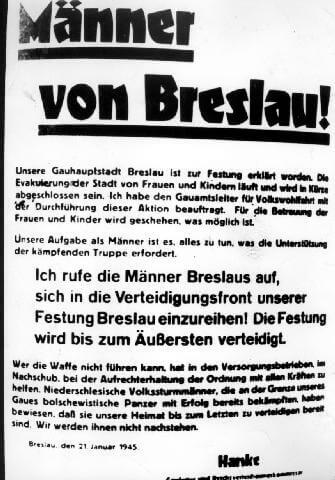

### Oberkommando

Hitler decyduje o zakończeniu walk zaczepnych na zachodzie i skierowaniu na wschód zwolnionych dzięki temu sił, przede wszystkim 6 Armii Pancernej SS.

### 2 Front Białoruski

W ramach operacji mławsko-elbląskiej zdobył dziś Iławę i Olsztyn.

### 1 Front Białoruski

Dla 1 Frontu Białoruskiego to dziewiąty dzień ofensywy. Dziś zdobyty zostaje Września na froncie poznańskim. Inne miejscowości dzisiaj zdobyte to Gołańcz, Kcynia, Margonin, Pobiedziska, Pasym i Odolanów.

### 1 Front Ukraiński

1 Front Ukraiński wciąż walczy w okolicach Krakowa. Dzisiaj zdobył Nowy Sącz, Pyskowice i Wąsocz.

2 Armia Pancerna zdobyła Milicz.

4 Armia Pancerna nacierała w kierunku Odry. O 11.30 jej dowódca generał Leluszenko nakazał dowódcy 93 Brygady Pancernej, która zdobyła wcześniej Milicz, wydzielić grupę bojową. Miała ona, współdziałając z elementami 22 Brygady Artylerii Pancernej, uderzyć na Rawicz. Napotykając niewielki opór o 14.30 wdarli się do Rawicza i rozbili miejscowy garnizon, zdobyli do 200 pojazdów kołowych. Wieczorem w Rawiczu skoncentrowały się główne siły 93 Brygady Pancernej. Przed północą do dotarły tam też pododdziały 17 Brygady Zmechanizowanej Gwardii. [Zdobycie Rawicza – 23 stycznia 1945 r.](https://www.facebook.com/bobr1945/posts/3378528802260759)

Wieczorem czołowe jednostki 3 Armii Pancernej Gwardii dotarły na północ od Opola. Bitwa o Opole zacznie się jutro.

### Oleśnica

73 Korpus (3 dywizje piechoty) nacierający w kierunku Oleśnicy napotkał silny opór na linii Bukowiec - Lipka - Gaszowice. Okazało się, że nieprzyjaciel wprowadził do walki 269 DP ściągniętą z frontu zachodniego. Była uzupełniona niewielką liczbą czołgów i dział pancernych. Było to ponad 10 tys. żołnierzy. Prosto z rampy zostali wysłani na obronę Oleśnicy.

Był to ważny węzeł kolejowy i ostatnia rubież przed Wrocławiem. Stacjonowało tu wiele jednostek wojskowych, a przede wszystkim było tam lotnisko wojskowe, remontowano na nim 200 samolotów. W pobliżu ukryte w lesie duże składy cennych materiałów pędnych. Każda chwila utrzymania Oleśnicy dawała więcej czasu na przygotowanie obrony Wrocławia i ewakuację materiałów wojskowych z Oleśnicy. Niemcy chcieli opóźnić zdobycie Oleśnicy o 3 do 4 dni.

### Marsz śmierci

Marsz śmierci z Auschwitz dotarł dziś do Wodzisławia Śląskiego.

Pociąg z więźniami Auschwitz zatrzymał się po dotarciu do stacji Rzędówka (8 km przed Rybnikiem), wszyscy zostali wypędzeni z wagonów i mieli dalej odbyć drogę pieszo. Tych którzy nie mogli dalej iść, SS-mani zastrzelili. Znajduje się tam pomnik upamiętniający ofiary. Napis na nim głosi:
>Dnia 22.1.1945 350 więźniów oświęcimskich różnych narodowości zakończyło tu swą męczeńską drogę pod kulami niemieckich oprawców. Pamięć o nich niech przyświeca wszystkim broniącym pokoju człowieczeństwa w świecie.

- ["Historia: Masowy mord na Rzędówce !"](https://iknurow.pl/historia-masowy-mord-na-rzedowce/)

### Berlin

Za: ["Berlin 1945: Tagebuch einer Großstadt"](https://www.imdb.com/title/tt12264166/) - [Berlin 1945 Tagebuch einer Großstadt teil 1 DOKU](https://www.youtube.com/watch?v=zUBXgDM0VjY)

>22 stycznia. Przyjechał pierwszy pociąg ze Śląska. Jeden wagon był pełen martwych dzieci. Stał na mrozie przez 96 godzin. Dzieci były w nim upchnięte jak sardynki. Szef kazał nam odgarniać śnieg i kopać groby. Ziemia była zamarznięta do głębokości pół metra. Kopaliśmy łopatami, kruszyliśmy ziemię młotami i kilofami. Wcześniej było ciężko, ale teraz jeszcze się pogorszyło. 

### Wędrujący kocioł

"Wędrujący kocioł" dotarł do Warty na południe od Sieradza, przez ostatni dzień ukryty przed sowieckim lotnictwem pod niespodziewaną osłoną gęstej mgły. Spotkanie z jednostką rozpoznawczą Korpusu "Großdeutschland" przetransportowanego koleją z Prus Wschodnich.

### Zielona Góra

Według założeń operacyjnych z dnia dzisiejszego 6 Armia Pancerna SS miała bronić środkowego odcinka Odry w ramach operacji Sonnerwende. Po dotarciu w rejon Zielonej Góry miała uderzyć na północ przez Międzyrzecz w kierunku Gorzowa Wielkopolskiego. Gdyby to było niemożliwe zadaniem była obrona Zielonej góry zamienionej w kolejną "twierdzę".

Ostatecznie do tego nie doszło. Armia została skierowana na front węgierski i tam została rozbita.

- [Plany na Festung Grünberg [Nieznana Zielona Góra]](https://www.wzielonej.pl/informacje/zielona-gora/plany-na-festung-grunberg-nieznana-zielona-gora/)

### Jan Skala

Dzisiaj w wiosce w pobliżu Namysłowa jedną z ofiar Armii Czerwonej został Jan Skala. Został zastrzelony, kiedy protestował przeciwko ograbianiu swojej rodziny przez czerwonoarmistów.

Z zawodu ceramik, znany najbardziej jako poeta i literat górnołużycki, aktywnie przeciwstawiający się germanizacji Serbołużyczan i antynazista. W 1920 założył Łużycką partię Ludową. W 1925 z jego inicjatywy powstała gazeta Kulturwehr, której misją była ochrona mniejszości narodowych w Niemczech. Nawiązał kontakty z powstałym w 1924 Związkiem Polaków w Niemczech. W 1932 powiedział:
>Dojście Hitlera do władzy oznacza, że za kilka lat będzie wojna. Przeciw Polsce, Związkowi Radzieckiemu, przeciw całemu światu.

Prześladowany przez hitlerowców, ale zabiła go Armia Czerwona. Jedna z tysięcy codziennych tragedii tamtych dni. W 1965 staraniem Towarzystwa Miłośników Ziemi Namysłowskiej i łużyckiej organizacji Domowina postawiono mu pomnik w Namysłowie.

### Warszawa

19 września 1944 PKWN mające wówczas siedzibę w Lublinie mianowało Mariana Spychalskiego Prezydentem Warszawy. Był to działacz traktowany podejrzliwie przez władze sowieckie, podejrzewano go o odchylenie narodowe, był zwolennikiem przyjmowania akowców do władz i integracji wszystkich sił politycznych. Sojusznik Gomułki.

Dzisiaj Spychalski już jako urzędujący Prezydent powołał Biuro Organizacji Odbudowy m.st. Warszawy pod kierownictwem Jana Zachwatowicza. 14 lutego zostanie przekształcone w Biuro Odbudowy Stolicy, mając już wówczas pełne polityczne poparcie swojego działania, także ze strony Stalina.

Do odbudowy jeszcze było daleko. Pierwszym zadaniem było rozminowanie stolicy i udrożnienie głównych dróg. Potem inwentaryzacja strat i ocalałych zabytków. Ratowanie tego, co się da. Zapewnienie minimalnej bazy sanitarnej koczownikom w ruinach, przygotowanie się do kolejnej zimy tym razem z wielokrotnie większą liczbą ludzi. Dopiero potem budowa nowego miasta na morzu ruin. Przed Zachwatowiczem i jego ekipą stało zadanie, jakiego nikt jeszcze na świecie się nie podjął.

Tragicznym kontekstem tego wydarzenia jest fakt, że kilka innych miast Europy w naszym regionie najbardziej zniszczonych wojną: Wrocław, Gdańsk, Poznań, Drezno i Berlin tego dnia były nietknięte. Berlin był bombardowany od dawna, ale zniszczenia nie były wielkie. Do końca wojny trzy miesiące.

### Wrocław

Jak relacjonuje to ksiądz Paul Peikert we wpisie datowanym na 22 stycznia:
>Począwszy od czwartku 19 [stycznia] ciągnie się teraz nieprzerwana rzeka uchodźców dniem i nocą i nie można jeszcze przewidzieć, kiedy ona wyschnie.[...] Ze Świebodzic doniesiono mi telefonicznie, że tam u podnóża gór piętrzy się rzeka uchodźców. W zimnych stodołach, w zamarłych, lodowato zimnych fabrykach lokuje się tłumy uchodźców. [...] Nastała nieopisana niedola i nieopisana nędza. Od niemal 10 dni, a nawet dłużej, dworce były zatłoczone ludźmi, co zastraszeni chcieli opuścić zagrożony obszar. Matki z małymi dziećmi, matki w ciąży, starzy, wynędzniali ludzie, z trudem poruszający się o lasce, wśród nich duża gromada dzieci i młodszych kobiet - oto był obraz ówczesnych dworców kolejowych. Przez wiele godzin, a nawet dzień albo i dwa na przejmującym zimnie musieli uchodźcy czekać na dworcach do czasu, aż ich wpuszczono do pociągu ewakuacyjnego. Jakaś kobieta z czworgiem małych dzieci (najstarsze w wieku 8 lat, najmłodsze 8 dni) leżała przez 36 godzin na Dworcu Świebodzkim. Wyczerpana poszła potem ze swoimi dziećmi do domu, ponieważ nie mogła odjechać pociągiem. Trafiało się też, że na dworcach matki rodziły przedwcześnie z przestrachu i podniecenia wywołanego ucieczką. W potwornym tłoku, obładowane licznymi bagażami, gubiły często swe dzieci, których nieraz więcej już nie odnajdywały. Wywoływano potem nazwiska tych dzieci, lecz matka się nie zgłaszała. Bywało też, że matki poszukiwały swych dzieci i polecały same ogłaszać nazwisko, a dziecko nie zgłaszało się więcej. Doniesiono mi, że na samym Dworcu Głównym zaduszono na śmierć lub stratowano 60-70 dzieci.

i w innym miejscu:
>Pewna obwodowa grupa partyjna na terenie tutejszej parafii zawiadomiła matki, że następnego dnia rano o godzinie 9 powinny stawić się w punkcie zbornym; dzieci załadowałoby się na ciężarówkę, matki natomiast z większymi dziećmi musiałyby długą drogę do Lubania (120 km) odbyć pieszo. Są to wymagania, którym nie sprosta najsilniejszy organizm, zwłaszcza że ludzie wskutek wojennego niedożywienia i udręk tych czasów są bardzo wycieńczeni. Nigdy chyba nie stanęły w świadomości ludzi tak przejmująco i wyraźnie słowa Zbawiciela: "A proście, by uciekanie wasze nie było w zimie...".

Wraz z cofaniem się frontu wschodniego władze niemieckie wyrzuciły na mróz, bez żadnego przygotowania ponad 6 milionów własnych obywateli, w Prusach Wschodnich, na Pomorzu, w Kraju Warty i na Śląsku. Była to tzw. Wielka Ucieczka (niem. die große Flucht).

17 stycznia, kiedy padła Warszawa, zaczęło się inne makabryczne wypędzenie. Rankiem 17 stycznia miał miejsce ostatni apel w KL Auschwitz, w którym wzięło udział 67 tysięcy więźniów, bezpośrednio po nim zaczęła się ewakuacja obozu. Często z braku środków transportu więźniów konwojowano pieszo, w samych pasiakach, bez posiłków i z noclegiem pod gołym niebem. Takie konwoje nazwano Marszami Śmierci. Czy na drogach spotykali się z uciekającymi Ślązakami? 22 stycznia, kiedy pozostali w mieście wrocławianie czytają odezwę Gauleitera, taki Marsz Śmierci wyruszył z AL Fünfteichen (obecnie Miłoszyce) do obozu macierzystego Groß-Rosen.

W poniedziałek 22 stycznia zakończyło się funkcjonowanie resztek cywilnego Wrocławia - jak opisuje to pastor Ernst Horning:
>lokalne władze opuściły miasto lub zakończyły swoje urzędowanie. Urzędnicy dostali urlopy i pozwolono im wyjechać z Wrocławia, o ile, rzecz jasna, nie podlegali Wehrmachtowi czy Volkssturmowi. Tego samego dnia Uniwersytet został przeniesiony do Drezna. Exodus ten dosięgnął również politechnikę, kliniki uniwersyteckie na Szczytnikach, seminaria oraz instytuty wyższych uczelni. Także profesorowie uniwersyteccy zdecydowali się, z niewielkimi wyjątkami, na wyjazd z miasta. Budynki sądów, nowa siedziba zarządu rejencji przy pl. Powstańców Warszawy oraz Urząd Pracy na Pomorskiej - nagle opustoszały.

### Mobilizacja

Tego samego dnia Schlesische Tageszeitung publikuje odezwę Gauleitera Karla Hanke, tym razem jest to rozkaz pozostania w mieście szykującym się do obrony:
>Mężczyźni Wrocławia! 
>Nasza stolica regionu Wrocław została ogłoszona twierdzą. Ewakuacja z miasta dzieci i kobiet trwa i wkrótce zostanie zakończona. Zleciłem przeprowadzenie tej akcji szefowi okręgu partii ds. dobra publicznego. Dla opieki kobiet i dzieci zostanie powzięte wszystko co będzie możliwe. 
>Wzywam mężczyzn Wrocławia do wstąpienia w szeregi frontu obrony naszej twierdzy Wrocławia. Twierdza będzie broniona do końca. 
>Kto nie jest zdolny do noszenia broni, ma pomagać z całych sił w zakładach użyteczności publicznej, w zaopatrzeniu i utrzymaniu porządku. Dolnośląscy volkssturmiści, którzy na granicach naszego okręgu z sukcesem zwalczyli bolszewickie czołgi, dowiedli że są gotowi bronić naszej ojczyzny do końca. Nie będziemy im w tym ustępować. 
>Wrocław, 21 stycznia 1945 r. 
>Hanke 
>Gauleiter i Komisarz Obrony Rzeszy.

*Obwieszczenie Gauleitera Karla Hanke z 21 stycznia opublikowane dzień później.*

I w ten sposób natychmiast po Wielkiej Ucieczce nastąpiła mobilizacja, pod broń powołano wszystkich mężczyzn od szesnastego do sześćdziesiątego roku życia.
