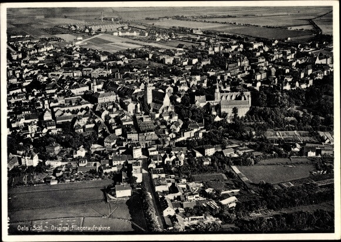

### BI-1

Po obiecujących wynikach eksperymentów z napędem rakietowym udało się 12 czerwca 1940 uzyskać zgodę Stalina na prace nad sowieckim samolotem rakietowym. Od pierwszych liter nazwisk konstruktorów (Aleksandra Bieriezniaka i Aleksieja Isajewa) nosił nazwę BI-1 (ros. БИ-1). Samolot był wyholowywany przez Pe-2. Pierwszy lot z uruchomionym silnikiem rakietowym odbył się dopiero 15 maja 1942. Ostatni, mający zakończyć program eksperymentalny lot 27 marca 1943 zakończył się katastrofą z powodu - jak to się później okazało - odmiennych warunków aerodynamicznych prędkości poddźwiękowej. Samolot przekroczył prędkość 800 km/h.

Nastąpiła dłuższa przerwa. Do lotów powrócono w 1945.

24 stycznia odbył się pierwszy i przedostatni lot po długiej przerwie. Prototyp nr 7 miał silnik rakietowy uruchomiony przez 72,3 s i na wysokości 1250 m osiągnął prędkość 587 km/h. Siła ciągu silnika 1100.

Kolejna i ostatnia już próba tego samolotu została przeprowadzona 9 marca 1945, tym razem silnik był uruchomiony przez 73 sekundy i samolot na wysokości 3500 m osiągnął prędkość 550 km/h.

Dalsze prace nad sowieckim samolotem rakietowym uznano za nieperspektywiczne i projekt został zamknięty.

- [БИ-1](https://ru.wikipedia.org/wiki/%D0%91%D0%98-1)

### 2 Front Białoruski

Kolno, Ełk, Wąbrzeźno.

### Wilczy Szaniec

Kwatera Hitlera wylatuje w powietrze! Dokonali tego saperzy z Grupy Korpuśnej gen. Eduarda Hausera w nocy 24/25 stycznia.

Na wysadzenie jednego schronu typu ciężkiego zużywano kilka ton trotylu lub melinitu. Według świadków fala uderzeniowa wybuchów spowodowała pękanie szyb w oknach domów odległego o 7 kilometrów Kętrzyna.

### 1. Front Białoruski

Pleszew i Bydgoszcz.

### Poznań

1 Front Białoruski zaczyna dziś bitwę o Poznań, który jest ostatnim ważnym węzłem komunikacyjnym przed decydującą walką o Berlin. To brama do Berlina i bezwzględnie potrzebny węzeł kolejowy. Operacji berlińskiej nie dałoby się przeprowadzić bez zajęcia Poznania. Bitwa potrwa miesiąc i zakończy się zniszczeniem połowy miasta.

Co interesujące, komendant miasta wcale się nie pali do obrony, wiele wskazuje, że chętnie by się z garnizonem z Poznania ewakuował. Można tu wskazać analogię z Krakowem. W obu tych przypadkach gauleiterzy uciekli przed pojawieniem się Armii Czerwonej. Czy gdyby Hanke uciekł od razu, Wrocław broniłby się krócej? To jest bardzo prawdopodobne.

Dzisiaj na ulicach Poznania pojawiło się obwieszczenie nakazujące Polakom opuścić miasto, władze Twierdzy zapewniały w nim, że zapewniony jest transport kolejowy, zupełnie za darmo i opieka aż do celu podróży. Chętnych nie było.

Dowództwo Frontu uznało, że skoro nie udało się wziąć miasta z marszu, należy pozostawić je w okrążeniu i realizować główny cel operacji - osiągnięcie linii Odry - bez narażania idących na czele wojsk pancernych na straty w mieście. Już jutro Poznań zostanie zablokowany ze wszystkich stron.

### 1 Front Ukraiński

1 Front Ukraiński przekracza Odrę po obu stronach Brzegu. Również tego dnia po całonocnych walkach zdobywa prawobrzeżne Opole i wyspę Bolko w większości już ewakuowane.

Zdobyto również Gliwice, jedno z pierwszych dużych miast na Górnym Śląsku, które wpadły w ręce czerwonoarmistów.

Rozpętała się trwająca całe tygodnie orgia zniszczenia, gwałtów, podpaleń i morderstw. Do marca zostało zamordowanych od półtora do trzech tysięcy mieszkańców Gliwic. Koszmar z Nemmersdorf wkracza na Śląsk. Dodatkowo zdobycie tego dnia Chrzanowa oznacza, że zaciska się pętla na Górnym Śląsku.

### Dolny Śląsk

17 Brygada Zmechanizowana wciąż walczy o Chobień. Pomimo zaciekłych kontrataków nie tylko utrzymuje pozycje, ale powiększa przyczółek. Dzięki wsparciu artyleryjskiemu z prawego brzegu uruchomili prom i przeprawili 126 pułk czołgów. Do wieczora następnego dnia Niemcy zostali wyparci z Chobieni.

### Oleśnica

Nieuchronnie zbliża się do Wrocławia. Trwa bój o Oleśnicę, von Ahlfen pisze:
>W pierwszych godzinach 24 stycznia następuje odwrót na Oleśnicę. Bitewna wrzawa z przodu już wkrótce sygnalizuje pierwsze spotkanie z wrogiem. Do Cieśli marsz szosą przebiega płynnie. Ze względu na działania wroga trzeba potem skręcić na południe przez lotnisko w Oleśnicy. Pod ogniem z broni maszynowej i granatników pędzimy między ustawionymi ciasno jeden obok drugiego samolotami (bez paliwa) i wbiegamy do miasta, koło mojej starej budy, Logau-Shule, przez Rynek do Bramy Wrocławskiej. W opustoszałym centrum jest upiornie cicho, tylko tu i ówdzie tlą się pojedyncze pożary, czarna noc spowija wszystko niczym kir. Przechodząc przez nieprzyjacielską zaporę na południowych granicach miasta, pod osłoną ciemności, za Oleśnica na drodze do Wrocławia ponownie zebrałem mój oddział, Zgodnie z rozkazem zajęliśmy potem w Smardzowie pozycję zabezpieczająca tyły; tutaj miał zostać zatrzymany wróg

Von Ahlfen miał wielkie szczęście, że się przedarł, udało mu się w ostatniej chwili, bo dziś 73 Korpus po ciężkich walkach do 23.00 zdobył resztę Oleśnicy, w tym zamek. Są 20 km od stolicy Dolnego Śląska.

*Oleśnica, zdjęcie lotnicze z 1934. 
Źródło: pocztówka [Postcard Oleśnica Oels Schlesien, Fliegeraufnahme, Totalansicht von der Stadt](https://www.akpool.co.uk/postcards/27528277-postcard-olenica-oels-schlesien-fliegeraufnahme-totalansicht-von-der-stadt)*

### Przyczółki

13 DP Gwardii zdobyła przyczółek w regionie Lipek (5 km biegiem Odry od Brzegu) i utrzymała go, wyszedł stąd atak na Oławę. Do końca stycznia przyczółek sięgał 15 km wgłąb, miał szerokość 25 km. Sięgał północnego przedpola Brzegu zamienionego w silny punkt oporu.

Kolejny przyczółki zdobyto u ujścia Nysy Kłodzkiej na wschód od Skorogoszcza oraz między wioskami Narok i Żelazna, trzeci w rejonie Sławic. Do końca stycznia zostały połączone. Sięgał 15 km wgłąb i miał 22 km szerokości, rozciągał się od Rybnej do Zakrzowa.

### Wrocław

Komendant rozkazuje wysadzić most kolejowy w Czernicy, a odcinek lewego brzegu Odry Kotowice - Zakrzów obsadzić jednostkami alarmowymi.

Jeszcze kilka dni temu Wrocław wówczas na głębokim zapleczu, wciąż razem z Dreznem miał opinię "bezpiecznego schronu Rzeszy" - miasta, do którego nie dotrą alianckie bombowce, ani sowieckie hordy. Ilu wrocławian wierzyło w tę propagandę, nie wiadomo; z pewnością wielu chciało wierzyć. Stale rosła liczba szukających bezpieczniejszego miejsca bardziej na zachodzie, w Saksonii lub Brandenburgii.

17 stycznia, kiedy pojawiły się wojskowe posterunki, nadleciały sowieckie bombowce i wieczorem przyszła wiadomość o upadku Warszawy czas zaczął biec w szaleńczym tempie. Wkrótce pojawiły się wozy uciekinierów z Kraju Warty obserwowane ze współczuciem, a później z rosnącą grozą. Chłopów tych usunięto siłą z ich ziemi, bydło wybito, niszczono zapasy, by nie wpadły w ręce wroga.

Następnego dnia kolejne bombardowanie, 19 stycznia wieść o ewakuacji powiatów na wschód od Odry.

Co z Wrocławiem? Okazało się to następnego dnia. Przez trzy kolejne dni, sobotę, niedzielę i poniedziałek z powodu zarządzonej przez władze ewakuacji przez Wrocław przeszło, lub z niego wyszło milion ludzi. W poniedziałek dołączyło do tego zamknięcie urzędów i przeniesienie instytutów naukowych (w tym Uniwersytetu i Politechniki) do Drezna. Urzędnicy dostali urlopy, wszystkie instytucje miejskie - poza niezbędnymi - przestały działać.

Co dla Wrocławia oznaczało - milion ludzi? Otóż przed wojną liczył sobie około 600 tys. mieszkańców. Z tą liczbą bardzo podobną do dzisiejszej i powierzchnią zajmującą 60% obecnego stanu, i tak był najbardziej zagęszczonym z dużych miast Rzeszy. W czasie wojny pomiędzy wiosną 1941 a latem 1943 wywieziono z Wrocławia wszystkich mieszkających tu jeszcze Żydów: ok. 10 tysięcy mężczyzn, kobiet i dzieci. Z tej liczby 30 osób przeżyło do końca wojny. W czasie wojny wyjechała z miasta na front ogromna, trudna do oszacowania liczba mężczyzn. W ich miejsce pojawili się przymusowi robotnicy, jeńcy wojenni, więźniowie obozów pracy. W końcu, gdy został otwarty front na zachodzie do Wrocławia, przerzucano produkcję, sprzęt wraz z załogami. Pojawili się też pierwsi uciekinierzy, ludzie szukający bezpiecznego miejsca poza zasięgiem alianckich bombowców. W wyniku tego pod koniec 1944 w mieście z różnych powodów przebywało na stałe około miliona ludzi. To dlatego pełniący od 25 września 1944 obowiązki komendanta wojskowego miasta generał major (polski odpowiednik to generał dywizji) Johannes Krause proponował ewakuację przynajmniej 200 tysięcy najsłabszych mieszkańców, kobiet z małymi dziećmi i ludzi starych. Gauleiter Karl Hanke propozycję tę odrzucił, mówiąc że Hitler każe go rozstrzelać za taki defetyzm.

Wydany 20 stycznia rozkaz ewakuacji dotyczył wszystkich kobiet i dzieci, ale z rozmaitych powodów nie wszyscy go wykonali. Pozostało około 200 tysięcy dotychczasowych mieszkańców i może około 50 tysięcy uciekinierów ze wschodu, którzy już nie chcieli dalej uciekać. Zamarłe i opustoszałe miasto było już tylko skorupą owiewaną chłodem, śnieżnym pustkowiem, w którym wciąż jacyś ludzie wiedli pozorne życie i nasłuchiwali zagłady nadciągającej ze wschodu. W tej tragicznej sytuacji wrocławianie, pocieszając się, żartowali że przynajmniej jedzenia im nie zabraknie. Piwnice były pełne zapasów troskliwie zebranych w oczekiwaniu srogiej wojennej zimy. O dziwo, nie słyszało się o aktach bandytyzmu, grabieży pozostawionych dóbr, często o ogromnej wartości.

Podlinkowany poniżej artykuł stwierdza, że ostatni raz użyto wrocławskiej gilotyny 24 stycznia 1945. Nawet jeśli to prawda to nie oznacza, że skazańcy mogli poczuć ulgę. W Twierdzy ludzi oskarżonych o defetyzm czy grabież rozstrzeliwano i wieszano.

>Choć dawni kaci mówili, że topór, który ściął 100 głów, napił się wystarczająco krwi i nie powinien być dalej używany, to w rządzonym przez Niemców Wrocławiu właśnie, w latach 1939-45 stracono na gilotynie 829 osób. Byli to głównie Polacy i Czesi, ale wśród ofiar znaleźli się również przedstawiciele innych narodowości: Francuzi czy Holendrzy. 
>Na wrocławskich "Kleczkach" nie sama śmierć była tu najstraszniejsza. Najstraszniejsze było czekanie. Więzień już na trzy dni przed egzekucją był informowany o jej dokładnej godzinie. Rodzina o śmierci bliskiego dowiadywała się natomiast dopiero po tygodniu. Wtedy, gdy przychodził rachunek za egzekucję i koszty pobytu w więzieniu. 
>Ostatnie ścięcie zanotowano 24 stycznia 1945 r. Dziś ostrze gilotyny wyjątkowo rzadko jest pokazywane w muzeum. To jeden z jego najbardziej ponurych eksponatów.

- ["Ogniem i toporem. Ostatnie publiczne egzekucje na terenie Polski"](https://podroze.onet.pl/ciekawe/ostatnie-publiczne-egzekucje-na-terenie-polski-ostatnia-spalona-czarownica/ny74mj6)

### Marsz śmierci

Dwa dni po opuszczeniu obozu pracy AL Fünfteichen (pl. Miłoszyce) marsz śmierci mija Wrocław, zatrzymał się na nocleg w Tyńcu Małym (niem. Klein Tinz). Rano esesmani rozstrzelali kilkadziesiąt osób, które nie były w stanie iść dalej. Ofiary upamiętnia pomnik stojący we wsi. Ogółem z sześciu tysięcy więźniów dwa tysiące zginęło lub zostało zamordowane.

Czy spotkali uciekających Niemców? Możliwe, że mijali wracających. Jak wyglądały takie spotkania?

### V2

Po ataku na Pearl Harbor Hitler z entuzjazmem włączył się do wojny przeciwko Ameryce. Nie miało to wtedy wielkiego znaczenia praktycznego, chodziło o efekt propagandowy i pretekst do rozpoczęcia totalnej wojny podwodnej na Atlantyku. Ponadto, pomimo fiaska Operacji Barbarossa, wciąż był pewien zwycięstwa na wschodzie w 1942. Wiedział, że z powodów praktycznych jakakolwiek ingerencja USA w Europie nie nastąpi wcześniej niż za dwa lata. Do tego czasu front wschodni miał być sprawą zamkniętą. Powtórzenie koszmaru Niemiec z Wielkiej Wojny - wojny na dwa fronty i Ameryki, która wysyła do Europy korpus ekspedycyjny lądujący we Francji, było w jego ocenie niemożliwe.

Iwan jednak stawił opór nie tylko w 1941, ale i w 1942. Wypowiedzenie wojny USA scementowało przymierze Wielkiej Trójki i zapewniło sowietom pomoc Land-Lease. W 1944 koszmar się spełnił, Amerykanie wylądowali we Francji, a sowieci doszli do Wisły. W tej sytuacji pozostała zemsta. Zresztą zemsta, rozumiana jako spektakularny cios w stolicę wroga, cały czas była w planie. Ale teraz już tylko ona pozostała.

Były przynajmniej trzy metody, jakimi hitlerowcy planowali zaatakować USA:

- **bombowiec dalekiego zasięgu**, tzw Amerika Bomber rozwijany od 1942 (o którym jeszcze napiszę przy innej okazji - 9 lutego), ale wszystkie plany dużych bombowców zostały ostatecznie zarzucone w lipcu 1944 na rzecz awaryjnego projektu myśliwca (niem. Jägernotprogramm).
- **podwodny silos V2** (Prüfstand XII) wleczony za U Bootem, o tym też przy innej okazji.
- najbardziej spektakularny ze wszystkich - **bezpośredni atak rakietowy**, którąś z kolejnych wersji rozwojowych V2. Najbardziej realistyczną opcją był dwustopniowy załogowy pojazd kosmiczny, z odzyskiwanym pierwszym stopniem. Oczywiście realny hipotetycznie, gdyby był na to czas i zasoby. Projekt pod nazwą A-9/A-10 (Aggregate-9/Aggregate-10).

Do tego zmierzały eksperymenty z udoskonalonymi wersjami V2. Najważniejsza była A4b, która zasadniczo byłą zmodernizowaną V2 z dodanymi skrzydłami. Wystrzelono ją 2 razy.

Pierwszy test 27 grudnia 1944 był zupełnym fiaskiem. Dzisiaj ta eksperymentalna rakieta wystartowała zgodnie z planem. Wprawdzie urwało się jedno skrzydło, ale rakieta osiągnęła zamierzone parametry lotu, przekraczając prędkość 4 Mach. Ze względu na brak zasobów wkrótce potem przerwano projekt, ograniczając się do rutynowego ulepszania V2.

Skąd je wystrzeliwano?

- Najważniejszym ośrodkiem badawczym był oczywiście Peenemünde i stamtąd wystartowała pierwsza w historii ludzkości rakieta kosmiczna (MW 18014 20 czerwca 1944). Od 18 lipca do czerwca 1943 trwały niszczące naloty. Ośrodek był wciąż używany, ale prace przeniesiono w inne miejsca, projekt został zdecentralizowany.
- Próby balistyczne przeniesiono na poligon w Bliznej, jest to kilkanaście km na północ od A4 na odcinku Rzeszów - Tarnów. Wystrzelono tam 160 rakiet. 20 maja 1944 jedna z nich została przechwycona przez AK i dostarczona Brytyjczykom. Z powodu zbliżania się frontu ewakuowano poligon jeszcze w lipcu 1944, Rzeszów został zdobyty przez Armię Czerwoną 22 sierpnia.
- Ośrodek rakietowy został przeniesiony na poligon Heidekraut (niem. wrzos) w Wierzchucinie (Bory Tucholskie), ale i ten został ewakuowany zaraz po ostatnim starcie 11 stycznia 1945. Wystrzelono tam ponad 300 rakiet już z wyrzutni mobilnych (niem. Meillerwagen). Poligon był intensywnie używany do szkolenia załóg tych wyrzutni.
- Potem testowe starty miały miejsce już tylko w ośrodkach w Greifswalder Oie i Peenemünde. Ostatni odbył się 20 lutego. Ostatnią rakietę bojową wystrzelono 27 marca.

<SeeAlso txt="Vergeltungswaffe od V1 do V4 / broń zemsty" url="/festung-breslau/article/vergeltungswaffe" />

Gwoli wyjaśnienia, dodam, że V2 to nazwa propagandowa (niem. Vergeltungswaffe; "broń zemsty"), natomiast właściwą nazwą projektu jest Aggregat 4. Jak więc widać A4b nie jest jakimś wielkim skokiem numeracji i przełomem technicznym, jest to po prostu demonstrator technologii rakiet następnej generacji.

### Odnośniki

- [Historia Oleśnicy - dr Marek Nienałtowski](https://www.olesnica.org)
- [Krótka historia walk o Oleśnicę](http://www.olesnica.nienaltowski.net/WalkiwOlesnicy.htm)
- [Masakra w Wichrowie. To wydarzyło się naprawdę](http://nieustanne-wedrowanie.pl/masakra-w-wichrowie/)
- [Poligon Heidekraut](http://www.cisowyfyrtel.pl/art/23/poligon-heidekraut.html)
- metropoliabydgoska.pl: Sebastian Torzewski ["Bitwa o Bydgoszcz. Jak przebiegało wyzwolenie miasta w 1945 roku?"](https://metropoliabydgoska.pl/bitwa-o-bydgoszczy-jak-przebiegalo-wyzwolenie-miasta-w-1945-roku/)