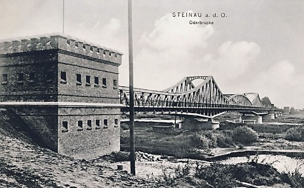

### Filipiny

20 października generał Douglas MacArthur z wielką pompą powrócił na Filipiny i mógł przez radio wszystkim ogłosić:
>People of the Philippines, I have returned!

Dziś przeniósł swój sztab do Hacienda Luisita (100 km na północ od Manili).

### Nordwind

Faktyczny koniec rozpoczętej 31 grudnia 1944 operacji Nordwind. Przez uderzenie na odcinek frontu zajęty przez 7 Armię amerykańską miała umożliwić wyrwanie się z okrążenia resztek sił zaangażowanych w operację w Ardenach (niem. Wacht am Rhein). Postawiony na czele Grupy Armii Górny Ren (niem. Heeresgruppe Oberrhein) Heinrich Himmler obiecał zająć Strasburg do 30 stycznia.

Niemcy osiągnęli ograniczony sukces, ale 25 stycznia 1945 uznali, że nie mają już sił by atakować dalej. Było to ostateczne fiasko niemieckiej inicjatywy na froncie zachodnim.

- Mark Felton Productions ["Operation Nordwind 1945 - The 'Other' Battle of the Bulge" [23:18]](https://www.youtube.com/watch?v=HQwjXm9xpqE)
- The National WWII Museum ["DIE DEUTSCHE WOCHENSCHAU, NO. 2, 1945" [YT 5:21]](https://www.youtube.com/watch?v=s1rsiK1LIKk)

### 1 i 2 Front Nadbałtycki

Niemiecka Grupa Armii Północ podczas Operacji Barbarossa dotarła do Leningradu i przez dwa lata go oblegała. Podczas Operacji Bagration w 1944 została zepchnięta w stronę Bałtyku. 9 października 1944 Armia Czerwona dotarła do Bałtyku w rejonie Kłajpedy i w ten sposób powstał kocioł kurlandzki, została w nim zamkniętych 33 dywizje Grupy Armii Północ, w sumie ok. 200 tys. żołnierzy. 15 stycznia 1945 ta odcięta reszta Grupy Armii Północ została przemianowana na Grupę Armii Kurlandia (niem. Heeresgruppe Kurland).

Niemcy mieli wciąż nadzieję, że odbiją te tereny i dotrą do Litwy więc uważali, że ta armia jeszcze im się przyda. Dlatego Wehrmacht określał ten rejon jako przyczółek kurlandzki. Armia Czerwona zdawała sobie sprawę ze znaczenia jakie stanowią niepobite dywizje i starała się je zniszczyć. W tym celu podjęła szereg, w sumie pięć (lub sześć), ofensyw (lub bitew) kurlandzkich trwających od 13 października do 8 maja 1945.

Wg Wikipedii:

- 13 (lub 15) - 22 X
- 27 X - 25 XI
- 21 (lub 23) - 31 XII "bitwa bożonarodzeniowa"
- 23 - 30 I (lub 3 II)
- 20 - 28 (lub 12 - 19) II
- 17 - 29 III (lub 4 IV)

Wg Bernharda Kasta:

- 27 X - 7 XI
- 19 - 25 XI
- 21- 31 XII
- 25 I - 3 II
- 20 - 27 II i 3 - 13 III

Początek czwartej bitwy (ofensywy) kurlandzkiej.

- Military History Visualized ["Courland: Last Stand Defensive Tactics" [YT 12:59]](https://www.youtube.com/watch?v=HXFJH_amdyA)

### 2 Front Białoruski

Awangarda Frontu dotarła do Bałtyku w rejonie Elbląga. Oznacza, to że wszystkie siły niemieckie i cała ludność cywilna w Prusach Wschodnich jest odcięta.

Jedyną drogą ewakuacji pozostaje Mierzeja Wiślana oraz w tym momencie zastrzeżona tylko dla wojska droga morska (Operacja Hannibal rozpoczęta 23 stycznia).

### Reorganizacja frontu niemieckiego

Dziś na rozkaz Hitlera dokonano przetasowania nazw.

- Grupa Armii Północ (do niedawna Środek) została przemianowana na **Grupę Armii Kurlandia**.
- Natomiast Grupa Armii A pod dowództwem generała Ferdinanda Schörnera na **Grupę Armii Środek**.
- Pośrodku, czyli na obszarze północnej Polski powstaje **Grupa Armii Wisła** pod dowództwem... Heinricha Himmlera.

### Himmler na czele Grupy Armii Wisła

Formowanie ad hoc rozmaitych związków wojskowych jest typowe dla armii niemieckiej, szczególnie w tym okresie, ale mianowanie cywila szefem Grupy Armii to jest osobliwość. Jak można się tego spodziewać, była to osobista decyzja Hitlera, który mu po prostu ufał, szczególnie po 20 lipca 1944, kiedy zawiodła go armia. Zdążył się rozczarować do prawdziwych oficerów, po 20 lipca obwiniając ich już nie tylko o tchórzostwo i nieudolność, ale i o zdradę. Dlatego dowództwo jednej z kluczowych formacji bojowych powierzył człowiekowi, który nie miał żadnych umiejętności ani nawet profesjonalnego przygotowania do dowodzenia wojskiem. Wystarczyło, że mu ufał. Pokazuje to, jak bardzo Hitler był przekonany, że osobiste walory, nawet przy braku wyszkolenia wystarczą, by osiągnąć sukces. Wola dokona tego. Nie dokonała.

Himmler nie miał żadnego doświadczenia wojskowego. Zawsze chciał być żołnierzem, ale nigdy nim nie był. Jego nigdy niespełnionym marzeniem życia było, zostanie profesjonalnym oficerem i udział w "prawdziwej akcji". Dostał dowództwo Operacji Nordwind, która zakończyła się klęską. A teraz dowodził całą Grupą Armii.

Wyglądało to tak, że Himmler usadowił się w Pile. Cały jego sztab mieścił się w jego pociągu specjalnym Steiermark, miał tam doprowadzoną tylko jedną linię telefoniczną, żadnej łączności radiowej, kompletnie nieadekwatne mapy. Dowodził luksusowo i wygodnie. Przed rozpoczęciem pracy korzystał z masażu, po obiedzie sprawiał sobie długą drzemkę. Czas pracy nie przekraczał 4 godzin dziennie.

Sytuacja ta wprawiła jego podwładnych w przerażenie. Musieli sobie radzić sami, improwizując i podejmować działania poza rozkazem, bo tych rozkazów, czy w ogóle planów obrony nie było. Od razu wzbudziło to zrozumiałe protesty armii, ale w tym krytycznym czasie pozostał na tym stanowisku wbrew ponawianym żądaniom (m.in. przez Guderiana) aż do 20 marca, wtedy na czele GA Weichsel stanął generał Heinrici.

Tak, na decydujący okres 54 dni, prawie dwóch miesięcy, na drodze do Berlina, na czele północnego odcinka obrony Hitler postawił kompletnego ignoranta.

- [How to Lose the War in 100 Days, Give The Eastern Front to Himmler](https://www.warhistoryonline.com/war-articles/lose-war-100-days-himmler.html)

### Warszawa

Jak to podaje dr Andrzej Skalimowski z Centrum Interpretacji Zabytku Muzeum Warszawy, decyzję o odbudowie stolicy narzucił Stalin podczas rozmowy z Bierutem 25 stycznia 1945. Dzisiaj więc los Warszawy został przesądzony na najwyższym szczeblu. Od tej decyzji nie było odwołania.

### Reba Z. Whittle

W służbie od 1941. Do początku 1943 w różnych szpitalach wojskowych na terenie USA. W sierpniu 1943 przyjęto ją do Army Air Forces School of Air Evacuation i październiku ukończyła 6-tygodniowe szkolenie. Została "latającą pielęgniarką". Przydzielono ją do 813th Medical Air Evacuation Transport Squadron. Od stycznia do września 1944 wzięła udział w 40 misjach ratowniczych, zaliczając ponad 500 godzin lotu.

27 września Douglas C-47 Skytrain z Whittle  na pokładzie wyleciał zebrać rannych z Advanced Landing Ground A-92 w St. Trond (Belgia). Niestety znalazł się daleko od celu i ponieważ nie miał oznaczeń Czerwonego Krzyża (zwykle przewoził wojskowy ładunek) został zestrzelony. Awaryjnie lądował w pobliżu Akwizgranu. Po opatrzeniu ran została zabrana do Auswertestelle West, głównego ośrodka przesłuchań w Oberursel (k. Frankfurtu).

6 października została osadzona w Stalagu IX-C (Bad Sulza, k. Erfurtu, Turyngia), gdzie pracowała jako pielęgniarka. Tam dowiedział się o niej Międzynarodowy Czerwony Krzyż i w wyniku interwencji Departamentu Stanu została zwolniona z obozu 25 stycznia 1945. Do kraju wróciła przez Szwajcarię.

Jedyna amerykańska żołnierka wzięta do niewoli niemieckiej. Ogółem 15 amerykańskich "latających pielęgniarek" zginęło podczas tej wojny.

- Mark Felton Productions ["The Forgotten American POW - The Only US Servicewoman Captured by the Germans" [YT 14:51]](https://www.youtube.com/watch?v=XcmLdBgGmDs)

### Kwidzyn

Znany z zamku krzyżackiego Kwidzyn zostaje zdobyty przez Armię Czerwoną 30 stycznia. W środowisku poszukiwaczy okres ten znany jest z opowieści o 5 Tygrysach, które pozostawione przez załogi nad Wisłą zniknęły bez śladu.

Słynny 507 Batalion Czołgów Ciężkich (Panzer Abteilung 507) miał w przededniu ofensywy sowieckiej 51 czołgów Tiger I. 22 stycznia było już ich tylko 29, reszta została zniszczona lub uległa awarii. Zostają skierowane do Grudziądza i jak się okazuje tylko 6 nadaje się do walki. Po służbie patrolowej w rejonie Gardeji już tylko 5 jedzie wzmocnić garnizon w Kwidzynie.

Co się wydarzyło później, nie jest do końca jasne, wg relacji czołgisty batalionu Josefa Hülsmanna najpierw, właśnie 25 stycznia, biorą udział w kontrnatarciu, potem są ewakuowane i kiedy docierają od nieprzekraczalnej bariery rowu przeciwczołgowego, zostają regulaminowo porzucone przez załogi. Tymczasem meldunki sowieckie donoszą o boju z silnym zgrupowaniem niemieckim ok. 1500 żołnierzy i pojazdami pancernymi. I tutaj uwaga: te Tygrysy to były jedyne pojazdy pancerne garnizonu Kwidzyna, co więcej na linii miejscowości Licze i Rakowiec siłami 22 Armii Uderzeniowej powstrzymują natarcie niemieckie idące w kierunku północnym.

Polecam podlinkowany tu film znakomitego archeologa i poszukiwacza, w którym wyjaśnia te zagadkowe okoliczności i niespójności w relacjach podejrzeniem, że mamy do czynienia ze zorganizowaną dezercją całego garnizonu Kwidzyna, który korzystając ze wzmocnienia sił, opuścił pozycję i usiłował przebić się na północ nad zbawczy Bałtyk.

- Olaf Popkiewicz ["Tajemnica Tygrysów z Kwidzyna" [YT 32:47]](https://www.youtube.com/watch?v=dTppv72GrcE)

### KL Stutthof

Armia Czerwona parła na północ, zagrożone było Pomorze. Do obozu koncentracyjnego Stutthof o 5 rano dotarł rozkaz ewakuacji (Einsatzbefehl nr 3), wykonano go natychmiast. Plan ewakuacji opracowany został jeszcze jesienią, więc załoga była przygotowana. Uformowano kolumny marszowe i zorganizowano eskortę SS-manów z karabinami i pistoletami maszynowymi. Osobno maszerowały kolumny kobiece z przydzielonymi nadzorczyniami z SS. Do każdej kolumny dołączono lekarza-więźnia z 2 sanitariuszami.

Na marsz śmierci wyruszyło 11 tys. ludzi, dziennie pokonywali odległość 20 km, mróz sięgał 20 stopni. Maszerowali na Mikoszewo, Tam przeprawiali się przez Wisłę i dalej ich droga prowadziła na Pruszcz Gdański i kończyła się w Pomieczynie. 11 dni później do celu dotarło 7 tys. Każda z kolumn przebyła ok. 150 km. Połowa z brakującego stanu to były udane ucieczki. Na tym terenie mogli liczyć na pomoc. Około 2 tys. to ofiary brutalności, wycieńczenia i mrozu.

To właśnie ciała ofiar obozu koncentracyjnego Stutthof były używane przez nazistowskiego dyrektora Instytutu Anatomii w Gdańsku, Rudolfa Spannera, do wytwarzania mydła.

- KULTURA POWIATÓW ["Stutthof idzie!" [YT 58:37]](https://www.youtube.com/watch?v=OnSu01FWyRQ)
- Łukasz Bindek ["KONZENTRATIONSLAGER STUTTHOF" [YT 43:24]](https://www.youtube.com/watch?v=FaUCqCJlAts)

### Brygada Świętokrzyska

W tym czasie przez Śląsk zmierza inna grupa ewakuowanych ludzi. Również pod eskortą SS.

Brygada Świętokrzyska NSZ jest w okolicach Ziębic. Z Goworowic zmierzają do Bobolic. Dotrą tam 28 lutego.

### Egzekucja włoskich generałów

I jeszcze raz SS, tym razem traktujące obcych żołnierzy wrogo.

W Kuźnicy Żelichowskiej (k. Krzyża Wielkopolskiego) Waffen-SS dokonał egzekucji 5 włoskich generałów. Włoscy sojusznicy zostali wzięci do niewoli we wrześniu 1943, kiedy zawarli rozejm z aliantami. Nie przyznano im statusu jeńców wojennych.

### Poznań

Po tak imponujących zwycięstwach i przebyciu w ciągu niecałych dwóch tygodni kilkuset kilometrów przed 1 Frontem Białoruskim stoi największe i najtrudniejsze wyzwanie: zdobycie Poznania. Stopniowo zaczyna go okrążać od północy, dziś zdobyto Oborniki i Pniewy. Na północnym odcinku walki Sztum.

### Rajd na Kostrzyn nad Odrą

W tej sytuacja na najwyższych szczeblach Stawki powstaje kalkulacja, że tężejący opór wokół pozycji poznańskiej ma charakter tylko lokalny, że głębiej na zapleczu wciąż panuje chaos i jest to ostatni moment, żeby z tego skorzystać. Armie są wyczerpane, ale druga taka szansa się nie powtórzy.

Na rozkaz Stalina Żukow ma zdobyć szybkim, szaleńczym wręcz marszem przyczółek na zachodnim brzegu Odry. Teraz kiedy Niemcy się tego jeszcze nie spodziewają. Istnieje ponadto szansa, że taka operacja spowoduje panikę i dezorganizacje sił w regionie Poznania. Kto wie, może Kostrzyn jeszcze nie jest zamieniony w twierdzę. Jest to 150 km rajdu za linię nieprzyjaciela. Żukow powierzył tę misję swoim najlepszym jednostkom 1 i 2 Gwardyjskiej Armii Pancernej.

Żeby to było możliwe, w region Poznania natychmiast muszą zostać dociągnięte armie ogólnowojskowe, które mogą przejąć ciężar walk o miasto.

### Ścinawa

W Ścinawie batalion czołgów zdołał zdobyć z zaskoczenia 60-tonowy most. Jak pisze Majewski:
>Natychmiast jednak uderzył na miasto, nie zapewniając dostatecznej osłony tyłom. Dowódca batalionu został wkrótce ciężko ranny, co wprowadziło dezorganizację w działaniach jego oddziału. Nie zdążyły obsadzić mostu główne siły 62 Brygady, które nadeszły z opóźnieniem. Wykorzystując tę sytuację, hitlerowcy wysadzili most w powietrze. W Ścinawie zostały odcięte załogi trzech czołgów radzieckich, które nie mogąc się przebić do swoich, bohatersko walczyły do końca.

Z braku innych możliwości dowódca 4 Armii Pancernej zdecydował o przeprawieniu wszystkich czołgów w Chobieni.

Możliwe, że miało to miejsce 24 stycznia - więcej i dokładny opis wydarzeń tu - [Dolny Śląsk - pole bitwy 1945](http://npm.pl/forum/viewtopic.php?f=37&t=6003)

*Ścinawa, most drogowy na Odrze zbudowany w 1903. 
Źródło: pocztówka [Oderbrücke Steinau/Ścinawa](http://www.brueckenweb.de/2content/datenbank/bruecken/3brueckenblatt.php?bas=43486")*

### Dolny Śląsk

13 Armia dotarła do Odry, uchwyciła przyczółek na północ od Ścinawy (pomiędzy Buszkowicami a Przychową), główne siły Armii przeprawiły się w Chobieni.

Tymczasem na zachód od Zielonej Góry 18-osobowa grupa zwiadu na zdobycznym pojeździe rozpoczyna zdumiewający rajd aż do Krosna Odrzańskiego, gdzie udało im się uchwycić most i utworzyć przyczółek. Nikt jeszcze nie nakręcił o tym filmu? [RAJD NA PRZEDPOLACH KROSNA ODRZAŃSKIEGO](https://www.facebook.com/bobr1945/posts/3506403476139957)

1 Front Ukraiński zdobywa dziś niezniszczoną Trzebnicę. To ważne miasto dla przyszłości Polski na Dolnym Śląsku. Długo tu będzie kończyła się kolej, dalej w kierunku Wrocławia z braku samochodów trzeba będzie iść pieszo. Będzie to również koniec linii telefonicznej i siedziba władz województwa. Krótko na przełomie marca i kwietnia również sztab 2 Armii WP w czasie kiedy dostanie zadanie zdobycia Wrocławia.

Raport Oberkommando:
>25 stycznia 1945: Czoła nieprzyjacielskich oddziałów zaczepnych przesuwają się od południowego wschodu bliżej Breslau. Na wschód od miasta nie pojawił się żaden atak wroga.

### Odnośniki

- [Dr Andrzej Skalimowski: w styczniu 1945 r. odbudowa Warszawy nie była oczywista](https://dzieje.pl/wideo/dr-andrzej-skalimowski-w-styczniu-1945-r-odbudowa-warszawy-nie-byla-oczywista)
- [Adam Leszczyński "Jak walczyło NSZ: próby współpracy z Niemcami, rabunki, ataki na AK. Publikujemy dokumenty"](https://oko.press/walczylo-nsz-wspolpraca-niemcami-rabunki-ataki-ak-publikujemy-dokumenty/)
