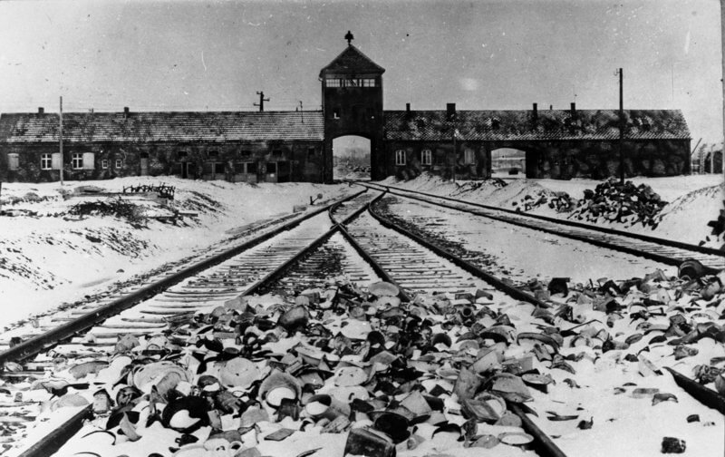

Dzisiejszy dzień zdominowany jest przez dwie zdobycze Armii Czerwonej: Wilczy Szaniec i KL Auschwitz.

### Wilczy Szaniec

31 Armia 1 Frontu Białoruskiego zdobywa Kętrzyn, miasto, w którego pobliżu znajduje się Wilczy Szaniec, najdłużej używana i najważniejsza kwatera wojenna Hitlera. Opuścił ją 20 listopada 1944, a teraz są tam czerwonoarmiści.

### Wędrujący kocioł

"Wędrujący kocioł" z braku paliwa zatrzymał się w Kobylinie, Śląsk i bezpieczne zaplecze własnego frontu jest już na wyciągnięcie ręki. Żołnierze są skrajnie wyczerpani. Zrzut paliwa umożliwia dalszą drogę tak jak dotychczas w nocy, dzięki pokrywie śnieżnej bez świateł. Jeszcze tego samego dnia czoło kotła dotarło w rejon Głogowa. W ciągu kilku dni całość sił, kilkadziesiąt tys. żołnierzy niemieckich, znalazło w Głogowie schronienie i odpoczynek.

Od prawie dwóch tygodni w walce i okrążeniu, nie mając dość paliwa, byli w ciągłym marszu. Przebyli ponad 300 km na terenie opanowanym przez nieprzyjaciela mającego przewagę i inicjatywę. Majewski szacuje liczebność grupy Nehringa po dotarciu do celu na 100 tys. żołnierzy i 200 pojazdów.

Na drodze pomiędzy wioskami Jastrzębia a Wroniniec, jak to relacjonuje Ahlfen:
>znajdowała się kilkukilometrowa kolumna, ostrzelana, zepchnięta w przydrożne rowy i rozjechana. W ciągu pięciu lat wojny widzieliśmy już wiele powagi i zła, także w naszych zbombardowanych miastach. Ale tutaj rozszarpane na strzępy zwłoki starców, matek, dzieci i niemowląt, zaskoczonych przez wroga, którego przepełniona nienawiścią propaganda judziła do sadystycznych mordów, w trakcie ucieczki - wołały o pomstę do nieba.

### Brygada Świętokrzyska NSZ

Tymczasem Brygada Świętokrzyska w zapewniającej bezpieczeństwo eskorcie SS kontynuowała marsz. Jak się okazuje, nie wszyscy akceptowali przyjętą politykę dowództwa Brygady, rozpoczęły się dezercje.

Dzisiaj sąd polowy Brygady:
>skazał na karę śmierci za dezercję: por. Leśnego [N.N.], ppor. Granita [N.N.], ppor. Dubickiego [N.N.]

### Antal Szerb

W obozie koncentracyjnym Baif na zachodzie Węgier kapo zabił Antala Szerba. Pochodził z ochrzczonej rodziny żydowskiej. Od 1937 był profesorem literatury Uniwersytecie w Segedynie. Autor fundamentalnych opracowań: "Historia literatury węgierskiej", "Historia literatury światowej".

### KL Auschwitz

Brytyjczycy i Armia Czerwona walczą już na terenie przedwojennych Niemiec. Wciąż jednak zajęte są spore obszary zdobyte podczas wojny. 18 stycznia dzień po utracie Warszawy wojska niemieckie wycofują się z oblężonego Krakowa, dawnej stolicy Polski, która w czasie wojny pełniła funkcję stolicy Generalnej Guberni (niem. Generalgouvernement) - nielegalnego w świetle prawa międzynarodowego - tworu okupacyjnego utworzonego z ziem polskich niewłączonych do Rzeszy. Wkrótce Armia Czerwona wkroczyła na tereny II RP włączone do Rzeszy.

Cztery dywizje piechoty (100, 107, 148 i 322) 60 Armii 1. Frontu Ukraińskiego walczyły o dotychczas zupełnie nieznane miasto Oświęcim (niem. Auschwitz) znajdujące się 50 km na zachód od Krakowa. Był to obszar polski w okresie międzywojennym. W 1939 wcielony do Rzeszy, w granicach rejencji śląskiej.

Sowieci mieli pewną ograniczoną wiedzę na temat znajdującego się tam obozu. Wywiad wiedział o zagładzie Żydów, ale Armia Czerwona nie dostawała na ten temat żadnych informacji. Myśleli, że zbliżają się do obozu pracy, być może obozu z jeńcami wojennymi. Mieli ograniczoną wiedzę o okropieństwach lubelskiego Majdanka.

Nie wiedzieli jeszcze wtedy, że wkraczają na tzw. Interessengebiet KL Auschwitz, czyli zespół obozowy w kolanie rzeki Soły. Po Majdanku jest to jedyny obóz zagłady i pierwszy duży obóz koncentracyjny wyzwolony przez aliantów.

Wczoraj przekroczyli Wisłę pod Oświęcimiem.

Dziś o 9 rano zdobyli jeden z obozów Auschwitz III - Monowitz (pl. Monowice, wówczas oddzielna wieś, w granicach Oświęcimia od 1954) ze zrujnowaną alianckimi bombardowaniami fabryką koncernu IG Farben, było to ogromne przedsiębiorstwo, fabryka syntetycznej benzyny, miejsce pracy 12 tysięcy ludzi.

Kilka godzin później już po południu ruszyli w stronę Oświęcimia a później Brzezinki (Birkenau), w zaciekłych walkach o miasto stracili 231 zabitych i ok. godziny 15 dotarli do bram obozu. Co dziwne, obóz nie był opuszczony, wciąż broniło go SS, podczas walk na jego terenie ginie 66 czerwonoarmistów. Żołnierze Armii Czerwonej nie wiedzieli, z czym mają do czynienia i nie od razu zrozumieli, co naprawdę widzą.

*budynek bramny obozu zagłady KL Auschwitz II Birkenau. wkrótce po wyzwoleniu, 1945. 
Źródło: Wikipedia: [Von Bundesarchiv, B 285 Bild-04413 / Stanislaw Mucha / CC-BY-SA 3.0, CC BY-SA 3.0 de](https://commons.wikimedia.org/w/index.php?curid=5337694)*

Dziesięć dni wcześniej, 17 stycznia, rano odbył się ostatni obozowy apel, wzięło w nim udział 60 tysięcy więźniów i natychmiast po apelu zostali ewakuowani w tzw. marszach śmierci na zachód. Ale część nie mogła iść i została. 10 dni po wyruszeniu marszu śmierci czerwonoarmiści napotykają jeszcze siedem tysięcy wciąż żyjących więźniów KL Auschwitz często trudnych do odróżnienia od leżących wszędzie zwłok. Czy widząc obóz zagłady żołnierze, mają skojarzenia z sowieckimi łagrami? Czy myślą o swoich bliskich, znajomych, którzy nagle "zniknęli"?

Czy wśród ocalałych są jacyś wrocławianie? Możliwe, ale bardzo, bardzo mało prawdopodobne.

### 1. Front Białoruski

Wracając zaś do codziennej rutyny zwycięstwa:

1 Front Białoruski oprócz Kętrzyna zdobywa dziś: Mrągowo, Chełmno, Ryn i Trzciankę. Na froncie poznańskim Nowy Tomyśl i Zbąszyń. Nie są to wielkie obiekty, ale popatrzmy na mapę. Żukow jest już na zachód od Poznania, w połowie drogi do Odry!

90 km do Odry i 150 km do Berlina.

### Zbąszyń

Szczególnie interesujący jest Zbąszyń. To dawna granica niemiecko-polska. Położony po polskiej stronie Zbąszyń, dawny polski obóz koncentracyjny... Ejże, zaraz! "*Polski obóz koncentracyjny*"?! Wiem dobrze, jak to brzmi. Proszę jednak wymyślić inną nazwę na miejsce, w którym bez wyroku sądu i bez żadnej pomocy ze strony państwa, przez wiele miesięcy przemocą państwo przetrzymuje tysiące ludzi, i to własnych obywateli. Dodajmy, że Żydów. Jak do tego doszło?

Otóż władze II RP postanowiły pozbawić obywatelstwa Żydów mieszkających za granicą. Polecenie weryfikacji dokumentów rozesłane do polskich placówek dyplomatycznych oficjalnie dotyczyło wszystkich obywateli, ale nieoficjalnie wiadomo było, że chodzi o polskich Żydów.

Niemcy szybko się zorientowali, że Polska, pozbawiając tysiące polskich Żydów mieszkających w Niemczech obywatelstwa, zostawi im ludzi, których sami chcieliby się pozbyć. Dokonali więc natychmiastowej i brutalnej deportacji na granicę, nie dali im czasu na spakowane się, zostawienie wiadomości. Nie pozwolono in zabrać więcej niż 10 marek. Ograbiono więc ich i wygnano. Władze polskie nie były na to przygotowane. Po chwilowym kryzysie zaczęto ich wpuszczać do Polski, ale trwało to może ze dwa dni. Zaraz potem granicę dla nich zamknięto, i to na zawsze.

Wiadomość o losie swoich bliskich uwięzionych w nieludzkich warunkach wstrząsnęła 17-letnim Herszelem Grynszpanem przebywającym wówczas w Paryżu. Dokonał zamachu na urzędnika paryskiej ambasady niemieckiej, Ernsta von Ratha, który wkrótce potem w wyniku postrzału zmarł w szpitalu. Ten zamach i śmierć niemieckiego dyplomaty stał się pretekstem do zorganizowania pogromu Kryształowej Nocy. I natychmiast po tym rozpoczynają się masowe represje wobec Żydów niemieckich, ponownie zapełniają się obozy koncentracyjne.

Jest pewne, że gdyby nie to tragiczne wydarzenie Hitler i tak by znalazł jakiś pretekst do prześladowań, ale taki właśnie był ciąg wydarzeń. Na jego początku była decyzja rządu polskiego o pozbawieniu obywatelstwa polskich Żydów, którzy są za granica dłużej niż 5 lat. Potem deportacja dokonana przez hitlerowców, a potem niewpuszczenie ich do Polski. Czym spowodowane? Potem zrozpaczony losem krewnych Grynszpan strzela w Paryżu do niemieckiego urzędnika. Następnego dnia von Rath umiera w szpitalu. Wiadomość o tym dociera do szefostwa NSDAP zebranego w Monachium dla uczczenia rocznicy puczu monachijskiego. Hitler decyduje, że to dobry pretekst, i już czas zacząć Żydów zabijać.

### 1 Front Ukraiński

1 Front Ukraiński wkracza z pełną siłą na Śląsk: Będzin, Bytom, Piekary Śląskie, Siemianowice Śląskie, Świętochłowice. Poza tym Sosnowiec a w Małopolsce Andrychów i Brzeszcze. Zaczyna się bitwa o Żory. W nocy wdzierają się do Katowic.

Już 8 kwietnia tego roku na placu Wolności w Siemianowicach Śląskich stanie Pomnik Wdzięczności dla Armii Czerwonej, rozebrany w 1992.

W Świętochłowicach już wkrótce powstanie najsłynniejszy komunistyczny obóz koncentracyjny. Też "*polski obóz koncentracyjny*"?

W Przyszowicach (kilka km na południowy wschód od Gliwic) czerwonoarmiści prawdopodobnie sądząc, że są już na terytorium niemieckim, dokonali masakry, zamordowali około 70 ludzi, byli wśród nich także uciekinierzy z oświęcimskiego Marszu Śmierci, obywatele Włoch i Węgier.

Od kilku dni trwa gehenna mieszkańców Miechowic (obecnie część Bytomia), w którym opór stawiał Volkssturm. Pogłoska o tym, że zabito majora Armii Czerwonej, spowodowała lincz na mieszkańcach. Zabijano ich w domach, wyciągano na ulice i dokonywano egzekucji. Liczba ofiar jest nieustalona, waha się od 400 do 800. Wśród ofiar byli także polscy robotnicy przymusowi.

W Mikołowie czerwonoarmiści wtargnęli do domu zakonnego Salwatorianów przy ulicy Rybnickiej 4, dokonując rabunku. Dwie siostry zakonne zajmujące się pracami domowymi: Stanisława Falkus i Leopolda Ludwig zostały pobite i zamordowane w kaplicy. Dopiero 6 lutego już po wyjściu Armii Czerwonej pochowano je w ogrodzie klasztornym.

Gorzkie pierwsze dni wolności.

Wilczy Szaniec, Auschwitz, Zbąszyń, Świętochłowice - wszystko dzisiaj.

### Wrocław

Po przegrupowaniu 73 Korpus wznawia działania zaczepne na szosie z Oleśnicy do Wrocławia. Zaczyna się atak na Wrocław.

### Droga Birmańska

Wojna na Pacyfiku toczyła się na wielu frontach, jeden z najważniejszych był w Chinach. W wojnie japońsko-chińskiej brali udział Brytyjczycy wspierając stronę chińską. Żeby móc zaopatrywać wojska Kuomintangu w latach 1937-38 zbudowali Drogę Birmańską - ciągnącą się przez 1150 km trasę przez północą Birmę i prowincje Junnan. W budowie wzięło udział 200 tys. robotników.

Droga biegła przez trudny teren, ale miała fundamentalne znaczenie dla przebiegu wojny, bo była jedyną dostępną aliantom komunikacją z Chinami. Droga lotnicza ze względu na wysokość Himalajów była bardzo ryzykowna i nie nadawała się do normalnego transportu.

W 1942 Birma została zajęta przez wojska japońskie, które zablokowały drogę. Jedyną możliwością dotarcia do Chin było przeskoczenie przez Garb (ang. the Hump) wschodnią część masywu Himalajów. Silne turbulencje, wiatr którego prędkość dochodziła do 32 km/h. Od grudnia 1942 działał most powietrzny. Ogółem przerzucono w ten sposób 33 tys ludzi i 600 tys. ton ładunku przy stracie 600 samolotów. Zginęło 1300 ludzi, kolejnych 340 zaginęło bez wieści. Była to jedyna metoda zaopatrzenia walczących w Chinach wojsk amerykańskich.

Jesienią 1944 udało się odbić część Birmy. Dziś wreszcie odblokowano Drogę Birmańską, która łączy pozycje zajmowane przez wojska alianckie i chińskie.

### Odnośniki

- Miejsce Pamięci i Muzeum Auschwitz Birkenau [Wyzwolenie KL Auschwitz](http://www.auschwitz.org/wyzwolenie-kl-auschwitz/)
- Wprost.pl [Obozy Sikorskiego](https://www.wprost.pl/historia/125777/Obozy-Sikorskiego.html)
- wyczerpujący artykuł o obozie w Zbąszyniu: [Michał Siermiński: Obóz Polska](https://grecjawogniu.info/?p=25550)
- [Czesław Brzoza "Od Miechowa do Coburga : Brygada Świętokrzyska Narodowych Sił Zbrojnych w marszu na zachód" [PDF]](http://bazhum.muzhp.pl/media//files/Pamiec_i_Sprawiedliwosc/Pamiec_i_Sprawiedliwosc-r2004-t3-n1_(5)/Pamiec_i_Sprawiedliwosc-r2004-t3-n1_(5)-s221-274/Pamiec_i_Sprawiedliwosc-r2004-t3-n1_(5)-s221-274.pdf)
