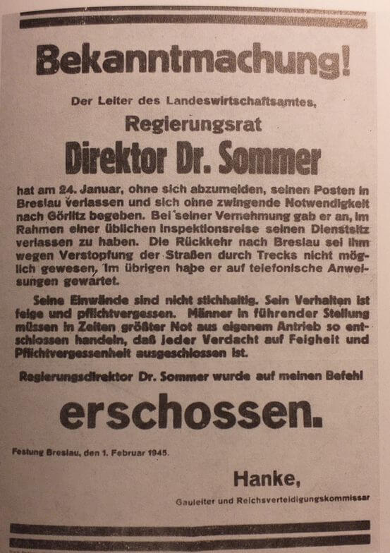

### Armia Czerwona

Pisząc o postępach Armii Czerwonej, wskazuję punkty maksymalne, najdalej znajdujące się punkty osiągnięte lub zdobyte. Jest to elita frontu idąca według przygotowanych w pośpiechu map, w boju sprawdzająca doniesienia i szacunki wywiadu. Z tyłu znajdowała się reszta wojska, osłaniająca flanki i rozciągające się drogi zaopatrzenia. Szpitale polowe, jednostki remontowe. Lotnictwo zajęte przenoszeniem lotnisk. Sztaby dywizji i armii w ciągłym ruchu. I wreszcie zaopatrzenie, kolumny ciężarówek i tam, gdzie udało się to zorganizować kolej, wiozące amunicję, paliwo, sprzęt.

Pierwsza fala uderzenia po wyparciu nieprzyjaciela wkrótce ruszała naprzód - upewniali się tylko czy nie pozostały żadne punkty oporu i szli dalej, za nimi postępowała druga linia szukająca magazynów, fabryk, ewentualnych źródeł zaopatrzenia, szukająca również cywilów ukrywających się w piwnicach, zegarków, kosztowności i kobiet.

Ale i oni wkrótce odchodzili za frontem i wtedy przychodziło najgorsze. Armia Czerwona była już na rdzennym terytorium wroga, tu nie obowiązywały żadne zasady.

### 1 Front Białoruski

1 Front Białoruski zdobywa dziś Dobiegniew, Drezdenko, Jordanów i Strzelce Krajeńskie. Dociera do osłony rubieży odrzańskiej: Wału Pomorskiego i MRU.

### Wał Pomorski

Rozpoczynają się niezwykle krwawe walki o przełamanie Wału Pomorskiego (niem. Pommernstellung) - jest to ok. 900 obiektów obronnych na obszarze długości 300 km. Dziś oddziały 1 Armii WP wchodzą na pierwszą linię natarcia. Jutro 4 DP wejdzie do walki. Walki potrwają prawie dwa tygodnie, zakończą się 10 lutego.

Straty polskie to 16 tys. zabitych.

6 lutego mieli dotrzeć do Odry.

- [Krzych333 /visioner.eu "film "Wał Pomorski 1945" - dokument fabularyzowany" [12:40]](https://www.youtube.com/watch?v=FXilRGaFSYk)
- [drawienskipn "Wał Pomorski w DPN" [YT 14:45]](https://www.youtube.com/watch?v=5u-SmsaY9n0)
- [SP2SV66 "TAJEMNICA WAŁU POMORSKIEGO" - Sensacje XX wieku [YT 24:08]](https://www.youtube.com/watch?v=I5FT5Y2AKOc)
- [Adventure Explorer "Wał Pomorski "Góra wisielcza" Strzaliny." [YT 59:13]](https://www.youtube.com/watch?v=q8WNXr0Iklg)

### MRU

Około godz. 20.00 czołgi 45 Gwardyjskiej Brygady Pancernej dotarły do Nietoperka, gdzie napotkały ogień dział przeciwpancernych - rozpoczyna się kilkudniowe starcie o Międzyrzecki Rejon Umocniony (niem. Ostwall aka Festungsfront im Oder-Warthe Bogen), trwające do 31 stycznia.

- SP2SV66 - Sensacje XX wieku ["LINIA UMOCNIEN ODRZAŃSKICH -FESTUNGFRONTS OWB-REJON UMOCNIEŃ MRU" [YT 24:29]](https://www.youtube.com/watch?v=7Qg24F0WgGs) | ["MIĘDZYRZECKI REJON UMOCNIEN" [YT 24:35]](https://www.youtube.com/watch?v=6vowsJ2sres)

### 1 Front Ukraiński

1 Front Ukraiński natomiast: Nowy Targ, Zakopane oraz Kuźnie Raciborską.

Na odcinku śląskim impet Armii Czerwonej przygasa. W wielu miejscach osiągnięto Odrę. Czekając na dociągnięcie większych sił, awangarda armii bada opór stawiany przez Wehrmacht i szuka możliwości zbudowania przyczółków i przeprawienia się na lewy brzeg. Zadanie to było ułatwione z powodu silnego mrozu, który skuł Odrę grubą warstwą lodu. Temperatura za dnia spadła poniżej 10 stopni.

Główne siły niemieckie są w trakcie wycofywania się z Górnego Śląska, który już jest utracony. Jak pisze Ahlfen:
>Generał Schörner nie mógł już dłużej opierać się gwałtownym sugestiom generała Schulza i na własną odpowiedzialność zezwolił na odwrót w nocy z 27 na 28 stycznia. Sam powiadomił o tym Hitlera, który darzył go bezwarunkowym zaufaniem. 
>Pierwszy szef sztabu generalnego Grupy Armii, pułkownik Freiherr von Weitershausen, świadek tej rozmowy, opowiada o tym: "Zamiast podziewanego wybuchu wściekłości odpowiedział głos złamanego, wyczerpanego człowieka: "Tak, Schörner, skoro pan tak mówi, wie pan, jak dowodzić""

29 stycznia lewe skrzydło frontu, po zajęciu Górnośląskiego Okręgu Przemysłowego, zdobyło przyczółek na północ od Raciborza.

W ciągu ostatnich trzech dni zdobyli kilka przyczółków na Odrze i chcą ją przekroczyć natychmiast po umocnieniu się na Górnym Śląsku.

Kleszcze zaczynają się zaciskać.

### Marsz śmierci

Marsz śmierci więźniów KL Auschwitz dotarł dzisiaj do Kłodzka.

- [Nieznany marsz śmierci](https://www.dw.com/pl/nieznany-marsz-%C5%9Bmierci/a-56377939?)

### Brygada Świętokrzyska NSZ

Również Brygada Świętokrzyska jest w Sudetach. Również ma asystę SS.

Po przekroczeniu Odry w Krapkowicach forsownym marszem dotarli do Bobolic. Właśnie tam lub w Ząbkowicach Śląskich dochodzi do dalszych rozmów, tym razem z oficerami RSHA SS. Po telefonicznej rozmowie z Berlinem przekazują im zgodę na dalszy marsz jednostki w kierunku Pragi.

SS zapewniło Brygadzie Świętokrzyskiej oficerów łącznikowych, aprowizację, noclegi i pomoc medyczną.

### Przyczółki

Most kolejowy w Czernicy (niem. Tschirne) został wysadzony, ale jeszcze 26 stycznia na wysokości Marcinkowic (niem. Märzdorf) sowietom udało się przeprawić i zdobyć przyczółek blokując połączenie z Oławą. Bronili go zażarcie. Komendant Johannes Krause wysłał posiadane akurat siły (kilkanaście przejeżdżających przez Wrocław czołgów i 4 kompanie podchorążych Luftwaffe) odbijając Marcinkowice. Jednakże dopiero w nocy z 29 na 30 stycznia pośpiesznie przerzucona omnibusami 269. Dywizja Piechoty odepchnęła nieprzyjaciela za Odrę, ale nie mogła usunąć go z Radwanic (niem. Radwanitz), wciąż pozostawał tam oddział niepodejmujący jednak żadnych działań.

### Piskorzowice

29 stycznia powstaje jeszcze bardziej niebezpieczny przyczółek na zachód od Wrocławia na zakolu Odry przy Piskorzowicach (niem. Peiskerwitz; wieś została tak zniszczona podczas wojny, że już nie istnieje) i Pisarzowicach (niem. Pesterwitz). W nocy lepiej już przygotowane oddziały szturmowe 73 Korpusu forsują rzekę i pomimo silnego ognia zakładają przyczółek na lewym brzegu. Zdobyto Pisarzowice i przecięto linię kolejową Wrocław - Brzeg Dolny. Do końca stycznia przyczółek będzie miał już 3 na 4 km.

Walczy tu SS Besslein, ponosząc ciężkie straty, po kilku dniach ze 133 żołnierzy 11 kompanii SS pozostało 36. Jak to jeden z nich G. Haas napisał: "*Pesterwitz - Tor zur Holle - das Grab der 11 Kompanie*". Relację innego żołnierza tej jednostki będziemy śledzić prawie do końca opowieści o bitwie.

### Wrocław

Tymczasem we Wrocławiu 42-letni pisarz i dramaturg Hugo Hartung wcielony do Luftwaffe i stacjonujący na lotnisku w Strachowicach (Flughafen Breslau-Schöngarten) pisze:
>Zlecono mi kurierską wyprawę do miasta. Większość drogi musiałem pokonać pieszo. Niesamowite uczucie: wszędzie puste, wyludnione ulice. Tu i ówdzie widać pojedynczych staruszków; kilka podejrzanych postaci kręci się wokół sklepu wciąż zapełnionego towarem. Od czasu do czasu spotykam wygłodniałe psy, które węszą w śniegu.

Publiczne egzekucje urzędników i powiadamiające o nich obwieszczenia miały na celu zastraszyć tych, którzy nie dali się przekonać propagandzie zapewniającej o rychłym zwycięstwie. Wkrótce po egzekucji wiceburmistrza Spielhagena zamordowany zostaje dr Sommer. Trudno ustalić dokładnie kiedy, bo obwieszczenie o egzekucji datowane jest na 1 lutego, ale mogło być wystawione kolejnego dnia. Natomiast można zetknąć się z informacją, że nastąpiło to "dzień po" egzekucji Spielhagena, co jest raczej niemożliwe, bo wtedy musiałyby upłynąć trzy dni pomiędzy egzekucją a obwieszczeniem.

<BoxImageWrapper>

Obwieszczenie o egzekucji radcy rejencji dra Sommera. Znajdująca się na nim data stoi w sprzeczności z powtarzaną informacją o tym że został zastrzelony dzień po egzekucji Spielhagena. 
Źródło: Walter Lassmann "Moje przeżycia w Festung Breslau. Z zapisków kapłana" Via Nova 2013
</BoxImageWrapper>

>Obwieszczenie 
>Kierownik Urzędu Ziemskiego 
>radca rejencji 
>dyrektor dr Sommer 
>opuścił 24 stycznia, bez zameldowania, swoje stanowisko we Wrocławiu i udał się bez szczególnej potrzeby do Zgorzelca. W czasie przesłuchania stwierdził, że miejsce pracy opuścił w ramach zwyczajnej podróży inspekcyjnej. Powrót do Wrocławia stał się dla niego niemożliwy z powodu zapchania dróg uciekinierami. Poza tym oczekiwał instrukcji telefonicznej. 
>Jego wyjaśnienia nie są wystarczające. Zachowanie jego jest tchórzliwe i pozbawione poczucia obowiązku. Osoby na kierowniczych stanowiskach powinny w sytuacji trudnej działać z własnej inicjatywy tak zdecydowanie, by każde podejrzenie o tchórzostwo i brak poczucia obowiązku były wykluczone. 
>Dyrektor dr Sommer został na mój rozkaz 
>rozstrzelany. 
>Twierdza Wrocław, dnia 1 lutego 1945 r. 
>Hanke 
>Gauleiter i Komisarz Obrony Rzeszy.
