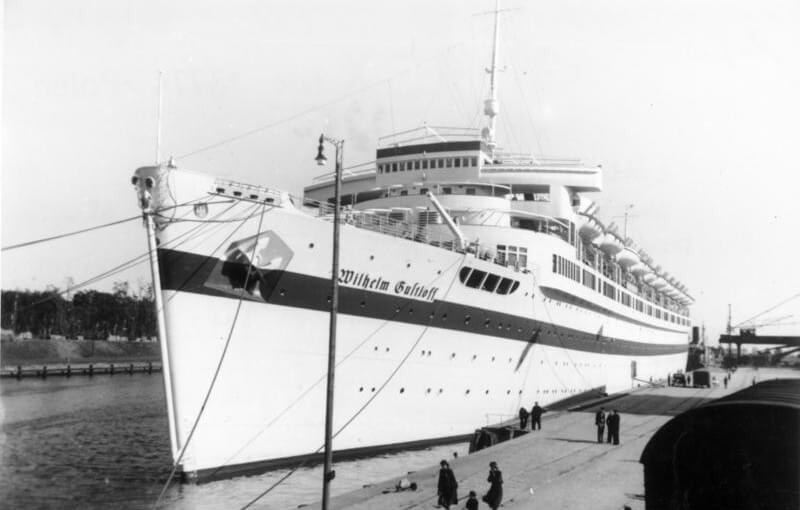

### Rajd na Cabanatuan

W 1942 Amerykanie i Japończycy stoczyli bitwę na Półwyspie Bataan (Luzon, Filipiny). Bitwa zakończyła się 9 kwietnia kapitulacją Amerykanów. Prawie 80 tys. wziętych do niewoli żołnierzy amerykańskich i filipińskich popędzono w Bataańskim Marszu Śmierci (ang. Bataan Death March) do odległego o 100 km San Fernando. Byli niedożywieni, bici, maltretowani i zabijani, kiedy nie mogli isć dalej. Zginęło 10 tys. Filipińczyków i około tysiąca Amerykanów. Pierwsi jeńcy dotarli do celu po trzech dniach, ostatni po dwóch tygodniach.

Część z nich osadzono w obozie jenieckim Cabanatuan (prowincja Nueva Ecija, Luzon, Filipiny) 100 km na północ od Manili. Atak na Luzon zaczął się 9 stycznia 1945. W tym czasie było ich tam 500 i wiadomo było, że strażnicy zabiją wszystkich przed wyzwoleniem. W tej sytuacji wywiad Szóstej Armii we współpracy z partyzantką filipińską opracował operacje specjalną znaną jako Rajd na Cabanatuan.

Oddział 100 rangersów i 200 partyzantów przedostał się 50 km za linię frontu i pod osłoną ciemności, korzystając z tego że uwagę załogi obozu odwrócił nocny myśliwiec P-61 Black Widow w trakcie trwającego pół godziny skoordynowanego ataku zabiła kilkuset żołnierzy japońskich, ponosząc przy tym niewielkie straty.

Wyzwoleni jeńcy zostali bezpiecznie eskortowani na stronę amerykańską.

MacArthur:
>No incident of the campaign in the Pacific has given me such satisfaction as the release of the POWs at Cabanatuan. The mission was brilliantly successful.

Operacja ta została uwieczniona w filmach:

- [Back to Bataan](https://en.wikipedia.org/wiki/Back_to_Bataan) czarno-biały film z 1945, w rolach głównych John Waynei Anthony Quinn
- [Bataan Rescue](https://en.wikipedia.org/wiki/Bataan_Rescue) film dokumentalny z 2003
- [The Great Raid](https://en.wikipedia.org/wiki/The_Great_Raid) fabularny z 2005

Odnośniki:

- Dark Docs ["Rescuing the Most Doomed American Soldiers of WW2 - The Great Raid" [YT 10:55]](https://www.youtube.com/watch?v=zIr2EDtReck)
- Wikipedia [Raid at Cabanatuan](https://en.wikipedia.org/wiki/Raid_at_Cabanatuan)

### 1. Front Białoruski

1 Front Białoruski zdobywa dziś Gorzów Wielkopolski (zaledwie 30 km od Odry i Twierdzy Kostrzyn), Krajenka, Złotów, Kwidzyn (30 km od Malborka) oraz Międzyrzecz, pozycja na MRU jutro zostanie przełamana.

### Gorzów Wielkopolski

FBTODO

- [Co to za ruiny? To centrum Gorzowa w marcu 1945 r. zniszczone w ponad 80% przez Armię Czerwoną i naloty Luftwaffe. / Wczorajsza fotografia gruzów wokół Katedry wywołała kolejną rozmowę o tym, kto zniszczył miasto w 1945 r.](https://www.facebook.com/GorzowWczoraj/posts/pfbid0MptYcLUxUDu6TH9oNHXQccihwvAYMuxRup6pz62VFmw3Y44EPdnq1qaox1LpB9Hpl)

### Przemówienie Hitlera

30 stycznia to rytualnym kalendarzu Partii jeden z kilku dni o szczególnym znaczeniu.

<SeeAlso txt="Państwo hitlerowskie" url="/festung-breslau/article/panstwo-hitlerowskie" />

- 1 maja **Dzień Pracy Narodowej** (niem. Tag der nationalen Arbeit).
- Heldengedenktag (pl. **Dzień Pamięci Bohaterów**)
- 8-9 listopada rocznica puczu monachijskiego, święto partyjne i święto państwowe **Dzień Pamięci Ruchu** (niem. Gedenktag für die Bewegung)
- 20 kwietnia **urodziny Führera** (niem. Führergeburtstag)
- 30 stycznia najważniejsze święto nazistowskich Niemiec, tego dnia Hitler został mianowany kanclerzem - **przejęcie władzy** (niem. Machtergreifung). Zwyczajowym najważniejszym wydarzeniem tego dnia było przemówienie Hitlera do narodu. Dla wojny charakterystyczne jest wycofywanie się Hitlera z widoku publicznego w miarę niepowodzeń na froncie. W 1943 rozpoczętym katastrofą w Stalingradzie przemawia tylko dwa razy, w 1944 trzy i w 1945 znowu tylko dwa razy, pierwszy raz na Nowy Rok - jest to jego jedyna mowa noworoczna. I drugi raz właśnie 30 stycznia - siódme w tę rocznicę i ostatnie publiczne przemówienie:
>Dlatego oczekuję od każdego Niemca, że będzie spełniał swój obowiązek do ostatecznego końca, że przyjmie na siebie każdą ofiarę, której się od niego wymaga i wymagać będzie, oczekuję od każdego zdrowego, że z narażeniem życia będzie się angażował w walkę, oczekuję od każdego chorego i ułomnego, że będzie pracował bez wytchnienia, oczekuję od mieszkańców miast, że będą wykuwać broń do tej walki, i oczekuję od każdego chłopa, że z najwyższym możliwym ograniczeniem własnych potrzeb będzie dostarczał chleb dla żołnierzy i robotników tej walki. Oczekuję od wszystkich kobiet i dziewcząt, że tak jak dotychczas będą wspierać tę walkę z najwyższym fanatyzmem. Zwracam się przy tym z najwyższym zaufaniem do niemieckiej młodzieży. Gdy stworzymy sprzysiężoną wspólnotę, będziemy mogli słusznie stanąć przed Wszechmocnym i poprosić go o łaskę i błogosławieństwo. Albowiem naród nie może uczynić nic więcej, jak tylko to, że każdy, kto może walczyć, walczy, kto może pracować, pracuje, a wszyscy wspólnie ponoszą ofiarę przepełnieni jedną myślą, by zagwarantować wolność, narodowy honor, a tym samym przyszłość i życie.

Jakby dla podkreślenia słów Hitlera dziś na Wrocław spadły pierwsze sowieckie pociski artyleryjskie.

### "Kolberg"

Jednym z mitów założycielskich państwa pruskiego jest obrona Kołobrzegu przez garnizon pod dowództwem hrabiego Augusta von Gneisenau. Jego nazwisko stało się symbolem nieugiętego dowódcy. Dla Prusaków obrona Kołobrzegu jest tym, czym dla Polaków obrona Jasnej Góry, z podobnymi zastrzeżeniami co do prawdziwości mitu: Jasna Góra nigdy nie była naprawdę atakowana, Kołobrzeg owszem utrzymał się mimo oblężenia, ale pięć dni później Prusacy uznali zwycięstwo francuskie, zawierając pokój w Tylży.

W 1943 wszedł do produkcji film opowiadający o tym oblężeniu, było już po Stalingradzie i goebbelsowskiej propagandzie potrzebna była wielka, podnosząca na duchu produkcja. Zaangażowano wszystkie możliwe środki. Miało to być mistrzowskie dzieło filmografii nazistowskiej dorównujące, ba! przewyższające amerykańskie blockbustery. Film ten kosztował ok. 8 mln marek i uratował wielu ludzi, którzy zaangażowani do produkcji nie zostali wysłani na front. Reżyserem był Veit Harlan, znany ze słynnego antysemickiego "Żyd Süss". Realizowało ją Studio Babelsberg na kolorowej taśmie Agfacolor.

Latem kręcono sceny zimowe, skąd wziąć śnieg w lecie? Na plan w sytuacji, kiedy waliła się sytuacja na froncie, przywieziono 100 wagonów soli. Potrzebne było realistycznie wyglądające wojsko. Uszyto kosztowne mundury i przebrano w nie 5 tys. żołnierzy.

Scenariusz oparto na dwóch źródłach: wydanej w 1823 autobiografii burmistrza Kołobrzegu Joachima Nettelbecka i sztuce z 1865 "Kolberg", której autorem był Paul Heyse, noblista z 1910. Przemilczano, że Heyse był Żydem.

Goebbels, który osobiście nadzorował produkcję, po pokazach przedpremierowych w grudniu 1944:
>z punktu widzenia nastrojów narodu niemieckiego będzie można jego oddziaływanie porównać z efektem wygranej bitwy.

30 stycznia miała miejsce premiera tego filmu. Odbyła się jednocześnie w dwóch miejscach: w obleganym przez aliantów porcie La Rochelle (trzeba było zrzucić szpule na spadochronie) i w Berlinie.

Jutro Armia Czerwona dotrze do Kostrzyna nad Odrą, jest to 75 km od Berlina. 4 marca zacznie się kolejna bitwa o Kołobrzeg, zakończona kapitulacją po dwóch tygodniach. Miasto zostało niemal całkowicie zniszczone - w 95%.

### MS Wilhelm Gustloff

Już po wystąpieniu, które nikomu nie przyniosło nadziei, tysiącom Niemców przyszło złożyć ofiarę.

MS Wilhelm Gustloff - flagowy statek nazistowskiej organizacji turystyki masowej Siła Przez Radość (niem. Kraft durch Freude, KdF) i symbol niemieckiej floty cywilnej. O godzinie 2116 na Bałtyku w rejonie Ławicy Słupskiej został trafiony torpedami. Pierwsza trafiła w dziób, druga w środek kadłuba, trzecia w maszynownię. Statek gwałtownie nabierał wody i szybko zaczął przechylać się na lewą stronę. Wiele osób zginęło natychmiast w wyniku eksplozji i pożarów wywołanych wybuchem torped. Panika, tłok i przechył utrudniały ucieczkę. Tonął szybko. Już po 65 minutach, czyli ok. 2225 był całkowicie pod wodą. Z powodu pory roku ludzie, którzy wpadli do wody, umierali z wyziębienia w kilka minut. Temperatura wody bliska zeru, powietrza ok -20 stopni. Uratowano ok. 1200 osób. Ile zginęło?

Dla porównania: na Titanicu w bez wątpienia najsłynniejszej katastrofie morskiej zginęło półtora tysiąca ludzi z 2200 znajdujących się na pokładzie. Tymczasem zaprojektowany na półtora tysiąca pasażerów Gustloff biorący udział w ewakuacji zabrał z Gdyni (niem. Gotenhaven; zatoka Gotów) prawdopodobnie 10 tysięcy ludzi, czyli zginęło ok. 9 tysięcy - sześć razy tyle, co na Titanicu. Dokładnej liczby ofiar nigdy nie poznamy, bo w zamieszaniu przestano nawet liczyć wsiadających ludzi.

Sukces dowódcy sowieckiej łodzi podwodnej S-13, Aleksandra Marinesko wynikał z tego, że przyczaił się i zaatakował ze strony, z której niemiecka marynarka nie spodziewała się ataku - od lądu.

Mimo tego, że większość zabitych to byli cywile atak ten nie był zbrodnią wojenną według prawa morskiego:

- w latach 1939-40 był wojskowym statkiem szpitalnym, a potem służył w Gdyni jako pływające baraki dla podwodniaków - czyli w momencie zatopienia od 6 lat należał do Kriegsmarine
- przewoził również materiały wojenne i żołnierzy
- znajdował się pod eskortą (torpedowiec Löwe)

Wrak został odnaleziony, jest przełamany i znajduje się na głębokości 45 m. W 1994 Polska uznała wrak za mogiłę wojenną, więc nurkowanie w promieniu 500 m jest możliwe tylko po uzyskaniu pozwolenia.

Warto zwrócić uwagę na patrona flagowego nazistowskiego statku: Wilhelm Gustloff był meteorologiem, założycielem i przywódcą szwajcarskiej NSDAP. Został zabity w zamachu 4 lutego 1936 w Davos i stał się jednym z partyjnych "męczenników". Co warto podkreślić, podobnie jak w przypadku von Ratha zamachowcem również był Żyd (rozwścieczony antysemicką propagandą), ale w tym przypadku nie nastąpiły żadne represje. W 1936 było na to jeszcze za wcześnie. Hitler jeszcze udawał, że Niemcy są normalnym krajem, z którym można się układać. Pozory można było zrzucić dopiero w listopadzie 1938.

Jako męczennik Gustloff został patronem statku, który był ważnym elementem hitlerowskiej propagandy. Wdowa po Gustloffie była matką chrzestną statku, przy wodowaniu 5 maja 1937 był Hitler. Rejsy Gustloffa, zbudowanego w hamburskiej stoczni Blohm+Voss, były relacjonowane przez hitlerowskie media. W prasie pojawiło się mnóstwo reportaży na jego temat. Ogromny statek stał się symbolem tego, jak państwo narodowo-socjalistyczne troszczy się o niemieckiego obywatela, każdemu umożliwiając odbycie podróży niegdyś będącej przywilejem klas wyższych. Ten rejs miał umożliwić już tylko ucieczkę z piekła.

*MS Gustloff zacumowany w porcie gdańskim w 1939. 1 września 1939 został zarekwirowany przez Kriegsmarine jako Lazarettschiff D. Potem, już od 1940 był statkiem szkoleniowym dla załóg okrętów podwodnych. 
Źródło: Wikipedia [Von Bundesarchiv, Bild 183-H27992 / Sönnke, Hans / CC-BY-SA 3.0, CC BY-SA 3.0 de](https://commons.wikimedia.org/w/index.php?curid=5434070)*

### Operacja Hannibal

Gwałtowna śmierć tysięcy pasażerów Gustloffa jest tylko samotnym tchnieniem grozy w bezmiarze cierpienia ogarniającego całą Europę.

Trwa operacja Hannibal - największa ewakuacja morska w historii ludzkości. Tragedia Gustloffa nie przerywa jej ani na chwilę. Od 21 stycznia na rozkaz admirała Kala Dõnitza wszystkie dostępne statki i okręty, wszystko, co pływa i jest w stanie wykonać rejs Bałtykiem, używane jest jako środek transportu z Prus Wschodnich do uważanych za bezpieczne portów w Niemczech (głównie Kilonia) oraz okupowanej Danii. Absolutny priorytet miała armia, ludności cywilnej wręcz nakazywano pozostać w domach. Ale z czasem przerodziło się to w kolejny etap Wielkiej Ucieczki. W ciągu 15 tygodni ewakuowano około miliona cywilów i ponad 300 tysięcy żołnierzy.

Toczy się również zaciekła walka z sowiecką marynarką wojenną. Tego dnia Kriegsmarine w Zatoce Gdańskiej zatapia bliźniaczą jednostkę okrętu kapitana Marinesko - okręt podwodny S-4.

### KL Sonnenburg / Słońsk

Położony ok 10 km na wschód od Kostrzyna nad Odrą Słońsk ma historię sięgającą średniowiecza, oppidum (ufortyfikowana osada) wzmiankowane jest w XIII wieku, w połowie XIV wieku zaczyna się budowa zamku. W 1808 mając 2 tys. mieszkańców, Sonnenburg uzyskuje prawa miejskie. W latach 1832-33 wybudowano duże więzienie mogące pomieścić tysiąc osadzonych.

Już w kwietniu 1933 powstaje tu obóz koncentracyjny - ciężkie więzienie polityczne. Hitlerowskie narzędzie terroru. Jednym z więźniów jest Carl von Ossietzky, dziennikarz i wydawca, który już w 1931 ujawnił tajne zbrojenia Reichswehry i został skazany za "ujawnienie tajemnicy wojskowej". Kiedy hitlerowcy ogłosili stan wyjątkowy, został osadzony ponownie, tym razem w obozie koncentracyjnym i nigdy już nie wyszedł na wolność. W 1936 otrzymał Pokojową Nagrodę Nobla, której odbiór uniemożliwili hitlerowcy. Zmarł w berlińskim więzieniu, chory gruźlicę w 1938.

Ważnym rozdziałem w jego historii jest udział w akcji "Nacht und Nebel" zarządzonej 7 grudnia 1941 wymierzonej w mieszkańców okupowanych krajów Beneluxu, Francji i Europy Północnej podejrzewanych o udział w ruchu oporu. Aresztowano ich, czasem po prostu porywano z ulicy i wywożono m in do obozów koncentracyjnych na Śląsku. Mieli na zawsze zniknąć, stanowiąc odstraszający przykład. Takie było znaczenie tej "nocy i mgły" zaczerpniętej z Goethego.

Kiedy eksplozja, pożary i mroczna woda zamykają się nad tysiącami pasażerów Gustloffa, w KL Sonnenburg pojawia się oddział SS. Od 22 do pierwszej w nocy wyprowadzają z cel więźniów dziesiątkami, każą im się rozebrać i rozstrzeliwują na dziedzińcu. W ten sposób w ciągu trzech godzin zamordowali 819 więźniów. Przypadkiem ocalało czterech ludzi.

Po egzekucji w więzieniu w Radogoszczu jest to najcięższa zbrodnia dokonana przez hitlerowców podczas operacji wiślansko-odrzańskiej. Jest to szczególne miejsce martyrologii dla Luksemburczyków, tutaj zamordowano 91 obywateli tego kraju, wielu z nich było ważnymi politykami, i jako takie znajduje się pod opieką władz Luksemburga.

Trzy dni później, 2 lutego dziedziniec zasłany zwłokami ofiar zostanie odkryty przez oddział sowiecki.

- ["Słońsk: 70. rocznica mordu w Sonnenburgu"](https://historia.interia.pl/aktualnosci/news-slonsk-70-rocznica-mordu-w-sonnenburgu,nId,1599775)

### Dolny Śląsk

Niemcy wycofali się na umocnione pozycje na wschód od Głogowa wzdłuż rzeki Krzycki Rów i kanału Kopalnica.

Walki trwały nie tylko w okolicach Oławy. Przyczółek w Piskorzowicach stanowi zagrożenie od zachodu, w rejonie Urazu (niem. Auras) gromadzą się siły nieprzyjaciela, szykując się do desantu. 29 stycznia sowietom udało się przeprawić przez Odrę i rozpętała się zaciekła strzelanina trwająca cały dzień, rozstrzygnęły ją dopiero siły obrońców poderwane dramatycznym alarmem o trzeciej w nocy 30 stycznia.

### Wrocław

Na ulice Traugutta i Brochowską spadły pierwsze pociski artyleryjskie.

Hans von Ahlfen wspomina, że właśnie dziś w okolicach Tresna stronie niemieckiej udało się przeciwnatarcie prowadzone przez kapitana Seifferta z kompanią SS. W ataku wyróżniła się pewna lekarka, która jako pierwsza kobieta w Twierdzy otrzymała Krzyż Żelazny II kategorii. Jak to określił, jedynie w Radwanicach pozostało "gniazdo os".

30 stycznia ze strony SS pada rozkaz ewakuacji duchownych. Tego dnia wieczorem odbywa się pośpiesznie zorganizowana w zasypanej śniegiem Katedrze narada ekumeniczna, podczas której przedstawiciele kościoła katolickiego i luterańskiego uzgadniają, że najlepiej będzie wstrzymać się z realizacją tego rozkazu. Zapytany następnego dnia przez kontakt Kapituły Katedralnej Gauleiter Hanke odpowiada, ku zaskoczeniu wszystkich, że nic nie wie o takim rozkazie Himmlera i zaleca w tej kwestii skontaktowanie się z gestapo.

### Odnośniki

- [Ostatnie przemówienie radiowe Adolfa Hitlera - 30 stycznia 1945 r.](http://stosunki-miedzynarodowe.pl/teksty-zrodlowe/przemowienia/1118-ostatnie-przemowienie-radiowe-adolfa-hitlera-30-stycznia-1945-r)
- [„Wilhelm Gustloff”. Największa tragedia w historii żeglugi](https://menway.interia.pl/historia/news-wilhelm-gustloff-najwieksza-tragedia-w-historii-zeglugi,nId,4292444)
- [Zatopienie „Wilhelma Gustloffa” – zbrodnia czy prawo wojny?](https://historykon.pl/nowe/zatopienie-wilhelma-gustloffa-zbrodnia-czy-prawo-wojny)
- Timeline - World History Documentaries ["The Story Of The Biggest Maritime Disaster In History | Hunt For U-479 (2/3) | Timeline" [YT 55:50]](https://www.youtube.com/watch?v=B6yGMrkSFVY)
