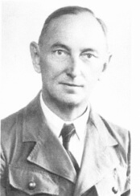

### Egzekucja w Palmnicken

7 tys. więźniów wschodniopruskich filii obozu koncentracyjnego KL Stutthof (Heiligenbeil / Mamonowo, Jesau / Juszne, Seerappen / Ljublino, Schippenbeil / Sępopol), w końcu stycznia zostało ewakuowanych do Królewca. W większości były to Żydówki, głównie z Polski i Węgier. Kiedy Królewiec został oblężony, przepędzono je do na zachód, a potem północ.

27 stycznia do Palmnicken (obecnie Jantarnyj / Янтарный w obwodzie kaliningradzkim) z 7 tys. dotarło mniej niż 3 tys. ludzi.

Najważniejszym przedsiębiorstwem w mieście była odkrywkowa kopalnia bursztynu "Anna" założona w 1883 przez Stantien & Becker, firmę z Kłajpedy (niem. Memeel). Były przetrzymywane na terenie kopalni. SS planowało je tam zamordować, ale okazało się to niemożliwe. Dowodzący konwojem Oberscharführer Fritz Weber czekał na rozkazy. Dzień po zatopieniu Gustloffa przybyło do niego dwóch esesmanów z Królewca z rozkazami.

SS wyprowadziło wszystkie na plażę, mówiąc że idą do Piławy (obecnie Bałtyjsk, port Królewca), skąd będą ewakuowane drogą morską. Zostały tam rozstrzelane z broni maszynowej. Burmistrz Kurt Friedrichs zorganizował złożone z Hitlerjugend Suchkommando, które wyłapywało i zabijało ocalone.

Dwa miesiące później ciała zostały odkryte przez Armię Czerwoną. Dowódca, rosyjski Żyd, rozkazał ludności cywilnej wykopać ofiary i umieścić ciała w zbiorowej mogile. Z tysięcy więźniów ocalało tylko 15 dziewczyn ukrywających się u miejscowych gospodarzy i jeden mężczyzna, który znalazł schronienie u włoskich jeńców w obozie pracy.

Fritz Weber został odnaleziony przypadkiem w 1964, powiesił się w więzieniu.

W 2000 wzniesiono kamień pamiątkowy z napisem w języku hebrajskim, rosyjskim i angielskim. W 2001 odsłonięto Pomnik Ofiar Holokaustu w Jantarnym projektu Franka Meislera. Jest to największy w Rosji monument upamiętniający Holokaust.

- Niemiecki Instytut Historyczny w Warszawie ["CfP: Marsz Śmierci do Palmnicken: Mikrohistoryczne podejście do doświadczenia przemocy w XX wieku i jego ponowna ocena - w perspektywie ponadnarodowej."](https://www.dhi.waw.pl/pl/aktualnosci/detail/news/cfp-marsz-smierci-do-palmnicken-mikrohistoryczne-podejscie-do-doswiadczenia-przemocy-w-xx-wieku.html)
- Wirtualny Sztetl ["Masakra w Palmnicken"](https://sztetl.org.pl/pl/miejscowosci/p/1939-palmniki/116-miejsca-martyrologii/139540-masakra-w-palmnicken)

### Egzekucja Eddiego Slovika

US Army niedaleko wsi wioski Sainte-Marie-aux-Mines rozstrzelało pochodzącego z Detroit 24-letniego szeregowca Eddiego Slovika. Był to pierwszy żołnierz amerykański rozstrzelany za dezercję od czasów wojny secesyjnej. Zarzut dezercji i wyrok śmierci z tego powodu dostało 49 żołnierzy amerykańskich, ale tylko ten jeden wykonano.

Slovik w drodze do jednostki zobaczył ostrzał artyleryjski i poprosił dowódcę o przeniesienie na tyły, powiedział że jest "zbyt przerażony" i zdezerteruje, jeśli znajdzie się w ogniu walki. Kiedy dowódca odmówił, Slovik poszedł do żandarmerii i zostawił tam notatkę z zapowiedzią dezercji. Usiłowano go przekonać, by tego nie robił. Odmówił podarcia notatki mimo próśb żandarmów.

Proces był krótki, trwał godzinę czterdzieści minut, obrońca nawet nie wygłosił mowy końcowej. Slowik był łatwą ofiarą systemu, bez wykształcenia, karany. Armia potraktowała jego sprawę surowo, bo dezercje zaczęły być wtedy problemem. Eisenhower odmówił ułaskawienia i 23 grudnia zatwierdził wyrok.

W 1954 napisano o nim książkę, w 1973 na jej podstawie powstał film telewizyjny. Slovik jest też wspomniany w "Rzeźni numer pięć" Kurta Vonneguta.

Dla porównania: liczba rozstrzelanych za dezercję żołnierzy Wehrmachtu to kilkanaście tysięcy. Według oficjalnych danych, w rzeczywistości jest znacznie wyższa, bo szczególnie pod koniec wojny już nie rejestrowano takich egzekucji. W Armii Czerwonej tyle egzekucji miało miejsce podczas samej tylko bitwy stalingradzkiej.

### 1 Front Białoruski

1 Front Białoruski zdobył dziś Barczewo, Barlinek, Bisztynek i Dębno.

Po trzech dniach walki przedarł się przez MRU i dotarł do położonej nad Odrą Twierdzy Kostrzyn (niem. Küstrin) ostatniej pozycji umocnionej przed Berlinem.

O godzinie 6 rano zwiadowcy z 26 Korpusu Strzeleckiego Gwardii 5 Armii Uderzeniowej generała Nikołaja Bierzarina dotarli do Odry i widząc ślady na lodzie, zdecydowali się przejść na drugą stronę. Tam zdobyli wieś Kienitz ze stacją kolejki wąskotorowej i pociągiem RAD z kilkoma działkami plot. Kilku nastolatków z RAD uciekło i zaalarmowało władze. Hitler dostał meldunek o tym zdarzeniu w południe. Do tego czasu w rejonie Kienitz był już przyczółek 4 na 2 km.

Sześć czołgów wjechało do Kostrzyna, ale nie miały osłony piechoty i cztery zostały zniszczone, dwóm udało się wydostać.

Niestety Kostrzyn jest już przygotowany do obrony. To ważny węzeł komunikacyjny i ostatnia pozycja na drodze do Berlina.

### Schwedt nad Odrą

Rankiem 31 stycznia do Schwedt nad Odrą przyjeżdża ze swoimi żołnierzami Otto Skorzeny. Ma opanować sytuacje na przedmościu odrzańskim. W typowy dla siebie sposób chełpi się tym, że:
>a przecież 30 stycznia było w Schwedt może stu rzeczywiście zdolnych do walki żołnierzy

Potem dodaje, że w ciągu kilku dni z 15 tys. znajdujących się w rejonie Schwedt żołnierzy stworzył gotową do walki formację, która broniła dojścia do Meklemburgii przez ponad miesiąc.

Wielu oskarżonych o defetyzm i zdradę zostało zabitych z wyroku trybunałów wojskowych. 4 lub 6 lutego został publicznie powieszony Kurt Flöter burmistrz Chojny (niem. Königsberg in der Neumark).

Skorzeny otrzymał specjalne zadanie od szefa kancelarii Führera, szarej eminencji III Rzeszy, Martina Bormanna. W Trzcińsku-Zdroju (niem. Bad Schönfließ) znajdował się ośrodek wypoczynkowy Kancelarii. Po tym, jak Berlin stał się obiektem bombardowań, zamieniono go w skład archiwum ważnych dokumentów Kancelarii Rzeszy. Kiedy na terenie Nowej Marchii pojawiła się Armia Czerwona, przypomniano sobie o tych dokumentach, a w każdym razie przypomniał o nich sobie Bormann, dla którego były szczególnie ważne. Należało je odzyskać lub zniszczyć. Jak pisze Skorzeny:
>Rosjanie zajęli Bad Schönfließ. Powiadomiłem więc Kancelarię, że nie poświęcę ani jednego żołnierza by odbić akta. Mieliśmy duzo ważniejsze rzeczy do zrobienia.

Kilka dni później nad Trzińsko przyleciały samoloty i precyzyjnie zrzuciły bomby, niszcząc budynek z dokumentami.

4 lutego Chojny zostały zajęte przez Armię Czerwoną. 16 lutego zostały spalone przez Armię Czerwoną i płonęły kilka dni. Przedmoście odrzańskie zostało utrzymane do 3 marca.

### Podgaje

W trakcie walk o Wał Pomorski:
>4 kompania 3 pułku I Dywizji otrzymała zadanie rozpoznania i „oczyszczenia” miejscowości Podgaje. Nie spodziewano się, że w Podgajach są wielkie siły wojsk hitlerowskich. Niemcy podpuścili żołnierzy na 300 metrów. Z Podgajów wyjechali narciarze w białych kombinezonach, okrążyli 4 kompanię, także od strony lasów żołnierze niemieccy wsparli narciarzy. 35 polskich żołnierzy umieścili w stodole w Podgajach. Kompania nie miała żadnego wsparcia, łącznicy nie dotarli do batalionu, brakowało amunicji.

2 lutego po zdobyciu wsi znaleziono ciała 32 żołnierzy z 4. kompanii 3. pułku piechoty 1. Dywizji WP wziętych do niewoli. Nie wiadomo kto dokonał tej zbrodni ani w jakich okolicznościach, łotewskie SS czy niemiecki Wehrmacht. Istnieje również możliwość, że już pojmani i uwięzieni stali się przypadkowymi ofiarami ostrzału artyleryjskiego.

- Podcast Wojenne Historie ["Podgaje 1945. Tajemnicza zbrodnia. Co się stało z 4. kompanią?" [YT 25:23]](https://www.youtube.com/watch?v=lQNGa81Kjb8)
- [Zbrodnia w Podgajach. W trakcie walk o przełamanie Wału Pomorskiego, w dniach 31.01 - 02.02.1945 w miejscowości Flederborn (obecnie Podgaje) dokonano zbrodni wojennej na 32 żołnierzach Wojska Polskiego.](https://www.facebook.com/permalink.php?story_fbid=3115929592010874&id=2353805098223331)

### Joseph Beyrle

Dziś został wyzwolony Stalag III C Alt Drewitz znajdujący się na terenie obecnego Drzewice w Kostrzynie. Wśród czerwonoarmistów, którzy do niego wkroczyli, był sierżant ze 101 Dywizji Powietrznodesantowej Joseph Beyrle, jeszcze kilkanaście dni temu więzień w tym obozie. Ale jak to.

Podczas lądowania w Normandii został oddzielony od oddziału, udało mu się wykonać część zadań, ale po kilku dniach został wzięty do niewoli. Po dwóch próbach ucieczki został wysłany do obozu w Kostrzynie, tam słysząc, że Armia Czerwona jest już blisko, uciekł z dwoma innymi żołnierzami. Tylko on przeżył, dotarł na teren zajęty przez Armię Czerwoną i poddał się im ze słowami:
>Я - американский товарищ! Я - американский товарищ!

Trafił na batalion czołgów pod dowództwem Aleksandry Grigoriewnej Samusienko. Była to jedyna kobieta w Armii Czerwonej, która dowodziła oddziałem pancernym. Podczas bitwy na Łuku Kurskim była dowódcą czołgu. Dowódca batalionu zginął w walce, wtedy przejęła dowództwo oddziału i wyciągnęła go z okrążenia. Uszanowano jej osiągnięcie i pozostała przy komendzie.

Został przyjęty do batalionu, znał się na silnikach i mechanice czołgów. Na początku lutego został ranny i ewakuowano go do szpitala wojskowe w Gorzowie Wielkopolskim. Tam odwiedził go marszałek Gieorgij Żukow, który potem pomógł mu w formalnościach związanych z powrotem do ojczyzny. Jeszcze tego samego miesiąca dotarł do ambasady USA w Moskwie i tam dowiedział się, że został oficjalnie uznany za zabitego 10 czerwca 1944, że odbył się jego pogrzeb, a rodzina jest w żałobie. Rzeczywiście znaleziono jego nieśmiertelniki przy zabitym, ale był to prawdopodobnie Niemiec, który mu je ukradł. Do domu wrócił 21 kwietnia 1945. W 1946 ślubu udzielał mu ten sam ksiądz, który dwa lata wcześniej odprawił jego pogrzeb. Po wojnie odwiedzał cmentarz, na którym miał być rzekomo pochowany.

Beyrle był jedynym żołnierzem, który służył jednocześnie w armii amerykańskiej i sowieckiej. Zmarł w 2004.

Samusienko zginęła 3 marca 1945 pod Suliszewicami podczas operacji pomorskiej.

- Dark Docs ["The Soldier Who Hated Nazis So Much He Joined Both the Russian and American Army" [YT 9:11]](https://www.youtube.com/watch?v=juUOsZVsco8)
- Los Angeles Times ["Joe Beyrle, 81; Fought for U.S. and Soviets in World War II"](https://www.latimes.com/archives/la-xpm-2004-dec-16-me-beyrle16-story.html)
- [Stalag III C](https://pl.wikipedia.org/wiki/Stalag_III_C)
- Eastern Front ["They said it was NOT WOMEN'S BUSINESS to drive a tank. WW2 memoirs of female tanker in Red Army." [YT 18:35]](https://www.youtube.com/watch?v=SNjNpUdKrK0)

### Wschowa 1939

Drugi raz podczas tej wojny pod Wschową (niem. Fraustadt) pojawili się żołnierze nieprzyjaciela. 2 września 1939 miał miejsce jedyny atak Wojska Polskiego na terytorium Niemiec. Generał R. Abraham wydał rozkaz:
>odrzucić oddziały nieprzyjaciela i ostrzelać tę miejscowość ogniem artyleryjskim

Grupa wypadowa pod dowództwem kapitana Edmunda Lesisza składała się z 3 plutonów piechoty, plutonu samochodów pancernych, plutonu ckm i plutonu artylerii. Do osłony przeznaczono pluton tankietek TKS, pluton ułanów i pluton kolarzy.

W ciągu niecałej godziny wzbudzając chaos i panikę, polscy żołnierze wdarli się 8 km w głąb Niemiec, docierając do rogatek miasta i koszar wojskowych, które ostrzelali artylerią. Zdobyto znaczne ilości broni i zabito kilku Niemców bez strat własnych.

Gestapo wyciągnęło kapitana Lesisza z oflagu i wywiozło do Łodzi. Tam został rozstrzelany 21 stycznia 1943.

- Mark Felton Productions ["The POLISH Invasion of Germany 1939" [YT 5:53]](https://www.youtube.com/watch?v=sP79RBS5uFc)
- [Wypad na Wschowę](https://pl.wikipedia.org/wiki/Wypad_na_Wschow%C4%99)

### 1 Front Ukraiński

1 Front Ukraiński zdobył Kędzierzyn i Leszno.

Dzisiaj 4 Armia Pancerna zdobyła Ścinawę, przyczółek na lewym brzegu ma już 35 km szerokości i 15 km głębokości. Do Legnicy jest tylko kilkanaście km.

### Głogów

Kilka dni temu, od 27 stycznia oddziały "Wędrującego kotła" dotarły do bezpiecznej bazy w Głogowie. Ich przemieszczanie się i dotarcie do celu stanowiły dla Armii Czerwonej ogromny problem, opóźniając marsz i zagrażając pozycjom w pobliżu Wrocławia. Wczoraj i dziś dwa zgrupowania niemieckie z tego "kotła" pod dowództwem generałów Nehringa i von Sauckena walczyły o likwidację przyczółka na Odrze i odbicie Chobieni i Ścinawy. Bój zakończył się utrzymaniem zastanej sytuacji z ogromnymi stratami po obu stronach. Niemcy wycofali się, nie dając się zamknąć w okrążeniu i zajęli umocnienia na prawym brzegu na wschód od Głogowa. Miały one dla dowództwa niemieckiego tak samo, jak cały obszar Głogowa ogromne znaczenie. Planowano stąd rozwinąć do ataku ściągniętą z frontu zachodniego 6 Armię Pancerną SS, której celem miały być oddziały 1 Frontu Białoruskiego zmierzająca na Kostrzyn. Miało to być uderzenie broniące Berlina.

### Studzionki

W boju o wsie Brodowice i Studzionki (ok 8 km na zachód od Chobieni) wg meldunków sowieckich zniszczono cztery czołgi (jeden Königstiger i 3 Pantery). Pułk sowiecki stracił 9 T-34, w tym siedem całkowicie zniszczonych. Jak wyczerpująca była walka o dojście do Odry świadczy fakt, że na stanie pułku pozostało tylko 5 sprawnych czołgów. [PANCERNY BÓJ O STUDZIONKI (STEUDELWITZ) 1945](https://www.facebook.com/bobr1945/posts/3483706755076296)

### Dolny Śląsk

Armia Czerwona dociera do Odry na prawie całej jej długości na Śląsku i Ziemi Lubuskiej. Jest już w okolicy Kostrzynia (niem. Küstrin) oraz Frankfurtu nad Odrą. Przygotowują się do natarcia w rejonie Koźla (niem. Cosel). Po niepowodzeniach na wschód od Odry Korpus Pancerny Großdeutschland zostaje przegrupowany na lewy brzeg.

Tymczasem na obu przyczółkach trwają zaciekłe walki. Sowieci wciąż blokują Oławę, 269 DP nie udaje się zlikwidować przyczółka.

Przedmiotem troski dowództwa Twierdzy była gruba pokrywa lodu na Odrze, według niektórych pozwalająca nawet przejechać czołgom. Właśnie z powodu mrozu nie powiodła się próba podniesienia poziomu wody na rzece przez spuszczenie oddanego do użytku w 1933 zbiornika retencyjnego na Nysie Kłodzkiej w Otmuchowie (niem. Ottmachauer See).

### Von Kleist

W swoim majątku w Krzyżanowicach (niem. Weiderbrück) nad Widawą od marca 1944 przebywał feldmarszałek von Kleist.

W latach 1935-38 (czyli od utworzenia Wehrmachtu) był dowódcą śląskiego VIII Korpusu Armijnego, podczas wojny z Polską dowódcą korpusu, a później we Francji, Jugosławii i ZSRR Grupy Pancernej. Od 1942 dowódca Grupy Armii A. W 1943 dowodził udanym odwrotem po klęsce w Stalingradzie, za który został awansowany na feldmarszałka. Rok później, kiedy wbrew wyraźnemu rozkazowi Hitlera wycofał się, by uniknąć okrążenia, popadł w niełaskę.

Komendant Krause w ostatniej chwili zdołał namówić feldmarszałka na opuszczenie domu. Batalionem, który później walczył w tym rejonie, dowodził jego syn, rotmistrz von Kleist, który w domu rodzinnym przechodził właśnie rekonwalescencję.

### Wrocław

Pomimo wyraźnych nakazów zaczynają wracać do Wrocławia wypędzeni kilka dni temu uchodźcy, przynosząc straszliwe opisy tego, co dzieje się na drogach Śląska, gdzie każdego dnia tysiące ludzi ginie z głodu i zimna. Zdesperowani i przerażeni nie wierzą już w to, że jest dokąd uciekać, decydują się pozostać w mieście, w którym nie brakuje jedzenia i można znaleźć schronienie przed zimnem. Władze zaś pomimo terroru i egzekucji przeprowadzanych publicznie i potajemnie nie są w stanie zapanować nad sytuacją.

<BoxImageWrapper>

Johannes Krause, komendant Festung Breslau od 25 września do 2 lutego 1945.
Źródło: [Historia Strugi - Parafia Matki Bożej Bolesnej w Strudze](http://parafia-struga.pl/05_zrodla_historia_strugi.html)
</BoxImageWrapper>

Zaczynają się przesiedlenia wewnątrz miasta. 31 stycznia generał Rudolf Koch-Erpach pełnomocnik dowództwa Grupy Armii Środek rozkazał wszystkim mieszkającym na północ od Odry opuścić ten teren. Uważano, że tam właśnie uderzy nieprzyjaciel.

Po nocnych walkach w rejonie Urazu dziś panuje nadzwyczajny spokój. Hugo Hartung pisze tego dnia:
>Do bazy zawitał oddział wojska, któremu nadajemy ksywę "dzika banda z Radomia". Zabawnie opatuleni zuchwalcy we wspaniałych futrzanych czapach, którzy przyjechali tu z taborem polskich kucharek i mnóstwem zarekwirowanego bydła, przypominają landknechtów z czasów wojny trzydziestoletniej. Zaprzężonymi w polskie konie saniami gnają po płycie lotniska, hałasując i zawadiacko trzaskając biczami. Szlachtują bydło i gotują dla swoich ludzi; w okolicznych wsiach rekwirują alkohol. Po południu temperatura nareszcie wzrasta do zera, wieczorem zaś kapelmistrz L. i ja słyszymy kosa. Ta pierwsza namacalna oznaka nadchodzącej wiosny budzi w nas wzruszenie.

Idzie wiosna.

### Komendant Johannes Krause

Przeciążony obowiązkami i nieustannym napięciem 52-letni komendant Twierdzy generalmajor Johannes Krause nagle zachorował na zapalenie płuc, 31 stycznia ma 40 stopni gorączki i oczywiste jest, że wymaga długiej rekonwalescencji. W tej krytycznej chwili nie może pełnić już dłużej obowiązków dowódcy. Krause wstąpił do armii w wieku 19 lat jako podchorąży, rok przed Wielką Wojną, służy początkowo w zwiadzie później w artylerii, kończy wojnę w stopniu porucznika. Służy później w ograniczonej do 100 tysięcy żołnierzy Reichswerze. Kiedy Hitler dochodzi do władzy, jest instruktorem w szkole artyleryjskiej, we wrześniu 1934 na pół roku przed powstaniem Wehrmachtu zostaje dowódcą batalionu artylerii. Zwieńczeniem kariery jest stanowisko dowódcy 312 Dywizji Artylerii, które piastuje dokładnie miesiąc: od 1 kwietnia do 1 maja 1944, później pozostaje w rezerwie Fũhrera i 25 września 1944 zostaje wyznaczony na dowódcę Twierdzy Wrocław. Jest Ślązakiem, urodził się w Strudze (Adelsbach) k Starych Bogaczowic (Alt Reichenau).

Miejscowość ta zasłynęła 15 maja 1807 bitwą, podczas której polscy ułani Legii Polsko-Włoskiej (sformowanej zaledwie półtora miesiąca wcześniej) napotkali i podczas błyskawicznej szarży rozbili maszerujący na Wrocław oddział piechoty i kawalerii pruskiej, znacznie przewyższający ich liczebnie. Ironiczne jest to, że oddział ten składał się w dużej części z polskich chłopów - dezerterów z armii pruskiej. Doprowadzili do Wrocławia 800 jeńców, gdzie wynagrodził ich za to Hieronim Bonaparte.

### Bomba atomowa

Pora na najbardziej zaawansowaną technologię wojenną jaką bez wątpienia była bomba atomowa. W styczniu 1945 wydarzyły się trzy rzeczy związane z projektem Mahattan, o których warto wspomnieć. Ale najpierw o historii alianckich projektów atomowych.

Bomby atomowe zrzucone na Hiroszimę i Nagasaki swój faktyczny początek miały w... Berlinie. To tam w grudniu 1938 w Instytucie Maxa Plancka (niem. Max Planck Institut für Chemie) chemicy Otto Hahn i Fritz Strassmann dokonali rozszczepienia jądra atomowego. Powiadomili o tym listownie swoją koleżankę Lise Meitner, która uciekając przed prześladowaniami hitlerowskimi, schroniła się w Szwecji. Meitner razem ze swoim bratankiem Otto Robertem Frischem od dawna zajmowali się problematyką rozszczepienia jądra atomowego, ale do tej chwili było to zagadnienie wyłącznie teoretyczne. Uciekła do Szwecji po Anschlussie Austrii, ponieważ jej dokumenty austriackie nie były już ważne, było to trudne i ryzykowne. Pomogło jej wielu kolegów, m.in. Hahn, który kiedy okazało się, że nie ma nic na ewentualną łapówkę, podarował jej diamentowy pierścionek odziedziczony po mamie, a sama ucieczka jest tematem na film sensacyjny. Fritsch natychmiast po objęciu władzy przez Hitlera już w 1933 opuścił Niemcy i przez resztę życia był fizykiem brytyjskim.

Meietner i Fritsch na podstawie danych laboratoryjnych opracowali teoretycznie odkrycie berlińskich chemików. Mieli dowód, że można dokonać rozszczepienia atomów i znali całą ówczesną teorię. Nienawidzili Hitlera i właśnie wybuchła wojna.

W marcu 1940 Fritsch razem z Rudolfem Peierlsem (również fizykiem pochodzenia żydowskiego) wystosowali ściśle tajne memorandum do rządu brytyjskiego wskazujące na praktyczną możliwość zbudowania bomby atomowej. Brytyjczycy memorandum Frischa–Peierlsa potraktowali bardzo poważnie. Dla rozwiązania problemu wykonalności bomby powołano MAUD Committee, wszystkie badania i publikacje dotyczące tej tematyki zeszły pod ziemię. Bardzo szybko zostało to dostrzeżone przez fizyków sowieckich. Prace Komitetu MAUD wskazywały, że należy przejść do fazy praktycznej. 31 sierpnia 1941 Winston Churchill zaakceptował powołanie, jak się później okazało, pierwszego alianckiego programu atomowego.

Tak powstał Tube Alloys, pierwszy brytyjski program broni atomowej realizowany we współpracy z naukowcami kanadyjskimi. Pewne szczegóły dotyczące tych prac zostały przekazane do USA i dlatego 9 października 1941 prezydent Roosevelt powołał amerykański program atomowy pod zarządem Top Policy Group (on, Vannevar Bush, wiceprezydent Henry A. Wallace, chemik James B. Conant, MON Henry L. Stimson, szef sztabu Armii generał George C. Marshall). Już 11 października powiadomił o tym Churchilla.

Już wcześniej Amerykanie dostrzegli możliwości tkwiące w odkryciu berlińskich chemików, ale chcieli tylko zbudować napęd atomowy dla marynarki wojennej. To dlatego już w 1940 ściągnęli 250 ton rudy uranu z Konga i bardzo szybko przejęli wszystkie dostępne światowe zasoby uranu. Dopiero Brytyjczycy skierowali ich na trop bomby.

Kiedy w grudniu 1941 Japończycy zaatakowali Pearl Harbor, przypieczętowali w ten sposób nie tylko przystąpienie USA do wojny, ale i ścisłą współpracę amerykańsko-brytyjską, także w dziedzinie broni nuklearnej.

### Projekt Mahnattan

26 września 1942 ruszył formalnie Projekt Manhattan, mając najwyższy możliwy priorytet. Na jego czele stał generał Leslie Groves z US Army Corps of Engineers, dyrektorem naukowym był amerykański fizyk Robert Oppenheimer. Od 1943 zasadnicza część prac badawczych była prowadzona w Los Alamos National Laboratory w stanie Nowy Meksyk znanym też jako Project Y.

Oba programy atomowe były rozwijane we współpracy, ale z czasem okazało się, że Brytyjczycy zmagają się z wieloma problemami materiałowymi, trudy wojny odciskały piętno na każdej dziedzinie życia, natomiast zasoby amerykańskie są praktycznie nieograniczone. A program atomowy pożerał gigantyczne ilości wszystkiego, był coraz bardziej kosztowny. Dlatego 19 sierpnia 1943 zawarto w Quebecu porozumienie (Mackenzie King, Franklin D. Roosevelt i Winston Churchill) mówiące, że UK i USA połączą swoje programy atomowe pod jednolitym zarządem Combined Policy Committee. W praktyce oznaczało to przeniesienie wszystkiego do USA.

Historia zatoczyła koło i 15 lutego 1944 amerykańskie bomby spadły na berliński Instytut. Celem nalotu było zniszczenie niemieckiego programu nuklearnego, którego tak bardzo obawiali się alianci. O tym, jak hitlerowcy budowali bombę atomową przy innej okazji.

Tutaj zaznaczę tylko, że fizycznie do stworzenia bomby potrzebne jest kolejno: 1) oczyszczenie rudy uranu i uzyskanie izotopu w wystarczającej czystości 2) wytworzenie docelowego materiału, Trinity i Fat Man to były bomby plutonowe, Little Boy uranowa, pluton wytwarzano w reaktorze jądrowym 3) skonstruowania bomby.

Więc po kolei...

Do uzyskania czystego izotopu uranu 235 pierwotnie używano kalutronów. Kalutron to elektromagnetyczny rozdzielacz izotopów. Potrzebna była czystość 90%. Budowa zespołu kalutronów w Oak Ridge w stanie Tennessee pod nazwą kodową Y-12 zaczęła się 18 lutego 1943. Zajmował powierzchnię 32 ha.

Urządzenia wstępnego oczyszczenia nazwano Alfa, a docelowego Beta. Kalutrony wymagały stałego ludzkiego nadzoru, początkowo zajmowali się nimi naukowcy, ale kiedy wyeliminowano usterki, odczyty powierzono kobietom niemającym żadnego kierunkowego wykształcenia. Wyszkolono je, żeby nie dociekały, o co w tym chodzi, i to do tego stopnia, że np. jedna z nich Gladys Owens, dopiero 50 lat później, kiedy całkiem przypadkiem zobaczyła swoje zdjęcie przy kalutronie i jego opis dowiedziała się, czym właściwie się zajmowała.

Uzyskanie właściwego uranu było bardzo trudne, zespół Alfa otrzymywał czystość do 15%, ale początkowo produktem była tylko 1 na prawie 6 tys cząsteczek, reszta była tracona w urządzeniu. W marcu 1944 wysłano do Los Alamos pierwszych kilkaset gram produktu. Ogromnym wysiłkiem usprawniono wydajność urządzeń. Do stycznia 1945 osiągnięto już wydajność 10%.

Uzyskany, oczyszczony materiał trzeba było opracować w reaktorze.

W marcu 1943 również w Oak Ridge rozpoczęła się budowa Reaktora Grafitowego X-10, była to konstrukcja docelowo eksperymentalna, miała być tylko wprawką przed budową właściwego urządzenia w Hanford. Chłodzony powietrzem co poważnie ograniczało jego możliwości. Pod kontrolą Fermiego i Comptona zaczął pracę 4 listopada 1944, a tydzień później produkował już 500 kW energii i do końca miesiąca dostarczył pierwsze 500 mg plutonu. W styczniu 1945 zakończył produkcję i został przeznaczony do celów badawczych.

Wspomniany reaktor w Hanford (Waszyngton) to budowany od października 1943 B Reactor, grafitowy i chłodzony wodą, miał produkować pluton 239 z uranu na drodze aktywacji neutronowej. To był pierwszy prawdziwy reaktor atomowy. Blok B rozpoczął pracę 26 września 1944, D w grudniu. W lutym ruszy blok F. 3 lutego 1945 do Los Alamos zostanie dostarczony pierwszy ładunek plutonu z Bloku B.

Kolejnym zagadnieniem była już sama produkcja bomby.

Najtrudniejszym zadaniem metalurgów pracujących przy budowie bomby atomowej w Los Alamos było odlanie półkul plutonowych. Jest to materiał bardzo niestabilny, dlatego używano stopu plutonu i galu, a dla ochrony przed rdzą pokrywano je niklem. Środowisko pracy było niebywale toksyczne, połowę pracujących tam naukowców i inżynierów trzeba było odesłać, bo w próbkach moczu mieli zbyt duże wartości plutonu. Było to tak niebezpieczne, że kiedy w styczniu 1945 wybuchł pożar, na szczęście niewielki, zaczęto się obawiać, że następny może zatruć całą okolicę.
