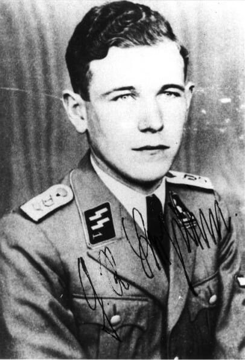

### 1 Front Białoruski

1 Front Białoruski Toruń, Myślibórz!

- Olaf Popkiewicz ["Festung Thorn 1945" [YT 30:47]](https://www.youtube.com/watch?v=1D0wY46a9Bg)

4 Korpus Piechoty Gwardii 8 Armii Gwardii pod dowództwem generała Głazunowa w dniach 1-2 lutego zdobywa przyczółek na zachód od Kostrzyna: Kietz, Manschnow, Rathstock.

2 lutego z ruin fortu k. Żabic ich działania obserwuje przez lornetę nożycową dowódca 8 Armii generał Wasilij Czujkow. Dokładnie dwa lata wcześniej w Stalingradzie jako dowódca 62 Armii sowieckiej przyjął kapitulację sztabu 6 Armii niemieckiej feldmarszałka von Paulusa. Czujkow jest twórcą tzw. stalingradzkiej szkoły walki, nieustannego wyniszczania przeciwnika w bezpośredniej bliskości neutralizującej całą przewagę zaplecza. Teraz do bunkra Hitlera ma 80 km.

### 1 Front Ukraiński

1 Front Ukraiński Szlichtyngowa i Wschowa!

### Warszawa

Definitywny koniec Rzeczpospolitej Lubelskiej. Dziś władze nowej, komunistycznej Polski przenoszą się na ruiny Warszawy.

### Bułgaria

Od 1940 Carstwo Bułgarii należy do koalicji hitlerowskiej. Dwa lata później, w lipcu 1942 powstaje Front Ojczyźniany, koalicja ugrupowań antyfaszystowskich, lewicowych, pod dyktatem komunistów bułgarskich.

We wrześniu 1944 Front Ojczyźniany dokonuje przewrotu i przy wsparciu Armii Czerwonej przejmuje władzę.

<SeeAlso txt="Bułgaria" url="/festung-breslau/article/bulgaria" />

30 września 1944 rząd Kimona Georgiewa powołuje Sąd Ludowy (bułg. Народният съд), którego zadaniem jest osądzenie polityków i wojskowych odpowiedzialnych za przyłączenie Bułgarii do koalicji hitlerowskiej. Powołanie takiego trybunału jest nielegalne. W praktyce służy do egzekucji starej Bułgarii i zaprowadzenia terroru nowej władzy. Aresztowano 28 tys. ludzi, w tym wszystkich premierów i ministrów rządów kolaboracyjnych. Los wielu zatrzymanych jest nieznany.

Wyroki sądowe rozpoczęły się 1 lutego 1945. Skazano 9155 osób, w tym 2730 na karę śmierci (nie wiadomo, ile z nich wykonano), 1305 na dożywocie, a resztę na kary więzienia od 1 do 20 lat. M.in. na karę śmierci bez prawa apelacji skazano: wszystkich 3 regentów, 8 doradców królewskich, 22 ministrów gabinetu, 128 posłów (ze 160 z 24 Zwyczajnego Zgromadzenia Narodowego Bułgarii) oraz 47 generałów i wyższych oficerów armii. Zasłużony w ratowaniu bułgarskich Żydów Dimitar Peszew został skazany na 15 lat więzienia "za działalność faszystowską i antysemityzm".

1 lutego 1945 Sąd Ludowy dokonuje osądzenia i bez straty czasu natychmiastowej egzekucji 92 polityków i generałów starej Bułgarii (z poniższej listy pierwszych siedmiu zabito 1 lutego):

- Bogdan Fiłow (Rada Regencyjna)
- książę Cyryl Koburg (Rada Regencyjna)
- generał Nikoła Michow (Rada Regencyjna)
- Dobri Bożiłow (premier)
- Iwan Bagrianow (premier)
- Petyr Gabrowski (premier)
- Aleksandyr Radołow (działacz chłopski)
- Konstantin Łukasz (szef sztabu armii bułgarskiej) rozstrzelany 15 marca
- Aleksandar Cankow Stalijski (polityk nacjonalistyczny) zabity 2 lutego
- generałowie: Nikoła Stojczew, Nikoła Nakow, Teodosi Daskalow, Rusi Rusew, Asen Nikołow, Georgi Nikołow (tutaj nie znam daty egzekucji)

W Bułgarii represje ze strony komunistów poszły najdalej, zarówno te oficjalne, jak i nieoficjalne. Na prowincji masowo dokonywano mordów sądowych, których ofiarą padło tysiące ludzi. Do więzień kierowano taką masę skazanych, że pod koniec 1944 powstały specjalne obozy pracy.

W 1996 Sąd Najwyższy unieważnił te wyroki i wszystkich pośmiertnie zrehabilitował. Ponadto za informacją prasową:
>1 lutego obchodzony jest Dzień Pamięci Ofiar Komunizmu. Jest to rocznica skazania na śmierć 147 przedstawicieli przedwojennej bułgarskiej elity politycznej; wyroki te zostały wydane przez komunistyczny tzw. Trybunał ludowy. 
>Trybunał ludowy wydał w sumie 9155 wyroków, w tym 2618 śmierci. Skazano łącznie 10907 przedstawicieli przedwojennych władz Bułgarii, wojskowych, przedsiębiorców, intelektualistów. Stracono m.in. brata cara Borysa III Kiriła Sakskoburggotskiego, regentów niepełnoletniego następcy tronu Symeona, byłego premiera Nikołę Muszanowa i 17 ministrów.

- [Bułgaria: obchody Europejskiego Dnia Pamięci Ofiar Reżimów Totalitarnych](https://dzieje.pl/aktualnosci/bulgaria-obchody-europejskiego-dnia-pamieci-ofiar-rezimow-totalitarnych)
- Powojnie ["Bułgaria po II Wojnie Światowej. Jak komuniści przejęli tam władzę? Zapomniany epizod historii." [YT 17:11]](https://www.youtube.com/watch?v=_vLeLAwXeQw)

### Teresa Maria Bogusławska

Podczas leczenia w Zakopanem zmarła na gruźlicze zapalenie opon mózgowych Teresa Maria Bogusławska. Gruźlicy nabawiła się torturowana przez Gestapo w więzieniu na Pawiaku. 23 lutego 1944 aresztowano ją na ulicy podczas akcji plakatowej. Zwolniono ją w marcu już chorą na gruźlice, która wtedy byłą nieuleczalna.

Bogusławska należała do Szarych Szeregów, brała udział w Powstaniu Warszawskim, rok po jej śmierci ukazał się tomik jej wierszy. Zmarła w wieku 15 lat.

### Flettner Fl 282 Kolibri

Anton Fletner jest zapomnianym niestety wynalazcą. Kiedy wybuchła Wielka Wojna zgłosił się do wojska z pomysłem zdanego sterowania maszynami wojennymi. Projekty zdalnie sterowanej torpedy, pojazdu i samolotu zostały odrzucone. Zaproponował zdalnie sterowany samolot i kierowaną przewodowo bombę lotniczą. Wymyślił klapkę odciążającą na końcach sterów, od jego nazwiska nazywaną fletnerem. Po wojnie skonstruował wentylator rotorowy, a potem napęd rotorowy statków, rewolucjonizując używany od tysięcy lat żagiel.

Tak zaczął się jego związek z Marynarką, w 1935 skonstruował wiatrakowiec Fl 184, a potem wirolot, już na zamówienie Kriegsmarine, która chciała mieć pojazd obserwacyjny pionowego startu. Oblatany w 1939 rozwijał prędkość 140 km/h, miał zasięg 300 km, udźwig jednej tony i osiągał pułap 4 km.

Tak gwoli wyjaśnienia: wiatrakowiec napędzany jest śmigłem w poziomie, a wirnik jest bierny, obraca się wskutek autorotacji. Wirolot ma już napęd wirnika, ale dodatkowo ma śmigło napędowe.

W 1937 Anton Fletner opracował konstrukcję wirników nośnych śmigłowca, w której dwa wirniki nachodzą na siebie i pracują zsynchronizowane i umieszczone wobec siebie pod kątem ostrym - nazywa się to układem Flettnera i dziś np. amerykański Kaman produkuje helikoptery w tym układzie. Taka maszyna nie ma momentu obrotowego, więc nie potrzebuje śmigła ogonowego.

<SeeAlso txt="Wunderwaffe" url="/festung-breslau/article/wunderwaffe" />

Oblatany w 1941 Koliber był pierwszym na świecie seryjnie produkowanym śmigłowcem. Wyprodukowano ich w sumie ponad 20 egzemplarzy. Był to przede wszystkim pojazd obserwacyjny Kriegsmarine, który od 1942 służył na Bałtyku, Morzu Śródziemnym i Egejskim. Używała go również Armia jako platformy dla obserwatora artyleryjskiego. Mały, sprawdzony i niezawodny.

Z powodu rosnącej liczby bombardowań Berlina w sierpniu 1943 zakład Flettnera zaczął się przenosić do Świdnicy, transfer w trudnych okolicznościach zajął kilka miesięcy. W lutym 1944 w świdnickim zakładzie pracowało 120 ludzi. 22 czerwca 1944 zorganizowano symulowaną walkę lotniczą Kolibra z Fw 190. W 1944 Ministerstwo Lotnictwa Göringa zadowolone z maszyny zamówiło w BMW 1000 tych śmigłowców.

Ale nadciąga Armia Czerwona. Na przełomie stycznia i lutego zakład Flettnera jest ewakuowany na lotnisko Berlin Tempelhof. Dwa dni po ściągnięciu tam śmigłowców zostają one zniszczone kolejnym bombardowaniem. To, co ocalało przeniesiono do Bad Tolz (Bawaria), zostały już tylko dwa Kolibry, kiedy wkraczają tam Amerykanie.

Ten śmigłowiec jest również związany z gauleiterem Karlem Hanke, ale o tym, kiedy nadejdzie ku temu okazja.

### Ferdinand Schörner

Przybyły do Wrocławia dowódca Grupy Armii Środek generał Ferdinand Schörner wezwał do siebie ciężko chorego Generalmajora Krause i powiadomił go o wyznaczeniu następcy, którym był Hans von Ahlfen.

W tej kwestii panuje typowe zamieszanie wynikające z wielości kiepsko udokumentowanych relacji.

- Hans von Ahlfen pisze, iż awans z pułkownika na Generalmajora otrzymał 30 stycznia, a poinformowany został o tym w drodze służbowej 12 lutego (chodzi o awans generalski?). Dowództwo zaś Twierdzy powierzono mu 31 stycznia w Legnicy, a 1 lutego po południu przyleciał ze Świdnicy.
- Ernst Hornig pisze, że Krause został wezwany "po trzech dniach" choroby, kiedy poczuł się lepiej i wtedy, czyli 3 lutego odebrał rozkaz przekazujący dowództwo von Ahlfenowi, datowany wg niego zresztą właśnie na 3 lutego. W momencie mianowania Ahlfen miał być wciąż pułkownikiem.
- Majewski pisze, że awans na generała von Ahlfen dostał 9 lutego.

Prawdopodobnie większość, jeśli nie wszystkie rozbieżności da się wyjaśnić różnicami obiegu informacji formalnej i nieformalnej. Tak czy inaczej, 1 lutego Hans von Ahlfen sprawował funkcję komendanta Twierdzy. Ponieważ Krause był poważnie chory, nowy komendant złożył tylko krótką, kurtuazyjną wizytę i dlatego nie został wdrożony w obowiązki przez poprzednika.

Możliwe, że nie tylko choroba jest przyczyną zmiany komendanta. Hanke i Schörner uznali, że Twierdza jest już na linii frontu, a generał Krause nie ma doświadczenia bojowego, jest artylerzystą i oficerem, który zawsze był na tyłach. Był wykładowca w szkole artylerii. Von Ahlfen natomiast jako saper i dowódca jednostki zaporowej, do tego należącej do osławionego "wędrującego kotła" idealnie się nadaje do funkcji dowódcy miasta umocnionego. Był co prawda tylko pułkownikiem, ale awans generalski pojawił się automatycznie z powodu rangi powierzonego stanowiska.

W Twierdzy, która już jest pod atakiem, nowy komendant trzy główne zadania, przede wszystkim likwidacja przyczółków nieprzyjaciela: jednego w Radwanicach, drugiego w Piskorzowicach. Trzecim zadaniem jest wzmocnienie północnego odcinka Odry. Skierowano tam najlepsze odziały, wierząc że skoro Armia Czerwona naciera od północnego wschodu, taki też wybierze kierunek ataku. Wystarczy rzut oka na mapę, żeby zobaczyć, że wschód i północ to najgorsze kierunki ataku.

### SS Besslein

Z czerwonoarmistami na przyczółku piskorzowickim walczyła 11 kompania pułku SS Besslein stacjonująca w Leśnicy. Jednym ze 120 żołnierzy tej kompanii jest Hendrik C. Verton, holenderski ochotnik. Od roku we Wrocławiu, przedtem był w Prusach Wschodnich.
>Walka w lesie zawsze jest niebezpieczna, zwłaszcza dla tych, którzy do niego wchodzą i nie wiedzą gdzie jest nieprzyjaciel. Wrzawa ogniowa pochodziła od moździerzy, nieprzerwanego strzelania przez piechotę, nie mówiąc już o świszczących kulach, które uderzały w drzewa i odbite od nich przeszywały powietrze niczym zwiastuny śmierci [...] Widzieliśmy czerwonych uciekających w panice, pozostawiających za sobą amunicję i ekwipunek, łącznie z bardzo staroświeckim karabinem maszynowym na drewnianych kółkach, który był chłodzony wodą. Było wśród nich paru z nałożonymi bagnetami, gotowych do walki wręcz, lecz nadal się cofali, aż do momentu gdy osiągnęli skraj lasu.

*Georg Besslein (1911-93), dowódca pułku Besslein 
Źródło: [Besslein, Georg-Robert - TracesOfWar.com](https://www.tracesofwar.com/persons/35563/Besslein-Georg-Robert.htm)*

Pułk D znany jako pułk Besslein sformowany został z jednostek SS; nazwa jednostki co jest typowe dla tradycji niemieckiej, bierze się od nazwiska dowódcy Obersturmbannfufrera Georga Bessleina, który teraz ma 34 lata i od 12 lat należy do NSDAP. Pułk został sformowany z następujących jednostek:

- 1 zapasowy batalion szkolny artylerii piechoty SS w Leśnicy
- wrocławski zapasowy batalion szkolny grenadierów pancernych SS
- wrocławska szkoła podoficerska SS

<SeeAlso txt="SS" url="/festung-breslau/article/ss" />

### Egzekucje

Codzienność Twierdzy to egzekucje. Żołnierze niemieccy zaczęli zabijać żołnierzy niemieckich, zanim zaczęła to robić Armia Czerwona.

>Sąd doraźny Festung Breslau skazał 1.II.45 pewnego porucznika i dowódcę kompani frontowej na śmierć z powodu niezastosowania się do wydanego mu dla jego kompanii rozkazu, który winien był zrealizować wraz z oddziałami Volkssturmu, lecz położył się do łóżka, opóźniając w ten sposób o kilka godzin wypełnienie pilnego zadania. 
>Wyrok został wykonany natychmiast. 
>Festung Breslau 4.II.45"

### Odnośniki

- [Piskorzowice. Wieś, która nie istnieje](http://nieustanne-wedrowanie.pl/niekomercyjny/piskorzowice/)
- [Peiskerwitz — tajemnicze Piskorzowice](https://czasopismo.legeartis.org/2015/05/peiskerwitz-tajemnice-piskorzowic.html)