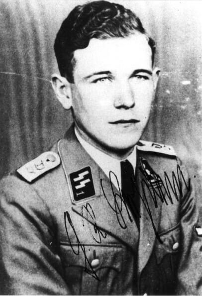

### 1 Front Białoruski

1 Front Białoruski Toruń, Myślibórz!

- Olaf Popkiewicz ["Festung Thorn 1945" [YT 30:47]](https://www.youtube.com/watch?v=1D0wY46a9Bg)

4 Korpus Piechoty Gwardii 8 Armii Gwardii pod dowództwem generała Głazunowa w dniach 1-2 lutego zdobywa przyczółek na zachód od Kostrzyna: Kietz, Manschnow, Rathstock. 2 lutego z ruin fortu k Żabic ich działania obserwuje przez lornetę nożycową dowódca 8 Armii generał Wasilij Czujkow.

### 1 Front Ukraiński

1 Front Ukraiński Szlichtyngowa i Wschowa!

### Warszawa

Definitywny koniec Rzeczpospolitej Lubelskiej, dziś władze nowej, komunistycznej Polski przenoszą się na ruiny Warszawy.

### Bułgaria

Od 1941 Carstwo Bułgarii należy do koalicji hitlerowskiej. Rok później, w lipcu 1942 powstaje Front Ojczyźniany, formalnie koalicja ugrupowań antyfaszystowskich, realnie pod dyktatem komunistów. Szarą eminencją Bułgarskiej Partii Komunistycznej jest Gieorgij Dymitrow, osławiony na procesie lipskim w 1933, potem likwidator KPP i twórca PPR - wierny człowiek Stalina. Od 21 listopada 1946 aż do śmierci w lipcu 1949 jest premierem Bułgarii i sekretarzem generalnym KC BPK.

2 lutego 1945 władze nowej, komunistycznej Bułgarii dokonują dziś egzekucji kilku polityków starej Bułgarii.

- Przede wszystkim jest to Iwan Bagrianow, od czerwca 1944 premier Carstwa Bułgarii. Widząc oczywistą klęskę III Rzeszy, usiłował wyprowadzić kraj z podległości wobec Niemiec, ale tak, żeby nie wpaść w podległość wobec sowietów. Starał się doprowadzić do porozumienia wszystkich sił politycznych w kraju, w tym także Frontu Ojczyźnianego. Rozpoczął negocjacje z aliantami i po dwóch miesiącach sprawowania władzy, 26 sierpnia 1944 ogłosił neutralność Bułgarii, a 1 września podał się do dymisji. Nic to nie dało. Sowieci 5 września wypowiedzieli wojnę Bułgarii, a 9 września Front Ojczyźniany dokonał przewrotu i aresztował wielu polityków w tym także Bagrianowa.
- Dobri Bożiłow Hadżijanakijew poprzedni premier
- Petyr Dimitrow Gabrowski poprzedni premier
- Aleksandyr Radołow działacz chłopski

Wszyscy stanęli przed Trybunałem Ludowym, który na podstawie ustawy z października 1944 miał rozliczyć odpowiedzialnych za udział Bułgarii w wojnie po stronie Hitlera. W Bułgarii represje ze strony komunistów poszły najdalej, zarówno te oficjalne, jak i nieoficjalne. Aresztowano wszystkich ministrów rządów kolaboracyjnych. Ze 160 posłów wyrokiem śmierci lub więzienia zagrożonych było 128.

Na prowincji masowo dokonywano mordów sądowych, których ofiarą padło tysiące ludzi. Ocenia się, że jesienią 1944 mogło to być nawet 30 tys. ludzi. Do więzień kierowano taką masę skazanych, że pod koniec 1944 powstały specjalne obozy pracy. W 1945 represje stały się bardziej sformalizowane, do poł 1945 wydano 2,5 tys. wyroków śmierci.

W 1996 Sąd Najwyższy unieważnił te wyroki i wszystkich pośmiertnie zrehabilitował. Ponadto za podlinkowaną na dole informacją prasową:
>1 lutego obchodzony jest Dzień Pamięci Ofiar Komunizmu. Jest to rocznica skazania na śmierć 147 przedstawicieli przedwojennej bułgarskiej elity politycznej; wyroki te zostały wydane przez komunistyczny tzw. Trybunał ludowy. 
>Trybunał ludowy wydał w sumie 9155 wyroków, w tym 2618 śmierci. Skazano łącznie 10907 przedstawicieli przedwojennych władz Bułgarii, wojskowych, przedsiębiorców, intelektualistów. Stracono m.in. brata cara Borysa III Kiriła Sakskoburggotskiego, regentów niepełnoletniego następcy tronu Symeona, byłego premiera Nikołę Muszanowa i 17 ministrów.

- [Bułgaria: obchody Europejskiego Dnia Pamięci Ofiar Reżimów Totalitarnych](https://dzieje.pl/aktualnosci/bulgaria-obchody-europejskiego-dnia-pamieci-ofiar-rezimow-totalitarnych)
- Powojnie ["Bułgaria po II Wojnie Światowej. Jak komuniści przejęli tam władzę? Zapomniany epizod historii." [YT 17:11]](https://www.youtube.com/watch?v=_vLeLAwXeQw)

### Teresa Maria Bogusławska

Podczas leczenia w Zakopanem zmarła na gruźlicze zapalenie opon mózgowych Teresa Maria Bogusławska. Gruźlicy nabawiła się torturowana przez Gestapo w więzieniu na Pawiaku. 23 lutego 1944 aresztowano ją na ulicy podczas akcji plakatowej. Zwolniono ją w marcu już chorą na gruźlice, która wtedy byłą nieuleczalna.

Bogusławska należała do Szarych Szeregów, brała udział w Powstaniu Warszawskim, rok po jej śmierci ukazał się tomik jej wierszy. Zmarła w wieku 15 lat.

### Ferdinand Schörner

Przybyły do Wrocławia dowódca Grupy Armii Środek generał Ferdinand Schörner wezwał do siebie ciężko chorego Generalmajora Krause i powiadomił go o wyznaczeniu następcy, którym był Hans von Ahlfen. W tej kwestii panuje typowe zamieszanie wynikające z wielości kiepsko udokumentowanych relacji. Sam Hans von Ahlfen pisze, iż awans z pułkownika na Generalmajora otrzymał 30 stycznia, a poinformowany został o tym w drodze służbowej 12 lutego (chodzi o awans generalski?). Dowództwo zaś Twierdzy powierzono mu 31 stycznia w Legnicy, a 1 lutego po południu przyleciał ze Świdnicy. Tymczasem Ernst Horning pisze, że Krause został wezwany "po trzech dniach" choroby, kiedy poczuł się lepiej i wtedy, czyli 3 lutego odebrał rozkaz przekazujący dowództwo von Ahlfenowi, datowany wg niego zresztą właśnie na 3 lutego. W momencie mianowania Ahlfen miał być wciąż pułkownikiem. Majewski pisze, że awans na generała von Ahlfen dostał 9 lutego. Prawdopodobnie większość, jeśli nie wszystkie rozbieżności da się wyjaśnić różnicami obiegu informacji formalnej i nieformalnej. Tak czy inaczej, 1 lutego Hans von Ahlfen sprawował funkcję komendanta Twierdzy. Ponieważ Krause był poważnie chory, nowy komendant złożył tylko krótką, kurtuazyjną wizytę i dlatego nie został wdrożony w obowiązki przez poprzednika.

Możliwe, że nie tylko choroba jest przyczyną zmiany komendanta. Hanke i Schörner uznali, że Twierdza jest już na linii frontu, a generał Krause nie ma doświadczenia bojowego, jest artylerzystą i oficerem, który zawsze był na tyłach. Był wykładowca w szkole artylerii. Von Ahlfen natomiast jako saper i dowódca jednostki zaporowej, do tego należącej do osławionego "wędrującego kotła" idealnie się nadaje do funkcji dowódcy miasta umocnionego. Był co prawda tylko pułkownikiem, ale awans generalski pojawił się automatycznie z powodu rangi powierzonego stanowiska.

W Twierdzy, która już jest pod atakiem, nowy komendant trzy główne zadania, przede wszystkim likwidacja przyczółków nieprzyjaciela: jednego w Radwanicach, drugiego w Piskorzowicach. Trzecim zadaniem jest wzmocnienie północnego odcinka Odry. Skierowano tam najlepsze odziały, wierząc że skoro Armia Czerwona naciera od północnego wschodu, taki też wybierze kierunek ataku. Wystarczy rzut oka na mapę, żeby zobaczyć, że wschód i północ to najgorsze kierunki ataku.

### SS Besslein

Z czerwonoarmistami na przyczółku piskorzowickim walczyła 11 kompania pułku SS Besslein stacjonująca w Leśnicy. Jednym ze 120 żołnierzy tej kompanii jest Hendrik C. Verton, holenderski ochotnik. Od roku we Wrocławiu, przedtem był w Prusach Wschodnich.
>Walka w lesie zawsze jest niebezpieczna, zwłaszcza dla tych, którzy do niego wchodzą i nie wiedzą gdzie jest nieprzyjaciel. Wrzawa ogniowa pochodziła od moździerzy, nieprzerwanego strzelania przez piechotę, nie mówiąc już o świszczących kulach, które uderzały w drzewa i odbite od nich przeszywały powietrze niczym zwiastuny śmierci [...] Widzieliśmy czerwonych uciekających w panice, pozostawiających za sobą amunicję i ekwipunek, łącznie z bardzo staroświeckim karabinem maszynowym na drewnianych kółkach, który był chłodzony wodą. Było wśród nich paru z nałożonymi bagnetami, gotowych do walki wręcz, lecz nadal się cofali, aż do momentu gdy osiągnęli skraj lasu.

*Georg Besslein (1911-93), dowódca pułku Besslein 
Źródło: [Besslein, Georg-Robert - TracesOfWar.com](https://www.tracesofwar.com/persons/35563/Besslein-Georg-Robert.htm)*

Pułk D znany jako pułk Besslein sformowany został z jednostek SS; nazwa jednostki co jest typowe dla tradycji niemieckiej, bierze się od nazwiska dowódcy Obersturmbannfufrera Georga Bessleina, który teraz ma 34 lata i od 12 lat należy do NSDAP. Pułk został sformowany z następujących jednostek:

- 1 zapasowy batalion szkolny artylerii piechoty SS w Leśnicy
- wrocławski zapasowy batalion szkolny grenadierów pancernych SS
- wrocławska szkoła podoficerska SS

### Egzekucje

Codzienność Twierdzy to egzekucje. Żołnierze niemieccy zaczęli zabijac żołnierzy niemieckich zanim zaczęła to robić Armia Czerwona.

>Sąd doraźny Festung Breslau skazał 1.II.45 pewnego porucznika i dowódcę kompani frontowej na śmierć z powodu niezastosowania się do wydanego mu dla jego kompanii rozkazu, który winien był zrealizować wraz z oddziałami Volkssturmu, lecz położył się do łóżka, opóźniając w ten sposób o kilka godzin wypełnienie pilnego zadania. 
>Wyrok został wykonany natychmiast. 
>Festung Breslau 4.II.45"

### Odnośniki

- [Piskorzowice. Wieś, która nie istnieje](http://nieustanne-wedrowanie.pl/niekomercyjny/piskorzowice/)
- [Peiskerwitz — tajemnicze Piskorzowice](https://czasopismo.legeartis.org/2015/05/peiskerwitz-tajemnice-piskorzowic.html)
- Artykuł o SS: [SS](/festung-breslau/article/ss)
