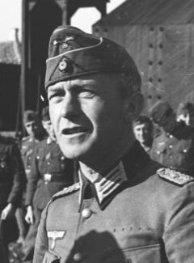

### Słowacja

Korzystając z opanowania sytuacji na Górnym Śląsku, Armia Czerwona przystępuje do operacji na południe od niego. Słowacja jest hitlerowskim państwem marionetkowym, które bierze czynny udział w Holokauście. Jest we władzy kleru katolickiego.

<SeeAlso txt="Słowacja" url="/festung-breslau/article/slowacja" />

Bez wątpienia najważniejszą operacją wojskową na terenie Słowacji było najpierw powstanie narodowe, które wybuchło 29 sierpnia i zaraz potem od 8 września operacja dukielsko-preszowska (bitwa na Przełęczy Dukielskiej). Gdyby wtedy Armia Czerwona dotarła do obszarów zajętych powstaniem, mogłaby zająć całą Słowację przed zimą. Hitlerowskie Niemcy rzuciły wszystkie swoje siły w tym wielonarodowe SS i wojska węgierskie do stłumienia powstania i zatrzymania Armii Czerwonej. Udało się tego dokonać do listopada 1944.

Dziś zaczyna się kolejna ważna operacja wojskowa, której celem jest dokonanie włamania w głąb kraju atakiem pomiędzy Wysokimi Tatrami a Niżnymi Tatrami. W kierunku Liptowskiego Mikułasza naciera I Czechosłowacki Korpus Armijny w składzie 1 Frontu Ukraińskiego. Został sformowany 10 kwietnia 1944, od 11 września dowodzi nim generał Ludvík Svoboda. Jest to 35 tys. żołnierzy, którzy stanowią forpocztę powojennej Czechosłowacji.

### 1 Front Białoruski

1 Front Białoruski zajął dzisiaj Golice, Kowalów, Rzepin, Sulęcin, Myślibórz. Może poza Myśliborzem nie są to jakieś rozpoznawalne miejscowości, ale rzut oka na mapę pozwala zrozumieć, jak ważny jest ten fakt. Bo oznacza, że są już tylko kilka km od Odry na odcinku pomiędzy Kostrzynem i Frankfurtem nad Odrą. Obie twierdze odrzańskie są już w zasięgu sowieckiej artylerii.

Dla Polaków to trzeci dzień boju o przełamanie Wału Pomorskiego, od 1 do 3 lutego 1 DP walczy z 15 DP SS. Poniosła tak ciężkie straty, że skierowano ją do odwodu. Jej miejsce zajęła 6 DP.

### Poznań

Do wieczora 2 lutego sowieci zdobyli rejon Zamku.

### Podgaje

Wojna ujawniła swoje bestialskie oblicze, egzekucja jeńców na polu bitwy stała się normą, wziętych do niewoli mordowano. Zdarzało się to po obu stronach.

W Podgajach na miejscu bitwy Niemcy wymordowali około 160 żołnierzy z 1 DP WP. Taki właśnie charakter ma jedna z bardziej tajemniczych zbrodni wojennych tej wojny.

Po zdobyciu wsi znaleziono ciała 32 żołnierzy z 4. kompanii 3. pułku piechoty 1. Dywizji WP wziętych do niewoli podczas walk o wieś Podgaje. Nie wiadomo kto dokonał tej zbrodni ani w jakich okolicznościach, łotewskie SS czy niemiecki Wehrmacht. Istnieje również możliwość, że już pojmani i uwięzieni stali się przypadkowymi ofiarami ostrzału artyleryjskiego.

- Podcast Wojenne Historie ["Podgaje 1945. Tajemnicza zbrodnia. Co się stało z 4. kompanią?" [YT 25:23]](https://www.youtube.com/watch?v=lQNGa81Kjb8)
- [Zbrodnia w Podgajach. W trakcie walk o przełamanie Wału Pomorskiego, w dniach 31.01 - 02.02.1945 w miejscowości Flederborn (obecnie Podgaje) dokonano zbrodni wojennej na 32 żołnierzach Wojska Polskiego.](https://www.facebook.com/permalink.php?story_fbid=3115929592010874&id=2353805098223331)

### UPA

UPA atakuje w dwóch miejscach w dawnym województwie tarnopolskim:

- wieś Uście Zielone w dawnym powiecie buczackim, została zaatakowana przez UPA po raz kolejny. Był to ważny cel dla UPA, ponieważ powstał tam tzw. Istriebitielny Batalion, czyli nieregularne siły samoobrony w strukturach NKWD, dzięki czemu wieś uważana była za polski azyl. Do dziś. Żołnierzy batalionu nagich wpędzono na Dniestr, strzelano im pod stopy, w końcu utopiono. Wszystkich zabitych przez UPA było 133. Głównie Polacy, ale byli też Ukraińcy, którzy nie chcieli wstąpić do UPA.
- wieś Czerwonogród w dawnym powiecie zaleszczyckim, to również była polska samoobrona sformowana w IB. Jeszcze w styczniu otrzymali ultimatum z żądaniem opuszczenia wsi. W nocy przygotowaną do obrony wieś zaatakowały dwie sotnie. Poza obszarem bronionym zabijali wszystkich domowników. Udało się również zdobyć broniony zamek, ale cywile zostali ewakuowani do kościoła. Nad ranem wycofali się. Zginęło 49-60 Polaków.

### Siergiej Władimirowicz Simanski

Siergiej Władimirowicz Simanski jako Aleksy I został wybrany na patriarchę Moskwy i Wszechrusi. Będzie pełnić tę funkcję przez 25 lat najdłużej w historii tego urzędu.

W 1943 Stalin spotkał się z hierarchami kościoła ortodoksyjnego. Zakończyła się polityka antyreligijna i kościół wsparł Stalina. W tym duchu działał Aleksy, reprezentując sowiety w swoich podróżach zagranicznych i twierdził, że jest to państwo demokratyczne.

Kiedy Chruszczow rozpoczął kurs antykościelny, Simanski zdecydowanie bronił przywilejów i stanu posiadania kościoła.

### Mühlviertler Hasenjagd

"Polowanie na króliki w Mühlviertler". Po buncie w KL Mauthausen-Gusen zbiegło 419 oficerów Armii Czerwonej.

Byli bezwzględnie ścigani przez żołnierzy, działaczy organizacji hitlerowskich (gł. Volkssturm i HJ) oraz miejscową ludność. Trwało to trzy tygodnie. Większość z nich została zamordowana. Ocalało zaledwie 11.

### Berlin

Kolejną ofiarą Hitlera stał się dzisiaj Carl Friedrich Goerdeler, prawnik i wiele lat nadburmistrz Lipska. Odgrywał ważną rolę w spisku przeciwko Hitlerowi, miał być kanclerzem nowego pohitlerowskiego rządu.

Kiedy zamach się nie powiódł, udawało mu się jakiś czas ukrywać. Niestety, kiedy przebywał w rodzinnym Kwidzynie, 12 sierpnia doniosła na niego Helena Schwärzel i został aresztowany. Już 8 września został skazany na śmierć przez niesławny Trybunał Ludowy. Przez wiele miesięcy torturami usiłowano wydostać z niego informacje o pozostałych uczestnikach spisku. W końcu oprawcy zrezygnowali. Dzisiaj Carl Goerdeler został powieszony w więzieniu Plötzensee.

Jego młodszego brata, Fritza, również prawnika i urzędnika miejskiego zabiją za miesiąc.

Schwärzel za donos dostała milion marek. Po wojnie odpowiadała za zbrodnie przeciwko ludzkości. Dostała wyrok 15 lat, potem jej wyrok zmniejszono do sześciu lat. Była pierwszą z 490 skazanych hitlerowskich donosicieli i jedyną osobą skazaną za udział w mordzie sądowym (niem. Justizmord) na Goerdelerze.

Wilfred von Oven attaché prasowy Ministerstwa Propagandy:
>Stalin u bram. Rosjanie sforsowali Odrę. Nacierają na Wriezen w sile 100 czołgów. Między Berlinem a Wriezen nie ma ani dział przeciwpancernych, ani zapór, ani żołnierzy. Ludzie się boją.

### Horten Ho 229

Już od początku lat 30. bracia Horten planowali ulepszyć szybowce, konstruując je w formie latającego skrzydła. Tak się składa, że ponieważ lotnictwo wojskowe było w Niemczech zakazane traktatem wersalskim, wojsko bardzo interesowało się szybowcami, wspierając ruch amatorski. Tak zaczęły się kontakty Hortenów z Reichswehrą.

W 1943 Göring przedstawił projekt "3x1000" - samolotu, który ma udźwig bomb 1000 kg, zasięg 1000 km i prędkość przelotową 1000 km/h. Ten ostatni wymóg wykluczał silniki tłokowe.

Bracia Horten podjęli się realizacji tego pomysłu. Dwusilnikowy odrzutowiec w układzie latającego skrzydła o mieszanej konstrukcji, na stalowym rdzeniu kadłuba skorupa z impregnowanej sklejki. Wyrzucany fotel pilota. Profilowanie zewnętrznych powierzchni i ukrycie metalowej konstrukcji wewnątrz mogło sugerować, że mamy do czynienia z próbą technologii stealth. Istotnie jak wykazały eksperymenty miał on obniżony profil radarowy. Przy ogromnej prędkości prawie 1000 km/h i opóźnieniu wykrycia przez radary bezkarnie mógłby bombardować Anglię.

<SeeAlso txt="Wunderwaffe" url="/festung-breslau/article/wunderwaffe" />

Pierwszy prototyp był wyłącznie szybowcem, Hortenowie mieli problem ze zdobyciem silnika. Jego oblot odbył się 1 marca 1944. W grudniu 1944 zbudowano drugi prototyp już z silnikiem Jumo 004. Goering był zadowolony z samolotu, zamówił 40 egzemplarzy.

Dzisiaj 2 lutego 1945 został oblatany w Oranienburgu. Tak, w tym samym Oranienburgu, w którym znajdował się KL Sachsenhausen. Próby wypadły pomyślnie. Był to pierwszy lot odrzutowego Ho 229.

Niestety Hortenowie byli nieobecni, musieli być na spotkaniu dotyczącym silników Amerikabomber. Tak, z jakiegoś powodu ten projekt był nadal kontynuowany.

Trzeci i ostatni prototyp wpadł w ręce Amerykanów 8 kwietnia w Gotha.

- [Mark Felton Productions "Horten Ho. 229 - Hitler's UFO" [YT 7:01]](https://www.youtube.com/watch?v=QD3JWVSkDuU)

### 1 Front Ukraiński

1 Front Ukraiński odnotowuje poważne zwycięstwo na zapleczu, dziś udało się uruchomić transport kolejowy na odcinku Rozwadów - Czestochowa - Oleśnica. Mimo ogromnego poświęcenia i kolejarzy i czerwonoarmistów jest to za późno, żeby zgromadzić materiały wojenne w wystarczającej ilości do zakładanej daty rozpoczęcia kolejnej ofensywy - 6 lutego. W tej sytuacji sztab decyduje przesunąć termin ataku o dwa dni, na 8 lutego.

### Wrocław

Jest drugi dzień lutego, piątek. Jak pisze poprzedniego dnia Hugo Hartung:
>płyta lotniska przekształca się w jezioro, a nasze stanowisko zmienia się w glinianą dziurę, w której da się ustać tylko na deskach. [...] w krystalicznym powietrzu czuć wiosnę, a wokół nas bulgocze woda z odwilży.

A dziś:
>Do nas jednak docierają przecieki o tym, że położenie jest beznadziejne i że w wielu miejscach nasze wojsko rzuca się do panicznego odwrotu. Przez noc śnieg całkowicie stopniał. Fakt, że od dziś otrzymujemy dodatek frontowy i zaopatrzenie wzbudza w nas podwójną nieufność.

Pojawiają się posiłki wzmacniające garnizon wrocławski, przede wszystkim - przybyłe właśnie 2 kwietnia - 2 kompanie 6. batalionu technicznego pod dowództwem podporucznika dr inż. Schulza. Doskonale wyposażony i wyszkolony batalion ten odegrał później ważną rolę w obronie miasta. Na początku lutego przybywają z poligonu pod Gorzowem (niem. Landsberg an der Warthe) dwa zmotoryzowane plutony Goliatów, każdy składał się z 60 żołnierzy i 48 Goliatów.

### Ewakuacja duchowieństwa

Jak relacjonuje Hornig, w sprawie nakazanej przez SS ewakuacji duchownych Gauleiter Hanke - sam zaznaczając, że nie uważa jej za uzasadnioną - polecił kontaktowi Kapituły Katedralnej skontaktować się z gestapo.

Przedstawiciele kościołów rzymskokatolickiego i ewangelicko-augsburskiego działali w porozumieniu, 1 lutego poinformowali o sytuacji duchownych z gminy ewangelicko-reformowanej (mającej siedzibę w wówczas Hofkirche, czyli Kościele Dworskim, obecnie jest to ewangelicko-augsburski Kościół Opatrzności Bożej przy ul. Kazimierza Wielkiego). Ewakuacji były przeciwne wszystkie trzy konfesje.

Gestapo zadecydowało, że pozostać może 1/3 duchownych, prawdopodobnie oceniając, iż tylu wrocławian pozostało w mieście. Jak się okazało, część duchownych samowolnie opuściła Wrocław, a część była zdecydowana pozostać i pozostała nie mając pozwolenia. Oficjalna zgoda gestapo obejmowała 8 duchownych kościoła ewangelicko-augsburskiego i 35 rzymskokatolickiego. Pozostać mieli ochotnicy.

Hornig nie komentuje faktu, tylko stwierdza, że wszyscy będący wówczas w mieście duchowni luterańscy należeli do Kościoła Wyznającego. Gdzieś w zamęcie Wielkiej Ucieczki zniknęli z Wrocławia hitlerowscy Niemieccy Chrześcijanie.

### Podział koscioła

Na pewno kiedyś będzie warto napisać na ten temat więcej, bo historia chrześcijaństwa w czasach hitlerowskiej dyktatury jest z powodu samej natury tych systemów interesująca. Ale na potrzeby tego wpisu musi wystarczyć takie wyjaśnienie: dominujący w Niemczech, a szczególnie w Niemczech północnych i na Śląsku kościół ewangelicko-augsburski (popularnie nazywany luterańskim) był w tym czasie podzielony nieoficjalnie, aczkolwiek wyraźnie na trzy mniej więcej równie liczne części:

- Część neutralna, nieangażująca się po żadnej ze stron.
- **Niemieccy Chrześcijanie** (niem. Deutsche Christen) prohitlerowski, antysemicki odłam chrześcijaństwa, na początku dyktatury byli uzytecznym narzędziem w rękach Hitlera, ale ponieważ nie udało się przy ich pomocy zupełnie zdominować organizacji niemieckiego kościoła pozostali po prostu wspieraną przez NSDAP częścią tego kościoła - ich symbolem był krzyż ze swastyką w centrum.
- **Bekennende Kirche** (pl. Kościół Wyznający) opozycja wobec reżimu, przybierająca rozmaite formy, czasem zorganizowana; wśród najbardziej prominentnych postaci tego ruchu są również w Polsce rozpoznawalni ks. Martin Niemöller i ks. Dietrich Bonhoeffer. Należą do niego także wszyscy luterańscy księża wspomniani na tym blogu.

<BoxImageWrapper>

Hans von Ahlfen (1897-1966) 
Źródło: Wikipedia By [Bundesarchiv_B_145_Bild-F016218-0032A,_Krim,_Panzerzug,_Besichtigung_Hans_v._Ahlfen.jpg](https://commons.wikimedia.org/wiki/File:Bundesarchiv_B_145_Bild-F016218-0032A,_Krim,_Panzerzug,_Besichtigung_Hans_v._Ahlfen.jpg): nieznany derivative work: [Memnon335bc](https://commons.wikimedia.org/wiki/User:Memnon335bc) ([talk](https://commons.wikimedia.org/wiki/User_talk:Memnon335bc)) - [Bundesarchiv_B_145_Bild-F016218-0032A,_Krim,_Panzerzug,_Besichtigung_Hans_v._Ahlfen.jpg](https://commons.wikimedia.org/wiki/File:Bundesarchiv_B_145_Bild-F016218-0032A,_Krim,_Panzerzug,_Besichtigung_Hans_v._Ahlfen.jpg), [CC BY-SA 3.0 de](https://creativecommons.org/licenses/by-sa/3.0/de/deed.en), [Link](https://commons.wikimedia.org/w/index.php?curid=10194916)
</BoxImageWrapper>

### Hans von Ahlfen

Świeżo wyznaczony dowódca Twierdzy, pułkownik Hans von Ahlfen, urodzony w Berlinie, wstąpił do wojska w wieku 17 lat, niecały miesiąc po wybuchu Wielkiej Wojny. Służył w wojskach inżynieryjnych (niem. Pioniertruppe), najpierw w batalionie inżynieryjnym, później w sztabie, a pod koniec Wielkiej Wojny w pociągach pancernych.

W okresie międzywojennym służy w Reichswerze.

Kiedy powstaje Wehrmacht, zostaje instruktorem w Akademii Wojskowej (niem. Kriegsakademie). W 1937 wydaje podręcznik dla wojsk inżynieryjnych. Podczas WWII służy na froncie, jest najpierw dowódcą batalionu, później pułku, 1 lutego 1942 zostaje awansowany na pułkownika; Grupa Armii Don, Norwegia, podczas Operacji Bagration jest szefem służb inżynieryjnych 9. Armii, w październiku zostaje przeniesiony do rezerwy Führera, ale już w listopadzie wraca do służby.

W styczniu 1945 jest dowódcą oddziału zaporowego 4. Armii Pancernej. Oddział ten był częścią słynnego tzw. "wędrującego kotła". I jest to jedna z przyczyn, dla których opowieść o "wędrującym kotle" Nehringa jest tak emocjonalna.

### Pioniertruppe

Warto tutaj wyjaśnić kwestie terminologiczne. Otóż w polskiej nomenklaturze saperzy i wojska inżynieryjne to prawie to samo. Prawie, bo ściśle rzecz biorąc saperzy to żołnierze zajmujący się ładunkami wybuchowymi - głównie wysadzanie w powietrze, minowanie i rozminowanie. Wojska inżynieryjne to obszerniejsza dziedzina obejmująca również przeprawy, kolejnictwo (także pociągi pancerne), budowę (np. umocnień), maskowanie, oczyszczanie wody, w zasadzie wszystkie techniczne zagadnienia leżące poza zasięgiem poszczególnych pododdziałów. Nie są saperami sensu stricto, ale na pewno nie obrażą się na takie miano.

<SeeAlso txt="Armia niemiecka 1918-45" url="/festung-breslau/article/armia-niemiecka" />

Tego typu pododdziały różnych specjalności istniały od starożytności, ale we współcześnie znanej formule saperzy jako wojska znajdujące się na końcu lub początku maszerującej armii, których głównym zadaniem jest likwidacja przeszkód dla własnej armii i tworzenie ich dla nieprzyjaciela - to Wielka Armia Napoleona. Ich głównym atrybutem były topory, służące do demontażu przeszkód polowych w czasie walki. Tradycję tę kontynuowała Legia Cudzoziemska, której Pionniers de la Légion étrangère są w całej armii francuskiej chyba najbardziej otoczonym szacunkiem oddziałem. Na defiladach zawsze się wyróżniają z powodu umundurowania, które z dzisiejszego punktu widzenia wygląda dość egzotycznie: skórzany fartuch na białym mundurze, obowiązkowe brody i niesione na ramionach toporów. Zresztą Legia z powodu powolnego marszu zawsze idzie na końcu parad.

W tradycji niemieckiej wojska pionierskie (niem. Pioniertruppe) powstały również na początku XIX wieku z połączenia jednostek górniczych (podkopy i detonacje) i pontonowych. Używano tej samej nazwy co w nomenklaturze francuskiej i jak widać, odpowiada ona szerszemu znaczeniu, tzn. chodzi tu o wojska inżynieryjne.

W Wehrmachcie pionierzy (niem. Pioniere) w sile batalionu wchodzili w skład każdej dywizji. W języku polskim słowo pionier jest przestarzałe i już się go nie używa, ale można mówić np. niemieckim batalionie inżynieryjnym batalion pionierów (niem. das Pionier-Bataillon).

### Odnośniki

- [Mord jeńców wojenny w Podgajach + fragmenty pamiętników...](http://www.dws-xip.pl/LWP/spisB2.html)
- [Tajemnica mordu w Podgajach. Jedna z największych polskich zagadek II wojny światowej](https://superhistoria.pl/druga-wojna-swiatowa/100018/1/tajemnica-mordu-w-podgajach-jedna-z-najwiekszych-polskich-zagadek-ii-wojny-swiatowej.html)
