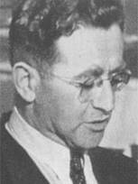

### Jałta

Pierwszy dzień Konferencji Jałtańskiej. Było to, po Teheranie w 1943, drugie spotkanie Wielkiej Trójki: Roosevelta, Churchilla i Stalina. Odbyło się z inicjatywy Roosevelta, który początkowo nalegał, żeby zorganizować je w 1944 przed wyborami prezydenckimi, ale kiedy je wygrał, nalegał już, tylko by odbyło się w jakimś neutralnym miejscu. Jeżeli teren państwa sowieckiego był neutralnym, to życzeniu prezydenta USA stało się zadość - miejscem tej konferencji była Jałta na Krymie.

Z sowieckiego punktu widzenia nadawała się na miejsce takiego spotkania, bo znajdowała się na bezpiecznym zapleczu, no i było tam ciepło. A przede wszystkim na miejscu było mnóstwo pocarskiego bogactwa, pałacyki, wille, wszystko pięknie wyposażone, a w piwnicach wino pamiętające Romanowów, którym można było poczęstować Churchilla.

Jednym z kilku ważniejszych tematów były sprawy polskie i los powojennych Niemiec. Co do Polski ustalono, że utracą ziemie na wschodzie i jako rekompensatę dostaną późniejsze tzw. Ziemie Odzyskane.

W Polsce nikt wówczas nie myślał o nich w tych kategoriach, bardzo długo opozycja demokratyczna w ogóle nie chciała słyszeć o przejęciu ziem wschodnich Niemiec właśnie dlatego, że oznaczałoby to akceptację strat na wschodzie. To jednak już było przesądzone. Ponadto alianci zachodni przekazali sowietom zwierzchnictwo nad przyszłą Polską i zaakceptowali powstanie w Warszawie Tymczasowego Rządu Jedności Narodowej, warunkując to wolnymi wyborami, które mają się odbyć, tak szybko, jak to jest możliwe.

Ponadto ustalono podział Niemiec na cztery strefy okupacyjne. Już wcześniej 12 września 1944 w Lancaster House (Londyn) na spotkaniu UK - USA - CCCP zawarto ogólne porozumienie w tej kwestii - tzw. Protokół Londyński. Podział dotyczył Niemiec w granicach z 31 grudnia 1937 oraz osobno Berlina w granicach z 27 kwietnia 1920 (Wielki Berlin).

Stalin obiecał wysłanie Armii Czerwonej na wojnę z Japonią najpóźniej w trzy miesiące po zakończeniu wojny w Europie.

### Bombardowanie Kobe

Po zdobyciu Marianów Amerykanie od jesieni 1944 mogą bombardować Wyspy Japońskie.

W lutym i marcu trwa kampania bombardowań japońskich miast mającej na celu osłabienie zdolności do prowadzenia wojny. Najbardziej znane jest oczywiście bombardowanie Tokio 9-10 marca, które zabiło 100 tys. ludzi. Było to najbardziej mordercze w skutkach bombardowanie w dziejach ludzkości.

Ogromna liczba ofiar tych bombardowań wynika ze specyfiki japońskiego budownictwa. Zabudowa większości japońskich miast była drewniana, a Amerykanie używali bomb zapalających. Kiedy obrzucili duży obszar bombami, wszyscy na tym terenie byli w pułapce, otoczeni zewsząd pożarami nie mieli dokąd uciec.

Kampania ta zaczyna się dziś od bombardowania Kobe.

<SeeAlso txt="Wojna na Pacyfiku 1945" url="/festung-breslau/article/pacyfik-1945" />

### Jerzy Borejsza

Jeszcze w okresie Rzeczpospolitej Lubelskiej powstała znana nam wszystkim Spółdzielnia Wydawnicza "Czytelnik". Wydawnictwo to i wszystkie jego flagowe pisma było to dzieło Jerzego Borejszy, człowieka ogromnej aktywności, który - cytując Miłosza:
>z niczego zbudował, poczynając od 1945 roku, swoje państwo książki i prasy. "Czytelnik" i inne domy wydawnicze, gazety, tygodniki, wszystko od niego zależało – posady, przyjęcie książek do druku, honoraria. Byłem w jego stajni, wszyscyśmy byli.

Pierwszym pismem była "Rzeczpospolita", której pierwszy numer ukazał się jeszcze w Chełmie 23 lipca 1944. Był to organ prasowy PKWN, jego nazwa nawiązywała do pisma istniejącego w okresie międzywojennym. Również w 1944, ale już w Lublinie zaczęło się ukazywać pismo społeczno-kulturalne "Odrodzenie". 15 października 1944 w Lublinie ukazał się pierwszy numer "Życia Warszawy".

- Dziś do grona tych polskich gazet dołączył "Dziennik Polski".
- Już 15 kwietnia ukaże się pierwszy numer "Przekroju".
- W sierpniu w Krakowie "Twórczość" najstarsze polskie pismo literackie (od 1950 w Warszawie).
- Również w 1945 zacznie się ukazywać społeczno-kulturalna "Kuźnica", później w 1950 z połączenia Kuźnicy i Odrodzenia powstanie "Nowa kultura".
- "Problemy" pismo popularnonaukowe publikujące w latach 80 fantastykę naukową: 1945-1993.
- "Przyjaciółka" od 21 marca 1948.

<BoxImageWrapper>

Jerzy Borejsza (1905-52) 
Źródło: Wikipedia [Fair use](https://en.wikipedia.org/wiki/File:Jerzy_Borejsza_Goldberg.jpg), [Link](https://en.wikipedia.org/w/index.php?curid=29620840)
</BoxImageWrapper>

Borejsza był organizatorem Światowego Kongresu Intelektualistów w Obronie Pokoju, który odbył się we Wrocławiu w dniach 25–28 sierpnia 1948, potem zaczął być źle widziany w Moskwie.

### 3 Front Białoruski

Trwa intensywne natarcie w Prusach Wschodnich. Podstawowy cel to izolacja sił niemieckich, odcięcie drogi ucieczki. To już zostało osiągnięte 25 i 26 stycznia z zajęciem Tolkmicka przez 2 Front Białoruski, a więc dotarciem do Zalewu Wiślanego. Niemcom pozostaje tylko wąski pas Mierzei Wiślanej i droga morska.

Drugim celem jest rozczłonkowanie terenu zajętego wciąż przez Niemców, rozbicie ich na grupy niemające ze sobą łączności.

Wojska 3 Frontu Białoruskiego są już 30 km na północ od Olsztyna i nacierają w kierunku Królewca. 31 stycznia zdobywają Bisztynek. 4 lutego natomiast Bartoszyce (niem. Bartenstein) oraz Górowo Iławieckie (niem. Landsberg). Również w tym okresie (nie mam daty dziennej) zdobywają Sępopol (niem. Schippenbeil).

Wojna odciska na tych miejscowościach i całym regionie to samo piętno: ludność wymordowana, kobiety zgwałcone, ocalonych wypędzono po wojnie, zniszczenia materialne 40 do 75%. W pobliżu każdej z tych miejscowości była jakaś filia obozu koncentracyjnego lub jenieckiego, i już po wojnie odkryto ślady ludobójstwa. Miejscową ludność zastąpili polscy, a później także ukraińscy osadnicy. Mazury były jednym z celów przesiedleńczych Akcji Wisła.

Warto wspomnieć dwie z tych miejscowości:

- Bartoszyce, 26 kwietnia 1807 podpisano tu układ bartoszycki (niem. [Bartensteiner Vertrag](https://de.wikipedia.org/wiki/Bartensteiner_Vertrag)), porozumienie pomiędzy królem pruskim Fryderykiem Wilhelmem III i carem Aleksandrem I przeciwko Napoleonowi. Mianowany w 1914 głównodowodzącym w Prusach Wschodnich marszałem Paul von Hindenburg właśnie w Bartoszycach umieścił swoją kwaterę główną. [Bartenstein (Bartoszyce) in Ermland-Masuren, Polen](https://www.polish-online.com/polen-ermland-masuren/bartenstein-bartoszyce.php) [Lötzen, Ostpr. - Bahnhofstrasse mit Hindenburg-Ludendorff-Haus](https://wmbc.olsztyn.pl/dlibra/publication/815/edition/778/content)
- Sępopol w 1941 powstaje tam lotnisko wojskowe związane z Wilczym Szańcem w Gierłoży, rozbudowane w 1944, powstaje wtedy filia KL Stutthof - Stutthof Schippenbeil; ok. 2 tys. ludzi, w 90% są to Żydówki z Węgier i Grecji, w ciągu roku istnienia 400 zabitych, SS wypędziła osadzone podczas styczniowych marszów śmierci, część rozstrzelano nad Zalewem Wiślanym, resztę w Palmnicken.

Już po wojnie na terenie siedziby SS przy ul. Mostowej odkryto zbiorowy grób kilkunastu osób. W 2009 postawiono obelisk z napisem:
>Umarłych wieczność dotąd trwa, dokąd pamięcią się im płaci 
>Pamięci ofiar nazizmu - więźniów podobozu Schippenbeil KL Stutthof ( 1939-1945) 
>odsłonięto 21 września 2009 r. 
>Społeczeństwo Sępopola

III Front Białoruski dociera również do Mierzei Kurońskiej, na jej północnym końcu jest Kłajpeda (niem. Memel), w samym środku miasto turystyczne Nida (niem. Nidden). Teren ten został pod koniec XIX wieku odkryty przez artystów Kunstakademie Königsberg, powstaje tam kolonia artystyczna Künstlerkolonie Nidden. Nida staje się modna i nawet po tym jak w Traktacie Wersalskim cała mierzeja przypada Litwie, Nida pozostaje etnicznie niemieckim miastem. W 1929 odwiedza je Thomas Mann i decyduje się kupić tam letnią chatę, jest to mały domek kryty strzechą, pisze tam część powieści "Joseph und seine Brüder". Ostatni raz jest tam w 1932, rok później musiał opuścić Niemcy. W 1939 chatę przejmuje Hermann Göring i przeznacza ja na miejsce wypoczynkowe oficerów Luftwaffe.

Mierzeję Kurońską zamieszkiwali Kuronowie pruscy, mówiący własną odmianą języka łotewskiego. Było to podstawą roszczeń Łotwy do Mierzei i Kłajpedy i wynikły z tego spory pomiędzy Litwą i Łotwą. Kuronów nikt o zdanie nie pytał, tym bardziej że byli mocno zgermanizowani, np. używali niemieckich imion. Ten niewielki naród jeszcze raz stał się przedmiotem historii w 1945, kiedy jako mówiący w niezrozumiałym języku i mający niemieckie imiona zostali zmasakrowani przez Armię Czerwoną. Tak samo, jak Niemcy ci, którzy przeżyli, zostali wypędzeni. Powojenna litewska republika sowiecka nie ułatwiała powrotu tym, którzy zdołali uciec. W 1955 odnotowano ich tylko 219.

### Dolny Śląsk

W okolicach Ścinawy, we wsi Mleczno (niem. Mlitsch) 126 Pułk Pancerny 17 Brygady Zmechanizowanej Gwardii napotkał dwie Pantery, straty własne 6 czołgów zniszczonych, 4 uszkodzone. Zginał dowódca pułku major Iwan Tkaczuk. Pantery zostały zniszczone. [„Pantery” przeciwko T-34 -„Czarny dzień” 126 Pułku Pancernego - Mleczno](https://www.facebook.com/bobr1945/posts/2780203608759951)

Pierwszy atak na Głogów. 25 Korpus Pancerny ponosi poważne straty: 16 czołgów T-34 oraz 2 działa samobieżne SU-76. [Z walk 25 Korpusu Pancernego – północne przedpola Festung Glogau.](https://www.facebook.com/bobr1945/posts/3380272208753085)

### Brzeg Dolny

Brawurowa akcja oddziału pod dowództwem generała Sachsenheimera na skład gazu bojowego - tabunu - w fabryce chemicznej Anorgana w Brzegu Dolnym (niem. Dyhernfurth). Tabun to był wtedy dopiero co odkryty gaz bojowy, otrzymany przypadkiem w IG Farben w 1936. Szybko odkryto jego właściwości, atakuje układ nerwowy, maska pgaz nie chroni przed nim.

W 1941 za pół miliarda marek IG Farben wybudował fabrykę śmierci w Brzegu Dolnym - Anorgana G.m.b.H. W 1942 rozpoczęto tam produkcję tabunu i sarinu. Zatrudniono do niewolniczej i niebezpiecznej pracy ponad 3 tys. więźniów KL Groß-Rosen. Większość z nich wymordowano podczas pospiesznej "ewakuacji". Wycofując się, Niemcy pozostawili dokumentację i ogromne składy broni chemicznej. Wszystko to nietknięte 26 stycznia zostało zdobyte przez Armię Czerwoną. Ale sowieci początkowo nie zdawali sobie sprawy z tego, co się tam znajduje. Dopiero 31 stycznia skierowali tam pluton strażniczy.

Na wieść o tym, że fabryka gazów bojowych dostała się w ręce nieprzyjaciela, Hitler wściekły zażądał jej zniszczenia. Obawiał się użycia tabunu przeciwko Niemcom.

Niewielki oddział generała Sachsenheimera otrzymał zadanie wykonania Operacji Brunhilda zniszczenia składu gazów bojowych i samej fabryki. To pierwsze zadanie dzięki słabemu sowieckiemu oporowi udało się zrealizować szybko i z niewielkimi stratami. Całość po prostu spuszczono do Odry, co wg zapewnień chemików było bezpieczne, gazy te bowiem w wodzie ulegają rozkładowi. Kilku żołnierzy zostało poparzonych oparami i na jakiś czas stracili wzrok. Grupa saperów zmierzająca w stronę fabryki została rozproszona i zadanie wysadzenia instalacji nie zostało wykonane. Niemniej jednak Grupa Armii Środek w meldunku dziennym z 5 lutego 1945:
>Dobrze przygotowana przez grupę Sachsenheimer operacja Brunhilda całkowicie zaskoczyła nieprzyjaciela i została pomyślnie przeprowadzona

W rezultacie operacji sowieci zorientowali się, jak ważną fabrykę zajęli. 8 lutego do kombinatu wkroczyła specjalna komisja, i już następnego dnia odnaleźli dokumentację produkcyjną. Sarin już znali, ale tabun był dla nich nowością. Już w marcu pułkownik K. A. Pietrow na jej podstawie zdołał wytworzyć tabun. 6 marca zapadła decyzja o wywózce całego wyposażenia kombinatu do Zakładu Chemicznego nr 91 w Stalingradzie.

- ["„Operacja Brunhilda”. Dlaczego Niemcy MUSIELI odbić Brzeg Dolny?"](https://twojahistoria.pl/2021/01/22/operacja-brunhilda-dlaczego-niemcy-musieli-odbic-brzeg-dolny/)
- [Z naszego archiwum RAJD GENERAŁA MAXA SACHSENHEIMERA Uderzenie na Brzeg Dolny (Dyhernfurth) - jedna z najbardziej tajemniczych akcji w 1945 roku.](https://www.facebook.com/bobr1945/posts/4725280454252247)

### Brzeg

Jednoczesne uderzenie na dwóch przyczółkach w pobliżu Brzegu 5 Armii Gwardii i 21 Armii zakończone już pierwszego dnia zamknięciem Brzegu w oblężeniu. Broni się tam 3 tys. żołnierzy niemieckich. Połączenie przyczółków utworzyło jeden duży o szerokości 80 i głębokości 27 km.

Brzeg ze względu na położenie, mosty, koszary i lotnisko ma ogromne znaczenie w procesie okrążania Twierdzy Wrocław.

### Wrocław

Hartung:
>Jest niedziela i panuje cisza po tym, jak nocą znów szalało piekło. Nasze nędzne baraki trzęsły się tak, że o mało co nie pozrzucało nas z łóżek. [...] zauważamy pierwsze kwitnące bazie.

Wrocław stał się już miastem frontowym, od dawna jego mieszkańcy nasłuchują coraz silniejszego i coraz bardziej wyraźnego ognia ze wschodu i północy. Największe przerażenie wzbudzają wyrzutnie rakiet przez Niemców nazwane "Organami Stalina" (niem. Stalinorgel; znane nam jako katiusze).

Może trzeba będzie zrobić jakiś przewodnik po rzeczywistości Twierdzy. Niby wszyscy wiedzą, co to jest kukuruźnik, czy katiusza. Ale...

### Antifaschistische Freiheitsbewegung

Antyfaszystowski Ruch Wolności sformowany przez działaczy KPD (H. Hartmann, F, Schar, K. Launer, G. Ulbrich i E. Waschlewski) miał tajną siedzibę na ul. Michała Wrocławczyka 16/18 (wówczas Paulstrasse).

Drukowali ulotki, a w lutym zaczęli wydawać własną gazetę "Der Freiheits-Kampfer". Informowali w niej o wydarzeniach na froncie i nawoływali do oporu.

Ulotka z początku lutego: 
>Obywatele wrocławscy 
> 
>Jeszcze kilka godzin i nazistowska tyrania dobiegnie końca. Pokażcie, że rozpoznaliście oszustwo. Gdy naziści zechcą was ponownie wysłać na ulicę, wyrzućcie ich. Zerwijcie im symbole ciemiężenia. Powiedzcie żołnierzom: 
>Połóżcie kres wojnie. Niech żyją Wolne, Niezawisłe Niemcy! 
> 
>Podać dalej. 

### Odnośniki

- All the World's Rotorcraft [Flettner Fl 282 "Kolibri"](http://www.aviastar.org/helicopters_eng/flettner_kolibri.php)
- [Kolibry nad Świdnicą](http://historia-swidnica.pl/kolibry-nad-swidnica/)
- [Vertical Rewind: Spoils of War](https://verticalmag.com/features/verticalrewindspoilsofwar/)
- [Full text of "Odra 5 1961"](https://archive.org/stream/Odra351961/Odra%203%205%201961_djvu.txt)