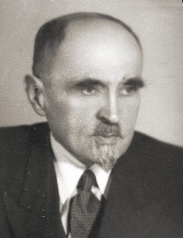

### Kraków

Alfred Fiderkiewicz został prezydentem Krakowa.

Urodził się na terenie obecnej Ukrainy, w rejonie Kołomyi. Jego rodzice wyemigrowali do USA, tam pracował jako robotnik, potem poszedł na studia i w 1914 został lekarzem. Zaangażował się w działalność socjalistyczną i po powrocie do Polski był w kilku partiach lewicowych, ostatecznie trafił do KPP, za co w 1927 trafił do Pawiaka. Kiedy wyszedł na wolność, pojechał na dwa miesiące do CCCP. Po powrocie jako agent sowiecki skierowany do kontaktów i działalności w socjaldemokracji. Był lekarzem w Milanówku, jego dom był miejscem spotkań agentury, był w elicie PPR. W latach 1943-45 więzień KL Auschwitz.

Był działaczem "rzucanym na odcinek", bez jakiejś konkretnej specjalizacji. Od 5 lutego do 14 czerwca 1945 był prezydentem Krakowa - miasta, z którym nie był związany. Od 3 maja 1945 poseł PPR w KRN. Potem do 1949 na placówkach dyplomatycznych w Londynie, Budapeszcie i Montrealu. Od 1948 czyli do samego początku członek PZPR i z ramienia partii przewodniczący Związku Zawodowego Pracowników Służby Zdrowia. O swoim życiu napisał kilka książek. Zmarł w 1971 i został pochowany na Powązkach.

Jego następca na stanowisku prezydenta Krakowa - Stefan Wolas, był z zawodu drukarzem, prawie całe życie do 1945 związany z Krakowem. Z komunizmem zetknął się podczas niewoli w sowietach. Do Polski wrócił w 1922 i został działaczem PPS, podczas WWII wstąpił do PPR. Prezydentem Krakowa był do 6 października 1947. Ze stanowiska zrezygnował z powodów zdrowotnych.

### UPA

W Baryszu koło Tarnopola (wówczas Barysz to było miasto) UPA dokonało kolejnego ataku. Lokalny oddział samoobrony został poważnie uszczuplony w 1944 przez pobór do wojska, do tego w przeddzień masakry większość oddziału wezwano do Buczacza. Na miejscu zostało tylko 10 żołnierzy. Zamordowano 135 ludzi.

W ciągu kilku następnych dni pochowano pomordowanych, Polacy przenieśli się do Buczacza, gdzie oczekiwali na repatriację. Pamięć o zbrodni kultywowana jest w Smardzowie k Siechnic).

### Otto Warpechowski

Pijany sowiecki oficer podczas awantury zastrzelił dzisiaj 28-letniego Otto Warpechowskiego. Otto to Polak urodzony w Rumunii, syn agronoma, który tam wyemigrował. W 1924 wrócili do Polski i zamieszkali w mazowieckim. Lokalny i bardzo zaangażowany pasjonat archeologii, przeprowadził wiele badań, przed wybuchem wojny nawet zaczął studia archeologiczne.

Uratował zamek w Liwie przed rozbiórką, hitlerowcy planowali rozebrać go i cegieł tych użyć do budowy obozu zagłady w Treblince. Otto przekonał starostę powiatu SS-mana Ernsta Gramssa, że jest to zamek krzyżacki. Niemcy dali się nabrać do tego stopnia, że nawet przystąpili do odbudowy zamku, a informacja o krzyżackim pochodzeniu zamku znalazła się w Baedekerze z 1943.

Współpracował z AK, jesienią 1944 wstąpił do 2 Armii WP. Dosłużył się stopnia kaprala w 8. Pułku Moździerzy. Oficer, który go zastrzelił był jego dowódcą.

- [Otto Warpechowski](https://pl.wikipedia.org/wiki/Otto_Warpechowski)

### Georges Kars

Georges Kars znany głównie z pejzaży i aktów czeski malarz pochodzenia żydowskiego zabił się dzisiaj, wyskakując z okna hotelu w Genewie. Od 1942 przebywał w bezpiecznej Szwajcarii, a teraz jechał z powrotem do wyzwolonego Paryża. Przyczyną samobójstwa prawdopodobnie była depresja spowodowana wiadomością o śmierci rodziny, doświadczeniami wojennymi i represjami. Jeszcze przed wyjazdem malował smutne dzieci, w Szwajcarii głównym tematem byli uchodźcy szukający ratunku. Wojna zabijała nie tylko odłamkami.

### Franciszek Szanior

Śmierć Franciszka Szaniora, jednego z najbardziej znanych polskich ogrodników (Ogród Saski, założył Park Ujazdowski) natomiast była zupełnie naturalna. Miał 92 lata.

### Colditz

Do najsłynniejszego zamku - obozu jenieckiego, przeznaczonego dla najważniejszych i najtrudniejszych (ucieczki) jeńców przywieziono generała Tadeusza Bora-Komorowskiego z innymi polskimi oficerami. Jest to dowódca Armii Krajowej odpowiedzialny za wybuch Powstania Warszawskiego.

Przebywał tam do 12 kwietnia. W nocy z 12 na 13 kwietnia przewieziono go do Twierdzy Königstein (Saksonia), potem jeszcze w kwietniu do trzech innych obozów, w końcu kwietnia 1945 został zwolniony przez Niemców ze Stalagu XVIIIC w Markt Pongau k. Salzburga i w okolicach Innsbrucku spotkał 103 DP amerykańską. Od maja 1945 w Londynie gdzie do listopada 1946 pełnił funkcję Naczelnego Wodza i do 1949 inne funkcje w rządzie na emigracji. Do Polski nigdy nie wrócił, pracował jako tapicer, zmarł w 1962.

### Jałta

Drugi dzień Konferencji Jałtańskiej.

### Lubin

Dramatyczna walka w Składkowicach (niem. Ziebendorf, 5km na NE od Lubina) [Epizod ze Składowic ( Ziebendorf) – moździerzyści w walce](https://www.facebook.com/bobr1945/posts/3424116324368673)

### Uniwersytet Wrocławski

Od 1944 Wydziałem Szkół Wyższych w PKWN kierował prof. Henryk Raabe, dziś wysłał list do ministra oświaty, w którym proponuje założenie we Wrocławiu uniwersytetu i politechniki przez połączenie dorobku materialnego uczelni niemieckich i wysłaniu do Wrocławia polskich uczonych z innych ośrodków. Uniwersytet Wrocławski zaczyna powstawać po raz trzeci.

Co też warto zauważyć, jest to pierwsza oficjalna wzmianka wskazująca, że rząd warszawski jako oczywistość traktuje Wrocław w granicach przyszłej Polski. To już jest przesądzone. Taka jest decyzja Stalina, rzeczywistość w Polsce dyktują nie międzynarodowe konferencje, ale Fronty marszałków Koniewa i Żukowa, a oni zrobią to, co im Stalin każe. Polska ma być po Odrę i Nysę (Łużycką) i będzie. Tak samo, jak terytorialne zyski, tak samo będą dyktowane straty Polski. Zresztą o tych stratach również Raabe pisze wprost, proponując wysłanie uczonych z innych ośrodków. Polska kadra uniwersytecka poniosła takie straty, że da się to zrealizować tylko przy założeniu likwidacji ośrodków w Wilnie i Lwowie.

We Wrocławiu wciąż się zastanawiają czy dojdzie do oblężenia, w Warszawie już mają plany co zrobić z "dorobkiem materialnym uczelni niemieckich".

Henryk Raabe to z urodzenia warszawiak, z zawodu zoolog po UJ i pracownik uniwersytetu. Od 1902 (pierwszy rok studiów) w SDKPiL, od 1926 w PPS, i przez całe lata 30, z wyjątkiem 1937, radny Warszawy z ramienia PPS. W latach 1939-41 w warunkach okupacji sowieckiej profesor zoologii uniwersytetu lwowskiego.

Już w de facto powojennej sytuacji organizował i od 24 października 1944 do 1 września 1948 był pierwszym rektorem Uniwersytetu Marii Curie-Skłodowskiej w Lublinie. Został usunięty za upieranie się przy autonomii szkolnictwa wyższego. W latach 1945-46 ambasador Polski w CCCP. Działacz PPS, potem PZPR i przez kilka lat poseł. Zmarł w 1951.

Co interesujące był działaczem Komitetu Słowiańskiego w Polsce. Ta mało znana obecnie organizacja była po prostu polskim oddziałem Komitetu Wszechsłowiańskiego (pierwotna nazwa Wszechsłowiański Komitet Antyfaszystowski) powstałego - znacząca data! - w sierpniu 1941, czyli natychmiast po inwazji hitlerowskiej na sowiety. We władzach byli Aleksiej Tołstoj, Dmitrij Szostakowicz i Wanda Wasilewska. Organizacja ta miała być ideologicznym narzędziem jednoczenia wszystkich narodów słowiańskich początkowo do walki z hitlerowskimi Niemcami, potem po prostu kolejnym wcieleniem panslawizmu przekutym na potrzeby Kremla. W Polsce centrum tego ruchu był Kraków. W Polsce zakończył działalność w sierpniu 1953. Za naszą wschodnią granicą działa cały czas. Działaczem kolejnej mutacji tego ruchu był np. niejaki Tejkowski.

We wrześniu 1947 w Szklarskiej Porębie miało miejsce spotkanie przywódców 9 partii komunistycznych, na którym omawiano m.in. działalność tej organizacji. Władysław Gomułka mówił tam, że podstawą polskiej polityki jest sojusz z CCCP, a na drugim miejscu solidarność słowiańska.

*Henryk Raabe (1882-1951) 
Źródło: Wikipedia By unknown-anonymous - "Robotnik" 1946, Domena publiczna, [Link](https://commons.wikimedia.org/w/index.php?curid=58938477)*

### Wrocław

Tymczasem we Wrocławiu - ogłoszenie wyroku sądowego.
>Dwóch żołnierzy z jednostki walczącej w obrębie twierdzy zostało wysłanych po koce do wsi położonej bardzo blisko ich pozycji. Oni jednakże zdjęli w owej wsi mundury, włożyli ubrania cywilne i na piechotę wyruszyli w drogę, aby dostać się swych rodzinnych miejscowości. Ujęci 5.II.45 r. przez patrol wojskowy, zostali tego samego dnia skazani na śmierć przez sąd doraźny i rozstrzelani.

Zarzutem jest maruderstwo (niem. Drückeberger).

>Gerhard Malek z Oporowa, robotnik zakładów zbrojeniowych rozstrzelany jak to napisano w uzasadnieniu za nieoddanie ulotek rosyjskich oraz defetystyczne rozmowy. Wyrok wykonano na miejscu.

Zarzutem jest defetyzm i zdrada.

### Project Manhattan

Inżynier wojskowy Franklin Matthias, kierownik zakładu rozdzielającego w Hanford, osobiście w Los Angeles przekazał pierwsze 80 gramów azotanu plutonu o czystości 95% kurierowi z Los Alamos.
