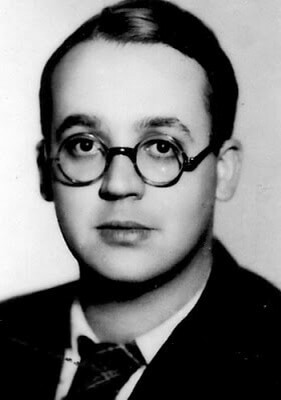

### 1 Front Białoruski

1 Front Białoruski 11 Korpus Pancerny zdobywa Kunowice, jest już 4 km od Odry na drodze do Frankfurtu nad Odrą.

### Dziennik Zachodni

Ukazało się pierwsze wydanie górnośląskiego "Dziennika Zachodniego" (Sosnowiec). Na Wikipedii znajdziemy informację, że "Nazwa dziennika Zachodni związana jest z faktem, iż początkowo gazeta ukazywała na terenie całego Śląska, a także na Ziemiach Zachodnich" otóż nie może to być prawda, bo 6 lutego Wrocław jeszcze nawet nie był w oblężeniu, nie było tam nawet polskich wojsk a co dopiero polskiej administracji, po prostu Górny Śląsk, to były wówczas dla Polski ziemie zachodnie.

Założycielem gazety był Stanisław Ziemba związany z Katowicami dziennikarz, były AK-owiec i powstaniec warszawski.

### Jałta

Trzeci dzień Konferencji Jałtańskiej.

### Wał Pomorski

Zakończyły się walki o Nadarzyce, najmocniej broniony element Wału Pomorskiego. Niemcy zamordowali kilkunastu wziętych do niewoli polskich jeńców.

### ZSRR dekret o internowaniu Niemców

Państwowy Komitet Obrony ZSRR wydał dekret o internowaniu wszystkich Niemców od 17 do 50 roku życia. Skierowanie na roboty przymusowe będzie stanowić częściową rekompensatę strat wojennych. Nie będą się domagać reparacji, sami je sobie wezmą.

Jeżeli chodzi o jeńców wojennych, to nie ma żadnych pewnych liczb. Maksymalną jest 3 mln ludzi, z czego wróciło 2/3, niektórzy dopiero w 1956. Równolegle przeprowadzono i na wschodnich terenach odebranych Rzeszy i w sowieckiej strefie okupacyjnej zorganizowany, masowy rabunek. Zasadniczo im później wzięci do niewoli, tym większa szansa na życie. Najgorzej miała 6 Armia ze Stalingradu, z 90 tys. żołnierzy, którzy wyszli z ruin miasta, do Niemiec wróciło 5 tys.

Sytuacja, w której pełnię realnej władzy w terenie mają sowieccy komendanci trwała na Dolnym Śląsku do 1948, a na obszarze późniejszego DDR do 1949.

### Robert Brasillach

W Fort de Montrouge kilka km na południe od Paryża rozstrzelany został, skazany za kolaborację, francuski intelektualista Robert Brasillach.

Poeta i dramaturg. Wziął udział w delegacji do Katynia, potem napisał reportaż obciążający sowietów. Od 1941 redaktor naczelny pisma "Je suis partout" (pl. jestem wszędzie) reprezentującego środowiska prawicowe popierające kolaborację i Francję Vichy. Ostatni numer ukazał się w sierpniu 1944, kiedy alianci wkraczali do Paryża.

<BoxImageWrapper>

Robert Brasillach (1909-45) 
Źródło: Wikipedia Von Cliché anonyme, l'auteur du portrait n'a JAMAIS revendiqué la paternité de l'œuvre. - www.executedtoday.com, Gemeinfrei, [Link](https://commons.wikimedia.org/w/index.php?curid=24935376)
</BoxImageWrapper>

### Rheintochter

Dwustopniowa sterowana radiowo rakieta plot produkcji Rheinmetall-Borsig. Planowany zasięg: 14 km. Prace nad nią rozpoczęto w 1941. Działający prototyp powstał jesienią 1943. Ośrodek doświadczalny był ulokowany na Łebie tzw. Małe Peenemünde.

Rakieta na paliwo stałe - paliwem był proch bezdymny. Pierwsza wersja R-1 była nieudana. Kolejna R-3 naddźwiękowa miała inną konstrukcję. Pierwszy stopień tworzyły odrzucane dwa silniki, drugi stopień był napędzany paliwem ciekłym. To rozwiązanie też się nie sprawdziło, powrócono do napędu na paliwo stałe.

Ostatecznie prace nad rakietę zarzucono 6 lutego 1945. I nie był to jedyny program rozwoju broni zatrzymany dziś.

### Henschel Hs 117 Schmetterling 

Sterowany radiowo rakietowy pocisk plot zaproponowany przez prof. Herberta A. Wagnera w 1941. Jego najbardziej znanym i zrealizowanym projektem była sterowana radiowo rakieta Henschel Hs 293 służąca do niszczenia okrętów. Był to pierwszy zastosowany bojowo i skutecznie pocisk tego typu. W Zatoce Biskajskiej 25 sierpnia 1943 uszkodził korwetę HMS Bideford. Dwa dni później zatopił HMS Egret.

Pomysł Wagnera początkowo odrzucony, ale wrócono do niego w 1943. Detonator miał być wyposażony w czujnik zbliżeniowy: akustyczny lub fotoelektryczny.

W maju 1944 przeprowadzono 59 prób z tymi rakietami wynoszonymi przez samolot He 111, połowa z nich była udana. W styczniu wykonano prototyp produkcyjny, ale 6 lutego 1945 projekt anulowano.

W zasadzie w całym lotnictwie wstrzymano prace rozwojowe nad wszystkimi nowymi konstrukcjami już (już?) 17 stycznia 1945, polecając skoncentrować wszystkie wysiłki i dostępne jeszcze środki na Me 262 i Heinkel He 162 (Volksjäger).

<SeeAlso txt="Wunderwaffe" url="/festung-breslau/article/wunderwaffe" />

Schmetterling miał mieć dwie wersje: odpalane z ziemi i Hs 117H wystrzeliwane z samolotu nosiciela takiego jak Do 217, Ju 188, lub Ju 388. Tu można by się zapytać: jaki jest sens nazwać rakietę plot Motylem? Może wybuchający pocisk albo samolot tak się komuś skojarzył.

### Lubin

Ostatni kontratak załogi Lubina. [LUBIN 1945 - OSTATNI KONTRATAK](https://www.facebook.com/bobr1945/posts/3396080340505605)

### Brzeg

Przyczółek brzeski został dziś ustabilizowany, po dwóch dniach walk dzięki intensywnemu bombardowaniu artyleryjskiemu Brzeg został zdobyty. Rusza atak na Strzelin.

### Wrocław

Nastroje w mieście stają się coraz gorsze; rozstrzelanie wiceburmistrza Spielhagena było początkiem całej serii publicznych egzekucji urządzanych dla postrachu. Po nim zostali rozstrzelani: jeszcze w styczniu dyrektor rejencji dr Sommer, oraz kierownik obwodowej grupy NSDAP z Kleciny Paul Glückel, 4 lutego burmistrz Kleciny Eugen Pfand, 6 lutego burmistrz Brochowa Bruno Kurzbach, robotnicy przymusowi przyłapani na grabieży, później już zwykli cywile z zupełnie groteskowych powodów jak np. pewien siedemnastolatek, który zapytany czemu jeszcze nie poszedł do Volkssturmu, miał nieszczęście odpowiedzieć, iż "*to nie zmieni losów wojny*". Według oficjalnej propagandy mylił się, i to bardzo, nie można było pozwolić by jego pomyłka stała się powszechna. Mobilizacja stała się powszechnym obowiązkiem, teraz każdy musiał myśleć, mówić i działać w duchu regulaminu polowego z 1908:
>I tak naczelnym wymogiem wojny pozostaje zdecydowanie w działaniu. Każdy, zarówno naczelny dowódca, jak i najmłodszy żołnierz - musi przez cały czas mieć świadomość, że zaniechanie i zaniedbanie bardziej go obciążają niż błąd w wyborze środków.

Volkssturm zajmuje budynki należące do różnych instytucji.

Jest zimno, plus 5 stopni i ciągle pada deszcz. Kopanie umocnień jest męką. Każdy dół wypełnia się błotem. Głębiej ziemia jest wciąż zamarznięta. Dwa dni temu Oberkommando der Wehrmacht (OKW) ogłasza w raporcie stan wznowionej przedwczoraj ofensywy:
>Nad Odrą stoi VI Armia rosyjska szerokim frontem od Gliwic aż do Wałbrzycha. Należy oczekiwać wzięcia Wrocławia w potrzask na linii Oława-Malczyce.

Więc choć Wrocław uwolnił się od niebezpieczeństwa okrążenia z małych, blisko położonych przyczółków, to ogólna sytuacja staje się dramatyczna. O ile nie nastąpi przełom, jeśli siły Armii Czerwonej wciąż będą zdolne do postępów, miasto zostanie okrążone, i to z pozycji leżących zupełnie poza zasięgiem garnizonu wrocławskiego.

W tej sytuacji powracający uchodźcy są coraz większym problemem. Dziś, 6 lutego Gauleitung wydaje na plakatach następujące obwieszczenie:
>Mieszkańcy i mieszkanki Wrocławia! Na dworcach i ulicach wylotowych ciągle spotyka się ewakuowanych już z Wrocławia rodaków, którzy wracają po swoje rzeczy. Ponieważ muszą być wywiezione rodziny z dziećmi, to wracający nie będą już mogli być odwiezieni koleją do swoich miejsc ewakuacyjnych. Służby porządkowe otrzymały zadanie zatrzymania osób powracających bez zezwolenia i wyprowadzania ich piechotą poza obszar twierdzy. W celu uniknięcia osobistych nieprzyjemności należy [...] bezwzględne przestrzegać tego rozporządzenia.

Te ogłoszenia i nakazy będą ponawiane, co dowodzi ich nieskuteczności. Ludzie będą wracać do bezpieczniejszego, jak im się zdaje, Wrocławia, dopóki nie oblegną go zewsząd wrogie wojska. A to nastąpi za dziesięć dni.
