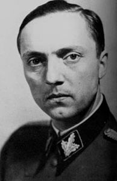

### Elbląg

Podczas walk o Elbląg pocisk artyleryjski zabił Bruno (Alfred) Ehrlicha archeologa i kierownika Muzeum Miejskiego, przewodniczącego Elbląskiego Towarzystwa Starożytności.

### Białe

Niezidentyfikowany bliżej oddział niemiecki zamordował 13 mieszkańców leśnej osady Białe (powiat lubawski), w tym 5 kobiet i 6 dzieci.

### Jałta

Czwarty dzień Konferencji Jałtańskiej.

### Anna Frank

W obozie koncentracyjnym Bergen-Belsen umiera Anna Frank. Nie wiadomo dokładnie kiedy. Przyczyną śmierci jest tyfus, którego objawy wykazywała 7 lutego. Większość ofiar tyfusu umiera w ciągu 12 dni. Czyli najprawdopodobniej do 19 lutego była już martwa.

Niewiele brakowało do ratunku, obie i Anna i Margot Frank miały powody, żeby wierzyć w ratunek, kiedy przybyły do obozu, pierwsze co zobaczyły to brak kominów krematoriów, a więc nie jest to obóz zagłady! Nie ma komór gazowych. Zabiła je zaraza.

Wojska amerykańskie wyzwoliły Bergen Belsen niecały miesiąc później - 15 kwietnia.

### Dolny Śląsk

Po wczorajszym zdobyciu Brzegu atak na Strzelin grzęźnie, ostatecznie nawet nie dotarł do Strzelina, 1 Front Ukraiński na tym odcinku nie jest już w stanie atakować i przechodzi do obrony zdobytego przyczółka.

Przyczółek w Oławie (niem. Ohlau) ustabilizował się. Co do Oławy - według źródeł niemieckich już od 28 lutego w Oławie nie było obrońców, miasto uznano za opuszczone. Pozostawienie Oławy było przedmiotem procesu, kilku dowódców postawiono za to przed sądem polowym, ale zostali uniewinnieni. Na początku lutego miał miejsce niemiecki kontratak, który dotarł na odległość około kilometra od Oławy, ale 4 lutego został odparty i od tego czasu trwało poszerzanie przyczółka. 7 lutego sowieci wyszli poza autostradę aż do Domaniowa (Thomaskirch). Dlatego ta data czasem podawana jest jako moment zajęcia Oławy. Domaniów zaś leży już bardziej na południe od Wrocławia niż na południowy wschód.

Dziś 7 lutego ostatecznie padła niemiecka obrona na odcinku ścinawskim (niem. Steinau). Przed Armią Czerwoną stanęła perspektywa wyjścia na lewy brzeg Odry głęboko za Wrocławiem, zaatakowania Lubina, Legnicy i później zablokowania autostrady RAB 9 Berlin - Wrocław (Reichsautobahn 9). Jutro zaczyna się kolejna wielka ofensywa i z tego odcinka wyjdzie główne uderzenie. Na Berlin!

W nocy jednostki wyznaczone do ataku zajęły pozycje wyjściowe.

### Ofensywa

Opracowane na podstawie: Primke, Szczerepa "Kierunek Festung Breslau":

Jutro nastąpi generalne ponowienie ofensywy albo inaczej rzecz ujmując - po krótkiej przerwie drugi etap ofensywy, której ostatecznym celem jest zajęcie Berlina. Jak sobie przypominamy plan operacji wiślańsko-odrzańskiej zakładał dotarcie do 25 stycznia do Odry utworzenie tam przyczółków i najpóźniej 26 stycznia kolejny rzut ofensywy i w ciągu miesiąca zamknięcie Berlina w oblężeniu.

Pierwszy etap z niewielkim opóźnieniem udało się zrealizować, przerwa przed drugim przeciągnęła się z powodu ograniczeń logistycznych. Na Wiśle były tylko trzy działające mosty kolejowe, infrastruktura na terenach zdobytych była zniszczona i wymagała pospiesznych remontów. Do tego remontowane w pośpiechu odcinki nie miały odpowiedniej wytrzymałości i składy mogły się po nich poruszać bardzo powoli. Pamiętajmy też, że w ogóle lokomotywy parowe wymagają o wiele większej dbałości i odpowiedniego zaplecza. Taka lokomotywa może być w ruchu tylko 8 godzin, a kolejne 8 godzin zajmuje zalanie jej wodą i podgrzanie tej wody.

Dokładnie o zamierzeniach, planach i przebiegu tej ofensywy w jutrzejszym odcinku. Teraz - to co się wydarzyło w związku z nią do 7 lutego 1945.

Armia Czerwona dysponowała już trzema dużymi przyczółkami, które mogły zostać wykorzystane przez większe zgrupowania, od północy:

- **Ścinawa - Chobienia**: 3 Armia Pancerna Gwardii, 4 Armia Pancerna, 3 Armia Gwardii z 25 Korpusem Pancernym, 13 i 52 Armia (bez 73 Korpusu Strzeleckiego) - Szprotawa, Chociebuż (Saksonia, niem. Cottbus), Jüterbog.
- **Malczyce** 6 Armia z 7 Korpusem Zmechanizowanym Gwardii - zamknięcie Wrocławia w oblężeniu od zachodu i zdobycie go
- **Brzeg - Oleśnica** 5 Armia Gwardii z 4 Korpusem Pancernym Gwardii oraz 21 Armia z 31 Korpusem Pancernym - zamknięcie Wrocławia w oblężeniu od wschodu, a potem wyjście nad Łabę

Oprócz tego w rejonie Koźla i Raciborza znajdowało się zgrupowanie oddziałów 59 i 60 Armii, które miało przekroczyć Odrę i nacierać w kierunku Wałbrzycha i Żytawy (Saksonia, niem. Zittau).

Uprzedzając nieco wypadki z wielu przyczyn, tu przede wszystkim należy wymienić słabość strony sowieckiej, stężenie oporu Niemców i szczególnie na kierunku zachodnim sam charakter terenu, zamierzenia strategiczne okazały się nierealne. Szybko ta wielka operacja spadła do rzędu lokalnych starć i stąd obecnie używana nazwa - operacja dolnośląska.

### Przyczółek malczycki

Opracowane na podstawie: Primke, Szczerepa "Kierunek Festung Breslau":

Tutaj trzeba popatrzeć na mapę. Malczyce znajdują się w strategicznym miejscu, na kolanie Odry, która tu skręca z kierunku zachodniego na północny. Właśnie na tym biegu północnym znajduje się przyczółek ścinawski, który do 7 lutego udało się połączyć w cały obszar od Chobieni po Ścinawę i był to główny kierunek ataku na Saksonię.

Natomiast dużo mniejszy przyczółek malczycki zdołała zdobyć 13 Armia w ostatnich dniach stycznia. Rozciągał się od ujścia Kaczawy po Malczyce. Wysunięty był na dwa fronty działania, pierwszy północny na linii Prochowice - Kawice i drugi południowy Mazurowice - Malczyce.

Nie od rzeczy będzie tu wspomnieć o dwóch ważnych obiektach w tym regionie.

Na zapleczu przyczółka znajduje się położony efektownie na wzniesieniu Lubiąż, jeden z ważniejszych ośrodków cysterskich na Dolnym Śląsku i w ogóle największe opactwo cysterskie na świecie, drugi co do wielkości klasztor na świecie. W czasie wojny mieścił się tu ośrodek badawczy i produkcyjny Telefunken.

Same Malczyce były końcem tzw. drogi węglowej. Otóż przed powstaniem kolei zorganizowano pod koniec XVIII wieku regularną magistralę wozów konnych z całym zapleczem do przewozu węgla z Wałbrzycha. W Malczycach węgiel przeładowywano na barki i dalej transportowano drogą wodną. Droga węglowa funkcjonowała prawie sto lat. Kres jej istnieniu położyło dociągnięcie kolei do Wałbrzycha, co udało się zrealizować dopiero w 1877. Dopiero, bo z oporami wywołanymi chęcią utrzymania drogi węglowej.

29 stycznia 6 Armia pod dowództwem generała Głuzdowskiego przebywająca w rezerwie w rejonie Szczercowa (40 km na zachód od Piotrkowa Trybunalskiego) otrzymała rozkaz, aby do 2 lutego ześrodkować się w lasach na północny wschód od Trzebnicy. Armia ruszyła w drogę 30 stycznia. To jest 140 km. W kolejnych dniach zajęła pozycję na zachód od Wołowa: Domaszków, Dębno i przystąpiła do luzowania pozycji zajmowanych przez 13 Armię. Zostało to zakończone 4 lutego i wtedy oddziały 6 Armii przystąpiły do maskowania pozycji i przygotowań do ofensywy.

Szczególnie ważne zadanie przypadło saperom, którzy mieli przygotować odpowiednie przeprawy, przede wszystkim 2 mosty 60-tonowe dla 7 Korpusu. Woda była lodowata, po Odrze pływały kry, które często porywały elementy konstrukcyjne. Saperzy ulokowani w rejonie Lubiąża pracowali nad tym już od 2 lutego.

5 lutego od sztabu 6 Armii dotarł szyfrogram ze sztabu Frontu, który wyznaczał moment rozpoczęcia operacji na 8 lutego.

Wieczorem 6 lutego 7 Korpus Zmechanizowany Gwardii dotarł z rejonu na północ od Oleśnicy. Zajął pozycje w lasach na południe od Wołowa pomiędzy wsiami Krzydlina Wielka i Krzydlina Mała.

Przygotowania do ofensywy nie umknęły uwadze Niemców, którzy zdawali sobie sprawę ze strategicznej lokalizacji przyczółka i chcieli zlikwidować go za wszelką cenę, zanim zostanie wykorzystany. Z drugiej strony: już od 5 lutego sowieci wiedzieli, że szykowany jest kontratak.

Na tym odcinku frontu wszystkie siły niemieckie podlegały 57 Korpusowi Pancernemu generała Friedricha Kirchnera, w składzie 4 Armii Pancernej. Naprzeciwko 6 Armii sowieckiej znajdowały się dwie grupy bojowe:

- "von Loeper" generała Friedricha Wilhelma von Loepera, głównie zbieranina Wehrmachtu i Volkssturm
- "Sachsenheimer" 17 DP generała Maxa Sachsenheimera (znany jest z pomyślnego przeprowadzenia brawurowej Operacji Brunhilda, zniszczenia gazów bojowych w fabryce Anorgana w Brzegu Dolnym - opisanej 4 kutego)

Były to oddziały mocno już przerzedzone i nie przedstawiały wielkiej wartości bojowej. Przewaga sowiecka na tym odcinku zależnie od tego, o czym mowa była przynajmniej pięciokrotna. Obrona niemiecka nie była dobrze przygotowana i składała się z obiektów prowizorycznie przygotowanych. Aczkolwiek jak to się okaże, wiele folwarków zostało zamienionych w bastiony, a siły niemieckie działały w sposób zdyscyplinowany.

Pierwsze uderzenie nastąpiło rano 7 lutego z linii Chomiąża - Rachów - Wilków. Niemcom udało się dotrzeć do Malczyc, ale ich nie zdobyli. Drugi atak nastąpił z rejonu Mazurowic. Po zdobyciu pozycji wyjściowych Niemcy przystąpili do generalnego natarcia na Malczyce z czterech kierunków. Atakujący w sile dwóch batalionów piechoty, do 15 czołgów średnich i dział pancernych przy wsparciu artylerii polowej oraz moździerzy przypuścili całą serię szturmów. Zdobyli Mazurowice. Dotarli do linii kolejowej i zagrozili Malczycom. Tu rozegrała się kluczowa i krwawa batalia. Pomimo zaciekłej walki i dużych strat Niemcom nie udało się zdobyć Malczyc. Decydującą rolę w obronie odegrała artyleria polowa piechoty.

Drugi krwawy bój tego dnia rozegrał się o Kawice. Walczyła tam 103 Brygada Pancerna Wehrmachtu, ale nie udało się jej okrążyć pozycji sowieckich i musiała się wycofać. Później będzie bronić pozycji na autostradzie.

Jak to napisał generał Sachsenheimer:
>Przebieg tych walk pokazał mnie i wyższemu dowództwu, że nieprzyjaciel zdołał już przeprawić znaczne siły przez Odrę w okolicach Malczyc i Lubiąża. Ich pokonanie przy użyciu istniejących oddziałów i broni nie było już możliwe.

Jutro na wątłe niemieckie pozycje spadnie cała 6 Armia.

### Wrocław

Obecna sytuacja wygląda więc tak: na prawym brzegu Odry Armia Czerwona zdobyła absolutną przewagę, ma wreszcie transport kolejowy do Oleśnicy i bezpiecznie może dociągać zaplecze. Posiada również trzy ważne przyczółki bezpośrednio zagrażające miastu: Brzeg odległy od przedmieść Wrocławia 35 km i na tej samej linii odległą zaledwie 20 km Oławę. Łącząc te dwa przyczółki, sowieci wychodzą bezpośrednio na południowe przedpole miasta. Mają też trzeci przyczółek w Ścinawie, który jest co prawda dość odległy od Wrocławia - 50 km w linii prostej - ale umożliwia szybkie zaatakowanie Legnicy i zablokowanie Wrocławia od zachodu. Wciąż groźny jest, wprawdzie niewielki, ale położony zaledwie 10 km od przedmieść Wrocławia przyczółek w Piskorzowicach.

W tej sytuacji oblężenie Wrocławia przez nacierające na wszystkich odcinkach frontu siły sowieckie wydaje się nieuchronne. Miasto pogrąża się w osobliwej kombinacji mobilizacji i chaosu. Formalnie rzecz biorąc pełnię władzy ma Gauleiter Hanke, ale wysiedlenie osiedli na północ od Odry, nastąpiło na rozkaz pełnomocnika Grupy Armii Środek generała Koch-Erpacha; dodatkowo władzę absolutną w dziedzinie obrony miasta (a dziś innych nie ma) posiada również komendant Twierdzy generał Hans von Ahlfen, i to on 7 lutego wydaje rozkaz opuszczenia miasta przez wszystkie kobiety z dziećmi i kobiety powyżej czterdziestego roku życia, zaraz po tym, jak taki sam rozkaz wydaje Gauleitung. Jeżeli dodać do tego fakt, że von Ahlfen został mianowany na to stanowisko na polecenie dowódcy Grupy Armii Środek, wówczas jeszcze generała Schõrnera otrzymujemy przybliżony obraz chaosu kompetencyjnego (przybliżony, bo trzeba by wybiec w przyszłość, żeby zobaczyć, że również Gauleiter, wykorzystując swoje prywatne kontakty, może doprowadzić do zmiany na stanowisku komendanta).

Ksiądz Peikert opisuje narastający terror w mieście. Władze za wszelką cenę usiłowały pozbyć się cywilów. Najwidoczniej wczorajsze obwieszczenie Gauleitung to za mało, bo dziś, 7 lutego komendant miasta Hans von Ahlfen wydaje rozkaz:
>Wszystkie kobiety z dziećmi oraz kobiety powyżej czterdziestego roku życia muszą opuścić Wrocław.

Dowódca wrocławskiej SD zastrzelił dwóch Polaków pod zarzutem plądrowania (Malczyk i Krycia). Pod zarzutem włamywania się do opuszczonego mieszkania i kradzieży żywności i firanek rozstrzelano Marię Bramer i Walli Langer.

### Werner Naumann

Ponieważ front ognia i stali zbliża się coraz bardziej do Wrocławia i otacza go niepowstrzymaną falą, wszystko staje się frontem, polem walki. Następuje nadzwyczajne wzmożenie na froncie ideologicznym, zgodnie z doktryną "*Räder müssen rollen für den Sieg*" (pl. koła muszą się toczyć dla zwycięstwa), nawet najmniejszy trybik ma znaczenie w sytuacji, kiedy tych kół, trybów i trybików jest coraz mniej. Właśnie dlatego dziś do Wrocławia bezpośrednio z Berlina przyleciał Werner Naumann, sekretarz stanu w Ministerstwie Propagandy Rzeszy. Ernst Hornig pisze o nim:
>był najbliższym współpracownikiem Josepha Goebbelsa, człowiekiem, który do końca żył w iluzorycznym świecie marzeń. Nie bez powodu Hitler wyznaczył go w swoim testamencie na następcę Goebbelsa w Ministerstwie Propagandy Rzeszy.

<BoxImageWrapper>

Werner Naumann (1909-82) 
Źródło: [1945-03-23 - Staatssekretär Werner Naumann im Münchner Hofbräuhaus - Ausschnitt 2 (53s)](https://archive.org/details/19450323StaatssekretaerWernerNaumannImMuenchnerHofbraeuhausAusschnitt253s)
</BoxImageWrapper>

Naumann jest Ślązakiem, urodził się w Górze (niem. Guhrau) i studiował ekonomię polityczną. Już w 1928, w wieku 19 lat, przyłączył się do narodowych socjalistów. Przez kilka lat był w SA, ale w 1933 przeszedł do SS, a później do pionu ściśle ideologicznego. W 1937 był szefem biura propagandy wrocławskiego oddziału NSDAP, a rok później został współpracownikiem Josepha Goebbelsa i po czterech latach, w 1942 zostaje jego asystentem. Teraz jeździ po miastach ogłoszonych Twierdzami i wygłasza płomienne przemówienia. Kiedy sowieci ruszyli, 12 stycznia był w Poznaniu. Dziś Poznań jest w oblężeniu, a Naumann we Wrocławiu zapewnia "*że front wschodni nigdy jeszcze nie był tak silny jak teraz, że zakończy on marsz Rosjan, mówił także o nowych armiach i nowych rodzajach broni oraz o pewnym zwycięstwie*" (Hornig), jego przemówienie kończy stanowcze stwierdzenie, które równie dobrze mogłoby być bezpośrednim cytatem z przemówienia gauleitera Hanke: "*Wrocław musi być, niezależnie od okoliczności, utrzymany do ostatniego żołnierza*". Dziś niestety dla Wrocławia i jego mieszkańców każdy jest żołnierzem Rzeszy, a "niezależnie od okoliczności" oznacza zarówno odejście od wojskowej oceny sytuacji, jak i zdrowego rozsądku.

### Herta Dietze

Ale byli ludzie, którzy go jeszcze nie zatracili, wikariuszka Herta Dietze uruchomiła dziś w Ewangelickim Konsystorium przy pl. Wolności 8 (niem. Schloßplatz) dom starców, przeznaczony dla starszych ludzi, którym trudno było sobie poradzić w obecnej sytuacji.

Podobną funkcję pełnił szpital Bethesda należący do domu macierzystego Lehmgruben na ul. Dyrekcyjnej (niem. Gustav-Freytag-Straße). Zajmował się osobami starszymi, chorymi i rannymi z Volkssturmu. Dopóki działała kolej, gromadzono ich w grupy i wysyłano do Berlina.

Przy okazji wyzwolenia KL Auschwitz opisałem pokrótce przebieg Holokaustu we Wrocławiu i napisałem, że znam tylko jeden przypadek kiedy to ktoś we Wrocławiu pomaga wrocławskim Żydom, ratuje ich. W skrócie wyglądało to tak: we Wrocławiu, kiedy Hitler doszedł do władzy, było 30 tys. Żydów (średnia dla okresu od początku XIX wieku to było 5% populacji miasta). Przez cały okres prześladowań hitlerowskich do 1939 2/3 Żydów wyemigrowało. Pozostałe 10 tys. w ciągu niecałych dwóch lat wywieziono na śmierć. Najsmutniejszą prawdą o przedwojennych wrocławianach jest fakt, że wywiezienie na śmierć 10 tys. ludzi odbyło się w zupełnej obojętności. Nikt ich nie próbował ratować. Jedynym znanym mi wyjątkiem jest Herta Dietze.

Herta Dietze była zaangażowana również w jeszcze jedną operację, ściśle tajną, częściowo półlegalną a częściowo będącą wręcz zdradą stanu. Otóż jeszcze w 1941 Rada Kościoła Wyznającego skierowała ją do służby pomocniczej w parafii św. Barbary. Korzystając z tej funkcji, opiekowała się tzw. niearyjskimi członkami gminy (ewangelicy pochodzenia żydowskiego dla Gestapo byli takimi samymi Żydami).

Do jesieni 1941 robiła to Katharina Staritz, ale list, jaki rozesłała do pastorów, z apelem by opiekować się luteranami pochodzenia żydowskiego i dopuścić do nabożeństwa ludzi zmuszonych do noszenia Gwiazdy Dawida, doprowadził do usunięcia jej z posługi. Potem 18 grudnia 1941 opublikowano złośliwy artykuł o niej zatytułowany "Frau Knöterich". Musiała opuścić Wrocław. Została uwięziona w KL Ravensbrück. Tylko dzięki wstawiennictwu dobrze usytuowanych przyjaciół została wypuszczona w maju 1943. Izolowana i zmagająca się z depresją nie miała już możliwości działania. O Katharinie Staritz trzeba będzie napisać więcej szerzej kiedy indziej, to osobny i rozległy temat.

Pomimo tego, co spotkało Katharinę, dzielna Herta Dietze kontynuowała w największej tajemnicy jej dzieło. W tajemnicy również przed własnym kościołem, bo konsystorz zabronił udzielania pomocy "niearyjskim chrześcijanom", w tej sytuacji Kościół Wyznający stał się konspiracją wewnątrz organizacji oficjalnie akceptującej politykę nazistowską. To za jego zgodą i w ścisłym kontakcie z pastorem Ernstem Hornigiem pomagała zarówno luteranom pochodzenia żydowskiego, jak i Żydom. Jeszcze przed zamknięciem oblężenia wywiozła koleją z Wrocławia kilka osób poszukiwanych ze względu na pochodzenie przez gestapo, a raz w przebraniu siostry Czerwonego Krzyża ciężarówka wywiozła Żyda z żoną do Lądka-Zdroju (niem. Bad Landeck), zasłoniła jego Gwiazdę Dawida opatrunkiem. Później udało im się wyjechać w głąb Niemiec.

### Odnośniki

- dzieje.pl Tomasz Bonek, Marta Ringart-Orłowska [„Lubiąż. Klasztor mrocznych tajemnic”](https://dzieje.pl/ksiazki/lubiaz-klasztor-mrocznych-tajemnic)
