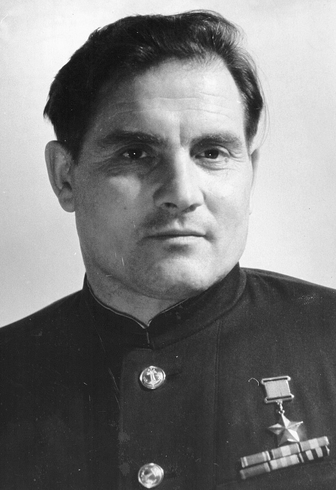

### Uznam

Dziś miała miejsce z pewnością najdziwniejsza ucieczka z obozu koncentracyjnego.

13 lipca 1944 Niemcy zestrzelili w okolicy Lwowa sowieckiego asa myśliwskiego Michaiła Diewiatajewa latającego często używaną w Armii Czerwonej amerykańską P-39 Airacobrą.

Po pierwszej nieudanej próbie ucieczki został skierowany do obozu koncentracyjnego Sachsenhausen, gdzie czekała go śmierć. Udało mu się jednak sprytem oszukać system obozowy i zamiast tego został skierowany do zwykłego (i również niezwykłego) obozu pracy Karlshagen I na wyspie Uznam. Więźniowie pracowali przy konstrukcji V1 i V2.

Ponieważ wiedział, że tylko do dwóch razy sztuka, długo i starannie przygotowywał się do drugiej ucieczki. Analizował części samolotowe i uczył się pilotażu nowej maszyny. Z grupą 10 więźniów porwał z lotniska w Peenemünde He 111 i przeleciał na wschodnią stronę.

Ponieważ dał się pojmać do niewoli, mógł zostać oskarżony o zdradę, ale udało mu się przejść proces filtracji i potem został współpracownikiem i pomocnikiem Korolowa badającego hitlerowską bazę rakietową w Peenemünde.

W październiku 1945 został zdemobilizowany. Dzięki wstawiennictwu Korolowa w 1957 dostał Złotą Gwiazdę Bohatera Związku Radzieckiego. Korolow - jeżeli ktoś nie wie - to sowiecki von Braun.

Natomiast komendant obozu rozkazem Göringa został zdegradowany, a potem rozstrzelany.

<BoxImageWrapper>

Michaił Pietrowicz Diewiatajew (1917-2002) 
Źródło: Wikipedia - Автор: неизвестен - [http://100.tatarstan.ru/rus/devyataev-mihail-petrovich.htm](http://100.tatarstan.ru/rus/devyataev-mihail-petrovich.htm), Добросовестное использование, [Ссылка](https://ru.wikipedia.org/w/index.php?curid=8049035)
</BoxImageWrapper>

Podobna historia wydarzyła się 23 listopada 1941, kiedy to dwóch lotników niemieckich, Heinz Schnabel i Harry Wappler, niepostrzeżenie uciekło z obozu jenieckiego. Mieli fałszywe papiery Duńczyków służących w RAF i dostali się do bazy lotniczej RAF Kingstown. Tam udało im się porwać samolot treningowy Miles Magister. Większość drogi do okupowanej przez Niemcy Holandii przebyli, ale brak paliwa zmusił ich do wycofania się znad Kanału. Znaleźli jakieś miejsce do lądowania i cały czas trzymając się swojej legendy, nie tylko nie wzbudzili podejrzeń, ale spowodowali, że udzielono im pomocy. Z powodów logistycznych zatankowanie było możliwe dopiero następnego dnia. W tym czasie dotarł alarm o porwanym samolocie i tak dobra passa się skończyła. Zostali aresztowani. Przekazując ich żandarmerii RAF, oficer policji powiedział: "*I'm sorry gentleman, you deserve better luck*". Obaj dostali karę 28 dni izolatki, potem przeniesiono ich do Kanady.

- [Mark Felton Productions "German POWs Stole British Plane!" [YT 13:18]](https://www.youtube.com/watch?v=QtngxfLQ9o0)
- [Heinz Schnabel and Harry Wappler escape attempt](https://en.wikipedia.org/wiki/Heinz_Schnabel_and_Harry_Wappler_escape_attempt)

### Jałta

Piąty dzień Konferencji Jałtańskiej. Podsumowanie za trzy dni, 11 lutego.

### Iskań

We wsi Iskań w powiecie przemyskim, nieznani sprawcy, najprawdopodobniej oddział Ludowej Straży Bezpieczeństwa dowodzony przez Romana Kisiela "Sępa" zamordował w przysiółku Chałupki 16 Ukraińców (8 kobiet i 6 dzieci; 2 kolejnych dzieci zmarło później od ran). Ocalała Katarzyna Hnatyk z córką oraz trzech chłopców. Schowali się pod mostem. Wszystkie ofiary pochowano w zbiorowej mogile.

### UPA

Przed wojną Hleszczawa (w dawnym powiecie trembowelskim województwa tarnopolskiego) była dużą wsią liczącą ponad 2 tys. mieszkańców, z tego 2/3 Ukraińców, Polaków było ok. 600. Do tego w pobliskim chutorze Stadnica żyło 20 rodzin polskich oraz 8 mieszanych polsko-ukraińskich. Wieś była silnym ośrodkiem OUN.

W 1944 miały miejsce dwa ataki na Polaków, w których zabito w sumie 40 osób. Po przejściu frontu wyniku poboru wieś została pozbawiona Polaków zdolnych do służby wojskowej. Część polskiej mniejszości przeniosła się do miejscowości uznanych za bardziej bezpieczne. Ci którzy zostali, spali w przygotowanych kryjówkach.

Dzisiejszej nocy sotnia prowidnyka Stepana Samecia z Hleszczawy uprowadziła ze wsi i zamordowała 37 Polaków.

Następnego dnia przeprowadziła przeszukanie Stadnicy i zamordowała większość ze schwytanych 20 Polaków.

Za cztery dni, 12 lutego przybędzie grupa operacyjna NKWD, wydobędzie ciała ze studni i przeprowadzi śledztwo. Za sześć dni 14 lutego dokona pacyfikacji Hleszczawy, w 3-godzinnej walce zabijając 37 ludzi i 5 biorąc do niewoli. Samecia rozstrzelali.

Lista polskich ofiar w obu miejscowościach liczy 123 osoby, z tego jedną NN. Pomordowanych pochowano w zbiorowej mogile na cmentarzu w Hleszczawie.

Władysław Biliński:
>Tej nocy wiele polskich rodzin spało u swych przyjaciół sąsiadów na strychach w większości za ich wiedzą, ale też zdarzało się, że i bez ich wiedzy. Nasza rodzina spała na strychu u sąsiada Ukraińca Wasyla Ptaszyńskiego. 
>[...] Tej nocy banderowcy przyszli również i tu. Zatrzymali się w sieni i wypytywali Wasyla, czy nie wie, gdzie są kryjówki Polaków-sąsiadów, a kiedy on powiedział, że nie wie, wtedy banderowiec powiedział mu: »Wasylu u tebe spiut proklatyje Lachy!« On im na to: »Ja bohater! Ja walczyłem razem z Michałem Bilińskim z bolszewikami i nie wahałbym się go ukryć przed wami, to mój przyjaciel. Ale on dziś nie wierzy mi i boi się mnie tak samo, jak was, młodych Ukraińców. Jeśli mi nie wierzycie, to szukajcie!

>Jedynym środkiem dającym pewność przeżycia były kryjówki nocne i dzienne, stałe zmiany miejsc pobytu w rejonie i poza rejonem wsi. Pomagali nam przeżyć nasi sąsiedzi Rusini-Ukraińcy, często nas ostrzegając lub udzielając schronienia przed banderowcami.

### Wał Pomorski

Zwycięstwa wojsk polskich w bitwach pod Jaksicami i o Dobrzycę (5-8 lutego) w trakcie walk o przełamanie Wału Pomorskiego.

- [Wrak SU-85, o numerze bocznym 311, z 13 warszawskiego pułku artylerii pancernej Wojska Polskiego na Wschodzie, które 8 lutego 1945 r. zostało zniszczone w Rudkach na Wale Pomorskim. W dziale tym spłonęła żywcem cała, ciężko ranna załoga: por. Szczepan (Szymon) Szpak (dowódca), sierż. Stanisław Rospond (mechanik-kierowca), sierż. Hajemaglin Mułagaliew (działonowy) oraz sierż. Arkadie Briuchow (ładowniczy). Pogrzeb dowódcy odbył się 9 lutego 1945 r., resztę załogi pochowano natomiast dzień później.](https://www.facebook.com/groups/837847453218455?multi_permalinks=1787192868283904)

### 1 Front Ukraiński

1 Front Ukraiński rozpoczyna operację dolnośląską. Tak jak pamiętamy ofensywa rozpoczęta 12 stycznia - operacja wiślańsko-odrzańska miała być pierwszym z dwóch etapów wielkiej operacji, która zakończy wojnę przez dotarcie do Berlina. Jej zadaniem było uzyskanie przyczółków na Odrze - to miało zająć 15 dni. Potem bez przerwy operacyjnej, miała się zacząć trudniejsza część zaplanowana na 30 dni zakończona dotarciem (to w gorszej wersji), lub zdobyciem (w lepszej) Berlina.

Pierwsza część jest prawie udana, osiągnięto zamierzone cele, co prawda zajęło to nie 15 dni, ale licząc jednak niezbędną przerwę operacyjną prawie miesiąc - 27 dni.

Niemcy są w zasadzie pokonane, nie mają już źródeł paliwa ani przemysłu wojennego, nie mają już jak pobierać rekruta ani nawet czasu, żeby go wyszkolić. Luftwaffe już nie stanowi żadnego zagrożenia. Armia pancerna topnieje. Alianci zachodni i sowieci walczą już wyłącznie w Rzeszy. Niestety jako strona atakująca są zmuszeni do większego wysiłku i ponoszą większe straty. Przerwa operacyjna była niezbędna, straty sowieckie: ranni, zabici, zaginieni to była ponad połowa składu jednostek. Stracono też ogromne ilości sprzętu wojennego, Na dziś z 3661 czołgów i dział pancernych, którymi 1 Front Ukraiński dysponował na początku ofensywy ma już tylko 2215. To oznacza 40% strat. Część z nich to pojazdy, które da się naprawić, ale doświadczonych i zgranych załóg do nich już nie ma.

Nieprzyjaciel również skorzystał z przerwy w działaniach wojennych. Dociągnął nowe jednostki, uzupełnił straty i przygotował się do obrony. Po dwóch latach cofania się kolejne linie oporu do perfekcji opanowali budowę drewniano-ziemnych umocnień i różnego rodzaju pułapek dla nacierającej piechoty. Pogoda już nie przeszkadza w kopaniu w ziemi. Niemiecka 4 Armia Pancerna została odbudowana i umocniła się na pozycjach obronnych. Czy uda się doskoczyć w kolejne 30 dni do Berlina?

Uprzedzę wypadki i od razu odpowiem, że nie. Armia Czerwona nadal jest zbyt wyczerpana, zbyt słaba żeby powtórzyć sukces z połowy stycznia. To natomiast co się uda w zakresie działań 1 Frontu Ukraińskiego to zdobycie większości celów operacyjnych na obszarze Dolnego Śląska. I właśnie dlatego wielka operacja wojskowa trwająca w dniach 8-24 lutego zamierzona jako doskok do Berlina nosi nazwę operacji dolnośląskiej. Początkowo miała to być operacja berlińska. Tę jednak uda się rozpocząć dopiero w połowie kwietnia, za kolejne dwa miesiące.

### Operacja dolnośląska

Przy bardzo złej widoczności, bez wsparcia lotniczego i ze słabym wsparciem artyleryjskim ruszyła ofensywa, która już od początku zakładała 3 kierunki natarcia:

- lubińsko – żagańsko – gubiński (priorytetowa linia natarcia Szprotawa - Chociebuż - Jüterbog, zobaczmy jak blisko Berlina, tam Koniew skierował najlepsze jednostki)
- legnicko – bolesławiecko – zgorzelecki (osłona lewej flanki głównego uderzenia)
- wrocławski: i tu się zaczyna ostatnia epopeja 6 Armii, która razem z 7 Korpusem Zmechanizowanym Gwardii z rejonu przyczółka malczyckiego ma od zachodu doprowadzić do okrążenia Wrocławia i zdobyć go

Szczególnie natarcie z przyczółka ścinawskiego przygotowane było z wielkim rozmachem. Od początku wszystko idzie źle, nie udaje się przełamać niemieckiej obrony na głównym kierunku natarcia od Ścinawy, Niemcy systematycznie wycofują się na kolejne linie obrony. Ze względu na roztopy idzie wyjątkowo opornie. Dziś udało się posunąć zaledwie o kilka km na zachód. Jutro uda się zdobyć Polkowice i dotrzeć do Przemkowa.

Wtedy doprowadzając do okrążenia Lubina, udało się go zdobyć. To w dwa dni kilkanaście kilometrów. Co gorsza, mieli przed sobą ogromne kompleksy leśne i bagna. Niewielkie, ale liczne przeszkody wodne. Na każdej pozycji obronnej Niemcy mieli przygotowaną ucieczkę.

Do tego po rozwinięciu ataku zagrażała im wciąż mające potencjał ofensywny zgrupowanie niemieckie w twierdzy Głogów.

Jeszcze gorzej poszło na lewym skrzydle atakującym w kierunku na Lubin.

Uderzenie od Oławy w stronę Wrocławia osiąga linię Zakrzów (nad Odrą) - Zabardowice - Zakrzówek. Popatrzmy na mapę. To też kilka km.

Kapitan Gwardii Iwan Malutin
>Przez cały czas od wyruszenia znad Wisły nie otrzymaliśmy żadnego większego uzupełnienia w ludziach i uzbrojeniu. Ze szpitali polowych wróciło kilku wyleczonych żołnierzy – i to było wszystko. W momencie wyruszenia do natarcia w dniu 8 lutego, stan mojego batalionu wynosił 7 oficerów, 174 podoficerów i szeregowców. Stanowiło to mniej więcej jedną trzecią stanu etatowego batalionu. Dość powszechna była jednak w tych dniach wiara, że po pokonaniu ostatniej wielkiej przeszkody wodnej, zagradzającej drogę do serca Niemiec, w postaci Odry – wystarczy jeden wysiłek – i będzie już po wojnie.

- Walki o Grodków. [BÓJ PANCERNY O STARY GRODKÓW (ALT GROTTKAU)](https://www.facebook.com/bobr1945/posts/3777507549029547)

### Przyczółek malczycki

Opracowane na podstawie: Primke, Szczerepa "Kierunek Festung Breslau":

Rano o godz. 0930 po 50-minutowym przygotowaniu artyleryjskim ruszyła ofensywa 6 Armii. Pięć minut wcześniej rozpoczęto udaną operację zadymiania.

Na prawej flance na Legnicę nacierał 22 Korpus Strzelecki. Na lewej w kierunku na południe, południowy zachód 74 Korpus Strzelecki.

W rejonie Prochowic 309 Dywizja Strzelecka napotkała silny opór batalionu piechoty wsparty pojazdami pancernymi, ale wkrótce potem zdobyła Prochowice. Do godz. 1500 zajęła również Kwiatkowice, Prochowice, Motyczyn i Golankę Dolną. Później wzmocniona 291 Pułkiem Artylerii Pancernej Gwardii dotarła aż na przedpole Kunic. Jest to już ostatnia miejscowość przed Legnicą. Wzięci jeńcy potwierdzili, że oddziały niemieckie na tym odcinku składają się z Volkssturmu, jednostek zapasowych, tyłowych i zebranych z żołnierzy wypisanych ze szpitala. Późniejsze analizy wykazały, że sukces Armii Czerwonej był możliwy dzięki temu, że bataliony szturmowe wyposażone były w armaty 45 i 76 mm, co umożliwiało szybkie niszczenie punktów oporu bez wielkich strat własnych.

218 Dywizja Strzelecka korzystając z pozycji zajętych przez 309 Dywizję i do godz. 1800 dotarła do linii Grzybiany - Rosochata - Piotrówek Legnicki - Wągrodno.

Pozycje niemieckie były słabe i Niemcy cofali się do Legnicy.

Na lewej flance 74 Korpus Strzelecki miał rozkaz nacierać na linii Dąbie - Lasowice - Środa Śląska.

359 Dywizja Strzelecka po zdobyciu Komorników i Rui osiągnęła rubież Polanka - Tyniec Legnicki.

181 Dywizja Strzelecka nacierała w kierunku na Lasowice i Rusko. Do końca dnia 74 Korpus Strzelecki zdobył rubież Malczyce - Lasowice.

7 Korpus Zmechanizowany Gwardii był poważną siłą pancerną, którą generał Głuzdowski chciał wykorzystać do szturmu na Wrocław, ale dowództwo Frontu wyraźnie postawiło mu inne zadanie. Jeżeli chodzi o pierwszy dzień operacji, było to, po opanowaniu przedpola Malczyc przez piechotę, przełamanie na kierunku na Kostomłoty - Kąty Wrocławskie opanowanie przepraw na Bystrzycy i docelowo zamknięcie oblężenia przez spotkanie z jednostkami 5 Armii nacierającej od wschodu. Poważnym problemem dla pojazdów pancernych były roztopy, co oznaczało, że jednostki zmotoryzowane mogą poruszać się tylko po drogach bitych, a więc ich ruch i kierunek natarcia jest przewidywalny.

24 Brygada Zmechanizowana Gwardii w Motyczynie wsparła piechotę, rozbijając silny punkt oporu, były tam armaty Flak 18. Potem nacierała w kierunku na Rogoźnik - Piotrówek Legnicki - Biernatki. W Rogoźniku również użyto armat 88 mm. Ale i tu przełamano opór. Nacierając za wycofującym się przeciwnikiem, czerwonoarmiści wdarli się do Biernatek i zdobyli je. Potem przecięli autostradę (obecną A4, wówczas RAB 9, czyli Berlin - Wrocław; na wschód od Wrocławia RAB 29), o którą rozgorzał bój pancerny. Autostrady broniły niemieckie czołgi, które być może z racji ciemności określono Tygrysami, ale najpewniej były to PzKpfw IV.

W ślad za 24 Brygadą ruszyła 57 Brygada Pancerna oczyszczając zaplecze z pozostałych sił niemieckich. W Komornikach, jak to określono we wniosku nagrodowym, 34-ka Aleksieja Wasilijewa:
>rozstrzeliwała z kaemu i rozjeżdżała niemieckie gady. Zlikwidowano do plutonu fryców, stanowisko karabinu maszynowego i trzy stanowiska moździerzy.

Sztab 7 Korpusu został ulokowany w Kawicach.
>Tu wszędzie dookoła toczyły się walki. Walały się trupy faszystów, rozciągał się dym pożarów, a z naprzeciwka szli uradowani oswobodzeni Rosjanie, Ukraińcy, Białorusini, Polacy, Francuzi, Włosi, dla których skończyła się niemiecka niewola.

Znaczący sukces tego dnia upewnił czerwonoarmistów, że wszystko idzie zgodnie z planem i jutro spotkają się z nacierającą od wschodu 5 Armią Gwardyjską. Ta jednak uzyskała niewielkie postępy. Prowadzi ciężkie walki z 254 DP niemiecką. 8 lutego jest na linii Czernica - Marcinkowice - Skrzypnik - Wyszkowice - Wiązów - Młodoszowice.

Jutro pancerniaków 7 Korpusu czekają dwie przykre niespodzianki.

- Od 8 do 15 lutego 7 Korpus Zmechanizowany Gwardii nacierając na Wrocław z kierunku Malczyc, stracił 139 czołgów T-34-85, w tym 72 całkowicie zniszczonych, 14 dział pancernych ISU-122, 12 dział samobieżnych SU-85 i 8 SU-76. [Natarcie na Festung Breslau – straty 7 Korpusu Zmechanizowanego Gwardii.](https://www.facebook.com/bobr1945/posts/3335714569875516), [Pomiędzy Legnicą a Wrocławiem – problemy techniczne dział pancernych ISU-122.](https://www.facebook.com/bobr1945/posts/3382848415162131)

### Hitler

W dowództwie niemieckim pojawia się zwątpienie w sens obrony izolowanych twierdz takich jak Głogów, czy Wrocław. Nawet generał Schörner przychyla się do tej propozycji, jednak kiedy przedstawia ją Hitlerowi, ten stanowczo odmawia. Każda Twierdza musi się bronić do ostatniego żołnierza.

Jak widać do tej pory była szansa na uratowanie Wrocławia. Teraz została stracona. To rozkaz Hitlera.

### Wrocław

SS Besslein odbił przyczółek w Piskorzowicach. Ze 120 żołnierzy 11 kompanii do garnizonu powróciło tylko 26.

Verton cytuje von Ahlfena:
>Eliminacja przyczółków koło Piskorzewic została skutecznie przeprowadzona 8 lutego przez najlepiej zorganizowany pułk garnizonu. Waffen – SS Besslein. Wiele prób dokonywanych przedtem nie powiodło się. Dzielność przejawiana przez wojska i niezbędne wsparcie, jakiego udzieliły, wywodzi się z wypróbowanych wzorów połączenia zręczności i taktyki na linii ognia. Sukces pod Piskorzewicami miał i ma symboliczne znaczenie. Cały garnizon znalazł wiarę w siebie, w innych i swoich oficerów. Bez tego nie możemy przetrwać.

W walkach o wioskę, której nawet nie ma na mapie, zginęło 94 ze 120 żołnierzy kompani.

Von Ahlfen o walczących w Piskorzowicach:
>Wśród nich był żołnierz, który od czasu kiedy go widziałem po raz ostatni, osiwiał w ciągu jednej nocy. Oderwany od swej jednostki, całkiem samotny, ukrywał się na poddaszu stajni, którą grupa Rosjan uczyniła swoją kwaterą. Leżał tam przez następne dni w strachu, ze zostanie przez nich wykryty i ze strachu przed tym, co oni z nim zrobią. Przez szpary między deskami obserwował ich wybryki w stanie całkowitego odurzenia alkoholowego. Musiał słuchać ich śpiewów. Czerwoni żołnierze zabawiali się, pijani nie zdawali sobie sprawy z jego obecności. W końcu wynieśli się. Był wdzięczny losowi, ze nie podpalili stajni, wdzięczny i posiwiały.

- Straty po stronie sowieckiej: [Zagłada 2 batalionu strzeleckiego – Piskorzowice – Pisarzowice. - ""cały batalion w nierównym i zaciętym boju w okrążeniu uległ zagładzie" Przeżyli nieliczni, którzy w następnych dniach przedarli się do radzieckich pozycji na przyczółku nad brzegiem Odry. W nocy z 4 na 5 lutego osiągnął je trzykrotnie ranny dowódca zniszczonego batalionu kapitan Chomenko."](https://www.facebook.com/bobr1945/posts/3891105417669759)

### Peikert

Dzisiaj ksiądz Peikert kończy zapisywać bardzo długą relację z całego ubiegłego tygodnia, która brzmi jak skarga. Możemy wyobrazić sobie, jak zmęczony i wstrząśnięty przeżyciami znajduje w sobie siłę i odwagę, by słowo po słowie zdać relacje z koszmaru twierdzy, od dziś relację prowadzi już regularnie, niemal dzień po dniu:
>Urzędnik policji z pewnego obwodu doniósł mi, że w jego rewirze naliczono w ostatnich 10 dniach 60 samobójstw. Także w mojej parafii przy Garvestrasse odnaleziono w mieszkaniu kilka rodzin zatrutych gazem,[...] Mój kościelny, zatrudniony przy transportowaniu zwłok na cmentarz grabiszyński, doniósł mi, że jednego dnia zastano sześciu rozstrzelanych żołnierzy w mundurach oraz dwie osoby ścięte. Następnego dnia zastano 36 rozstrzelanych kobiet, prawdopodobnie cudzoziemki lub Żydówki.

### Hanna Reitsch

Hugo Hartung 8 lutego donosi z lotniska Strachowice:
>Dzisiaj przybyła tu pilotka Hanna Reitsch. Dzisiaj napisano w gazecie, że teraz wszystkie matki z dziećmi oraz kobiety poniżej czterdziestki muszą opuścić miasto. Gdy to piszę, nasza ciężka artyleria dudni tak, że aż drżą okna baraku? (Dopiero później dowiedzieliśmy się, że to grzmiały rosyjskie działa, bo na froncie pod Breslau w ogóle nie było niemieckiej ciężkiej artylerii.

Być ze stresu Hartung popełnia tu pomyłki, jest wszak cywilem powołanym do wojska i właśnie znalazł się w strefie frontu: jedna pomylenie własnej ciężkiej działającej w oddali artylerii z artylerią nieprzyjaciela, który zbliżył się do miasta - to świadczy o tym, jak błędną ocenę sytuacji mieli wrocławianie, poza tym Steinau, czyli Ścinawa nie leży na północny wschód tylko na północny zachód od Wrocławia. Ponadto chodzi oczywiście o kobiety powyżej 40.

A swoją drogą - tego że "na froncie pod Breslau w ogóle nie było niemieckiej ciężkiej artylerii" nie dowiedzielibyśmy się w ogóle ze wspomnień Ahlfena.

Nieprzypadkowo Hartung w ogóle nie wyjaśnia kim była Hanna Reitsch, wtedy wiedział to każdy Niemiec:

<SeeAlso txt="Kapitan Hanna Reitsch (1912-79)" url="/festung-breslau/article/hanna-reitsch" />

Nie wiadomo dlaczego Hanna Reitsch przylatuje do Wrocławia, ale może było to związane z ewakuacją jej rodziny ze Śląska do zamku Leopoldskron w Salzburgu (Austria, przy granicy z Bawarią).

Kiedy do zamku dotarły pogłoski, że nie jest to bezpieczne miejsce, bo uciekinierzy mają być przekazani władzom sowieckim, ojciec Hanny w nocy 3 maja zastrzelił żonę, później córkę i trójkę jej dzieci a na końcu siebie. Hanna zaś, choć miała 33 lata, kiedy zakończyła się wojna, nigdy nie wyszła za mąż i umarła bezdzietnie. Do swoich ostatnich lat prowadziła aktywne życie i latała. Była nie tylko uzdolnionym pilotem-oblatywaczem i jedną z "kobiet Hitlera". Była również wybitnym sportowcem, ustanowiła ponad 40 rekordów lotniczych, niektóre z nich wciąż są ważne. I do końca życia zażartą hitlerówą.